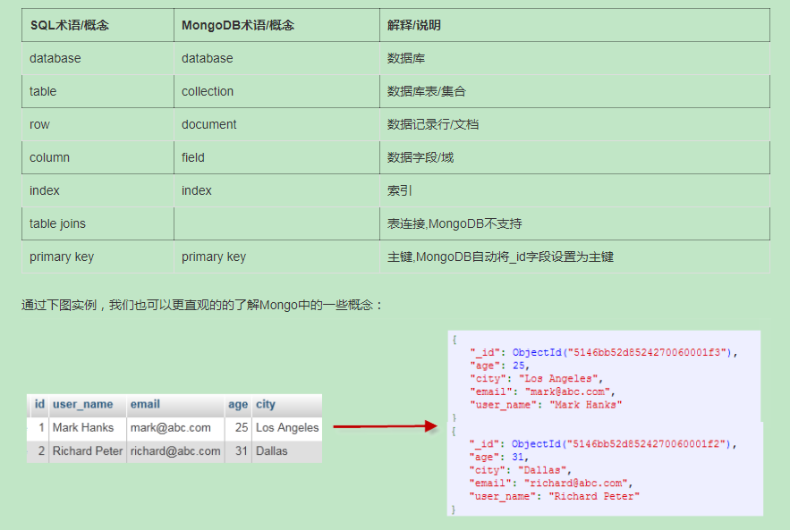

# MongoDB

[toc]

## temp

### 简介

关系数据库十分流行，遵循ACID特性。

分布式系统由多台计算机和通信的软件组件通过计算机网络连接组成。

NoSQL 用于超大规模数据的存储，数据存储不需要固定的模式，无需多余操作就可以横向扩展

RDBMS vs NoSQL

**RDBMS**
\- 高度组织化结构化数据
\- 结构化查询语言（SQL） (SQL)
\- 数据和关系都存储在单独的表中。
\- 数据操纵语言，数据定义语言
\- 严格的一致性
\- 基础事务

**NoSQL**
\- 代表着不仅仅是SQL
\- 没有声明性查询语言
\- 没有预定义的模式
-键 - 值对存储，列存储，文档存储，图形数据库
\- 最终一致性，而非ACID属性
\- 非结构化和不可预知的数据
\- CAP定理
\- 高性能，高可用性和可伸缩性

在计算机科学中, CAP定理（CAP theorem）, 又被称作 布鲁尔定理（Brewer's theorem）, 它指出对于一个分布式计算系统来说，不可能同时满足以下三点:

- **一致性(Consistency)** (所有节点在同一时间具有相同的数据)
- **可用性(Availability)** (保证每个请求不管成功或者失败都有响应)
- **分隔容忍(Partition tolerance)** (系统中任意信息的丢失或失败不会影响系统的继续运作)

### 概念解析

#### 数据库

数据库名可以是满足以下条件的任意UTF-8字符串。

- 不能是空字符串（"")。
- 不得含有' '（空格)、.、$、/、\和\0 (空字符)。
- **应全部小写**。
- 最多64字节。

有一些数据库名是保留的，可以直接访问这些有特殊作用的数据库。

- **admin**： 从权限的角度来看，这是"root"数据库。要是将一个用户添加到这个数据库，这个用户自动继承所有数据库的权限。一些特定的服务器端命令也只能从这个数据库运行，比如列出所有的数据库或者关闭服务器。
- **local:** 这个数据永远不会被复制，可以用来存储限于本地单台服务器的任意集合
- **config**: 当Mongo用于分片设置时，config数据库在内部使用，用于保存分片的相关信息。

### document

文档是一组键值，文档不需要设置相同的字段，相同的字段不需要有相同的数据类型

需要注意的是：

1. 文档中的键/值对是有序的。
2. 文档中的值不仅可以是在双引号里面的字符串，还可以是其他几种数据类型（甚至可以是整个嵌入的文档)。
3. MongoDB区分类型和大小写。
4. MongoDB的文档不能有重复的键。
5. 文档的键是字符串。除了少数例外情况，键可以使用任意UTF-8字符。

文档键命名规范：

- 键不能含有\0 (空字符)。这个字符用来表示键的结尾。
- .和$有特别的意义，只有在特定环境下才能使用。
- 以下划线"_"开头的键是保留的(不是严格要求的)。

### collection

文档组

当第一个文档插入的时候，集合就会被创建

db.col.findOne()

Capped collections 就是固定大小的collection，具有很高的性能，

db.createCollection("mycoll", {capped:true, size:100000})

### 基础操作

use [name], db, show dbs, db.dropDatabase(), db.collection.drop(), db.createCollection(name, options)

system.indexes, db.mycol2.drop(), 

## MongoDB 官方文档

[MongoDB](https://docs.mongodb.com/manual/)

### introduction

MongoDB 中的一条记录就是一个Documents，它是由字段和值对组成的数据结构。文档类似于 JSON 对象，字段的值包括其它document，array

用文档的优势是：

- Documents 对应许多编程语言中的原生数据类型
- 嵌入的 document 和 array 减少了 join 操作的需要
- 动态的数据结构支持多态性

MongoDB 将 document 存储在 collections，collections 类似于关系数据库中的表，除了 collections，MongoDB 还存储：只读 Views，On-Demand Materialized Views

MongoDB 的主要特点是

- MongoDB 提供高性能的数据持久化，特别是
  - 对嵌入式数据的模型的支持减少了数据库系统上的 I/O 活动
  - 索引支持更快的查询，并且可以包含来自嵌入式文档和数组的键
- 丰富的查询语言来支持 CRUD：
  - 数据聚合
  - 文本搜索和地理空间查询
- 高可用性，MongoDB 的复制工具，称为副本集，提供：
  - 自动的故障转移
  - 数据冗余
- 可扩展性，MongoDB 提供水平可扩展性作为其核心功能的一部分：
  - 分片在一组计算机集群分布数据
  - MongoDB 支持基于 shard key 创建数据区域，在平衡集群中，MongoDB 将区域覆盖的读取和写入仅定向到区域内的那些分片
- 支持多个存储引擎
  - WiredTiger 存储引擎（包括对静态加密的支持）
  - 内存存储引擎

#### 入门

MongoDB 的云托管服务 Atlas，mongosh 一个更好用的 mongo 的命令行工具？

1. 基本操作

- db 返回当前数据库
- show collections  返回当前数据库下所有的 collection
- use [dbname] 切换数据库，或者创建并切换

2. 插入

- db.[collection].insertMany([...]) collection（集合）类似于关系数据库中的表，如果第一次插入没有这个集合，则会创建该集合

3. 查找所有

- db.[collection].find({})

4. 过滤数据，可以使用比较运算符来执行更高级的查询

- db.movies.find({ "awards.wins" } : {$gt: 100})
- db. movies.find({ "languages" }: {in: ["Chiness"]})

MongoDB 将数据记录存储为文档（特别是 BSON 文档），这些文档收集在集合中，一个数据库存储在一个文件名或更多的集合

MongoDB 视图是一个可查询的对象，其内容由其他集合或视图上的聚合管道定义。MongoDB 不会将视图内容持久化到磁盘，当客户端查询视图时，视图的内容是按需计算的。MongoDB 可以要求客户端具有查询视图的权限，MongoDB 不支持针对视图的写操作