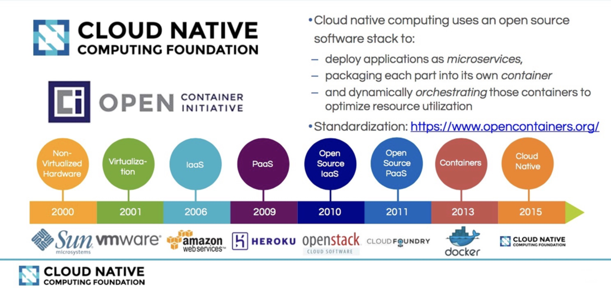

# 云原生

[Kubernetes Handbook —— Kubernetes 中文指南/云原生应用架构实践手册](https://jimmysong.io/kubernetes-handbook/)

## 1. 前言

云原生是一种行为方式和设计理念，究其本质，凡是能够提高云上资源利用效率和应用交付效率的行为或方式都是云原生的。云计算的发展史就是一部云原生化的历史。Kubernetes 开启了云原生的序幕，服务网格 Istio 的出现，引领了后 Kubernetes 时代的微服务，Serverless 的兴起，是的云原生从基础设施层不断向应用架构层挺进，我们正处于一个云原生的新时代

Kubernetes 是 Google 2014年从 Borg 系统中开源出来的容器编排调度引擎，它不仅是一个编排系统，并且提供一个规范用以描述集群的架构，定义服务的最终状态，使系统自动地达到和维持该状态

云原生技术有利于各组织在公有云、私有云和混合云等新型动态环境中，构建和运行可弹性扩展的应用。云原生的代表技术包括容器、服务网格、微服务、不可变基础设施和声明式 API，这些技术能够构建容错性好、易于管理和便于观察的松耦合系统。结合可靠的自动化手段，云原生技术使工程师能够轻松地对系统作出频繁和可预测的重大变更

Kubernetes Handbook 项目始于 2016 年底，开源于 2017 年 3 月，作为第一本系统介绍 Kubernetes 的中文电子书，记录了从零开始学习和使用 Kubernetes 的历程，着重于经验总结和资料分享，亦有 Kubernetes 核心概念解析（感谢作者！）

快速开始：[Katacoda 提供的 Kubernetes 环境](https://katacoda.com/kubernetes)

## 2. 云原生

### 2.1. 云原生的定义

CNCF 对云原生的定义：云原生技术有利于各组织在公有云、私有云和混合云等新型动态环境中，构建和运行可弹性扩展的应用。云原生的代表技术包括容器、服务网格、微服务、不可变基础设施和声明式 API。这些技术能够构建容错性好、易于管理和便于观察的松耦合系统。结合可靠的自动化手段，云原生技术使工程师能够轻松地对系统作出频繁和可预测的重大变更

笔者认为云原生是一种行为方式和设计理念，究其本质，凡是能够提供云上资源利用率和应用交付效率的行为或方式都是云原生的

### 2.2. *云原生的设计哲学

云原生本身甚至不能称为是一种架构，它首先是一种基础设施，运行在其上的应用称作云原生应用，只有符合云原生设计哲学的应用架构才叫云原生应用架构

#### 2.2.1. 设计理念

云原生设计理念如下：

- 面向分布式设计（Distribution）：容器、微服务、API 驱动的开发
- 面向配置设计（Configuration）：一个镜像，多个环境配置
- 面向韧性设计（Resistancy）：故障容忍和自愈
- 面向弹性设计（Elasticity）：弹性扩展和对环境变化（负载）做出响应
- 面向交付设计（Delivery）：自动拉起，缩短交付时间
- 面向性能设计（Performance）：响应式，并发和资源高效利用
- 面向自动化设计（Automation）：自动化的 DevOps
- 面向诊断性设计（Diagnosability）：集群级别的日志、metric 和追踪
- 面向安全性设计（Security）：安全端点、API Gateway、端到端加密

以上许多理念其实都是继承字分布式应用的设计理念

#### 2.2.2. 什么不是云原生基础设施

没看懂，这一章先 pass 了

#### 2.2.3. 云原生应用程序

### 2.3. Kubernetes 的诞生

[《Borg, Omega, and Kubernetes》](https://static.googleusercontent.com/media/research.google.com/en//pubs/archive/44843.pdf)

Borg：用来管理长时间运行的生产服务和批处理服务，由于 Borg 的规模、功能的广泛性和超高的稳定性，现在仍是 Google 内部主要的容器管理系统

Omega：处于提升 Borg 生态系统的愿望，提供了配置和更新 job 的机制

Kubernetes：在其核心有一个被分享的持久存储，有组件来检测相关 object 的变化，主要设计目标是更容易的方法去部署和管理复杂的分布式系统

### 2.4. Kubernetes 与云原生应用概览

#### 2.4.1 从云计算到微服务再到云原生计算

**云计算介绍**

云计算演化进程

云计算就是一种配置资源的方式，很多技术和公司都会牵强的往这个上面扯，但是实际上并不是，根据资源配置方式可以把云计算分为一下三种类型：

- IaaS：Infrastructure as a Service，基础架构即服务，由提供商通过云为你管理基础架构，包括实际的服务器、网络、虚拟化和存储，这是为了想要建立自己的商业模式并进行自定义的客户，例如亚马逊的 S3 存储
- PaaS：Platform as a Service，平台即服务，是工具和服务的集合，对于想用它来构建自己的应用程序或或者快速的将应用程序部署到生产环境而不必关心底层硬件的用户和开发者来说特别有用，例如 Google App Engine
- SaaS：Software as a Service，软件即服务，终端用户可以直接使用的应用程序，只要几乎互联网来提供的服务基本都是 SaaS 服务，例如 Google Docs，还有根据使用量来付费的，比如 Github、各种云存储

云计算服务模型

**微服务介绍**

微服务（Microservices）是一种分布式架构设计理念，威力推动细粒度服务的使用，这些服务要能协同工作，每个服务都有自己的生命周期。一个微服务就是一个独立的实体，可以独立的部署在 PaaS 平台上，也可以作为一个独立的进程在主机中运行，服务之间通过 API 访问，修改一个服务不会影响其它服务。

推荐：《微服务设计》（Sam Newman 著）、[微服务设计读书笔记](https://jimmysong.io/posts/microservice-reading-notes/)

**云原生概念介绍**

云原生思维导图

[什么是云，云定义](https://www.cloudflare.com/zh-cn/learning/cloud/what-is-the-cloud/)

云是通过互联网访的服务器，以及在这些服务器上运行的软件和数据库，云服务器分布在全球各地的数据中心中，通过云计算，用户和公司不必自己管理物理服务器或在自己的机器上运行软件应用程序

云原生准确来说是一种文化，更是一种潮流，它是云计算的一个必然导向。它的意义在于让云成为云化战略成功的基石，而不是阻碍，如果业务应用上云之后开发和运维人员比原先还痛苦，成本还高的话，这样的云我们宁愿不上。但是实际情况就是，很多公司希望完成从传统应用到云端的迁移，但是这个过程中会遇到一些技术难题，并且上云以后，效率并没有变高，故障没有迅速定位

为了解决传统应用升级缓慢、架构臃肿、不能快速迭代、故障不能快速定位、问题无法快速解决等问题，云原生这个概念横空出世。云原生可以改进应用开发的效率，改变企业的组织结构，甚至会从文化层面上直接影响一个公司的决策，云原生应该具有的架构特性：敏捷性、可扩展性、故障可恢复性

从宏观概念上将，云原生是不同思想的集合

#### 2.4.2. Kubernetes 与云原生的关系

Kubernetes 很多的设计思想都契合了微服务和云原生应用的设计法则，它不仅是一个编排系统，而是提供了一个规范，可以让你来秒速集群的架构，定义服务的最终状态，Kubernetes 可以帮你将系统自动的达到和维持在这个状态

直白的介绍：Kubernetes 用户可以通过编写一个 YAML 或者 json 格式的配置文件，也可以通过工具/代码生产或直接请求 Kubernetes API 创建应用，该配置文件中包含了用户想要应用程序保持的状态，不论整个 Kubernetes 集群中的个别主机发生什么问题，都不会影响应用程序的状态，你也可以通过改变该配置文件或请求 Kubernetes API 来改变应用程序的状态

**12 因素应用**

12 因素应用

1. 基准代码：每个代码仓库（repo）都生成 docker image 保存到镜像仓库中，并使用唯一的 ID 管理
2. 依赖：显式的声明代码中的依赖，例如各种包管理工具
3. 配置：将配置与代码分离，应用部署到 Kubernetes 中可以使用容器的环境变量或 ConfigMap 挂载到容器中
4. 后端服务：把后端服务当作附加资源，实质上是计算存储分离和降低服务耦合，分解单体应用
5. 构建、发布、运行：严格分离构建和运行，每次修改代码生成新的镜像，重新发布，不能直接修改运行时的代码和配置
6. 进程：应用程序进程应该是无状态的，这意味着再次重启后还可以计算出原先的状态
7. 端口绑定：在 Kubernetes 中每个 Pod 都有独立的 IP，每个运行在 Pod 中的应用不必关心端口是否重复
8. 并发：每个容器都是一个进程，通过增加容器的副本数实现并发
9. 易处理：快速启动和优雅终止可以最大化健壮性
10. 开发环境和线上环境等价：在 Kubernetes 中可以创建多个 namespace，使用相同的镜像可以很方便的复制一套环境出来，镜像的使用可以很方便的部署一个后端服务
11. 日志：把日志当作事件流，到 ES 中统一查看
12. 管理进程：后台管理任务当作一次性进程运行，kubectl exec 进入容器内部操作

#### 2.4.3. Kubernetes 中的资源管理器和容器设计模式

Kubernetes 通过声明式                                                                                                                                                                                               