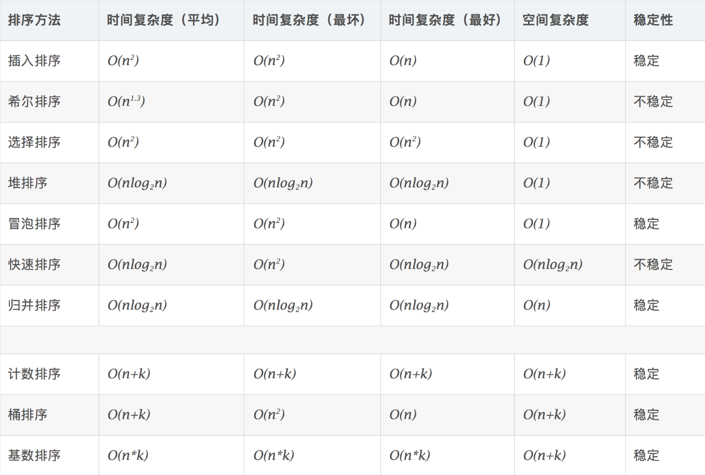

# 排序

[toc]

## 概念

**排序算法** （英语：Sorting algorithm）是一种将一组特定的数据按某种顺序进行排列的算法。排序算法多种多样，性质也大多不同。

- 稳定性

稳定性是指相等的元素经过排序之后相对顺序是否发生了改变。

基数排序、计数排序、插入排序、冒泡排序、归并排序是稳定排序。

选择排序、堆排序、快速排序不是稳定排序。

- 时间复杂度



## 选择排序

选择排序（Selection sort）是排序算法的一种，它的工作原理是每次找出第  $i$ 小的元素，然后将这个元素与数组第  $i$  个位置上的元素交换。

由于 swap（交换两个元素）操作的存在，选择排序是一个不稳定排序。选择排序的时间复杂度为   $O(n^2)$

``` c
void selection_sort(int* a, int n) {        //选择排序
  for (int i=0;i<n;++i) {   //逐个进行交换
    int ith = i;
    for (int j=i+1;j<=n;++j) {      //找到未排序的最小元素下标
      if (a[j]<a[ith]) {
        ith = j;
      }
    }
    int t = a[i];       //交换
    a[i] = a[ith];
    a[ith] = t;
  }
}
```

## 冒泡排序

冒泡排序（英语：Bubble Sort）是一种简单的排序算法。由于在算法的执行过程中，较小的元素像是气泡般慢慢「浮」到数列的顶端，故叫做冒泡排序。

它的工作原理是每次检查相邻两个元素，如果前面的元素与后面的元素满足给定的排序条件，就将相邻两个元素交换。当没有相邻的元素需要交换时，排序就完成了。

经过  $i$  次扫描后，数列的末尾 $i$  项必然是最大的  $i$ 项，因此冒泡排序最多需要扫描  $n-1$  遍数组就能完成排序。

冒泡排序是一种稳定的排序方法。时间复杂度为   $O(n^2)$

``` c
void bubble_sort(int *a, int n){    //冒泡排序
  int flag = 1;   //flag等于1表示序列尚未排完
  while(flag){    //尚未排完的情况
    flag = 0;
    for (int i=0;i<n;++i){
      if (a[i]>a[i+1]){
        flag = 1;   //存在前一个数比后一个大的情况
        int t = a[i];
        a[i] = a[i+1];
        a[i+1] = t;
      }
    }
  }
}
```

## 插入排序

插入排序（Insertion Sort）是一种简单直观的排序算法。它的工作原理为将待排列元素划分为“已排序”和“未排序”两部分，每次从“未排序的”元素中选择一个插入到“已排序的”元素中的正确位置。

一个与插入排序相同的操作是打扑克牌时，从牌桌上抓一张牌，按牌面大小插到手牌后，再抓下一张牌。

插入排序是一个稳定排序，时间复杂度为   $O(n^2)$，最优时间复杂度为 $O(n)$

``` c
void insertion_sort(int* a, int n){     //插入排序
  for (int i=1;i<n;++i){
    int key = a[i];   //插入元素
    int j = i-1;
    while(j>=0&&a[j]>key){    //从后往前找到插入的位置
      a[j+1] = a[j];
      --j;
    }
    a[j+1] = key;
  }
}
```

## 快速排序

快速排序（英语：Quicksort），又称分区交换排序（partition-exchange sort），简称快排，是一种被广泛运用的排序算法。

### 原理

快速排序的工作原理是通过 分治  的方式来将一个数组排序。

快速排序分为三个过程：

1. 将数列划分为两部分（要求保证相对大小关系）；
2. 递归到两个子序列中分别进行快速排序；
3. 不用合并，因为此时数列已经完全有序。

快速排序是一种不稳定的排序方法，快速排序的最佳时间复杂度和平均时间复杂度为 $O(n*logn)$，最坏时间复杂度为 $O(n)$

``` c
void quick_sort(int* arr,int left,int right){   //快速排序
  if(left>=right)   //结束条件
    return;
  int i=left,j=right,temp=arr[left];
  while(i<j){
    while(i<j&&arr[j]>temp)
      --j;
    arr[i] = arr[j];
    while(i<j&&arr[i]<temp)
      ++i;
    arr[j] = arr[i];
  }
  arr[i] = temp;
  quick_sort(arr,left,i-1);
  quick_sort(arr,i+1,right);
}
```

## 归并排序

归并排序是一种采用了 [分治](https://oi-wiki.org/basic/divide-and-conquer/) 思想的排序算法。

归并排序分为三个过程：

1. 将数列划分为两部分（在均匀划分时时间复杂度为  ）；
2. 递归地分别对两个子序列进行归并排序；
3. 合并两个子序列。

