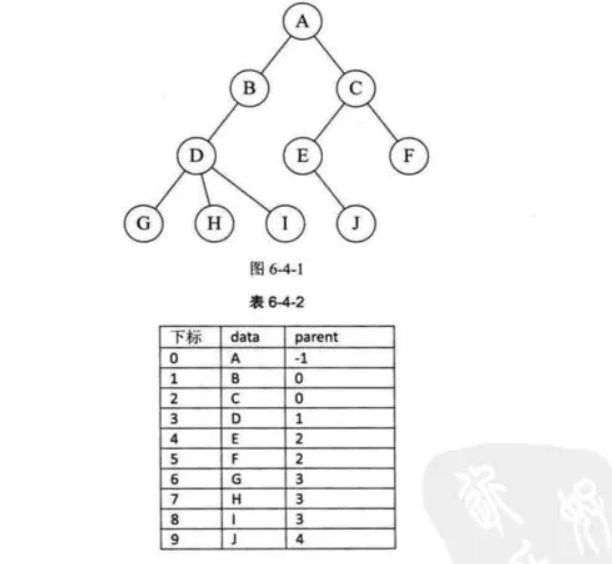

# 树

## 树基础

### 树定义

**树(Tree)**是n个结点的有限集。
 在任意一棵非空树中：

- 有且仅有一个特定的称为根(Root)的结点
- 当n > 1时，其余结点可以分为m(m > 0)个**互不相交**的有限集T1,  T2,…,Tm,其中每一个集合本身又是一棵树，并且称为树的子树(SubTree)

由上可以看出，树的定义本身是递归定义的。

### 树基础概念

- 结点拥有的子树数称为结点的**度**

- 度为0的结点称为**叶子**或终端结点
-  **树的度**是树内各结点的度的最大值
-  树中结点的最大层次称为树的**深度**或**高度**
- 森林是m(m>0)棵**互不相交**的树的集合。

- 对树中每个结点而言，其子树的集合为森林。

- 森林和树相互递归地定义来描述树
- 一棵**N**个结点的树有**N-1**条边(因为除了root，其它结点都经由一条边出去)

结点的分类

- 结点：树的结点包含**一个数据元素和若干指向其子树的分支**。

- 结点的度（Degree）：结点拥有的子树。

- 叶子结点（Leaf）/终端结点：度为**0**的结点。

- 分支结点/非终端结点：度不为0的结点。

- 内部结点：除根节点以外，分支结点也称为内部结点。

- 树的度：树内各结点的度的**最大值**。


结点之间的关系

- 孩子（Child）和双亲（Parent）：结点的子树的根，相应的，该结点称为孩子的双亲。**（注意是双亲，不是单亲）** 

- 兄弟（sibling）：同一个双亲的孩子之间互称兄弟。

- 结点的祖先：从根结点到该结点**所经过分支上的所有结点**。

- 子孙：以某结点为根的子树中的任一结点都称为该节点的子孙。

- 无序树和有序树：如果将树中结点的各子树看成**从左至右**是有次序的，不能互换的，则称该数为有序树，否则为无序树。

森林(fores):m(m>=0)棵**互不相交**的树的集合。

任意的树都可以用儿子(**一个结点指向第一个儿子**)、兄弟(**另一个结点指向下一个兄弟**)表示法将其转变成二叉树

树 二叉树 森林  三者之间的转换   可能是一个考点

### 二叉树

**二叉树**，首先它是一棵树，它的特定是每个结点**至多只有两颗子树**(即二叉树中不存在度大于2的结点)。并且，二叉树的子树有左右之分，其次序不能任意颠倒。

二叉树的性质

* 在二叉树的第i层至多有2^(i-1)个结点(归纳法)

- 深度为k的二叉树至多有2^k -1 个结点(公式)
- 对任何一棵二叉树T，如果其终端结点数为n0，度为2的节点数为n2，则n0 = n2 + 1
- i 结点的左子树  2i，  右子树  2i+1

假设一棵二叉树有 N 个结点，度为0 ，1，2的结点数目为 n0，n1，n2

​	N = n0+n1+n2

然后树有一个特点：N 个结点有 n-1条边

所以，N-1 = n1 + 2* n2 $\rightarrow$ n0+n1+n2-1 = n1 + 2*n2$\rightarrow$ n0 = n2 + 1    这个可能是个证明题

一棵深度为k且有$2^k-1$个结点的二叉树称为**满二叉树**
 		深度为k，有n个结点的二叉树，当且仅当其每一个结点都与深度为k的满二叉树编号从1至n的结点一一对应时，称之为**完全二叉树**

完全二叉树的性质

- n 个结点的完全二叉树的深度为 ⌊log2n⌋+1
- 当 i>1 时，父亲结点为结点 [i/2] 。（i=1 时，表示的是根结点，无父亲结点）
- 如果 2*i>n（总结点的个数） ，则结点 i 肯定没有左孩子（为叶子结点）；否则其左孩子是结点 2*i 
- 如果 2*i+1>n ，则结点 i 肯定没有右孩子；否则右孩子是结点 2*i+1

## 树的存储

对于存储结构，可能会联想到前面的**顺序存储和链式存储结构**。但是对于数这种可能会有很多孩子的特殊数据结构，只用顺序存储结构或者链式存储结构很那实现，那么可以将这两者结合，产生主要的三种存储结构表示法：**双亲表示法、孩子表示法、孩子兄弟表示法。**

### 双亲表示法

假设以一组连续空间存储数的结点，同时在每个结点中，**附设一个指示器指示其双亲结点到链表中的位置**



双亲表示的结点结构

|    data(数据域)    |          parent(指针域)          |
| :----------------: | :------------------------------: |
| 存储结点的数据信息 | 存储该结点的双亲所在数组中的下标 |

``` c
/* 树的双亲表法结点结构定义*/
#define MAX_TREE_SIZE 100
typedef int  ElemeType;

typedef struct PTNode{ // 结点结构
    ElemeType data; //结点数据
    int parent;    // 双亲位置
}PTNode;

typedef struct { // 树结构
    PTNode nodes[MAX_TREE_SIZE];   // 结点数组
    int r; // 根的位置
    int n; // 结点数
}PTree;
```

``` C
typedef struct node{
    char data;
    int parent;
}node;
node [100];
```


双亲表示法的特点

- 由于**根结点是没有双亲的**，约定根结点的位置位置域为-1.
- 根据结点的`parent`指针**很容易找到它的双亲结点**。所用时间复杂度为O(1)，直到parent为-1时，表示找到了树结点的根。
- 缺点：如果要找到孩子结点，**需要遍历整个结构才行**。

### 孩子表示法

把每个结点的孩子结点排列起来，以**单链表作为存储结构**，则n个结点有n个孩子链表，如果是叶子结点则此单链表为空。然后**n个头指针又组成一个线性表，采用顺序存储结构**，存放进一个一维数组中。


``` c
typedef struct node{
    int child;
    struct node* next;
}node;
typedef struct TNode{
	char data;
    node* next;
}TNode;
TNode[10];
```


孩子表示法有两种结点结构：**孩子链表的孩子结点**和**表头数组的表头结点**

- 孩子链表的孩子结点

|         child(数据域)          |             next(指针域)             |
| :----------------------------: | :----------------------------------: |
| 存储某个结点在表头数组中的下标 | 存储指向某结点的下一个孩子结点的指针 |

- 表头数组的表头结点

|      data(数据域)      |     firstchild(头指针域)     |
| :--------------------: | :--------------------------: |
| 存储某个结点的数据信息 | 存储该结点的孩子链表的头指针 |

``` c
/* 树的孩子表示法结构定义*/
#define MAX_TREE_SIZE 100
typedef int  ElemeType;

typedef struct CTNode{  // 孩子结点
    int child; // 孩子结点的下标
    struct CTNode * next; // 指向下一结点的指针
}*ChildPtr;

typedef struct {  // 表头结构
    ElemeType data; // 存放在数中的结点数据
    ChildPtr firstchild; // 指向第一个孩子的指针
}CTBox;

typedef struct {  // 树结构
    CTBox nodes[MAX_TREE_SIZE]; // 结点数组
    int r;  // 根的位置
    int n;  // 结点树
}CTree;
```

### 双亲孩子表示法定义

对于孩子表示法，查找某个结点的某个孩子，或者找某个结点的兄弟，只需要查找这个结点的孩子单链表即可。但是**当要寻找某个结点的双亲时**，就不是那么方便了。所以可以将双亲表示法和孩子表示法结合，形成**双亲孩子表示法**。

头节点


``` c
typedef struct node{		//结点存储结构
    int child;
    struct node* next;
}node;
typedef struct TNode{		//头节点存储结构
    char data;
    int parent;
    node* firstChild;
}TNode;
TNode[10];
```


``` c
/* 树的双亲孩子表示法结构定义*/
#define MAX_TREE_SIZE 100
typedef int  ElemeType;

typedef struct CTNode{  // 孩子结点
    int child;  // 孩子结点的下标
    struct CTNode * next;  // 指向下一结点的指针
}*ChildPtr;

typedef struct {  // 表头结构
    ElemeType data;  // 存放在数中的结点数据
    int parent;      // 存放双亲的下标
    ChildPtr firstchild;  // 指向第一个孩子的指针
}CTBox;

typedef struct {  // 树结构
    CTBox nodes[MAX_TREE_SIZE]; // 结点数组
    int r;  // 根的位置
    int n;  // 结点树
}CTree;
```

### 孩子兄弟表示法

任意一棵树，它的结点的第一个孩子如果存在就是唯一的，它的右兄弟存在也是唯一的。因此，设置两个指针，分别指向该结点的第一个孩子和此结点的右兄弟。

孩子兄弟表示法的结点结构

|    data(数据域)    |        firstchild(指针域)        |         rightsib(指针域)         |
| :----------------: | :------------------------------: | :------------------------------: |
| 存储结点的数据信息 | 存储该结点的第一个孩子的存储地址 | 存储该结点的右兄弟结点的存储地址 |

``` c
/* 树的孩子兄弟表示法结构定义*/
#define MAX_TREE_SIZE 100
typedef int  ElemeType;

typedef struct CSNode{
    ElemeType data;
    struct CSNode * firstchild;
    struct CSNode * rightsib;
}CSNode, *CSTree;
```

## 二叉树的存储

二叉树有两种存储结构：顺序存储和链式存储

### 顺序存储

二叉树的顺序存储，指的是使用[顺序表](http://data.biancheng.net/view/158.html)（[数组](http://data.biancheng.net/view/181.html)）存储二叉树。需要注意的是，顺序存储只适用于完全二叉树。换句话说，只有完全二叉树才可以使用顺序表存储。因此，如果我们想顺序存储普通二叉树，需要提前将普通二叉树转化为完全二叉树。

普通二叉树转完全二叉树的方法很简单，只需给二叉树额外添加一些节点，将其"拼凑"成完全二叉树即可


1 2 0 3 0 0 0 

完全二叉树的顺序存储，仅需从根节点开始，按照层次依次将树中节点存储到数组即可


  由此，我们就实现了完全二叉树的顺序存储。

不仅如此，从顺序表中还原完全二叉树也很简单。我们知道，完全二叉树具有这样的性质，将树中节点按照层次并从左到右依次标号（1,2,3,...），若节点 i 有左右孩子，则其左孩子节点为 2*i，右孩子节点为 2*i+1。此性质可用于还原数组中存储的完全二叉树 。

### 链式存储

其实二叉树并不适合用数组存储，其实二叉树并不适合用数组存储，因为并不是每个二叉树都是完全二叉树，普通二叉树使用顺序表存储或多或多会存在空间浪费的现象。

因此，有了二叉树的链式存储


用链式存储二叉树时，其节点结构由 3 部分构成：


``` c
typedef struct node{		//树结点存储结构
    int data;
    struct node* Lchild,* Rchild;
}node;
node 和  Node  区别在哪？
node* T;  struct node* T = node* T = Node T
Node T;	struct node* T;
int t1,*t2;
这时候的有啥区别？
t1是个整型的变量，t2是个int型的指针
node t1,*t2;   t2 = &t1;//t2指向了t1
t1 t2有啥区别？
t1是个结点，t2是个node型的指针
t1.data;t2->data;
```


- 指向左孩子节点的指针（Lchild）；
- 节点存储的数据（data）；
- 指向右孩子节点的指针（Rchild）；

``` c
#define TElemType int
typedef struct BiTNode{
    TElemType data;//数据域
    struct BiTNode *lchild,*rchild;//左右孩子指针
}BiTNode;
 .   ->
BiTree  a;
BiTNoe* a;
```


``` C
//根据一个数组，将其转变为一棵二叉树   arr[i] = *(arr+i)
node* transform(node* root,int* arr,int n,int i){		//根据数组初始化一颗二叉树
	if(!root||!arr||i>=n)
        return 0;
    root = (node*)malloc(sizeof(node));
    root->data = arr[i];
    root->left = transform(root->left,arr,n,i*2+1);
    root->right = transform(root->right,arr,n,i*2+2);
    return root;
}
```

初始化1：

``` c
node* init(node* r){     //初始化二叉树
    if(!r)
        return 0;
    r = (node*)malloc(sizeof(node));
    printf("Enter data:\n");
    scanf(" %c",&r->data);		//输入该结点的数据
    int judge;
    printf("是否输入左结点(0为否)：\n");
    scanf("%d",&judge);
    if(judge)
        r->left = init(r->left);
    else
        r->left = 0;
    printf("是否输入右节点(0为否)：\n");
    scanf("%d",&judge);
    if(judge)
        r->right = init(r->right);
    else
        r->right = 0;
    return r;
}
```

初始化2：

``` c
node* init2(char* arr,int n,node* r,int i){        //完全二叉树的序列构建二叉树
    if(!arr||!r||n<1||i>n)      //结束条件
        return 0;
    r = (node*)malloc(sizeof(node));
    r->data = arr[i-1];
    r->left = init2(arr,n,r->left,2*i);
    r->right = init2(arr,n,r->right,2*i+1);
    return r;
}
```

## 树的遍历

二叉树是一种非常重要的数据结构，很多其它数据结构都是基于二叉树的基础演变而来的。对于二叉树，有深度优先遍历和广度优先遍历，深度遍历有前序、中序以及后序三种遍历方法，广度遍历即我们平常所说的层次遍历。因为树的定义本身就是递归定义，因此采用递归的方法去实现树的三种遍历不仅容易理解而且代码很简洁，而对于广度遍历来说，需要其他数据结构的支撑，比如堆和队列。

四种主要的遍历思想为：

前序遍历：根结点 ---> 左子树 ---> 右子树

中序遍历：左子树---> 根结点 ---> 右子树

后序遍历：左子树 ---> 右子树 ---> 根结点

层次遍历：只需按层次遍历即可

### 前序遍历

递归写法:

``` c
void preOrder(node* r){     //先序遍历输出
    if(!r)
        return;
    printf("%c -- ",r->data);       //输出根，可换成其它操作
    preOrder(r->left);
    preOrder(r->right);
}
```

金字塔，而递归的底层实现依靠的是栈的存储结构，因此，二叉树的先序遍历既可以直接采用递归思想实现，也可以使用栈的存储结构模拟递归的思想实现.  计算机里面有一种虚拟栈的东西来记录着递归运行到了哪一步。

非递归的第一种写法：

``` c
void preOrder2(node* r){        //先序遍历，非递归的写法
    if(!r)
        return;
    node* stack[maxsize],*temp;      //初始化栈
    int top = -1;
    stack[++top] = r;       //入栈
    while(top!=-1){
        temp = stack[top--];
        printf("%c -- ",temp->data);  // 输出操作，可以换
        if(temp->right)     //右结点先入栈
            stack[++top] = temp->right;
        if(temp->left)
            stack[++top] = temp->left;
    }
}
```

非递归的第二种写法：

``` c
void preOrder3(node* r){        //先序遍历，非递归的第二种写法
    if(!r)
        return;
    node* stack[maxsize],*temp = r;      //栈
    int top = -1;
    while(temp||top!=-1){	//栈非空或者temp存在
        if(temp){	//根存在
            printf("%c -- ",temp->data);
            stack[++top] = temp;
            temp = temp->left;
        }
        else{
            temp = stack[top--];
            temp = temp->right;
        }
    }
}
```

### 中序遍历

递归写法：

``` c
void inOrder(node* r){      //中序遍历，递归写法
    if(!r)
        return;
    inOrder(r->left);
    printf("%c -- ",r->data);
    inOrder(r->right);
}
```

中序遍历过程中，只需将每个结点的左子树压栈即可，右子树不需要压栈。当结点的左子树遍历完成后，只需要以栈顶结点的右孩子为根结点，继续循环遍历即可。

非递归写法：

``` c
void inOrder2(node* r){     //中序遍历，非递归写法
    if(!r)
        return;
    node* stack[maxsize],*temp = r;      //栈
    int top = -1;
    while(temp||top!=-1){
        if(temp){       //temp 不为空，则将其入栈并遍历左子树
            stack[++top] = temp;
            temp = temp->left;
        }
        else{       //temp 为空，表面左子树遍历完成，开始遍历上一层结点的右子树
            temp = stack[top--];
            printf("%c -- ",temp->data);
            temp = temp->right;
        }
    }    
}
```

### 后序遍历

递归写法：

``` c
void postOrder(node* r){        //后序遍历
    if(!r)
        return;
    postOrder(r->left);
    postOrder(r->right);
    printf("%c -- ",r->data);
}
```

前序遍历：根结点 ---> 左子树 ---> 右子树

后序遍历：左子树 ---> 右子树 ---> 根结点

把后序遍历看成 根->右子树->左子树，前序遍历和后序遍历的左右刚好反过来。

非递归写法：

``` c
void postOrder2(node* r){       //后序遍历，非递归实现
    if(!r)
        return;
    node* stack1[maxsize],* stack2[maxsize],* temp = r;      //需要两个栈
    int top1 = -1,top2 = -1;
    while(top1!=-1||temp){
        while(temp){
            stack2[++top2] = temp;
            stack1[++top1] = temp;
            temp = temp->right;
        }
        if(top1!=-1){
            temp = stack1[top1--];
            temp = temp->left;
        }
    }
    while(top2!=-1)
        printf("%c -- ",stack2[top2--]->data);
}
```

### 层次遍历

层次遍历：按照二叉树中的层次从左到右依次遍历每层中的结点。具体的实现思路是：通过使用队列的数据结构，从树的根结点开始，依次将其左孩子和右孩子入队。而后每次队列中一个结点出队，都将其左孩子和右孩子入队，直到树中所有结点都出队，出队结点的先后顺序就是层次遍历的最终结果。

``` c
void hierOrder(node* r){        //层次遍历
    if(!r)
        return;
    node* queue[maxsize],*temp;       //初始化一个队列
    int front = 0,rear = 0;
    queue[++rear] = r;		//把根节点入队
    while(front!=rear){     //队列不空
        front = (front+1)%maxsize;
        temp = queue[front];
        printf("%c -- ",temp->data);
        if(temp->left){
            rear = (rear+1)%maxsize;
            queue[rear] = temp->left;
        }
        if(temp->right){
            rear = (rear+1)%maxsize;
            queue[++rear] = temp->right;
        }
    }
}
void funct(int * arr, int len)
 
```

## 赫夫曼树

### 基础

路径：在一棵树中，一个结点到另一个结点之间的通路，称为路径

路径长度：在一条路径中，每经过一个结点，路径长度都要加 1 。例如在一棵树中，规定根结点所在层数为1层，那么从根结点到第 i 层结点的路径长度为 i - 1 

结点的权：给每一个结点赋予一个新的数值，被称为这个结点的权

结点的带权路径长度：指的是从根结点到该结点之间的路径长度与该结点的权的乘积

树的带权路径长度为树中所有叶子结点的带权路径长度之和。通常记作 “WPL


WPL = 7 * 1 + 5 * 2 + 2 * 3 + 4 * 3 = 35

哈夫曼编码：a:0   b 10 c110   d111

赫夫曼树：当用 n 个结点（都做叶子结点且都有各自的权值）试图构建一棵树时，如果构建的这棵树的带权路径长度最小，称这棵树为“最优二叉树”，有时也叫“赫夫曼树”或者“哈夫曼树”。

在构建哈弗曼树时，要使树的带权路径长度最小，只需要遵循一个原则，那就是：权重越大的结点离树根越近

构建赫夫曼树：


1. 在 n 个权值中选出两个最小的权值，对应的两个结点组成一个新的二叉树，且新二叉树的根结点的权值为左右孩子权值的和；
2. 在原有的 n 个权值中删除那两个最小的权值，同时将新的权值加入到 n–2 个权值的行列中，以此类推；
3. 重复 1 和 2 ，直到所以的结点构建成了一棵二叉树为止，这棵树就是哈夫曼树。

###  构建哈夫曼树

构建一个结点数组，每次从结点数组中选择两个结点，构建成一个新的子树，添加进数组中，n-1次这样的操作过后就只剩下 一个根节点了

n个结点要多少次这样操作能够构建出哈夫曼树？

n-1次

``` c
    for(int i=1;i<n;++i){       //n-1次就可以构建出一个哈夫曼树了
        min = minFunction(arr,rear);
        arr[min].judge = 0;
        cmin = minFunction(arr,rear);
        arr[cmin].judge = 0;
        arr[rear].data = arr[min].data+arr[cmin].data;
        arr[rear].judge = 1;
        arr[rear].left = &arr[min];
        arr[rear].right = &arr[cmin];
        rear++;
    }
    --rear;         //rear现在表示根了
```


### 哈夫曼树的编码

``` c
// 递归进行哈夫曼编码
void HuffmanCode(node* hufmTree, int depth)      // depth是哈夫曼树的深度
{
    static int code[10];
    if (hufmTree)
    {
        if (hufmTree->left==0 && hufmTree->right==0)
        {
            printf("权值为%d的叶子结点的哈夫曼编码为 ",hufmTree->data);
            int i;
            for (i=0; i<depth; ++i)
            {
                printf("%d", code[i]);
            }
            printf("\n");
        } else
        {
            code[depth] = 0;		//往左走
            HuffmanCode(hufmTree->left, depth+1);
            code[depth] = 1;		//往右走
            HuffmanCode(hufmTree->right, depth+1);
        }
    }
}
```

``` C
1120
1
1*10+1
11*10 + 2
112*10 +0
    
```

森林 树  二叉树


## 练手题

1. 先序序列和中序序列构建一棵二叉树：

``` c
typedef struct node{		//树结点结构
	char data;
    struct node* lchild,*rchild;
}node;

node* function(char* str1,char* str2,int n){		//先序序列str1和后序序列str2构建一棵二叉树
	if(!str1||!str2||n<1)		//结束条件
        return;
    node* root = (node*)malloc(sizeof(node));
    root->data = str1[0];
    root->lchild = 0;
    root->rchild = 0;
    int i;
    for(i=0;str2[i]!='\0';i++)
		if(str2[i]==str1[0])
            break;
    root->lchild = function(str1+1,str2,i);
    root->rchild = function(str1+i+1,str2+i+1,n-i-1);
    return root;
}
```


``` c
typedef struct node{		//二叉树结点存储结构
    char data;
    struct node* left,* right;
}node;
node* init(char* str1,char* str2,int n){	//先序序列str1与后序序列str2构建一个二叉树
    if(!str2||!str2||n<1)
        return 0;
    node* root = (node*)malloc(sizeof(node));		//初始化一个结点
    root->data = str1[0];
    char temp = str1[0];
    int i; 	 	
    for(i=0;str2[i]!='\0';++i)		//找到中序序列根节点的下标
        if(str2[i]==temp)
            break;
    root->left = init(str1+1,str2,i);	//构建左子树
    root->right = init(str1+i+1,str2+i+1,n-i-1);	//构建右子树
    return root;
}
```


2. 假设一棵 Huffman 树 T 有 n 个叶子结点，那么树有多少个结点

算法思想：假设n个叶子节点的权值都为1，初始化一个数组，把它当作一个队列，每次出队两个结点，构建一个二叉树再入队，当队列中只剩下一个结点，就构建出了一棵哈夫曼树，并求出其结点个数

``` c
typedef struct node{
    int judge
    char data;
    struct node* lchild,*rchild;
}node;
int sum(node* root){		//求二叉树有多少个结点
    if(!root)
        return 0;
    return sum(root->lchild)+sum(root->rchild)+1;
}
int main(){
    node arr[50];		//假设叶子结点不超过50个
    int n;
    printf("Enter n:\n");
    scanf("%d",&n);
    for(int i=0;i<n;++i){		//初始化结点数组
		arr[i].data = 1;
        arr[i].lchild = 0;
        arr[i].rchild = 0;
    }
    int front=0,rear=n;
    for(int i=1;i<n;++i){		//n-1次构建出哈夫曼树
    	arr[rear].data = arr[front].data+arr[front+1].data;
        arr[rear].lchild = &arr[front];
        arr[rear].rchild = &arr[front+1];
        rear += 1;
        front += 2;
    }
    --rear;		// rear 指向根节点
    printf("sum:%d\n",sum(&arr[rear]));
}
```


3. 前序序列和后序序列可以判定N1必定是N2的祖先

算法思想：先构建出二叉树来，分别前序遍历和后序遍历二叉树，如果满足前序遍历中N1先出现，后序遍历中N2先出现，则可以判定N1是N2的祖先

``` c
typedef struct node{		//结点结构
    int data;
    struct node* lchild,* rchild;
}node;
node* creat(node* root){		//构建二叉树
	root = (node*)malloc(sizeof(node));		//初始化根
    int i;
    scanf("%d",&i);
    root->data = i;
    int judge;
    printf("%d 的左子树？",i);
    scanf("%d",&judge);
    if(judge)		//是否继续构建左子树
        root->lchild = creat(root->lchild);
    else
        root->lchild = 0;
    printf("%d 的右子树？",i);
    scanf("%d",&judge);
    if(judge)		//是否继续构建右子树
        root->rchild = creat(root->rchild);
    else
        root->rchild = 0;
    return root;
}
int tag1=0,tag2=0;
void preOrder(node* root,int N1,int N2){	//前序遍历判断N1是否先出现
	if(!root)		//结束条件
        return;
    if(root->data==N1)		//先出现N1
            tag1 = 1;
    else if(root->data==N2)
        tag1 = 2;
    return;
    preOrder(root->lchild,N1,N2);
    preOrder(root->rchild,N1,N2);
}
void postOrder(node* root,int N1,int N2){
    if(!root)
        return;
    postOrder(root->lchild,N1,N2);
    postOrder(root->rchild,N1,N2);
    if(root->data==N1)
        tag2 = 1;
    else if(root->data==N2)
        tag2 = 2;
    return;
}
int main(){
	node* root = creat(root);
    int N1,N2;
    printf("Enter N1,N2：\n");
    scanf("%d%d",&N1,&N2);
    if(tag1==2&&tag2==1)        //标记情况
        printf("yes");
    else
        printf("no");
}
```


4. 试证明：已知二叉树的前序序列和中序序列，可唯一确定二叉树

证明：

​		假设前序序列是pre，后序序列是pin，结点个数为n，则

当n=1时，二叉树的根节点为就为序列中的唯一的数；

当n>=2时，令pre的第一个结点为 temp，tem就为二叉树的根节点的值，再pin中找到temp的下标i，i前面的数都是二叉树的左子树的节点，i 后面的数都是二叉树的右子树的结点，在pre中找到接着找 i个数与pin构建出二叉树数的左子树，pre和pin的最后 n-i-1 个数可以构建出二叉树的右子树；

综上所述，已知前序序列和后序序列可唯一确定该二叉树。
