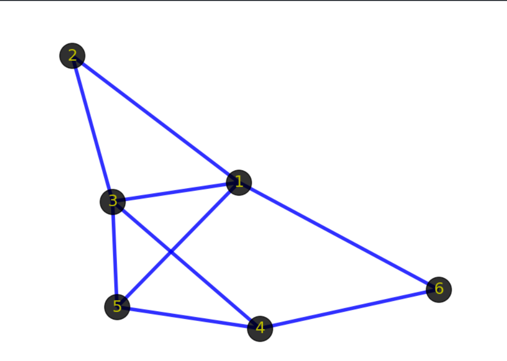
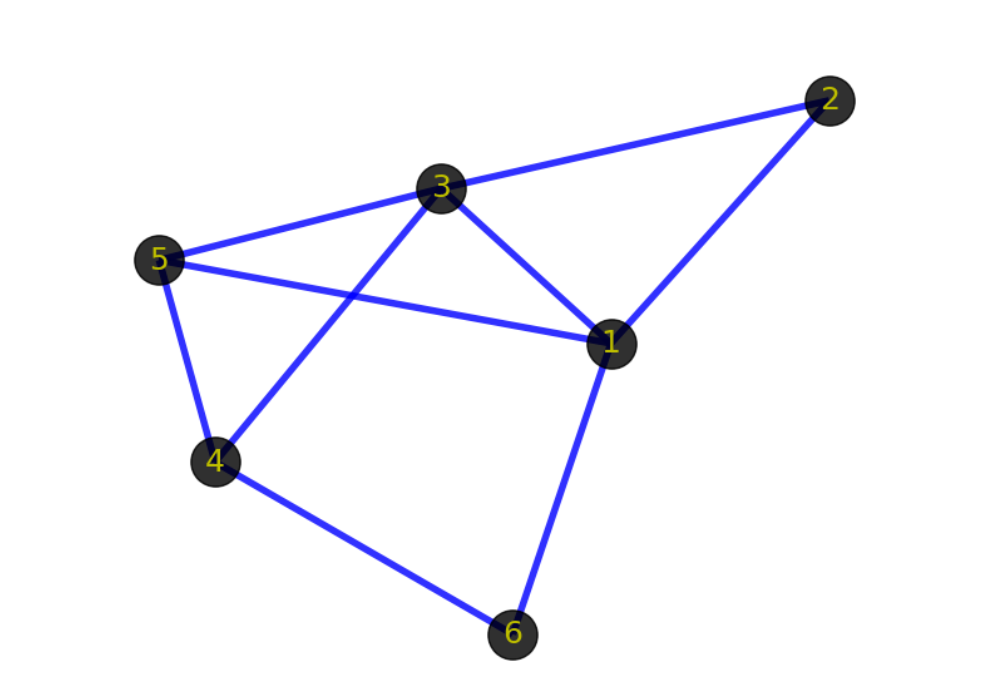
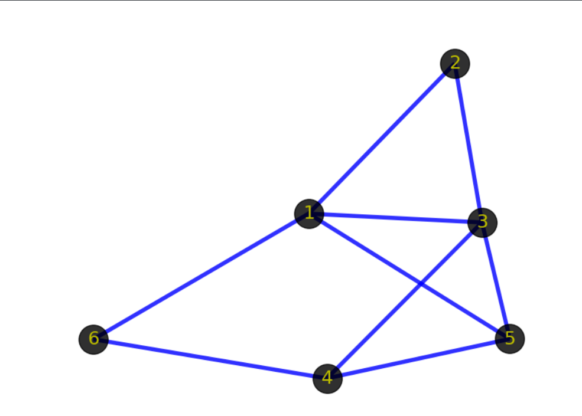
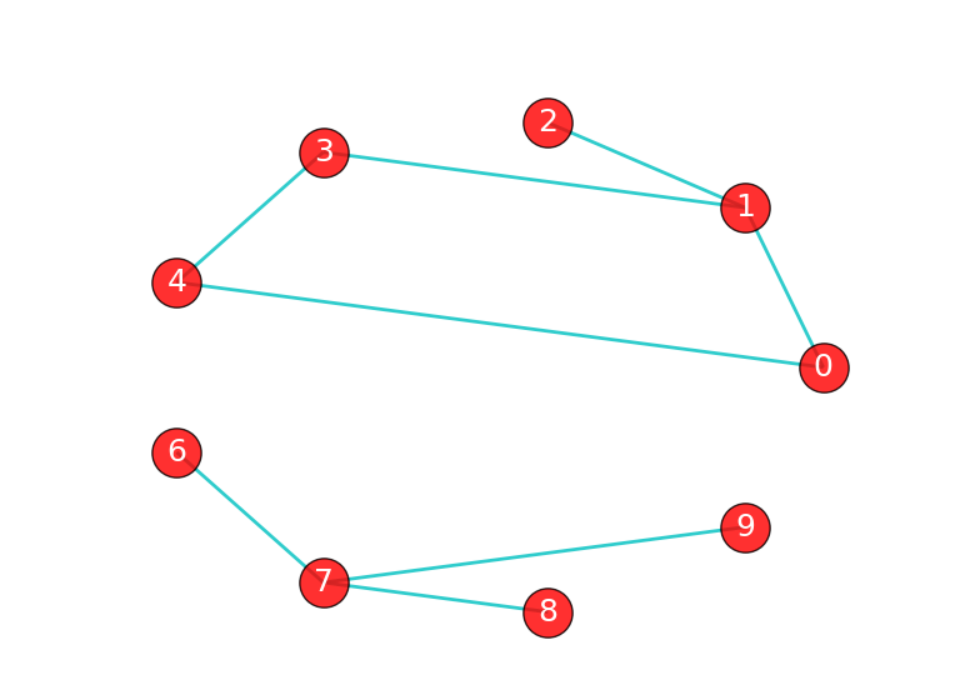
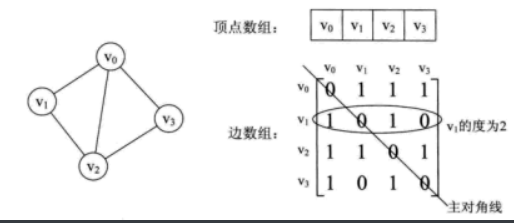
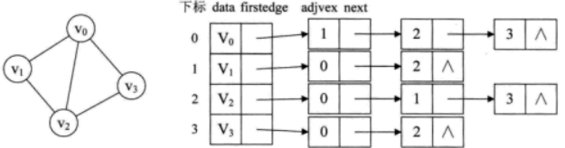

# 图

## 图的基本概念

1. 图是一种多对多的数据结构，所以我们可以把图抽象为一种由点（vertex)和边（edge）组成的网络。



我们先来看下面两幅图：同构   点和点是邻接，点和边关联





2. 有向图和无向图

3. 权重

4. 路径/最短路径    路径分两个东西：1，中间要经过哪些点，2.路径的长度

5. 连通图/连通分量

   	

6. 树是一种特殊的图  最小生成树  无根树

   树是一种任意两点之间都连通且没有环的图

   根、节点、叶、度、层、深度、高度、祖先、后代、森林···

## 图的构建

存啥：点和边

一维数组就可以存储点，二维数组

图的存储方式有两种：邻接矩阵与邻接表 

### 邻接矩阵

``` c
typedef struct  //定义图结构  temp  i,j,k
{
    int n,e;		//顶点数、边数
    char vex[maxsize];		//一维数组保存顶点
    int edge[maxsize][maxsize];		//二维数组保存边
}gragh;
```

邻接矩阵：两个数组来表示图，一个一维数组表示顶点（vertex），一个二维数组表示边（edge）  出度和入度     二维数组，行的非零数加起来就是出度，列的非零数加起来就是入度



### 邻接表

``` c
typedef struct node         //结点
{
    int adjvex;		//下标
    int weight;		//权重
    struct node *next;		//指针
}node;
typedef struct   //头结点
{
    char vex;		//data域
    node* next;		//指针
}vexNode;
typedef struct      //图
{
    int n,e;		//顶点数，边数
    vexNode adjlist[maxsize];		//一维数组保存顶点
}graph;
```

邻接表：对于边数较少的图，邻接矩阵是一种极大的浪费，所以有了邻接表。用一维数组存储顶点（vertex），单链表表示边（edge）




图构建的需要考虑处理字符串

考虑自己的源数据是什么，如果是一张图，转为字符串，如果是字符串，按照字符串的格式读取即可（字符串的基本操作），如果是文件格式（文件的基本操作），则一行一行的读取成字符串，并存储到计算机中。

图构建好以后我们能够进行一些基本操作：图的遍历(DFS、BFS)、读取顶点的出入度、输出目标顶点的邻接点、判断图是否是连通图···

高级操作：最短路径算法（Dijkstra、Floyd）、最小生成树（Kruskal、Prim）···

## 图的遍历

图的遍历有两种：深度优先搜索（DFS, depth first search）和广度优先搜索（BFS, breadth first search）

### 深度优先遍历（DFS)

深度优先遍历：是从图中的一个顶点出发，每次遍历当前访问顶点的邻接点，一直到访问的顶点没有未被访问过的临界点为止。然后采用依次回退的方式，查看来的路上每一个顶点是否有其它未被访问的邻接点。深度优先搜索是一个不断回溯的过程。

深度优先搜索的过程类似于树的先序遍历，即这是一个递归的函数。

``` c
void DFS(gragh *g,int v,int *visit)     //DFS深度遍历
{
    if(visit[v]==1)     return;     //递归结束条件
    visit[v] = 1;
    printf("%c--",g->vex[v]);       //打印结点，可以换成其它操作
    for(int i=0;i<g->n;++i)
    {
        if(g->edge[v][i]==1&&visit[i]==0)
            DFS(g,i,visit);
    }
}
```

### 广度优先搜索（BFS)

广度优先搜索：从图中的某一顶点出发，遍历每一个顶点时，依次遍历其所有的邻接点，然后再从这些邻接点出发，同样依次访问它们的邻接点。按照此过程，直到图中所有被访问过的顶点的邻接点都被访问到。

广度优先搜索类似于树的层次遍历。

``` c
void BFS(gragh *g,int v,int *visit)     //BFS遍历
{
    int length=g->n,temp,i;
    int queue[10];    //借助队列，一层一层的遍历
    int front=0,rear=0;
    queue[rear++] = v;
    visit[v] = 1;       //每次入队的时候赋值为1
    while(front!=rear)      //队列中还有值
    {
        temp = queue[front];    //出队列
        front = (++front)%length;
        printf("%c--",g->vex[temp]);	//可以换成其它操作
        for(i=0;i<g->n;++i)
        {
            if(visit[i]==0&&g->edge[temp][i]==1)
            {
                queue[rear] = i;       //入队
                rear = (++rear)%length;
                visit[i] = 1;
            }
        }
    }
}
```

很多题都是对图或者树的遍历，然后遍历的时候不是对它的输出，而是在遍历的时候做其它操作了。

## 最短路径算法

什么叫最短路径？

最短路径问题是图论研究中的一个经典算法问题，旨在寻找图中两顶点之间的最短路径。算法具体的形式包括： 确定起点的最短路径问题 - 即已知起始结点，求最短路径的问题。

就是两个顶点之间最快的那条路径和该路径的长度。

这是一个抽象的东西，你会怎么保存路径和路径长度？

一个数组可以保存路径，一个变量就可以保存路径长度了。

最短路径算法有：迪杰斯特拉（Dijkstra）、弗洛伊德（Floyd）

### 迪杰斯特拉算法

Dijkstra是一种单源最短路径算法，使用类似于广度优先搜索的方法解决赋权图的单源最短路径问题，不可以处理负权图。

S到各点的距离与 SC + C到各点的距离 之比

S到各点的距离与  SD + D到各点的距离 之比

- Dijkstra算法的算法思想是：

设G=(V,E)是一个带权图，把图中顶点集合V分成两组，第一组为已求出最短路径的顶点集合（用S表示，初始时S中只有一个源点，以后每求得一条最短路径 , 就将加入到集合S中，直到全部顶点都加入到S中，算法就结束了），第二组为其余未确定最短路径的顶点集合（用U表示），按最短路径长度的递增次序依次把第二组的顶点加入S中。

在加入的过程中，总保持从源点v到S中各顶点的最短路径长度不大于从源点v到U中任何顶点的最短路径长度。

此外，每个顶点对应一个距离，S中的顶点的距离就是从v到此顶点的最短路径长度，U中的顶点的距离，是从v到此顶点只包括S中的顶点为中间顶点的当前最短路径长度。

代码流程：

1. 一个顶点数组vset来判断该点是否已经采集；一个数组dist来存储S到U各个点的最短路径长度（为了选择出距离S的最短的点），选择点后数组要更新；一个数组path来保存路径，选择点后数组要更新，初始化三个数组
2. 每次得到一个从未选择的点集合中选择距离最短的那个点
3. 更新dist数组和path数组
4. 循环2，3步，直到所有点选择完

``` c
void Dijkstra(gragh *g,int v,int *dist,int *path)       //Dijkstra算法
{
    int vset[maxsize];              //确定点是否选择
    int i,j,k,min=__INT_MAX__;
    for(i=0;i<g->n;++i)             //初始化
    {
        vset[i] = 0;
        dist[i] = min;
        path[i] = -1;
        if(g->edge[v][i]!=0)
        {
            dist[i] = g->edge[v][i];
            path[i] = v;
        }
    }
    vset[v] = 1;
    dist[v] = 0;
    for(i=0;i<g->n-1;++i)	//n-1个点一个个进去
    {
        min = __INT_MAX__;
        for(j=0;j<g->n;++j)
            if(vset[j]==0&&dist[j]<min)         //得到一个点
            {
                min = dist[i];
                k = j;
            }
        vset[k] = 1;
        for(j=0;j<g->n;++j)
            if(vset[j]==0&&g->edge[k][j]!=0&&dist[k]+g->edge[k][j]<dist[j])       //更新数组
            {
                path[j] = k;
                dist[j] = dist[k]+g->edge[k][j];
            }
    }
}
```

### 弗洛伊德算法

Floyd算法是一个多源最短路径的算法，得到任意两点之间的最短路径，可处理负权图。

- Floyd的算法思想是：

从任意节点i到任意节点j的最短路径不外乎2种可能，1是直接从i到j，2是从i经过若干个节点k到j。所以，我们假设Dis(i,j)为节点u到节点v的最短路径的距离，对于每一个节点k，我们检查Dis(i,k) + Dis(k,j) < Dis(i,j)是否成立，如果成立，证明从i到k再到j的路径比i直接到j的路径短，我们便设置Dis(i,j) = Dis(i,k) + Dis(k,j)，这样一来，当我们遍历完所有节点k，Dis(i,j)中记录的便是i到j的最短路径的距离。对于每一对顶点 u 和 v，看看是否存在一个顶点 w 使得从 u 到 w 再到 v 比己知的路径更短。如果是更新它。

邻接矩阵

|      | A        | B        | C        | D        | E    | F        |
| ---- | -------- | -------- | -------- | -------- | ---- | -------- |
| A    | 0        | 6        | 2        | 2        | 3    | $\infty$ |
| B    | 6        | 0        | $\infty$ | $\infty$ | 3    | 2        |
| C    | 2        | $\infty$ | 0        | 1        | 2    | 2        |
| D    | 2        | $\infty$ | 1        | 0        | 2    | $\infty$ |
| E    | 3        | 3        | 2        | 2        | 0    | 2        |
| F    | $\infty$ | 2        | 2        | $\infty$ | 2    | 0        |


|      | A        | B        | C    | D        | E    | F        |
| ---- | -------- | -------- | ---- | -------- | ---- | -------- |
| A    | 0        | 6        | 2    | 2        | 3    | $\infty$ |
| B    | 6        | 0        | 4    | 5        | 3    | 2        |
| C    | 2        | $\infty$ | 0    | 1        | 2    | 2        |
| D    | 2        | $\infty$ | 1    | 0        | 2    | $\infty$ |
| E    | 3        | 3        | 2    | 2        | 0    | 2        |
| F    | $\infty$ | 2        | 2    | $\infty$ | 2    | 0        |

path数组path数组

|      | A    | B    | C    | D    | E    | F    |
| ---- | ---- | ---- | ---- | ---- | ---- | ---- |
| A    | -1   | -1   | -1   | -1   | -1   | -1   |
| B    | -1   | -1   | -1   | -1   | -1   | -1   |
| C    | -1   | -1   | -1   | -1   | -1   | -1   |
| D    | -1   | -1   | -1   | -1   | -1   | -1   |
| E    | -1   | -1   | -1   | -1   | -1   | -1   |
| F    | -1   | -1   | -1   | -1   | -1   | -1   |


``` c
void Floyd(gragh *g,int path[][maxsize])
{
    int i,j,k,a[maxsize][maxsize],max=__INT_MAX__;
    for(i=0;i<g->n;++i)
        for(j=0;j<g->n;++j)
        {
            a[i][j] = g->edge[i][j];
            if(g->edge[i][j]==0)    
                a[i][j] = max;
            path[i][j] = -1;
        }
    for(k=0;k<g->n;++k)
        for(i=0;i<g->n;++i)
            for(j=0;j<g->n;++j)
                if(a[i][j]>a[i][k]+a[k][j])
                {
                    a[i][j] = a[i][k]+a[k][j];
                    path[i][j] = k;
                }
}
```

## 最小生成树

我们定义无向连通图的 **最小生成树** （Minimum Spanning Tree，MST）为边权和最小的生成树。

注意：只有连通图才有生成树，而对于非连通图，只存在生成森林。

### 树基础

一个没有固定根结点的树称为 **无根树** （unrooted tree）。

1. 无根树有几种等价的形式化定义：

- 有$n$个结点 ，$n-1$条边的连通无向图
- 无向无环的连通图
- 任意两个结点之间有且仅有一条简单路径的无向图
- 任何边均为桥的连通图
- 没有圈，且在任意不同两点间添加一条边之后所得图含唯一的一个圈的图

2. 树定义：

- **森林（forest）** ：每个连通分量（连通块）都是树的图。按照定义，一棵树也是森林。
- **生成树（spanning tree）** ：一个连通无向图的生成子图，同时要求是树。也即在图的边集中选择  条，将所有顶点连通。
- **结点的深度（depth）** ：到根结点的路径上的边数。
- **树的高度（height）** ：所有结点的深度的最大值。
- **无根树的叶结点（leaf node）** ：度数不超过1的结点。
- **有根树的叶结点（leaf node）** ：没有子结点的结点。

3. 有根树

- **父亲（parent node）** ：对于除根以外的每个结点，定义为从该结点到根路径上的第二个结点。 根结点没有父结点。
- **祖先（ancestor）** ：一个结点到根结点的路径上，除了它本身外的结点。 根结点的祖先集合为空。
- **子结点（child node）** ：如果  是  的父亲，那么  是  的子结点。
  子结点的顺序一般不加以区分，二叉树是一个例外。
- **兄弟（sibling）** ：同一个父亲的多个子结点互为兄弟。
- **后代（descendant）** ：子结点和子结点的后代。
  或者理解成：如果  是  的祖先，那么  是  的后代。
- **子树（subtree）** ：删掉与父亲相连的边后，该结点所在的子图。

4. 特殊的树

- **完整二叉树（full/proper binary tree）** ：每个结点的子结点数量均为 0 或者 2 的二叉树。换言之，每个结点或者是树叶，或者左右子树均非空。
- **完全二叉树（complete binary tree）** ：只有最下面两层结点的度数可以小于 2，且最下面一层的结点都集中在该层最左边的连续位置上。
- **完美二叉树（perfect binary tree）** ：所有叶结点的深度均相同的二叉树称为完美二叉树。

### Prim算法

基本思想：从一个顶点开始，不断的加点，加n-1个点。

Prim算法：从任意一个结点开始，将结点分成两类：已加入的，未加入的。每次从未加入的结点中，找一个与已加入的结点之间边权最小值最小的结点。然后将这个结点加入，并连上那条边权最小的边。重复n-1次即可。

- 证明

证明：还是说明在每一步，都存在一棵最小生成树包含已选边集。

基础：只有一个结点的时候，显然成立。

归纳：如果某一步成立，当前边集为 F，属于T这棵 MST，接下来要加入边e。如果 e属于T，那么成立。否则考虑 T+e 中环上另一条可以加入当前边集的边 f 。

首先，f 的权值一定不小于  e 的权值，否则就会选择 f 而不是  e 了。然后，f  的权值一定不大于 e  的权值，否则 T+e-f  就是一棵更小的生成树了。因此， f  和 e  的权值相等， T+e-f  也是一棵最小生成树，且包含了 f 。

#### 代码流程

1. 一个顶点数组vset来判断该点是否已经采集；一个数组dist来存储S到U各个点的最短路径长度（为了选择出距离S的最短的点），选择点后数组要更新
2. 每次得到一个从未选择的点集合中选择距离最短的那个点
3. 更新dist数组
4. 循环2，3步，直到所有点选择完

``` c
char* prim(gragh *g,int v,int *sum)       //prim算法，返回最小生成树的边的字符串和总权值
{
    char *result = (char*)malloc(sizeof(char)*maxsize);int now = 0;        //假设100的空间够
    int i,j,k,vset[maxsize],lowcost[maxsize],min=__INT_MAX__;     //vset确定点是否已被纳入树，lowcost确定当前树到其它点的最小值
    for(i=0;i<g->n;++i)     //初始化
    {
        vset[i] = 0;
        lowcost[i] = min;
        if(g->edge[v][i]!=0)
            lowcost[i] = g->edge[v][i];
    }
    vset[v] = 1;
    for(i=0;i<g->n-1;++i)
    {
        min = __INT_MAX__;
        for(j=0;j<g->n;++j)
            if(vset[j]==0&&lowcost[j]<min)      //找到当前最断路径
            {
                min = lowcost[j];
                k = j;
            }
        vset[k] = 1;        //该点被纳入树
        result[now++] = g->vex[v];
        for(j=0;j<3;++j)    result[now++] = '-';
        result[now++] = g->vex[k];
        for(j=0;j<3;++j)    result[now++] = ' ';
        *sum += min;
        v = k;
        for(j=0;j<g->n;++j)     //更新lowcost数组
            if(vset[j]==0&&g->edge[v][j]!=0&&g->edge[v][j]<lowcost[j])
                lowcost[j] = g->edge[v][j];
    }
    result[now] = '\0';
    return result;
}
```

### Kruskal算法

基本思想：从最短的边开始，从小到大找到n-1条不形成环的边。

思路：思路很简单，为了造出一棵最小生成树，我们从最小边权的边开始，按边权从小到大依次加入，如果某次加边产生了环，就扔掉这条边，直到加入了n-1 条边，即形成了一棵树。

- 证明

证明：使用归纳法，证明任何时候 K 算法选择的边集都被某棵 MST 所包含。

基础：对于算法刚开始时，显然成立（最小生成树存在）。

归纳：假设某时刻成立，当前边集为 F ，令 T  为这棵 MST，考虑下一条加入的边 e 。

如果  e 属于  T，那么成立。

否则， T+e  一定存在一个环，考虑这个环上不属于  F 的另一条边  f （一定只有一条）。

首先，f  的权值一定不会比  e 小，不然  f 会在 e  之前被选取。然后，f  的权值一定不会比  e 大，不然 T+e-f  就是一棵比  T 还优的生成树了。所以，f  的权值等于  e， T+e-f  包含了 f ，并且也是一棵最小生成树，归纳成立。

- 前置知识

1. 图的存储，在kruskal算法中，由于需要将边按边权排序，需要直接存边。

2. 并查集来判断两点是否属于同一个集合

   初始化每个点，将它们的父亲设为自己，当需要将两个点（或集合）合并时，只需要修改它们的父亲，使得一个点为这个集合中所有点的父亲，如果两个点父亲相同，就说明它们在一个集合中。

#### 快速排序

**排序算法多种多样** ，性质也大多不同。我们需要关注三个性质：稳定性、时间复杂度、空间复杂度。

排序算法有：选择排序、冒泡排序、插入排序、快速排序、归并排序···

快速排序是分治地将一个数组排序。		

代码过程：

1. 将数列划分为两部分（不是直接分，要求保证相对大小关系）

2. 递归到两个子序列中分别进行快速排序

3. 不用合并，因为此时数列已经完全有序


``` c
void quickSort(int* arr,int left,int right){        //快速排序
    if(!arr||left>=right)		//结束条件
        return;
    int i = left,j = right,value = arr[left];
    while(i<j){         //保证value前的数都小于等于value，后面的数都大于等于value
        while(i<j&&arr[j]>=value)
            --j;
        swag(&arr[i],&arr[j]);		//swag是交换两个位置的值
        while(i<j&&arr[i]<=value)
            ++i;
        swag(&arr[i],&arr[j]);
    }
    arr[i] = value
    quickSort(arr,left,i-1);        //分治法
    quickSort(arr,i+1,right);
}
```

#### 并查集

并查集是一种树形的数据结构，顾名思义，它用于处理一些不交集的 **合并** 及 **查询** 问题。 它支持两种操作：

- 查找（Find）：确定某个元素处于哪个子集；
- 合并（Union）：将两个子集合并成一个集合。

1. 初始化

``` c
void makeSet(int size) {
  for (int i = 0; i < size; i++) 
      fa[i] = i;  // i就在它本身的集合里
  return;
}
```

2. 查找

通俗地讲一个故事：几个家族进行宴会，但是家族普遍长寿，所以人数众多。由于长时间的分离以及年龄的增长，这些人逐渐忘掉了自己的亲人，只记得自己的爸爸是谁了，而最长者（称为「祖先」）的父亲已经去世，他只知道自己是祖先。为了确定自己是哪个家族，他们想出了一个办法，只要问自己的爸爸是不是祖先，一层一层的向上问，直到问到祖先。如果要判断两人是否在同一家族，只要看两人的祖先是不是同一人就可以了。

在这样的思想下，并查集的查找算法诞生了。

``` c
int fa[MAXN];  // 记录某个人的爸爸是谁，特别规定，祖先的爸爸是他自己
int find(int x) {
  // 寻找x的祖先
  if (fa[x] == x)  // 如果x是祖先则返回
    return x;
  else
    return find(fa[x]);  // 如果不是则x的爸爸问x的爷爷
}
```

3. 合并

递归：A B

1 2 3 4 5 6     1 2 3 4 5 6      1 2 3 4 5 6     path     0 1 2 3 4 5 

1 2 3 4 5 6     2 2 3 4 6 6      2 6 3 4 6 6                 -1 0 0 0 0 2

线段树    关键路径  拓扑排序

宴会上，一个家族的祖先突然对另一个家族说：我们两个家族交情这么好，不如合成一家好了。另一个家族也欣然接受了。我们之前说过，并不在意祖先究竟是谁，所以只要其中一个祖先变成另一个祖先的儿子就可以了。

``` c
void unionSet(int x, int y) {
  // x 与 y 所在家族合并
  x = find(x);
  y = find(y);
  if (x == y)  // 原本就在一个家族里就不管了
    return;
  fa[x] = y;  // 把 x 的祖先变成 y 的祖先的儿子
}
```

#### 代码流程

1. 新建边集数组，快速排序边集数组
2. 初始化一个并查集，然后逐个增加边
3. 增加边的时候判断边的两个顶点是否是一个祖先，如果不是，则这俩点就加入result，并且将这两个点合并

``` c
char * kruskal(gragh *g,road *r,int *sum)     //kruskal算法，返回路径和权值和
{
    char *result = (char*)malloc(sizeof(char)*maxsize);int now = 0;     //存储路径，假设100的空间够
    int i,j,a,b;
    int vex[6];      //并查集的初始化
    for(i=0;i<g->n;++i)
        vex[i] = i;
    for(i=0;i<g->n-1;++i)
    {
        a = getroot(r[i].pre,vex);
        b = getroot(r[i].next,vex);
        if(a!=b)        //不是一个祖先
        {
            result[now++] = g->vex[r[i].pre];
            for(j=0;j<3;++j)    result[now++] = '-';
            result[now++] = g->vex[r[i].next];
            for(j=0;j<3;++j)    result[now++] = ' ';
            *sum += r[i].power;
            vex[a] = b;     //并查集的合并
        }
    }
    result[now] = '\0';
    return result;
}
```

## 拓扑排序

拓扑排序的英文名是 Topological sorting。 AOV图，

拓扑排序要解决的问题是给一个AOV图的所有节点排序。

- AOV网

定义：在一个表示工程的有向图中，用顶点表示活动，用弧表示活动之间的优先关系，这样的有向图为顶点表示活动的网，我们成为AOV网（Activity On Vertex Network）,AOV网中的弧表示活动之间的某种约束关系。AOV网中不存在回路（即无环的有向图）。

- 拓扑排序

如果从 u  到 v  有边（u，v），则认为 v  依赖于 u  。如果 u  到 v  有路径（  可达  ），则称   v  间接依赖于 u  。

在一个有向无环图中，我们将图中的顶点以线性方式进行排序，使得对于任何的顶点 u 到 v  的有向边 （u，v）  , 都可以有  u  在  v   的前面。

拓扑排序的目标是将所有节点排序，使得排在前面的节点不能依赖于排在后面的节点。

### 代码流程

1. 将入度为0的点组成一个集合S
2. 每次从S中取出一个结点 u 放入  L，然后遍历顶点 u  的所有边，并删除，判断该边的另一个顶点，如果在移除这条边之后该顶点的入度变成 0，那么就将这个顶点放入 S 中，不断重复此操作
3. 当 S 集合为空之后，判断图中是否还有任何点，如果有，则这个图肯定有环路，否则就返回 L， L就是拓扑排序的结果

``` c
int ToPoSort(gragh* g){        //拓扑排序，如果没有环则返回true
    if(!g)
        return 0;
    int count = 0,temp;      //count用于计数
    int* stack = (int*)malloc(sizeof(int)*g->n),top=0;      //栈
    int* v_in = (int*)malloc(sizeof(int)*g->n);     //保存每个点的入度
    for(int i=0;i<g->n;++i){		//初始化数组
        int in = 0;     //入度
        for(int j=0;j<g->n;++j)
            if(g->edge[j][i]!=0)		//行列  对应  出入
                ++in;
        v_in[i] = in;       //保存该点的入度
        if(!in) {
            stack[top++] = i;       //该点入度为0就入栈
            --v_in[i];      //将该点变为-1，不再使用
        }
    }
    while(top!=0){      //栈不空的情况
        temp = stack[--top];        //出栈
        printf("%c--",g->arc[temp]);
        ++count;
        for(int j=0;j<g->n;++j){
            if(g->edge[temp][j]!=0)     //有边，减少边顶点的一个入度
                --v_in[j];
            if(v_in[j]==0){      //现在度为0了，更新栈
                stack[top++] = j;		//入栈
                --v_in[j];
            }
        }
    }
    if(count < g->n)  /*如果count小于顶点数，说明存在环*/
        return 0;
    else
        return 1;
}
```

## 关键路径

关键路径针对的是和 AOV 网相近的 AOE 网。

- AOE 网

AOE 网是在 AOV 网的基础上，其中每一个边都具有各自的权值，是一个有向无环网。其中权值表示活动持续的时间。


  如果将 AOE 网看做整个项目，那么完成整个项目至少需要多少时间？

解决这个问题的关键在于从 AOE 网中找到一条从起始点到结束点长度最长的路径，这样就能保证所有的活动在结束之前都能完成。  

起始点是入度为 0 的点，称为“源点”；结束点是出度为 0 的点，称为“汇点”。这条最长的路径，被称为”关键路径“。

### 基础

为了求出一个给定 AOE 网的关键路径，需要知道以下 4 个统计数据：

- 对于 AOE 网中的顶点有两个时间：最早发生时间（用 Ve(j) 表示）和最晚发生时间（用 Vl(j) 表示）；
- 对于边来说，也有两个时间：最早开始时间（用 e(i) 表示）和最晚开始时间（ l(i) 表示）。

Ve(j)：对于 AOE 网中的任意一个顶点来说，从源点到该点的最长路径代表着该顶点的最早发生时间，通常用 Ve(j) 表示。

Vl(j)：表示在不推迟整个工期的前提下，事件 Vk 允许的最晚发生时间。

e(i)：表示活动 ai 的最早开始时间，如果活动 ai 是由弧 <Vk,Vj> 表示的，那么活动 ai 的最早开始的时间就等于时间 Vk 的最早发生时间，也就是说：e[i] = ve[k]。

l(i)：表示活动 ai 的最晚开始时间，如果活动 ai 是由弧 <Vk,Vj> 表示，ai 的最晚开始时间的设定要保证 Vj 的最晚发生时间不拖后。所以，l[i]=Vl[j]-len<Vk,Vj>。


在得知以上四种统计数据后，就可以直接求得 AOE 网中关键路径上的所有的关键活动，方法是：对于所有的边来说，如果它的最早开始时间等于最晚开始时间，称这条边所代表的活动为关键活动。由关键活动构成的路径为关键路径。

### 关键路径的过程

1. 四种统计信息的准备工作
2. 通过对比 l(i) 和 e(i)，得到关键路径，如果 l(i) = e(i),说明这条边是关键路径的一条弧

| Ve（j） | V1   | V2   | V3   | V4   | V5   | V6   | V7   | V8   | V9   |
| ------- | ---- | ---- | ---- | ---- | ---- | ---- | ---- | ---- | ---- |
|         | 0    | 6    | 4    | 5    | 7    | 7    | 16   | 14   | 18   |

| Vl（j） | V1   | V2   | V3   | V4   | V5   | V6   | V7   | V8   | V9   |
| ------- | ---- | ---- | ---- | ---- | ---- | ---- | ---- | ---- | ---- |
|         | 2    | 6    | 6    | 8    | 7    | 10   | 16   | 14   | 18   |

| e(i) | a1   | a2   | a3   | a4   | a5   | a6   | a7   | a8   | a9   | a10  | a11  |
| ---- | ---- | ---- | ---- | ---- | ---- | ---- | ---- | ---- | ---- | ---- | ---- |
|      | 0    | 0    | 0    | 6    | 4    | 5    | 7    | 7    | 7    | 16   | 14   |

| l(i) | a1   | a2   | a3   | a4   | a5   | a6   | a7   | a8   | a9   | a10  | a11  |
| ---- | ---- | ---- | ---- | ---- | ---- | ---- | ---- | ---- | ---- | ---- | ---- |
|      | 0    | 2    | 3    | 6    | 6    | 8    | 7    | 7    | 10   | 16   | 14   |

比对结果：a1	a4	a7	a8	a10	a11

## 总结

1. 图的概念

图（G(V,E))、相邻（关联和邻接）、度数、路径、子图、连通、稀疏图/稠密图、特殊的图···

2. 图的存储

   邻接矩阵、邻接表

- 邻接矩阵

  复杂度：查询是否存在某条边：  O(1)

  ​			遍历一个点的所有出边:	O(n)

  ​			遍历整张图：$O(n^2)$

  ​			空间复杂度：$O(n^2)$

  应用：邻接矩阵只适用于没有重边（或重边可以忽略）的情况。

  ​			其最显著的优点是可以 O(1) 查询一条边是否存在。

  ​			由于邻接矩阵在稀疏图上效率很低（尤其是在点数较多的图上，空间无法承受），所以一般只会在稠密图上使用邻接矩阵。

- 邻接表

  复杂度：查询是否存在某条边：  $O(d^+(u))$

  ​			遍历一个点的所有出边:	$O(d^+(u))$

  ​			遍历整张图：$O(n+m)$

  ​			空间复杂度：$O(m)$

  应用：存各种图都很适合，除非有特殊需求（如需要快速查询一条边是否存在，且点数较少，可以使用邻接矩阵）。

  ​			尤其适用于需要对一个点的所有出边进行排序的场合。

3. 图的遍历

   DFS与BFS，这两种都是对图的遍历，但是除了对图的遍历之外，用途完全不同 

- DFS

  DFS最显著的特征就是递归调用自身，大致结构如下

  ``` c
  DFS(v) // v 可以是图中的一个顶点，也可以是抽象的概念，如 dp 状态等。
    在 v 上打访问标记
    for u in v 的相邻节点
      if u 没有打过访问标记 then
        DFS(u)
      end
    end
  end
  ```

  时间复杂度 $O(n+m)$,空间复杂度$O(m)$,在 DFS 过程中，通过记录每个节点从哪个点访问而来，可以建立一个树结构，称为 DFS 树。DFS 树是原图的一个生成树。

- BFS

  BFS每次都尝试访问同一层的节点。 如果同一层都访问完了，再访问下一层，这样到达的每个顶点的路径都是边数最少的路径。BFS需要对队列有一定的熟练度。

  大致结构如下：

  ``` c
  while (队列不为空) {
    int u = 队首;
    弹出队首;
    for (枚举 u 的邻居) {
      更新数据
      if (...)
        添加到队首;
      else
        添加到队尾;
    }
  }
  ```

  时间复杂度 $O(n+m)$,空间复杂度$O(m)$，应用很多，BFS比DFS难，用处也更多

4. 最短路径

   Dijkstra算法和Floyd算法，单源最短路径，多源最短路径

| Floyd算法            | Digkstra算法 |
| -------------------- | ------------ |
| 每对结点之间的最短路 | 单源最短路   |
| 没有负环的图         | 非负权图     |
| $O(n^3)$             | $O(mlog(m))$ |

5. 最小生成树

无向连通图的 **最小生成树** （Minimum Spanning Tree，MST）为边权和最小的生成树。

Prim算法和Kruskal算法，重点是掌握这些算法之后去解决问题

6. 拓扑排序和关键路径

掌握，关键路径应该不会要求代码，拓扑排序也要掌握代码

