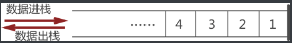
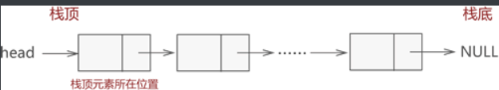
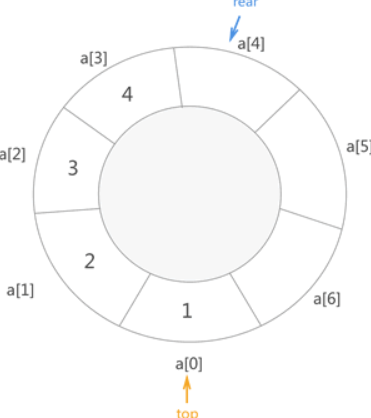
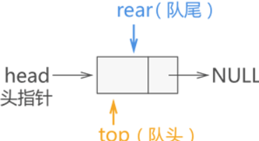
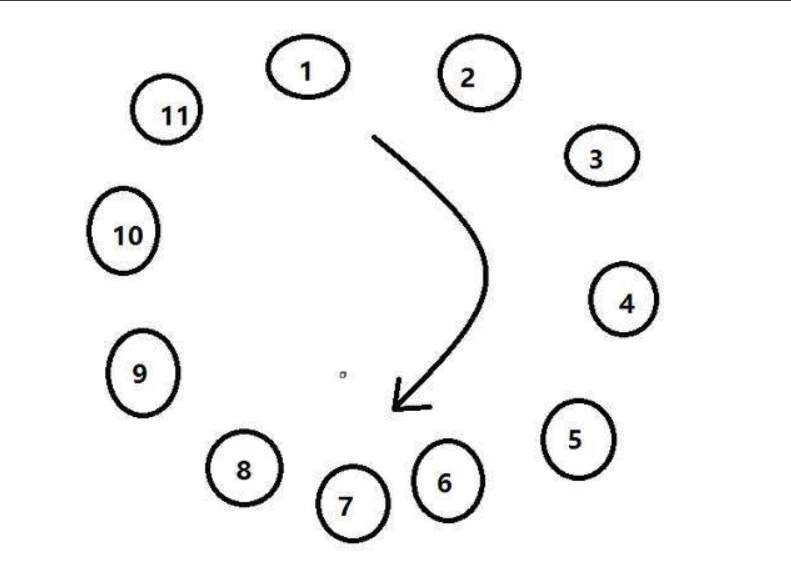

# 栈和队列

[toc]

## 栈的基本概念

同顺序表和链表一样，栈也是用来存储逻辑关系为 "一对一" 数据的线性存储结构



栈存储结构与之前所学的线性存储结构有所差异，这缘于栈对数据 "存" 和 "取" 的过程有特殊的要求：

1. 栈只能从表的一端存取数据，另一端是封闭的
2. 在栈中，无论是存数据还是取数据，都必须遵循"先进后出"的原则，即最先进栈的元素最后出栈。

什么是栈

栈是一种只能从表的一端存取数据且遵循 "先进后出" 原则的线性存储结构

通常，栈的开口端被称为栈顶；相应地，封口端被称为栈底

```c
int arr[10], top = -1;
double arr[100];
int top2 = -1;
node arr[100];
int top3 = -1;
```


## 栈的实现

栈的具体实现有两种：

1. 顺序栈：采用顺序存储结构可以模拟栈存储数据的特点，从而实现栈存储结构；
2. 链栈：采用链式存储结构实现栈结构；

### 顺序栈

初始化：

``` c
	int a[100],top=-1;
```

入栈：

``` c
a[++top] = value;		//将value入栈
if(top != 100){
    a[++top] = value;
}
```

出栈

``` c
if(top!=-1)
	value = a[top--];		//出栈，有返回值情况
top--;		//无返回值情况
top = -1;		//清空栈
```

### 链栈



链栈实际上就是一个只能采用头插法插入或删除数据的链表

初始化：

```c
typedef struct node{
    int value;
    struct node* next;
}node;

int main() {
    node* stack = (node*)malloc(sizeof(node));
    stack->next = null;
    
    // 入栈
    int value = 1;
    node* q = (node*)malloc(sizeof(node));
    q->value = value;
    q->next = stack->next;
    stack->next = q;
    
    // 出栈
    if(stack->next != null) {
        node* temp = stack->next;
        stack->next = temp->next;
        printf("%d", temp->value);		// %d, %f, %lf, %c, %s
        // ''  ""
    }
}
```


``` c
typedef struct node{		//结点存储结构
    int data;
    node* next;
}node;
node* stack = (node*)malloc(sizeof(node));		//链表头节点，可作为栈来使用
stack->next = NULL;
```

入栈：

``` c
void push(node* stack,int i){		//以头插法插入就是入栈
    node* temp = (node*)malloc(sizeof(node));		//初始化结点
    temp->data = i;
    temp->next = stack->next;		//头插法
    stack->next = temp;
}
```

出栈：

``` c
int pop(node* stack){		//取回第一个结点的值，然后删除第一个结点
    if(stack->next==NULL)		//栈不空
        return 0;
    node* temp = stack->next;		//temp是第一个结点
    stack->next = temp->next;
    temp->next = 0;
    int i = temp->data;
    free(temp);
    return i;
}
```

## 栈的应用

1. 进制间的转换， 2 6 8 10 16 （这些进制间的互转）

``` c
temp = 0
// i => n,  把二进制转换为了十进制
while(i){	// 2 进制
	if(i%10)		// 取个位数
        n += power(2,temp);		// math.h
    i /= 10;
    temp++;
}
```


``` c
// 将一个十进制的数转换为八进制
int* func(int n) {
    int arr[100], top = -1;		// 初始化一个栈，用来保存余数
    int index = 1;
    if(n < 0){		// 如果n为负数，就转换为正数
    	index = -1;
        n *= -1;
    }
    while(n != 0) {		// 每次都除以8，记录余数，直到 n 为 0
        arr[++top] = n%8;
        n /= 8;
    }
  	return arr;
}
```


``` c
void conver(int* stack,int top,int i){		//stack是栈，已经定义过，将i按二进制存进stack中
	while(i){
        stack[++top] = i%2;		//取余数
        i /= 2;
    }
}
void output(int* stack,int top){		//输出栈
	while(top!=-1)
        printf("%d\t",stack[top--]);
}
```


2. 括号匹配 

（1+[5*6+7-1]-1)   (

```c
// 括号匹配
bool func(char* str, int n) {
    if(!str || n<=0) {	// 字符串不存在就直接返回
        return false;
    }
    char stack[100];	// 初始化一个栈保存括号
    int top = -1;
    for(int i=0;i<n;++i) {
        if(str[i] == '(' || str[i] == ')' || str[i] == '[' || str[i] == ']') {
            switch str[i]: {
                case '(': {
                    stack[++top] = '(';
                    break;
                }
                case '[': {
                    stack[++top] = '[';
                    break;
                }
                case ')': {
                    if(stack[top] == '(') {
                        --top;
                    } else {
                        return false;
                    }
                }
                case ']' :{
                    if(stack[top] = '[') {
                        --top;
                    } else {
                        return false;
                    }
                }
            }
        }
    }
    if(top == -1) {		// 防止出现多余的括号
        return true;
    } else {
        return false;
    }
}
```


``` c
int function(char* str){		//判断str中括号是否匹配
    if(!str)			// 字符串不存在
        return 0;
    char stack[100],temp;
    int top=-1;
    for(int i=0;str[i]!='\0';++i){
		temp = str[i];
        if(temp=='('||temp==')'||temp=='['||temp==']'){
			if(temp=='('||temp=='[')
                stack[++top] = temp;
            else if(top!=-1&&(stack[top]=='('&&temp==')'||stack[top]=='['&&temp==']'))
                top--;
            else
                return 0;		//如果括号不匹配的情况
        }
        if(top==-1)
            return 1;
        else
            return 0;
    }
}
```


## 队列的基本概念

  队列，和栈一样，也是一种对数据的"存"和"取"有严格要求的线性存储结构。

与栈结构不同的是，队列的两端都"开口"，要求数据只能从一端进，从另一端出：


通常，称进数据的一端为 "队尾"，出数据的一端为 "队头"，数据元素进队列的过程称为 "入队"，出队列的过程称为 "出队"。

队列中数据的进出要遵循 "先进先出" 的原则。

## 队列的构建

队列存储结构的实现有以下两种方式：

1. 顺序队列：在顺序表的基础上实现的队列结构；
2. 链队列：在链表的基础上实现的队列结构；

### 顺序队列

初始化：

``` c
int a[100],front=0,rear=0;		//初始化队列，假设最大长度也不超过100
```

入队：

``` c
if((rear+1)%100!=front){		//队列不满
	a[rear] = value;
	rear = (rear+1)%100;
}
```

出队：

``` c
if(front!=rear){		//队列不空
	value = a[front];
	front = (front+1)%100;
}
```



这只是一个想象图，在真正的实现时，没必要真创建这样一种结构，我们还是使用之前的顺序表，也还是使用之前的程序，只需要对其进行一点小小的改变：整除队列的长度

### 链队列

链式队列的实现思想同顺序队列类似，只需创建两个指针（命名为 top 和 rear）分别指向链表中队列的队头元素和队尾元素



链式队列的初始状态，此时队列中没有存储任何数据元素，因此 top 和 rear 指针都同时指向头节点。

初始化：

``` c
//链表中的节点结构
typedef struct QNode{
    int data;
    struct QNode * next;
}QNode;
//创建链式队列的函数
QNode * initQueue(){
    //创建一个头节点
    QNode * queue=(QNode*)malloc(sizeof(QNode));
    //对头节点进行初始化
    queue->next=NULL;
    return queue;
}
```

入队：

``` c
QNode* enQueue(QNode * rear,int data){
    //1、用节点包裹入队元素
    QNode * enElem=(QNode*)malloc(sizeof(QNode));
    enElem->data=data;
    enElem->next=NULL;
    //2、新节点与rear节点建立逻辑关系
    rear->next=enElem;
    //3、rear指向新节点
    rear=enElem;
    //返回新的rear，为后续新元素入队做准备
    return rear;
}
```

出队：

``` c
void DeQueue(QNode * top,QNode * rear){
    if (top->next==NULL) {
        printf("队列为空");
        return ;
    }
    // 1、
    QNode * p=top->next;
    printf("%d",p->data);
    top->next=p->next;
    if (rear==p) {
        rear=top;
    }
    free(p);
}
```


约瑟夫环

问题描述：有M个人，从1到M编号，按照编号顺序围成一圈。从第一个人开始报数(从1报到N)，凡报到N的人退出圈子。然后下一个小朋友会继续从 1 开始报数，直到只剩一个人为止
问：最后留下的人的编号是几号。  也叫 约瑟夫环问题。



算法思想：每个人的编号存放在一个数组 a 中，主函数中决定人数的个数以及报数的上限值 m，设计一个函数实现对应的操作。函数的形参有整型数组 a、整数 n 和 m，n 用来接收传递的人数，m 用来接收报数上限，函数的返回值为空；函数体中输出出列人的顺序。
	函数中利用循环访问数组中 n 个元素，每次访问元素，设定内循环连续访问 m 个元素，元素访问的下标为 k，访问到第 m 个元素时，如果元素不是 0，此时输出元素 a[k]，再设定 a[k] 为 0，继续访问后面的元素。

``` c
#include <stdio.h>
#define N 100
int josef(int n,int m)		//约瑟夫环的实现，n个人，数m
{
    int a[100];
    for(int i=0;i<n;i++)	//初始化
        a[i]=i+1;
    int i,j,k=0;			// k 是第几个开始，转圈报数
    for(i=0;i<n;i++)		//循环n次，每次出列一人
    {
        j=1;		//j是报数
        while(j<m)		//数数，数m-1次
        {
            while(a[k]==0)		//找到不等于0的人
            	k=(k+1)%n;
            j++;		//加一次代表数了一次数
            k=(k+1)%n;
        }
        while(a[k]==0)      //找到第m个人
        	k=(k+1)%n;
        printf("%d ",a[k]);
        a[k]=0;     //变成0，出列
    }
    return 0;
}
int main()
{
    
    int i,j,m,n;
    printf("input n and m：");
    scanf("%d%d",&n,&m);
    printf("\n output：\n");
    josef(n,m);
    printf("\n");
    return 0;
}
```


``` c
/约瑟夫环函数,用链表实现
void function(int n,int m){		//实现约瑟夫环
    node* p = (node*)malloc(sizeof(node));		//循环链表的初始化
    p->next = p;
    node* tail = p;
    for(int i=1;i<=n;++i){		//初始化链表
        node* temp = (node*)malloc(sizeof(node));
        temp->data = i;
        temp->next = 0;
        tail->next = temp;
        temp->next = p->next;
        tail = temp;
    }
    node* temp1 = p,*temp2 = p->next;
    for(int i=0;i<n;++i){		//每次循环出列一人，出列n次
        for(int j=1;j<m;++j){		//找到m的人
            temp1 = temp1->next;
            temp2 = temp2->next;
        }
        temp1->next = temp2->next;
        temp2->next = 0;
        printf("%d\t",temp2->data);
        free(temp2);
        temp2 = temp1->next;
    }
}
```


