# 太阳辐射模型综述

发表时间：2012.12.29

发表者：A. K. Katiyar，C. K. Pandey

## 基于Angstrom模型估算太阳辐射

### Angstrom模型

公式： *$H/H_0 = a + b(S/S_o)$*

$H$是水平面上的每天每平方米的太阳辐射量

$S$是水平面上的每天的日照时长

$H_0$是水平面上的每天每平方米的太阳辐射量的理论最大值

$S_0$是水平面上的每天的日照时长的理论最大时长

输入参数：维度$L$ ,一年中的第几天$D_n$

根据一系列公式可计算出 $H_0$，$S_0$

根据观测站数据得出 $H$, $S$ ，然后线性回归可以到 $a , b$ 值，如果以天文辐射为起始值，$a,b$系数反映了大气对太阳辐射的削弱作用；如果以晴天太阳总辐射为起始值，$a,b$系数反映了云量遮蔽度的影响（稳定性较差）；如果以理想大气总辐射为起始值，$a,b$系数主要反映了大气中

#### 1.低阶模型

由Angstrom模型衍生出了30个低阶的模型

| model | 地点       | 时间 | 放弃 |
| ----- | ---------- | ---- | ---- |
| 1     |            |      | 1    |
| 2     | 也门       |      |      |
| 3     |            |      | 1    |
| 4     | 印度       |      |      |
| 5     |            |      | 1    |
| 6     | 意大利     |      |      |
| 7     | 约旦       |      |      |
| 8     | 赞比亚     |      |      |
| 9     |            |      | 1    |
| 10    | 巴基斯坦   |      |      |
| 11    | 意大利     |      |      |
| 12    | 全球       |      |      |
| 13    | 美国       |      |      |
| 14    | $60N-70N$  |      | 1    |
| 15    | 印度       |      |      |
| 16    |            |      | 1    |
| 17    |            |      | 1    |
| 18    | 土耳其     |      |      |
| 19    | 阿尔及利亚 |      |      |
| 20    | 土耳其     | 夏冬 |      |
| 21    | 土耳其     |      |      |
| 22    | 巴基斯坦   |      |      |
| 23    | 中国       |      |      |
| 24    | 埃及       |      |      |
| 25    | 土耳其     |      |      |
| 26    | 中国       |      |      |
| 27    | 孟买       |      |      |
| 28    |            |      | 1    |

29模型基于平均气温和降水

30基于太阳磁偏角

#### 2.高阶模型

由于基于气候的线性模型不一定适合求极值，因为它高估了没有云的时候的总辐射

| model | 地点     | 时间 | 放弃 |
| ----- | -------- | ---- | ---- |
| 31    |          |      | 1    |
| 32    | 全球站点 |      |      |
| 33    | 土耳其   |      |      |
| 34    | 斯里兰卡 |      |      |
| 35    | 土耳其   |      |      |
| 36    | 美国     |      |      |
| 37    | 土耳其   |      |      |
| 38    | 土耳其   |      |      |
| 39    | 利比亚   |      |      |
| 40    | 土耳其   |      |      |
| 41    | 土耳其   |      |      |
| 42    | 土耳其   |      |      |
| 43    | 土耳其   |      |      |
| 44    | 土耳其   |      |      |
| 45    | 巴基斯坦 |      |      |
| 46    | 土耳其   |      |      |
| 47    | 土耳其   |      |      |
| 48    | 土耳其   |      |      |
| 49    | 印度     |      |      |

50模型使用了相对湿度

51模型使用了相对湿度，最高温度

#### 3.基于环境温度的太阳总辐射估算

52模型使用了温差

53模型使用月最高温度和月最低温度

54模型使用了最高和最低气温

## 总结

### 作者总结

1. 为了开发合适的太阳辐射模型，需要给定位置的太阳辐射信息，但因为缺乏可信赖数据，所以需要经验模型来预测和估计全球太阳辐射
2. 从Angstrom模型衍生出30个线性模型，经验系数由第一阶回归分析结果的到，由于误差存在了对全球辐射的高估，但是一阶计算量少，且相关性超过第二和第三阶数，常常用来估计水平表面上的平均太阳辐射量
3. Katiyar和Pandey模型被认为是最精确的模型（就是该文作者:happy:），基于温度的模型具有发展潜力，它可用于估计无法获得持续日照地区的太阳辐射量

### 本人总结

统计了54个模型，7个模型使用了气候方面的参数（即很难无法实现的模型），13个模型没有说明适用于哪个地点或者直接就说适用于全球的太阳辐射估计（对于该点本人是持怀疑的态度），剩下的模型地点重复率很高（如土耳其可能就占了三分之一以上）

故，实现效果可就 emmm，:cry:

## 中国相关文献阅读

知网上搜索了大概有八篇相关的论文，其中有一篇为外国论文，按时间顺序阅读结果如下

### 1. 中国地区太阳总辐射的空间分布特征

时间：1963

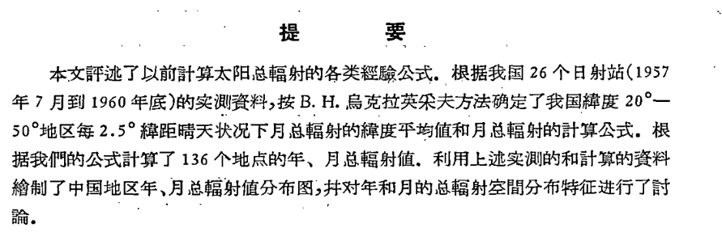

因为总辐射的观测站少，当时的学者就已经有了寻求日照或者云量与总辐射的经验关系。

作者指出，青藏高原占全国面积四分之一以上，且平均海拔约为4000米，辐射情况特殊，宜将中国分为青藏高原区和平原区进行讨论，最终得到了一副中国年总辐射的分布图，并从空间分布特征的角度上对其进行了解释。

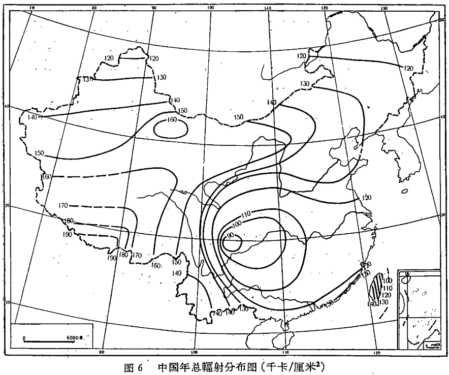

ps: 按行政区划分来寻求模型参数可能并不好，作者在解释的时候多次提到了云量的影响，Angstrom公式并未考虑气候方面的参数

### 2. Angstrom公式参数对$ET_0$的影响及$FAO$建议值适用性评价

时间：2010

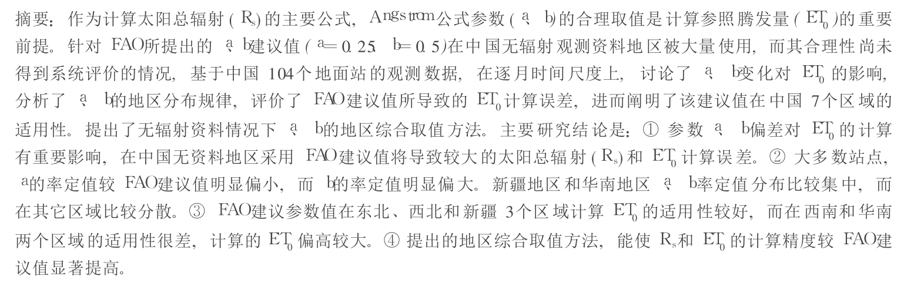

该文讨论了Angstrom公式参数取值对[参照腾发量](https://baike.baidu.com/item/%E5%8F%82%E7%85%A7%E4%BD%9C%E7%89%A9%E8%85%BE%E5%8F%91%E9%87%8F)（$ET_0$）的影响，公式参数$a,b$的合理性及其地区分布规律，提出了在无辐射资料的情况下，$a,b$的取值方法,对[FAO](http://www.fao.org/home/zh/)的参数建议作出了一个评价

该文根据气候特征把以下的104个气象站分为了7组

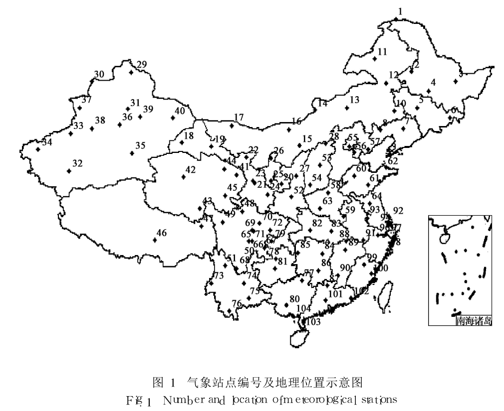

Anogstrom公式是有Anogstrom于1924年提出，后来有一些学者对其进行了持续的改进，提出了各种形式，但目前任广泛使用其基本的线性形式。（引用的该文）式子中的参数$a,b$反映了外空辐射通过大气层过程中的衰减特征，（引用）该文是在太阳辐射在植物腾发量上的一个应用，因为$a,b$的偏差引起了太阳辐射$R_s$的相对变化，经$K$(推导出的一个系数)缩放引起了$ET_0$的变化，关系如下：

104个站点的$K$值计算结果如下，过程及原理作者未说明：

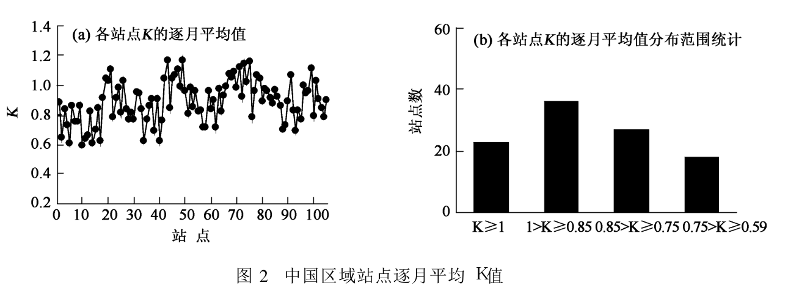

根据$FAO$建议值，$a,b$的偏差与$R_s$的相对误差关系为：

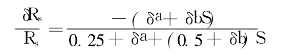

讨论$\delta a,\delta b$各自对$R_s$的影响程度，再比较7个分组计算出的$a, b$参数，就可对$FAO$建议值适用性进行客观准确的评价

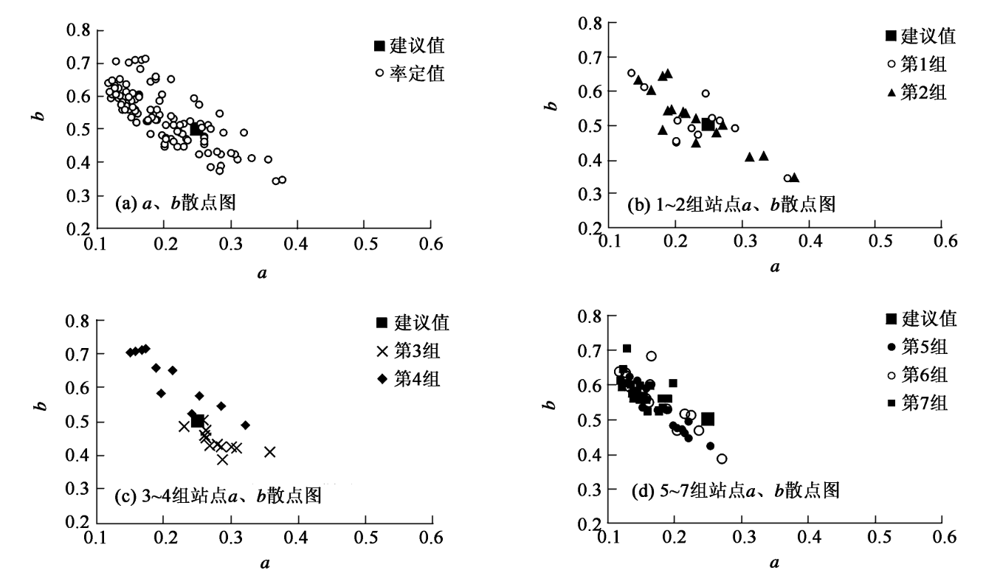

最后的结论大概就是影响较大，适用性在东北和西北适用，在其余地方适用性并不高。

ps: 这是Angstrom公式的应用，$a,b$显然要进行合理的地区综合取值，但是$FAO$的$a,b$建议值范围扩大到了整个中国，在这个明显有问题的前提下，鞠晓慧、翁笃鸣等学者做出了一些研究，在这些研究已经说明的情况下，本文作者在其基础上扩展到了参照腾发量，因为$a,b$选取值的不合理产生了多少误差，将中国划分了7个区域，哪些能适用与$FAQ$的建议，然后就成功的写了一篇论文:happy: ，思路很清晰，工作量和论文质量都很好，后面可以考虑review。

刚不久和乐老师、昊凌一起讨论了一下我们全球太阳能辐射量计算项目的做法，在这里想mark一下：首先我得看论文，有一个大概的思路：

1. 先看论文：全球总共有多少相关模型，是否都是由Angstrom公式衍生出来的，哪些模型更加好；
2. 数据方面得找到全球记录太阳辐射的站点，模型不应根据行政区来选取，可能是根据地理气候特征来选取，也可能是根据气象站点记录数据的相似性和空间上的相近（这其实也是看论文，或者再讨论来决定的）
3. 论文与数据做完，设计系统应该具备哪些功能，应该是什么样的，这时候我应该去咨询张锴师兄其他人怎么计算出太阳辐射的（或者就这几天也可？）
4. cesium做前端（想加上vue？），python处理数据，组成一个系统

### 3. 关于不同海拔的太阳辐射计算

时间:2015

#### 基础知识

看这篇论文的时候去补了一点基础知识

[太阳辐射](https://zh.wikipedia.org/wiki/%E5%A4%AA%E9%99%BD%E8%BC%BB%E5%B0%84)

大气层外太阳频谱：

地球表面太阳频谱：

不同维度所有太阳辐射强度

[大气层](https://zh.wikipedia.org/wiki/%E5%9C%B0%E7%90%83%E5%A4%A7%E6%B0%94%E5%B1%82)

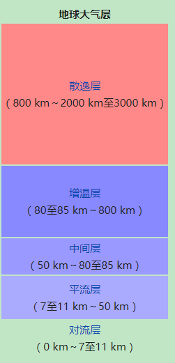

[国际标准大气](https://en.wikipedia.org/wiki/International_Standard_Atmosphere)

[比尔定律](https://zh.wikipedia.org/wiki/%E6%AF%94%E5%B0%94-%E6%9C%97%E4%BC%AF%E5%AE%9A%E5%BE%8B)

[克里金插值](https://xg1990.com/blog/en/archives/222) 这篇博客讲的很好

地理学第一定律：All attribute values on a geographic surface are related to each other, but closer values are stronger related than are more distant ones.

### 继续论文阅读

改论文首先也说明了站点不够需要建立模型来计算太阳辐射，然后介绍了的是一些适用于海平面或低海拔地区的理论模型（这是我第一次看到），作者提出这些模型都是基于均质大气，然后作者提出了非均质大气模型下计算任意海拔的太阳辐射，然后作者又将非均质大气模型分为标准大气模型和概率统计大气模型进行了推导。

单波长太阳辐射：单位面积单位时间单波长的太阳辐射能量

全波长太阳辐射：单波长太阳辐射对全波长的积分

太阳辐照度：太阳光经过大气层的吸收、反射、散射等作用后到达地球某表面的单位面积单位时间的太阳辐射能量

太阳辐照量：太阳光经过大气层的吸收、反射、散射等作用后到达地球某表面的单位面积某段时间的太阳辐射能量

太阳常数：$S_c = 1361 W/m^{-2}=4.92MJ/(m^2*h)$   

太阳辐射计算中，主要考虑对流层和平流层对太阳辐射的消弱作用（未知）

太阳光抵达地表的过程中，并不是和路径总长度（经过大气层的路径）成正比的，而是与抵达地表的过程中所碰撞的空气分子的总数目成正比的。所以可以提出均质大气层的概念。均质大气层的合理性，在引文24有解释

为了计算不同海拔的太阳辐射，提出了标准大气模型和概率统计大气模型来计算不同的海拔上的太阳辐射。因为将大气看成是水平的了，所以需要有一个修正的过程（这里面没有细看了，和我做的相关性并不高）

然后作者居然讨论不同季节、维度和时间对太阳辐射的影响！！！

作者认为计算天顶角，就可以得到相同天气的任何季节任何时间任何地方的光谱辐照密度，从而可以计算不同时间、维度、季节和海拔高度的太阳分布图（还是得根据气候对地球进行划分啊，我觉得有必要验证一下作者引用的那几个模型与Angstorm公式的正确性了）

最后作者对大气模型进行了修正。均质大气模型误差因素有：曲率（实际上就是天顶角的修正），混合气体；非均质大气模型的误差因素：曲率，有效高度的确认，混合气体，然后修正过程也没有细看（后悔数学没学好了），最后是对比验证，感觉验证结果不是那么好。

ps:在读这篇论文的过程中补充了一些基础知识，然后这里面提出了几个理论模型，晚上再看吧，目前对太阳光从外太空抵达地球表面有了一个认知，结合昨晚我看的计算太阳辐射的网站，是否考虑做出一个3D的，具有较为真实的大气层（每个大气层的厚度是不一样的）的模拟呢？然后计算其太阳辐射。这篇论文思路很好，已经有了计算海平面的很好的模型，我怎么应用到不同的海拔上去呢，靠着这个思路该文作者做了一系列研究。现在我就是在已经有PVGIS这么一个庞然大物，我是否能在其基础上做点什么东西呢？

该论文不合理，太阳光是很多的，它只考虑了一束太阳光，难道要在半个地球的大气层上进行积分吗？如果该积分的好积分的话，可以考虑做一做，而且中间过程实在太复杂了，怪不得都用经验公式了

### 4. 淮北平原Angstrom公式参数校正及太阳总辐射时空特征分析

时间：2018

使用最小二乘法和遗传算法对Angstorm公式的$a,b$参数进行了率定，遗传算法更优，总结了淮北平原的$R_s$的趋势与特征

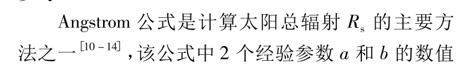

引文10到14找机会看一下，上一篇一句话没有提到Angstrom公式，是否不太合理。提及了左大康将该公式引入的中国。参数率定讲了最小二乘法和遗传算法

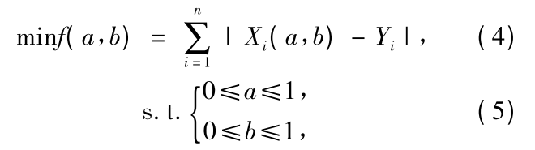

评价指标：平均误差、平均绝对误差、均方根误差、相关系数（我也可以）

结论和第二篇类似，$FAO$建议值并不适用于淮北平原，且遗传算法优于最小二乘法，得到了淮北平原$R_s$的时空分布特征

ps: 看完第二篇再看这一篇论文，感觉收获不大，可能是第二篇很多页，这一篇论文页数很少的原因吧。

### 5. 基于Angstrom-Prescott公式的中国太阳辐射与日照时间的关系研究

时间：2019

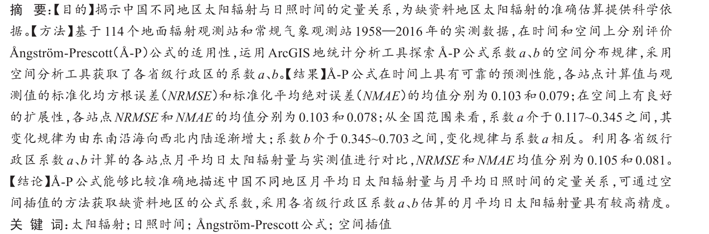

这篇论文的写的真好。中国目前有739个常规气象观测站，但仅有130个太阳辐射观测站，其中只有114个站具备日照观测数据，各种研究进展就不赘述了，后面提的几个问题也是我关心的重点：时间上该公式是否能准确预测，空间上已有站点是否能扩展到其他缺资料的地区，按行政区划分是否不合理。

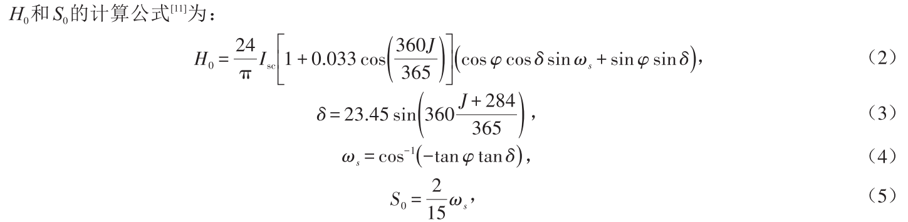

[中国气象网](http://data.cma.cn)提供114个太阳辐射观测站数据，存在缺失情况，进行了一些预处理，分析采用方法是最小二乘法，以两种方法进行了验证：1. 四分之三训练集，四分之一测试集 2. 空间上对站点进行了分割，选择113个站点作为训练集拟合公式得到公式系数，对113个站点的公式系数进行空间插值，采用了经验贝叶斯克里金法插值得到剩余站点的公式系数，然后用剩余站点的数据进行验证（是否分配不合理，就一个站点作为测试集），第一种方法预测时间，第二种方法预测空间

评价标准：决定系数（$R^2$)，平均绝对误差（$NAME$），均方根误差（$NRMSE$）

这引文16，17得看。

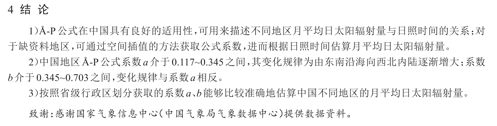

ps：写的真好，赶时间看完的，会review的

### 6. 基于Anstrom-Prescott模型和空间插值的山东省月太阳辐射再估算

时间：2020

和上一篇一样，介绍历史介绍的更为详细了，拟合方法也是最小二乘法，只是空间插值也是变为三个了，而且范围只是山东省，感觉就是上一篇的翻版，要是没有它的引文我都不信。结论是最小曲率法可能是较优的插值法

ps：该作者是研究生，感觉水平不如上一篇了(我这个菜鸡有什么资格说这个，，)，看懂上一篇可以不用再看这一篇了

### 7. 基于年内尺度的中国大陆地区Angstrom公式参数校正和优选

时间：2020

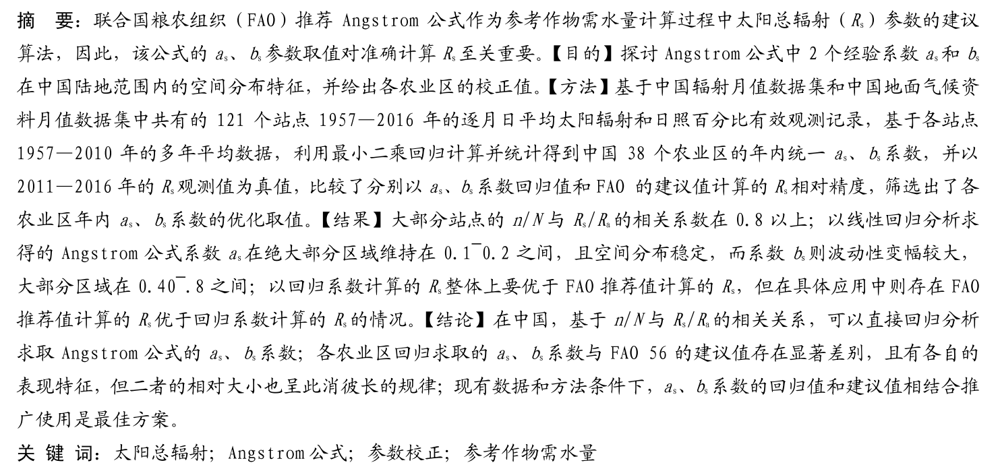

对数据进行预处理，数据从中国气象数据网下载，$R_a$使用了$FAO56$建议的计算程序，农业区划来自国标。

方法也是最小二乘法，过程就不说了，结果是中国大陆个农业区Angstrom公式参数年内的推荐值。

ps：站点更新为121个了，这篇论文也是讨论了$FAO$建议值是否适用了，结果就是建议值与实际拟合的系数进行结合适用更好。但是该文的亮点在于，统一了农业区划尺度下的$a,b$取值，其实我要做的就是全球尺度下，按气候划分的各区域的$a,b$取值，再加一个交互好看的系统出来（好难啊）

### 8.

## 需要review的论文

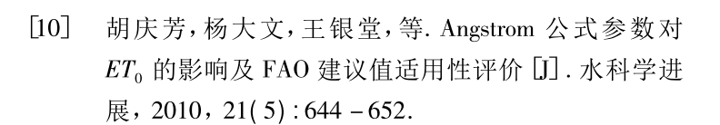

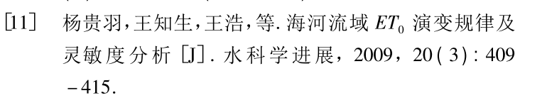

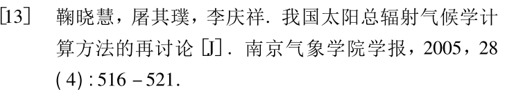

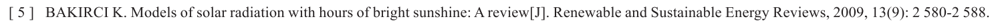

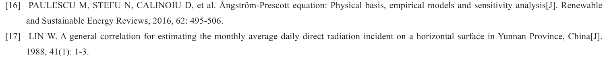

## 外国相关论文阅读

### 1. A comprehensive review of empirical models for estimating global solar radiation in Africa

作者：尼日利亚卡拉巴尔大学理学院物理系  P.O. Box

发表时间：2017

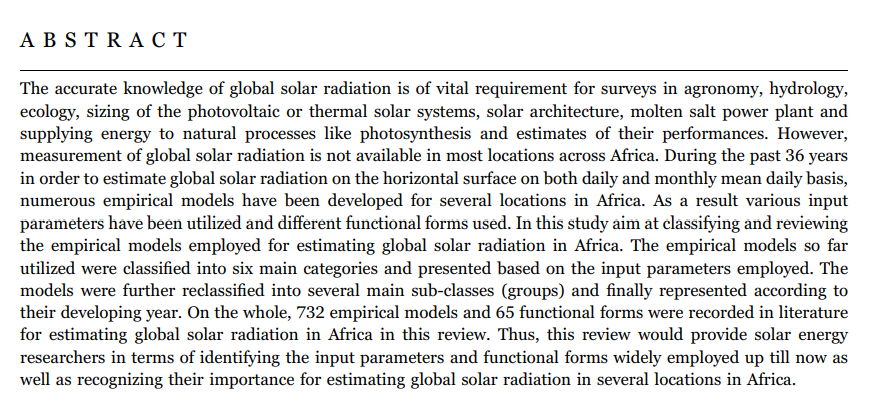

大意是：太阳辐射应用方面很多，但是非洲大部分地球无法获得太阳辐射的测量数据，但是有很多的经验模型，该论文旨在分类和审查估算非洲太阳辐射的模型。目前的经验模型的输入分为六个主要类别，文献记录了732个模型和65中功能形式。

太阳辐射是气象参数、地理参数、天文学参数、物理参数的函数，气象参数有：蒸发，云层，相对湿度，降水，温度，日照时长，地外太阳辐射和一些环境的参数；地理参数有：经纬度，海拔，方位角等；天文学参数：太阳常数，日地距离，太阳偏角等； 物理参数：空气分子的散射，水蒸气含量，粉尘，大气分子的散射

Angstrom第一个提出经验模型来测量晴天的太阳辐射，Prescott和Page使用地外太阳辐射代替晴空辐射，使模型式子更加简介，前十年，一些学者在其基础上发展了一些新的模型，使用了同样的参数。该文是review了估计非洲的太阳辐射的相关模型，，，（没大看懂英文）

根据气象参数，模型可分为一下六类：

1. 基于日照的模型（我前面一直看的都是这个模型）
2. 基于云的模型
3. 基于温度的模型
4. 基于相对湿度的模型
5. 基于降水的模型
6. 基于混合参数的模型

该文提出的模型都给出了具体的地点，提出了很多模型，应该覆盖了非洲的大部分地区

基于阳光的模型提出了很多模型，应该也是最主要的模型，大部分是线性的，也有二阶，三阶，非线性等形式，分了12个子类，没有进行评价，也只是列出来所有模型

基于温度的模型适用于没有日照时间的地区，根据每日的最高温度、平均温度、最低温度等可以得出其太阳辐射，分了18个子类

基于相对湿度的模型是因为大部分气象站都是测量的气象参数，没有日照时长和温度等数据，所以有了基于相对湿度的模型，模型较少，就分了两个子类

基于云量的模型，模型较少，就分了两个子类

基于降水的模型，模型很少

基于混合参数的模型，参数包括但不限于已经提到的参数，分为14个子类，提出了大量的模型，但是也没有进行评价

最后作者在讨论的时候表明，有研究人员将太阳辐射计算模型分为了基于日照、云、温度和混合参数等四个类型，普遍认为基于日照的模型使用的最多，可能是因为它在大多数气象站都使用，基于温度模型可以的进行校准，基于云层的模型可以作为替代方案，基于混合参数的模型一般精度很高，但是大多数参数不容易获得。作者在它的基础上加了两个类别：基于相对湿度和降水，总体而言，有732个经验模型，各种类型占比如下：

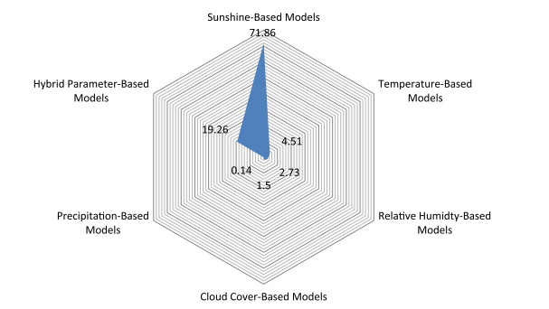

通常，不可能用一个（没写完

### 2. Estimation of Hourly, Daily and Monthly Global Solar Radiation on Inclined Surfaces: Models Re-Visited

作者：马来西亚布特拉大学电气与电子工程系  Seyed Abbas Mousavi Maleki

时间：2017

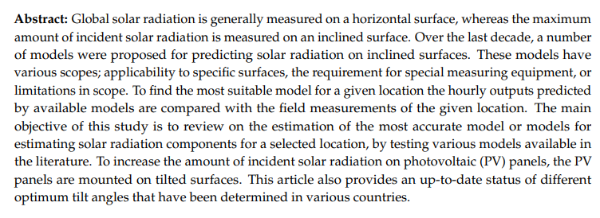

摘要大意：倾斜表面的太阳辐射大于水平表面的，各种预测倾斜表面的太阳辐射模型有对应的特殊要求。该文提供了各个国家/地区的最佳倾斜角度。

背景，缺乏不同位置识别最准确模型的审查研究，然后作者说：让我来。然后作则对各种不同的知名模型进行了全面综述，为不同地理位置提供介绍精度最好的那几个模型。

然后介绍了几个参数：太阳偏角，时角，太阳方位角，维度，每小时地外太阳辐射，水平面上每小时太阳辐射量。

地表接受的太阳辐射有：直接的太阳辐射和漫射的太阳辐射。当太阳光穿过大气层的时候，其中有一些被称为光束的辐射到地表，有明显的阴影，这种直接的辐射可以通过温度计测量。漫射的太阳辐射是穿过太阳光的一部分，被水蒸气，颗粒物消耗，分散，反射，这种辐射没有阴影，无法聚焦，此类辐射的收集需要精确的仪器，漫反射模型可分为参数模型和分解模型。

参数模型：

ASHRAE 模型提供了一种简单的方法，该方法被工程学和建筑社区广泛使用

Machler and Iqbal 模型专门研究了每小时太阳辐射中的漫反射

Parishwad 模型 使用了统计的方法估计ASHRAE模型，对印度不同地点的六个地方进行了指标分析

Nijegorodov 模型 使用计算机预测了ASHRAE模型的常数

分解模型：

分解模型通常仅使用与全球辐射有关的数据来估计扩散来自全球太阳辐射数据的辐射，分解模型基于在水平面上的漫射和总辐射，接下来作者就又介绍了很多个分解模型，基本都是高阶的，参数为净度系数（$M_t$)，该系数与当地的气候有关

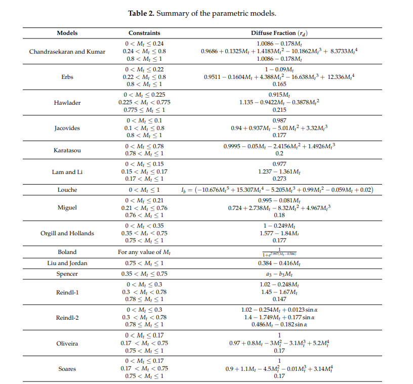

后面就开始讲倾斜表面的太阳辐射了，就没仔细看了（其实一直没有仔细看:cry:）

跳了很多，直接跳到结论了。漫射辐射模型受到维度影响很大，其余都是讲倾斜表面了。

ps：该文作用不大，不适合我，都是讲倾斜表面的了，而且没有介绍一点关于经验模型的知识

## 需要review的文章

1.2 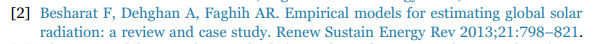

## 研究进展

### 一个为期16年（2000-2015年）的高分辨率（3 h，10 km）全球地面太阳辐射数据集

作者：唐文君  青高所

 时间：2019

最近发布的国际卫星云气候项目（ISCCP）HXG云产品和新的ERA5再分析数据使我们能够生成全球地表太阳辐射（SSR）数据集：16年（2000–2015）的高分辨率（3 h ，10 km）的全球SSR数据集，使用改进的物理参数化方案。

输入数据

- 云产品 ISCCP-HXG
- ERA5重新分析数据（表面压力，水蒸气和臭氧）
- 气溶胶和反照率（MODIS）

## 经验模型结果讨论

代码：

数据：

 lat:35.8043
lon:-84.0260

结果：