# 面向地理共享与集成的数据适配方法研究

作者：乐老师

时间：2016.3

## 摘要

地理模型的共享与集成在具体的实现与应用时，最终都要面对模型能否正确运行的问题。模型的正确运行与数据有着直接的关系：必须通过输入数据来驱动模型运行，通过输出数据来获得计算结果。由于模型本身所定义的数据规格与模型使用者所提供的数据之间往往并不直接匹配，针对模型运行的数据兼容性处理成为了模型应用过程中繁琐而关键的工作。在跨学科跨领域背景下的开放式地理模型共享与集成中，这种从原始数据向模型的数据规格之间的适配问题更加突出，也亟需解决。

本文以模型使用者正确理解地理模型的数据规格为切入点，通过设计地理模型数据规格的结构化描述方法，实现模型的数据需求的无歧义传递。在此基础上，提出了一套完整的模型数据适配方法，通过模型数据接口的统一映射和数据重构方法库的建立，形成融合数据表达、数据接口映射与数据重构的数据适配方案，从而将模型构建、数据处理和模型集成应用之间解耦。

主要研究内容与结论如下：

1. 地理模型数据规格的结构化描述
2. 地理模型数据接口的统一映射
3. 地理模型数据重构方法库的构建
4. 地理模型数据适配方案的构建

四个研究内容之间相互联系又相互解耦，模型数据规格的描述是整个研究的基础，模型数据接口的统一映射为数据适配提供统一的数据视图，数据重构方法为数据适配提供可组合可重用的方法组件，最终形成了同样可共享的数据适配方案资源。在开放式网络环境中的构建原型系统，对数据适配资源的组织管理服务、共享平台门户和辅助应用工具进行了相应的实现，验证了数据规格描述、数据接口映射、数据重构等方法的可行性。通过典型目标驱动的集成模拟实验和典型探索驱动的综合模拟实验，对数据适配方法的实用性进行了验证。

## 绪论

即使数据蕴含了模型运行所需要的全部信息，数据规格的微小差异都将导致程序不能正确运行。

地理模型数据的这种控制性、决定性作用使得数据转换成为驱动模型运行重要而繁琐的工作。地理信息领域对于空间数据的不兼容问题进行过一系列的研究，包括开发相关的数据转换系统、制定统一的数据格式和交换标准、开发统一的数据访问API等等工作，开源领域的GDAL/OGR、SDO，商业领域的FME、SDX+、OGC/TC211的相关标准都是这些工作的部分成果，空间数据的兼容性问题得到一定程度的解决。然而，地理模型所提出的数据兼容性问题涉及的层面比传统空间数据所面临的兼容性问题具有更大的综合性和复杂性：**首先**，地理模型的专业性使得其依赖的数据不单纯是经典的空间数据形态，其数据模型、结构和编码表现为对建模原理、领域传统和实现策略的多重依赖；**其次**，地理模型的数据交换，往往代表了物质、能量的传递，支撑参数表达的时空离散结构和尺度往往成为这种不兼容性的一部分；**第三，**地理模型数据蕴含的语义与约束是模型正确运行的必要条件，比如数据的量纲、单位等，即使数据结构完全一致，这些差异依然会导致模型执行无法得到正确的结果。**第四，**地理模型的输入、输出和控制参数会依赖模型的实现策略通过接口参数、内存结构、数据文件、数据库等不同的编码机制进行传递。**第五，**模型数据的处理往往需要在运行时完成，这又与具体运行环境有极大的相关性。

因而，目前亟需找到一种具有高度柔性的数据适配方法，在模型知识共享层次能够适应于不同领域的地理模型，在模型集成运行层次能够动态配制出地理模型所需要的数据，从而降低综合地理模拟研究过程中的协作难度，提高异构地理模型共享、重用与集成的便捷度。

本文所研究的地理模型数据适配方法，其核心目标是提供解除模型运行与数据规格之间紧密耦合关系的工具，在数据蕴含足够的信息的前提下，通过对模型的输入、输出、控制数据进行解析表达，对数据的时空离散、组织结构、量纲/单位、编码方法等方面进行重构和映射，便捷的实现模型与数据的匹配。

另一方面，数据作为地理空间信息建模的重要内容，为了适应于不同的应用和表达需求，诸多数据模型和数据格式被设计和发展。地理信息领域经典的数据模型以矢量和栅格表达为基础，相关的发展有对象数据模型、场数据模型、矢-栅一体化数据模型、三维数据模型、时空数据模型、几何代数的多维统一数据模型等（Molenaar，1990；Egenhofer，1991；李德仁，1997；Brown，1998；吴立新，2007；俞肇元，2013；Yuan et al., 2013）。基于这些空间数据模型发展而成的相关数据格式常常被具体的地理模型采用为其输入/输出数据的格式，如GeoTIFF，ASCII Grid，NetCDF，Shapefile等数据格式。不同的地理模型开发者针对所研究的对象，并结合自身的编码习惯，从空间信息领域中常用的数据格式中，选择一种数据格式作为模型执行程序关联的数据格式，形成默认的数据交互接口。

地理模型数据的异构性特征并不仅仅体现在数据格式这个层次上，在进行综合地理模拟的过程中，来自不同学科不同领域的地理模型数据通常具有其复杂的语义属性特征

为了实现不同系统间的数据交换，不同领域制定了大量的数据交换格式和交换方法。总的来说分为以下几类：

1. 成熟的商业软件提供的公开数据交换格式
2. 国家制定的空间数据转换标准，以标准数据格式实现数据交换
3. 国家及不同领域的组织参与制定的统一地理数据模型

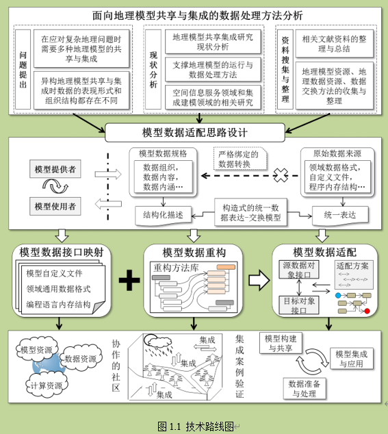

## 第二章 地理模型数据规格及其结构化描述方法

地理模型是对地理过程与机理的抽象与表达

### 面向共享与集成的地理模型特征

在本文中，服务于构建一个能够支撑复杂地理问题求解的综合地理模拟情景，所涉及的“地理模型”是指能够在特定计算平台上执行相关计算的“实体”

地理模型的运行特征：

开发模式方面：

1. 基于过程函数的开发模式
2. 面向对象的开发模式
3. 组件插件式的开发模式
4. 面向服务的开发模式（SOA)

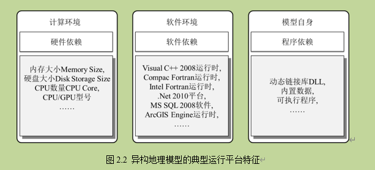

总结起来，无论是在开发模式，运行平台还是执行风格方面，地理模型在程序运行方面的异构性特征都较为突出。

### 地理模型共享与集成的特征

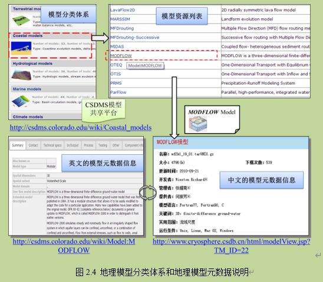

通过地理模型的分类体系和元数据信息描述，建模研究者可以通过统一的入口便捷的访问到所需的地理模型资源；在此基础上，建模研究者需要能够利用模型资源、驱动模型程序计算，这就涉及到地理模型异构的运行特征。考虑到地理模型在执行接口和数据接口上的差异性，按照特定的模型封装方法对异构的地理模型进行统一的包装，进而形成标准化的模型组件，是当前地理模型共享、集成建模框架等相关研究领域的常用方法。在某一个集成建模框架中，根据其所提供的模型封装标准，能够将异构的地理模型包装成在该建模框架内可以统一调用、组合、连接的模型组件；另一方面，地理模型作为网络服务来发布和共享时，还需要与网络服务的消息通信机制和数据传输方法相结合，形成面向服务的地理模型封装。虽然封装方法各有不同，但地理模型封装的主要目标是屏蔽模型程序执行的异构性，使之能够按照统一的方法调用，这在技术理念上与地理模型的组件插件式开发模式也是一致的。

主要有**两种方式来实现这种模型集成工作**。一种是通过**代码编写的方式**，在集成程序中引入不同的地理模型资源，调用其执行接口，按照其数据接口提供相应的数据，并在模型与模型之间的流转中加入定制式的数据处理。另一种是通过**科学工作流的方式**，制定模型间连接、组合、循环、嵌套的基本框架，将模型资源按照“节点”的方式插入到配置的工作流中；

按照地理模型的特定运行需求来准备数据，首先就需要能够正确理解模型对数据的需求；**从用户使用地理模型的角度，这种数据需求可以归结为模型的数据规格**。

从地理模型计算运行的一般特征出发，地理模型数据可分为**输入数据、输出数据**和**运行控制数据**。模型数据规格的一个最直接的体现就是数据格式。

xml（Extensible Markup Language）格式

XML 被设计为传输和存储数据，其焦点是数据的内容。HTML 被设计用来显示数据，其焦点是数据的外观。

从模型**数据参数的描述**，到**数据接口的封装**，再到**数据参数的传递和交换**，这三者贯穿于整个地理模型共享和集成过程，三者既各有分工，又内在联系。通过地理模型的集成来进行综合的地理模拟需要在科学原理正确、物理机制合理的基础上进行，而最终制约这个“集成了的地理模型”能否正确运行的一个关键要素就是地理模型数据。

模型数据规格的表现形式：

1. 自定义的数据格式：如文本文件，二进制文件，数据库等；在特定的地理模型程序中，如果读取的是自定义数据格式，则读取的规则和数据内容的组织必须完全一致。
2. 领域通用的数据格式：如Shapefile，ASCII Grid，NetCDF，GeoTIFF等；这种数据格式往往是结合领域应用特征，具有特定数据模型支撑的数据格式。
3. 内存变量形式：如主函数的命令参数，API函数的参数序列等。

常用的数据组织形式：

1. 常用特定的分隔符来区别不同的数值。
2. 数据头和数据体是常用的组织方法。
3. 数组、键值对和数据表是常用的数据结构。
4. 数据内容中通常含有一些注释字符串。

数据规格的内蕴信息

### 地理模型规格的常用描述方法

#### 基于元数据的描述方法

在地理信息领域，元数据的内容除了对一般属性信息的描述之外，还需要能够提供空间的相关信息。

#### 面向地理处理服务的数据描述方法

在地理信息处理服务相关的研究中，也没有直接采用元数据标准来描述地理信息服务中的数据信息。最为典型和常用的WPS规范（Web Processing Service）是OGC继WFS（Web Feature Service），WMS（Web Mapping Service），WCS（Web Coverage Service）推出的关于地理处理网络服务的规范。在此规范中，地理模型被当做一个个GeoProcessing来管理。

#### 面向集成建模研究的数据描述方法

**OpenMI的设计理念是提供一种组件式开发模型的接口标准，规定了模型运行时各模型之间交换数据应遵循的规范。**在OpenMI中，模型数据的描述并没有采用某一种元数据规范，也没有利用WPS中的DataType方法，而是直接面向模型的计算和模型集成时的数据交换。

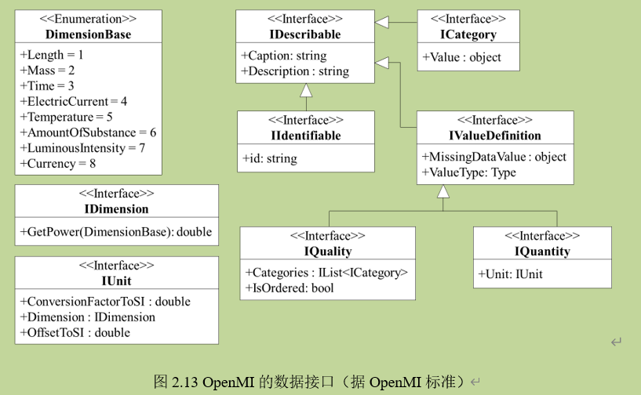

OpenMI作为被OGC认可并推广的地理模型集成标准，其对模型数据的描述是直接面向模型集成计算的，侧重于数据在程序执行层面跟模型需求的匹配。如前文所述，地理模型的正确运行并不仅仅依赖于数据类型和文件格式匹配，模型对数据内蕴的语义相关信息同样提出了限制条件。**而*OpenMI*在数据的语义信息描述方面，仅通过简单的字符串描述，其描述能力显得较为不足。**

### 面向虚拟环境仿真的数据描述方法

基于环境数据编码和语义信息关联的方式，在方法上能够有效的实现地理模型数据的语义描述。基于SEDRIS规范可以用结构化的方法描述出数据的内容和逻辑组织，且数据内容中的每个要素都可以进行灵活扩展；通过节点之间的自由组合，理论上可以实现任意数据内容的表达。但将SEDRIS应用到地理模型的共享与集成中时，这种由组织容器类-环境数据类-要素类构成的数据组织模式相比于WPS和OpenMI而言又过于繁琐和复杂。而且地理模型的共享与集成涉及到大量跨学科跨领域的概念和知识，在这个层次上EDCS的兼容性还比较欠缺。此外，地理模型对数据内容的约束性信息虽然可以通过EDCS中的相关概念条目得以体现，但诸如数据取值范围、数据单位量纲之类的信息并没有能够很好的体现出来。

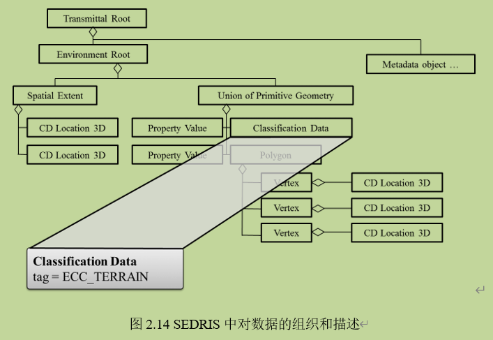

####  现有方法的总结与分析

综上所述，在模型数据规格描述的方法层面，利用层次化的组合来描述模型数据的内容结构信息成为当前公认的有效方法；无论是在地理处理服务领域，集成建模领域，还是在虚拟环境仿真领域，复杂多样的数据内容结构都采用这种方法来描述。信息关联的方式也普遍被用于数据内容的信息附加，比如单位量纲信息、空间参考信息、语义概念信息等均可以采用标签关联、URL地址关联的方式进行描述。这几种方法中，**基于元数据的方法更侧重于数据的相关属性信息的表达**；WPS基于地理处理网络服务的应用需求，结合网络数据传输的特点，对数据的描述直观、简练；OpenMI作为集成建模的规范，相比于其他方法而言，对空间离散网格和时间步长等信息的描述更为全面；SEDRIS面向综合环境仿真的研究目标，与其他方法相比，在数据的语义概念信息方面设计了系统的描述方法。

**但是现有的方法大多集中于数据本身的信息，跟模型运行相关的语义和约束信息较少地融入到其中**。虽然不同的数据格式能够利用后缀名和URL关联的方式加以描述，但这种方式却难以适应于地理建模领域中纷繁多样的自定义数据格式。在地理模型的共享与集成过程中，由于涉及到多个学科领域的异构地理模型，对于模型数据规格的描述应该是独立于具体的技术平台。地理模型相关联的数据既有空间数据，也有非空间数据，既可以是一个简单的数值，也可以是一组相互引用的数据文件，所以对模型数据规格的描述应具有较强的扩展性和灵活性。

#### 面向地理模型运行的数据规格结构化描述方法

基于以上对地理模型共享与集成中数据规格描述方法的分析，本研究从模型使用者需要了解某个地理模型能够正确运行的数据需求出发，探索地理模型数据规格的结构化描述方法。本文作者在对分布式地理建模环境的多年追踪研究中，设计了统一数据表达-交换模型（Universal Data Description eXchange Model，UDX），该模型借鉴结构化程序设计方法中使用有限结构元素表达任意程序算法的思路，力图通过构造式的方法来实现地理模型数据规格的描述，并支撑数据描述和具体数据内容的直接映射。本文从模型使用者理解地理模型、获取地理模型运行所需数据条件的角度，针对地理模型数据规格的描述需求，对统一数据表达-交换模型进行扩展。

变量类型有：**原子类型（Atomic）**、**数组类型（List）**、**组合类型（Union）**

在统一数据表达-交换模型中，主要有两个基本元素：**节点（Node）与核（Kernel）。Node负责组织模型数据的结构，每个Node都拥有自己的名称（Name）和子节点（NodeChildren）；在NodeChildren中又包含了相应的节点及其子节点。通过这种层次化的组织，能够灵活的构造出各种数据结构。Kernel负责对具体数据的存储，其中Kernel的数据类型由DTKernel来管理。总体上，Node控制数据的组织结构，Kernel管理数据的具体类型和内容。**

对于DTKernel而言，主要有三大类：简单数值类型（DTKValue），数组类型（DTKValueList）和复杂容器类型（DTKContainer）。这三大类Kernel可以分别对应到W3C规范所定义的原子类型，数组类型和组合类型。

一个节点的Kernel属于DTKValue或者DTKValueList类型，则该节点都不可以拥有子节点。而节点的Kernel属于DTKContainer类型时，则该节点可以拥有任意个数的子节点。在DTKContainer中，有四种具体的容器类型：DTKStructure，DTKList，DTKKeyValue，DTKTable。

eg：

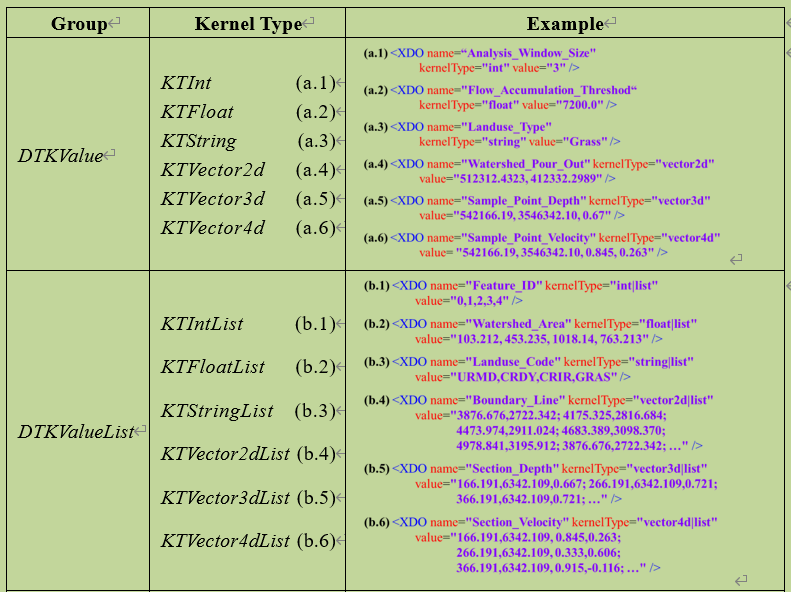

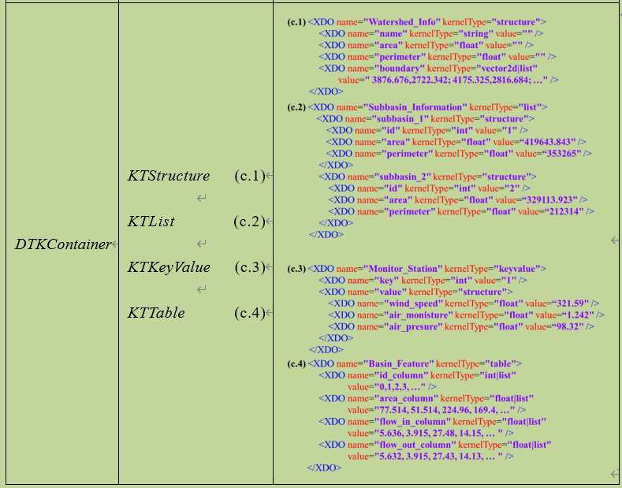

#### 地理模型数据规格的形式及结构描述

在数据内容的组织结构上，统一数据表达-交换模型包含两个主要实现。**一个是统一数据表达UDX Schema，还有一个是统一数据交换UDX Data，**两者共同构成了统一数据表达-交换模型的内容。UDX Schema和UDX Data两者在结构层次是同构的，都是基于统一的Node-Kernel结构。而UDX Schema负责对模型数据内容进行详尽的描述，UDX Data则是严格匹配于UDX Schema的具体数据内容。

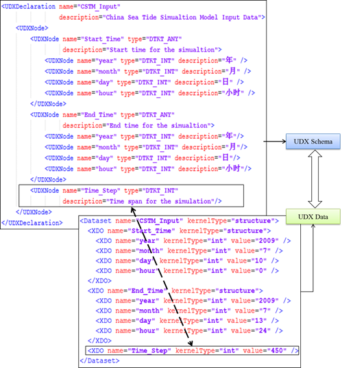

对于地理模型数据，**UDX Data是具体数据内容的存储，UDX Schema则对地理模型数据规格在形式和结构层面的描述**。

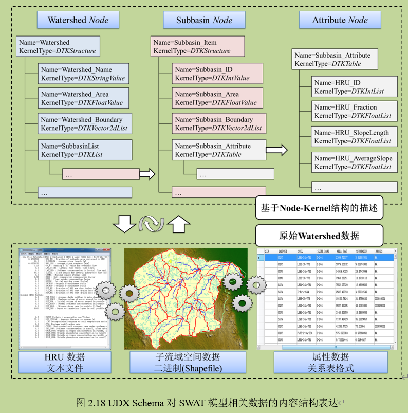

如上所述，基于统一数据表达-交换模型可以进行构造式的数据描述，但这种**Node-Kernel结构的UDX Schema只是在形式和结构层面描述了地理模型的数据规格，数据内容的内蕴信息并没有描述**。

（没看完）

## 地理模型数据接口的统一映射方法

### 地理模型数据接口的统一映射

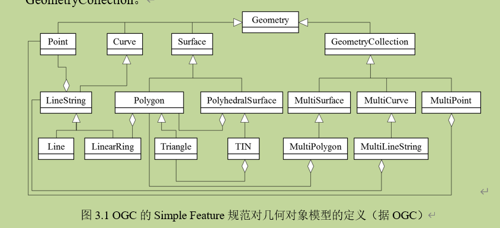

虽然地理模型的数据接口在外观上表现出来的是某种格式的数据文件、某种类型的变量，但**在内容上则是对特定信息的依赖**

领域通用数据格式都会有其相应的数据读写API（Application Programable Interface）；利用数据读写API可以控制数据内容，能够在数据的表现形式（即数据格式）和程序内存布局之间进行完整地转换。

从数据储存和数据读写API的模式考虑，领域通用数据格式主要有两种：

1. 一种是数据内容与数据读写API一致的数据格式

这种数据格式中的数据内容可以是变化的，但是其组织的模式是固定的（第几行代表什么数据，前多个字符是什么数据，这些都是固定的）；读取这种数据格式需要严格按照某个特定的数据读取方案，典型的如ASCII Grid格式，GeoTIFF格式，WKT格式，WKB格式，DXF格式，3ds格式，BIL格式，BIP格式，BSQ格式等；

2. 一种是数据内容与数据读写API不一致的数据格式

如XML（Extensible Markup Language）格式和JSON格式（JavaScript Object Notation），这两种数据格式都是在建模领域中常用的数据格式，但是XML和JSON提供的是上层的数据组织方法，对于特定的地理模型而言，需要根据自身的需要定制出相应的结构。比如说**GML就是基于XML结构对空间矢量数据的一种实现，GeoJSON是对JSON在空间矢量数据的一种实现**。另外还有结构表（Table）类型数据格式，如Excel、关系数据库等.

**原始的领域通用数据格式到基于Node-Kernel结构的UDX Data之间，可以通过API函数和数据节点操作两者的映射来进行直接的交换**。

eg:

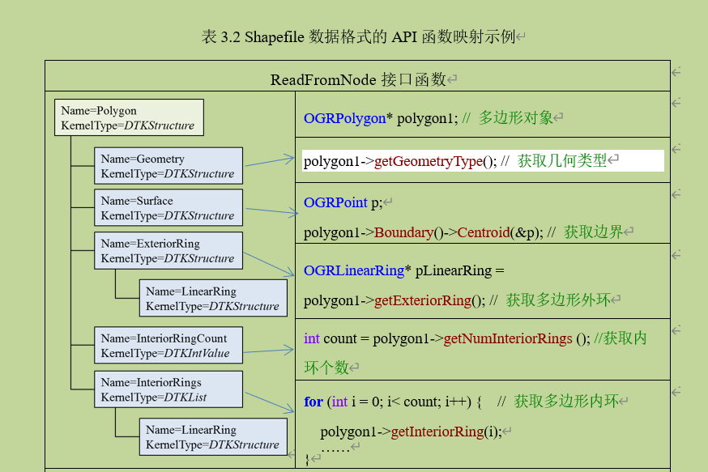

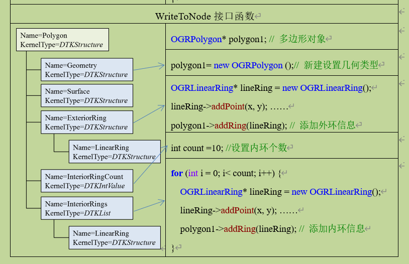

**传统的数据转换方法会从一种数据格式的文件转变为新的数据文件，而原始数据格式与UDX Data之间的转换不会产生新的数据文件**

**本文设计了数据格式映射方法库，支撑地理模型提供者将所构建的UDX Data与API函数映射的结果积累下来，成为可共享的资源**。

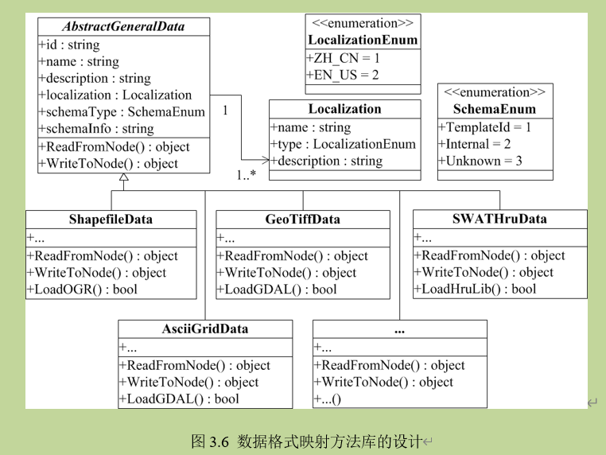

### 模型自定义格式映射机制

#### 数据内容与分隔符抽象

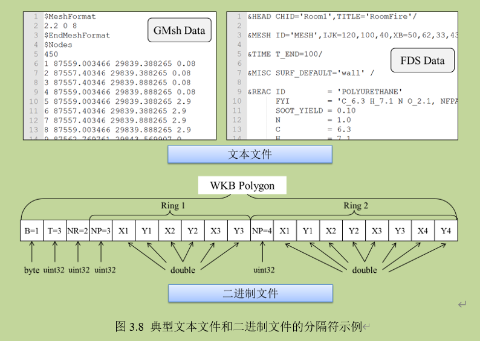

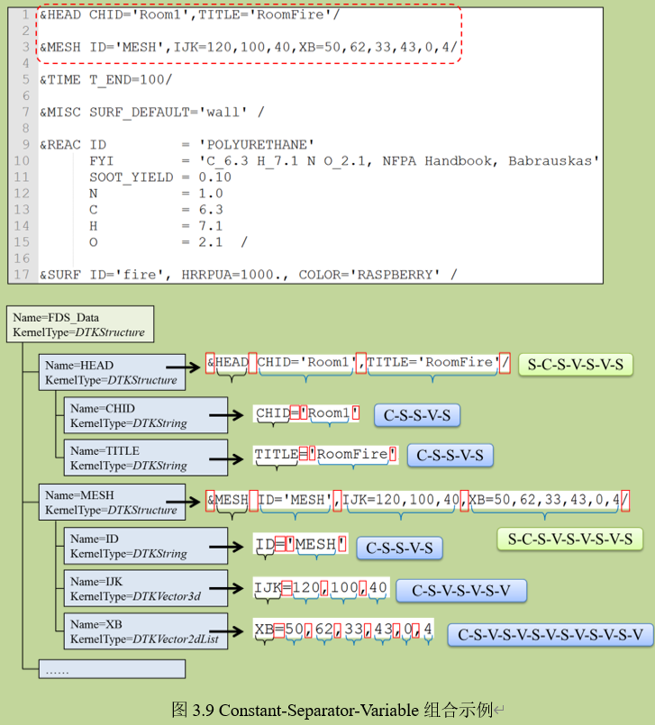

#### 基于状态机的自定义格式映射

模型自定义格式的数据文件中包含的数据内容通常按照各种不同的形式进行组织，将其映射到UDX Data的Node-Kernel结构时，最直接的方法就是进行顺序的逻辑判断（如If-Else，Switch-Case等语句），但在面对诸多不确定组织的数据文件时，这种逻辑判断往往会变得非常庞杂。状态机是一种在信息技术领域中的经典设计模式，应用程序开发中也经常使用此方法来简化复杂的事务处理流程。常用的OpenGL库，其底层设计就采用了状态机的原理，通过有限的接口函数实现各种各样的三维渲染效果。

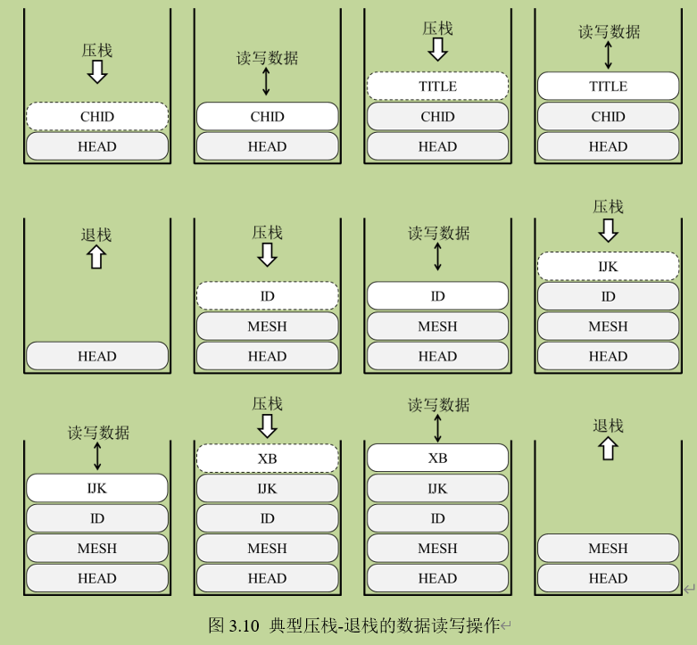

(也没看完，重点是后面感觉与我想看的没有多大关系了)

设计某种特定的数据格式来将所有地理模型的数据接口都转换为该格式，这种方法在满足几个地理模型应用需求的同时，在面对广泛的跨学科跨领域的地理模型时又产生了难以适用的问题。UDX是一种构造式的数据表达元模型，通过对信息内容的灵活组装，可以配置出与不同数据结构相对应的UDX Data

本章从数据接口的内外存实现策略方面将地理模型数据接口主要分为领域通用数据格式、模型自定义数据格式和编程语言相关的内存结构。针对领域通用数据格式，设计了可扩展的数据格式映射方法，并由此设计了数据格式映射方法库。针对模型自定义数据格式，设计了基于分隔符-状态机的自定义数据格式统一映射方法。针对语言相关的内存结构，设计了基于扩展注释的内存变量映射方法。

## 地理模型数据的重构方法

地理建模从现实世界→概念模型→逻辑模型→源代码→可执行程序→数据IO接口→程序运行，经过多层的信息传递和转化，人们对地理世界语义的理解在源代码阶段已经相当弱化

尤其是在不同地理模型集成的过程中，模型输入输出数据之间存在着单位、坐标系、空间剖分、数据组织结构等诸多方面的不统一

在第三章将模型数据接口映射到所构建的统一数据视图的基础上，本章主要研究如何通过有效的、可重用的数据重构方法来生成对于模型运行而言合理的数据，由此驱动模型正确执行并支撑模型之间集成运行。

### 地理模型数据的重构需求

#### 与实现无关的信息内容重构

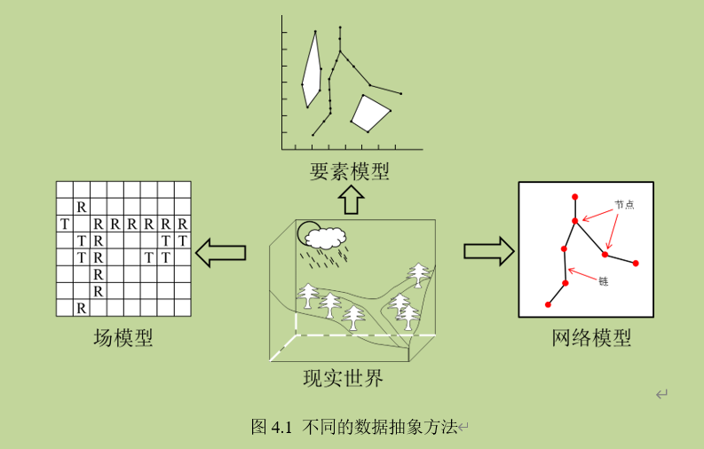

在这个例子中所涉及的“矢-栅转换”就是一种典型的与实现无关的信息内容层次的数据重构。

#### 与实现相关的数据组织重构

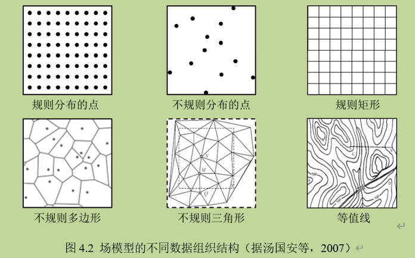

### 地理模型数据重构方法库

#### 基于统一数据视图的数据重构

对于模型数据的重构，最直接的方式就是通过编写相应的程序代码来实现源数据与目标数据规格之间的匹配；但这种方式导致模型数据适配工作只能在较低水平上重复，无法形成通用方法和工作成果积累。将地理模型数据接口统一映射到UDX的Node-Kernel结构上，能够为整个地理模型重构工作放置到一个统一的数据视图之上，可以屏蔽数据的内外存组织的异构性。在Node-Kernel结构支撑的统一数据视图上，所进行的数据重构工作将会转变为以节点操作为主导的信息内容处理。

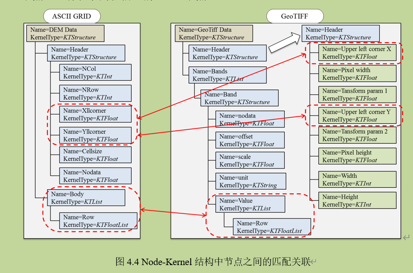

#### 数据重构方法的原子操作设计

#### 数据重构方法的统一接口设计

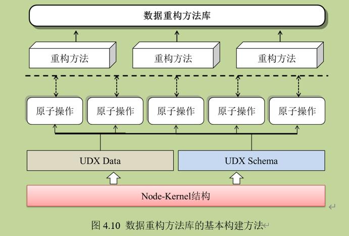

### 地理模型数据的基本重构方法

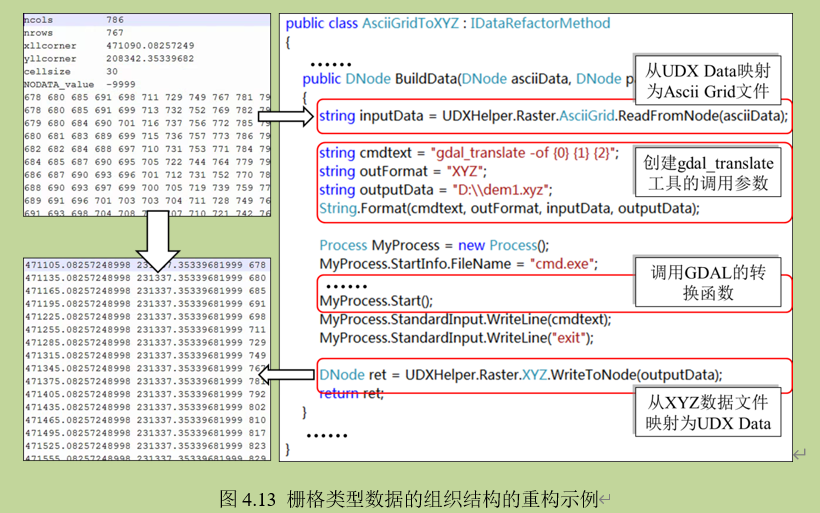

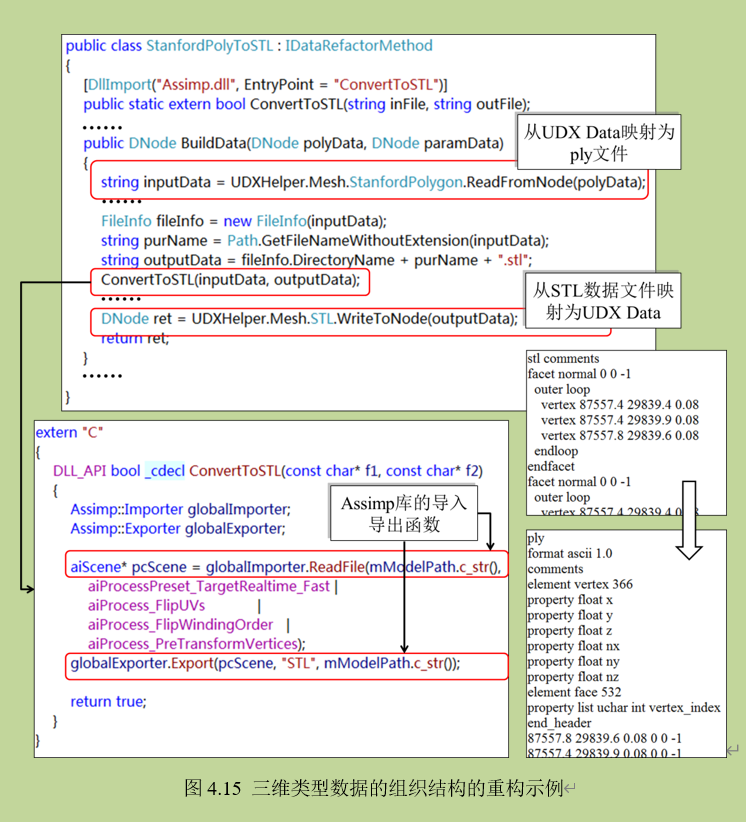

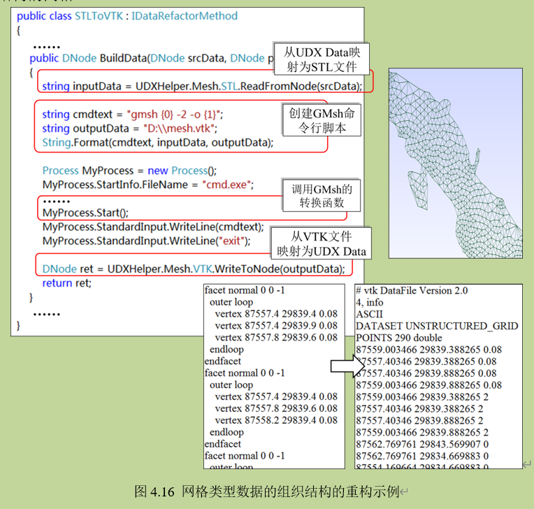

传统的数据处理方法都是严格依赖于特定的内存数据模型的，而基于Node-Kernel结构能够将复杂的数据重构统一到以数据节点操作为基础的信息组装上来。通过UDX Schema和UDX Data两者之间的关联，设计了数据节点的原子操作函数，从数据结构层次和数据内容层次实现了构建数据内容框架ConstructFrame函数、连接节点LinkNode函数、单个数值的获取/设置函数和对数组元素的获取/添加函数。通过数据节点的原子操作函数的组合嵌套可以更为便捷的构建不同的数据重构方法，本章进而设计了数据重构方法的统一接口，用以包装不同的数据重构逻辑，对外提供统一的调用接口。通过对数据重构方法统一地描述，设计了数据重构方法资源的组织管理方法，从而支撑构建一个开放共享的数据重构方法库。

## 面向地理模型运行的数据适配方案

（后面都没看了，等有机会再看吧）

## 路线

1. 地球系统作为一个复杂的巨系统，其综合性和复杂性特征导致了难以基于单一模型来解释其中的所有现象与过程。因此，地理模型的共享与集成逐渐成为了地理学综合研究的普遍方法。
2. 地理模型的共享与集成在具体的实现与应用时，最终都要面对模型能否正确运行的问题。模型的正确运行与数据有着直接的关系，针对模型运行的数据兼容性处理成为了模型应用过程中繁琐而关键的工作。
3. 以模型使用者正确理解地理模型的数据规格为切入点，通过设计地理模型数据规格的结构化描述方法（表现形式、内容结构和内蕴信息），实现模型的数据需求的无歧义传递。
4. 在此基础上，提出了一套完整的模型数据适配方法，通过模型数据接口的统一映射和数据重构方法库的建立，形成融合数据表达（Node-Kernel结构)、数据接口映射（地理模型数据Node-Kernel结构的映射）与数据重构（地理模型数据重构方法库）的数据适配方案(要素组织、数据规格匹配和数据接入的设计)，从而将模型构建、数据处理和模型集成应用之间解耦。

另外，这种基于Node-Kernel的地理模型应用和集成运行，对于某个特定的地理模型而言似乎增加了数据处理的过程。但在综合地理模拟中，涉及到多个不确定的地理模型之间的集成与运行，通过直接的数据格式转换虽然能够方便于某一个特定模型的运行，但对于整个集成模拟应用又造成了新的不便：首先体现在广泛的自定义格式难以直接进行转换，模型使用者在不了解数据内容的前提下进行的数据转换往往具有尝试性，增加了模型使用的不便；其次，模型相关的数据格式多种多样，同源的信息可以表现为异构的数据组织，孤立的数据转换难以避免重复的代码编写；还有，异构地理模型的集成不仅仅只是对数据格式的简单转换，其中涉及到的大量信息的抽取和重构，特定数据格式支撑下的数据处理成果难以形成积累，也难以重用。