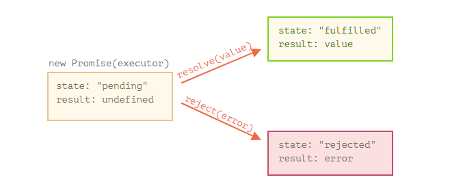

# Node.js

[toc]

作为一个异步事件驱动的 js 运行时，node.js 被设计用来构建可扩建的可扩展的网络应用

现在看的是  [一起学node.js](https://github.com/nswbmw/N-blog)

## 知识点讲解

- require

  require 可以用来加载一个文件的代码，可加载 js、json、 和  .node 后缀的文件，require的过程是i同步的

  require 的目录机制是：如果目录下有 package.json 并指定了main字段，则用它，如果不存在，则一次加载 index.js  和 index.node

  判断是否是程序的入口文件： require.main === module

  不在最外层 require，在用到的时候 require

- exports 和 module.exports

  require 用来加载代码，而 exports 和 module.exports 用来导出代码，exports 是指向 module.exports 的引用

- express

  express 路由 和 模板引擎 ejs，express的精髓在于中间件（middleware）的设计理念

  express 中的中间件（middleware）就是用来处理请求的，当一个中间件处理完，可以通过调用 `next()` 传递给下一个中间件，如果没有调用 `next()`，则请求不会往下传递，如内置的 `res.render` 其实就是渲染完 html 直接返回给客户端，没有调用 `next()`，从而没有传递给下一个中间件。看个小例子，修改 index.js 如下：

从 GitHub 安装 express-formidable 最新版，v1.0.0 有 bug

## example myblog


restful 是一种 api 设计风格，提出了一组api 的设计原则和约束条件

如上面删除文章的路由设计：

```
GET /posts/:postId/remove
```

Restful 风格的设计：

```
DELETE /posts/:postId
```

- cookie 和 session

  由于http 协议是一种无状态协议，所以服务端需要记录用户状态时，就需要session

  他俩的区别：

  1. cookie是浏览器的，有大小限制，session是服务端的，没有大小限制
  2. 通常 session 的实现是基于 cookie 的， session的 id 存储于  cookie 中
  3. session更安全，cookie 可以直接在浏览器中查看并编辑


## 组件的概念


上面的 ejs 模板中我们用到了 blog、user、success、error 变量，我们将 blog 变量挂载到 `app.locals` 下，将 user、success、error 挂载到 `res.locals` 下。为什么要这么做呢？`app.locals` 和 `res.locals` 是什么？它们有什么区别？

express 中有两个对象可用于模板的渲染，app.locals 和 res.locals 

可以看出：在调用 `res.render` 的时候，express 合并（merge）了 3 处的结果后传入要渲染的模板，优先级：`res.render` 传入的对象> `res.locals` 对象 > `app.locals` 对象，所以 `app.locals` 和 `res.locals` 几乎没有区别，都用来渲染模板，使用上的区别在于：`app.locals` 上通常挂载常量信息（如博客名、描述、作者这种不会变的信息），`res.locals` 上通常挂载变量信息，即每次请求可能的值都不一样（如请求者信息，`res.locals.user = req.session.user`）。


node-mongodb-native 与 mongoose，前者是官方库，但是不支持文档校验，mongoose 通过 schema 支持文档校验

mongolass 保持了与 mongodb 一样的api，又借鉴了许多 mongoose 的优点，同时又保持了精简


# Node入门

## 绪论

应用本身并没有什么了不起的，相比为了实现该功能书写的代码本身，我们更关注的事如何创建一个框架类对我们应用的不同模块进行干净的剥离

本书三部分结构：

- node.js 中进行JavaScript 开发和在浏览器中进行 js 开发的差异
- node.js 应用
- 如何设计一个完整的应用，剖析不同的模块

## JavaScript 与 node.js

现在还是一个 JavaScript 用户，而非 JavaScript 开发者，写Node.js应用是一件事情；理解为什么它们要以它们书写的这种方式来书写则意味着——你要懂JavaScript。这次是玩真的了。

要实现在后台运行 JavaScript 代码，代码需要先被解释然后正确的执行，node.js 的原理正是如此，它使用了 Google 的 V8虚拟机来解释和执行 JavaScript 代码，此外 node.js 还有许多有用的模块，node.js 事实上既是一个运行时环境，也是一个库

## 简单应用

目标：

- 用户可以通过浏览器使用我们的应用。
- 当用户请求*http://domain/start*时，可以看到一个欢迎页面，页面上有一个文件上传的表单。
- 用户可以选择一个图片并提交表单，随后文件将被上传到*http://domain/upload*，该页面完成上传后会把图片显示在页面上。

分析：

- 我们需要提供Web页面，因此需要一个*HTTP服务器*
- 对于不同的请求，根据请求的URL，我们的服务器需要给予不同的响应，因此我们需要一个*路由*，用于把请求对应到请求处理程序（request handler）
- 当请求被服务器接收并通过路由传递之后，需要可以对其进行处理，因此我们需要最终的*请求处理程序*
- 路由还应该能处理POST数据，并且把数据封装成更友好的格式传递给请求处理入程序，因此需要*请求数据处理功能*
- 我们不仅仅要处理URL对应的请求，还要把内容显示出来，这意味着我们需要一些*视图逻辑*供请求处理程序使用，以便将内容发送给用户的浏览器
- 最后，用户需要上传图片，所以我们需要*上传处理功能*来处理这方面的细节

对于node.js来说，使用 node.js，我们不仅仅事在实现一个应用，同时还实现了整个 http 服务器

## 构建应用的模块

server.js

```javascript
let http = require('http')
http.createServer(function(req,res) {
    res.writeHeader(200, {'Content-Type': 'text/plain'})
    res.write('hello, world')
    res.end()
}).listen(8888)
```

我们请求了 node.js 自带的http模块，调用http模块的 createServer函数，该函数会返回一个对象，这个对象有个listen的方法，该方法有个一个数值的参数，用来指定这个http服务器监听的端口号

在 JavaScript 中，函数和其他变量一样都是可以被传递的

为什么要用函数传递的方式呢？

node.js 是基于事件驱动的回调，当我们使用 http.createServer 方法的时候，我们当然不只是想要一个侦听某个端口的服务器，我们还想它在服务器收到一个 http 请求的时候做点什么，问题是，这是异步的：请求任何时候都可能到达，但是我们的服务器却跑在一个单进程里面

写 php 应用的时候，任何时候有请求进入的时候，网页服务器（apache）就为这个请求新建一个进程，并开始执行脚本

那么在node.js 程序中，当一个新的请求到达时，我们怎么控制流程呢？

我们创建了服务器，并且向创建它的方法传递了一个函数，无论何时我们的服务器收到一个请求，该函数就会被调用，这个就是回调，我们给某个地方传递了一个函数，这个方法在有相应事件发生的时候调用这个函数来进行回调

大部分浏览器都会在你访问 http://localhost:8888/ 时尝试读取 http://localhost:8888/favicon.ico 

服务器是如何处理请求的

在函数中有两个参数：request 和 response，它们是对象，你可以使用它们的方法来处理HTTP请求的细节，并且响应请求

当收到请求时，使用 res.writeHead() 函数发送一个 http 状态 200 和 http头的内容类型，使用res.write() 函数在HTTP相应主体中发送文本，最后调用 res.end() 完成响应

把某段代码变成模块意味着我们希望提供其功能的部分，并导出到请求这个模块的脚本

我们现在可以把我们应用的不同部分放入不同的文件里，并且通过模块的方式把它们连接在一起

url 和 querystring

我们的服务器应当知道路由的存在并加以有效利用。我们当然可以通过硬编码的方式将这一依赖项绑定到服务器上，但是其它语言的编程经验告诉我们这会是一件非常痛苦的事，因此我们将使用依赖注入的方式较松散地添加路由模块（你可以读读[Martin Fowlers关于依赖注入的大作](http://martinfowler.com/articles/injection.html)来作为背景知识）。

依赖注入不应该仅仅为使用而使用，使用依赖注入可以让路由和请求处理程序之间的耦合更加松散，重用性更高

*在C++或C#中，当我们谈到对象，指的是类或者结构体的实例。对象根据他们实例化的模板（就是所谓的类），会拥有不同的属性和方法。但在JavaScript里对象不是这个概念。在JavaScript中，对象就是一个键/值对的集合 -- 你可以把JavaScript的对象想象成一个键为字符串类型的字典。*

此就有了简洁流畅的形如*handle[pathname]();*的表达式

server，route，requestHandlers  三个模块都有了，浏览器传给了server，再传给了route，再传给了 requestHanlders，现在需要requestHandlers做出回应了

如果回应是直接 return，当未来有请求处理程序是进行非阻塞的操作的时候，我们的应用就挂了

阻塞操作：一个工作阻塞了所有其它的处理工作

node.js 可以再不新增额外线程的情况下，依然对任务进行并行处理

child_process 可以用来执行 shell命令

然而，要用非阻塞操作，我们需要使用回调，通过将函数作为参数传递给其他需要花时间做处理的函数（比方说，休眠10秒，或者查询数据库，又或者是进行大量的计算）。

对于Node.js来说，它是这样处理的：*“嘿，probablyExpensiveFunction()（译者注：这里指的就是需要花时间处理的函数），你继续处理你的事情，我（Node.js线程）先不等你了，我继续去处理你后面的代码，请你提供一个callbackFunction()，等你处理完之后我会去调用该回调函数的，谢谢！”*


现在我们能够异步的运行一些命令了，模块也分开了，但是我们的应用并没有实际的用途

添加一个交互：用户选择一个文件，上传该文件，然后再浏览器中看到上传的文件

用node.js 来处理文件上传（multipart post 请求） 是比较复杂的

post请求一般都比较重，用户可能输入大量内容，用阻塞的方式处理大数据量的请求必然会导致用户操作的阻塞，为了使整个过程非阻塞，node.js会将post数据拆分成很多个小的数据块，然后通过促发特定的事件，将这些小数据块传递给回调函数，这里的特定事件就是有data事件（表示新的小数据块到达了）以及end事件（表示所有的数据都已经接收完毕）

我们需要告诉 node.js 当这些事件触发的时候，回调哪些函数，怎么告诉呢，我们通过在 request 对象上注册监听器（listener）。这里的request对象是每次接收到 http请求时候，都会把该对象传递给 onRequest 回调函数

```js
request.addListener("data", function(chunk) {
  // called when a new chunk of data was received
});

request.addListener("end", function() {
  // called when all chunks of data have been received
});
```

问题来了，这部分逻辑写在哪里呢？我们现在只是在服务器中获取到了request对象，我们并没有像之前 response 对象那样，把 request对象传递给请求路由和请求处理程序

在我看来，获取所有来自请求的数据，然后将这些数据交给应用层处理应该是http服务器要做的事，因此我们直接在服务器中处理 post 数据，然后将最终的数据传递给请求路由和请求处理器

上述代码做了三件事：首先设置了接收数据的编码格式为 utf-8 ， 然后注册了'data' 事件的监听器，用于收集每次接收到的新数据块，最后将路由的调用放到了end事件处理程序中

当前我们是把请求的整个消息体都传递给了请求路由和请求处理程序，我们应该只把 post数据中我们感兴趣的部分传递给请求路由和请求处理程序

formidable模块对解析上传的文件数据做了很好的抽象，其实说白了，处理文件上传就是处理post数据，但是，麻烦的就是在具体的处理细节

我们需要将文件读取到我们的服务器中，使用一个叫fs的模块

supervisor

express 使用了 path-to-regexp 模块实现的路由匹配

```js
const app = express()
app.get('/users/:name', function(req, res) {
    res.send('hello, ' + req.params.name)
})
```

模板引擎有很多种， ejs 是其中一种

```js
app.set('views', path.join(__dirname, 'views'))
app.set('view engine', 'ejs')
```

express 理论上基于 connect 实现的中间件


## second time

我们将 `/` 和 `/user/:name` 的路由分别放到了 `routes/index.js` 和 `routes/users.js` 中，每个路由文件通过生成一个 `express.Router` 实例并导出，通过 `app.use` 挂载到不同的路径，在实际开发中推荐使用 `express.Router` 将不同的路由分离到不同的路由文件中

通过 `app.use` 加载中间件，在中间件中通过next 将请求传递到下一个中间件， next 可接受一个参数接收错误信息


## fs (文件系统)

fs 模块可用于与文件系统进行交互，所有的文件系统操作都具有同步的、回调的、以及基于 promise 的形式

```js
const fs = require('fs')
//  同步的示例
try {
    fs.unlinkSync('文件')
    console.log('已成功删除文件')
} catch (err) {
}
// 回调的示例
fs.unlink('文件'， (err) => {
    if (err) throw err;
    console.log('已成功删除文件')
})
// promise 的示例
(async function(path) {
    try {
        await fs.unlink(path);
        console.log('已成功删除文件')
    } catch {
    }
})('文件')
```

err 感觉都在第一个参数 err 优先回调风格

readFile open writeFile access stat mkdir readdir rmdir unlink 

回调与基于 promise 的操作的顺序，当使用异步的方法，无法发保证顺序

```js
fs.rename('旧文件'， '新文件'， (err) => {
    if(err) throw err;
    console.log('重命名完成')
})
fs.stat('新文件', (err, stats) => {
    if (err) throw err:
    console.log(`文件属性： ${JSON.stringify(stats)}`)
})
```

若要正确的排序这些操作，则移动 fs.stat() 调用到 fs.rename() 操作的回调中： 

```js
fs.rename('旧文件', '新文件'， (err) => {
    if(err) throw err;
    fs.stat('新文件'， (err, stats) => {
        if(err) throw err;
        console.log(`文件属性： ${JSON.stringify(stats)}`)
    })
})
// 或者使用 promise
(async function(from, to) {
    try {
        await fs.rename(from, to);
        const stats = await fs.stat(to);
        console.log(`文件属性： $({JSON.stringigy(stats)}`)
    } catch (err) {
        console.log('出错： '， err.message)
    }
})('旧文件'， '新文件')
```

#### 回调

因为函数能够作为变量，所以可以有回调这种写法？，函数不作为变量也可以有回调这种写法吧，但是函数作为变量的话看着要清楚一点

回调应该要考虑如果出现错误的情况，error优先回调风格，约定是：

1. callback 的第一个参数是为了 error 而保留的，一旦出现 error， callback(err) 就会被调用
2. 第二个参数及以后的参数用于成功的结果，此时是 callback(null, res1, res2) 就会被调用

promise 对象的构造器（constructor）语法如下：

```js
let promise = new Promise(function(resolve, reject) {
    // executor
})
```

当 executor 获得了结果，无论是早还是晚都没关系，它应该调用以下回调之一：

- `resolve(value)` — 如果任务成功完成并带有结果 `value`。
- `reject(error)` — 如果出现了 error，`error` 即为 error 对象。

由 `new Promise` 构造器返回的 `promise` 对象具有以下内部属性：

- `state` — 最初是 `"pending"`，然后在 `resolve` 被调用时变为 `"fulfilled"`，或者在 `reject` 被调用时变为 `"rejected"`。
- `result` — 最初是 `undefined`，然后在 `resolve(value)` 被调用时变为 `value`，或者在 `reject(error)` 被调用时变为 `error`。



promise 只能有一个结果或者一个error

promise 做出承诺之后，后者通过 then, catch, finally 接收结果或者 error

```js
pormise.then(function(result) {},function(err) {})
```

.then 的第一个参数是一个函数，该函数在 promise resolved 后运行并接收结果，第二个参数也是一个函数，该函数在promise rejected后运行并接收结果

```js
let promise = new Promise(function(resolve, reject) {
    setTimeout(() => resolve('done!'), 1000);
})
promise.then(res=>{alert(res)}, err=>{alert(err)})
```

```js
let promise = new Promise(function(resolve, reject) {
    setTimeout(() => reject(new Error('err')), 1000)
})
promise.then(res =>{alert(res)}, err => {alert(err)})
```

如果我们只对成功完成的情况感兴趣，则可以只为 .then  提供一个函数，如果我们只对失败的情况感兴趣，则可以 .then(null, err) 或者 使用 catch

promise 中的 .finally(f) 并不意味着要处理 promise 的结构，所以它将结果传递了下去

```js
// 基于回调的函数
function loadScript(src, callback) {
    let script = document.
}
```


[nodejs: 浅析高并发和分布式集群](https://zhuanlan.zhihu.com/p/41118827)

nodejs的几个特性

- 单线程
- 异步I/O
- 事务驱动
- 
- 分布式Node架构


event loop

normal stack $\Rightarrow$    setTimeout({}, 0) (process.nextTick、 setImmediate)  $\Rightarrow$  message Queue  $\Rightarrow$  job queue

error-first callbacks

promise: a proxy for a value that will eventually become available $\Rightarrow$  async  await

promise: remain in a pending state      \        promisifying    \ util.promisify

chaining promises: return Promise.resolve(),  Promise.reject()

response: status, statusText, json()(return a promise)

promise.all()   promise.race()

prepending the async keyword to any function means that the function will return a promise

```javascript
const getFirstUserData = () => {
    return fetch('/usres.json')		// get users list
    .then(response => respongse.json())		// parse json
    .then(usres => users[0])  // pick first user
    .then(user => fetch(`/user/${user.name}`))		// get user data
    .then(userResponse => userResponse.json())	// parse json
}
getFirstUserData()
```

```javascript
const getFirstUserData = async () => {
    const response = await fetch('/user.json')  // get users list
    const users = await response.json()		// parse json
    const user = users[0] 		// pick first user
    const userResponse = await fetch(`/users/${user.name}`)		// get user data
    const userData = await userResponse.json		// parse json
    return userData
}
getFirstUserData()
```

Debugging promises is hard because debugger will not stop over asynchronous code.

Async/await makes this very easy because to the compiler it's just like synchronous code.

EventEmitter

```javascript
const EventEmitter = require('event')
const eventEmitter = new EventEmitter()
```


```javascript
const http = require('http')
const port = process.env.PORT
const server = http.createServer((req, res) => {
    res.statusCode = 200
    res.setHeader('Content-Type', 'text/html')
    res.end('<h1>Hello, world!</h1>')
})
server.listen(port, () => {
    console.log(`Server running at port ${port}`)
})
```

request http.IncomingMessage                               request headers and request data

response http.ServerResponse

perform a get request

```javascript
const https = request('https')
const options = {
    hostname: 'example.com',
    port: 443,
    path: '/todos',
    method: 'GET'
}
const req = https.request(options, res => {
    res.on('data', d => {
        process.stdout.write(d)
    })
    req.on('error', error => {
        console.log(error)
    })
})
req.end()
```

perform a post request

```javascript
const https = require('https')
const data = new TextEncoder().encode(
	JSON.stringify({
        todo: 'Buy thie milk 🍼'
    })
)
const optoins = {
    hostname: 'whatever.com',
    por: 443,
    path: '/todos',
    method: 'POST',
    headers: {
        'Content-Type': 'application/json',
        'Content-Length': data.length
    }
}
const req = http.request(options, res => {
    res.on('data', d => {
        process.stdout.write(d)
    })
})
req.on('error', err => console.log(err))
req.write(data)
req.end()
```

```javascript
const axios = require('axios')
axios.post('https://watever.com/todos', {
    todo: 'but the milk'
})
.then(res => {
    console.log(`statusCode: ${res.status}`)
    console.log(res)
})
.catch(error => {
    console.log(error)
})
```

path  dirname basename extname    path.basename(notes, path.extname(notes))   join  resolve   normalize

```javascript
fs.writeFile('/test.txt', content, {flag: 'a+'}, err => {})
```

```javascript
const isFile = fileName => {
    return fs.lstatSync(fileName).isFile()
}
fs.readdirSync(folderPath).map(fileName => {
    return path.join(folderPath, fileName)
}).filter(isFile)
```

```javascript
fs.rmdir(dir, {recursive: true}, (err) => {
    if(err) {
        throw err
    }
    console.log(`${dir} is deleted.`)
})
```

fs-extra

buffer   deal with binary data

why streams:  1. memory efficiency          2. time efficiency

```javascript
const http require('http')
const fs = require('fs')
const server = http.createServer((req, res) => {
    fs.readFile(__dirname + '/data.txt', (err, data) => {
        res.end(data)
    })
})
server.listen(3000)
```

```javascript
const http = require('http')
const fs = require('fs')
const server = http.createServer((req, res) => {
    const stream = fs.createReadStream(__dirname + '/data.txt')
    stream.pipe(res)
})
server.listen(3000)
```

`src.pipe(dest1).pipe(dest2)`

## MongoDB 操作

[blog](https://blog.csdn.net/u012054869/article/details/88550458)

`{$lt: <value>} {$lte: <value}  {$gt: <value>} {$gte: <value>}  {$ne: <value>}  {$in: []}`

···

[mongoose](https://mongoosejs.com/docs/index.html)


## spawn 的坑

[使用node子进程 spawn, exec 踩过的坑](https://tangguangyao.github.io/2015/12/16/%E4%BD%BF%E7%94%A8node%E5%AD%90%E8%BF%9B%E7%A8%8Bspawn-exec%E8%B8%A9%E8%BF%87%E7%9A%84%E5%9D%91/)

使用 spawn 的时候，子进程有太多的日志输出，导致该子进程卡在那里，没有正常或者异常的退出，文件也被占用着，最坑的是一点提示都没有

### child_process 介绍

nodejs 是单线程单进程的，但是有了 child_process 模块，可以在程序中直接创建子进程，并在主进程和子进程之间实现通信

### exec与spawn的区别与陷阱

[exec与spawn方法的区别与陷阱](http://deadhorse.me/nodejs/2011/12/18/nodejs中child_process模块的exec方法和spawn方法.html)

2011年的文章了，，，好老

exec 和 spawn 都是通过生成一个子进程，去执行指定的命令，但是在命令的指定上，exec 更加灵活，等于一个 shell 的命令行，他俩都有参数的

spawn 的 options 默认为：

```json
{ 
    cwd: undefined,
    env: process.env,
    setsid: false
  }
```

exec 的 option 默认为：

```json
{ 
    encoding: 'utf8',
    timeout: 0, /*子进程最长执行时间 */
    maxBuffer: 200*1024,  /*stdout和stderr的最大长度*/
    killSignal: 'SIGTERM',
    cwd: null,
    env: null
  }
```

注意 maxBuffer 这个参数，如果 stdout 的值超过 200 k 的时候就会杀死进程，其实spawn 表现的更差，当 spawn 的子进程的 stdout 更多的时候会出现我前文说过的问题，文章中说 spawn 没有 maxBuffer 限制，但是我个人感觉还是有 maxBuffer 的类似限制。exec 在使用便捷上要超过 spawn，且执行速度上也相差无几，但是这种便携性要付出一定的代价。在exec的options中，有一项是 maxBuffer，如果执行的 command 输出超出了这个长度，不管是采用回调函数的方式，还是emit data 事件方式传递结果，都会抛出 maxBuffer exceeded异常，并且杀死子进程