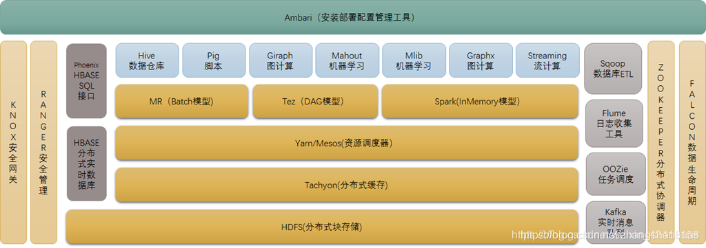
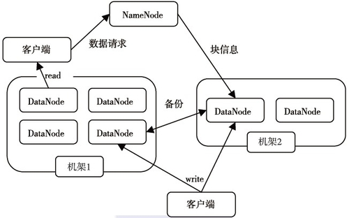

# Hadoop

[toc]

## 初学者指南

地址是 [hadoop 初学者指南](https://bigdata2.apachecn.org/#/docs/hadoop-begin-guide/README)

### 0. 前言

以前大型数据集应用复杂分析的能力曾经是大公司和政府机构的专利，但是现在可以通过免费的开源软件（OSS）实现。但由于这一领域似乎很复杂，变化速度也很快，掌握基础知识可能会有点令人望而生畏。这就是这本书的用武之地，它会告诉你 Hadoop 是什么，它是如何工作的，以及你如何使用它从数据中提取价值。

除了对核心 Hadoop 的解释之外，我们还花了几章来探索使用 Hadoop 或与之集成的其它技术。我们的目标不仅是让你了解 Hadoop 是什么，还希望你了解更广泛的技术基础设施的一部分来使用。一种补充技术是使用云计算，特别是亚马逊 Web 服务。在整本书中，将会展示如何使用这些服务来托管你的 Hadoop 工作负载，从而说明你不仅可以处理大量数据，而且实际上不需要购买任何物理硬件就可以实现这一点。

### 1. 说明这一切是怎么回事

Hadoop 不是在真空中创建的；相反，它的存在是因为创建和使用的数据量呈爆炸式增长，而且这种数据洪流不仅出现在大型跨国公司身上，还出现在小型初创公司身上。 与此同时，其他趋势也改变了软件和系统的部署方式，与更传统的基础设施一起使用云资源，甚至优先使用云资源。

#### 大数据处理

环顾一下我们今天拥有的技术，很容易得出这样一个结论：一切都是数据的。不仅生成的数据量在增加，而且增长速度也在加快。从电子邮件到 Facebook 帖子，从购买历史到网络连接，到处都有不断增长的大型数据集。挑战在于如何从这些数据中提取最有价值的方面，有时这意味着寻找数据集里面特定的数据元素，而在其它时候，重点是识别数据片段之间的趋势和关系。

在幕后发生了一种微妙的变化，这一切都是关于以越来越有意义的方式使用数据。

#### 数据的价值

如果大规模的数据处理不能带来可观的回报，为什么要对它进行处理呢，大数据的价值可能会在以下几个方面体现：

- 有些问题只有在足够大的数据集才会给出价值。在没有任何其它因素的情况下，根据一个人的喜好推荐一部电影不太可能非常准确，将人数增加到100人，机会略有增加，如果是1000万人其它人的观看历史记录，发现有用的建议的机会会大大提高
- 与以前的解决方案相比，现在的大数据工具能以更低的成本执行以前昂贵得让人望而却步的数据处理任务
- 大规模数据处理的成本不仅仅是财务费用，延迟也是一个关键因素。一个系统可能能够处理非常多的数据，但是平均处理时间是以周为单位来衡量，那么它可能就没有什么用处了。大数据工具允许在控制处理时间的同时增加数据量，通常是通过将增加的数据量与额外的硬件相匹配来实现（横向扩展）
- 以前关于数据库是什么样子或则它的数据应该怎么设计可能需要重新考虑了，以满足最大的数据问题的需要
- 足够大的数据集和灵活的工具可能可以回答以前想象不到的问题

#### 经典数据处理系统

大数据挖掘系统稀少且昂贵的根本原因是，扩展一个系统以处理大数据集事非常困难；正如我们将看到的，它传统上受限于一台计算机的处理能力。但是随着数据大小的增加，有两种扩展系统的主要方法，通常称为向上扩展和向外扩展

- 向上扩展：在大多数企业中，数据处理通常是在价格高得惊人的大型计算机上执行的。随着数据大小的增长，方法是移动到更大的服务器或存储阵列。简单向上扩展的优势在于架构不会因为增长而发生重大变化。虽然用来较大的组件，但基本关系（例如，数据库服务器和存储阵列）保持不变。对于商业数据库引擎等应用，软件处理利用可用硬件的复杂性，但从理论上讲，通过将相同的软件迁移到越来越大的服务器上可以实现更大的规模。（但是实际上这个难度也不低）
- 向外扩展：单个主机大小也有实际限制，在某些情况下，向上扩展不能在进一步扩展。横向扩展方法将处理分散到越来越多的机器上，而不是将系统扩展到越来越大的硬件上。如果数据集翻了一番，只需要使用两台服务器，而不是一台双倍大小的服务器。这种方法的明显好处事，购买成本低得多。假设一台主机的价格是 5000 美元，但一台处理能力是其十倍的主机的价格可能是其一百倍。缺点是，我们需要制定策略将我们的数据处理分散到一组服务器上，而历史上证明这个策略也是复杂的

因此部署横向扩展解决方案需要大量的工程工作，系统开发人员需要手工制作用于数据分区和数据重组的机制，更不用说跨集群安排工作和处理单个机器故障的逻辑了

向上扩展的成本很高，向外扩展开发和管理系统的努力也是如此。限制因素主要有：

- 随着横向扩展系统变得越来越大，或者随着纵向扩展系统处理多个 CPU，系统中并发的复杂性带来的困难变得非常严重。有效利用多个主机或 CPU 是一项非常难的任务，实施必要的策略以在所需工作负载的整个执行过程中保持效率可能需要付出巨大的努力
- 系统能力的差异开始凸显。CPU 能力的增长速度远远快于网络或磁盘速度，CPU 周期曾经是系统中最有价值的资源，但是在今天这种情况已不再存在。与 20 年前相比，现代 CPU 能执行数百万倍的操作，但是内存和硬盘速度只增加了数千或数百倍。构建一个 CPU 强大的现代系统比较容易，以至于存储系统根本不能以足够快的速度向其提供数据，从而使 CPU 忙碌

从前面的场景来看，许多技术已经被成功用于减轻将数据处理系统扩展到大数据所需的痛苦，一些经验之谈如下：

##### 1. 不共享任何内容

共享的原则不适用于数据处理系统，而且这一思想既适用于数据，也适用于硬件。例如横向扩展体系结构中每个主机处理整个数据集的一个子集，以产生其最终结果的一部分。然后显示很少如此，主机之间可能需要相互通信，或者多个主机可能都需要某些数据。这些额外的依赖关系会给系统带来两方面的负面影响：瓶颈和故障。

- 瓶颈：如果系统中的每个计算都需要一条数据或单个服务器，则在相互竞争的客户端访问公共数据的主机时，存在争用和延迟的可能性。例如，如果在具有 25 台主机的系统中，只有一台主机必须由其它主机访问，则系统的整体性能将受该关键主机的功能限制
- 故障：如果保持关键数据的这个“热”服务器或存储系统出现故障，整个工作负载将崩溃。早期的集群解决方案经常显示出这种风险

系统的各个组件应该尽可能独立，而不是共享资源，无论其它组件是否被复杂的工作所束缚或者已经故障了，每个组件都可以继续工作

##### 2. 预计失败

我们可能会听到一种术语 “99.999% 的正常运行时间或可用性）”，虽然这绝对是同类中最好的可用性，但更重要的是认识到由此类设备组成的系统的总体可靠性可能由很大的差异，这取决于系统是否能够容忍单个组件故障

- 不能容忍单个组件故障：假设一台服务器具有 99% 的可靠性，系统需要 5 台这样的主机才能运行，则系统的可用性就是 0.99 的 5 次方，相当于 95% 的可用性。如果单个服务器的可靠性只有 95%，系统可靠性就会下降到只有 76%

- 能容忍单个组件故障：相反，如果构建的系统在任何给定时间只需要五台主机中的一台正常工作，则系统可用性将达到五个九的范围。 考虑与每个组件的关键程度相关的系统正常运行时间有助于将重点放在系统可用性可能达到的水平上。

99% 到底是什么程度的概念呢？ 例如，99%的可用性相当于每年的停机时间略高于 3.5 天或每月停机 7 小时。这样听起来好像 99% 也不是那么可靠了。预计失败，拥抱失败，解决失败。

##### 3. 智能软件，哑巴硬件

如果我们希望看到硬件集群以尽可能灵活的方式使用，为多个并行工作流提供托管，答案是将智能推向软件，而不是硬件。

在此模型中，硬件被视为一组资源，将硬件分配给特定工作负载的责任交给软件层。 这允许硬件是通用的，因此获得起来既容易又便宜，并且有效使用硬件的功能转移到软件上，而软件是关于有效执行该任务的知识所在。

##### 4. 移动处理，而不是数据

假设您有一个非常大的数据集，比如说 1000TB(即 1PB)，并且您需要对数据集中的每个数据执行一组四个操作。 让我们看看实现系统来解决这个问题的不同方式。

传统的大型纵向扩展解决方案将看到一台巨型服务器连接到同样令人印象深刻的存储系统，几乎可以肯定地使用光纤通道等技术来最大化存储带宽。 系统将执行该任务，但会受到 I/O 限制；即使是高端存储交换机也会限制将数据传送到主机的速度。

或者，以前集群技术的处理方法可能会看到一个由 1,000 台机器组成的集群，每台机器都有 1TB 的数据，分为四个象限，每个象限负责执行其中一个操作。 然后，集群管理软件将协调数据在集群中的移动，以确保每一块都接受所有四个处理步骤。 由于每条数据可以在其所在的主机上执行一个步骤，因此它将需要将数据流式传输到其他三个象限，因此我们实际上消耗了 3 PB 的网络带宽来执行处理。

请记住，处理能力的增长速度快于网络或磁盘技术，那么这些真的是解决问题的最佳方法吗？ 最近的经验表明答案是否定的，另一种方法是避免移动数据，而是移动处理。 使用刚才提到的集群，但不要将其划分为象限；相反，让 1000 个节点中的每个节点对本地保存的数据执行所有四个处理阶段。 如果幸运的话，您只需从磁盘流式传输数据一次，而通过网络传输的只有程序二进制文件和状态报告，这两者与实际数据集相比都相形见绌。

如果 1,000 个节点的群集听起来大得离谱，请考虑一下大数据解决方案所使用的一些现代服务器外形规格。 它们看到的是单个主机，每个主机中有多达 12 个 1 TB 或 2 TB 的磁盘。 因为现代处理器有多个核心，所以可以构建一个具有 1 PB 存储空间的 50 节点集群，同时仍然有一个 CPU 核心专门处理来自每个单独磁盘的数据流。

##### 5. 构建应用，而不是基础设施

在考虑上一节中的场景时，很多人都会关注数据移动和处理的问题。 但是，任何曾经构建过这样的系统的人都会知道，作业调度、错误处理和协调等不太明显的元素才是真正的魔力（难度）所在。

如果我们必须实现用于确定在哪里执行处理、执行处理并将所有子结果合并到整体结果中的机制，我们就不会从旧模型中获得太多好处。 在那里，我们需要显式地管理数据分区；我们只是在交换一个难题和另一个难题。

这涉及到最新的趋势，我们将在这里重点介绍：一个透明地处理大部分集群机制并允许开发人员从业务问题的角度进行思考的系统。 框架提供了定义良好的接口，这些接口抽象了所有这些复杂性-智能软件-在此基础上可以构建特定于业务领域的应用，从而提供了开发人员和系统效率的最佳组合。

#### Hadoop 的由来

前面都是在说一些集群的关键，但是还没回答 Hadoop 到底是什么

这一切都始于谷歌，它在 2003 年和 2004 年发布了两篇描述谷歌技术的学术论文：**Google 文件系统**(**gfs**)(http://research.google.com/archive/gfs.html)和 MapReduce(http://research.google.com/archive/mapreduce.html)。 这两者共同提供了一个以高效方式大规模处理数据的平台。

与此同时，Doug Cutting 正在开发 Nutch 开源网络搜索引擎。 他一直在研究系统中的元素，这些元素在 Google GFS 和 MapReduce 论文发表后引起了强烈共鸣。 Doug 开始了这些 Google 系统的实现工作，Hadoop 很快就诞生了，最初是 Lucene 的一个子项目，很快就成为了 Apache 开源基金会中自己的顶级项目。 因此，Hadoop 的核心是一个开源平台，它同时提供 MapReduce 和 GFS 技术的实现，并允许跨低成本商用硬件集群处理非常大的数据集。

雅虎在 2006 年聘请了 Doug Cutting，并很快成为 Hadoop 项目最著名的支持者之一。 除了经常宣传一些世界上最大的 Hadoop 部署外，雅虎还允许 Doug 和其他工程师在受雇期间为 Hadoop 做出贡献；雅虎还贡献了一些内部开发的 Hadoop 改进和扩展。 虽然道格现在已经转向 Cloudera(另一家支持 Hadoop 社区的知名初创公司)，雅虎 Hadoop 团队的大部分成员也被剥离出来，成立了一家名为 Hortonworks 的初创公司，但雅虎仍然是 Hadoop 的主要贡献者。

顶层 Hadoop 项目有许多组件子项目，我们将在本书中讨论其中几个，但主要的两个是**Hadoop 分布式文件系统**(**HDFS**)和 MapReduce。 这些都是 Google 自己的 GFS 和 MapReduce 的直接实现。 我们将对两者进行更详细的讨论，但目前，最好将 HDFS 和 MapReduce 视为一对互补但截然不同的技术。

**HDFS**是一个文件系统，它可以通过跨主机群集向外扩展来存储非常大的数据集。 它具有特定的设计和性能特征；尤其是，它针对吞吐量而不是延迟进行了优化，并且通过复制而不是冗余来实现高可用性。

**MapReduce**是一种数据处理范例，它指定数据将如何从其两个阶段(称为映射和还原)输入和输出，然后将其应用于任意大的数据集。 MapReduce 与 HDFS 紧密集成，确保 MapReduce 任务尽可能直接在保存所需数据的 HDFS 节点上运行。



<div align='center'>Hadoop 生态圈</div>



<div align='center'>HDFS 的体系结构图</div>


### 2. 启动和运行 Hadoop

#### 安装 Hadoop

配置 Ubuntu 20, hadoop 3.3.1，模式选择的 伪分布式模式 ，参考教程: [Hadoop 3.3伪分布式环境搭建](https://www.jianshu.com/p/0ea28a25a7da), [hadoop3.3.1单机与伪分布安装](https://blog.csdn.net/weixin_45704680/article/details/120368821)，[启动和运行hadoop](https://bigdata2.apachecn.org/#/docs/hadoop-begin-guide/02)，最后个是个老版本的教程，但是好多命令行都是相似的，操作跟着教程走下来就行，踩到坑了就看日志，坑实在解决不了就换主机

记录下自己踩的坑

- 第一次下了一个hadoop 的源代码，里面并没有 bin 文件夹，然后 java 的版本没搞懂，jdk1.8 约等于 jdk8，有个 hadoop-env.sh 里面需要加入 JAVA_HOME 的路径
- 刚开始只有一个 jps 进程，需要先 stop-all.sh ，然后删除  tmp、logs 文件，将namenode文件夹格式化：hdfs namenode -format，最后重新启动
- 我重新启动之后查看进程，并没有 namenode，提示ip连接的问题，死活没解决，最后换了一个虚拟机和第一个教程 [Hadoop 3.3伪分布式环境搭建](https://www.jianshu.com/p/0ea28a25a7da)  成功了，管理界面不是 9000 端口，是 8088 了（第一台虚拟机的配置文件几乎一样，不知道为啥第一台机器还是不可以，来回安装了十几次吧，一晚上就这么没有了，猜测原因是第一个虚拟机的配置太差了 :cry:)

#### Hadoop 的三种模式

- **本地独立模式**：在这种模式下，Hadoop 的所有组件(如 NameNode、DataNode、JobTracker 和 TaskTracker)都在单个 Java 进程中运行。
- **伪分布式模式**：在此模式下，将为每个 Hadoop 组件生成一个单独的 JVM，它们通过网络套接字进行通信，从而有效地在单个主机上提供一个功能齐全的微集群。
- **完全分布式模式**：在这种模式下，Hadoop 分布在台机器上，其中一些机器是通用工作者，另一些机器则是组件的专用主机，比如 NameNode 和 JobTracker。

每种模式都有其优点和缺点。 完全分布式模式显然是唯一可以跨机器集群扩展 Hadoop 的模式，但它需要更多的配置工作，更不用说机器集群了。 本地或独立模式最容易设置，但您与其交互的方式与完全分布式模式不同。 在本书中，我们通常更喜欢伪分布式模式，即使在单个主机上使用示例时也是如此，因为伪分布式模式中完成的所有操作几乎与它在更大的集群上的工作方式相同。

#### 配置伪分布式模式

在 <a href='####安装 Hadoop'>安装 Hadoop</a> 里使用的就是伪分布式模式，其中主要文件的配置如下：

core-site.xml 配置：

```xml
<configuration>
    <property>
        <name>hadoop.tmp.dir</name>
        <value>file:/usr/local/hadoop/tmp</value>
        <description>Abase for other temporary directories.</description>
    </property>
    <property>
        <name>fs.defaultFS</name>
        <value>hdfs://localhost:9000</value>
        <description>NameNode URI</description>
    </property>
</configuration>
```

hdfs-site.xml 配置：

```xml
<configuration>
    <property>
        <name>dfs.replication</name>
        <value>1</value>
    </property>
    <property>
        <name>dfs.namenode.name.dir</name>
        <value>file:/usr/local/hadoop/tmp/dfs/name</value>
    </property>
    <property>
        <name>dfs.datanode.data.dir</name>
        <value>file:/usr/local/hadoop/tmp/dfs/data</value>
    </property>
</configuration>
```

yarn-site.xml 配置如下：

```xml
<configuration>
    <property>
        <name>mapreduce.framework.name</name>
        <value>yarn</value>
    </property>
</configuration>
```

mapred-site.xml 配置如下：

```xml
<configuration>
    <property>
        <name>mapreduce.framework.name</name>
        <value>yarn</value>
    </property>
</configuration>
```

配置完成之后输入jps，应该有6个Java进程：

```shell
8002 NameNode
15624 Jps
7449 ResourceManager
7546 NodeManager
7306 SecondaryNameNode
8415 DataNode
```

如果选择伪分布式或完全分布式模式，则在启动第一个 Hadoop 集群之前，需要执行两个步骤：

1. 设置存储 Hadoop 文件的基本目录（mkdir & chmod）
2. 格式化 HDFS 文件系统（hdfs namenode -format)

#### 运行单词示例

如果是单机环境，直接一行命令就可以了

```sh
hadoop jar /usr/local/hadoop-3.3.0/share/hadoop/mapreduce/hadoop-mapreduce-examples-3.3.0.jar wordcount /home/hadoop/input/data.input /home/hadoop/output
```

如果是伪分布式或分布式环境，需要创建文件夹，然后上传文件，最终运行，中途可能会有些问题，我是通过更改 yarn-site.xml 文件解决的，我碰到的问题是 找不到主类 和 mapreduce_shuffle 问题。伪分布式的文件目录和本地目录并不一样

```sh
hadoop fs -mkdir /user/hadoop/input
hadoop fs -put /home/hadoop/input/data.input /user/hadoop/input
hadoop jar /usr/local/hadoop/share/hadoop/mapreduce/hadoop-mapreduce-examples-3.3.1.jar wordcount /user/hadoop/input/data.input /user/hadoop/output4
```


### 3. 了解 MapReduce

#### 为什么要选择键/值数据

使用键/值数据作为 MapReduce 操作的基础，可以实现一个功能强大的编程模型，该模型具有惊人的广泛适用性。许多数据本质上要么是键/值，要么可以用这种方式表示，他是一个简单的模型，具有广泛的适用性和足够直接的予以，根据它定义的程序可以应用到 Hadoop 框架

当然，数据模型本身并不是使 Hadoop 变得有用的唯一因素，它的真正威力在于它如何适用并行执行技术。我们可以拥有大量的主机，在这些主机上我们可以存储和执行数据，甚至可以实用一个框架来将大的任务划分为较小的块，然后将部分答案组合成整体答案。我们需要这个框架来为我们提供一种表达问题的方式，而不需要我们成为执行机制方面的专家，我们需要表达数据所需的转换，然后让框架来完成其余的工作。

MapReduce 及其键/值接口提供了这样一个抽象级别，程序员只需指定这些转换，Hadoop 就可以处理将其应用于任意大型数据集的复杂过程

```scala
{K1, V1} -> {K2, List<V2>} -> {K3, V3}
```

MapReduce 作业的 map 方法的输入是一系列键/值对，称之为 K1 和 V1，输出是一系列键和相关的值列表，称为 K2 和 V2。每个映射器只输出一系列单独的键/值输出，在 shuffle 方法中，这些输出组合为键和值列表。MapReduce 作业的最终输出是另一系列键/值对，称为 K3 和 V3

#### Hadoop Java API for MapReduce

这本书还是使用的 Hadoop 1.0 版本的，大概看看就好了

##### Mapper 类

Mapper 类的简化视图如下：

```scala
class Mapper<K1, V1, K2, V2>
{
    void map(K1 key, V1 value, Mapper.Contex) throws IOException, InterruptedException {
        
    }
}
```

这个类使用了泛型，该类是根据键/值输入和输出类型定义的，然后 map 方法在其参数中接受输入键/值对，另一个参数是 Context 类的实例，它提供了与 Hadoop 框架通信的各种机制，其中之一是输出 map 或 reduce 方法的结果。map 方法仅引用 K1 和 V1 键/值对的单个实例，这是 MapReduce 范例的一个关键方面。在 MapReduce 范例中，需要编写处理单个记录的类，框架负责将大量数据集转换为键/值对流所需的所有工作。我们不需要编写 map 或 reduce 类来尝试处理完整的数据集。Hadoop 还通过 InputFormat 和 OutputFormat 类提供了一些机制，这些机制提供了通用文件格式的实现，消除了为常用文件类型编写文件解析器的必要

有时可能需要重写三个附加方法：

```scala 
protected void setup(Mapper.Context context) throws IOException, Interrupted Exception {...}
protected void cleanup(Mapper.Context context) throws IOException, Interrupted Exception {...}
protected void run(Mapper.Context context) throws IOException, Interrupted Exception {...}
```

setup 方法在将任何键/值对呈现给 map 方法前先被调用一次，默认实现不执行任何操作

cleanup 方法在所有键/值对都已呈现给 map 方法后被调用一次，默认实现不执行任何操作

run 方法控制 JVM 中任务处理的整体流程。默认实现是在拆分中的每个键/值对重复调用 map 方法之前调用 setup 方法一次，然后最后调用 cleanup 方法

##### Reducer 类

Reducer 基类的工作方式与 Mapper 类非常相似，通常只需要子类覆盖单个 reduce 方法，精简类定义如下：

```scala
public class Reduce<K2, V2, K3, V3>
{
    void reduce(K1 key, Iterable<V2> values, Reducer.Context context) throws IOException, InterruptedException 		{...}
}
```

reduce 方法接受 K2/V2 作为输入，并提供 K3/V3 作为输出，而实际的 Reduce 方法只接受单个键及其关联的值列表，Context 对象也是输出方法结果的机制，Reducer 类同样也有 setup、run 和 cleanup 方法，它们默认实现与 Mapper 类相似，可以选择性覆盖

##### 驱动程序类

尽管 Mapper 和 Reducer 实现是我们执行 MapReduce 作业所需的全部，但是还需要另外一段代码：与 Hadoop 框架通信并指定运行 MapReduce 作业所需的配置元素的驱动程序。这涉及到一些方面，比如告诉 Hadoop 使用哪个 Mapper 和 Reducer 类、在哪里查找输入数据以及以什么格式查找输入数据、在哪里放置输出数据以及如何格式化输出数据，还可以设置多种其它配置选项

驱动程序逻辑通常存在于为封装 MapReduce 作业而编写的类的 Main 方法中：

```scala
public class ExampleDriver {
    public static void main(String[] args) throws Exception {
        Configuration conf = new Configuration();
        Job job = new Job(conf, "ExampleJob");
        job.setJarByClass(ExampleDriver.class);
        job.setMapperClass(ExampleDriver.class);
        job.setReducerClass(ExampleDriver.class);
        job.setOutputKeyClass(Text.class);
        job.setOutputValueClass(IntWritable.class);
        
        FileInputFormat.addInputPath(job, new Path(args[0]));
        FileOutputFormat.addOutputpath(job, new Path(args[1]));
        
        System.exit(job.waitForCompletion(true) ? 0 : 1);
    }
}
```

#### 编写 MapReduce 程序

我们使用和谈论单词计数了，但是还没有实际编写过一个程序，现在上手写一个吧。教程里面的例子太老了，参考了网上的一个例子：[wordcount](https://segmentfault.com/a/1190000020388581)

##### wordcount 的具体过程

现在用步骤来描述一下 Hadoop 是怎么做单词统计的，假设我们有一个文件如下：

```txt
hello world hello java
hello hadoop
```

1. 首先读取这个文件，按行来将这个文件每一行的单词拆分出来，形成很多 key/value 的结果：

```text
<hello,1>
<world,1>
<hello,1>
<java,1>
<hello,1>
<hadoop,1>
```

2. 排序，排完序的结果：

```text
<hadoop,1>
<hello,1>
<hello,1>
<hello,1>
<java,1>
<world,1>
```

3. 合并，合并后的结果如下：

```text
<hadoop,1>
<hello,1,1,1>
<java,1>
<world,1>
```

4. 汇聚结果：

```text
<hadoop,1>
<hello,3>
<java,1>
<world,1>
```

这就是 mapreduce 的处理过程，第 2 和 3 步是 Hadoop 框架帮助我们完成的，我们实际上需要写代码的地方是第 1 和 4步，第 1 步对应 Map 的过程，第 4 步对应的是 Reduce 过程

##### 编写MapReduce 代码

这个代码和教程里面的代码差不多，主要代码如下，分成三部分：WordCountMapper、WordCountReducer、main：

```java
import  org.apache.hadoop.conf.Configuration;
import org.apache.hadoop.fs.Path;
import org.apache.hadoop.io.IntWritable;
import org.apache.hadoop.io.Text;
import org.apache.hadoop.mapreduce.Job;
import org.apache.hadoop.mapreduce.Mapper;
import org.apache.hadoop.mapreduce.Reducer;
import org.apache.hadoop.mapreduce.lib.input.FileInputFormat;
import org.apache.hadoop.mapreduce.lib.output.FileOutputFormat;

import java.io.IOException;
import java.util.StringTokenizer;

/**
 * @description: MapReduce 简单程序，模仿的网上写的：[wordCount](https://segmentfault.com/a/1190000020388581)
 * @author: Tian
 * @date: 2022/1/11 10:35
 */
public class WordCount {
    /*
     * Object 输入的文件内容
     * Text 输入的每一行的数据
     * Text 输出的 key
     * IntWritable 输出的 value
     */
    private  static class WordCountMapper extends Mapper<Object, Text, Text, IntWritable> {
        @Override
        protected void map(Object key, Text value, Context context) throws IOException, InterruptedException {
            StringTokenizer itr = new StringTokenizer(value.toString());
            while(itr.hasMoreTokens()) {
                context.write(new Text(itr.nextToken()), new IntWritable(1));
            }
        }
    }

    /*
     * Text Mapper 输出的 key
     * IntWritable Mapper 输出的value
     * Text Reducer 输出的 key
     * IntWritable Reducer 输出的 value
     */
    private static class WordCountReducer extends Reducer<Text, IntWritable, Text, IntWritable> {
        @Override
        protected  void reduce(Text key, Iterable<IntWritable> values, Context context) throws IOException, InterruptedException {
            int count = 0;
            for(IntWritable item : values) {
                count += item.get();
            }
            context.write(key, new IntWritable(count));
        }
    }

    public static void main(String[] args) throws IOException, ClassNotFoundException, InterruptedException {
        // 创建配置
        Configuration configuration = new Configuration();
        // 设置 hadoop 作业
        Job job = Job.getInstance(configuration, "WordCount");
        // 设置 jar
        job.setJarByClass(WordCount.class);
        job.setMapperClass(WordCountMapper.class);
        job.setReducerClass(WordCountReducer.class);
        job.setOutputKeyClass(Text.class);
        job.setOutputValueClass(IntWritable.class);

        // 设置输入输出路径
        FileInputFormat.addInputPath(job, new Path(args[0]));
        FileOutputFormat.setOutputPath(job, new Path(args[1]));

        // 等待 job 执行完，程序退出
        System.exit(job.waitForCompletion(true) ? 0 : 1);
    }
}
```

- 程序创建后需要引入相关的包，这里主要是 hadoop 的 common 和  mapreduce 的包
- 打包成 jar 包的时候需要依赖一起打包，利用 build 工具，和 maven 的打包还不太一样
- Hadoop 中 String 是 Text， Integer 是 IntWritable
- 编写的时候我们应该了解 MapReduce 的运行步骤，我们只需要写 map 和 reduce 的过程，其它步骤由 Hadoop 框架做了处理
- 可以说 Mapper 类的输入是最难理解的，因为实际上并没有使用键。job 将 TextInputFormat 指定为输入数据的格式，默认情况下，这将向映射器传递数据，其中键是文件中的行号，值是该行的文本，实际上我们可能都没有真正看到过

##### 具体执行过程

[JobTracker和TaskTracker](https://plutoacharon.github.io/2019/08/31/JobTracker%E5%92%8CTaskTracker/)

驱动程序中 `job.waitForCompletion()` 是所有操作的开始。该调用启动了与 JobTracker 的通信，JobTracker 负责作业调度和执行的所有方面，因此在执行任何与作业管理相关的任务时，它成为了主要的界面。JobTracker 代表与 NameNode 的通信，并管理与存储在 HDFS 上的数据相关的所有交互

- 拆分模型

交互首先发生在 JobTracker 查看输入数据并确定如何将其分配给映射任务。HDFS 文件通常被分割成至少 64 MB 的块，JobTracker 会将每个块分配一个映射任务。当然我们的字数统计示例使用了很少的数据量，这些数据完全在单个块内。假设一个更大的输入文件（以 TB 为单位），那么拆分模型就更有意义了。文件的每个段（在 MapReduce 中称为 Split）由一个映射任务唯一地处理。一旦计算拆分，JobTracker 就会将拆分和包含 Mapper 和 Reducer 类的 JAR 文件放入 HDFS 上特定与作业的目录中，该目录的路径将在任务启动时传递给每个任务

- 任务分配

一旦 JobTracker 确定需要多少映射任务，它就会查看集群中的主机数量，有多少 TaskTracker 在工作，以及每个任务可以同时执行多少映射任务（用户配置的变量）。JobTracker 还会查看各个输入数据块在集群中的位置，并尝试定义一个执行计划，以最大限度地减少 TaskTracker 处理位于同一物理主机上的拆分数据块的情况。如果失败，它将处理同一硬件机架的至少一个数据块。

这种数据局部性优化是 Hadoop 能够高效处理大型数据集的一个重要原因。默认情况下，每个数据块跨三个不同的主机进行复制，因此生成任务/主机计划已查看大多数数据块在本地处理的可能性要更高一点

- 任务启动

然后每个 TaskTracker 启动一个单独的 Java 虚拟机来执行任务。这确实增加了启动时间的损失，但它将 TaskTracker 与映射或减少任务行为不当导致的问题隔离开来，并且可以将其配置为在后续执行的任务之间共享

如果集群有足够的容量一次执行所有映射任务，那么它们都将被启动，并被赋予要处理的拆分和作业 JAR 文件的引用。然后每个 TaskTracker 将拆分复制到本地文件系统

如果任务数量超过集群容量，JobTracker 将保留挂起任务队列，并在节点完成初始分配的 Map 任务时将其分配给节点

然后就可以查看 Map 任务的执行数据了，这些是大量的工作，在运行任何 MapReduce 作业时，系统启动并执行所有这些步骤时总是要花费大量的时间

### 4. 开发 MapReduce 程序

我们已经探索了 MapReduce 技术，现在我们研究如何更好的使用它，如何利用 MapReduce 提供的工具来分析一个更丰富的数据集。现在从查看如何使用脚本编程语言来帮助 MapReduce 进行原型开发和初始分析开始。

#### 在 Hadoop 中使用 Java 以外的语言

MapReduce 程序不必用 Java 编写。大多数程序都是用 Java 编写的，但是可以使用另外一种语言编写 Map 和减少 任务，因为你可能有现有的代码可以使用，或者需要使用第三方的二进制文件。Hadoop 通过 Hadoop pipe 提供了本机 C++ 接口以及 Hadoop Streaming，它允许任何使用标准输入和输出的程序用于映射和缩减任务，使用 Hadoop Streaming 的最大优势是它可以让你更快的尝试想法并进行迭代，你只需编写脚本并将它们作为参数传递到流 JAR 文件，而不是编译/JAR/提交，可以显著加快开发速度。

#### Hadoop Streaming 工作原理

[Hadoop Streaming 使用总结](https://smarthanwang.github.io/2020/03/26/hadoop-streaming/)，这篇文章介绍的很好

Hadoop Streaming 是 Hadoop 提供的一个工具，用户可以使用它来创建和运行一类特殊的 MapReduce 任务，这些 MR 任务可以使用任何可执行文件或脚本 作为 mapper 和 reducer。Hadoop Streaming 会创建一个 MR 任务，然后将任务提交到集群上执行，同时监控这个任务的整个执行过程。如果 mapper 和 reducer 都是可执行文件，streaming 程序会使用 PipeMapper 和 PipeReducer 来做一个类似代理的 Mapper 和 Reducer，它们负责启动实际的 mapper 和 reducer 可执行文件，然后从 HDFS 读取输入数据，再一行一行写入到可执行文件进程的标准输入，同时读取可执行文件进程处理完数据后输出到标准输出的数据，将其写出到 Mapper 和 Reducer 真正的输出中

以一个没有 reduce 阶段的 Streaming 程序为例，其 Mapper 简要运行流程可见下图：

[](https://smarthanwang.github.io/2020/03/26/hadoop-streaming/hadoop-streaming.jpg)

<div align='center'>Hadoop Streaming Mapper 运行流程</div>

PipeMapper 在启动 `mapper.sh` 后， 不断重复 2-7 （一次 map ）过程，直到所有数据处理完成。

与 PipeMapper 类似，PipeReducer 会将从 map 端 shuffle 过来数据，一行行的写到 reducer.sh 进程的标准输入，然后收集 reducer.sh 进程的标准输出，最终写出到 hdfs output。

#### 使用 Hadoop Streaming 实现 wordcount

wcmapper.rb:

```scala
#/bin/env ruby

while line = gets
    words = line.split("\t")
    words.each{ |word| puts word.strip+"\t1"}}
end
```

wcreducer.rb:

```scala
#!/usr/bin/env ruby

current = nil
count = 0

while line = gets
    word, counter = line.split("\t")

    if word == current
        count = count+1
    else
        puts current+"\t"+count.to_s if current
        current = word
        count = 1
    end
end
puts current+"\t"+count.to_s
```

流作业执行：

```scala
 hadoop jar hadoop/contrib/streaming/hadoop-streaming-1.0.3.jar 
-file wcmapper.rb -mapper wcmapper.rb -file wcreducer.rb 
-reducer wcreducer.rb -input test.txt -output output
```

使用流式处理看起来要比 Java 版本简单多了，但是里面其实有了更多的逻辑

### 5. 高级 MapReduce 技术

大概浏览过去吧，，，

#### 对数据执行 join

很少有问题使用单一数据集，一般数据会被分割成多个表，然后使用将表连接在一起的 SQL 语句从多个源头检索数据。但是 MapReduce 连接通常很难编写，而且容易使效率低下。如果非常频繁的需要执行 MapReduce 连接，那么得看下是不是数据结构涉及的有问题了，通过一些方法可以消除在 MapReduce 框架尝试和处理大量离散但相关的数据集的需要。在 Hadoop 中有两种连接数据的基本方法：Map Side Join 和 Reduce Side Join，它们的名称取决于作业执行时连接发生的位置。在两种情况下，我们都需要将多个数据流放在一起，并通过某些逻辑执行连接。(更适合的解决方法是 pig 和 hive 的环境)。

[hadoop join之map side join ]( http://blog.csdn.net/huashetianzu/article/details/7821674 )

Map side join是针对以下场景进行的优化：两个待连接表中，有一个表非常大，而另一个表非常小，以至于小表可以直接存放到内存中。这样，我们可以将小表复制多份，让每个map task内存中存在一份（比如存放到hash table中），然后只扫描大表：对于大表中的每一条记录key/value，在hash table中查找是否有相同的key的记录，如果有，则连接后输出即可。为了支持文件的复制，Hadoop提供了一个类DistributedCache。

[hadoop join之reduce side join ](http://blog.csdn.net/huashetianzu/article/details/7819244 )

reduce side join是一种最简单的join方式，其主要思想如下： 

 在map阶段，map函数同时读取两个文件File1和File2，为了区分两种来源的key/value数据对，对每条数据打一个标签（tag）,比如：tag=0表示来自文件File1，tag=2表示来自文件File2。即：map阶段的主要任务是对不同文件中的数据打标签。 

 在reduce阶段，reduce函数获取key相同的来自File1和File2文件的value list， 然后对于同一个key，对File1和File2中的数据进行join（笛卡尔乘积）。即：reduce阶段进行实际的连接操作。