# 图说设计模式

学习地址：[github](https://design-patterns.readthedocs.io/zh_CN/latest/)

[toc]


## 目标

看懂UML类图和时序图 $\rightarrow$ 创建型模式 $\rightarrow$ 结构性模式 $\rightarrow$ 行为型模式

## 看懂UM类图和时序图

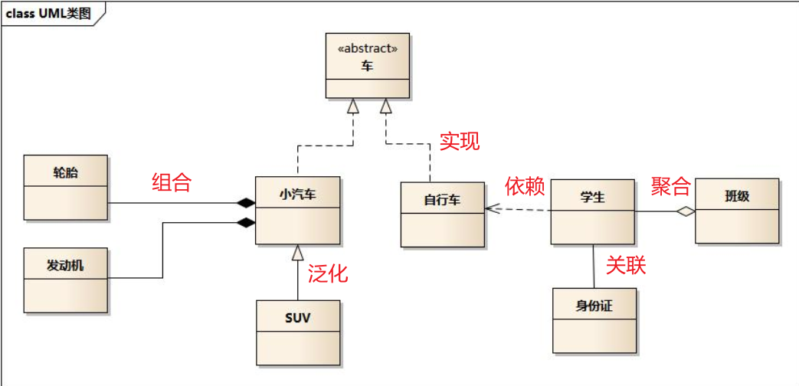

- 车的类图结果是 $<<abstract>>$ ，表示车是一个抽象类
- 车有两个继承类：小汽车和自行车，它们之间的关系是实现关系，关系用一个带虚线的空心箭头表示
- suv继承小汽车，它们之间的关系是泛化关系，关系用一个带实线的空心箭头表示
- 轮胎和发动机组成小汽车，是一种组成关系，用带实线的实心箭头表示
- 学生上学要用到自行车，是一种依赖关系，用带虚线的箭头表示
- 学生聚合成一个班级，是一种聚合关系，用带实心的空心箭头表示
- 学生有身份证，是一种关联关系，用实线表示

### 泛化关系（generalization）

类的集成结构表现在 UML 中： 泛化（generalize）和实现（realize）

继承关系是 $is-a$ 的关系，如果两个对象之间可以用 $is-a$来表示，就是继承关系：自行车是车

泛化关系用一条带实线的空心箭头实线

关系用一个带虚线的空心箭头表示


最终代码中，泛化关系表现为继承非抽象类

### 实现关系（realize）

实现关系用一个带空心箭头的虚线表示

eg：”车”为一个抽象概念，在现实中并无法直接用来定义对象；只有指明具体的子类(汽车还是自行车)，才 可以用来定义对象（”车”这个类在C++中用抽象类表示，在JAVA中有接口这个概念，更容易理解）


最终代码中，实现关系表现为继承抽象类

### 聚合关系（aggregation）

聚合关系用一条带空心菱形箭头的直线表示，如下图表示 A 聚合到 B 上，或者说 B 由 A 组成：

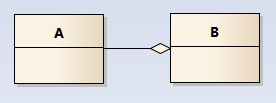

聚合关系用于表示实体对象之间的关系，表示整体由部分构成的语义，eg：一个部门由多个员工组成

与组合关系不同的是，整体和部分不是强依赖，即使整体不存在了，部分依然是存在的，eg：部门撤销了，人员不会消失，他们依然存在

### 组合关系（composition）

组合关系用一条带实现菱形箭头表示，如下图表示 A 组成 B：


与聚合关系一样，组合关系同样表示整体由部分存在的语义：公司由很多个部门存在

但是组合关系hi是一种强依赖关系，如果整体不存在了，则部分也不存在了：公司破产了，部门也无了

### 关联关系（association）

关联关系用一条直线表示，它表示不同类的对象之间的结构关系，它是一种静态关系，通常与运行状态无关，一般由常识等因素决定的，它一般用来定义对象之间静态的，天然的结构，所以，关联关系是一种“强关联”的关系：乘车人和车票

关联关系默认不强调方向，表示对象之间都相互知道，如果特别强调方向，如下图，表示 A 知道 B， B 不知道 A


在最终代码中，关联对象通常是以成员变量的形式实现的

### 依赖关系（dependency）

依赖关系用一个带箭头的虚线表示，如下图表示 A 依赖于 B；他描述一个对象在运行期间会用到另一个对象的关系

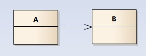

与关联关系不同的是，它是一种临时的关系，通常在运行期间产生，并且随着运行时的变化，依赖关系也可能发生变化

显然，依赖有方向，双向依赖是一种非常糟糕的结构，我们总是应该保持单向依赖，杜绝双向依赖的产生

在最终代码中，依赖关系体现为为类的构造方法及类方法的传入参数，箭头的指向表示调用关系，依赖关系处理临时知道对方外，还是使用对方的方法和属性

### 时序图（sequence diagram）

为了展示对象之间的交互细节，都会用到时序图

时序图（sequence diagram）是显示对象之间交互的图，如果这些对象是按时间顺序排列的，时序图显示的是参与交互的对象及其对象之间消息交互的顺序

时序图包括的建模元素有：对象（Actor）、生命线（Lifeline）、控制焦点（Focus of control）、消息（Message）等

- 角色：系统角色，可以是人、系统或是子系统
- 对象：包括三种命名方式，第一种方式包括对象名和类名；第二种方式只显示类名不显示对象名，即表示他是一个匿名对象；第三种方式只显示对象名不显示类名
- 生命线：生命线再顺序图中表示为从对象图标向下延伸的一条虚线，表示对象存在的时间
- 控制焦点：控制焦点是顺序图中表示时间段的符号，在这个时间段内对象讲执行相应的操作，用小矩形表示
- 消息：消息一般分为同步消息、异步消息、返回消息，同步消息等于调用消息，消息的发送者把控制传递给消息的接收者，然后停止活动，等待消息的接收者放弃或则返回控制，用来表示同步的意义；异步消息表示消息发送者通过消息把信号传递给消息的接收者，然后继续自己的活动，不等待接受者返回消息或控制，异步消息的接收者和发送者是并发工作的；返回消息表示从过程调用返回；自关联消息表示方法自身的调用以及对象内的一个方法调用另一个方法

### 例子


<div align='center'>UML 例子</div>


<div align='center'>sd 例子</div>


## 创建型模式（creational pattern）

创建型模式对类的实例化过程进行了抽象，能够将软件模块中对象的创建和对象的使用分离。为了使软件的结构更加清晰，外界对于这些对象只需要知道它们共同的接口，而不清楚其具体的实现细节，使整个系统的设计更加符合单一职责原则。

包含模式：简单工程模式、工厂方法模式、抽象工厂模式、建造者模式、原型模式、单例模式

### 简单工厂模式（simple factory pattern）

**模式动机**

假设一个软件系统可以提供多个外观不同的按钮，它们都继承同一个基类，但是修改了部分属性。我们想要使用这些按钮，但是我们希望使用的时候不需要知道这些具体按钮类的名字和属性，只需要知道该按钮类的一个参数，并提供一个调用方便的方法，把该参数传入方法即可返回一个相应的按钮对象，这就是简单工厂模式

**模式定义**

属于类创建型模式，在简单工厂模式中，可以根据参数的不同返回不同类的实例。简单工厂模式专门定义一个类来负责创建其它类的实例，被创建的实例通常都是具有共同的父类

**模式结构**

- 工厂角色（factory）： 工厂角色负责实现创建所有实例的内部逻辑
- 抽象产品角色（product）：抽象产品角色是创建所有对象的父类，负责描述所有实例所共有的公共接口
- 具体产品角色（concreteProduct）：具体产品角色是创建目标，所有创建的对象都充当这个角色的某个具体类的实例


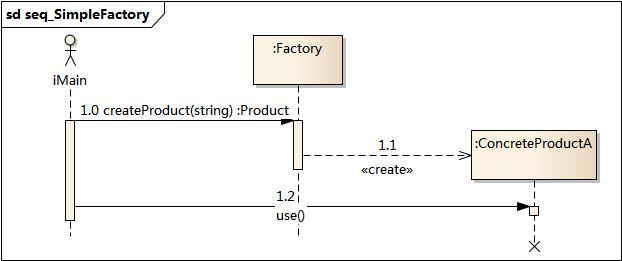

```c++
#include "Factory.h"
#include "ConcreteProductA.h"
#include "ConcreteProductB.h"

Product* Factory:createProduct(string proname) {
    if("A" === proname){
        return new ConcreteProductA();
    } else if("B" === proname) {
        return new ConcreteProductB();
    }
    return NULL;
}
```

**模式分析**

- 将对象的创建和对象本身业务处理分离可以降低系统的耦合度，使得两者修改起来都相对容易
- 在调用工厂类的工厂方法时，由于工厂方法是静态方法，使用起来很方便，可以通过类名直接调用，而且只需要传入一个简单的参数即可，在实例开发中，还可以在调用时将所传入的参数保存在XML等格式的配置文件中，修改参数时无须修改任何源码
- 简单工厂问题的最大问题在于工厂类的职责相对过重，增加新的产品需要修改工厂类的判断逻辑，这一点与开闭原则是相违背的
- 简单工厂模式的要点在于：当你需要什么，只需要传入一个正确的参数，就可以获取你需要的对象，而无需知道其创建细节

**优点**

- 工厂类含有必要的判断逻辑，可以决定在什么时候创建哪一个产品类的实例，客户端可以免除直接创建产品对象的责任，而仅仅“消费”产品；简单工厂模式通过这种做法实现了对责任的分割，它提供专门的工厂类用于创建对象
- 客户端无须知道所创建的具体产品类的类名，只需要知道具体产品类所对应的参数即可，对于一些复杂的类名，通过简单工厂模式可以减少使用者的记忆量
- 通过引入配置文件，可以在不修改任何客户端代码的情况下更换和增加新的具体产品类，在一点程度上提高了系统的灵活性

**缺点**

- 由于工厂类集中了所产品创建逻辑，一点不能正常工作，整个系统都要受到影响
- 使用简单工厂模式将会增加系统中类的个数，在一定程度上增加了系统的复杂度和理解难度
- 系统扩展困难，一旦添加新产品就不得不修改工厂逻辑，在产品类型较多时，有可能造成工厂逻辑过于复杂，不利于系统的扩展和维护

**适用环境**

- 工厂类负责创建的对象比较少，由于创建的对象较少，不会造成工厂方法中的业务逻辑太过复杂
- 客户端只知道传入工厂类的参数，对于如何创建对象不关心：客户端既不需要关心创建细节，甚至连类名都不需要记住，只需要知道类型所对应的参数

应用有：java.text.DateFormat、Java 加密技术

**总结**

- 创建型模式对类的实例化过程进行了抽象，能够将对象的创建与对象的使用过程分离。
- 简单工厂模式又称为静态工厂方法模式，它属于类创建型模式。在简单工厂模式中，可以根据参数的不同返回不同类的实例。简单工厂模式专门定义一个类来负责创建其他类的实例，被创建的实例通常都具有共同的父类。
- 简单工厂模式包含三个角色：工厂角色负责实现创建所有实例的内部逻辑；抽象产品角色是所创建的所有对象的父类，负责描述所有实例所共有的公共接口；具体产品角色是创建目标，所有创建的对象都充当这个角色的某个具体类的实例。
- 简单工厂模式的要点在于：当你需要什么，只需要传入一个正确的参数，就可以获取你所需要的对象，而无须知道其创建细节。
- 简单工厂模式最大的优点在于实现对象的创建和对象的使用分离，将对象的创建交给专门的工厂类负责，但是其最大的缺点在于工厂类不够灵活，增加新的具体产品需要修改工厂类的判断逻辑代码，而且产品较多时，工厂方法代码将会非常复杂。
- 简单工厂模式适用情况包括：工厂类负责创建的对象比较少；客户端只知道传入工厂类的参数，对于如何创建对象不关心。

### 工厂方法模式（Factory Method Pattern）

**模式动机**

现在对系统进行修改，不再设计一个按钮工厂类来统一负责所有产品的创建，而是将具体按钮的创建过程交给专门的工厂子类去完成，我们先定义一个抽象的按钮工厂类，再定义具体的工厂类来生成圆形按钮、矩形按钮、菱形按钮等，它们实现在抽象按钮工厂类中定义的方法。这种抽象化的结果使这种结构可以在不修改具体工厂类的情况下引进新的产品，如果出现新的按钮类型，只需要为这种新类型的按钮创建一个具体的工厂类就可以获得该新按钮的实例，这一特点更加符合“开闭原则”

**模式定义**

工厂方法模式又称为工厂模式，也叫虚拟构造器模式或者多态工厂模式，它属于类创建型模式。在工厂方法模式中，工厂父类负责定义创建产品对象的公共接口，而工厂子类则负责生成具体的产品对象，这要做的目的是将产品类的实例化操作延迟到工厂子类中完成，即通过工厂子类来确定究竟应该实例化哪一个具体产品类

**模式结构**

工厂方法模式包含如下角色：

- Product：抽象产品
- ConcreteProduct：具体产品
- Factory：抽象工厂
- ConcreteFactory：具体工厂


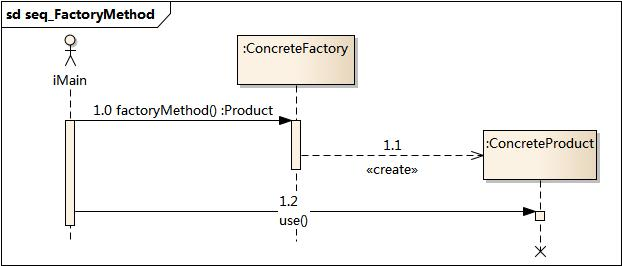

**模式分析**

工厂方法模式是简单工厂模式的进一步抽象和推广。由于使用了面向对象的多态性，工厂方法模式保持了简单工厂模式的优点，而且克服了它的缺点。在工厂方法模式中，核心的工厂类不再负责所有产品的创建，而是将具体创建工作交给子类去做，这个核心类仅仅负责给出具体工厂必须实现的接口，而不负责哪一个产品类被实例化这种细节，这使得工厂方法模式可以允许系统在不修改工厂角色的情况下引进新产品

**实例**

日志记录器：某系统日志记录器要求支持多种日志记录方式，如文件记录、数据库记录等，且用户可以根据要求动态选择日志记录方式，现使用工厂方法模式设计该系统

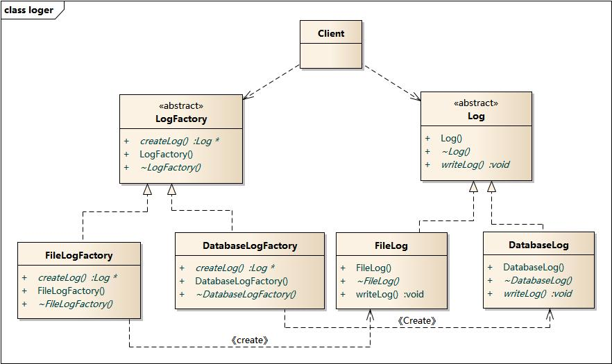


**模式优点**

- 在工厂方法模式中，工厂方法用来创建客户所需要的产品，同时还向客户隐藏了那种具体产品类将被实例化这一细节，用户只需要关心所需产品对应的工厂，无须关心创建细节，甚至无需知道具体产品类的类名
- 基于工厂角色和产品角色的多态性设计是工厂方法模式的关键，它能够使工厂可以自主确定创建何种产品对象，而如何创建这个对象的细节则完全封装在具体工厂内部
- 使用工厂方法模式的另一个优点是在系统中加入新产品时，无须修改抽象工厂和抽象产品提供的接口，无须修改客户端，也无须修改其他的具体工厂和具体产品，而只要添加一个具体工厂和具体产品就可以了。这要，系统的可扩展性也就更好，完全符合“开闭原则”

**缺点**

- 在添加新产品时，需要编写新的具体产品类，而且还要提供与之对应的具体工厂类，系统中类的个数将成对增加，在一定程度上增加了系统的复杂度，有更多的类需要编译和运行，也会给系统带来一些额外的开销
- 由于考虑到系统的可扩展性，需要引入抽象层，在客户端代码中均使用抽象层进行定义，增加了系统的抽象性和理解难度，且在实现时可能需要用到DOM、反射等技术，增加了系统的实现难度

**适用环境**

- 一个类不知道它所需要的对象的类：在工厂方法模式中，客户端不需要知道具体产品类的类名，只需要知道所对应的工厂即可，具体的产品对象由具体工厂类创建；客户端需要知道创建具体产品的工厂类
- 一个类通过其它子类来指定创建哪个对象：在工厂方法模式中，对于抽象工厂类只需要提供一个创建产品的接口，而由其子类来确定具体要创建的对象，利用面向对象的多态性和里氏代换原则，在程序运行时，子类对象将覆盖父类对象，从而使得系统更容易扩展
- 将创建对象的任务委托给多个工厂子类中的某一个，客户端在使用时可以无须关心是哪个一个工厂子类创建产品子类，需要时再动态指定 ，可将具体工厂类的类名存储在配置文件中或数据库中

**总结**

- 工厂方法模式又称为工厂模式，它属于类创建型模式。在工厂方法模式中，工厂父类负责定义创建产品对象的公共接口，而工厂子类则负责生成具体的产品对象，这样做的目的是将产品类的实例化操作延迟到工厂子类中完成，即通过工厂子类来确定究竟应该实例化哪一个具体产品类。
- 工厂方法模式包含四个角色：抽象产品是定义产品的接口，是工厂方法模式所创建对象的超类型，即产品对象的共同父类或接口；具体产品实现了抽象产品接口，某种类型的具体产品由专门的具体工厂创建，它们之间往往一一对应；抽象工厂中声明了工厂方法，用于返回一个产品，它是工厂方法模式的核心，任何在模式中创建对象的工厂类都必须实现该接口；具体工厂是抽象工厂类的子类，实现了抽象工厂中定义的工厂方法，并可由客户调用，返回一个具体产品类的实例。
- 工厂方法模式是简单工厂模式的进一步抽象和推广。由于使用了面向对象的多态性，工厂方法模式保持了简单工厂模式的优点，而且克服了它的缺点。在工厂方法模式中，核心的工厂类不再负责所有产品的创建，而是将具体创建工作交给子类去做。这个核心类仅仅负责给出具体工厂必须实现的接口，而不负责产品类被实例化这种细节，这使得工厂方法模式可以允许系统在不修改工厂角色的情况下引进新产品。
- 工厂方法模式的主要优点是增加新的产品类时无须修改现有系统，并封装了产品对象的创建细节，系统具有良好的灵活性和可扩展性；其缺点在于增加新产品的同时需要增加新的工厂，导致系统类的个数成对增加，在一定程度上增加了系统的复杂性。
- 工厂方法模式适用情况包括：一个类不知道它所需要的对象的类；一个类通过其子类来指定创建哪个对象；将创建对象的任务委托给多个工厂子类中的某一个，客户端在使用时可以无须关心是哪一个工厂子类创建产品子类，需要时再动态指定。

### 抽象工厂模式

**模式动机**

当系统所提供的工厂所需生产的具体产品并不是一个简单的对象，而是多个位于不同产品等级结构中属于不同类型的具体产品时需要使用抽象工厂模式。抽象工厂模式和工厂方法模式最大的区别在于，工厂方法模式针对的是一个产品等级结构，而抽象工厂模式则需要面对多个产品等级结构，一个工厂等级结构可以负责多个不同产品等级结构中的产品对象创建。当一个工厂等级结构可以创建出分属不同产品等级结构的一个产品足中的所有对象时，抽象工厂模式比工厂方法模式更为简单、有效率

**模式定义**

抽象工厂模式：提供一个创建一系列相关或相互依赖对象的接口，而无须指定它们具体的类

**模式结构**

抽象工厂模式包含如下角色：

- 抽象工厂
- 具体工厂
- 抽象产品
- 具体产品

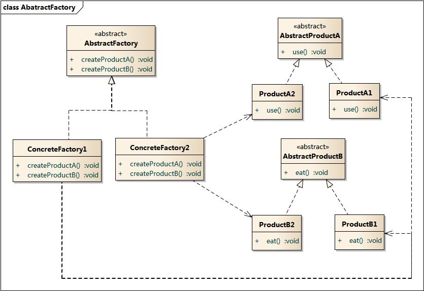

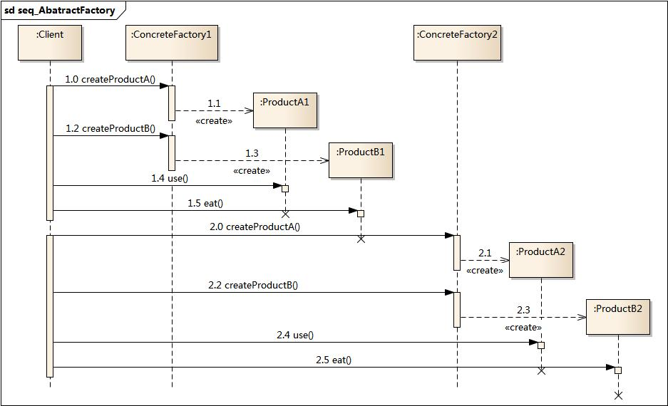

**优点**

- 抽象工厂模式隔离了具体类的生成，使得客户并不需要知道什么被创建。由于这种隔离，更换一个具体工厂就变得相对容易。所有的具体工厂都实现了抽象工厂中定义的哪些公共接口，因此只需改变具体工厂的实例，就可以在某种程度上改变整个软件系统的行为。另外，应用抽象工厂模式可以实现高内聚低耦合的设计目的，因此抽象工厂模式得到了广泛的应用
- 当一个产品族中的多个对象被设计成在一起工作时，它能够保证客户端始终只使用同一个产品中的对象。这对一些需要根据当前环境来决定其行为的软件系统来说，是一种非常实用的设计模式
- 增加新的具体工厂和产品族很方便，无须修改已有系统，符合“开闭原则”

**缺点**

- 在添加新的产品对象时，难以扩展抽象工厂来生产新种类的产品，这是因为在抽象工厂角色中规定了所有可能被创建的产品集合，要支持新种类的产品就意味着要对该接口进行扩展，而这将涉及到对抽象工厂角色及其所有子类的修改，显然会带来较大的不便。
- 开闭原则的倾斜性（增加新的工厂和产品族容易，增加新的产品等级结构麻烦）。

**适用环境**

- 一个系统不应当依赖于产品类实例如何被创建、组合和表达的细节，这对所有类型的工厂模式都是重要的
- 系统中有多于一个的产品族，而每次只使用其中某一产品族
- 属于统一产品族的产品将会在一起使用，这一约束必须在系统的设计中体现出来
- 系统提供一个产品类的库，所有的产品义同样的接口出现，从而使客户端不依赖与具体实现

**例子**

在很多软件系统中需要更换界面主题，要求界面中的按钮、文本框、背景色等一起发生改变时，可以使用抽象工厂模式进行设计

**总结**

- 抽象工厂模式提供一个创建一系列相关或相互依赖对象的接口，而无须指定它们具体的类。抽象工厂模式又称为Kit模式，属于对象创建型模式。
- 抽象工厂模式包含四个角色：抽象工厂用于声明生成抽象产品的方法；具体工厂实现了抽象工厂声明的生成抽象产品的方法，生成一组具体产品，这些产品构成了一个产品族，每一个产品都位于某个产品等级结构中；抽象产品为每种产品声明接口，在抽象产品中定义了产品的抽象业务方法；具体产品定义具体工厂生产的具体产品对象，实现抽象产品接口中定义的业务方法。
- 抽象工厂模式是所有形式的工厂模式中最为抽象和最具一般性的一种形态。抽象工厂模式与工厂方法模式最大的区别在于，工厂方法模式针对的是一个产品等级结构，而抽象工厂模式则需要面对多个产品等级结构。
- 抽象工厂模式的主要优点是隔离了具体类的生成，使得客户并不需要知道什么被创建，而且每次可以通过具体工厂类创建一个产品族中的多个对象，增加或者替换产品族比较方便，增加新的具体工厂和产品族很方便；主要缺点在于增加新的产品等级结构很复杂，需要修改抽象工厂和所有的具体工厂类，对“开闭原则”的支持呈现倾斜性。
- 抽象工厂模式适用情况包括：一个系统不应当依赖于产品类实例如何被创建、组合和表达的细节；系统中有多于一个的产品族，而每次只使用其中某一产品族；属于同一个产品族的产品将在一起使用；系统提供一个产品类的库，所有的产品以同样的接口出现，从而使客户端不依赖于具体实现。

### 建造者模式

**模式动机**

无论是在现实世界中还是在软件系统中，都存在一些复杂的对象，它们拥有多个组成部分，如汽车就包括车轮、方向盘、发送机等各种部件。而对于大多数用户而言，无须知道这些部件的装配细节，也几乎不会使用单独某个部件，而是使用一辆完整的汽车，可以通过建造者模式对其进行设计与描述，建造者模式可以将部件和其组装过程分开，一步一步创建一个复杂的对象，用户只需要指定复杂对象的类型就可以得到该对象，而无须知道其内部的具体构造细节。

在软件开发中，也存在大量类似汽车一样的复杂对象，它们拥有一系列成员属性，这些成员属性中有些是引用类型的成员对象。而且在这些复杂的对象中，还可能存在一些限制条件，如某些属性没有赋值则复杂对象不能作为一个完整的产品使用；有些属性的赋值必须按照某个顺序，一个属性没有被赋值之前，另外一个属性可能无法赋值

复杂对象相当于一辆有待建造的汽车，而对象的属性相当于汽车的部件，建造产品的过程就相当于组合部件的过程。由于组合部件的过程很复杂，这些部件的组合过程往往被“外部化”到一个称作建造者的对象里，建造者返还给客户端的是一个已经建造完毕的完整产品对象，而用户无须关心该对象所包含的属性以及它们的组装方式，这就是建造者模式的模式动机

**模式定义**

建造者模式：将一个复杂对象的构建与它的表示分离，使得同样的构建过程可以创建不同的表示

**模式结构**

建造者模式包含如下的角色：

- 抽象建造者
- 具体建造者
- 指挥者
- 产品角色


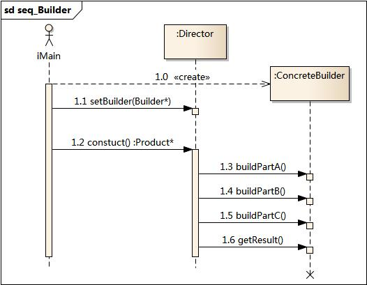

**模式分析**

建造者模式的结构中还引入了一个指挥者类 Director，该类的作用主要有两个：一方面它隔离了客户与生产过程；另一方面它负责控制产品的生成过程。指挥者针对抽象建造者编程，客户端只需要知道具体建造者的类型，即可通过指挥者类调用建造者的相关方法，返回一个完整的产品对象。

在客户端代码中，无须关心产品对象的具体组装过程，只需要确定具体建造者的类型即可，建造者模式将复杂对象的创建与对象的表现分离开来，这样使得同样的创建过程可以创建出不同的表现

**实例**

建造者模式可以用于描述KFC如何创建套餐：套餐是一个复杂对象，它一般包含主食（如汉堡、鸡肉卷等）和饮料（如果汁、 可乐等）等组成部分，不同的套餐有不同的组成部分，而KFC的服务员可以根据顾客的要求，一步一步装配这些组成部分，构造一份完整的套餐，然后返回给顾客。


**优点**

- 在建造者模式中， 客户端不必知道产品内部组成的细节，将产品本身与产品的创建过程解耦，使得相同的创建过程可以创建不同的产品对象。
- 每一个具体建造者都相对独立，而与其他的具体建造者无关，因此可以很方便地替换具体建造者或增加新的具体建造者， 用户使用不同的具体建造者即可得到不同的产品对象 。
- 可以更加精细地控制产品的创建过程。将复杂产品的创建步骤分解在不同的方法中，使得创建过程更加清晰，也更方便使用程序来控制创建过程。
- 增加新的具体建造者无须修改原有类库的代码，指挥者类针对抽象建造者类编程，系统扩展方便，符合“开闭原则”。

**缺点**

- 建造者模式所创建的产品一般具有较多的共同点，其组成部分相似，如果产品之间的差异性很大，则不适合使用建造者模式，因此其使用范围受到一定的限制。
- 如果产品的内部变化复杂，可能会导致需要定义很多具体建造者类来实现这种变化，导致系统变得很庞大。

**适用环境**

- 需要生成的产品对象有复杂的内部结构，这些产品对象通常包含多个产品属性
- 需要生成的产品对象的属性相互依赖，需要指定其生成顺序
- 对象的创建过程独立于创建该对象的类。在建造者模式中引入了指挥者类，将创建过程封装在指挥者类中，而不在建造者类中
- 隔离复杂对象的创建和使用，并使得相同的创建过程可以创建不同的产品

**模式应用**

在很多游戏软件中，地图包括天空、地面、背景等组成部分，任务角色包括人体、服装、装备，可以使用建造者模式对其进行设计，通过不同的具体建造者创建不同类型的地图或人物

**总结**

- 建造者模式将一个复杂对象的构建与它的表示分离，使得同样的构建过程可以创建不同的表示。建造者模式是一步一步创建一个复杂的对象，它允许用户只通过指定复杂对象的类型和内容就可以构建它们，用户不需要知道内部的具体构建细节。建造者模式属于对象创建型模式。
- 建造者模式包含如下四个角色：抽象建造者为创建一个产品对象的各个部件指定抽象接口；具体建造者实现了抽象建造者接口，实现各个部件的构造和装配方法，定义并明确它所创建的复杂对象，也可以提供一个方法返回创建好的复杂产品对象；产品角色是被构建的复杂对象，包含多个组成部件；指挥者负责安排复杂对象的建造次序，指挥者与抽象建造者之间存在关联关系，可以在其construct()建造方法中调用建造者对象的部件构造与装配方法，完成复杂对象的建造
- 在建造者模式的结构中引入了一个指挥者类，该类的作用主要有两个：一方面它隔离了客户与生产过程；另一方面它负责控制产品的生成过程。指挥者针对抽象建造者编程，客户端只需要知道具体建造者的类型，即可通过指挥者类调用建造者的相关方法，返回一个完整的产品对象。
- 建造者模式的主要优点在于客户端不必知道产品内部组成的细节，将产品本身与产品的创建过程解耦，使得相同的创建过程可以创建不同的产品对象，每一个具体建造者都相对独立，而与其他的具体建造者无关，因此可以很方便地替换具体建造者或增加新的具体建造者，符合“开闭原则”，还可以更加精细地控制产品的创建过程；其主要缺点在于由于建造者模式所创建的产品一般具有较多的共同点，其组成部分相似，因此其使用范围受到一定的限制，如果产品的内部变化复杂，可能会导致需要定义很多具体建造者类来实现这种变化，导致系统变得很庞大。
- 建造者模式适用情况包括：需要生成的产品对象有复杂的内部结构，这些产品对象通常包含多个成员属性；需要生成的产品对象的属性相互依赖，需要指定其生成顺序；对象的创建过程独立于创建该对象的类；隔离复杂对象的创建和使用，并使得相同的创建过程可以创建不同类型的产品。

### 单例模式

**模式动机**

对于系统中的某些类来说，只有一个实例很重要，例如，一个系统中可以存在多个打印任务，但是只能有一个正在工作的任务；一个系统只能有一个窗口管理器和文件系统等

如何保证一个类只有一个实例并且这个实例易于被访问呢？定义一个全局变量可以确保对象随时都可以被访问到，但不能防止我们实例化多个对象

一个更好的解决办法是让类自身负责保存它的唯一实例。这个类可以保证没有其他实例被创建，并且它可以提供一个访问该实例的方法，这就是单例模式的动机

**模式定义**

单例模式：单例模式确保某一个类只有一个实例，而且自行实例化并向整个系统提供这个实例，这个类就被称为单例类

**模式结构**

单例模式只包含单例角色


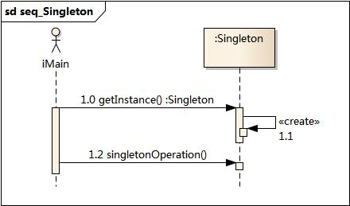

**模式分析**

单例模式的目的是保证一个类仅有一个实例，并提供一个访问它的全局访问点。单例模式包含的角色只有一个，就是单例类——Singleton。单例类拥有一个私有构造函数，确保用户无法通过new关键字直接实例化它。除此之外，该模式中包含一个静态私有成员变量与静态公有的工厂方法，该工厂方法负责检验实例的存在性并实例化自己，然后存储在静态成员变量中，以确保只有一个实例被创建。

在单例模式的实现过程中，需要注意如下三点：

- 单例类的构造函数为私有；
- 提供一个自身的静态私有成员变量；
- 提供一个公有的静态工厂方法。

**实例**

在操作系统中，打印池(Print Spooler)是一个用于管理打印任务的应用程序，通过打印池用户可以删除、中止或者改变打印任务的优先级，在一个系统中只允许运行一个打印池对象，如果重复创建打印池则抛出异常。现使用单例模式来模拟实现打印池的设计。

**优点**

- 提供了对唯一实例的受控访问。因为单例类封装了它的唯一实例，所以它可以严格控制客户怎样以及何时访问它，并为设计及开发团队提供了共享的概念。
- 由于在系统内存中只存在一个对象，因此可以节约系统资源，对于一些需要频繁创建和销毁的对象，单例模式无疑可以提高系统的性能。
- 允许可变数目的实例。我们可以基于单例模式进行扩展，使用与单例控制相似的方法来获得指定个数的对象实例。

**缺点**

- 由于单例模式中没有抽象层，因此单例类的扩展有很大的困难。
- 单例类的职责过重，在一定程度上违背了“单一职责原则”。因为单例类既充当了工厂角色，提供了工厂方法，同时又充当了产品角色，包含一些业务方法，将产品的创建和产品的本身的功能融合到一起。
- 滥用单例将带来一些负面问题，如为了节省资源将数据库连接池对象设计为单例类，可能会导致共享连接池对象的程序过多而出现连接池溢出；现在很多面向对象语言(如Java、C#)的运行环境都提供了自动垃圾回收的技术，因此，如果实例化的对象长时间不被利用，系统会认为它是垃圾，会自动销毁并回收资源，下次利用时又将重新实例化，这将导致对象状态的丢失。

**适用环境**

- 系统只需要一个实例对象，如系统要求提供一个唯一的序列号生成器，或者需要考虑资源消耗太大而只允许创建一个对象。
- 客户调用类的单个实例只允许使用一个公共访问点，除了该公共访问点，不能通过其他途径访问该实例。
- 在一个系统中要求一个类只有一个实例时才应当使用单例模式。反过来，如果一个类可以有几个实例共存，就需要对单例模式进行改进，使之成为多例模式

**总结**

- 单例模式确保某一个类只有一个实例，而且自行实例化并向整个系统提供这个实例，这个类称为单例类，它提供全局访问的方法。单例模式的要点有三个：一是某个类只能有一个实例；二是它必须自行创建这个实例；三是它必须自行向整个系统提供这个实例。单例模式是一种对象创建型模式。
- 单例模式只包含一个单例角色：在单例类的内部实现只生成一个实例，同时它提供一个静态的工厂方法，让客户可以使用它的唯一实例；为了防止在外部对其实例化，将其构造函数设计为私有。
- 单例模式的目的是保证一个类仅有一个实例，并提供一个访问它的全局访问点。单例类拥有一个私有构造函数，确保用户无法通过new关键字直接实例化它。除此之外，该模式中包含一个静态私有成员变量与静态公有的工厂方法。该工厂方法负责检验实例的存在性并实例化自己，然后存储在静态成员变量中，以确保只有一个实例被创建。
- 单例模式的主要优点在于提供了对唯一实例的受控访问并可以节约系统资源；其主要缺点在于因为缺少抽象层而难以扩展，且单例类职责过重。
- 单例模式适用情况包括：系统只需要一个实例对象；客户调用类的单个实例只允许使用一个公共访问点。

## 结构型模式

结构型模式描述如何将类或者对象结合在一起形成更大的结构，就像搭积木，可以通过简单积木的组合形成复杂的、功能更为强大的结构。结构型模型又可以分为类结构型模式和对象结构型模式。

类结构型模式关心类的组合，由多个类可以组合成一个更大的系统，在类结构型模式中一般只存在继承关系和实现关系。

对象结构型模式关心类与对象的组合，通过关联关系使得一个类中定义另一个类的实例对象，然后通过该对象调用其方法。根据“合成复用原则”，在系统中尽量使用关联关系来替代继承关系，因此大部分结构型模式都是对象结构型模式

### 适配器模式

**模式动机**

在软件开发中类似于电源适配器的设计和编码技巧被称为适配器模式。通常情况下，客户端可以通过目标类的接口访问它所提供的服务。有时，现有的类可以满足客户类的功能需要，但是它所提供的接口不一定事客户类所期望的，在这种情况下，现有的接口需要转化为客户类期望的接口，这样保证了对现有类的重用，适配器提供客户类需要的接口，适配器的实现就是把客户类的请求转化为对适配者的相应接口的调用

**模式定义**

适配器模式：将一个接口转换成客户希望的另一个接口，适配器模式使接口不兼容的那些类也可以一起哦工作，其别名叫做包装器（Wrapper）

**模式结构**

适配器模式有如下角色：

- 目标抽象类
- 适配器类
- 适配者类
- 客户类


**优点**

- 将目标类和适配者类解耦，通过引入一个适配器类来重用现有的适配者类，而无须修改原有代码
- 增加了类的透明性和复用性，将具体的实现封装在适配者类中，对于客户端类来说是透明的，而且提高了适配者的复用性。
- 灵活性和扩展性都非常好，通过使用配置文件，可以很方便地更换适配器，也可以在不修改原有代码的基础上增加新的适配器类，完全符合“开闭原则”。

**缺点**

- 对于Java、C#等不支持多重继承的语言，一次最多只能适配一个适配者类，而且目标抽象类只能为抽象类，不能为具体类，其使用有一定的局限性，不能将一个适配者类和它的子类都适配到目标接口。
- 与类适配器模式相比，要想置换适配者类的方法就不容易。如果一定要置换掉适配者类的一个或多个方法，就只好先做一个适配者类的子类，将适配者类的方法置换掉，然后再把适配者类的子类当做真正的适配者进行适配，实现过程较为复杂。

**适用环境**

- 系统需要使用现有的类，而这些类的接口不符合系统的需要
- 想要建立一个可以重复使用的类，用于与一些彼此之间没有太大关联的一些类，包括一些可能在将来引进的类一起工作

**模式应用**

JDBC：Java 语言的数据库连接工具，使得 Java 语言程序能够与数据库连接，并使用 SQL 语言来查询和操作数据。JDBC 给出一个客户端通用的抽象接口，每一个具体数据库引擎（如 SQL Server、Oracle、MySQL 等）的 JDBC 驱动软件都是一个介于 JDBC 接口和数据库引擎接口之间的适配器软件。抽象的 JDBC 接口和各个数据库引擎 API 之间都需要相应的适配器软件，这就是为各个不同数据库引擎准备的驱动程序

**总结**

- 结构型模式描述如何将类或者对象结合在一起形成更大的结构。
- 适配器模式用于将一个接口转换成客户希望的另一个接口，适配器模式使接口不兼容的那些类可以一起工作，其别名为包装器。适配器模式既可以作为类结构型模式，也可以作为对象结构型模式。
- 适配器模式包含四个角色：目标抽象类定义客户要用的特定领域的接口；适配器类可以调用另一个接口，作为一个转换器，对适配者和抽象目标类进行适配，它是适配器模式的核心；适配者类是被适配的角色，它定义了一个已经存在的接口，这个接口需要适配；在客户类中针对目标抽象类进行编程，调用在目标抽象类中定义的业务方法。
- 在类适配器模式中，适配器类实现了目标抽象类接口并继承了适配者类，并在目标抽象类的实现方法中调用所继承的适配者类的方法；在对象适配器模式中，适配器类继承了目标抽象类并定义了一个适配者类的对象实例，在所继承的目标抽象类方法中调用适配者类的相应业务方法。
- 适配器模式的主要优点是将目标类和适配者类解耦，增加了类的透明性和复用性，同时系统的灵活性和扩展性都非常好，更换适配器或者增加新的适配器都非常方便，符合“开闭原则”；类适配器模式的缺点是适配器类在很多编程语言中不能同时适配多个适配者类，对象适配器模式的缺点是很难置换适配者类的方法。
- 适配器模式适用情况包括：系统需要使用现有的类，而这些类的接口不符合系统的需要；想要建立一个可以重复使用的类，用于与一些彼此之间没有太大关联的一些类一起工作。

### 桥接模式

**模式动机**

设想如果要绘制矩形、圆形、椭圆、正方形，我们至少需要有 4 个形状类，但是如果绘制的图形需要有不同的颜色，如红色、绿色、蓝色等，此时至少有两种设计方案：

- 第一种设计方案是为每一种形状都提供一套各种颜色的版本
- 第二种设计方案根据实际需要对形状和颜色进行组合

对于有两个变化维度的系统，采用方案二来进行设计系统中类的个数更少，且系统扩展更为方便。设计方案二即是桥接模式的应用。桥接模式将继承关系转为关联关系，从而降低类与类之间的偶尔，减少代码编写量

**模式定义**

桥接模式将抽象部分与它的实现部分分离，使他们都可以独立地变化，它是一种对象结构模式

**模式结构**

桥接模式包含如下角色：

- 抽象类
- 扩充抽象类
- 实现类接口
- 具体实现类


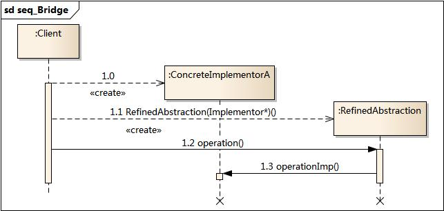

**模式分析**

理解桥接模式，重点需要理解如何将抽象化(Abstraction)与实现化(Implementation)脱耦，使得二者可以独立地变化。

- 抽象化：抽象化就是忽略一些信息，把不同的实体当作同样的实体对待。在面向对象中，将对象的共同性质抽取出来形成类的过程即为抽象化的过程。
- 实现化：针对抽象化给出的具体实现，就是实现化，抽象化与实现化是一对互逆的概念，实现化产生的对象比抽象化更具体，是对抽象化事物的进一步具体化的产物。
- 脱耦：脱耦就是将抽象化和实现化之间的耦合解脱开，或者说是将它们之间的强关联改换成弱关联，将两个角色之间的继承关系改为关联关系。桥接模式中的所谓脱耦，就是指在一个软件系统的抽象化和实现化之间使用关联关系（组合或者聚合关系）而不是继承关系，从而使两者可以相对独立地变化，这就是桥接模式的用意。

**优点**

- 分离抽象接口及其实现部分。
- 桥接模式有时类似于多继承方案，但是多继承方案违背了类的单一职责原则（即一个类只有一个变化的原因），复用性比较差，而且多继承结构中类的个数非常庞大，桥接模式是比多继承方案更好的解决方法。
- 桥接模式提高了系统的可扩充性，在两个变化维度中任意扩展一个维度，都不需要修改原有系统。
- 实现细节对客户透明，可以对用户隐藏实现细节。

**缺点**

- 接模式的引入会增加系统的理解与设计难度，由于聚合关联关系建立在抽象层，要求开发者针对抽象进行设计与编程。 
- 桥接模式要求正确识别出系统中两个独立变化的维度，因此其使用范围具有一定的局限性。

**适用环境**

- 如果一个系统需要在构件的抽象化角色和具体化角色之间增加更多的灵活性，避免在两个层次之间建立静态的继承联系，通过桥接模式可以使它们在抽象层建立一个关联关系。
- 抽象化角色和实现化角色可以以继承的方式独立扩展而互不影响，在程序运行时可以动态将一个抽象化子类的对象和一个实现化子类的对象进行组合，即系统需要对抽象化角色和实现化角色进行动态耦合。
- 一个类存在两个独立变化的维度，且这两个维度都需要进行扩展。
- 虽然在系统中使用继承是没有问题的，但是由于抽象化角色和具体化角色需要独立变化，设计要求需要独立管理这两者。
- 对于那些不希望使用继承或因为多层次继承导致系统类的个数急剧增加的系统，桥接模式尤为适用。

**总结**

- 桥接模式将抽象部分与它的实现部分分离，使它们都可以独立地变化。它是一种对象结构型模式，又称为柄体(Handle and Body)模式或接口(Interface)模式。
- 桥接模式包含如下四个角色：抽象类中定义了一个实现类接口类型的对象并可以维护该对象；扩充抽象类扩充由抽象类定义的接口，它实现了在抽象类中定义的抽象业务方法，在扩充抽象类中可以调用在实现类接口中定义的业务方法；实现类接口定义了实现类的接口，实现类接口仅提供基本操作，而抽象类定义的接口可能会做更多更复杂的操作；具体实现类实现了实现类接口并且具体实现它，在不同的具体实现类中提供基本操作的不同实现，在程序运行时，具体实现类对象将替换其父类对象，提供给客户端具体的业务操作方法。
- 在桥接模式中，抽象化(Abstraction)与实现化(Implementation)脱耦，它们可以沿着各自的维度独立变化。
- 桥接模式的主要优点是分离抽象接口及其实现部分，是比多继承方案更好的解决方法，桥接模式还提高了系统的可扩充性，在两个变化维度中任意扩展一个维度，都不需要修改原有系统，实现细节对客户透明，可以对用户隐藏实现细节；其主要缺点是增加系统的理解与设计难度，且识别出系统中两个独立变化的维度并不是一件容易的事情。
- 桥接模式适用情况包括：需要在构件的抽象化角色和具体化角色之间增加更多的灵活性，避免在两个层次之间建立静态的继承联系；抽象化角色和实现化角色可以以继承的方式独立扩展而互不影响；一个类存在两个独立变化的维度，且这两个维度都需要进行扩展；设计要求需要独立管理抽象化角色和具体化角色；不希望使用继承或因为多层次继承导致系统类的个数急剧增加的系统。

### 装饰模式

**模式动机**

一般有两种方式可以实现给一个类或对象增加行为：

- 继承机制，使用继承机制是给现有类添加功能的一种有效途径，通过继承一个现有类可以使得子类在拥有自身方法的同时还拥有父类的方法。但是这种方法是静态的，用户不能控制增加行为的方式和时机
- 关联机制，即将一个类的对象嵌入另一个对象中，由另一个对象来决定是否调用嵌入对象的行为以便扩展自己的行为，我们称这个嵌入的对象为装饰器

装饰模式义对客户透明的方式动态地给一个对象附加上更多的责任，换言之，客户端并不会觉得对象在装饰前后有什么不同。装饰模式可以在不需要创造更多子类的情况下，将对象的功能加以扩展，这就是装饰模式的动机

**模式定义**

装饰模式（Decorator Pattern）：动态地给一个对象增加一些额外的职责，就增加对象功能来说，装饰模式比生成子类实现更加灵活。其别名也可以称为包装器（Wrapper），与适配器模式的别名相同，但他们适用于不同的场合。

**模式结构**

装饰模式包含如下角色：

- 抽象构件
- 具体构件
- 抽象装饰类
- 具体装饰类


**模式分析**

- 与继承关系相比，关联关系的主要优势在于不会破坏类的封装性，而且继承是一种耦合度较大的静态关系，无法在程序运行时动态扩展。在软件开发阶段，关联关系虽然不会比继承关系减少编码量，但是到了软件维护阶段，由于关联关系使系统具有较好的耦合性，因此使得系统更加容易维护。当然，关联关系的缺点是比继承关系要创建更多的对象
- 适用装饰模式来实现扩展比继承更加灵活，它以客户透明的方式动态地给一个对象附加更多的责任。装饰模式可以在不需要创造更多子类的情况下，将对象的功能加以扩展

**实例**

实例：变形金刚

变形金刚在变形之前是一辆汽车，它可以在陆地上移动。当它变成机器人之后除了能够在陆地上移动之外，还可以说话；如果需要，它还可以变成飞机，除了在陆地上移动还可以在天空中飞翔。

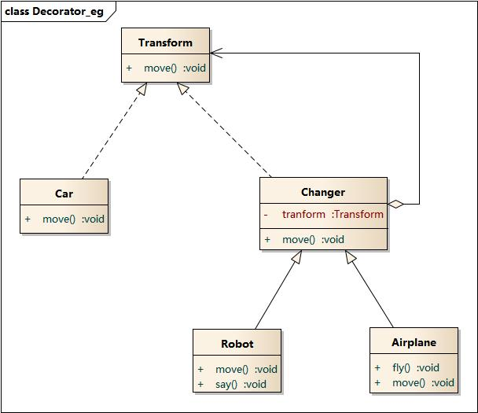

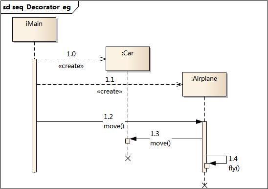

**优点**

- 装饰器模式与继承关系的目的都是要扩展对象的功能，但是装饰模式可以提供比继承更多的灵活性
- 可以通过一种动态的方式来扩展一个对象的功能，通过配置文件可以在运行时选择不同的装饰器，从而实现不同的行为
- 通过适用不同的具体装饰类以及这些装饰类的排列组合，可以创造出很多不同行为的组合。可以使用多个具体装饰类来修饰同一个对象，得到功能更为强大的对象
- 具体构件类与具体装饰类可以独立变化，用户可以根据需要增加新的具体构件类和具体装饰类，在使用时再对其进行组合，原有代码无须改变，符合“开闭原则”

**缺点**

- 使用装饰模式进行系统设计时将产生很多小对象，这些对象的区别在于它们之间相互连接的方式有所不同，而不是它们的类或者属性值有所不同，同时还将产生很多具体装饰类。这些装饰类和小对象的产生将增加系统的复杂度，加大学习与理解的难度。
- 这种比继承更加灵活机动的特性，也同时意味着装饰模式比继承更加易于出错，排错也很困难，对于多次装饰的对象，调试时寻找错误可能需要逐级排查，较为烦琐。

**适用环境**

- 在不影响其他对象的情况下，以动态、透明的方式给单个对象添加职责。
- 需要动态地给一个对象增加功能，这些功能也可以动态地被撤销。
- 当不能采用继承的方式对系统进行扩充或者采用继承不利于系统扩展和维护时。不能采用继承的情况主要有两类：第一类是系统中存在大量独立的扩展，为支持每一种组合将产生大量的子类，使得子类数目呈爆炸性增长；第二类是因为类定义不能继承（如final类）.

**总结**

- 装饰模式用于动态地给一个对象增加一些额外的职责，就增加对象功 能来说，装饰模式比生成子类实现更为灵活。它是一种对象结构型模 式。
- 装饰模式包含四个角色：抽象构件定义了对象的接口，可以给这些对 象动态增加职责（方法）；具体构件定义了具体的构件对象，实现了 在抽象构件中声明的方法，装饰器可以给它增加额外的职责（方法）； 抽象装饰类是抽象构件类的子类，用于给具体构件增加职责，但是具 体职责在其子类中实现；具体装饰类是抽象装饰类的子类，负责向构 件添加新的职责。
- 使用装饰模式来实现扩展比继承更加灵活，它以对客户透明的方式动 态地给一个对象附加更多的责任。装饰模式可以在不需要创造更多子 类的情况下，将对象的功能加以扩展。
- 装饰模式的主要优点在于可以提供比继承更多的灵活性，可以通过一种动态的 方式来扩展一个对象的功能，并通过使用不同的具体装饰类以及这些装饰类的 排列组合，可以创造出很多不同行为的组合，而且具体构件类与具体装饰类可 以独立变化，用户可以根据需要增加新的具体构件类和具体装饰类；其主要缺 点在于使用装饰模式进行系统设计时将产生很多小对象，而且装饰模式比继承 更加易于出错，排错也很困难，对于多次装饰的对象，调试时寻找错误可能需 要逐级排查，较为烦琐。
- 装饰模式适用情况包括：在不影响其他对象的情况下，以动态、透明的方式给 单个对象添加职责；需要动态地给一个对象增加功能，这些功能也可以动态地 被撤销；当不能采用继承的方式对系统进行扩充或者采用继承不利于系统扩展 和维护时。
- 装饰模式可分为透明装饰模式和半透明装饰模式：在透明装饰模式中，要求客 户端完全针对抽象编程，装饰模式的透明性要求客户端程序不应该声明具体构 件类型和具体装饰类型，而应该全部声明为抽象构件类型；半透明装饰模式允 许用户在客户端声明具体装饰者类型的对象，调用在具体装饰者中新增的方法。

### 外观模式

**模式定义**

外观模式（Facade Pattern）：外部与一个子系统的通信必须通过一个统一的外观对象进行，为子系统中的一组接口提供一个一致的界面，外观模式定义了一个高层接口，这个接口使得这一子系统更加容易使用，外观模式又称为门面模式

**模式结构**

角色：

- 外观角色
- 子系统角色


**模式分析**

根据“单一职责原则”，在软件中将一个系统划分为若干个子系统有利于降低整个系统的复杂性，一个常见的设计目标是使子系统间的通信和相互依赖达到最小，而达到该目标的途径之一就是引入一个外观对象，它为子系统的访问提供了一个简单而单一的接口。外观模式要求一个子系统的外观与其内部的通信通过一个系统的外观对象进行，外观类将客户端与子系统的内部复杂性分隔开，使得客户端只需要与外观对象打交道，而不需要关心子系统的工作细节

**优点**

- 对客户端屏蔽子系统组件，减少客户处理的对象数目并使得子系统使用起来更加容易。通过引入外观模式，客户代码将变得很简单，与之关联的对象也很少
- 实现了子系统与客户之间的松耦合关系，这使得子系统的组件变化不会影响到调用它的客户类，只需要调整外观类即可
- 降低了大型软件系统中的编译依赖性，并简化了系统在不同平台之间的移植过程，因为编译一个子系统一般不需要编译所有其他的子系统。一个子系统的修改对其他子系统没有任何影响，而且子系统内部变化也不会影响到外观对象。
- 只是提供了一个访问子系统的统一入口，并不影响用户直接使用子系统类。

**缺点**

- 不能很好地限制客户使用子系统类，如果对客户访问子系统类做太多的限制则减少了可变性和灵活性。
- 在不引入抽象外观类的情况下，增加新的子系统可能需要修改外观类或客户端的源代码，违背了“开闭原则”。

**适用环境**

- 当要为一个复杂子系统提供一个简单接口时可以使用外观模式，该接口可以满足大多数用户的需求，而且用户可以越过外观类直接访问子系统
- 客户程序与多个子系统之间存在很大的依赖性，引入外观类将子系统与客户以及其他子系统解耦，可以提高子系统的独立性和可移植性
- 在层次化机构中，可以使用外观模式定义系统中每一层的入口，层与层之间不直接产生联系，而通过外观类建立联系，降低层之间的耦合度

**总结**

- 在外观模式中，外部与一个子系统的通信必须通过一个统一的外观对象进行，为子系统中的一组接口提供一个一致的界面，外观模式定义了一个高层接口，这个接口使得这一子系统更加容易使用。外观模式又称为门面模式，它是一种对象结构型模式。
- 外观模式包含两个角色：外观角色是在客户端直接调用的角色，在外观角色中可以知道相关的(一个或者多个)子系统的功能和责任，它将所有从客户端发来的请求委派到相应的子系统去，传递给相应的子系统对象处理；在软件系统中可以同时有一个或者多个子系统角色，每一个子系统可以不是一个单独的类，而是一个类的集合，它实现子系统的功能。
- 外观模式要求一个子系统的外部与其内部的通信通过一个统一的外观对象进行，外观类将客户端与子系统的内部复杂性分隔开，使得客户端只需要与外观对象打交道，而不需要与子系统内部的很多对象打交道。
- 外观模式主要优点在于对客户屏蔽子系统组件，减少了客户处理的对象数目并使得子系统使用起来更加容易，它实现了子系统与客户之间的松耦合关系，并降低了大型软件系统中的编译依赖性，简化了系统在不同平台之间的移植过程；其缺点在于不能很好地限制客户使用子系统类，而且在不引入抽象外观类的情况下，增加新的子系统可能需要修改外观类或客户端的源代码，违背了“开闭原则”。
- 外观模式适用情况包括：要为一个复杂子系统提供一个简单接口；客户程序与多个子系统之间存在很大的依赖性；在层次化结构中，需要定义系统中每一层的入口，使得层与层之间不直接产生联系。

### 享元模式

**模式动机**

面向对象技术可以很好地解决一些灵活性或可扩展性问题，但在很多情况下需要在系统中增加类和对象的个数。当对象数量太多时，将导致运行代价过高，带来性能下降等问题。

- 享元模式正是为解决这一类问题而诞生的。享元模式通过共享技术实现相同或相似对象的重用。
- 在享元模式中可以共享的相同内容称为内部状态(IntrinsicState)，而那些需要外部环境来设置的不能共享的内容称为外部状态(Extrinsic State)，由于区分了内部状态和外部状态，因此可以通过设置不同的外部状态使得相同的对象可以具有一些不同的特征，而相同的内部状态是可以共享的。
- 在享元模式中通常会出现工厂模式，需要创建一个享元工厂来负责维护一个享元池(Flyweight Pool)用于存储具有相同内部状态的享元对象。
- 在享元模式中共享的是享元对象的内部状态，外部状态需要通过环境来设置。在实际使用中，能够共享的内部状态是有限的，因此享元对象一般都设计为较小的对象，它所包含的内部状态较少，这种对象也称为细粒度对象。享元模式的目的就是使用共享技术来实现大量细粒度对象的复用。

**模式定义**

享元模式：运用共享技术有效地支持大量细粒度对象的复用。系统只使用少量的对象，而这些对象都很相似，状态变化很少，可以实现对象的多次复用。由于享元模式要求能够共享的对象必须是细粒度对象，因此它又称为轻量级模式

**模式结构**

角色：

- 抽象享元类
- 具体享元类
- 非共享具体享元类
- 享元工厂类


**模式分析**

享元模式是一个考虑系统性能的设计模式，通过使用享元模式可以节约内存空间，提高系统的性能。

享元模式的核心在于享元工厂类，享元工厂类的作用在于提供一个用于存储享元对象的享元池，用户需要对象时，首先从享元池中获取，如果享元池中不存在，则创建一个新的享元对象返回给用户，并在享元池中保存该新增对象。

享元模式以共享的方式高效地支持大量的细粒度对象，享元对象能做到共享的关键是区分内部状态(Internal State)和外部状态(External State)。

- 内部状态是存储在享元对象内部并且不会随环境改变而改变的状态，因此内部状态可以共享。
- 外部状态是随环境改变而改变的、不可以共享的状态。享元对象的外部状态必须由客户端保存，并在享元对象被创建之后，在需要使用的时候再传入到享元对象内部。一个外部状态与另一个外部状态之间是相互独立的。

**优点**

- 享元模式的优点在于它可以极大减少内存中对象的数量，使得相同对象或相似对象在内存中只保存一份
- 享元模式的外部状态相对独立，而且不会影响其内部状态，从而使得享元对象可以在不同的环境中可以被共享

**缺点**

- 享元模式使得系统更加复杂，需要分离出内部状态和外部状态，这使得程序的逻辑复杂化
- 为了使得对象可以共享，享元模式需要将享元对象的状态外部化，而读取外部状态使得运行时间变长

**适用环境**

- 一个系统有大量相同或者相似的对象，由于这类对象的大量使用，造成内存的大量耗费。
- 对象的大部分状态都可以外部化，可以将这些外部状态传入对象中。
- 使用享元模式需要维护一个存储享元对象的享元池，而这需要耗费资源，因此，应当在多次重复使用享元对象时才值得使用享元模式。

**总结**

- 享元模式运用共享技术有效地支持大量细粒度对象的复用。系统只使用少量的对象，而这些对象都很相似，状态变化很小，可以实现对象的多次复用，它是一种对象结构型模式。
- 享元模式包含四个角色：抽象享元类声明一个接口，通过它可以接受并作用于外部状态；具体享元类实现了抽象享元接口，其实例称为享元对象；非共享具体享元是不能被共享的抽象享元类的子类；享元工厂类用于创建并管理享元对象，它针对抽象享元类编程，将各种类型的具体享元对象存储在一个享元池中。
- 享元模式以共享的方式高效地支持大量的细粒度对象，享元对象能做到共享的关键是区分内部状态和外部状态。其中内部状态是存储在享元对象内部并且不会随环境改变而改变的状态，因此内部状态可以共享；外部状态是随环境改变而改变的、不可以共享的状态。
- 享元模式主要优点在于它可以极大减少内存中对象的数量，使得相同对象或相似对象在内存中只保存一份；其缺点是使得系统更加复杂，并且需要将享元对象的状态外部化，而读取外部状态使得运行时间变长。
- 享元模式适用情况包括：一个系统有大量相同或者相似的对象，由于这类对象的大量使用，造成内存的大量耗费；对象的大部分状态都可以外部化，可以将这些外部状态传入对象中；多次重复使用享元对象。

### 代理模式

**模式动机**

在某些情况下，一个客户不想或者不能直接引用一个对象，此时可以通过称之为“代理”的第三者来实现间接引用。代理对象可以在客户端和目标对象之间起到中介作用，并且可以通过代理对象去掉客户不能看到的内容和服务或者添加客户需要的额外服务

通过引入一个新的对象来实现对真实对象的操作或者将新的对象作为真实对象的一个替身，这种实现机制即为代理模式

**模式定义**

代理模式（Proxy Pattern）：给某一个对象提供一个代理，并由代理对象控制对原对象的引用

**模式结构**

角色：

- 抽象主题角色
- 代理主题角色
- 真实主题角色


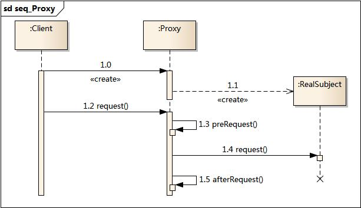

**优点**

- 代理模式能够协调调用者和被调用者，在一定程度上降低了系 统的耦合度。
- 远程代理使得客户端可以访问在远程机器上的对象，远程机器 可能具有更好的计算性能与处理速度，可以快速响应并处理客户端请求。
- 虚拟代理通过使用一个小对象来代表一个大对象，可以减少系 统资源的消耗，对系统进行优化并提高运行速度。
- 保护代理可以控制对真实对象的使用权限。

**缺点**

- 由于在客户端和真实主题之间增加了代理对象，因此 有些类型的代理模式可能会造成请求的处理速度变慢。
- 实现代理模式需要额外的工作，有些代理模式的实现 非常复杂。

**总结**

- 代理模式包含三个角色：抽象主题角色声明了真实主题和代理主题的共同接口；代理主题角色内部包含对真实主题的引用，从而可以在任何时候操作真实主题对象；真实主题角色定义了代理角色所代表的真实对象，在真实主题角色中实现了真实的业务操作，客户端可以通过代理主题角色间接调用真实主题角色中定义的方法。
- 代理模式的优点在于能够协调调用者和被调用者，在一定程度上降低了系统的耦合度；其缺点在于由于在客户端和真实主题之间增加了代理对象，因此有些类型的代理模式可能会造成请求的处理速度变慢，并且实现代理模式需要额外的工作，有些代理模式的实现非常复杂。远程代理为一个位于不同的地址空间的对象提供一个本地的代表对象，它使得客户端可以访问在远程机器上的对象，远程机器可能具有更好的计算性能与处理速度，可以快速响应并处理客户端请求。
- 如果需要创建一个资源消耗较大的对象，先创建一个消耗相对较小的对象来表示，真实对象只在需要时才会被真正创建，这个小对象称为虚拟代理。虚拟代理通过使用一个小对象来代表一个大对象，可以减少系统资源的消耗，对系统进行优化并提高运行速度。
- 保护代理可以控制对一个对象的访问，可以给不同的用户提供不同级别的使用权限。

## 行为型模式

行为型模式是对在不同的对象之间划分职责和算法的抽象化

行为型模式不仅仅关注类和对象的结构，而且重点关注它们之间的相互作用

通过行为型模式，可以更加清晰地划分类与对象的职责，并研究系统在运行时实例对象之间的交互。在系统运行时，对象并不是孤立的，它们可以通过相互通信与协作完成某些复杂功能，一个对象在运行时也将影响到其他对象的运行

行为型模式分为类行为型模式和对象行为型喔屎两种：

- 类行为型模式：类的行为型模式适用继承关系在几个类之间分配行为，类行为型模式主要通过多态等方式来分配父类与子类的职责
- 对象行为型模式：对象的行为型模式则使用对象的聚合关联关系来分配行为，对象行为型模式主要通过对象关联等方式来分配两个或多个类的职责。根据“合成复用原则”，系统中要尽量使用关联关系来取代继承关系，因此大部分行为型设计模式都属于对象行为型设计模式

### 命令模式

**模式动机**

在软件设计中，我们经常需要向某些对象发送请求，但是并不知道请求的接收者是谁，也不知道被请求的操作是哪个，我们只需在程序运行时指定具体的请求接收者即可，此时，可是使用命令模式来进行设计，使得请求发送者与请求接收者消除彼此之间的耦合，让对象之间的调用关系更加灵活

民力模式可以对发送者和接收者完全解耦，发送者与接收者之间没有直接应用关系，发送请求的对象只需要知道如何发送请求，而不必知道如何完成请求。这就是命令模式的模式动机

**模式定义**

命令模式：将一个请求封装成一个对象，从而使我们可以用不同的请求对客户进行参数化，对请求排队或者记录请求日志，以及支持可撤销的操作。命令模式是一种对象行为型模式

**模式结构**

角色：

- 抽象命令类
- 具体命令类
- 调用者
- 接收者
- 客户类

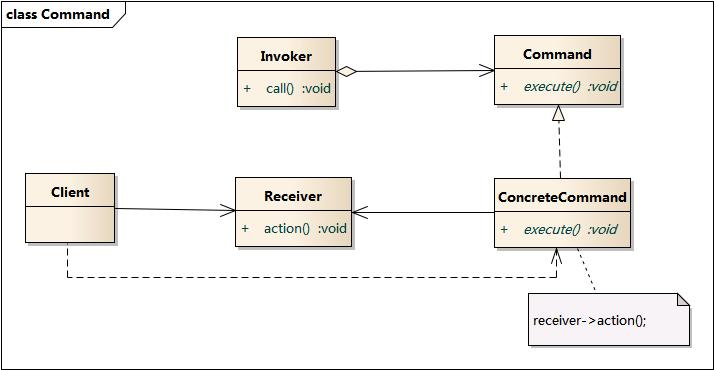


**模式分析**

命令模式的本质是对命令进行封装，将发出命令的责任和执行命令的责任分隔开

- 每一个命令都是一个请求：请求的一方发出请求，要求执行一个操作；接收的一方收到请求，并执行操作
- 命令模式允许请求的一方和接收的一方独立开来，使得请求的一方不必知道接收请求的一方的接口，更不必知道请求是怎么被接收，以及操作是否被执行、何时被执行，以及是怎么被执行的
- 命令模式使请求本身成为一个对象，这个对象和其他对象一样可以被存储和传递
- 命令模式的关键在于引入了抽象命令接口，且发送者针对抽象命令接口编程，只有实现了抽象命令接口的具体命令才能与接收者相关联

**实例**

实例一：电视机遥控器

- 电视机是请求的接收者，遥控器是请求的发送者，遥控器上有一些按钮，不同的按钮对应电视机的不同操作。抽象命令角色由一个命令接口来扮演，有三个具体的命令类实现了抽象命令接口，这三个具体命令类分别代表三种操作：打开电视机、关闭电视机和切换频道。显然，电视机遥控器就是一个典型的命令模式应用实例。

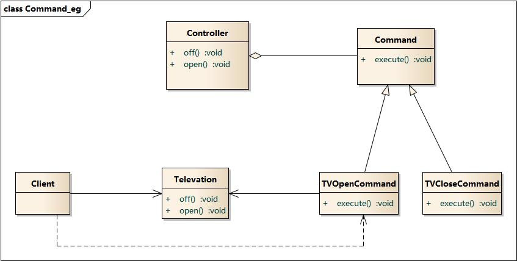

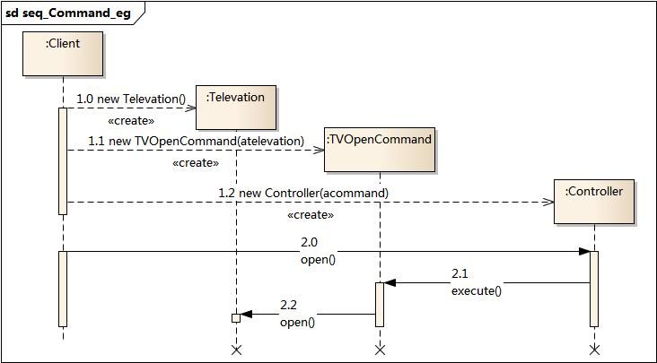

**优点**

- 降低系统的耦合度
- 新的命令可以很容易地加入到系统中
- 可以比较容易地设计一个命令队列和宏命令
- 可以方便地实现对请求的Undo 和 Redo

**缺点**

- 使用命令模式可能会导致某些系统有过多的具体命令类。因为针对每一个命令都需要设计一个具体命令类，因此某些系统可能需要大量具体命令类，这将影响命令模式的使用。

**适用环境**

- 系统需要将请求调用者和请求接收者解耦，使得调用者和接收者不直接交互
- 系统需要在不同的时间指定请求、将请求排队和执行请求
- 系统需要支持命令的撤销（Undo）操作和恢复（Redo）操作
- 系统需要将一组操作组合在一起，即支持宏命令

**总结**

- 在命令模式中，将一个请求封装为一个对象，从而使我们可用不同的请求对客户进行参数化；对请求排队或者记录请求日志，以及支持可撤销的操作。命令模式是一种对象行为型模式，其别名为动作模式或事务模式。
- 命令模式包含四个角色：抽象命令类中声明了用于执行请求的execute()等方法，通过这些方法可以调用请求接收者的相关操作；具体命令类是抽象命令类的子类，实现了在抽象命令类中声明的方法，它对应具体的接收者对象，将接收者对象的动作绑定其中；调用者即请求的发送者，又称为请求者，它通过命令对象来执行请求；接收者执行与请求相关的操作，它具体实现对请求的业务处理。
- 命令模式的本质是对命令进行封装，将发出命令的责任和执行命令的责任分割开。命令模式使请求本身成为一个对象，这个对象和其他对象一样可以被存储和传递。
- 命令模式的主要优点在于降低系统的耦合度，增加新的命令很方便，而且可以比较容易地设计一个命令队列和宏命令，并方便地实现对请求的撤销和恢复；其主要缺点在于可能会导致某些系统有过多的具体命令类。
- 命令模式适用情况包括：需要将请求调用者和请求接收者解耦，使得调用者和接收者不直接交互；需要在不同的时间指定请求、将请求排队和执行请求；需要支持命令的撤销操作和恢复操作，需要将一组操作组合在一起，即支持宏命令。

### 中介者模式

**模式动机**

在用户与用户之间直接聊天的设计方案中，用户对象之间存在很强的关联性，将导致系统出现如下问题：

- 系统结构复杂：对象之间存在大量的相互关联和调用，若有一个对象发生变化，则需要跟踪和该对象关联的其他所有对象，并进行适当处理
- 对象可重用性差：由于一个对象和其他对象具有很强的关联，若没有其他对象的支持，一个对象很难被另一个系统或模块重用，这些对象表现出来更像一个不可分割的整体，职责较为混乱
- 系统扩展性差：增加一个新的对象需要在原有相关对象上增加引用，增加新的引用关系也需要调整原有对象，系统耦合度高，对象操作很不灵活，扩展性差
- 在面向对象的软件设计与开发过程中，根据“单一职责原则”，我们应该尽量将对象细化，使其只负责或呈现单一的职责

对于一个模块，可能由很多对象构成，而且这些对象之间可能存在相互的引用，为了减少对象两两之间复杂的引用关系，使之成为一个松耦合的系统，我们需要使用中介者模式，这就是中介者模式的模式动机

**模式定义**

中介者模式定义：用一个中介对象来封装一系列的对象交互，中介者使个对象不需要显式地相互调用，从而使其耦合松散，而且可以独立地改变它们之间的交互，中介者模式又称为调停者模式

**模式结构**

角色：

- 抽象中介者
- 具体中介者
- 抽象同事类
- 具体同事类


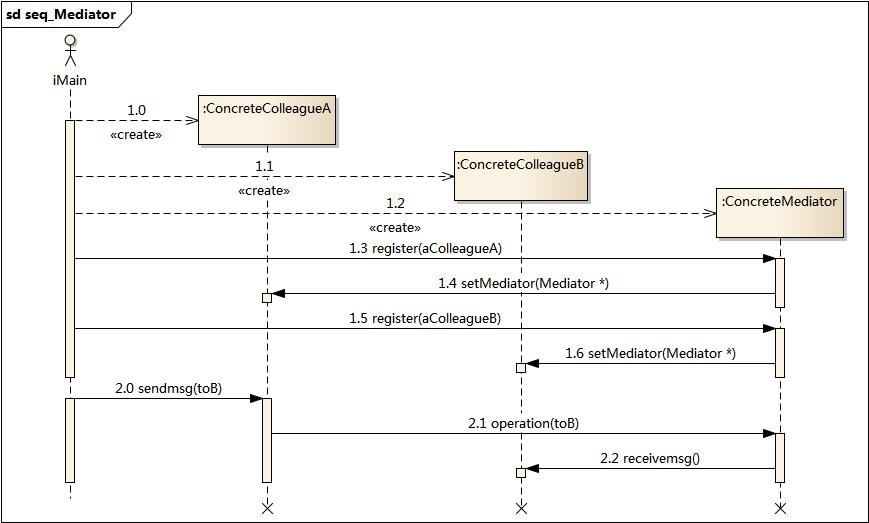

**模式分析**

中介者模式可以使对象之间的关系数量急剧减少，中介者承担两方面的职责：

- 中转作用（结构性）：通过中介者提供的中转作用，各个同事对象就不再显式引用其他同事，当需要和其他同事进行通信时，通过中介者即可。该中转作用属于中介者在结构性上的支持
- 协调作用（行为性）：中介者可以更进一步的对同事之间的关系进行封装，同事可以一致地和中介者进行交互，而不需要指明中介者需要具体怎么做，中介者根据封装在自身内部的协调逻辑，对同事的请求进行进一步处理，将同事成员之间的关系行为进行分离和封装，该协调作用属于中介者在行为上的支持

**优点**

- 简化了对象之间的交互
- 将各同事解耦
- 减少子类生成
- 可以简化各同事类的设计和实现

**缺点**

- 在具体中介者类中包含了同事之间的交互细节，可能会导致具体中介者类非常复杂，使得系统难以维护。

**适用环境**

- 系统中对象之间存在复杂的引用关系，产生的相互依赖关系结构混乱且难以理解。
- 一个对象由于引用了其他很多对象并且直接和这些对象通信，导致难以复用该对象。
- 想通过一个中间类来封装多个类中的行为，而又不想生成太多的子类。可以通过引入中介者类来实现，在中介者中定义对象。
- 交互的公共行为，如果需要改变行为则可以增加新的中介者类。

**总结**

- 中介者模式用一个中介对象来封装一系列的对象交互，中介者使各对象不需要显式地相互引用，从而使其耦合松散，而且可以独立地改变它们之间的交互。中介者模式又称为调停者模式，它是一种对象行为型模式。
- 中介者模式包含四个角色：抽象中介者用于定义一个接口，该接口用于与各同事对象之间的通信；具体中介者是抽象中介者的子类，通过协调各个同事对象来实现协作行为，了解并维护它的各个同事对象的引用；抽象同事类定义各同事的公有方法；具体同事类是抽象同事类的子类，每一个同事对象都引用一个中介者对象；每一个同事对象在需要和其他同事对象通信时，先与中介者通信，通过中介者来间接完成与其他同事类的通信；在具体同事类中实现了在抽象同事类中定义的方法。
- 通过引入中介者对象，可以将系统的网状结构变成以中介者为中心的星形结构，中介者承担了中转作用和协调作用。中介者类是中介者模式的核心，它对整个系统进行控制和协调，简化了对象之间的交互，还可以对对象间的交互进行进一步的控制。
- 中介者模式的主要优点在于简化了对象之间的交互，将各同事解耦，还可以减少子类生成，对于复杂的对象之间的交互，通过引入中介者，可以简化各同事类的设计和实现；中介者模式主要缺点在于具体中介者类中包含了同事之间的交互细节，可能会导致具体中介者类非常复杂，使得系统难以维护。
- 中介者模式适用情况包括：系统中对象之间存在复杂的引用关系，产生的相互依赖关系结构混乱且难以理解；一个对象由于引用了其他很多对象并且直接和这些对象通信，导致难以复用该对象；想通过一个中间类来封装多个类中的行为，而又不想生成太多的子类。

### 观察者模式

**模式动机**

建立一种对象与对象之间的依赖关系，一个对象发生改变时将自动通知其他对象，其他对象将相应做出反应。再次，发生改变的对象称为观察目标，而被通知的对象称为观察者，一个观察目标可以对应多个观察者，而且这些观察者之间没有相互关联，可以管局需要增加和删除观察者，使得系统更易于扩展，这就是观察者模式的模式动机

**模式定义**

观察者模式：定义对象间的一种一对多依赖关系，使得每当一个对象状态发生改变时，其相关依赖对象皆得到通知并被自动更新。观察者模式又叫做发布-订阅模式、模型-视图模式、源-监听器模式或从属者模式

**模式结构**

角色：

- 目标
- 具体目标
- 观察者
- 具体观察者


**模式分析**

- 观察者模式描述了如何建立对象与对象之间的依赖关系，如何构造满足这种需求的系统
- 这一模式中的关键对象是观察目标和观察者，一个目标可以有任意数目与之相依赖的观察者，一旦目标的状态发生改变，所有的观察者豆浆得到通知
- 作为这个通知的响应，每个观察者都将即时更新自己的状态，以与目标状态同步，这种交互也称为发布-订阅。目标是通知的发布者，它发出通知时并不需要知道谁是它的观察者，可以有任意数目的观察者订阅它并接收通知

**优点**

- 观察者模式可以实现表示层和数据逻辑层的分离，并定义了稳定的消息更新传递机制，抽象了更新接口，使得可以有各种各样不同的表示层作为具体观察者角色。
- 观察者模式在观察目标和观察者之间建立一个抽象的耦合。
- 观察者模式支持广播通信。
- 观察者模式符合“开闭原则”的要求。

**缺点**

- 如果一个观察目标对象有很多直接和间接的观察者的话，将所有的观察者都通知到会花费很多时间。
- 如果在观察者和观察目标之间有循环依赖的话，观察目标会触发它们之间进行循环调用，可能导致系统崩溃。
- 观察者模式没有相应的机制让观察者知道所观察的目标对象是怎么发生变化的，而仅仅只是知道观察目标发生了变化。

**适用环境**

- 一个抽象模型有两个方面，其中一个方面依赖于另一个方面。将这些方面封装在独立的对象中使它们可以各自独立地改变和复用。
- 一个对象的改变将导致其他一个或多个对象也发生改变，而不知道具体有多少对象将发生改变，可以降低对象之间的耦合度。
- 一个对象必须通知其他对象，而并不知道这些对象是谁。
- 需要在系统中创建一个触发链，A对象的行为将影响B对象，B对象的行为将影响C对象……，可以使用观察者模式创建一种链式触发机制。

**模式扩展**

MVC模式

- MVC模式是一种架构模式，它包含三个角色：模型(Model)，视图(View)和控制器(Controller)。观察者模式可以用来实现MVC模式，观察者模式中的观察目标就是MVC模式中的模型(Model)，而观察者就是MVC中的视图(View)，控制器(Controller)充当两者之间的中介者(Mediator)。当模型层的数据发生改变时，视图层将自动改变其显示内容。

**总结**

- 观察者模式定义对象间的一种一对多依赖关系，使得每当一个对象状态发生改变时，其相关依赖对象皆得到通知并被自动更新。观察者模式又叫做发布-订阅模式、模型-视图模式、源-监听器模式或从属者模式。观察者模式是一种对象行为型模式。
- 观察者模式包含四个角色：目标又称为主题，它是指被观察的对象；具体目标是目标类的子类，通常它包含有经常发生改变的数据，当它的状态发生改变时，向它的各个观察者发出通知；观察者将对观察目标的改变做出反应；在具体观察者中维护一个指向具体目标对象的引用，它存储具体观察者的有关状态，这些状态需要和具体目标的状态保持一致。
- 观察者模式定义了一种一对多的依赖关系，让多个观察者对象同时监听某一个目标对象，当这个目标对象的状态发生变化时，会通知所有观察者对象，使它们能够自动更新。
- 观察者模式的主要优点在于可以实现表示层和数据逻辑层的分离，并在观察目标和观察者之间建立一个抽象的耦合，支持广播通信；其主要缺点在于如果一个观察目标对象有很多直接和间接的观察者的话，将所有的观察者都通知到会花费很多时间，而且如果在观察者和观察目标之间有循环依赖的话，观察目标会触发它们之间进行循环调用，可能导致系统崩溃。
- 观察者模式适用情况包括：一个抽象模型有两个方面，其中一个方面依赖于另一个方面；一个对象的改变将导致其他一个或多个对象也发生改变，而不知道具体有多少对象将发生改变；一个对象必须通知其他对象，而并不知道这些对象是谁；需要在系统中创建一个触发链。
- 在JDK的java.util包中，提供了Observable类以及Observer接口，它们构成了Java语言对观察者模式的支持。

### 状态模式

**模式动机**

- 在很多情况下，一个对象的行为取决于一个或多个动态变化的属性，这些的属性叫做状态，这样的对象叫做有状态的对象，这些的对象状态是从事先定义好的一系列值中取出的。当一个这样的对象与外部事件产生互动时，其内部状态就会改变，从而使得系统的行为也随之发生变化
- 在 UML 中可以使用状态图来描述对象状态的变化

**模式定义**

状态模式：允许一个对象在其内部状态改变时改变它的行为，对象看起来似乎修改了它的类，其别名为状态对象，状态模式是一种对象行为模式

**模式结构**

角色：

- 环境类
- 抽象状态类
- 具体状态类


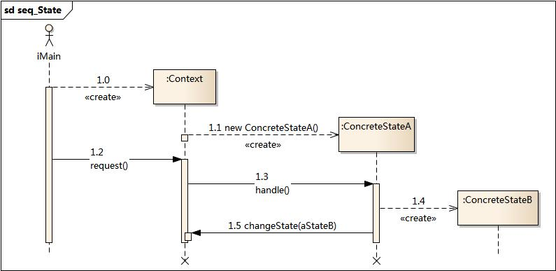

**模式分析**

- 状态模式描述了对象状态的变化以及对象如何在每一种状态下表现出不同的行为。
- 状态模式的关键是引入了一个抽象类来专门表示对象的状态，这个类我们叫做抽象状态类，而对象的每一种具体状态类都继承了该类，并在不同具体状态类中实现了不同状态的行为，包括各种状态之间的转换。

在状态模式结构中需要理解环境类与抽象状态类的作用：

- 环境类实际上就是拥有状态的对象，环境类有时候可以充当状态管理器(State Manager)的角色，可以在环境类中对状态进行切换操作。
- 抽象状态类可以是抽象类，也可以是接口，不同状态类就是继承这个父类的不同子类，状态类的产生是由于环境类存在多个状态，同时还满足两个条件： 这些状态经常需要切换，在不同的状态下对象的行为不同。因此可以将不同对象下的行为单独提取出来封装在具体的状态类中，使得环境类对象在其内部状态改变时可以改变它的行为，对象看起来似乎修改了它的类，而实际上是由于切换到不同的具体状态类实现的。由于环境类可以设置为任一具体状态类，因此它针对抽象状态类进行编程，在程序运行时可以将任一具体状态类的对象设置到环境类中，从而使得环境类可以改变内部状态，并且改变行为。

**实例**


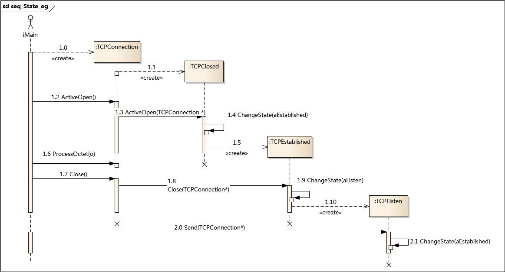

**优点**

- 封装了转换规则。
- 枚举可能的状态，在枚举状态之前需要确定状态种类。
- 将所有与某个状态有关的行为放到一个类中，并且可以方便地增加新的状态，只需要改变对象状态即可改变对象的行为。
- 允许状态转换逻辑与状态对象合成一体，而不是某一个巨大的条件语句块。
- 可以让多个环境对象共享一个状态对象，从而减少系统中对象的个数。

**缺点**

- 状态模式的使用必然会增加系统类和对象的个数。
- 状态模式的结构与实现都较为复杂，如果使用不当将导致程序结构和代码的混乱。
- 状态模式对“开闭原则”的支持并不太好，对于可以切换状态的状态模式，增加新的状态类需要修改那些负责状态转换的源代码，否则无法切换到新增状态；而且修改某个状态类的行为也需修改对应类的源代码。

**总结**

- 状态模式允许一个对象在其内部状态改变时改变它的行为，对象看起来似乎修改了它的类。其别名为状态对象，状态模式是一种对象行为型模式。
- 状态模式包含三个角色：环境类又称为上下文类，它是拥有状态的对象，在环境类中维护一个抽象状态类State的实例，这个实例定义当前状态，在具体实现时，它是一个State子类的对象，可以定义初始状态；抽象状态类用于定义一个接口以封装与环境类的一个特定状态相关的行为；具体状态类是抽象状态类的子类，每一个子类实现一个与环境类的一个状态相关的行为，每一个具体状态类对应环境的一个具体状态，不同的具体状态类其行为有所不同。
- 状态模式描述了对象状态的变化以及对象如何在每一种状态下表现出不同的行为。
- 状态模式的主要优点在于封装了转换规则，并枚举可能的状态，它将所有与某个状态有关的行为放到一个类中，并且可以方便地增加新的状态，只需要改变对象状态即可改变对象的行为，还可以让多个环境对象共享一个状态对象，从而减少系统中对象的个数；其缺点在于使用状态模式会增加系统类和对象的个数，且状态模式的结构与实现都较为复杂，如果使用不当将导致程序结构和代码的混乱，对于可以切换状态的状态模式不满足“开闭原则”的要求。
- 状态模式适用情况包括：对象的行为依赖于它的状态（属性）并且可以根据它的状态改变而改变它的相关行为；代码中包含大量与对象状态有关的条件语句，这些条件语句的出现，会导致代码的可维护性和灵活性变差，不能方便地增加和删除状态，使客户类与类库之间的耦合增强。

### 策略模式

**模式动机**

- 完成一项任务，往往可以有多种不同的方式，每一种方式称为一个策略，我们可以根据环境或者条件的不同选择不同的策略来完成该项任务。
- 在软件开发中也常常遇到类似的情况，实现某一个功能有多个途径，此时可以使用一种设计模式来使得系统可以灵活地选择解决途径，也能够方便地增加新的解决途径。
- 在软件系统中，有许多算法可以实现某一功能，如查找、排序等，一种常用的方法是硬编码(Hard Coding)在一个类中，如需要提供多种查找算法，可以将这些算法写到一个类中，在该类中提供多个方法，每一个方法对应一个具体的查找算法；当然也可以将这些查找算法封装在一个统一的方法中，通过if…else…等条件判断语句来进行选择。这两种实现方法我们都可以称之为硬编码，如果需要增加一种新的查找算法，需要修改封装算法类的源代码；更换查找算法，也需要修改客户端调用代码。在这个算法类中封装了大量查找算法，该类代码将较复杂，维护较为困难。
- 除了提供专门的查找算法类之外，还可以在客户端程序中直接包含算法代码，这种做法更不可取，将导致客户端程序庞大而且难以维护，如果存在大量可供选择的算法时问题将变得更加严重。
- 为了解决这些问题，可以定义一些独立的类来封装不同的算法，每一个类封装一个具体的算法，在这里，每一个封装算法的类我们都可以称之为策略(Strategy)，为了保证这些策略的一致性，一般会用一个抽象的策略类来做算法的定义，而具体每种算法则对应于一个具体策略类。

**模式定义**

策略模式：定义一系列算法，将每一个算法封装起来，并让它们可以相互替换。策略模式让算法独立于使用它的客户而变化，也称为政策模式

**模式结构**

角色：

- 环境类
- 抽象策略类
- 具体策略类


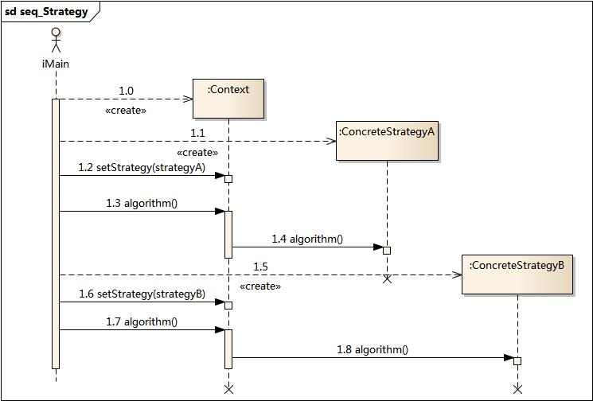

**模式分析**

- 策略模式是一个比较容易理解和使用的设计模式，策略模式是对算法的封装，它把算法的责任和算法本身分割开，委派给不同的对象管理。策略模式通常把一个系列的算法封装到一系列的策略类里面，作为一个抽象策略类的子类。用一句话来说，就是“准备一组算法，并将每一个算法封装起来，使得它们可以互换”。
- 在策略模式中，应当由客户端自己决定在什么情况下使用什么具体策略角色。
- 策略模式仅仅封装算法，提供新算法插入到已有系统中，以及老算法从系统中“退休”的方便，策略模式并不决定在何时使用何种算法，算法的选择由客户端来决定。这在一定程度上提高了系统的灵活性，但是客户端需要理解所有具体策略类之间的区别，以便选择合适的算法，这也是策略模式的缺点之一，在一定程度上增加了客户端的使用难度。

**优点**

- 策略模式提供了对“开闭原则”的完美支持，用户可以在不修改原有系统的基础上选择算法或行为，也可以灵活地增加新的算法或行为。
- 策略模式提供了管理相关的算法族的办法。
- 策略模式提供了可以替换继承关系的办法。
- 使用策略模式可以避免使用多重条件转移语句。

**缺点**

- 客户端必须知道所有的策略类，并自行决定使用哪一个策略类。
- 策略模式将造成产生很多策略类，可以通过使用享元模式在一定程度上减少对象的数量。

**总结**

- 在策略模式中定义了一系列算法，将每一个算法封装起来，并让它们可以相互替换。策略模式让算法独立于使用它的客户而变化，也称为政策模式。策略模式是一种对象行为型模式。
- 策略模式包含三个角色：环境类在解决某个问题时可以采用多种策略，在环境类中维护一个对抽象策略类的引用实例；抽象策略类为所支持的算法声明了抽象方法，是所有策略类的父类；具体策略类实现了在抽象策略类中定义的算法。
- 策略模式是对算法的封装，它把算法的责任和算法本身分割开，委派给不同的对象管理。策略模式通常把一个系列的算法封装到一系列的策略类里面，作为一个抽象策略类的子类。
- 策略模式主要优点在于对“开闭原则”的完美支持，在不修改原有系统的基础上可以更换算法或者增加新的算法，它很好地管理算法族，提高了代码的复用性，是一种替换继承，避免多重条件转移语句的实现方式；其缺点在于客户端必须知道所有的策略类，并理解其区别，同时在一定程度上增加了系统中类的个数，可能会存在很多策略类。
- 策略模式适用情况包括：在一个系统里面有许多类，它们之间的区别仅在于它们的行为，使用策略模式可以动态地让一个对象在许多行为中选择一种行为；一个系统需要动态地在几种算法中选择一种；避免使用难以维护的多重条件选择语句；希望在具体策略类中封装算法和与相关的数据结构。

