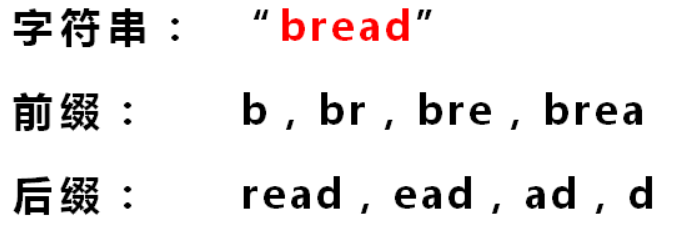

# 递归的理解

## 递归的概念

什么是递归?

> 是指在[函数](https://zh.wikipedia.org/wiki/函数)的定义中使用函数自身的方法。
>
> 在[数学](https://zh.wikipedia.org/wiki/数学)和计算机科学中，递归指由一种（或多种）简单的基本情况定义的一类对象或方法，并规定其他所有情况都能被还原为其基本情况。

Google递归的时候，是不是突然懂了什么:smiley:



<div align='center'>Google 递归</div>

简单地说，就是如果在函数中存在着调用函数本身的情况，这种现象就叫递归。

以阶乘函数为例,如下, 在 factorial 函数中存在着 factorial(n – 1) 的调用，所以此函数是递归函数：

``` c
int factorial(int n){		//阶乘
	if(n<2)		//结束条件
        return 1;
     return n * factorial(n - 1);		//怎么调用本身的
}
```

进一步剖析「递归」，先有「递」再有「归」，「递」的意思是将问题拆解成子问题来解决， 子问题再拆解成子子问题，…，直到被拆解的子问题无需再拆分成更细的子问题（即可以求解），「归」是说最小的子问题解决了，那么它的上一层子问题也就解决了，上一层的子问题解决了，上上层子问题自然也就解决了,….,直到最开始的问题解决,文字说可能有点抽象。

## 写递归的步骤

我们在上一节仔细剖析了什么是递归，可以发现递归有以下两个特点

```c
int sum = 0;
for(int i = 0; i < 100; ++i){
    sum += i;
}
int sum(i) {
    if(i>100) return 0;
    return i + sum(i+1);
}
```

1. 一个问题可以分解成具有**相同解决思路**的子问题，子子问题，换句话说这些问题都**能调用同一个函数**      从 F(n)   F(n-1)   ···   F(1)   都能调用同一个函数
2. 经过层层分解的子问题最后一定是有一个不能再分解的固定值的（即终止条件）,如果没有的话,就无穷无尽地分解子问题了，问题显然是无解的。     有终止条件

所以解递归题的关键在于我们首先需要根据以上递归的两个特点判断题目是否可以用递归来解。

步骤：

1. 确定递归函数的功能		参数，返回值
2. 确定递归的结束条件        需要注意一下
3. 确定F(n)与F(n-1)、F(n-2)等等之间的关系，        或者是可以说：寻找问题与子问题间的关系（即**递推公式**），这样由于问题与子问题具有**相同解决思路**，只要子问题调用步骤 1 定义好的函数，问题即可解决。所谓的关系最好能用一个公式表示出来，比如 **f(n) = n \* f(n-1)** 这样           它可能是   F(n)   与   F(n-1)有关系，也可能是   F(n)  与  F(n-2)   有关系，也可能是  F(n)   与  F(n-1)、F(n-2)等等  都有关系

## 开始练题（从初级到高级

### 阶乘

输入一个正整数n，输出n!的值。其中n!=1*2*3*…*n,即求阶乘

1. 确定递归函数的功能 

   ```c
   int function(int n);			//传入参数n，求n!
   ```

   

2. 确定递归的结束条件

   ```c
   //第一种结束条件
   if(n==1)
       return n;
   //第二种结束条件
   if(n<=2)
       return n;
   //显然第二种结束条件比第一种要好，有些时候结束条件有误，会陷入死循环或者结果错误
   ```

   

3. 确定F(n) = n! 与F(n-1) = (n-1)!、F(n-2)等等之间的关系

   F(n) = n *  F(n-1);
   
   ```c
   //显然这里的关系是F(n)与F(n-1)之间有关系
   	return n*function(n-1);
   ```

三步走完，基本就可以写出递归的函数了

这里我们已经对阶乘尝试了一种递归的写法，我们来看看循环是什么样的，比较一下两种写法：

```c
//递归写法
int function1(int n){			//传入参数n，求n!
    if(n<=2)		//结束条件
    	return n;
    return n*f(n-1);		//确定关系
}
//循环写法
int function2(int n){
    int sum = 1;
    for(int i=2;i<=n;++i)
        sum *= i;
    return sum;
}
```

递归逻辑很清楚，它寻找的是与F(n-1)、F(n-2)等等之间的关系，循环（迭代）是每一次做同样的一个步骤。在电脑运行过程种，递归都会创建一个类似于栈的东西。

入栈，不断缩小参数范围，直到结束条件			出栈，得到比自己参数大的函数的值

### 斐波拉契

*1 1 2 3 5 ··· n*

1. 确定递归函数的功能

``` c
int function1(int n);        //求第n个的fib数是多少
```

2. 结束条件

``` c
if(n==1||n==2)          //结束条件
        return 1;
```

3. 确定F(n)与F(n-1)、F(n-2)等等之间的关系

``` c
function1(n) = function1(n-1)+function1(n-2);
```

故递归写法为：

``` c
int function1(int n)        //求第n个的fib数是多少
{
    if(n==1||n==2)          //结束条件
        return 1;
    return function1(n-1)+function1(n-2);     //函数关系
}
```

### 台阶问题

一只青蛙可以一次跳 1 级台阶或一次跳 2 级台阶,例如:跳上第 1 级台阶只有一种跳法：直接跳 1 级即可。跳上第 2 级台阶有两种跳法：每次跳 1 级，跳两次；或者一次跳 2 级。问要跳上第 n 级台阶有多少种跳法？

找关系： n 级别台阶     func(n-1)   +  func (n-2)  

1. 确定递归函数的功能

``` c
int function(int n);		//n个台阶，求种类
```

2. 确定结束条件

``` c
if (n == 1) return1;		//一级台阶的情况
if (n == 2) return2;		//二级台阶的情况
```

3. 确定F(n)与F(n-1)、F(n-2)等等之间的关系

寻找问题与子问题之前的关系 这两者之前的关系初看确实看不出什么头绪，但仔细看题目，一只青蛙只能跳一步或两步台阶，**自上而下地思考**，也就是说如果要跳到 n 级台阶只能从 从 n-1 或 n-2 级跳， 所以问题就转化为跳上 n-1 和 n-2 级台阶的跳法了，如果 f(n) 代表跳到 n 级台阶的跳法，那么从以上分析可得 f(n) = f(n-1) + f(n-2),显然这就是我们要找的问题与子问题的关系,而显然当 n = 1, n = 2， 即跳一二级台阶是问题的最终解，于是递推公式系为

``` c
f(n) = f(n-1) + f(n-2);
```

三步走完，我们就可以写出递归函数了

``` c
int f(int n) {
    if (n == 1) return 1;
    if (n == 2) return 2;
    return f(n-1) + f(n-2);
}
```

### 二叉树的深度

```c
int func(node* root) {
    if(!root) return;
    return func(root-left) > func(root-right)? func(root->left) + 1: func(root-right) + 1;
}
```

```c 
typedef struct node{		//数结点存储结构
	char data;
    struct node* lchild,*rchild;
}node;
```

1. 确定递归函数的功能

``` c
int function(node* root);		//传进一个二叉树，返回其深度
```

2. 确定结束条件

``` c
if(!root)
    return 0;
```

3. 确定F(n)与F(n-1)、F(n-2)等等之间的关系

因为这是一颗二叉树，没有F(N)，但是有F(root)    ，我们这时候就应该判断  F(root)   与

F(root->lchild)   和  F(root->rchild) 之间的关系，显然其关系是根的深度等于左右子树的最大深度加一

F(root)    =    MAX(F(root->lchild)  , F(root->rchild) )   + 1;

``` c
F(root) = MAX(F(root->lchild), F(root->rchild)) + 1;
```

故函数可以写为：

``` c
int function(node* root){
    if(!root)
        return;
    int left = function(root->lchild);
    int right = function(root->rchild);
    return left>right?left:right + 1;
}
```

### 反转二叉树

反转二叉树 将左边的二叉树反转成右边的二叉树

- 反转1

```c
void func(node* root) {
    if(!root) return;		// 结束条件
    int temp = root->left->data;
    root-left->data = root->right->data;
    root->right->data = temp;
    func(root-left);
    func(root->right);
}
```

- 反转2

1. 确定递归函数的功能

``` c
node* function(node* root);		//传进一棵二叉树，反转二叉树
```

2. 确定结束条件

``` c
if(!root)
    return root;
```

3. 确定F(n)与F(n-1)、F(n-2)等等之间的关系

因为这是一颗二叉树，没有F(N)，但是有F(root)    ，我们这时候就应该判断  F(root)   与

F(root->lchild)   和  F(root->rchild) 之间的关系 ，显然其关系是左子树和右子树先进行翻转，翻转过后在将左右子树交换

``` c
node* left = function(root->lchild);
node* right = funciton(root->rchild);
root->lchild = right;
root->rchild = left;
```

故函数可写为：

``` c
node* function(node* root){		//传进一棵二叉树，反转二叉树
    if(!root)
    	return root;
    root->lchild = function(root->rchild);
    root->rchild = function(root->lchild);
}
```


### 汉诺塔问题

如下图所示，从左到右有A、B、C三根柱子，其中A柱子上面有从小叠到大的n个圆盘，现要求将A柱子上的圆盘移到C柱子上去，期间只有一个原则：一次只能移到一个盘子且大盘子不能在小盘子上面，求移动的步骤和移动的次数

关系： func(n-1, a, c, b);

​			printf("%c => %c", a, c);

​			func(n-1,b, a, c);

1. 确定函数功能

``` c
int count = 0;
int function(int n,char a,char b,char c)//汉诺塔，将n个盘子借助b从a移动到c
```

2. 确定结束条件

``` c
if(n==0)		//结束条件
    return 0;
```

3. 确定关系

``` c
function(n-1,a,c,b);
printf("%c移到%c\n",a,c);
++count;
function(n-1,b,a,c);
return count;
```

递归函数：

``` c
void function(int n,char a,char b,char c){  //汉诺塔，将n个盘子借助b从a移动到c
	if(n==0)		//结束条件
    	return 0;
    function(n-1,a,c,b);
	printf("%c移到%c\n",a,c);
	++count;
	function(n-1,b,a,c);
}
```

1. 确定递归函数的功能

   有三个柱子，我们要把三个柱子都要传进来，怎么代表柱子，三个字符  'A'    'B'	'C' 是不是就可以了，然后还有多少个盘子对不对，所以还有一个  n

``` c
void hanoid(int n, char a, char b, char c);		//汉诺塔
```

2. 确定结束条件

``` c
  if (n <= 0)		//没有盘子的情况
        return;
```

3. 确定F(n)与F(n-1)、F(n-2)等等之间的关系

F(n)的意思是*将 n 个圆盘从 a 经由 b 移动到 c* ，是不是过程是：1.先将 n-1 个圆盘从 a  经由 c 移动到 b  ，2. 再将 第 n 个圆盘从 a 移到   c     3.  再将 n-1个圆盘从 b 经由 a 移到  c

而移动的话就是输出一行语句就行了  

``` c
void move(char a, char b) {		//表示将a移动到b
    printf("%c->%cn", a, b);
}
```


``` c
void hanoid(int n, char a, char b, char c){		//汉诺塔
    if (n <= 0)		//没有盘子的情况
        return;
    // 将上面的  n-1 个圆盘经由 C 移到 B
    hanoid(n-1, a, c, b);
    // 此时将 A 底下的那块最大的圆盘移到 C
    move(a, c);
    // 再将 B 上的 n-1 个圆盘经由A移到 C上
    hanoid(n-1, b, a, c);
}
```

**从函数的功能**上看其实比较容易理解，整个函数定义的功能就是把 A 上的 n 个圆盘 经由 B 移到 C，由于定义好了这个函数的功能，那么接下来的把 n-1 个圆盘 经由 C 移到 B 就可以很自然的调用这个函数,所以**明确函数的功能非常重要**,按着函数的功能来解释，递归问题其实很好解析，**切忌在每一个子问题上层层展开死抠**,这样这就陷入了递归的陷阱，计算机都会栈溢出，何况人脑

### 树的个数

``` c
int sum(node* root){		//返回树的个数
	if(!root)			//结束
        return 0;
    return sum(root->lchild)+sum(root->rchild)+1;
}
```

### 树的深度

``` c
int depth(node* root){		//返回树的深度
 	if(!root)
        return 0;
    int left = depth(root->lchild);
    int right  = depth(root->rchild);
    return left>right?left:right + 1;
}
```

### 树的叶子节点的个数

``` c
int* count = (int*)malloc(sizeof(int));
*count = 0;
void function(node* root,int* count){		//计算叶节点的个数
	if(!root)
        return;
    if(root->lchild==null&&root->richild==null)
        ++(*count);
    function(root->lchild,count);
    function(root->rchild,count);
}

int count(node *root) {
    if(!root) return 0;
    if(root-left == null && root-right == null) return 1;
    return count(root->left) + count(root->right);
}
```

### 输出树

``` c
void function(node* root){		//输出树
	if(!root)
        return;
    printf("%c--",root->data);
    function(root->lchild);
    function(root->rchil);
}
```

## 总结

1，2 步注意一下，3步是难点，仔细的考虑其逻辑关系，不要死扣，一些比较复杂的递归题需要勤动手，画画图，观察规律，这样能帮助我们快速发现规律，得出递归公式，一旦知道了递归公式，将其转成递归代码就容易多了

编码就是多练，多想，最后解决问题。 考试就是熟能生巧的事了