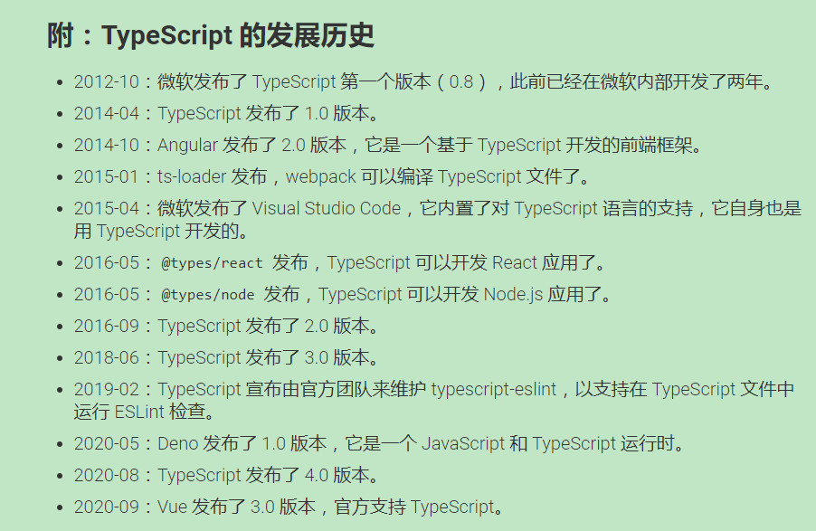

# TypeScript 

利用 TypeScript 刷了一些题了，了解了它的一些思想，感受到了 TypeScript 的好处了，想要好好的学一下 TypeScript 试试

## 1. TypeScript 入门教程

先找了一本在线的中文教程：[TypeScript 入门教程](https://ts.xcatliu.com/)

### 1.1 简介

**TypeScript 的特性**

TypeScript： Typed JavaScript at Any Scale，添加了类型系统的 JavaScript，适用于任何规模的应用

JavaScript 是一门非常灵活的编程语言：

- 它没有类型约束，一个变量可以变成各种类型
- 由于隐式类型转换的存在，有的变量的类型很难在运行前就确定
- 基于原型的面向对象编程，使得原型上的属性或方法可以在运行时被修改
- 函数是 JavaScript 的一等公民，可以赋值给变量，也可以当作参数或返回值

这种灵活性就像一把双刃剑，一方面使得 JavaScript 蓬勃发展，另一方面也使得它的代码质量参差不齐，维护成本高，运行时错误多，TypeScript 很大程度上弥补了 JavaScript 的缺点

TypeScript 是静态类型：动态类型是指在运行时才会进行类型检查，这种语言类型往往会导致运行时错误，静态类型是指编译阶段就能确定每个变量的类型，这种语言的类型错误往往会导致语法错误

大部分 JavaScript 代码都只需要经过少量的修改（或者直接不需要修改）就变成了 TypeScript 代码，这得益于 TypeScript 强大的类型推论，即使不去手动声明变量的类型，也能在变量初始化的时候自动推论出它的类型

类型系统按照是否允许隐式类型转换来分类，可以分为强类型和弱类型

TypeScript 最大的优势之一是增强了编辑器和 IDE 的功能，包括代码补全、接口提示、跳转到定义、重构等

TypeScript 编译的时候即使报错了，还是会生成编译结果



### 1.2 基础

**原始数据类型**

原始数据类型包括：boolean，number，string，null，undefin，Symbol，BigInt

JavaScript 没有空值（void）的概念，在 TypeScript 中，可以用 void 表示没有任何返回值的函数，声明一个 void 类型的变量没有什么用，因为你只能将它赋值为 undefin 和 null

与 void 的区别是，undefined 和 null 是所有类型的子类型，也就是说 undefined 类型的变量可以赋值给 number 类型的变量

**任意值**

任意值（Any）用来表示可以允许赋值为任意类型。如果是一个普通类型，在赋值过程中改变类型是不被允许的，但如果是 any 类型，则允许被赋值为任意类型，在任意值上范围任何属性都是允许的，也允许调用任何方法（但是这就和 JavaScript 一样了，容易运行时错误）

**类型推论**

如果没有明确的指定类型，那么 TypeScript 会按照类型推论（Type Inference）的规则推断出一个类型，如果定义的时候没有赋值，不管之后有没有赋值，都会被推断成 any 类型而完全不被类型检查

**联合类型**

联合类型（Union Types）表示取值可以为多种类型中的一种

```typescript
let num: sring | number;
num = '1';
num = 1
```

当 TypeScript 不确定一个联合类型的变量到底是哪个类型的时候，我们只能访问此联合类型的所有类型里共有的属性或方法

**对象的类型——接口**

在 TypeScript 中，我们适用接口（Interfaces）来定义对象的类型

在面向对象语言中，接口（Interfaces）是一个很重要的概念，它是对行为的抽象，而具体如何行动需要由类（classes）去实现（implement），而在 TypeScript 中，接口除了可用于对类的一部分行为进行抽象外，也常用于对对象的形状（shape）的描述，赋值的时候，变量的形状必须和接口的形状保持一致

```typescript
interface Food {
  vegetables: string,
  weight: number
}
let dinner: Food = {
  vegetables: 'noodles',
  weight: 20
}

interface Person {
  name: string,
  age ?: number
}
let wutian: Person = {
  name: 'wutian'
}
```

有时候我们希望一个接口可以允许有任意属性，可以使用下面的方式，但是一旦定义了任意属性，那么确定属性和可选属性的类型都必须是它的类型的子集，一个接口中只能定义一个任意类型，如果接口中有多个类型的属性，则可以在任意属性中使用联合类型

```typescript
interface Person {
  name: string;
  age ?: number;
  [propName: string]: any,
}
let wutian: Person = {
  name: 'wutian',
  gender: 'male'
}
```

**只读属性**

有时候我们希望对象的一些字段只能在创建的时候被赋值，那么就可以用 readonly 定义只读属性，只读的约束存在于第一次给对象赋值的时候，而不是第一次给只读属性赋值的时候

```typescript
interface Person{
  rea
}
```

**数组类型**

数组类型的定义方式比较灵活，一般采用类型加方括号表示法，也可以采用数组泛型来表示数组，接口也可以描述数组，但是一般不这样用，除非是类数组

```typescript
let temp1: number[] = [1, 2, 3];
let temp2: any[] = [1, '2', 3];
let temp3: Array<number> = [1, 2, 3];
interface IArguments {
  [index: number]: any;
  length: number;
  callee: Function;
}
```

**函数的类型**

在 JavaScript 中，有两种常见的函数定义的方式：函数声明和函数表达式。一个函数有输入和输出，要在 TypeScript 中对其进行约束，其中函数声明比较简单：

```typescript
function sum(a: number, b: number): number {
  return a + b;
}
```

函数表达式中如果需要显式的定义的话，需要手动给变量添加类型，不要把 TypeScript 中的 `=>` 和箭头函数中的 `=>` 搞混了

```typescript
let sum: (a: number, b: number) => number = function(a: number, b: number): number { return a + b; };
```

也可以用接口的方式来定义函数的形状：

```typescript
interface SearchFunc {
  (source: string, subString: string): boolean;
}
let mySearch: SearchFunc = function(source: string, subString: string) { return source.search(subString) !== -1; };
```

在 TypeScript 的函数定义中，可选参数必须在必需参数后面，TypeScript 会把添加量默认值的参数识别为可选参数（这时候就不受限制了）：

```typescript
function getName(firstName: string, lastName: string = 'Cat') {
  return firstName + ' ' + lastName;
}
```

ES6 中，可以使用 `…rest` 的方式获取函数中的剩余参数，事实上 rest 是一个数组，所以我们可以用数组的类型类定义它，rest 参数只能是最后一个参数：

```typescript
function push(array: any[], ...items: any[]) {
  items.forEach(item => {
    array.push(item);
  })
}
```

重载允许一个函数接收不同数量或类型的参数时，做出不同的处理，利用联合类型，我们也可以这么做：

```typescript
function reverse(x: number| string): number | string | void {
  if(typeof x === 'number') {
    return Number(x.toString().split('').reverse().join(''));
  } else if (typeof x === 'string') {
    return x.split('').reverse().join('');
  }
}
```

然而这样有一个缺点，就是不能够精确的表达，输入为数字的时候，输出也应该是数字，输入为字符串的时候，输出也应该是字符串：

```typescript
function reverse(x: number): number;
function reverse(x: string): string;
function reverse(x: number | string): number | string | void {
  if(typeof x === 'number') {
    return Number(x.toString().split('').reverse().join(''));
  } else if(typeof x === 'string') {
    return x.split('').reverse().join('');
  }
}
```

**类型断言**

类型断言的常见用途主要有以下几种：

- 将一个联合类型断言为其中一个（类型断言只能够欺骗 TypeScript 编译器，无法避免运行时错误，滥用很不好）
- 将一个父类断言为更加具体的子类（判断是不是某个接口的类型）
- 将任何一个类型断言为 any
- 将 any 断言为一个具体的类型
- 要使得 A 能够被断言成 B，只需要 A 兼容 B 或 B 兼容 A 即可（前四个是最后一个的特例）

一方面不能滥用 `as any`，另一方面也不要完全否定它的作用，我们需要在类型的严格性和开发的便利性之间掌握平衡（这也是 [TypeScript 的设计理念](https://github.com/Microsoft/TypeScript/wiki/TypeScript-Design-Goals)之一）

双重断言 `as any as` 除非迫不得已，千万别用双重断言，类型断言不是类型转换，在编译的过程中，类型断言会被删除

遇到 any 类型的变量时，我们可以选择无视它，任由它滋生更多的 any，也可以选择维护它，通过类型断言及时的把 any 断言为精确的类型

TypeScript 是结构类型系统，类型之间的对比只会比较它们最终的结构，而会忽略它们定义时的关系，编程中我们可以将子类的实例赋值给类型为父类的变量

要使得 A 能够断言为 B，只需要 A 兼容 B 或 B 兼容 A 即可，这也是为了在类型断言时的安全考虑，毕竟毫无根据的断言是非常危险的

类型断言和类型声明的区别在于：类型断言只要有一个兼容即可，而类型声明中父类的实例是不能赋值给子类的变量的，类型声明是比类型断言更加严格，所以为了增加代码的质量，我们最好优先使用类型声明，这也比类型断言的 as 语法更加优雅

```typescript
function getCacheData<T> (key: string): T {
  return (window as any).cache[key];
}
interface Cat {
  name: string;
  run(): void;
}
const tom = getCacheData<Cat>('tom');
```

通过给 getCacheData 函数添加一个泛型 <T>，我们可以更加规范的实现对 `getCacheData` 返回值的约束，这样也同时去掉了代码中的 any

**声明文件**

声明文件必需以 `.d.ts` 为后缀

declare var 并没有真的定义一个变量，只是定义了全局变量 jQuery 的类型，仅仅会用于编译时检查，在编译结果中会被删除

namespace 是 ts 早期为了解决模块化而创造的关键字，中文名叫命名空间，随着 ES6 的广泛应用，不建议再使用 TS 中的 namespace 了，推荐使用 ES6 的模块化方案了，但是 declare namespace 还在使用

暴露在最外层的 interface 或 type 会作为全局类型作用于整个项目，我们应该尽可能的减少全部变量或全局类型的数量，故最好将它们放到 namespace 下

**内置对象**

JavaScript 中有很多内置对象，它们可以直接在 TypeScript 中当作定义好了的类型

Node.js 不是内置对象的一部分，如果想用 TypeScript 写 Node.js 则需要引入第三方声明文件：`npm install @types/node –save-dev`

### 1.3 进阶

**类型别名**

类型别名用来给一个类型起个新名字

```typescript
type Name = string;
type NameResolver = () => string;
type NameOrResolver = Name | NameResolver;
function getName(n: NameOrResolver): Name {
  if (typeof n === 'string') {
    return n;
  } else {
    return n();
  }
}
```

**字符串字面量类型**

字符串字面量类型用来约束取值只能是某几个字符串中的一个

```typescript
type EventNames = 'click' | 'scroll' | 'mousemove';
function handleEvent(e: Element, event: EventNames) {
  // do something
}
handleEvent(document.getElementById('hello'), 'click');
```

**元组**

数组合并了相同类型的对象，而元组（Tuple）合并了不同类型的对象，当赋值或访问一个已知索引的元素时，会得到正确的类型

**枚举**

枚举（Enum）类型用于取值被限定在一定范围内的场景，比如一周只有七天，枚举成员会被赋值为从 0 开始递增的数字，同时也会对枚举值到枚举名进行反向映射

**类**

传统方法中，JavaScript 通过构造函数实现类的概念，通过原型链实现继承，在 ES6 中，终于迎来了 class，TypeScript 除了实现了所有 ES6 中类的功能外，还添加了一些新的用法

通过 new 生成新实例的时候，会自动调用构造函数。使用 extends 关键字实现继承，子类中使用 super 关键字来调用父类的构造函数和方法

使用存取器 getter 和 setter 可以改变属性的赋值和读取行为

使用 static 修饰符修饰的方法称为静态方法，它们不需要实例化，而是直接通过类来调用

当构造函数修饰为 private 时，该类不允许被继承或实例化；当构造函数被修饰为 protected 时，该类只允许被继承

修饰符和 readonly 还可以使用在构造函数参数中，等同于类中定义该属性同时给该属性赋值

**类与接口**

接口（interfaces）除了可以用于对对象的形状（Shape）进行描述，还可以对类的一部分行为进行抽象

实现（implements）是面向对象中的一个重要的概念，一般来讲，一个类只能继承自另一个类，有时候不同类之间可以有一些共有的特性，这时候就可以把特性提取成接口（interfaces），用 implements 关键字来实现，这个特性大大提高了面向对象的灵活性

```typescript
interface barking {
  alert(): void;
}
interface light extends barking {
  lightOn(): void;
}
class Animals {
};
class Cat extends Animals implements light {
  constructor(parameters) {
    super();
  }
  alert(): void {
    console.log('Meow');
  }
  lightOn(): void {
    console.log('car light on.')
  }
}
class Dog implements light {
  alert(): void {
    console.log('woof')
  }
  lightOn(): void {
    console.log('dog light on.')
  }
}
```

常见的面向对象语言中，接口是不能继承类的，但是在 TypeScript 中却是可以的，实际上当我们在声明 class Point 时，除了会创建一个 Point 的类之外，同时也会创建一个名为 Point 的类型，所以我们既可以将 Point 当作一个类来用，也可以把它当作一个类型来用（等价），接口继承类和接口继承接口没有什么实质的区别

```typescript
class Point {
  static origin = new Point(0, 0);
  static distanceToOrigin(x: number, y: number): number {
    return Math.sqrt(x * x + y * y);
  }
  x: number;
  y: number;
  constructor(x: number, y: number) {
    this.x = x;
    this.y = y;
  }
}
interface Point3D extends Point {
  z: number;
}
let tempPoint: Point3D = { x: 1, y: 2, z: 3 };
```

**泛型**

泛型（Generics）是指在定义函数、接口或类的时候，不预先指定具体的类型，而在使用的时候在指定类型的一种特性

```typescript
function getArray<T = string>(len: number, value: T): Array<T> {
  return new Array(len).fill(value);
}
let tempArr: string[] = getArray(5, 'test');

```

**声明合并**

如果定义了两个相同名字的函数、接口或类，那么它们就会合并成一个类型

**代码检查**

2019，TypeScript 官方决定全面采用 ESlint 作为代码检查的工具，并创建了 typescript-eslint 项目

代码检查主要是用来发现代码错误、统一代码风格，TypeScript 关注的重点是类型的见检查，而不是代码风格，同样的逻辑不同的人写出来可能会有很多的区别：

- 缩进应该是四个空格还是两个空格？
- 是否应该禁用 `var`？
- 接口名是否应该以 `I` 开头？
- 是否应该强制使用 `===` 而不是 `==`？

前端社区有一个更先进的工具可以用来格式化代码，那就是 Prettier，Prettier 聚焦于代码的格式化，通过语法分析，重新整理代码的格式，让所有的代码都保持同样的风格

**编译选项**

TypeScript 提供了非常多的编译选项
