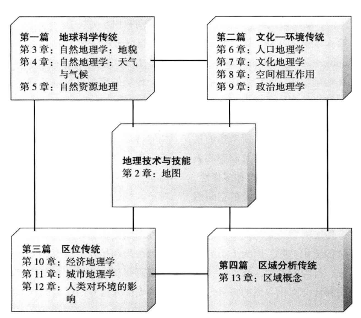

# 人文地理学第三次作业

[toc]

## 1. 阅读参考文献

### 1.1. 宋长青，地理学研究范式的思考，地理科学进展，35（1）2016，p1-3

地理学主要关注陆地表层自然和人文要素的空间分异规律研究，针对这一复杂系统的不同问题应该选择不同的研究方式。主要的地理学研究范式概括为：地理经验科学研究范式、地理实证科学研究范式、地理系统科学研究范式和地理大数据研究范式。

地理经验科学研究范式：由于地理学的重要学科任务之一是刻画地理空间的差异性，因此，基于经验科学的地理研究范式具备独特的研究特点。基于经验科学的地理学以刻画区域要素和区域差异为目标，根据大量的自然和人文要素的空间特征，采用定性和定量相结合的方法，定义了地理区域划分的指标体系

地理实证科学研究范式：基于实证的地理学研究范式的理论假设为自然地理要素时空变化过程基本遵守物质能量守恒定律。在此基础上，通过经典物理学的方法刻画地理要素的演变。地理实证科学研究范式特征为：通过实验获取相对准确的数据，利用其刻画地理事实过程从而减少偏差；通过动力学、统计学的方法，构建逻辑科学、参数适合的模型，实现模拟结果的真实逼近；在此基础上，实现中观、宏观尺度区域差异和区域联系的本质联系，进而解释地理要素时空演化的动力学驱动过程

地理系统科学研究范式：共存于统一系统中的地理要素具有相互作用、相互依存、协同演化的特征。宏观地理区域时空行为演化特征影响微观区域变化，微观区域的特征改变也会传递到宏观。当变化积累到一定程度会改变陆地表层系统的整体行为，并导致其原有功能退化。地理系统科学研究范式在很大程度上改变人们遗忘认识自然和社会地理现象的路径

地理大数据研究范式：在应用大数据研究中应注意两个问题：数据挖掘和多尺度聚类分析。其主要目的是刻画地理事件于地理要素的时空联系，进而揭示其发生的本质

从地理科学发展的历史与现状来看，地理经验科学研究范式奠定了地理学的基本性质，形成了地理学的本源特征。地理实证科学研究范式是当今地理学研究的潮流，使地理格局、过程研究不断深化，是地理学成就的标志。地理系统科学研究范式是前沿，是全面认识陆地表层系统行为，促使地理学从“好看”到“好用”的关键环节。地理大数据研究范式则是探索，有可能为地理学、尤其是人文地 理学的定量研究提供全新的路径。

### 1.2. 理解正在变化的星球——地理科学的战略方向，美国国家科学院国家研究理事会著，科学出版社，2011.  第二部分 战略研究问题

1. 人类活动已改变了陆地、水生和海洋生态系统，这种作用超过了自然承受的底线。人为影响已经渗透到不同的地球表面过程
2. 空间分析、实地研究、地理可视化以及细粒度的背景研究，对评估目前全球生物物理调整的规模和类型是至关重要的。地理科学方法和技术有助于识别和量化地球表面的生物物理变化情况，也能观察不同尺度的变化形成过程。地理科学方法和技术在理解生物物理变化和促进资源管理者与决策者应对地球环境变化上具有重要的作用
3. 与实施（如Pontius et al. ，2007)。在未来10年中，地理科学结合实地研究、遥感数据、气候数据与土地变化模型，研究生态系统变化与生物多样性空间分布的功能，将对制定土地利用政策与保护战略至关重要
4. 地理学认为脆弱性是会随着时间和空间的改变而动态变化的。对以往所忽略的宏观背景的研究，以及不同地理空间和尺度的过程与格局的探索，将会给我们的研究提供新的重要机遇，从而加深人们对环境变化影响下的脆弱性格局变化的理解。此外，对地方尺度的恢复力、可持续性及适应性问题的分析，以及它们与大尺度过程间关系的研究，可以进一步改进我们对脆弱性问题的认识
5. 21世纪的城市化将对地方和全球产生深远的影响。了解人们未来在哪里居住和城市怎样发展与本报告讨论的人与环境的福祉息息相关，涵盖了从城市增长人口的食物供给到维护我们这个星球的物种多样性和生态服务等诸多方面。新的地理数据和不断发展的分析方法，与现有研究工具和技术相结合，能够帮助我们更加完整和充分地认识城市化的模式、意义和不确定性
6. 理解每个地方的机动性、机动性影响的差异及其原因，是预知未来几十年内机动性的增加及机动性选择的改变对经济、环境、社会和政治的影响的关键。地理科学家们拥有不同的学科背景，包括地理学、土木工程、社会学、经济学和政治科学，因此能够很好地承担研究这些问题的任务
7. 要理解不平等的原因和结果，需要考虑到地理格局与网络一无论是经济的、政治的还是环境的。空间分析可以准确测算出空间变化和标度差异，有助于阐释全球化和不平等之间的复杂关系
8. 地理科学家们关于上述议题的研究将加深我们对塑造21世纪安全形势的地缘政治的根本力量的理解。我们需要的是持续的努力，去调查地缘政治发展及其概念化的空间特征，去分析它们之间的关系从而调整政治-经济、环境和社会格局。如果没有这些研究，我们对导致地缘政治稳定和不稳定的主要根源的理解将非常有限

### 1.3. 改变世界的十大地理学思想，美国.苏珊•汉森主编： (Susan Hanson) ，商务印书馆，2009

1. 世界的表达：如何描绘世界不仅仅反映我们能够观察到什么，也能够使我们以新的观点观察和理解世界，因此就有可能改变世界。地图也许是最精髓的地理表达形式，它允许我们简化世界的复杂性并形成等级构造。地理学家最新的表达世界的方式是通过地理信息系统(GIS)，它能够以数字化的形式收集、储存和分析空间信息。GIS不仅是一种高新技术图，GIS的思想比天气图更进一步地延伸了原创的地图思想。GIS代表了一种思考空间信息的新思维
2. 作为人类家园的世界：人和环境之间的关系是地理学中永恒的论题。环境在影响全球人类生活方面起着强有力的作用;同时，我们人类自生活于地球之初就在改变着地球。塑造并将继续塑造人类与环境关系的地理学思想是人类能够也确实通过调节他们的实践和行为减轻了环境灾害的重要指导
3. 相互关联的万千世界：当前面的思想突出人类与“自然环境”的相互作用时，这一组地理学思想不得不处理人类穿越空间的相互作用。这一部分的三个思想(功能区、中心地和城市群)的核心构成了离散的地方之间相互作用的本质和基础。正如历史学家创造了年代或时代以时间来划分事件，地理学家很早以前就创造了区域以空间来划分事件。时代和区域都是为理解世界而施加次序、寻求格局和创造类别的工具。我们都熟悉区域的思想:将不同的地方以某些共性(共有的特征)统一起来

### 1.4. （美）阿瑟•格蒂斯，朱迪丝•格蒂斯，杰尔姆•D•费尔曼，黄润华，韩慕康，孙颖译，地理学与生活，世界图书出版公司•后浪出版公司出版，2013. 

地理学广泛领域中的课题多种多样。然而，正是这种多样性本身突出了一种现实——所有地理学家，不论他们的特定专题或者区域兴趣怎样，都是被他们所探索的类似问题以及他们应用于考虑其答案的一套共同的基本概念所维系的。无论对自然现象或者文化现象，他们都要探究:这种现象是什么?位于何处?它是如何形成并出现在那里的?.它同其他自然或文化现实处于何种关系，亦即它是影响者还是被影响者?它怎样成为功能性整体的一部分?它的位置怎样影响人们的生活，以及在它被发现的区域内的内涵?

目录结构

### 1.5. 金其铭，人地关系论，江苏教育出版社。

1. “人文地理学”这一名词的含义是随时代而变化的，是一个松散结合的领域。给人文地理学的研究对象下一个确切的定义并非易事，我国地理学家对此的认识大致是相似的。李旭旦教授认为:“人文地理学(Human Geography)，是以人地关系的理论为基础，探讨各种人文现象的分布、变化和扩散以及人类社会活动的空间结构的一门科学1。”
2. 作为一门学科，它都有自己的基础理论。在拉采尔、白吕纳等人的人文地理学著作中，人地关系论作为其理论基础而存在于整个研究之中。但在上述的广义的人文地理学中，其基础理论显然是多元化的，除人地关系论外，还有区位理论、生产布局理论、区域增长与发展理论、地域分异规律及区划理论等。但影响最为深.远、贯穿于人文地理学各个发展阶段的则是人地关系论
3. 对人地关系的研究有不同的侧重点和出发点，或侧重于人;或侧重于地，或强调人类改造自然的能力;或强调自然对人类的控制。人地关系与人地关系论并非同一个概念，人地关系论是人们:对人地关系的认识论。人地关系是自人类开始即已存在的客观关系，对这种关系，人类早就逐渐有各种认识。地理科学产生以后，把地球当作人类的家乡来进行研究。人与自然环境的关系被作为地理学的主要研究内容之一，特别是人文地理学，它从人类的生产、生活、政治、文化、社会、军事各个方面，探讨不同历史发展阶段和不同社会环境下人与地理环境在各自发展过程中的相互作用、制约关系。由于研究者个人的世界观和阅历不同，各人的认识水平也有差异，以及受到时代条件的局限，对人、地之间的相互关系就会产生不同的认识论，例如有人过高地估计地理环境的作用，认为地理环境对人类生活起着决定和制约作用，有人则强调研究人类与地理环境之间的相互作用。以这些理论来指导人文地理学的研究，就会得出不同的结果和见解，从而导致了人文地理学不同学派的产生。但不管以何种出发点来解释人地关系，这种种理论都有一个共同点，即以人地之间的关系作为立论对象，因而被称为人.地关系论。

## 2. 问题思考

### 2.1. 人类是如何改变地球表面的自然环境？

人类活动已改变了陆地、水生和海洋生态系统，这种作用超过了自然承受的底线。人为影响已经渗透到不同的地球表面过程，例如，研究对河流系统中这些影响的重要性和范围显而易见，但对流域中沉积物的侵蚀率和运输率知之甚少，同样也很难搞清楚这些沉积物的停留时间。此外，洪泛区的沉积物代表了一个巨大但尚属未知的物质储备。这些沉积物往往受到农业杀虫剂和除草剂的污染。经过一段时间充分的储存，这些污染物的毒性会减弱，但如果随着河道侵蚀释放出来，特别是当泥沙含量超过国家环境保护局的水质混浊度标准时，可能会导致生物栖息地的逐步退化，并引起水质的退化。人类的对地球表明的自然环境的改变主要有如下几点：

- 生态系统：生态系统中无论有没有人，都处于永恒的变化之中，但是人类对它的影响超过其他任何物种。人类对生态系统的影响开始很小，那时人口规模小，能耗与技术水平低。但是这种影响增长得非常迅速而且无处不在，以至于现在我们看到的是公认的各色生态危机
- 对水的影响：河流的整治、水质的污染、农业水污染、工业矿业水污染。人类对水的依赖使我们早就开始努力控制水的供应。这种实践业已改变了江河的水量和水质
- 对空气和气候的影响：空气污染物、酸雨、、光化学烟雾、臭氧层损耗、如何控制空气污染。
- 对地貌的影响：挖掘作业产生的地貌、倾倒产生的地貌、地面沉陷的形成
- 对动植物的影响：人类以种种方式影响动植物生活。这种影响足够严重的时候，一个物种就会灭绝，即不再存在。虽然化石记录表明灭绝是地球生命的正常现象，但科学家判断近代历史上灭绝速率呈指数增长——因人类活动造成的增长
- 固体废物的处理：城市垃圾的填埋和焚化、源头减量与循环利用、危险废物

### 2.2. 人类活动的环境效应是什么？

环境效应（environmental effect）是指自然过程或者人类的生产和生活活动会对环境造成污染和破坏，从而导致环境系统的结构和功能发生变化的过程。有正效应，也有负效应。按形成原因，分自然环境效应、环境化学效应和环境物理效应。多为综合效应，如大量工业废水直接排入江河、湖泊和海洋 可使水体的物理上化学上生物条件发生变化，导致水生生物种类、种群变化，并对人类产生影响。环境效应一般可以分为自然环境效应和人为环境效应。环境效应按其产生的机理还可分为环境生物效应，环境化学效应和环境物理效应。

- **自然环境效应和人为环境效应**

自然环境效应是以地能和太阳能为主要动力来源．环境中的物质相互作用所产生的环境效果；人为环境效应则是由于人类活动而引起的环境质量变化和生态变异的效果。这两种环境效应都伴随有物理效应、化学效应和生物效应

- **环境生物效应**

环境生物效应是环境诸要素变化而导致生态系统变化的效果。这种效应的许多例子是大家所熟悉的，如现代大型水利工程，使鱼、虾、蟹等水生生物的繁殖受到不同程度的影响

- **环境化学效应**

环境化学效应是在环境条件的影响下，物质之间的化学反应所引起的环境效果。环境化学效应也有大家比较了解的例子，如环境的酸化和环境的盐碱化等

- **环境物理效应**

环境物理效应是物理作用引起的环境效果，如噪声、振动、地面下沉等。噪声与振动主要是由工矿企业的机器和交通道路的车辆造成的。

### 2.3. 自然环境的不平等如何影响经济社会发展？世界上邦国林立，为什么富的这么富，穷的这么穷?

大自然是不平等的，福与祸有些是天然的；财富积累的规律是无情的；过去的600年乃至今天欧洲基本上是最富裕的地区，美国和日本是后来者，这些国家或地区差不多都处于温带而且属海洋性气候，有良好的自然条件，非洲、拉美地区贫困图景与热带气候有关。葡萄牙在地理大发现之后，较早地拥有富裕的殖民地，但是由于葡萄牙人对宗教的虔诚和对贸易的忽视，终使其不久就衰落了；而英国在工业革命的推动下，生产力极大提高，本着重商主义，建立了日不落帝国；随即美国开始崛起，开放的文化、无所顾忌的历史、优越的地理环境和战争机遇，美国居于领先地位。天朝大国——中国，曾陶醉在自己灿烂的文化和迷人的历史里，对外来事物排斥，怠于学习，最终失败了；日本明治维新之后，成为富国俱乐部的一员。历史就是这样演进的，能搭上时代的列车，就可能分享财富，而落后者就需要付出高昂的代价。
国家的贫富是由多种因素决定的。文化、政治是以经济为基础的，政治是经济的集中表现，文化反应往往是滞后的，它对经济的作用一般是“制约—适应—制约”的。国家贫富取决于深层次的文化因素，也受制于经济结构的调整、管理水平的提高。客观条件是现实的，但人们必须努力，趋利避害，走“人—自然—社会”可持续发展之路。

在试图理解地方间和地方发展差异的研究过程中，地理学家已经建立了一个工作框架，形成了不平等的空间变量作用机制，包括不同的宏观经济管理体系、不同的福利体制、不同的劳动力社会状况（如有薪工作和无薪工作)、不同的消费和分配实践，得出的结论如下：

1. 自然环境。这个提供了基本的条件。比如热带地区的工作时间和工作地点就会受到很大限制。崛起的世界性大国没有一个不是气候条件非常适宜的
2. 国际贸易协定、全球环境规则、全球投资规则和跨国公司活动，以及劳工标准和法律的分布变化等综合作用
3. 市场自由化加剧了贫富差距。市场自由化通过自由贸易协定和国家贸易金融体制变化，如关税壁垒和资本管制，促进全球贸易和资本市场的一体化，但是一体化的同时也加大了剥削的力度和范围
4. 贫富差异不仅仅是地方环境的结果，也和其他地方关系密切。例如，低收人国家生产和高收入国家的消费之间的关系，农业用地开发是用于国内食品市场还是国外粮食出口的选择对不平等产生了很大影响
5. 思想观念与理性。这个是貌似很空的东西。但事实上，我们可以通过一定的制度设计实现。比如，政教分离。比如，对思想传播更大的容忍度。在此基础上这是一个缓慢渐进的过程。而且书中提了很多思想观念影响社会发展的情况。中东是一个明显的例子。歧视女性的观念使得社会的劳动力几乎缺失了一半。再比如英国曾经的“日不落”心态，这个是导致英国衰落进而心理失衡、酿造一战的重要原因
6. 私人产权和契约履行。这个几乎可以解释资本主义制度的兴起、科技发展等几乎所有关键的要素。人若没有产权，便没有谈判的资格，进而也就什么都没有了。

### 2.4. 环境决定论与人类决定论思想之间的关系

- **环境决定论**

自从人们开始思考自身的时候起，就思考他们同大自然的关系。人类的整个文明史，都是对这种关系的一般本质进行思考的尝试，并一直孜孜不倦地寻求建立一定的体系解释人类存在和发展的原由，这种信念始终是每个社会最基本的文化成分。但是全球各地有无数各种要素构成的复杂环境，每一个人在这种多样化氛围内形成的生活是变化多端的，对生活的反思形成了他们各自的世界观。地理环境和人类社会的关系问题，自古就是历史学、哲学研究的重要课题。在哲学领域里，从物质第一性出发，认为环境.首先对人起作用，以致有些人对此认识绝对化，因而形成环境决定论流派。在近代，隐藏在人与自然关系概念背后的哲学和历史研究的实践意义，受到地理学家的重视，从此地理环境决定论成为地理学家揭示和解释地理事象的形成规律的基础，也是派生其他人地关系理论的根源。地理环境决定论指的是人类所居住的地理环境状况及其气候状况决定了人类生活的状态，进而决定着人类社会的发展。一般认为，这一观念应该归属于德国著名地理学家拉采尔(Ratzel)，不过它早就出现于古典时期——甚至可以说是盛行于古希腊罗马各个时代。

- **人类决定论**

法国现代地理学之父以及现代人文地理学鼻祖 Vidal de la Blache 对“环境决定论”进行了全面的批判。他提出了人与土地关系之“可能论”，其地理学思想被誉为“维达尔传统”。对于地理环境决定论，费弗尔在其扛鼎之作《大地与人类演进：地理学视野下的史学引论》中也进行了全面而细致的批判。作者明确指出，造就文明形态的东西并非是地理环境或气候，而是人类的习惯、习俗等文化元素，“实际上，在一定环境中形成的生活习惯会很快获得充分的连贯性和稳定性，并且造就文明的形态……

人类决定论是对环境决定论的吸收与批判，我们需要推倒“地理环境决定论”大厦，建立正确的“人地关系”之构架。人类决定论并不反对(而是完全承认)自然环境——包括地理环境、气候等——施加于人类的各种作用，它提出从内部环境之作用角度，我们将会发现：生命的演化史就是积极适应环境的历史，自然环境是一个广义上的概念，它富含多种因素，其中包括环境形态及其所拥有的永久资源，这类要素“对于人类进化显而易见的影响是确定无疑的”。但是地理环境影响之适可而止的程度是可以接受的；而一旦言过其实亦即这种程度超过设定的界限，就有可能落入地理环境决定论的陷进之中。人类的意愿是自然面貌得以改观的主因，人的作用远胜于地理环境之影响；人们的意愿和决心使得人类韧劲十足，“而所有可能之事的发生通常都为坚持不懈且韧劲十足的人类意愿所扭转而得到应验”。他们坚持不懈，持之以恒，令地球上几乎一切不可能之事变为可能，因此而言，所谓人定胜天，实际上乃是人类的意愿足以“胜天”。

### 2.5. 人与自然之间如何和谐共处？

在影响当代全球环境问题和生态危机的基本矛盾中 ，人与自然的矛盾是直接起作用的，而人与人之间的矛盾虽然是间接起作用的，却反映出人与自然矛盾背后更深层次的社会因素，同样有着决定性意义。由于人类社会历史发展的差异，地区及国家利益的不同，人与人之间的矛盾影响着人与自然关系的和谐与协调发展。从全球角度出发，人与自然关系的和谐发展离不开人与人关系的正确处理，需要加强国际合作。要实施可持续发展战略，必须十分重视环境伦理的研究.教育和实践。环境伦理的研究和宣传具有认识和批判功能﹑教育和激励功能、调节和规范功能，对于环境立法有重要的基础作用。制度是伦理建设的社会基础设施，制度为人们确定行为的框架，运用利益机制对社会成员的行为选择起到导向作用。环境伦理在区域可持续发展中涉及的应用领域很广，如节制生育、节约资源，生态修复.环境整治.清洁生产.减少污染，适度发展.合理消费.护育自然等。从环境伦理角度都可以提出相应的一些原则.要求和具体的行为规范。如循环经济是以“减量化.资源化和无害化"为原则，以资源高效利用和环境保护为基本特征的社会生产和再生产活动，从而解决发展中的资源环境矛盾。从区域发展角度看，我们更应关注区域资源开发与利用中的环境效应以及不同区域间发展的协调与统筹等问题。
总之，要落实全面.协调.可持续的科学发展观，就必须协调好不同区域环境与发展的关系。地理学作为跨越自然科学与社会科学的桥梁，更有责任关注地球系统科学知识和自然规律的宣传普及，加强对环境伦理的研究.教育和宣传，提高公民和决策者的环境意识与可持续发展的伦理观念，为协调人与自然的和谐关系，护育地球家园做出我们应有的贡献。

## 3. 作业：结合以上阅读材料，撰写关于人地关系研究范式的小论文

面向人地关系的地理大数据研究范式

摘要

地理学主要关注陆地表层自然和人文要素的空间分异规律研究，针对这一复杂系统的不同问题应该选择不同的研究方式。主要的地理学研究范式概括为：地理经验科学研究范式、地理实证科学研究范式、地理系统科学研究范式和地理大数据研究范式。从地理科学发展的历史与现状来看，地理经验科学研究范式奠定了地理学的基本性质，形成了地理学的本源特征。地理实证科学研究范式是当今地理学研究的潮流，使地理格局、过程研究不断深化，是地理学成就的标志。地理系统科学研究范式是前沿，是全面认识陆地表层系统行为，促使地理学从“好看”到“好用”的关键环节。地理大数据研究范式则是探索，有可能为地理学、尤其是人文地理学的定量研究提供全新的路径。本文主要研究面向人地关系的地理大数据研究范式。

互联网时代的“大数据”热潮迅猛波及到经济社会的各个领域，地理学是大数据研究与应用的天然试验场。大数据已经对地理学研究产生了一定的影响。其中，人文地理学领域的反应最为热烈，基于大数据的研究案例纷纷呈现;地理信息科学在互联网大数据时代将会更加迅猛发展，自然地理学领域正在寻找和等待爆发点。目前，大数据还不能改变地理学的核心命题与基本范式，在坚持地理学核心思想的同时，应该对地理学领域有关大数据理论的探讨与应用尝试持有一种开放包容的态度。

面向人地关系的大数据研究范式主要目的是刻画地理事件与地理要素的时空联系，进而揭示其发生的本质。其理论假设是地理事件相关的地理要素是有内在联系的。在研究中应注意与信息科学、计算科学和地理科学方法的结合。对地理大数据科学范式的研究有望为短时间尺度地理事件发生的监测和预测提供有力的科学和技术支持。当前，应充分利用大数据为地理学研究的深化和从地理学的视角解决社会需求问题都提供了一种新的思路和模式。在应用大数据研究中应注意两个问题:首先是数据挖掘。数据挖掘的核心要义是通过数据分析产生知识，这与大数据的意义完全相同。只是从大数据中挖掘知识的难度更大，需要创建新方法、新技术以期从大数据中获取更多有益的地理知识;其次是加强多尺度聚类分析。传统聚类分析是根据数据的亲疏关系聚类，以期获取同一地理现象的空间认识。由于大数据与地理事实的内在联系较“疏”，因此，在寻求地理相似性的同时，更应强调多源数据、空间关系的特征，力求分析结果更加贴近事实。

1. 大数据

大数据的定义：高速 (Velocity) 涌现的大量 (Volume) 的多样化 (Variety) 数据。这一定义还表明大数据具有 3V 特性。简而言之，大数据指非常庞大、复杂的数据集，特别是来自新数据源的数据集，其规模之大令传统数据处理软件束手无策，却能帮助我们解决以往非常棘手的业务难题。大数据的 3V 特性如下：

- **大量 (Volume)** ：大数据的“大”首先体现在数据量上。在大数据领域，您需要处理海量的低密度的非结构化数据，数据价值可能未知，例如 Twitter 数据流、网页或移动应用点击流，以及设备传感器所捕获的数据等等。在实际应用中，大数据的数据量通常高达数十 TB，甚至数百 PB。
- **高速 (Velocity)**：大数据的“高速”指高速接收乃至处理数据— 数据通常直接流入内存而非写入磁盘。在实际应用中，某些联网的智能产品需要实时或近乎实时地运行，要求基于数据实时评估和操作，而大数据只有具备 “高速” 特性才能满足这些要求。
- **多样化 (Variety)**：多样化是指可用的数据类型众多。通常来说，传统数据属于结构化数据，能够整齐地纳入[关系数据库](https://www.oracle.com/cn/database/what-is-a-relational-database/)中。随着大数据的兴起，各种新的非结构化数据类型不断涌现，例如文本、音频和视频等等，它们需要经过额外的预处理操作才能真正提供洞察和支持性元数据。

在过去几年里，大数据的定义又新增加了两个 "V"：**价值 (Value)** 和 **真实性 (Veracity)**。数据具有内在价值，但在挖掘出其中的价值之前，它们并没有什么用处。而数据的真实性和可靠性也同样重要。目前，众多前沿技术突破令数据存储和计算成本呈指数级下降。相比过去，企业能够以更低的经济投入更轻松地存储更多数据，而凭借经济、易于访问的海量大数据，您可以轻松做出更准确、更精准的业务决策。大数据的优势主要是：

- 大数据意味着更多信息，可为您提供更全面的洞察。
- 更全面的答案意味着数据更可信，进而有助于总结出全新的问题解决方法。

为了解决传统大数据应用升级缓慢、架构臃肿、不能快速迭代、故障不能快速定位、问题无法快速解决等问题，云原生这个概念横空出世。云原生可以改进应用开发的效率，改变企业的组织结构，甚至会从文化层面上直接影响一个公司的决策，云原生应该具有的架构特性：敏捷性、可扩展性、故障可恢复性

云是通过互联网访的服务器，以及在这些服务器上运行的软件和数据库，云服务器分布在全球各地的数据中心中，通过云计算，用户和公司不必自己管理物理服务器或在自己的机器上运行软件应用程序。云原生准确来说是一种文化，更是一种潮流，它是云计算的一个必然导向。它的意义在于让云成为云化战略成功的基石，而不是阻碍，如果业务应用上云之后开发和运维人员比原先还痛苦，成本还高的话，这样的云我们宁愿不上。但是实际情况就是，很多公司希望完成从传统应用到云端的迁移，但是这个过程中会遇到一些技术难题，并且上云以后，效率并没有变高，故障没有迅速定位，云原生技术有利于各组织在公有云、私有云和混合云等新型动态环境中，构建和运行可弹性扩展的应用。云原生的代表技术包括容器、服务网格、微服务、不可变基础设施和声明式 API，这些技术能够构建容错性好、易于管理和便于观察的松耦合系统。结合可靠的自动化手段，云原生技术使工程师能够轻松地对系统作出频繁和可预测的重大变更。

2004年，与林珲教授从虚拟地理环境及SARS等疾病时空传播的研究角度，提出面向“人”的地理信息系统（GIS）概念，认为传统的GIS侧重于“地”的表达与分析，是面向“地”的GIS，对区域人地系统中的“人”，即个体、群体、组织等研究很少，重视不够。随着大数据时代的到来，尤其是关于“人”社会感知（social sensing）数据技术的发展，手机定位、车载GPS、在线地图导航与位置搜索、社交网络、城市感知高清视频等实实在在的新时空大数据涌现，极大地推进了面向“人”的地理信息系统（科学）的发展。但是，上述主要是从“人”这个具体研究对象以及新数据获取的角度，讨论关于地理时空大数据的影响。从更高的层面看，大数据是否属于科学研究的“第四范式”?大数据是否是重视“相关”关系而弱化“因果”关系研究?大数据是否为突破还原论、发展整体论与系统论提供了可能?是否为地理系统的复杂性科学研究提供了新的思路与方法?关于这些问题的提出、思考、激烈争论与跨学科讨论，呈现出的多种新观点、新思想以及相互激励碰撞形成的百家争鸣新气象，说明了大数据对学科发展的巨大影响力。

地理信息科学概念自从1992年提出以后，其基本理论与方法发展缓慢、创新活跃度不大，而大数据对于地理信息科学的发展则是一个巨大的新机遇，尤其在地理信息科学基本理论与方法论上将会不断呈现新思想、新概念与新方法。例如，已经出现了的开放GIS、后GIS世界、社会感知、面向“人”GIS、大数据GIS、广义GIS、城市计算等新观点;同时，结合大数据时代的虚拟地理环境、地理信息科学与地理科学发展，也提出了一些理论新思考，即地理大数据主要侧重于地理属性以及地理虚体（多种地理属性之间的确定性或必然性联系）的感知与表达，以及采用虚实二象思维研究现实地理环境、（实时）虚拟地理环境以及地理大数据世界的相互关系与影响等。

2. 人地关系

“人文地理学”这一名词的含义是随时代而变化的，是一个松散结合的领域。给人文地理学的研究对 象下一个确切的定义并非易事，我国地理学家对此的认识大致是相似的。李旭旦教授认为:“人文地 理学(Human Geography)，是以人地关系的理论为基础，探讨各种人文现象的分布、变化和扩散以及 人类社会活动的空间结构的一门科学。” 作为一门学科，它都有自己的基础理论。在拉采尔、白吕纳等人的人文地理学著作中，人地关系论作为其理论基础而存在于整个研究之中。但在上述的广义的人文地理学中，其基础理论显然是多元化 的，除人地关系论外，还有区位理论、生产布局理论、区域增长与发展理论、地域分异规律及区划理 论等。但影响最为深.远、贯穿于人文地理学各个发展阶段的则是人地关系论。人地关系就是指人类社会向前发展的过程中，人类为了生存的需要，不断地扩大和加深改造和利用地理环境，增强适应地理环境的能力，改变地理环境的面貌，同时地理环境影响人类活动，产生地域特征和地域差异。 人地关系的地域性或地域组合，是人文地理学研究的特殊对象。

 对人地关系的研究有不同的侧重点和出发点，或侧重于人;或侧重于地，或强调人类改造自然的能力; 或强调自然对人类的控制。人地关系与人地关系论并非同一个概念，人地关系论是人们:对人地关系 的认识论。人地关系是自人类开始即已存在的客观关系，对这种关系，人类早就逐渐有各种认识。地理科学产生以后，把地球当作人类的家乡来进行研究。人与自然环境的关系被作为地理学的主要研究 内容之一，特别是人文地理学，它从人类的生产、生活、政治、文化、社会、军事各个方面，探讨不 同历史发展阶段和不同社会环境下人与地理环境在各自发展过程中的相互作用、制约关系。由于研 究者个人的世界观和阅历不同，各人的认识水平也有差异，以及受到时代条件的局限，对人、地之间 的相互关系就会产生不同的认识论，例如有人过高地估计地理环境的作用，认为地理环境对人类生活 起着决定和制约作用，有人则强调研究人类与地理环境之间的相互作用。以这些理论来指导人文地 理学的研究，就会得出不同的结果和见解，从而导致了人文地理学不同学派的产生。但不管以何种出 发点来解释人地关系，这种种理论都有一个共同点，即以人地之间的关系作为立论对象，因而被称 为人地关系论。

地理学是研究人地关系的学科，涉及自然环境与社会系统的方方面面。地理学研究是大数据战略的天然试验场。在大数据背景下，传感器网络、个体出行过程、网络行为、消费记录等均可能成为具有隐式地理空间形态的地理分析数据源，便于研究自然环境、社会动态、人口流动等。此外，传统地理信息注重的是地表要素的静态描述，其所附带的属性数据的时间变化并不频繁，而大数据时代的地理信息更强调地表要素的实时属性变化，特别是移动的个体或群体对象，其空间位置与属性的实时变化更为凸显，同时，数据时空粒度不断细化，从而使地理空间概念越发重要。地理科学很多方向也可以使用大数据技术，比如基于矩阵的遥感光谱研究、基于统计学的城市经济学、基于城市大数据的城市地理学等。

3. 面向人地关系的地理大数据研究

3.1. 人文地理研究不仅需要利用新的数据来源对已有理论和模型加以再验证，而且更需要思考大数据带来的新机遇、新认识、新方向。

大数据”的兴起与迅猛发展有利于创新地理学的研究方法与研究议题;“大数据”不是万能的，各类数据扬长避短、各得其所，隐藏在数据背后的事实将被更多地揭示出来;地理学界对“大数据”应予更多关注。人文地理研究不仅需要利用新的数据来源对已有理论和模型加以再验证，而且更需要思考大数据带来的新机遇、新认识、新方向。

首先，大数据的应用符合当前学科“人本化”与“信息化”的学科发展趋势。大数据提供了大量关于“人”的数据，使人地关系研究更能够关注“人”，更好地体现以人为本。其次，大数据能够在一定程度上克服传统数据的不足。传统数据如问卷调查、访谈等能够获取的往往是总体样本的一个子集，存在样本代表性和典型性等问题，对于地理空间格局与过程的理解也因数据限制而存在偏差，大数据的相关关系分析与传统数据的因果关系研究可以相得益彰。再次，大数据能够为传统研究议题提供新的佐证。例如在通勤研究中，利用不同的调查数据，针对同一城市的研究结果可能存在较大差异;相应地，对于机制的解释也会有所不同。大数据作为一种“完全数据”，为整合和评判不同研究结论及其社会意义提供了一种可能性。最后，大数据也为创新地理学研究的议题提供了机遇。例如在微观尺度上对于个体和群体移动模式的预测，在宏观尺度上应用多维度行为指标可提升都市区研究中对于人与空间互动关系的理解。

3.2. 大数据的兴起为进一步定量地理解社会经济环境提供了一种新的手段;大数据存在数据代表性问题，作用不能夸大，依然需要去构建模型，解释大数据所蕴含的行为模式和地理规律。

传统的遥感技术利用光谱特征对地物进行观测，但无法有效地感知社会经济环境，而大数据所蕴含的社会经济特征，是对传统遥感数据的有力补充。最近提出“社会感知”概念及研究框架，指出社会感知就是指借助于各类大数据研究人类时空间行为模式，进而揭示社会经济现象的时空分布、联系及过程的理论和方法。大数据可从三方面感知人的时空间行为：1. 对地理环境的情感和认知（如基于社交媒体数据中可以获取人们对于一个场所的感受）;2. 在地理空间中的活动和移动（如基于出租车、签到等数据可以获取海量移动轨迹）;3. 个体之间的社交关系（如基于手机数据可以获取用户之间的通话联系信息）。社会感知的研究框架包括人、地、时三个基本要素。首先，在“人”的方面，社会感知数据可以获取人的活动与移动、社交关系、情感与认知等行为模式;其次，在“地”的方面，可以基于群体的行为特征揭示空间要素的分布格局、空间单元之间的交互以及场所情感与语义;最后，从“时”的视角，可以发现地理过程（尤其是人文地理过程，如城市空间结构演化）的规律和特征。社会感知由于其独特的“由人及地”的研究范式，为探究“人地关系”这一地理学基本命题提供了一个全新视角。在传统的人文地理学研究中，由于人的样本量通常较少，难以直接根据行为特征去推断地理环境。而根据社会感知框架，时空大数据使得基于人的时空行为模式感知并理解地理环境特征成为可能。回顾人文地理学发展的几次转向，计量革命因为缺少对人的关注而受到批评，而后期行为主义则受限于样本太小、缺乏定量模型。大数据的出现，在一定程度上弥补了上述两个方面的不足，对于地理学尤其是人文地理学研究具有重要支撑作用。

3.3. 大数据兴起为“人地关系”研究提供了从“群体人共性”到“个体人个性”转变的可能;城市是以人为核心的复杂大系统，大数据为研究“以人为本”的城市打开了一扇窗户

人地关系是地理学研究的核心，也是城市规划实践的核心。当前至少在发展理念上经历着从“土地城镇化”向“人本城镇化”的转型，但是现实的操作层面却仍然面临着“为人或为地”的博弈困境。“为人或为地”不单是规划手段的问题，而是关系到城市的基本功能取向。人和地之间是一种复杂的非线性关系，科学理解与平衡运用这种关系对于地理学与城市规划空间实践具有重要意义。而各种以“个体人”为粒度的大数据研究兴起无疑促进了从“群体人共性”到“个体人个性”的实现转变。然而以“人”为本，在大数据时代，面对两个挑战：

从研究的角度，以“个体的人”为本，则面临着城市整体利益与个体利益的平衡问题，移动互联网对未来社会的影响会进一步加深，整个社会呈现出原子化的碎化趋势。但如果过度分散，则城市所具备的集聚经济优势如何保持?从这个意义上讲，大数据应该是发现“千万个”人背后的“千万个个体行为的宏观规律”。从产业的角度，以“个体的人”为本，则意味着每个人都是各种生活所需品的消费终端，是各种个性化产品定制集成的源头，是企业利润的源泉。企业所需要的大数据应该是发现千万个个体“人”的个性化生活和消费特征的数据采集统计分析，来指导生产系统更加敏捷的响应。

这两大挑战，对地理空间会形成前所未有的冲击，意味着生活、生产、商业、物流、交通等都会发生重大变革。今日所面对的城市是以人为核心的更加巨大更加复杂的系统，大数据为我们打开了一扇窗户。然而在欣喜之余，还应多一份冷静：如何在大数据中平衡“工具理性与价值理性”?如何通过少数精英的“个体理性”推动更大社会“集体理性”的形成?

