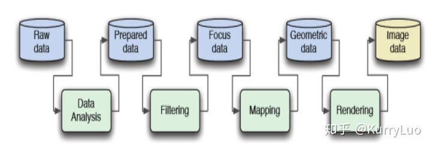
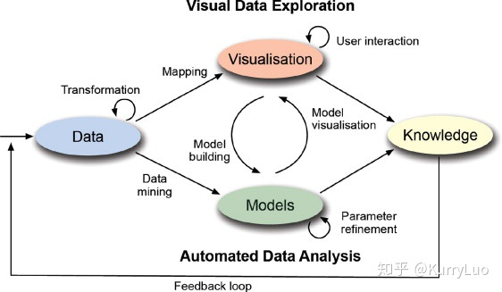
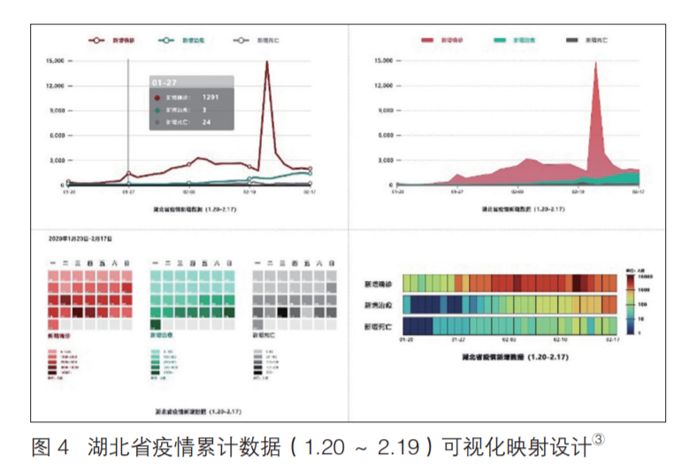
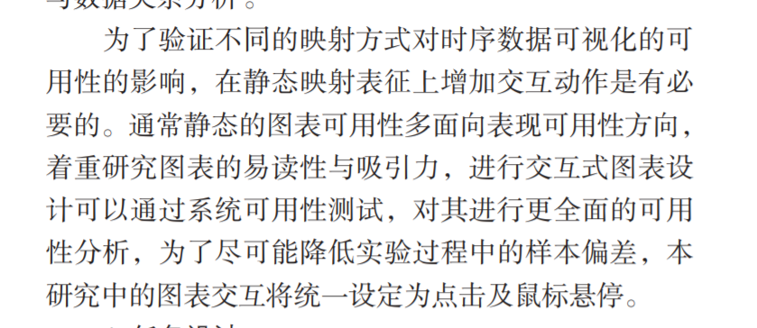

# 地理数据可视化

overview: 乐老师的任务，同一份地理数据的多种可视化

## AntV

[antv](https://antv-g6.gitee.io/zh/docs/design/overview)    让人们在数据世界里获得视觉化思考能力

我好像看到未来的一个方向了，争取加入这个团队？我感觉这个团队很牛逼

[设计体系](https://antv-g6.gitee.io/zh/docs/design/overview)

### 引言


在科学与复杂性一文中，Warren Weaver 按学界面临问题的复杂性，将现代科学史划分为**简单问题、无序复杂问题、有序复杂问题**，学界开始面临更多不稳定性、非线性和多元性的有序复杂问题，业界急需一种基于网络模型的分析探索工具和思考方式。**图可视分析**：社区结构分析、聚类、消息传播、节点分类、连接预测、图表示学习、图神经网络、网络演化等。

这些形形色色的图可是分析产品（可不可以认为是形形色色的数据），对设计的需求越来越旺盛，设计在这个领域又能做些什么呢？该如何设计一个复杂的图可视化分析产品？图可视化的视觉和交互设计又有那些值得注意和思考的点？AntV将这一领域的思考和沉淀总结成**G6图可视化设计体系**

### 常用的应用场景

- 对现状的记录、阐明、揭示
- 对现状的扩展、抽象、预测

图种类：关系图、流程图、DAG图、血缘图、ER图、树状图

### 设计对象

设计师在面对一个关系图设计需求时，不仅需要设计一张图看上去如何，更需要考虑体验设计五要素的每一层。从了解业务和产品目标出发，东西用户需求，同产品经理一起定义图分析产品的功能和边界，再基于用户场景去构建产品的任务流程、信息框架和页面布局，最终再去打磨产品界面以及最重要的图本身的视觉和微交互设计

| 名称   | 描述                                                         |
| :----- | :----------------------------------------------------------- |
| 表现层 | 视觉感知层：产品基础界面和图本身节点和边的视觉设计           |
| 框架层 | 界面布局：如画布、各类组件的布局关系和使用逻辑               |
| 结构层 | 流程、信息架构：确定产品中多个图分析模式如何整合为一体，各种功能的模块组合，信息框架的构建 |
| 范围层 | 功能/内容需求：定义产品图分析功能和呈现内容的边界            |
| 战略层 | 用户需求，业务目标，产品目标                                 |


<div align='center'>通用流程</div>

常见组件、交互设计（通用交互，扩展交互）


## deck.gl

### overview

deck.gl is designed to simplify high-performance, WebGL-based visualization of large data sets.

deck.gl is one of the main framework in the vis.gl framework suite.


### started

using deck.gl without React.

```js
import {Deck} from '@deck.gl/core';
import {ScatterplotLayer} from '@deck.gl/layers';

const INITIAL_VIEW_STATE = {
  latitude: 37.8,
  longitude: -122.45,
  zoom: 15
};

const deckgl = new Deck({
  initialViewState: INITIAL_VIEW_STATE,
  controller: true,
  layers: [
    new ScatterplotLayer({
      data: [
        {position: [-122.45, 37.8], color: [255, 0, 0], radius: 100}
      ],
      getColor: d => d.color,
      getRadius: d => d.radius
    })
  ]
});
```

using deck.gl with React

```react
/// app.js
import React from 'react';
import DeckGL from '@deck.gl/react';
import {LineLayer} from '@deck.gl/layers';

// Viewport settings
const INITIAL_VIEW_STATE = {
  longitude: -122.41669,
  latitude: 37.7853,
  zoom: 13,
  pitch: 0,
  bearing: 0
};

// Data to be used by the LineLayer
const data = [
  {sourcePosition: [-122.41669, 37.7853], targetPosition: [-122.41669, 37.781]}
];

// DeckGL react component
function App() {
  const layers = [
    new LineLayer({id: 'line-layer', data})
  ];

  return <DeckGL
      initialViewState={INITIAL_VIEW_STATE}
      controller={true}
      layers={layers} />;
}
```

using deck.gl with a base map

There are two types of integration between deck.gl and a base map solution:

- overlaid


- interleaved


## 可视化模型

[知乎](https://zhuanlan.zhihu.com/p/38212459)

### 可视化基本流程

可视化不是一个算法，而是一个流程，像一条流水线，但是这些流水线之间是可以相互作用的，双向的


上图中涉及的几个主要的部分

1. 数据采集。数据的采集直接决定了数据的格式、维度、尺寸、分辨率、精确度等重要性质，在很大程度上决定了可视化结果的质量
2. 数据变换。这个过程包括去除数据噪声、数据清洗、提取特征
3. 可视化映射。可视化映射是整个可视化流程中的核心，它将数据的数值、空间位置、不同位置数据间的联系等，映射到不同的视觉通道
4. 用户感知。数据可视化和其它数据分析处理办法最大的不同是用户，用户借助数据可视化结果感受数据的不同，从中提取信息、知识和灵感

注意：

- 上述过程都是基于数据背后的自然现象和社会现象，而不是数据本身
- 各个模块之间的联系更多是非线性的，任意两个模块之间都可能存在联系



<div align='center'>科学可视化流程</div>


<div align='center'>信息可视化流程</div>



<div align='center'>人机交互可视化模型</div>


感觉这张图不错

可视化分析通过人机交互自动处理和可视化分析方法紧密结合在一起

从数据到知识有两个途径：

- 对数据进行交互可视化，以帮助用户感知数据中蕴含的规律
- 按照给定的先验，进行数据挖掘，从数据中直接提炼出数据模型

在这两个途径，用户可以对模型可视化，也可以从可视化结果中构建模型

在许多应用的场合，可视化分析操作的对象是多源异构数据，这些数据中，很多噪声、非结构化数据、异常数据，可视化界面帮助分析人员在自动分析时，直观的看到参数修改或则算法的选择，增强模型评估的效率

此外，允许用户自主组合自动分析和交互可视分析的方法是可视分析学流程的基本特征。在这个过程中，我们可以通过可视化即使发现中间步骤的错误，或者自相矛盾的错误，提高了可信度

综上，数据可视化发展到现在，人机结合是多个时代的叠加产物。一方面，机器只能在某些方面能做到人类数亿年都完成不了的工作，另一方面，人类经过数亿年的进化，有些“只可意会，不可言传”的技能，即推理分析能力


## 课外文献阅读

1. 

- 参考文献过老

- 多看看时空数据模型，这个应该对我有用

- 

- 不值得继续看

2. 

- 看了摘要，和我本科毕设很像，就是做了一些酷炫的功能，但是实际根本没有解决什么问题，论文也只是水文字，失望

- 


失望。

3. 

- 
- 
- 

4. 

- ChinaVis 年会、Virtual Retractor 小组， 看了，并没有任何用

5. 

- 


- 研究表明数据映射需要满足两个基本条件：一是真实地表示并保持了数据的原貌；二是可视化映射形成的可视化表征或隐喻是易于用户感知和理解的
- 
- 
- 
- 
- 到底用哪种可视化方案，该文用了调查问卷的形式
- 相同数据的不同的可视化映射会呈现不同的可用性差异

6. 

- 一些组织和商业公司自行发布了有关数据可视化的规范和指南：IBCS、Google 的 Material Design 数据可视化设计规范指南、AntV蚂蚁数据可视化解决方案
- 数据可视化是一种以图形描绘密集和复杂信息的表现形式。数据可视化的视觉效果旨在使数据容易对比，并用它来讲故事，以此来帮助用户做出决策。数据可视化可以表达不同类型和规模的数据，包括从就给数据点到大量变量的数据集，数据可视化设计原则如下：准确、帮助、可扩展
- 这篇文章不错

7. [OSMnx: New Methods for Acquiring, Constructing, Analyzing, and Visualizing Complex Street Networks ](https://geoffboeing.com/publications/osmnx-complex-street-networks/)

- OSMnx是python的扩展包，可从OpenStreetMap下载地理数据资源，并进行建模，投影，可视化和分析。具体能做的有：1. 街道网络（可行驶，可步行，可骑行）或其它基础设施网络的建模（方位和方向） 2. 建筑物轮廓，位置边界，城市边界，位置点高程及倾斜度等  3. 将网络另存为shapefile， geopackage 和 GraphML 格式  4. 计算和可视化最短路径，以最小化距离，旅行时间，海拔等


