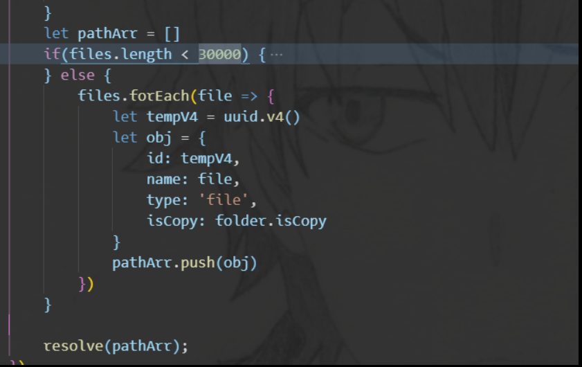

# 项目总结

## 1. 3D WebGIS(2020.03)

Cesium + echart + Jquery + bootstrap，后端用地理服务器，有个资产模型 3d tiles

### 1.1 坐标转换，js 怎么处理精度问题

[js 数字精度](https://segmentfault.com/a/1190000021684144)

JavaScript 内部，所有数字都是以 64 位浮点数形式储存，浮点数分为三部分：符号位，指数位，尾数位置


<div align='center'>js 存储数字</div>

精度产生的原因：0.1 0.2 这种转化为二进制码是有误差的，尾数是一个不断循环的数，但是浮点数的尾数只有 52 位，省略了一部分，所以就会产生误差；其次是在对接操作的时候会损失掉一部分尾数

toPrecision 和 toFixed 都是把数字转换为字符串展示，在计算过程中不要使用

- `toPrecision`是处理精度，精度是从左至右第一个不为0的数开始数起。
- `toFixed`是小数点后指定位数取整，从小数点开始数起。

如果用 toFixed 来做四舍五入会有bug，如：`1.005.toFixed(2)`返回的是`1.00`而不是`1.01`，原因：`1.005`实际对应的数字是`1.00499999999999989`，在四舍五入时全部被舍去！ 不过 `(1.005).toPrecision(4) ===> 1.005`，可以自己写一套字符串逻辑去处理：

```javascript
if(!Number.prototype._toFixed) {
  Numger.prototype._toFixed = Number.prototype.toFixed
}
Number.prototype.toFixed = function(n) {	// 加上一个非常小的数就解决了
  return (this + 3e-16)._toFixed(n)
}
```

误差主要产生在进制转化和浮点数运算的对阶操作，整数由于尾数后面全是 0 ，同时转为二进制数就没有误差，所以可以将数字全部转为整数，计算完再转化为小数：

```javascript
function add(num1, num2) {
  const num1Digits = (num1.toString().split('.')[1] || '').length
  const num2Digits = (num2.toString().split('.')[1] || '').length
  const baseNum = Math.pow(10, Math.max(num1Digits, num2Digits))
  return (num1 * baseNum + num2 * baseNum) / baseNum
}
```

有现成的库 mathjs，原理是不走浮点数这套，将数字转换为字符串，自己实现运算逻辑

### 1.2. 地图渲染速度的问题

不使用 Vue 的原因，速度慢，会产生数据劫持，如果将 cesium.js 初始化的地图对象保存在 Vue 实例上，地图对象会经常更新，数据更新了 DOM 也要同时更新，会十分的卡顿，所以就用纯 js 写的，然后将地图对象绑定到 window 上了

但是地图渲染过程中还是有明显的卡顿，最后发现是滚动条的出现改变了页面主体的宽度，容器宽度的变化导致 Cesium 触发它的 resize 操作，然后长时间的 JS 阻塞导致了卡顿，解决办法：`overflow: hidden`

## 2. OpenGMS 门户(2020.06)

vue + spring

### 2.1 spring 循环依赖


### 2.2. 跨域


## 3. 太阳辐射模型平台（2020.09)

vue + spring

### 3.1. mongodb 地理空间查询

MongoDB 为了坐标平面查询专门提供了专门的索引，叫地理空间(2d)索引

- 创建地理空间索引 location: [维度，经度]，一个数组，必须维度在前，经度在后
- 然后就可以使用地理空间索引了


## 4. 泛在

React


## 数据容器后端

vue

1. 较大数据的存储，一个文件夹的存储，接近十万个文件，同时复制太多文件会崩掉，

在 Node 中我们可以十分方便的利用异步和并行来提升我们的业务速度，但是并发量过大，我们的服务器却可能吃不消，需要限制并发量。但是自己是对文件系统大量并发调用，操作系统的文件系统描述符很快被自己用光了，所以需要在尽量压榨底层性能的情况下，还要保护它。原理是通过队列限制，这里我是用 bagpipe 来解决的。bagpipe 的原理：

- 通过一个队列来控制并发量
- 如果当前活跃的（指调用发起但未执行回调）的异步调用值小于限定值，从队列中取出执行
- 如果活跃调用达到限定值，调用暂时存放在队列中 
- 每个异步调用执行结束时，从队列中取出新的异步调用执行

bagpipe 类似于打开了一道窗口，允许异步调用并行执行，但是严格限定上限，

拒绝模式：大量的异步调用，可能请求等不了这么久，需要快速失败，让调用方尽早返回，而不用浪费不必要的等待时间

超时控制：为每个异步调用设置要给时间阈值，如果异步调用没有在规定的时间内完成，我们先执行用户传入的回掉函数，让用户得到一个超时异常，以尽早返回

2. child_process spawn 终端输出过多会导致栈溢出，但是又没有错误提示

使用 spawn 的时候，子进程有太多的日志输出，导致该子进程卡在那里，没有正常或者异常的退出，文件也被占用着，最坑的是一点提示都没有

exec 的 option 默认为：

```json
{ 
    encoding: 'utf8',
    timeout: 0, /*子进程最长执行时间 */
    maxBuffer: 200*1024,  /*stdout和stderr的最大长度*/
    killSignal: 'SIGTERM',
    cwd: null,
    env: null
  }
```

注意 maxBuffer 这个参数，如果 stdout 的值超过 200 k 的时候就会杀死进程，其实spawn 表现的更差，当 spawn 的子进程的 stdout 更多的时候会出现我前文说过的问题，文章中说 spawn 没有 maxBuffer 限制，但是我个人感觉还是有 maxBuffer 的类似限制。exec 在使用便捷上要超过 spawn，且执行速度上也相差无几，但是这种便携性要付出一定的代价。在exec的options中，有一项是 maxBuffer，如果执行的 command 输出超出了这个长度，不管是采用回调函数的方式，还是emit data 事件方式传递结果，都会抛出 maxBuffer exceeded异常，并且杀死子进程

3. mongo  一个记录不能超过 16 M以及一个 array 的分页

database -> collection ->  document 

接近十万个文件的文件，如果按原来的方法会组成一个超过 16 M 的 json 对象，插入 MongoDB 的时候会报错（网上说的没有提示），自己也没有好的处理的办法，就减少了一些属性



<div align='center'>大文件处理</div>

后端的分页：

```js
Instances.find(query).skip((currentPage - 1) * pageSize).exec((err, data) => { })		// document的分页
doc.slice(pageSize * (currentPage - 1), pageSize * currentPage)		// array 的分页
```


