[toc]

# 画图

1. [ 思否](https://segmentfault.com/a/1190000039305229)
2. [思否](https://segmentfault.com/a/1190000038582429)

## 前言

程序代码本身就是一种数学逻辑的具体体现，如果没有一些图表配合文字的阐述，很难让所有人都能在共同的共识下进行交流。

而我们画的架构图、流程图、结构图、功能图、逻辑图等，都需要好看、好懂、好用、好搞，因为：

- **好看**是为了提升沟通效率，
- **好懂**是为了提升交流共识，
- **好用**是为了提升交付质量，
- **好搞**是为了提升实施速度。

## 架构分类

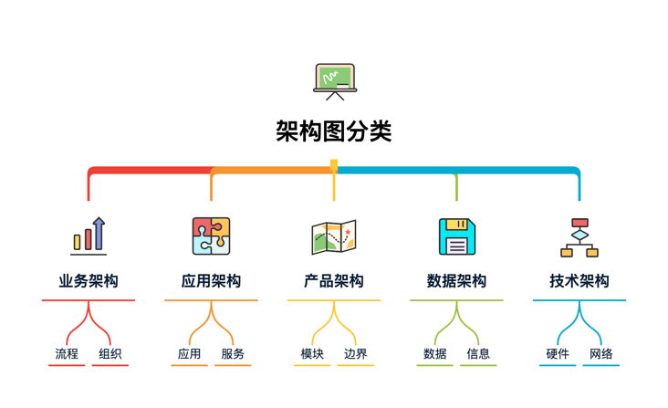

- **业务架构**：需求初期业务的结果和过程描述一般比较模糊，可能来自于某个老板、运营或用户的反馈。*客户说海尔洗衣机洗土豆会堵，海尔立马设计专门的土豆洗衣机* 业务方向往往是定方向和结果的叫`战略`，主要包括业务规划、业务模块和流程以及问题域的列表等。
- **应用架构**：服务复用、跨组协同，简单、灵活、整合是应用架构必须考虑的点，就像你要上线一个聊天功能，那么聊天内容的输入法、文字识别、舆情监控以及视频服务、支付服务等，它们都是在应用架构分层下沉淀到平台的产物，在供各个方使用。
- **产品架构**：业务提需求，产品定方案，相对于业务的粗放流程，产品架构会更加细腻以及考虑各个模块的分层和边界。
- **数据架构**：数据的获取、数据的存放和数据的使用是数据架构要解决的三个问题，数据库存放、大数据汇总、数据分析等。
- **技术架构**：是离程序员最近的架构设计，它不仅是系统搭建的架构图设计，还包括了结构、功能、流程、逻辑等内容。它的具体描述就是整个系统如何落地的具体实现方案。

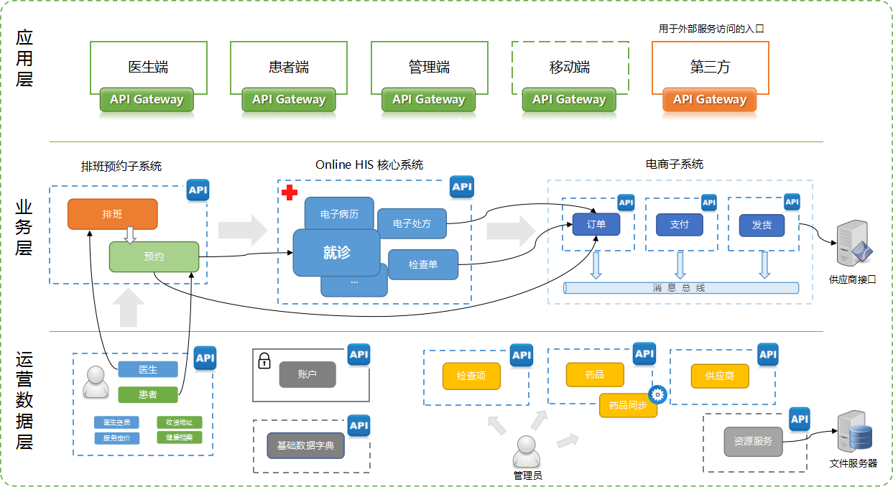

业务架构

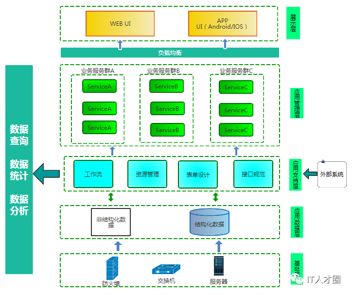

应用架构

产品架构

数据架构

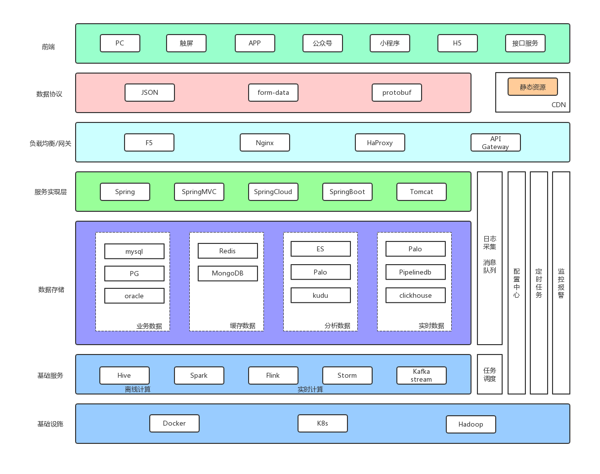

技术架构

# 技术文章配图指南

[draveness](https://draveness.me/sketch-and-sketch/)

无论是使用Photoshop还是 OmniGraffle 甚至是其它工作都能达到完全相同的效果，更加重要的是我们对于**制图规则**的思考并形成一套自洽的体系。

## 概述

作者的画图准则：

1. 图片必须足够美观并且清晰地传达想要表现的内容；
   1. 是技术博客中出现图片的意义；
2. 图片必须能够在短时间内实现量产，不影响写作的效率；
   1. 博客中的全部图片都是在写作的过程中一一绘制的，而不是最后统一完成的，所以会希望画图的时间可以尽量短，一旦画图的时间超过过长，那么整个思路就会被打断；
   2. 博客的内容和逻辑相比于图片更加重要，作者不希望在上面花费过长的时间；
3. 图片需要保证风格上的一致性，不会显得非常突兀；
   1. 图片的风格和配色对于作者来说就是签名，形成统一的风格之后会给读者留下比较深的印象；

作者推荐： Sketch（明年筹钱买一个mac）

## 画图

为技术文章绘制图片和使用PS修改图片或者为App绘制UI设计图是完全不同的，技术文章的配图主要作用还是为了辅助说明内容，相比于图片的样式，我们应该更加关注图片的内容是否清晰和简单。

图片的内容是配图时至关重要的，作者在一个问题太过复杂或者连续文字太多时，就会选择为文章插入适合的图片。作者将博客中的图片简单分成了一下三类：

1. 用于展示多个平等的概念时
2. 用于描述模块以及概念之间的关系时
3. 用于描述特定场景下概念的特性

在需要展示某个问题的多个方面、多个原因或者阶段等处于相同层次的概念时就会使用如下所示的图片：

这张图片介绍了选择版本控制系统时应该关注的三个特性：分布式、性能和可靠性，使用列表的方式也是没有问题的，这只是作者的配图习惯，而你在这篇文章稍微靠前的部分中也会看到用于展示绘图工具的插图，这些图片的内容类型都是相似的。

除了展示概念的配图之外，作者还会使用如下所示的图片来展示不同概念或者模块之间的关系，流程图、架构图等类型的图片都会被作者归到这一类中：

上述图片展示了在分布式的版本控制系统中，各个仓库之间的树形结构，图中使用不同的颜色将不同仓库在树中的高度做出了区分，这种图片能够很好地帮助读者理解各个模块之间的关系，我们在 LucidChart 一节中分享的图片其实也属于这种类型的图片，只是使用的工具不同：

除了这两种比较常见的插图类型之外，作者在遇到一些特殊问题时也会选择通过图片帮助读者理解问题，例如 [为什么 DNS 使用 UDP 协议](https://draveness.me/whys-the-design-dns-udp-tcp) 中就使用了如下所示的图片：

这张巨型图片的主要作用就是帮助读者理解 DNS 协议使用 TCP 或者 UDP 获取域名解析时所需要传输数据的大小，通过这张图片我们能够比较直观的了解不同协议在处理 DNS 协议时在数据方面的差别。

## 样式

图片的内容是它的核心价值所在，而图片的样式是决定图片是否『优雅』的关键，内容和样式之间的关系，就是 Web 前端中 HTML 和 CSS 的关系一样，我们在这一节中就详细介绍作者对于博客中图片样式的一些约定。

调色：  [Coolors](https://coolors.co/)

长宽： 宽度 1200px，长度不宜太长

字号：标题 30px，非标题字号：20 px

圆角：能用圆角就用圆角，显得柔和

# 如何创建调色板

[数据风格指南中颜色的详细指南](https://blog.datawrapper.de/colors-for-data-vis-style-guides/)

## 1. 你需要一个固定的调色板来数据可视化吗

保持调色板的颜色顺序一致有助于非设计师在快节奏的环境中创建基本图表

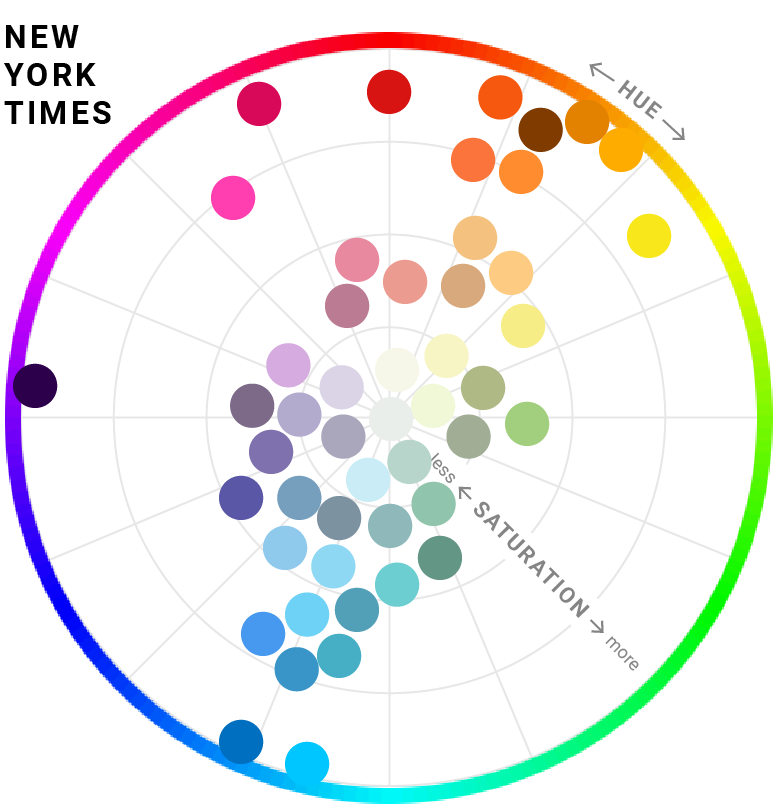

纽约时报调色板

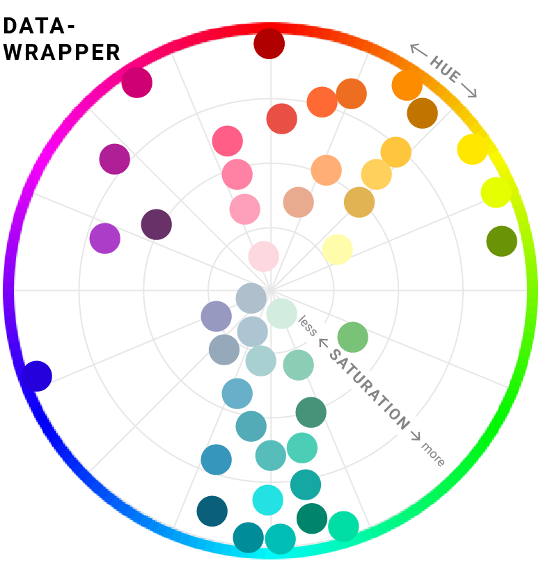

Data-Wrapper 调色板

## 2. 组织调色板的四种不同方法

### 2.1.灵活的调色板

在色轮的每个角落都有颜色，然后定义颜色顺序，虽然颜色很多，但大多数使用的颜色是洋红色和浅蓝色

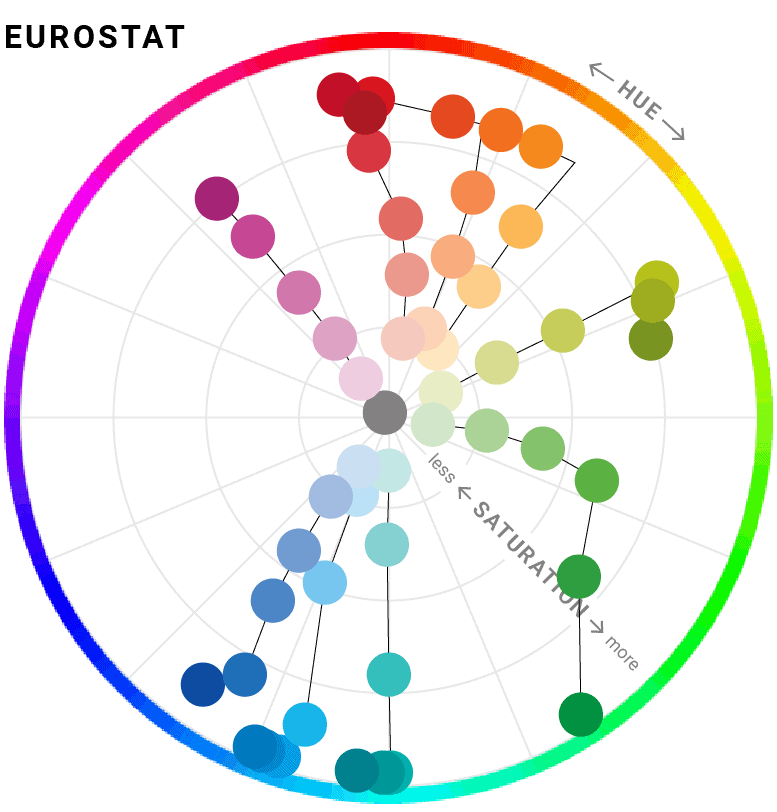

欧盟统计局颜色

### 2.2. 极少数色调

如果需要使用风多颜色，会选择这些色调的阴影，蓝红绿：

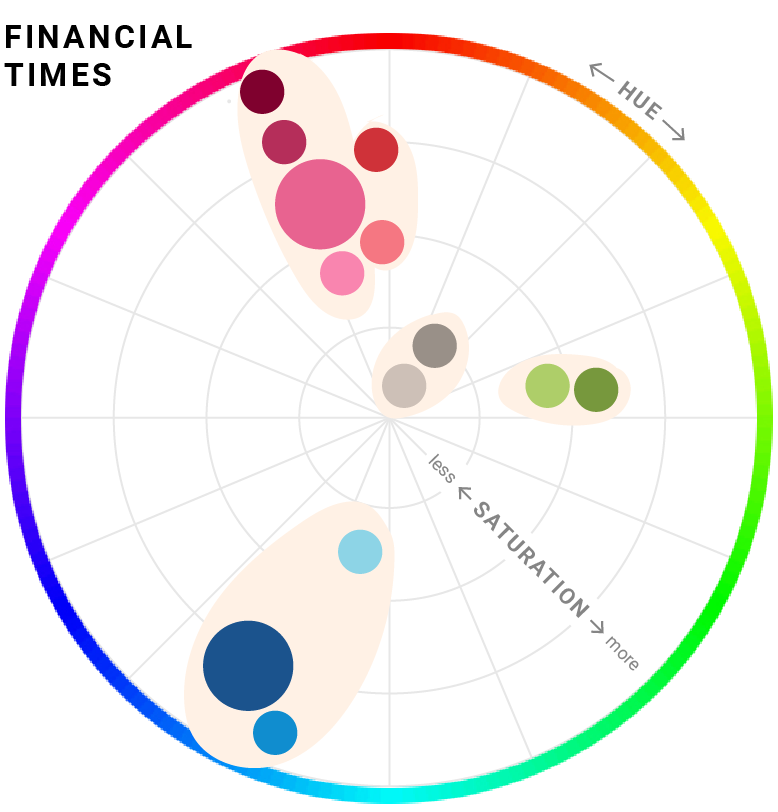

金融时报

### 2.3. 更多的色调

为每种类型选一种颜色

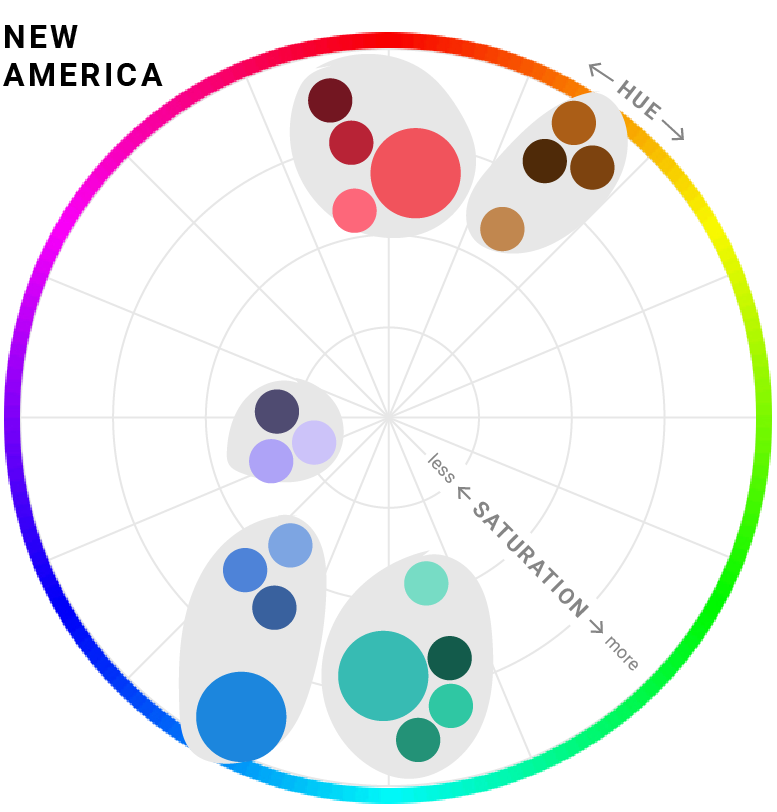

美国智库调色板

### 2.4. 极简主义者

调色板非常有限，一般以简单的条形图和折线图为主

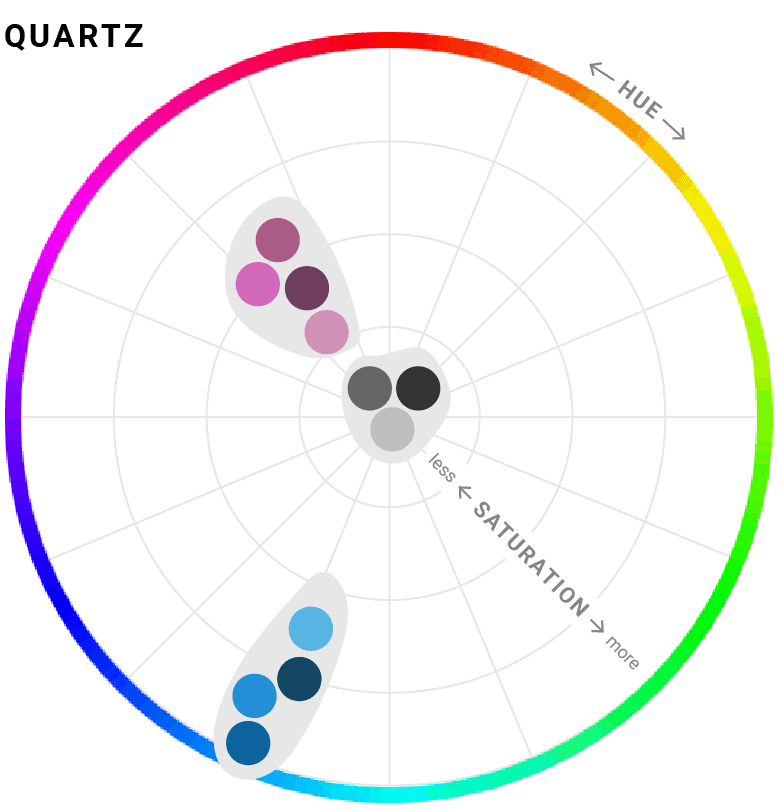

Quatz 调色板

## 3. 定义那些颜色

### 3.1. 如何为数据选择更漂亮的颜色

它们也应该是功能性的（读者易于区分）：

- 颜色应该有不同的亮度
- 颜色可以尺寸大小不一样
- 应该对色盲读者友好

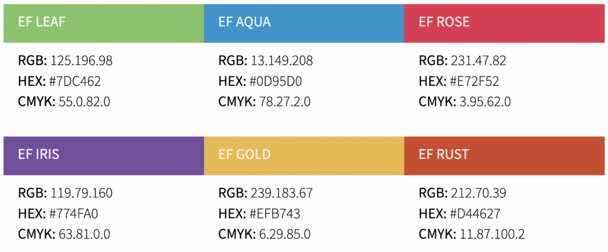

Eurofound 定义的数据分类颜色

### 3.2. 类别的阴影

在创建色调时，色调较深较浅的版本应该是有意义的，可以将这些阴影用于不太突出的部分，以强调基本顺序或区分子类别

颜色类比的阴影

### 3.3. 常见类别的颜色

- 性别：男性蓝色，女性粉色
- 无数据、其他：灰色
- 同意不同意的过渡表：两种色调，中间是灰色

### 3.4. 强调色

有些时候图表只需要一种颜色，可以用它来做强调色

### 3.5. 无数据灰色

灰色是数据可视化中的最重要的角色，需要将它来显示不太重要的数据、缺失的数据或上下文数据，纯灰色和冷灰色：RGB(163, 163, 163)`和`RGB(214, 214, 214)。如果给灰色一点颜色可以很好的与温暖和寒冷的色调进行结合，比如想要用暖色一点，可以将蓝色调小一点，比如RGB(135, 135, **113**)``RGB(207, 209, **195**)

### 3.6. 其它灰色

所有不是数据的东西都是灰色的，除了不太重要的类别之外，轴、网格线、颜色键标签、轴刻度、轴标签、等值线图中没有数据的区域、符号图中的底图和不太重要的文本都可以是灰色的

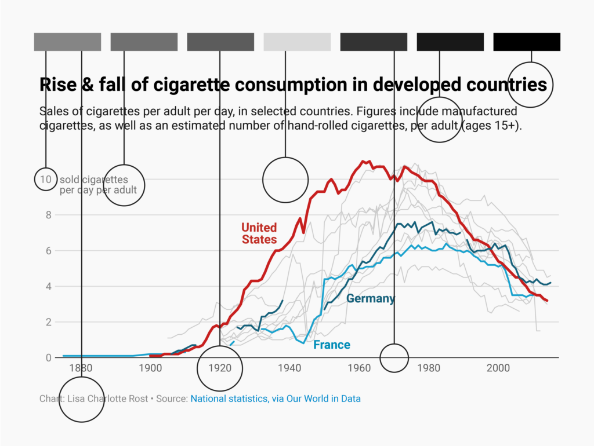

### 3.7. 连续梯度和发散梯度

需要很大的亮度范围来让你的渐变更加明显

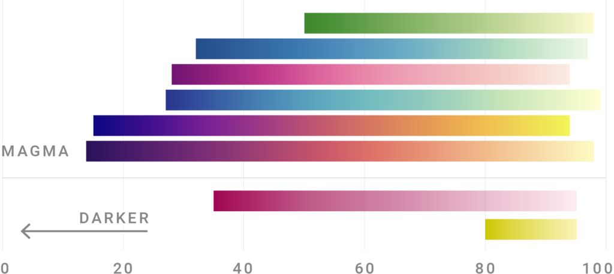

默认渐变的范围

变暗的时候应该要多暗呢，每种颜色越浅饱和度越低，，但并不是什么色调都适合当暗色调的：

- 在 15% 的亮度下，**蓝色**仍然可以达到 70% 以上的饱和度。这就是为什么那里有这么多渐变使用蓝色作为最暗的颜色
- **洋红色**在 15% 的亮度下不太容易辨认——它只有 35% 的饱和度
- **黄绿色** ⬤在如此低的亮度下只能达到 20% 的饱和度。我们在开谁的玩笑：它看起来不再像黄绿色了。它基本上看起来像一个肮脏的黑色

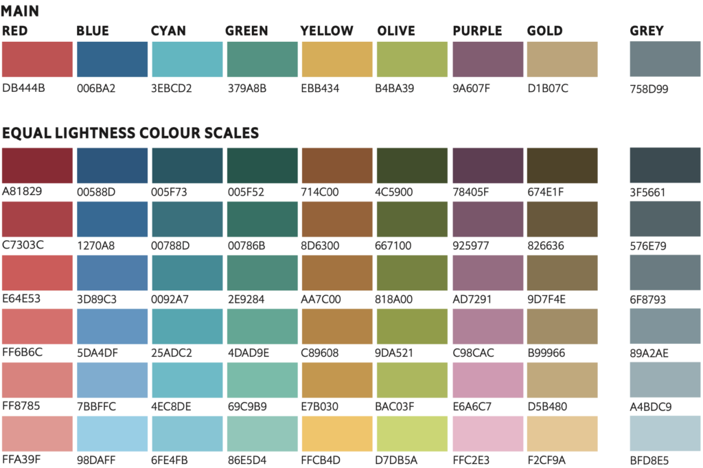

如果您的颜色需要符合无障碍指南 (WCAG2)，则您的**浅色需要相当深**

### 3.8.  地图元素

在地图上放置标记，浅色和饱和度较低的地图元素能和你的标记形成高对比度

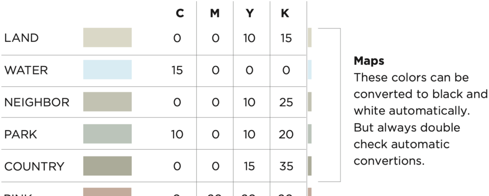

浅色地图元素

## 4. 选择颜色的注意事项

### 4.1. 调整颜色

在条形图等区域比较大的地方使用饱和度太高的颜色会不太舒服：，可以将颜色变暗并降低饱和度

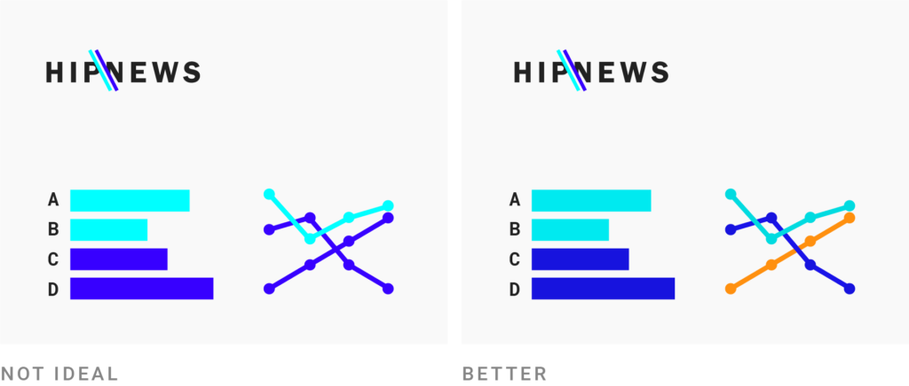

### 4.2. 使用相似氛围的颜色

这种就挺好的

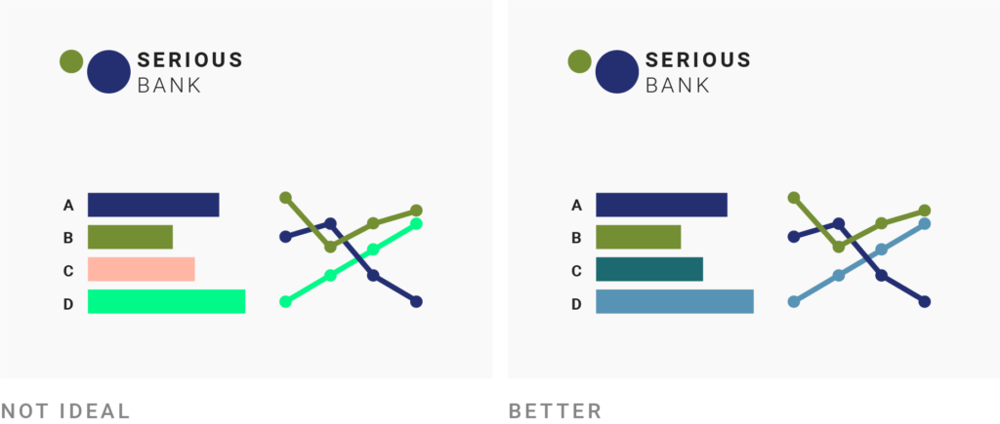

### 4.3. 调色板上应该有多少种颜色呢

没有准确答案，颜色越多选择阅读，但是难度更大，个人觉得 7 种就够了

### 4.4. 颜色顺序和组合

为了看起来连贯：

### 4.5. 颜色传达了什么情感

不同的颜色会传达不一样的价值观和情感，我果然喜欢 CALM 的

### 4.6. 满足可访问性

要对色盲友好，满足足够高的对比度

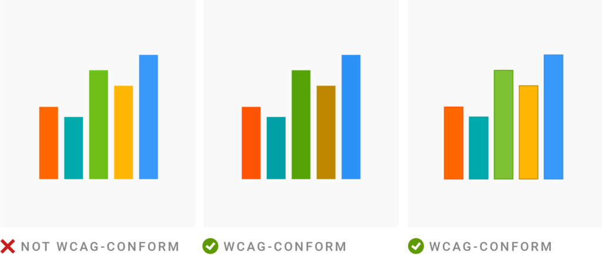

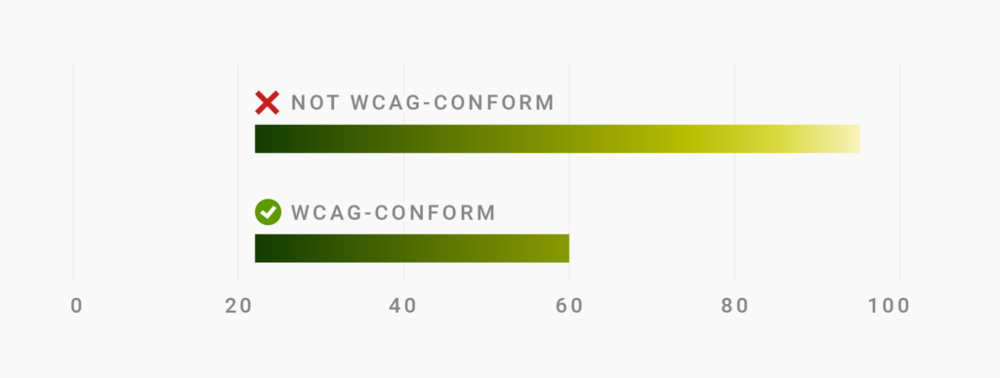

### 4.7. 大面积和小面积下的区分

应该根据颜色填充的大小，颜色的可区分性也不同，**为小区域定义更饱和的颜色，为大区域定义饱和度较低的颜色。**通常，差异可能很小：**读者会将这些颜色视为相同**。

## 
