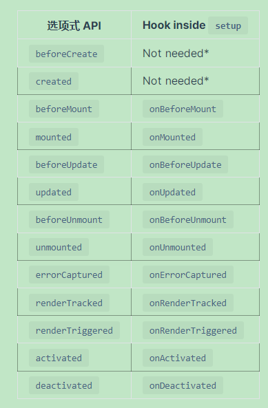
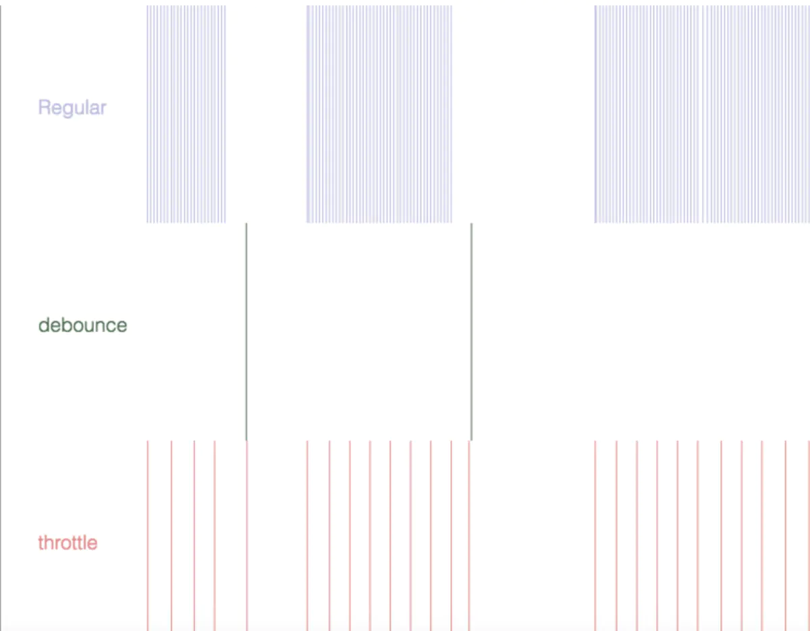

# Vue

[官方教程](https://v3.cn.vuejs.org/guide/introduction.html)

[toc]

## 基础

### 介绍

#### vue是什么

有MVVM模式的影响


Vue.js 的核心是一个允许采用简洁的模板语法来声明式地将数据渲染进 DOM 的系统，数据和DOM建立关联，所有的东西都是响应式的

`{{message}}`	绑定 DOM 文本

v-bind:title		绑定元素的 atribute

#### 处理用户输入

为了交互，v-on 指令添加一个事件监听器，eg： `v-on:click`

v-model 指令，实现表单输入和应用状态之间的双向绑定

#### 条件和循环

v-if 	判断条件，不仅可以把数据绑定到 DOM 文本或 attribute，还可以保定到DOM的结构

vue 也提供一个强大的过渡效果系统，可以在vue 插入/更新/删除元素时自动应用过渡效果

v-for	可以绑定数组的数据来渲染一个项目列表

#### 组件化应用

组件系统是 Vue 的另一个重要概念，因为它是一种抽象，允许我们使用小型、独立和通常可复用的组件构建大型应用。


在 Vue 中，组件本质上是一个具有预定义选项的实例。在 Vue 中注册组件很简单：如对 `App` 对象所做的那样创建一个组件对象，并将其定义在父级组件的 `components` 选项中

为了将数据从父组件传入子组件，修改一些组件的定义，使之能接受要给prop：

```js
app.component('todo-item', {
  props: ['todo'],
  template: `<li>{{ todo.text }}</li>`
})
```

Vue 组件与**自定义元素**非常类似——它是 [Web Components 规范](https://www.w3.org/wiki/WebComponents/)的一部分

它们之间主要的不同在于，Vue 组件的数据模型是作为框架的一部分而设计的，而该框架为构建复杂应用提供了很多必要的附加功能。例如响应式模板和状态管理——这两者都没有被该规范所覆盖。

#### vue 中涉及的字符串模板和 dom 模板

[简书，概念](https://www.jianshu.com/p/8c63c93a346b)

看官方文档的时候，多次提及字符串模板和 dom 模板，对这个模板比较模糊

- 字符串模板：字符串模板就是卸载 vue 中的 template 中定义的模板，如 .vue 的单文件组件模板和定义组件时 template 属性值的模板。字符串模板不会再页面初始化参与页面的渲染，会被 vue 进行解析编译之后再被浏览器渲染，所以不受限于 html 结构和标签的命名
- dom 模板：也称 html 模板，dom 模板就是写在 html 文件中，一打开就会被浏览器进行解析渲染，所以要遵循 html 结构和标签的命名，否则浏览器不解析也就不能获取其内容了

### 应用&组件实例

#### 创建一个组件实例

每一个vue应用都是通过用 createApp 函数创建一个应用实例开始的

该应用实例是用来在应用中注册全局组件的

应用实例暴露的大多数方法都会返回该同意实例，允许链式

#### 根组件

传递给 `createApp` 的选项用于配置**根组件**。当我们**挂载**应用时，该组件被用作渲染的起点。

与大多数应用方法不同的是，`mount` 不返回应用本身。相反，它返回的是根组件实例。

#### 组件实例 property

我们认识了 `data` property。在 `data` 中定义的 property 是通过组件实例暴露的

还有各种其他的组件选项，可以将用户定义的 property 添加到组件实例中，例如 `methods`，`props`，`computed`，`inject` 和 `setup`。我们将在后面的指南中深入讨论它们。组件实例的所有 property，无论如何定义，都可以在组件的模板中访问。

Vue 还通过组件实例暴露了一些内置 property，如 `$attrs` 和 `$emit`。这些 property 都有一个 `$` 前缀，以避免与用户定义的 property 名冲突

不要在选项 property 或回调上使用[箭头函数](https://developer.mozilla.org/en/docs/Web/JavaScript/Reference/Functions/Arrow_functions)，比如 `created: () => console.log(this.a)` 或 `vm.$watch('a', newValue => this.myMethod())`。因为箭头函数并没有 `this`，`this` 会作为变量一直向上级词法作用域查找，直至找到为止，经常导致 `Uncaught TypeError: Cannot read property of undefined` 或 `Uncaught TypeError: this.myMethod is not a function` 之类的错误。

#### 生命周期



### 模板语法

Vue.js 使用了基于 HTML 的模板语法，允许开发者声明式地将 DOM 绑定至底层组件实例的数据。所有 Vue.js 的模板都是合法的 HTML，所以能被遵循规范的浏览器和 HTML 解析器解析。

在底层的实现上，Vue 将模板编译成虚拟 DOM 渲染函数。结合响应性系统，Vue 能够智能地计算出最少需要重新渲染多少组件，并把 DOM 操作次数减到最少。

#### 插值

DOM文本使用 `{{}}` 进行查实，也可以通过使用 [v-once 指令](https://v3.cn.vuejs.org/api/directives.html#v-once)，你也能执行一次性地插值，当数据改变时，插值处的内容不会更新。但请留心这会影响到该节点上的其它数据绑定

#### 原始HTML

双大括号会将数据解释为普通文本

为了输出真正的 html，需要使用 v-html

```html
<span v-html='rawHtml'></span>
```

这个 span 的内容将会被替换成 property 值直接作为 html——会忽略解析property中的数据绑定

所以说组件更适合作为可重用和可组合的基本单位

#### Attribute

v-bind 绑定 html 的 attribute，如果绑定的值是 null 或 undefined， 那么该attribute 将不会包含在渲染的元素上

对于布尔 attribute (它们只要存在就意味着值为 `true`)

#### 使用 js 表达式

迄今为止，在我们的模板中，我们一直都只绑定简单的 property 键值。但实际上，对于所有的数据绑定，Vue.js 都提供了完全的 JavaScript 表达式支持。

每个绑定只能包含单个表达式，比如赋值语句就不会生效

#### 指令

指令 (Directives) 是带有 `v-` 前缀的特殊 attribute。指令 attribute 的值预期是**单个 JavaScript 表达式** (`v-for` 和 `v-on` 是例外情况，稍后我们再讨论)。指令的职责是，当表达式的值改变时，将其产生的连带影响，响应式地作用于 DOM。

#### 参数

一些指令能够接收一个“参数”，在指令名称之后以冒号表示。例如，`v-bind` 指令可以用于响应式地更新 HTML attribute：

```html
<a v-bind:href="url"> ... </a>
```

另一个例子是 `v-on` 指令，它用于监听 DOM 事件：

```html
<a v-on:click="doSomething"> ... </a>
```

#### 动态参数

也可以在指令参数中使用 JavaScript 表达式，方法是用方括号括起来：

```html
<!--
注意，参数表达式的写法存在一些约束，如之后的“对动态参数表达式的约束”章节所述。
-->
<a v-bind:[attributeName]="url"> ... </a>
```

这里的 `attributeName` 会被作为一个 JavaScript 表达式进行动态求值，求得的值将会作为最终的参数来使用。例如，如果你的组件实例有一个 data property `attributeName`，其值为 `"href"`，那么这个绑定将等价于 `v-bind:href`。

同样地，你可以使用动态参数为一个动态的事件名绑定处理函数：

```html
<a v-on:[eventName]="doSomething"> ... </a>
```

在这个示例中，当 `eventName` 的值为 `"focus"` 时，`v-on:[eventName]` 将等价于 `v-on:focus`

#### 修饰符

修饰符 (modifier) 是以半角句号 `.` 指明的特殊后缀，用于指出一个指令应该以特殊方式绑定。例如，`.prevent` 修饰符告诉 `v-on` 指令对于触发的事件调用 `event.preventDefault()`：

```html
<form v-on:submit.prevent="onSubmit">...</form>
```

#### 缩写

`v-bind` 缩写

```html
<!-- 完整语法 -->
<a v-bind:href="url"> ... </a>

<!-- 缩写 -->
<a :href="url"> ... </a>

<!-- 动态参数的缩写 -->
<a :[key]="url"> ... </a>
```

`v-on` 缩写

```html
<!-- 完整语法 -->
<a v-on:click="doSomething"> ... </a>

<!-- 缩写 -->
<a @click="doSomething"> ... </a>

<!-- 动态参数的缩写 (2.6.0+) -->
<a @[event]="doSomething"> ... </a>
```

#### 注意事项

动态参数预期会求出一个字符串，异常情况下值为 `null`。这个特殊的 `null` 值可以被显性地用于移除绑定。任何其它非字符串类型的值都将会触发一个警告

动态参数表达式有一些语法约束，因为某些字符，如空格和引号，放在 HTML attribute 名里是无效的。例如：

```html
<!-- 这会触发一个编译警告 -->
<a v-bind:['foo' + bar]="value"> ... </a>
```

变通的办法是使用没有空格或引号的表达式，或用[计算属性](https://v3.cn.vuejs.org/guide/computed.html)替代这种复杂表达式。

模板表达式都被放在沙盒中，只能访问一个[受限的列表](https://github.com/vuejs/vue-next/blob/master/packages/shared/src/globalsWhitelist.ts#L3)，如 `Math` 和 `Date`。你不应该在模板表达式中试图访问用户定义的全局变量。在 DOM 中使用模板时 (直接在一个 HTML 文件里撰写模板)，还需要避免使用大写字符来命名键名，因为浏览器会把 attribute 名全部强制转为小写：

```html
<!--
在 DOM 中使用模板时这段代码会被转换为 `v-bind:[someattr]`。
除非在实例中有一个名为“someattr”的 property，否则代码不会工作。
-->
<a v-bind:[someAttr]="value"> ... </a>
```

模板表达式都被放在沙盒中，只能访问一个[受限的列表](https://github.com/vuejs/vue-next/blob/master/packages/shared/src/globalsWhitelist.ts#L3)，如 `Math` 和 `Date`。你不应该在模板表达式中试图访问用户定义的全局变量。

### Data Property 和 方法

#### Data Property

组件的 `data` 选项是一个函数。Vue 在创建新组件实例的过程中调用此函数。它应该返回一个对象，然后 Vue 会通过响应性系统将其包裹起来，并以 `$data` 的形式存储在组件实例中。为方便起见，该对象的任何顶级 property 也直接通过组件实例暴露出来：

```js
const app = Vue.createApp({
  data() {
    return { count: 4 }
  }
})

const vm = app.mount('#app')

console.log(vm.$data.count) // => 4
console.log(vm.count)       // => 4

// 修改 vm.count 的值也会更新 $data.count
vm.count = 5
console.log(vm.$data.count) // => 5

// 反之亦然
vm.$data.count = 6
console.log(vm.count) // => 6
```

这些实例property仅在实例首次创建时被添加，所以你需要确保它们在 data 函数返回的对象中

直接将不包含在 data 中的新 property 添加到组件实例是可行的，但是由于不在背后的响应式 $data 对象中，所以 vue的响应式系统不会自动更新它

#### 方法

我们用 methods 选项向组件实例添加方法，它应该是一个包含所需方法的对象：

```js
const app = new Vue.createApp({
    data() {
        return {count: 4}
    }
    methods: {
    increment() {
    this.count++
}
}
})
const vm = app.mount('#app')
vm.increment()
```

vue 自动为 methods 绑定了 this，以便于它始终指向组件实例，这将确保方法在用作事件监听或者回调时保持正确的this 指向

可以直接从模板调用方法，通常换做计算属性会更好，但是在计算属性不可行的情况下，使用方法可能会很有用

#### 函数防抖和函数节流

函数防抖（debounce）：触发事件后在n秒内函数只能执行一次，如果在n秒内又触发了时间，则会重新计算函数执行时间

函数节流：限制一个函数在一定时间内只能执行一次



函数防抖的应用场景：

- 搜索框搜索输入。只需用户最后一次输入完，再发送请求
- 手机号、邮箱验证输入检测
- 窗口大小Resize。只需窗口调整完成后，计算窗口大小。防止重复渲染。

函数节流的应用场景：

- 滚动加载，加载更多或滚到底部监听
- 谷歌搜索框，搜索联想功能
- 高频点击提交，表单重复提交

函数防抖简单实现，在执行目标方法时，会等待一段时间，当又执行相同方法时，若前一个定时任务未执行完，则 clear 掉定时任务，重新定时

```js
const _.debounce = (func, wait) => {
    let timer;
    return () => {
        clearTimeout(timer)
        timer = setTimeout(func, wait)
    }
}
```

函数节流简单实现，是为了限制函数一段时间内只能执行一次。因此，通过使用定时任务，延时方法执行，在延时的时间内，方法若被触发

```js
const _.throttle = (func, wait) => {
    let timer
    return () => {
        if(timer) return
    }
    timer = setTimeout(() => {
        func();
        timer = null
    }, wait)
}
```

vue没有内置防抖和节流，可以使用 Lodash  等库实现

### 计算属性和侦听器

#### 计算属性 computed

模板内的表达式非常遍历，但是设计它们的初衷是用于简单计算的，在模板中放入太多的逻辑会让模板难以维护

所以对于任何包含响应式数据的复杂逻辑，你都应该使用计算属性

```html
<div id='computed-basics'>
    <p>
        has hublished books: 
    </p>
    <span>{{publishedBookedMessage}}</span>
</div>
```

```js
Vue.createApp({
    data() {
        return {
            author: {
                name: 'Johe Dow',
                books:['Vue 3 - basic guide']
            }
        }
    },
    computed: {
        // 计算属性的 getter
        publishedBooksMessage() {
            return this.author.books.length > 0 ? 'yes': 'no'
        }
    }
})
```

我们可以将函数定义为一个方法而不是一个计算属性，但是计算属性是基于它们的响应依赖关系缓存的，计算属性只在相关响应式依赖发生改变时它们才会重新求值，比如上例，只要authors.books 没有发生改变，多次访问函数，计算属性会立即返回之前的计算结果，而不必再次执行函数

```js
computed： {
    now() {
        return Date.now() 	// 不再更新
    }
}
```

为什么需要缓存？假设我们有一个性能开销大的计算属性 list，它需要遍历一个巨大的数组并做大量的计算，然后我们可能又其它的计算属性依赖于 list， 如果没有缓存，我们将不可避免的多次执行 list 的getter，如果不希望有缓存，用method代替

计算属性默认只有getter，不过在需要时可以提供一个setter

```js
// ...
computed: {
  fullName: {
    // getter
    get() {
      return this.firstName + ' ' + this.lastName
    },
    // setter
    set(newValue) {
      const names = newValue.split(' ')
      this.firstName = names[0]
      this.lastName = names[names.length - 1]
    }
  }
}
// ...
```

#### 侦听器

虽然计算属性在大多数情况下更合适，但有时需要一个自定义的侦听器，通过 watch 提供一个更通用的方法，来响应数据的变化

当需要在数据变化时执行异步或开销较大的操作时，这个方式是最有用的

```html
<div id = 'watch-example'>
    <p>
        ask a yes/no question
        <input v-model='question' />
        <span>{{answer}}</span>
    </p>
</div>
```

```js
const watchExampleVM = Vue.createApp({
    data() {
        return {
            question: '',
            answer: 'Questions usually contain a question mark. ;-)'
        }
    },
    watch: {
    // whenever question changes, this function will run
    	question(newQuestion, old Question) {
    		if(newQuestion.indexOf('?') > -1) this.getAnswer()
		}
	},
    methods: {
        getAnswer() {
            this.answer = 'Thinking...'
            axios
            .get('https://yesno.wtf/api')
            .then(response => {
                this.answer = response.data.answer
            })
            .catch(error => {
                this.answer = 'Error ' + error
            })
        }
    }
}).mount('#watch-example')
```

当你有一些数据需要随着其他数据变动而变动，很容易滥用watch，这时候可能有很多重复代码，更好的做法是使用计算属性而不是watch回调

### Class 与 Style 绑定

操作元素的 class 列表和内联样式是数据绑定的一个常见需求。因为它们都是 attribute，所以我们可以用 `v-bind` 处理它们：只需要通过表达式计算出字符串结果即可。不过，字符串拼接麻烦且易错。因此，在将 `v-bind` 用于 `class` 和 `style` 时，Vue.js 做了专门的增强。表达式结果的类型除了字符串之外，还可以是对象或数组。

```html
<div :class="classObject"></div>
```

```js
data() {
  return {
    isActive: true,
    error: null
  }
},
computed: {
  classObject() {
    return {
      active: this.isActive && !this.error,
      'text-danger': this.error && this.error.type === 'fatal'
    }
  }
}
```

我们可以把一个数组传给 `:class`，以应用一个 class 列表：

```html
<div :class='[activeClass, errorClass]'></div>
```

当你在带有单个根元素的自定义组件上使用 `class` attribute 时，这些 class 将被添加到该元素中。此元素上的现有 class 将不会被覆盖。

#### 绑定内联样式

```html
<div :style="styleObject"></div>
```

```js
data() {
  return {
    styleObject: {
      color: 'red',
      fontSize: '13px'
    }
  }
}
```

可以为 style 绑定中的 property 提供一个包含多个值的数组，常用于提供多个带前缀的值，例如：

```html
<div :style="{ display: ['-webkit-box', '-ms-flexbox', 'flex'] }"></div>
```

### 条件渲染

v-if 指令用于条件性的渲染一块内容，这块内容只会在指令的表达式返回 truthy 值的时候被渲染

```html
<h1 v-if='awesome'> vue</h1>
```

也可以用 v-else  添加一个 else块：

```html
<h1 v-if='test'>test</h1>
<span v-else>no test</span>
```

因为 v-if 是一个指令，所以必须将它添加到一个元素上，但是如果想切换多个元素呢？此时可以把一个 <template> 元素当作一个不可见的包裹元素，并在上面使用 v-if

v-else 元素必须紧跟在 v-if 或者 v-else-if 元素后面，否则它将不会被识别

另一个用于条件渲染的元素是 v-show，不同的是v-show始终会被渲染并被保留在 DOM 中，v-show 只是简单的切换元素的display

v-show 不支持 <template>

`v-if` 是“真正”的条件渲染，因为它会确保在切换过程中，条件块内的事件监听器和子组件适当地被销毁和重建。

`v-if` 也是**惰性的**：如果在初始渲染时条件为假，则什么也不做——直到条件第一次变为真时，才会开始渲染条件块。

相比之下，`v-show` 就简单得多——不管初始条件是什么，元素总是会被渲染，并且只是简单地基于 CSS 进行切换。

一般来说，`v-if` 有更高的切换开销，而 `v-show` 有更高的初始渲染开销。因此，如果需要非常频繁地切换，则使用 `v-show` 较好；如果在运行时条件很少改变，则使用 `v-if` 较好。

不推荐同时使用 v-if  和  v-for

### 列表渲染

v-for 把一个数组渲染成一组元素

v-for 块中可以访问所有父作用域的property，v-for 还支持一个可选的第二个参数

也可以用 of  替代 in 作为分隔符，这个更接近 JavaScript 迭代器的语法

当 Vue 正在更新使用 `v-for` 渲染的元素列表时，它默认使用“就地更新”的策略。如果数据项的顺序被改变，Vue 将不会移动 DOM 元素来匹配数据项的顺序，而是就地更新每个元素，并且确保它们在每个索引位置正确渲染。

```html
<div v-for="item in items" :key="item.id">
  <!-- content -->
</div>
```

建议在使用 v-for 时提供 key attribute

有时我们想要显示一个数组经过过滤或者排序后的版本，而不实际变更或重置原始数据，这种情况下，可以创建一个计算属性，来返回过滤或排序后的数组

类似于 `v-if`，你也可以利用带有 `v-for` 的 `<template>` 来循环渲染一段包含多个元素的内容

在自定义组件上，你可以像在任何普通元素上一样使用 `v-for`：

```html
<my-component v-for="item in items" :key="item.id"></my-component>
```

然而，任何数据都不会被自动传递到组件里，因为组件有自己独立的作用域。为了把迭代数据传递到组件里，我们要使用 props：

```html
<my-component
  v-for="(item, index) in items"
  :item="item"
  :index="index"
  :key="item.id"
></my-component>
```

不自动将 item 注入到组件里的原因是，这会使得组件与 v-for 的运作紧密耦合，明确组件数据的来源能够使组件在其它场合重复使用

```html
<div id="todo-list-example">
  <form v-on:submit.prevent="addNewTodo">
    <label for="new-todo">Add a todo</label>
    <input
      v-model="newTodoText"
      id="new-todo"
      placeholder="E.g. Feed the cat"
    />
    <button>Add</button>
  </form>
  <ul>
    <todo-item
      v-for="(todo, index) in todos"
      :key="todo.id"
      :title="todo.title"
      @remove="todos.splice(index, 1)"
    ></todo-item>
  </ul>
</div>
```

```js
const app = Vue.createApp({
  data() {
    return {
      newTodoText: '',
      todos: [
        {
          id: 1,
          title: 'Do the dishes'
        },
        {
          id: 2,
          title: 'Take out the trash'
        },
        {
          id: 3,
          title: 'Mow the lawn'
        }
      ],
      nextTodoId: 4
    }
  },
  methods: {
    addNewTodo() {
      this.todos.push({
        id: this.nextTodoId++,
        title: this.newTodoText
      })
      this.newTodoText = ''
    }
  }
})

app.component('todo-item', {
  template: `
    <li>
      {{ title }}
      <button @click="$emit('remove')">Remove</button>
    </li>
  `,
  props: ['title'],
  emits: ['remove']
})

app.mount('#todo-list-example')
```

### 事件处理

我们可以通过 v-on 指令（缩写为 @） 来监听 dom 事件

除了直接绑定到一个方法，也可以在内联 JavaScript 语句中调用方法：

```html
<div id="inline-handler">
  <button @click="say('hi')">Say hi</button>
  <button @click="say('what')">Say what</button>
</div>
```

```js
Vue.createApp({
  methods: {
    say(message) {
      alert(message)
    }
  }
}).mount('#inline-handler')
```

有时候需要在内联语句处理器中访问原始的dom事件，可以用特殊变量 $event 把它传入方法

事件处理其中可以有多个方法，这些方法由逗号运算符分隔：

```html
<!-- 这两个 one() 和 two() 将执行按钮点击事件 -->
<button @click="one($event), two($event)">
  Submit
</button>
```

在事件处理程序中调用 `event.preventDefault()` 或 `event.stopPropagation()` 是非常常见的需求。尽管我们可以在方法中轻松实现这点，但更好的方式是：方法只有纯粹的数据逻辑，而不是去处理 DOM 事件细节。

为了解决这个问题，Vue.js 为 `v-on` 提供了**事件修饰符**。之前提过，修饰符是由点开头的指令后缀来表示的。

- `.stop`
- `.prevent`
- `.capture`
- `.self`
- `.once`
- `.passive`

使用修饰符时，顺序很重要；相应的代码会以同样的顺序产生。因此，用 `v-on:click.prevent.self` 会阻止所有的点击，而 `v-on:click.self.prevent` 只会阻止对元素自身的点击。

按键修饰符

系统修饰符

鼠标按钮修饰符

使用 `v-on` 或 `@` 有几个好处：

1. 扫一眼 HTML 模板便能轻松定位在 JavaScript 代码里对应的方法。
2. 因为你无须在 JavaScript 里手动绑定事件，你的 ViewModel 代码可以是非常纯粹的逻辑，和 DOM 完全解耦，更易于测试。
3. 当一个 ViewModel 被销毁时，所有的事件处理器都会自动被删除。你无须担心如何清理它们。

### 表单输入绑定

你可以用 v-model 指令在表单 `<input>`、`<textarea>` 及 `<select>` 元素上创建双向数据绑定。它会根据控件类型自动选取正确的方法来更新元素。尽管有些神奇，但 `v-model` 本质上不过是语法糖。它负责监听用户的输入事件来更新数据，并在某种极端场景下进行一些特殊处理。

#### 复选框

单个复选框，绑定到布尔值

```html
<input type="checkbox" id="checkbox" v-model="checked" />
<label for="checkbox">{{ checked }}</label>
```

多个复选框，绑定到同一个数组

```html
<div id="v-model-multiple-checkboxes">
  <input type="checkbox" id="jack" value="Jack" v-model="checkedNames" />
  <label for="jack">Jack</label>
  <input type="checkbox" id="john" value="John" v-model="checkedNames" />
  <label for="john">John</label>
  <input type="checkbox" id="mike" value="Mike" v-model="checkedNames" />
  <label for="mike">Mike</label>
  <br />
  <span>Checked names: {{ checkedNames }}</span>
</div>
```

```js
Vue.createApp({
  data() {
    return {
      checkedNames: []
    }
  }
}).mount('#v-model-multiple-checkboxes')
```

#### 单选框

```html
<div id="v-model-radiobutton">
  <input type="radio" id="one" value="One" v-model="picked" />
  <label for="one">One</label>
  <br />
  <input type="radio" id="two" value="Two" v-model="picked" />
  <label for="two">Two</label>
  <br />
  <span>Picked: {{ picked }}</span>
</div>
```

```js
Vue.createApp({
  data() {
    return {
      picked: ''
    }
  }
}).mount('#v-model-radiobutton')
```

#### 选择框

```html
<div id="v-model-select" class="demo">
  <select v-model="selected">
    <option disabled value="">Please select one</option>
    <option>A</option>
    <option>B</option>
    <option>C</option>
  </select>
  <span>Selected: {{ selected }}</span>
</div>
```

```js
Vue.createApp({
  data() {
    return {
      selected: ''
    }
  }
}).mount('#v-model-select')
```

### 组件基础

组件是带有名称的可复用实例，可以将组件进行任意次的服用

组件有两种注册类型：全局注册和局部注册，全局注册可以在应用中的任何组件的模块中使用

#### 通过prop向子组件传递数据

一个组件默认可以拥有任意数量的 prop，无论任何值都可以传递给 prop，可以使用 `v-bind` 来动态传递 prop。

```html
<div id="blog-post-demo" class="demo">
  <blog-post title="My journey with Vue"></blog-post>
  <blog-post title="Blogging with Vue"></blog-post>
  <blog-post title="Why Vue is so fun"></blog-post>
</div>
```

#### 监听子组件事件

我们可以在组件的 `emits` 选项中列出已抛出的事件：

```js
app.component('blog-post', {
  props: ['title'],
  emits: ['enlargeText']
})
```

子组件可以通过内建的 $emit 方法并传入事件名称来触发一个事件

```html
<button @click = '$emit("enlargeText")'>
    enlarge text
</button>
```

#### 在组件上使用 v-model

```html
<input v-model='searchText' />
```

等价于

```html
<input :value = 'searchText' @input='searchText = $event.target.value' />
```

当用在组件上时，v-model 则会这样：

```html
<custom-input
   :model-value='searchText'
   @update:model-value='searchText=$event'></custom-input>
```

为了让它正常工作，这个组件内的 input 必须：

- 将其 value attribute 绑定到一个名为 modelValue 的 prop 上
- 在其 input 事件被触发时，将新的值通过自定义的 update:modelvalue 事件抛出

代码如下：

```js
app.component('custom-input', {
  props: ['modelValue'],
  emits: ['update:modelValue'],
  template: `
  	<input
  		:value="modelValue"
  		@input="$emit(('update:modelValue'), $event.target.value)"
  `
})
```

现在 v-model 就可以在这个组件上完美的工作起来了

```js
<custom-input v-model='searchText'></custom-input>
```

#### 通过插槽分发内容

和 HTML 元素一样，我们经常需要向一个组件传递内容：

```html
<alert-box>something bad happened</alert-box>
```

这可以通过使用 Vue 的自定义 <slot> 元素来实现

```js
app.component('alert-box', {
  template:`
  	<div class='demo-alert-box'>
  	<strong>Error!</strong>
  	<slot></slot>
  	</div>
  `
})
```

我们使用 <slot> 作为我们想要插入内容的占位符

#### 动态组件

在不同组件之间进行动态切换是非常有用的，这可以通过  Vue 的 <component> 元素加一个特殊的 is attribute 来实现：

```html
<component :is='currentTabComponent'></component>
```

#### 解析 DOM 模板时的注意事项

如果想在 DOM直接书写 Vue 模板，Vue 将不得不从 DOM 中获取字符串。这会因为浏览器的原生 HTML 解析行为而导致一些小问题

- 元素位置受限：有些 HTML 元素，诸如 `<ul>`、`<ol>`、`<table>` 和 `<select>`，对于哪些元素可以出现在其内部是有严格限制的
- 大小写不敏感：HTML attribute 名不区分大小写，这时候应该使用 - 来命名


## 深入组件

### 组件注册

组件名：在注册一个组件的时候，我们始终需要给它一个名字，它就是 app.component 的第一个参数，建议组件名全部小写，如果有多个单词则用连字符符号连接

```js
Vue.component('my-component-name', {...})
```

组件名大小写，在定义组件名的方式有两种，一种是连字符（kebab-case），一种是驼峰法（PascalCase），当使用 PascalCase定义一个组件时，你在引用这个自定义元素时两种命名法都可以使用。也就是 <my-component-name> 和 <MycomponentName> 都可接受。但是在 DOM 中使用时只有 kebab-case 有效

#### 全局注册和局部注册

到目前为止，我们只用过 app.component 来创建组件：

```js
Vue.createApp({...}).component('my-component-name', {...})
```

这些组件是全局注册的，也就是说它们注册之后可以用在任何新创建的组件实例的模板中

全局注册往往是不够理想的。比如你使用一个像 webpack 这样的构建系统，全局注册所有的组件意味着即便你已经不再使用其中一个组件了，它仍然会被包含在最终的构建结果中，造成代码的无谓增加

在这些情况下，你可以通过一个普通的 JavaScript 对象来定义组件：

```js
const app = Vue.createApp({
  components: {
    'component-a': ComponentA,
    'component-b': ComponentB
  }
})
```

注意局部注册的组件在其子组件中不可用

#### 模块系统

如果你使用了诸如 Babel 和 webpack 的模块系统，在这些情况下，我们推荐创建一个 components 目录，并将每个组件放置在各自的文件中：

```js
import ComponentA from './ComponentA'
import ComponentB from './ComponentB'

export default{
  components: {
    ComponentA,
    ComponentB
  }
  // ...
}
```

### Props

#### Prop 类型

目前为止，我们只看到了以字符串数组形式列出的 prop，但是通常希望每个 prop 都有指定的值类型，这时候你可以对象的形式列出 prop：

```js
props: {
  title: String,
  likes: Number,
  isPublished: Boolean,
  commentIds: Array,
  author: Object,
  callback: Function,
  contactsPromise: Promise // 或任何其他构造函数
}
```

#### 传递静态或动态的 Prop

传入静态的值：

```html
<blog-post title='My journey with Vue'></blog-post>
```

传入动态的值：

```html
<blog-post :title='post.title'></blog-post>
```

传入要给数字，即使数字是静态的，但我们仍需要告诉 Vue 这是一个 JS 表达式，而不是一个字符串：

```html
<blog-post :likes="42"></blog-post>
```

传入一个布尔值，同数字：

```html
<blog-post :is-published='false'></blog-post>
```

传入一个数组，对象，同数字

如果想要将一个对象的所有 property 都作为 prop 传入，可以使用不带参数的 v-bind：

```js
post: {
  id: 1,
  title: ',,,'
}
```

```html
<blog-post v-bind="post"></blog-post>
```

等价于：

```html
<blog-post v-bind:id="post.id" v-bind:title='post.title'></blog-post>
```

#### 单向数据流

所有的 prop 都使得其父子 prop 之间形成了一个单向下行绑定：父级 prop 的更新会向下流动到子组件中，但是反过来则不行。这样会防止从子组件意外变更父级组件的状态，从而导致你的应用的数据流动难以理解。

另外，每次父级组件发生变更时，子组件中所有的 prop 都将会刷新为最新的值。这意味着你不应该在一个子组件内部改变 prop

常见的试图变更一个 prop 的情况：

- 这个 prop 用来传递一个初始值，这个子组件接下来希望将其作为一个本地的 prop 数据来使用，在这种情况下，最好定义一个本地 data property 并将这个 prop 作为其初始值
- 这个 prop 以一种原始的值传入且需要进行转换。在这种情况下，最好使用这个 prop 的值来计算一个计算属性

#### prop 验证

我们可以为组件的 prop 只当验证要求：

```js
app.component('my-component', {
  props: {
    // 基础的类型检查（`null` 和 `undefined` 会通过任何类型的验证
    propA: Number,
    porpB: [String, Number],
    // 必填的字符串
    propC: {
      type: String,
      required: true
    },
    // 带有默认值的对象
    propE: {
      type: Object,
      // 对象和数组的默认值必须从要给工厂函数返回
      default() {
        retrun {message: 'hello'}
      }
    },
    // 自定义验证函数
    propF: {
      validator(value) {
        // 这个值必须与下列字符串中的其中一个相匹配
        return ['success', 'warning', 'danger'].includes(value)
      }
  	},
    // 具有默认值的函数
    propG: {
      type: Function,
      default() {
        return 'Default function'
      }
    }
})
```

#### 非 Prop 的 Attribute

一个非 prop 的 attribute 是指向一个组件，但是该组件并没有相应 props 或 emits 定义 attribute。常见的示例包括 class、style 和 id  attribute。可以通过 $property 访问那些 attribute

#### Attribute 继承

当组件返回单个根节点时，非 prop 的 attribute 将自动添加到根节点的 attribute 中。例如，在 date-picker 组件的实例中：

```js
app.component('date-picker', {
  template `
  	<div class='date-picker'>
  		<input type='datetime-local' />
  	</div>
  `
})
```

如果我们需要通过 data-status attribute 定义 <data-picker> 组件的状态，它将应用于根节点

```html
<!-- 具有非 prop 的 attribute 的 data-picker 组件 -->
<date-picker data-status='activated'></date-picker>
<!-- 渲染后的 date-picker 组件 -->
<div class='date-picker' data-status='activated'>
  <input type='datetime-local' />
</div>
```

同样的规则也适用于事件监听器

如果你不希望组件的根元素继承 attribute，可以在组件的选项中设置 inheritAttrs: false。禁用 attribute 继承的常见场景是需要将 attribute 应用于根节点之外的其他元素

与单个根节点组件不同，具有多个根节点的组件不具有自动 attribute 行为。如果未显示绑定 $attr，将发出运行时警告

#### 自定义事件并验证

```js
app.component('custom-form', {
  emits: {
    // 没有验证
    clikc: null,
    // 验证 submit 事件
    submit: ({email, password}) => {
      if(email && password) {
        return true
      } else {
        console.warn('Invalid submit event payload!')
        return false
      }
    }
  },
  methods: {
    submitForm(email, password) {
      this.$emit('submit', {email, password})
    }
  }
})
```

#### v-model 参数

默认情况下，组件上的 v-model 使用 modelValue 作为 prop 和 update:modelValue 作为事件，我们可以通过向 v-model 传递参数来修改这些名称：

```html
<my-component v-model:title='title'></my-component>
```

在本例中，子组件将需要一个 title prop 并发出 update:title 事件来进行同步:

```js
app.component('my-component', {
  props: {
    title: String
  },
  emits: ['update:title'],
  template: `
  	<input type='text' :value='title' @input="$emit('update:title', $event.target.value)"
  `
})
```

### 插槽

#### 插槽内容

Vue 实现了一套内容分发的 API，这套 API 的涉及灵感源自 web components 的规范草案，将 <slot> 元素作为承载分发内容的出口

```html
<!-- 合成组件示例 -->
<todo-button> add to </todo-button>
<!-- todo-button 组件模板 -->
<button>
  <slot></slot>
</button>
<!-- 组件渲染时，<slot></slot> 将会被替换成 ‘add to’ -->
<!-- 渲染 HTML -->
<button>
  add to
</button>
```

除了字符串，插槽还可以包含任何模板代码，包括 HTML 或其它组件，如果 template 中没有包含一个 <slot> 元素，则该组件和结束标签的任何内容都会被抛弃

#### 渲染作用域

当你想在一个插槽中使用数据时，该插槽可以访问与模板其余部分相同的实例 property（即相同的作用域）


父级模板里的所有内容都是在父级作用域中编译的，子模版里的所有内容都是在子作用域中编译的

#### 备用内容

有时为一个插槽指定备用（也就是默认的）的内容是很有用的，它只会在没有提供内容的时候被渲染，例如：

```html
<button type='submit'>
  <slot>submit</slot>
</button>
```

#### 具名插槽

有时我们需要多个插槽，例如对于一个带有如下模板的 <base-layout> 的组件：

```html
<div class="container">
  <header>
    <!-- 我们希望把页头放这里 -->
  </header>
  <main>
    <!-- 我们希望把主要内容放这里 -->
  </main>
  <footer>
    <!-- 我们希望把页脚放这里 -->
  </footer>
</div>
```

<slot> 元素有一个特殊的 attribute：name。通过它可以为不同的插槽分配独立的 ID，也就是能够以此来决定内容应该渲染到什么地方：

```html
<div class="container">
  <header>
    <slot name="header"></slot>
  </header>
  <main>
    <slot></slot>
  </main>
  <footer>
    <slot name="footer"></slot>
  </footer>
</div>
```

一个不带 name 的 <slot> 出口会带有隐含的名字 default

#### ，，，

### Provide/Inject

通常，当我们需要从父组件向子组件传递数据时，我们使用 props。想象一下这样的结构，有一些深度嵌套的组件，而深层的子组件只需要父组件的部分内容，在这种情况下，如果仍然将 prop 沿着组件链逐级传递下去，可能会很麻烦

对于这种情况，我们可以使用一对 provide 和 inject。无论组件层次结构有多深，父组件都可以作为其所有子组件的依赖提供者。这个特性有两个部分：父组件有一个 provide 选项来提供数据，子组件有一个 inject 选项来开始使用这些数据


例如，我们有这样的层次结构：

```text
Root
└─ TodoList
   ├─ TodoItem
   └─ TodoListFooter
      ├─ ClearTodosButton
      └─ TodoListStatistics
```

如果要将 todo-items 的长度直接传递给 `TodoListStatistics`，我们要将 prop 逐级传递下去：`TodoList` -> `TodoListFooter` -> `TodoListStatistics`。通过 provide/inject 的方式，我们可以直接执行以下操作：

```js
const app = Vue.createApp({})
app.component('todo-list', {
  data() {
    return {
      todos: ['feed a cat', 'buy tickets']
    }
  },
  provide: {
    user: 'John Doe'
  },
  template: `
  	<div>
  		{{todo.lentth}}
  		<!-- 模板其余部分 -->
  	</div>
  `
})
app.component('todo-list-statistics', {
  inject: ['user'],
  created() {
    console.log(this.user)
  }
})
```

但是，如果我们尝试在此处 provide 一些组件的实例 property，这将是不起作用的，要访问组件实例 property，我们需要将 provide 转换为返回对象的函数：

```js
app.component('todo-list', {
  data() {
    return {
      todos: ['feed a cat', 'bug tickets']
    }
  },
  provide() {
    return {
      todoLength: this.todos.length
    }
  }
})
```

这使得我们能够更安全地继续开发该组件，而不必单行可能会更改/删除子组件所依赖的某些内容。这些组件之间的接口仍然是明确定义的，就像 prop 一样

实际上，可以将依赖诸如看作是“长距离的prop”，除了：

- 父组件不需要知道哪些子组将使用了它 provide 的 property
- 子组件不需要知道 inject 的 property 来自哪里

#### 处理响应式

在上面的例子中，如果我们更改了 todos 的列表，这个变化并不会反映在 inject 的 todoLength property 中。这是因为默认情况下，provide/inject 绑定并不是响应式的。我们可以通过传递一个 ref property 或 reactive 对象给 provide 来改变这种行为。在例子中，如果我们相对祖先中的更改做出响应，我们需要为 provide 的 todolength分配一个组合式 API computed property：

```js
app.component('todo-list', {
  //...
  provide() {
    return {
      todoLength: Vue.computed(() => this.todos.length)
    }
  }
})
app.component('todo-list-statistics', {
  inject: ['todoLength'],
  created() {
    console.log(`Injected property: ${this.todoLength.value}`)
  }
})
```

在这种情况下，任何对 todos.length 的改变都会被正确地反映在诸如 todoLength 的组件中

### 动态组件 & 异步组件

#### 在动态组将上使用 keep-alive

重新创建一个动态组件的行为通常是非常有用的，但是有些时候我们更希望组件实例能在它们第一次被创建的时候缓存下来，为了解决这个问题，我们可以使用 <keep-alive> 元素将其动态组件包裹起来

```html
<keep-alive>
	<component :is='currentTabComponent'></component>
</keep-alive>
```

#### 异步组件

在大型应用中，我们可能需要将一个应用分割成一些小的的代码块，并且只在需要的时候才从服务器加载一个模块。为了实现这个效果，Vue 有一个 defineAsyncComponent 方法：

```js
const {createApp, defineAsyncComponent}  = Vue
const app = createApp({})
const AsyncComp = defineAsyncComponent(
	() => {
   	new Promise((resolve, reject) => {
      resolve({
        template: '<div> I am async!</div>'
      })
    }) 
  }
)
app.component('async-example', AsyncComp)
```

在局部注册组件时，你也可以使用 defineAsyncComponent:

```js
import {createApp, defineAsyncComponent} from 'vue'
createApp({
  // ...
  components: {
    AsyncComponent: defineAsyncComponent(() => import ('./AsyncComponent.vue'))
  }
})
```

#### 与 Suspense 一起使用

异步组件在默认情况下是可挂起的。这意味这它在父链中有一个 <Suspense>，它将被视为该 <Suspense> 的异步依赖。在这种情况下，加载状态将由 <Suspense> 控制，组件自身的加载、错误、延迟和超时选项都将被忽略

### 模板引用

尽管存在 prop 和事件，但有时你可能仍然需要在 JavaScript 中直接访问子组件。为此，可以使用 `ref` attribute 为子组件或 HTML 元素指定引用 ID

如果你希望在组件挂载时，以编程的方式 focus 到这个 input 上：

```js
const app = Vue.createApp({})
app.compoennt('base=input', {
  template: `
  	<input ref='input' />
  `,
  methods: {
    focusInput() {
      this.$refs.input.focus()
    }
  },
  mounted() {
    this.focusInput()
  }
})
```

此外，还可以向组件本身添加另一个 ref，并使用它从父组件触发 focusInput 事件：

```html
<base-input ref='usernameInput'></base-input>
```

```js
this.$refs.usernameInput.forcusInput()
```

$refs 只会在组件渲染完成之后才生效，这仅仅是一个直接操作子组件的备选方案

### 处理边界情况

#### 控制更新

得益于其响应性系统，Vue 总是知道何时更新（如果你使用正确的话），但是在某些边缘情况下，你可能希望强制更新，尽管事实上没有任何响应式数据发生更新。还有一些情况下，你可能希望防止不必要的更新

#### 强制更新

如果你发现自己需要在 Vue 中强制更新，那么在 99.99% 的情况下，你已经在某个地方犯了错误。例如，你可能依赖于 Vue 响应系统未更新的状态，比如在组件创建之后添加了 data 属性

但是，如果你排除上述情况，必须强制更新，那么你可以使用 $forceUpdate

#### 低级静态组件与 v-once

在 Vue 中渲染 HTML 元素的速度非常快，但有时你可能有一个包含很多静态内容的组件。在这些情况下，可以通过向根元素添加 v-once 只能过来确保只求值一次:

```js
app.component('terms-of-service', {
  template: `
  	<div v-once> title </div>
  `
})
```

提醒，不要过度使用这种模式。虽然在需要渲染大量静态内容的极少数情况下使用这种模式会很方便，但除非你注意到先前的渲染速度很慢，否则就没有必要这样做——另外，过度使用这种模式可能会在以后引起很多混乱。例如，假设另一个开发人员不熟悉 `v-once` 或者没有在模板中发现它，他们可能会花上几个小时来弄清楚为什么模板没有正确更新。

## 过渡&动画概述

Vue 提供了一些抽象概念，可以帮助处理过渡和动画，特别是在响应某些变化时。这些抽象的概念包括：

- 组件进入和离开 DOM 的钩子时，在 CSS 和 JS 中均可用，使用内置的 <transition> 组件
- 过渡模式，以便你在过渡期间编排顺序
- 处理多个元素就地更新的钩子，使用 <transition-gruop> 组件，通过 FLIP 技术来提高性能
- 使用 watchers 来处理应用中不同状态的过渡

### 基于 class 的动画和过渡

尽管 <transition> 组件对于组件的进入和离开非常有用，但你也可以通过添加一个条件 class 来激活动画，而无需挂载组件：

```html
<div id="demo">
  Push this button to do something you shouldn't be doing:<br />

  <div :class="{ shake: noActivated }">
    <button @click="noActivated = true">Click me</button>
    <span v-if="noActivated">Oh no!</span>
  </div>
</div>
```

```css
.shake {
  animation: shake 0.82s cubic-bezier(0.36, 0.07, 0.19, 0.97) both;
  transform: translate3d(0, 0, 0);
  backface-visibility: hidden;
  perspective: 1000px;
}

@keyframes shake {
  10%,
  90% {
    transform: translate3d(-1px, 0, 0);
  }

  20%,
  80% {
    transform: translate3d(2px, 0, 0);
  }

  30%,
  50%,
  70% {
    transform: translate3d(-4px, 0, 0);
  }

  40%,
  60% {
    transform: translate3d(4px, 0, 0);
  }
}
```

```js
const Demo = {
  data() {
    return {
      noActivated: false
    }
  }
}

Vue.createApp(Demo).mount('#demo')
```

#### 过渡与 Style 绑定

一些过渡效果可以通过插值的方式来实现，例如在发生交互时将样式绑定到元素上

#### 性能

动画中使用了 transforms 之类的东西，并应用了诸如 perspective之类的奇怪的 property，为什么它们是这样实现的呢，而不是仅仅使用margin 和 top ？

通过关注性能表现，我们可以在 web 上创建极其流畅的动画，我们希望尽可能对元素动画进行硬件加速，并使用不触发重绘的 property

#### Transform 和 Opacity

更改 transform 不会触发任何几何形状变化或绘制。这意味着该操作可能是由合成器线程在 GPU 的帮助下执行。`opacity` 属性的行为也类似。因此，他们是在 web 上做元素移动的理想选择。

#### ，，，

## 可复用&组合

### 组合式 API

通过创建 Vue 组件，我们可以将界面中重复的部分连同其功能一起提取为重复的代码段。仅此一项就可以使我们的应用在可维护性和灵活性方面走得相当远，然而，光靠这一点可能并不够，想象几百个组件，处理这样的大型应用时，共享和重用代码就变得尤为重要。

使用（data、computed、methods、watch）组件选项来组织逻辑通常都是很有效的，然而，当我们的组件开始变得更大时，逻辑关注点的列表也会增加。尤其是对于刚开始没有编写这些组件的人来说，这会导致组件的难以阅读和理解


这种碎片化使得理解和维护复杂组件变得困难。选项的分离掩盖了潜在的逻辑问题。此外，在处理单个逻辑关注点时，我们必须不断地跳转相关代码的选项块，如果能够将同一个逻辑关注点相关代码收集在一起会更好，而这正是组合式 API 让我们能够做到的

#### 组合式 API 基础

为了开始使用组合式 API，我们受限需要一个可以实际使用它的地方，在 Vue 组件中，我们将此位置称为 setup

新的 setup 选项在组件创建之前执行，一旦 props 被解析，就将作为组合式 API 的入口。在 Setup 中你应该避免使用 this，因为它不会找到组件实例。setup 的调用发生在 data property、computed property 或 methods 被解析之前，所以它们无法在 setup 中被获取

setup 选项是一个接受 props 和 context 的函数，此外，setup 返回的所有内容都暴露给组件的其余部分（计算属性、方法、生命周期钩子等等）以及组件的模板


## 其它

### npm run dev 和 npm run serve 的区别

npm run dev 是 vue-cli2.0 版本使用的，npm run serve 是 vue-cli3.0 版本使用的

**vue-cli2.0：**

```"scripts":
  "dev": "webpack-dev-server --inline --progress --config build/webpack.dev.conf.js",
  "start": "npm run dev",
  "build": "node build/build.js"
}
复制代码
```

**vue-cli3.0：**

```"scripts":
    "serve": "vue-cli-service serve --open",
    "build": "vue-cli-service build",
	"lint": "vue-cli-service lint"
}
```


遇到一个问题，使用 npm run serve 命令可以启动项目，但会包找不到路径的错误，最后使用 npm run dev 终于解决(使用 npm start 也不行，跳出页面不大对)，以下是配置文件

```json
  "scripts": {
    "serve": "vue-cli-service serve",
   
    "dev": "npm run ready && concurrently \"npm run serve -- --open\" \"npm run route watch\"",

    "start": "node bin/my start",

  },
```

还是没搞懂，以后启动注意使用的脚手架版本，虽然脚本里面有这个命令，但是的确不一定能启动起来