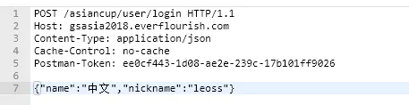

# 	图解HTTP

[toc]

## temp, 第一遍大概的看了一些

TCP/IP： 应用层、传输层、网络层、数据链路层

http请求	分割，标记序号和端口号	MAC地址

IP地址的两个重要的条件： IP地址和MAC地址（Media Access Control Access）

ip地址是节点被分配的地址，mac地址是网卡所属的固定地址

ARP协议凭借 MAC地址进行通信，根据通信方的 ip地址就可以反查出对应的 mac地址

tcp提供可靠的字节流服务，为了准确的将数据送到目标，tcp协议采用了三次握手策略： 标有syn的数据包发给你了， 我收到你发给我的数据包了（syn/ack的数据包），明白（发送ack的数据包）

DNS（domain name system）服务是和http协议一样位于应用层的协议，它提供域名到ip地址之间的解析服务： 我想访问某网页，把它的IP告诉我吧， 它是xx， 我向xx发送请求了

http协议的职责是生成针对目标web服务器的http请求报文

URI  和 URL(uniform resource locator)

请求报文的构成：方法、uri、协议版本、请求首部字段、内容实体

响应报文的构成：协议版本 状态码 原因短语 响应首部字段 主体

http是一种不保存状态的协议，但是有了Cookie就可以管理状态了

HTTP方法： get：我想访问你的某个资源啊   post：我要把这条信息告诉你	put：我要把这份文件传给你	head：把那个相关的信息告诉我	delete：快把那份文件删掉吧	options：你支持哪些方法哇	connect：让我通过一下吧

必须进行多次通信好累啊，所有连接默认都是持久连接

管线化可以看成是异步吗

cookie技术通过在请求和响应报文中写入cookie信息来控制客户端的状态，cookie会根据从服务端发送的响应报文中的一个叫做set-cookie的首端字段信息，通知客户端保存cookie，下次客户端再往该服务器发送请求时会自动在报文中加入cookie		生成cookie，记住是向谁发送的	啊，原来是刚才那家伙哇

http报文大致可以分为报文首部和报文主题两块

编码以提升传输速率：  紧紧的压缩

多部分对象集合包含的对象如下： multipart/form-data    multipart/byteranges

range:  把那剩余的部分给我 206

内容协商（content negotiation）返回最合适的内容

状态码告知从服务器端返回结果：2xx，进展很顺利	4xx，5xx似乎不行啊

1正在处理	2正常处理完毕	3重定向	4服务器无法处理请求	5服务器处理请求出错

204 没资源返回	206我只要一部分	301资源的uri已经更新，你也更新一下吧	302资源临时定位到其它位置了，暂时你换个uri访问吧	303uri已经更新，你要按新的来访问吗	304资源已找到，但是不符合要求	307我和302差不多

400 我无法理解这个请求，是不是错了	401我需要认证的	403不允许访问那个资源啊	404服务器上没有该资源啊	500貌似内部资源出故障了	503抱歉，我正在忙呢

状态码和状态经常不一致，有时候后端已经出错了，但是也返回了 200 ok 的状态码

用单台虚拟主机实现多个域名，若是部署在同一个服务器上，它们的ip地址会相同，由于相同的ip地址，所以在发送HTTP请求时必须在host首部内完整指定主机名或域名的uri

通信数据转发程序：代理、网关、隧道

报文首部：在客户端和服务器处理时起至关重要作用的信息几乎都在这里	报文主体：所需要的用户和资源的信息都在这里

HTTP首部字段传递重要信息，首部字段是由首部字段名和字段值组成，中间用： 分隔，首部字段分为以下四种：通用首部字段、请求首部字段、响应首部字段、实体首部字段

端到端首部，逐跳首部

Cache-Control操作缓存的工作机制：如果有缓存请给我、我喜欢你不要对此做缓存

Cache-Control: private：这份缓存只可以提供给那个家伙使用喔

Cache-Control: no-cache：我不要缓存过的，请给我从源服务器那里拿来资源	你可以缓存，但每次使用前先向我确认一下

Cache-Control: max-age=604800：要是缓存没超过一周，就把他给我吧	一周内不必向我确认，你直接支配该缓存就好了

Connection: 控制不在转发给代理的首部字段，管理持久连接：把这个删除后再转发喔	这下我和你的关系结束了

Accept：该字段可通知服务器，用户代理能够处理的媒体类型以及媒体类型的优先级


http + 加密 + 认证 + 完整性 = https


- websocket


## 1. 了解Web及网络基础

### 框架

TCP/IP协议簇分为四层：应用层（FTP（file transition protocol）、DNS（domain name system））、传输层（TCP（transition control protocol）、UDP（user data protocol））、网络层（Internet protocol）、链路层

- 应用层：决定向用户提供用户服务时的通信活动
- 传输层：提供网络连接中两台计算机之间的数据传输
- 网络层：处理网络上流通的数据包，规划路径
- 链路层：处理连接网络的硬件部分


<div align='center'>TCP/IP通信传输流</div>

### 负责传输的IP协议

TCP/IP协议簇的IP指的就是网络协议，在名称中就占据了一半的位置，可见其重要性。

IP协议是 Internet Protocol，它包括 IP 地址和 MAC(media access control address) [IP 地址和 MAC地址的区别](https://blog.csdn.net/guoweimelon/article/details/50858597)


IP协议的作用是把各种数据包传送给对方，而要保证确实传送到对方那里，则需要满足各类条件，其中最重要的两个条件是 IP 地址和 MAC 地址，IP地址指明了节点被分配的地址，MAC地址指明了网卡所属的固定地址

#### 利用 ARP 协议凭借 MAC 地址进行通信

IP 间的通信依赖 MAC 地址，在网络上，通信的双方在同一局域网（LAN）的情况是很少的，通常要经过多次中转才能连接对方。而在进行中转时，会利用下一站中转设备的MAC地址来搜索下一个中转目标。ARP协议通过ip地址反查出mac地址

### 确保可靠性的 TCP 协议

TCP协议位于传输层，提供可靠的字节流服务

字节流服务：为了方便将大块数据分割以报文段（segment）为单位的数据包进行管理。TCP协议为了更容易传送大数据才把数据分割，而TCP协议能够确认数据最终是否传送给了对方

#### 确保数据能够到达目标

为了确保无误的将数据送达目标处，TCP协议采用了三次握手（three-way handshaking），四次挥手策略

[三次握手，四次挥手](https://www.zhihu.com/question/271701044/answer/2194334244)

### 其它

DNS（Domain Name System）服务是和HTTP协议一样位于应用层的协议，它提供域名到IP地址之间的解析服务


<div align='center'>各种协议与HTTP协议之间的关系</div>

URL(uniform resource locator) 统一资源定位符

URI（uniform resource identifier）统一资源标识符

url 就是使用定位的方式实现  uri

## 2. 简单的HTTP协议

针对HTTP协议的结构进行讲解，主要是 HTTP/1.1 版本

### 基础概念

HTTP 协议用于客户端和服务端之间的通信，在应用 HTTP 协议的时候，必定是一端担任客户端，一端担任服务端。HTTP 通过请求和响应达成通信，请求必定是由客户端发出，然后服务端才进行响应。请求报文是由请求方法、请求 URI、协议版本、可选的请求首部字段和内容实体构成的：

```http
POST /form/entry HTTP/1.1
Host: hacker.jp
Connection: keep-alive
Content-Type: application/x-www-form-urlencoded
Content-Length: 16
name=test&age=20
```

接收到请求的服务器，会将请求内容的处理结果以响应的形式返回，响应通常是由协议版本，状态码，状态码原因短语，响应首部字段，实体主体组成：

```http
HTTP/1.1 200 OK
Date: Tue, 10 Jul 2012 06:50:15 GMT
Content-Length: 555
Content-Type: text/html

<html>
...
```

HTTP 是不保持状态的协议，HTTP 协议自身不对请求和响应之间的通信状态进行保存。使用 HTTP 协议，每当有新的请求发送时，就会有对应的新的响应产生。协议本身并不保留之前一切的请求或响应报文的信息，这是为了更快的处理大量事物，并确保协议的可伸缩性，而特意把 HTTP 协议设计的如此简单的。但是有些时候期望能够保持状态，就慢慢发展了 Cookie、Session、WebSocket 等技术

#### 请求 URI

HTTP 协议利用请求 URI 定位资源，请求 URI 的方式主要由三种：

- 完整的 URI 请求

```http
GET http://test.com/index.htm HTTP/1.1
```

- 在首部字段写明域名或者 IP 地址

```http
GET /index.htm HTTP/1.1
Host: test.com
```

- 不是访问特定资源，只是对服务器本身发起请求，用 * 代替 URI

```http
OPTIONS * HTTP/1.1
Host: test.com
```

#### 持久连接节省通信量

在 HTTP 协议的初始版本中，每进行一次 HTTP 通信就要断开一次 TCP 连接。以当年的通信情况来说，因为都是些小容量的文本传输，所以即使这样传输也没有什么问题。可随着 HTTP 的普及，文档中包含大量图片的情况多了起来。比如使用浏览器浏览一个包含多张图片的 HTML 页面时，在发送请求 HTML 页面的同时，也会请求页面中包含的图片等资源。因此，每次请求都会造成无谓的 TCP 连接建立和断开，增加通信的开销

为了解决上述问题， HTTP/1.1 和 一部分的 HTTP/1.0 提出了持久连接（HTTP Persistent Connections，也称为 HTTP keep-alive 或 HTTP connection reuse）方法。持久连接的特点是只要任意一端没有明确的提出断开连接，则保持 TCP 连接状态。持久连接的好处是减少了 TCP 连接的重复建立和断开所造成的额外开销，减轻了服务器端的负载。另外，减少了开销的那部分时间， Web 页面的速度也相对提高了。在 HTTP/1.1 中，所有的连接都是默认的持久连接

持久连接使得多数请求以管线化（pipelining）方法发送成为可能。从前发送请求后需等待响应，收到响应后才能发送下一个请求。管线化技术出现后，不用等待就可以直接发送下一个请求，时间能更加节省一点

#### 使用 Cookie 的状态管理

HTTP 是无状态协议，不对之前发生过的请求和响应的状态进行管理。也就是说，无法根据之前的状态进行本次的请求处理。但是假设要求登录认证的 Web 页面本身无法进行状态的管理（不记录已登录的状态），那么每次跳转新页面就要再次重新登录，或者要在请求报文中附加参数来管理登录状态。这时候就需要有状态管理的功能，于是引入了 Cookie 技术。Cookie 技术通过在请求和响应报文中写入 Cookie 信息来控制客户端的状态

Cookie 会根据从服务器端发送的响应报文内的一个叫做 Set-Cookie 的首部字段，通知客户端保存 Cookie。当下次客户端再往该服务发送请求时，客户端会自动在请求报文中加入 Cookie 值后发送出去。服务器发现客户端发送过来 Cookie 后，回去检查究竟是从哪个客户端发送来的连接请求，然后对比服务器上的记录，最后得到之前的状态信息

没有Cookie信息的状态：

```http
GET /reader HTTP/1.1
Host: test.com
```

响应报文，服务端生成 Cookie：

```http
HTTP/1.1 200 OK
Date: Thu, 12 Jul 2012 07:12:20 GMT
Server: Apache
Set-Cookie: sid=111; path=/; expires=Wed, 10-Oct-12 07:12:20 GMT>
Content-Type: text/plain
charset: UTF-8
```

请求报文，自动发送保存着的 Cookie 信息

```http
GET /image HTTP/1.1
Host: test.com
Cookie: sid=111
```


### HTTP 方法

HTTP 方法主要有：GET POST PUT HEAD DELETE OPTIONS

#### GET：获取资源

GET 方法用来请求访问已被 URI 识别的资源。指定的资源经服务器解析后返回响应内容。如果请求的资源是文本，那就保持原样返回，如果是像 CGI（Common Gateway Interface，通用网关接口）那样的程序，则返回经过执行后的输出结果

```http
GET /index.htm HTTP/1.1
Host: test.com
```

#### POST: 传输实体主体

POST 方法用来传输实体主体。虽然 GET 方法也可以传输实体的主体，但一般都是使用 POST 方法。

```http
POST /submit HTTP/1.1
Host: test.com
Content-Length: 666
```

#### PUT: 传输文件

PUT 方法用来传输文件。就像 FTP 协议的文件上传一样，要求在请求报文的主体包含文件内容，然后保存到请求 URI 中指定的位置一样。但是由于 HTTP/1.1 的 PUT 方法自身不带验证机制，任何人都可以上传文件，存在安全性问题，因此一般 Web 网站也不使用该方法。若配合 Web 应用程序的验证机制，或者采用 REST 架构设计的同类 Web 网站可能就会开放使用 PUT 方法

```http
PUT /example.htm HTTP/1.1
Host: test.com
Content-Type: text/html
Content-Length: 666
```

#### HEAD:获得报文首部

HEAD 方法和 GET 方法一样，只是不返回报文主体部分。用于确认 URI 的有效性及资源的更新时间等

```http
HEAD /index.htm HTTP/1.1
Host: test.com
```

#### DELETE: 删除文件

DELETE 方法用来删除文件，是与 PUT 方法相反的方法，通过 URI 请求来删除指定资源。但是 DELETE 方法和 PUT 方法一样不带验证机制，所以一般的 Web 网站也不使用 DELETE 方法。当配合 Web 应用程序的验证机制或遵守 REST 标准的时候还是有可能开放的

```http
DELETE /example.htm HTTP/1.1
Host: test.com
```

#### OPTIONS: 询问支持的方法

OPTIONS 方法用来查询针对请求 URI 指定资源的支持的方法

```http
OPTIONS * HTTP/1.1
Host: test.com
```

#### TRACE: 追踪路径

TRACE 方法是让 Web 服务器端将之前的请求通信返回给客户端的方法。发送请求时，在 Max-Forwards 首部字段填入数值，每经过一个服务端就将该数字减 1，当数值刚好减到 0 的时候，就停止继续传输，最后接收到请求的服务器端则返回状态码 200 OK 的响应。

客户端通过 TRACE 方法可以查询送出去的请求是怎么被加工修改的。这是因为请求想要想要连接到目标服务器可能会通过代理中转，TRACE 方法就是用来确认连接中发生的一系列操作的。但是 TRACE 一般都不用，再加上它容易引发 XST（Cross-Site Tracing, 跨站追踪）的攻击，通常就更不会用了

```http
TRACE / HTTP/1.1
Host: test.com
Max-Forwards: 2
```

#### CONNECT: 要求用隧道协议连接代理

CONNECT 方法要求在与代理服务器通信时建立隧道，实现用隧道协议进行 TCP 通信。主要使用 SSL（Secure Socket Layers，安全套接字）和 TLS（Transport Layer Security，传输层安全）协议把通信内容加密后利用隧道进行传输。

```http
CONNECT test.com:8080 HTTP/1.1
Host: test.com
```


## 3. HTTP 报文内的 HTTP 信息                                                                                                                                                                                                                                                                                                                                                                                                                                                                                                                                                                                                                                                                                                                                     

HTTP 通信过程包括从客户端发往服务器端的请求及从服务器端发往客户端的响应。本章主要介绍请求和响应是怎么运作的

### 报文及其结构

用于 HTTP 协议交互的信息称为 HTTP 报文，请求端称为请求报文，服务端称为响应报文。HTTP 报文本身是由多行（用 CR + LF 作换行符）数据构成的字符串文本。HTTP 报文大致可分为报文首部和报文主体两块。两者由最初出现的空行（CR + LF）来划分。


<div align='center'>HTTP 报文结构</div>


.jpg)

<div align='center'> 请求报文（上）和响应报文（下）的结构</div>

- 请求行：包含用于请求的方法，请求 URI 和 HTTP 版本
- 状态行：包含表明响应结果的 HTTP 版本，状态码和原因短语
- 首部字段：包含表示请求和响应的各种条件和属性的各类首部，一般由四种首部：请求首部，响应首部，通用首部，实体首部

### 编码提升传输速率

HTTP 在传输数据时可以按照数据原貌直接传输，但也可以在传输过程中通过编码提升传输速率。通过在传输时编码，能有效处理大量的访问请求。但是，编码操作需要计算机来完成，所以会浪费一些 CPU 等资源

#### 报文主体和实体主体的差异：

- 报文：HTTP 通信中的基本单位，由 8 位字节流（octet sequence）组成，通过 HTTP 通信传输
- 实体：作为通信或响应的有效载荷数据被传输，其内容由实体首部和实体主体组成

报文主体就是用于传输请求或响应的实体主体，通常报文主体就是实体主体。只有当传输过程中发生编码，实体主体的内容发生变化，才导致它和报文主体发生变化

#### 压缩传输的内容编码

向待发送的邮件增加附件的时候，为了使邮件容量变小，会用 zip 压缩文件后再添加附件发送。 HTTP 协议中有一种被称为内容编码的功能也能进行类似的操作。内容编码指明应用在实体内容上的编码格式，并保持信息原样压缩。内容编码后的实体由客户端接收并负责解码

常用的内容编码有以下几种：

- gzip（GNU zip）
- compress（UNIX 系统的标准压缩）
- deflate（zlib）
- identity（不进行编码）

#### 分割发送的分块传输编码

在 HTTP 通信过程中，请求的编码实体资源尚未全部传输完成之前，浏览器无法显示请求页面。在传输大容量数据时，通过把数据分割成多块，能够让浏览器逐步显示页面。这种把实体主体分块的功能称为分块传输编码（Chunked Transfer Coding）

分块传输编码会将实体主体分成多个部分。每一块都会用十六进制来标记块的大小，而实体主体的最后一块会用“0（CR+LF）”来标记。使用分块传输编码的实体主体会由接收的客户端负责解码，恢复编码前的实体主体

#### 发送多种数据的多部分对象集合

MIME（Multipurpose Internet Mail Extension, 多用途因特网邮件扩展）允许邮件处理文本、图片、视频等多个不同类型的数据。在 MIME 扩展中会使用一种称为多部分对象集合（Multipart）的方法，来容纳多份不同类型的数据。相应的，HTTP 协议也采纳了多部分对象集合（Multipart）的方法，它的对象如下：

- multipart/form-data  在 Web 表单文件上传时使用
- multipart/byteranges 状态码 206 响应报文包含多个范围的时候使用

如果 HTTP 要使用 Multipart，需要在首部字段里面先加上 Content-Type。使用 boundary 字符串来划分多部分对象集合指明的各类实体。多部分对象集合的每个部分类型中，都可以包含首部字段。另外，可以在某个部分中嵌套使用多部分对象集合

#### 获取部分内容的范围请求

以前用户没有高速的带宽，如果下载过程中出现网络中断的情况，就需要重头开始。为了解决上述问题，需要一种可恢复机制。所谓恢复指能从之前下载中断处恢复下载。要实现该功能需要指定下载的实体范围。对一份10000字节大小的资源，如果使用范围请求，可以只请求 5001~10000 字节内的资源。执行范围请求时，会用到首部字段 Range 来指定资源的 byte 范围

```http
GET /index.png HTTP/1.1
Range: bytes=5001-10000
Range: bytes=5001-
```

针对范围请求，响应会返回状态码 206  partial content 的响应报文。另外对于多种范围的范围请求，响应会在首部字段Content-Type 标明 multipart/byteranges 后返回响应报文

#### 内容协商返回最合适的内容

同一个Web网站有可能存在着多份相同内容的页面。比如英语版和中文版的 Web 页面，它们内容上虽相同，但是使用的语言却不同。当浏览器的默认语言是英语或则中文的时候，访问相同的 URI 的 Web 页面则会显示对应的英文或者中文的 Web 页面，这样的机制称为内容协商机制

内容协商机制是指客户端和服务端就响应的资源进行交涉，然后提供给客户端最为合适的资源。内容协商会以语言、字符集、编码方法等为基准判断响应的资源

判断基准的首部字段如下：

- Accept
- Accept-Charset
- Accept-Encoding
- Accept-Language
- Content-Language

内容协商技术有以下三种类型：

- 服务器驱动协商：以请求的首部字段作为参考，在服务器端自动处理
- 客户端驱动协商：用户从浏览器显示的可选项列表中手动选择
- 透明协商：是服务器驱动和客户端驱动的结合体


## 4. 返回结果的 HTTP 状态码

HTTP 状态码负责表示客户端 HTTP 请求的返回结果、标记服务器端的处理是否正常、通知出现的错误等工作。借助状态码，用户可以知道服务器端是正常处理了请求还是出现错误。仅记录在 RFC2616 上的 HTTP 状态码就达到 40 种，算上其它的，可达到 60 种，但是实际上经常使用的只有 14种

### 2XX 成功

2XX 的响应结果表明请求被正常处理了

- 200 OK：表示从客户端发来的请求在服务器端被正常处理了
- 204 No Content：请求处理成功，但在返回的响应报文种不含实体的主体部分
- 206 Partial Content：表示客户端进行了范围请求，而服务器成功执行了这部分的 GET 请求，其中 Conent-Range 指定范围

### 3XX 重定向

3XX 响应结果表明浏览器需要执行某些特殊的处理以正确执行请求

- 301 Moved Permanently：永久性重定向，该状态码表明请求的资源已被分配了新的 URI
- 302 Found：临时性重定向。表示请求的资源已被分配了新的 URI，希望用户（本次）能够使用新的 URI 访问
- 303 See Other：另一个URI。由于请求对应的资源存在着另一个 URI，应使用 GET 方法定向获取请求的资源。303 和 302 一样，但是 303 明确表示客户端应当使用 GET 方法请求资源
- 304 Not Modified：资源已找到，但不符合请求。客户端发送附带条件的请求时，服务端也允许访问资源，但是因为发生请求未满足条件的情况，直接返回 304，不包含任何响应的主体部分。304 虽然划分到 3XX 类比，但是和重定向没有任何关系
- 307 Temporary Redirect：临时重定向。和 302 有相同的含义，差不多相同的作用

### 4XX 客户端错误

4XX 的响应结果表明客户端是发生错误的原因所在

- 400 Bad Request：表示请求报文种存在语法错误，需修改请求的内容后再次发送，浏览器回像 200 OK 一样对待该状态码
- 401 Unauthorized：表示发送的请求需要有通过 HTTP 认证（BASIC、DIGEST 认证）的认证信息
- 403 Forbidden：表明对请求资源的访问被服务器拒绝了，服务器端没有必要给出拒绝的详细理由
- 404 Not Found：服务器上没有请求的资源，也可以表示拒绝但是不想说明原因

### 5XX 服务前错误

5XX 的响应结果表明服务器本身发生错误

- 500 Internal Server Error：表明服务器端在执行请求时发生了错误，服务器存在一些 bug 或者一些故障
- 503 Service Unavailable：表明服务器暂时处于超负载或正在停机维护，现在无法处理请求。可以在响应中写入 Retry-After 表明什么时候可以恢复

### 状态码和状态不一致

不少返回的状态码响应都是错误的，但是用户可能察觉不到这点。比如 Web 应用程序内部已经发生错误了，但是还是返回了 200 OK，这种情况很多，自己写后台的时候尽量返回正确的响应吧，写前端的时候也多判断一层吧。


## 5. 与 HTTP 协作的 Web 服务器

一台 Web 服务器可搭建多个独立域名的 Web 网站，也可作为通信路径上的中转服务器提升传输效率

### 5.1 用单台虚拟主机实现多个域名

虚拟主机技术可以用一台服务器为多位客户服务，为每位客户的不同域名运行不同的网站

在互联网上，域名通过 DNS 服务映射到 IP 地址（域名解析）之后访问目标网站，实际上当请求发送到服务器的时候已经是通过 IP 地址的形式访问了

在相同 IP 地址的情况下，由于虚拟主机可以寄存多个不同主机名和域名的 Web 网站，因此在发送 HTTP 请求的时候，必须在 HOST 首部内完整指定主机名或域名的 URI

### 5.2 通信数据转发程序：代理、网关、隧道

HTTP 通信时，除了客户端和服务器以外，还有一些用于通信数据转发的应用程序：代理、网关、隧道

- 代理：是一种有转发功能的应用程序，它接收由客户端发送的请求并转发给服务器，同时也接收来自服务器的响应并返回给客户端
- 网关：网关是转发其他服务器通信数据的服务器，接收来自从客户端发送的请求时，它就像自己是拥有资源的服务器一样对请求进行处理。
- 隧道：隧道是在相隔甚远的客户端和服务器两者之间进行中转，并保持双方通信连接的应用连接

#### 5.2.1 代理

代理服务器的基本行为是接收客户端发送的请求后转发给服务器。代理不改变请求 URI，会直接发送给持有资源的服务器。持有资源的服务器称为源服务器，从源服务器返回的响应经过代理服务器后在传给客户端。每次通过代理服务器转发请求或响应时，都会追加写入 Via 首部信息

在 HTTP 通信过程中，可级联多台代理服务器。请求和响应的转发会经过数台类似锁链一样连接起来的代理服务器。转发时，需要用 Via 首部字段以标记出经过的主机信息

使用代理服务器的理由有：利用缓存技术减少网络带宽的流量，组织内部针对特定的网站的访问控制，获取访问日志等目的

- 缓存代理：代理转发响应时，缓存代理（Caching Proxy）会预先将资源的副本保存在代理服务器上，当代理再次接收到对相同资源的请求时，就可以不从源服务器那里获取资源，直接返回缓存资源
- 透明代理：转发请求或响应时，不对报文做任何加工的代理类型称为透明代理，反之称为非透明代理

#### 5.2.2 网关

网关的工作机制和代理非常像，而网关能允许通信线路上的服务器提供非 HTTP 协议服务。利用网关能提高通信的安全性，因为可以在客户端与网关之间的通信线路上加密以确保连接的安全。比如，网关可以连接数据库，通过  SQL 语句查询数据，利用在 Web 购物网站上进行信用卡结算时，网关可以和信用卡结算系统联动

#### 5.2.3 隧道

隧道可按要求建立一条与其他服务器的通信线路，届时使用 SSL 等加密手段进行通信。隧道的目的是确保客户端能与服务器进行安全通信。通过隧道的传输，可以和远距离的服务器安全通信。隧道本身是透明的，客户端不用在意隧道的存在

### 5.3 保持资源的缓存

缓存是指代理服务器或客户端本地磁盘内保持的资源副本，利用缓存可减少对源服务器的访问，因此也就节省了通信流量和通信时间

#### 5.3.1 缓存的有效期限

即便缓存服务器内有缓存，也不能保证每次都会返回对同资源的请求，因为这关系到被缓存资源的有效性问题。即使存在缓存，也会因为客户端的要求、缓存的有效期等因素，向源服务器确认资源的有效性。若判断缓存失效，缓存服务器将会再次从源服务器上获取更新的资源

#### 5.3.2 客户端的缓存

缓存不仅可以存在于缓存服务器内，还可以存在于客户端浏览器中，以 Internet Explorer 程序为例，把客户端缓存称为临时网络文件（Temporary Internet File）

浏览器缓存如果有效，就不必再向服务器请求相同的资源了，直接从本地磁盘内读取

## 6.  HTTP 首部

HTTP 协议的请求和响应报文中必定包含 HTTP 首部，只是我们平时在使用 Web 的过程中感受不到它，这章将 HTTP 首部的结构，以及首部中各字段的用法

### 6.1  HTTP 报文首部


<div align='center'>HTTP 报文首部</div>

在请求中，HTTP 报文由方法、URI、HTTP 版本、HTTP 首部字段等部分组成

在响应中，HTTP 报文由 HTTP 版本、状态码（数字和原因短语）、HTTP 首部字段 3 部分构成

在报文众多的字段中，HTTP 首部字段包含的信息最为丰富。首部字段同时存在于请求和响应中，并涵盖 HTTP 报文相关的内容信息

###  6.2 HTTP 首部字段

#### 6.2.1 HTTP 首部字段传递重要信息

在客户端与服务端以 HTTP 协议进行通信的过程中，无论是请求还是响应都会使用首部字段，它能起到传递额外重要信息的作用。使用首部字段是为了给浏览器和服务器提供报文主体大小、所使用的语言、认证信息等内容

#### 6.2.2 HTTP 首部字段结构

HTTP 首部字段是由首部字段名和字段值构成的，中间用冒号“：”分隔

当 HTTP 报文首部中出现了两个或两个以上具有相同首部字段时会怎样？没有具体规范，以实际情况为准，的那我们要避免这种情况的发生

#### 6.2.3 4 种 HTTP 首部字段类型

- 通用首部字段：请求报文和响应报文两方都会使用的首部
- 请求首部字段：从客户端向服务端发送请求报文时使用的首部。补充了请求的附加内容、客户端信息、响应内容相关优先级等信息
- 响应首部字段：从服务器端向客户端返回响应报文时使用的首部。补充了响应的附加内容，也会要求客户端附加额外的内容信息
- 实体首部字段：针对请求报文和响应报文的实体部分使用的首部。补充了资源内容更新时间等与实体相关的信息

#### 6.2.4 HTTP/1.1 首部字段一览

HTTP/1.1 规范定义了如下 47 种首部字段

<div align='left'>表 6-1： 通用首部字段</div>

| 首部字段名        | 说明                     |
| ----------------- | ------------------------ |
| Cache-Control     | 控制缓存的行为           |
| Connection        | 逐跳首部、连接的管理     |
| Date              | 创建报文的日期时间       |
| Pragma            | 报文指令                 |
| Trailer           | 报文末端的首部一览       |
| Transfer-Encoding | 指定报文主体传输编码方式 |
| Upgrade           | 升级为其他协议           |
| Via               | 代理服务器的相关信息     |
| Warning           | 错误通知                 |

<div align='left'>表 6-2：请求首部字段</div>

| 首部字段名          | 说明                                            |
| ------------------- | ----------------------------------------------- |
| Accept              | 用户代理可处理的媒体类型                        |
| Accept-Charset      | 优先的字符集                                    |
| Accept-Encoding     | 优先的内容编码                                  |
| Accept-Language     | 优先额自然语言                                  |
| Authoriaztion       | Web 认证信息                                    |
| Expect              | 期待服务器的特定行为                            |
| From                | 用户的电子邮箱地址                              |
| Host                | 请求资源所在的服务器                            |
| If-Match            | 比较实体标记（ETag）                            |
| If-Modified-Since   | 比较资源的更新时间                              |
| If-None-Match       | 比较实体标记（与 If-Match 相反）                |
| If-Range            | 资源未更新时发送实体 Byte 的范围请求            |
| If-Unmodified-Since | 比较资源的跟新时间（与 If-Modified-Since 相反） |
| Max-Forwards        | 最大传输逐跳数                                  |
| Proxy-Authorization | 代理服务器要求客户端的认证信息                  |
| Range               | 实体的字节范围请求                              |
| Referer             | 对请求中 URI 的原始获取方法                     |
| TE                  | 传输编码的优先级                                |
| User-Agent          | HTTP 客户端程序的信息                           |

<div align='left'>表 6-3：响应首部字段</div>

| 首部字段名         | 说明                         |
| ------------------ | ---------------------------- |
| Accept-Ranges      | 是否接受字节范围请求         |
| Age                | 推算资源创建经过时间         |
| ETag               | 资源的匹配信息               |
| Location           | 令客户端重定向至指定 URI     |
| Proxy-Authenticate | 代理服务器对客户端的认证信息 |
| Retry-After        | 对再次发起请求的时机要求     |
| Server             | HTTP 服务器的安装信息        |
| Vary               | 代理服务器缓存的管理信息     |
| WWW-Authenticate   | 服务端对客户端的认证信息     |

<div align='left'>表6-4：实体首部字段</div>

| 首部字段名       | 说明                   |
| ---------------- | ---------------------- |
| Allow            | 资源可支持的 HTTP 方法 |
| Content-Encoding | 实体主体适用的编码方式 |
| Content-Language | 实体主体的自然语言     |
| Content-Length   | 实体主体的大小（字节） |
| Content-Location | 替代对应资源的 URI     |
| Content-MD5      | 实体主体的报文摘要     |
| Content-Range    | 实体主体的位置范围     |
| Content-Type     | 实体主体的媒体类型     |
| Expires          | 实体主体过期的日期     |
| Last-Modified    | 资源的最后修改日期     |

HTTP 首部字段将定义成缓存代理和非缓存代理，分成两种类型

端到端首部（End-to-end Header）：此类别的首部会转发给请求/响应对应的最终接收目标，且必须保存在由缓存生成的响应中，另外规定它必须被转发

逐跳首部（Hop-by-hop Header）：此类别的首部只对单次转发有效，会因通过缓存或代理而不再转发，在 HTTP/1.1中，如果要使用 Hop-by-hop  首部，需提供 Connection 首部字段

逐跳字段只有以下 8 个，除此之外都是端到端首部：

- Conenction
- Keep-Alive
- Proxy-Authention
- Proxy-Authenticate
- Trailer
- TE
- Transfer-Encoding
- Upgrade


# 其它

## Content-Type

[MDN](https://developer.mozilla.org/zh-CN/docs/Web/HTTP/Headers/Content-Type)

Content-Type 实体头部用于指示资源的 MIME 类型(media type，指示文件类型的字符串)

在响应中，Content-Type 标头告诉客户端实际返回的内容的内容类型；在请求中（如 POST 或 PUT），客户端告诉服务端实际发送的数据类型

句法：

```json
Content-Type: text/html; charset=utf-8
Content-Type: multipart/form-data; boundary=something
```

### Content-Type 在 HTML 表单中

在通过 HTML form 提交生成的 POST 请求中，请求头的 Content-Type 由 form 元素上的 enctype 属性指定

```html
<form action='/' method='POST' enctype='multipart/form-data'>
    <input type='text' name='decription' value='some text'>
    <button type='submit'>
        Submit
    </button>
</form>
```

请求头看起来像这样（在这里省略了一些 headers）：

```tex
POST /foo HTTP/1.1
Content-Length: 68137
Content-Type: multipart/form-data; boundary=---------------------------974767299852498929531610575

---------------------------974767299852498929531610575
Content-Disposition: form-data; name="description"

some text
---------------------------974767299852498929531610575
Content-Disposition: form-data; name="myFile"; filename="foo.txt"
Content-Type: text/plain

(content of the uploaded file foo.txt)
---------------------------974767299852498929531610575
```

MDN 的内容有点少啊，又看了一下简书的内容， [Content-Type](https://www.jianshu.com/p/de5845b4c095)

### 常见的 Content-Type

- HTML文档标记 ：text/html
- 普通ASCII 文档标记： text/html
- JPEG 图片标记：image/jpeg
- gif 图片编辑：image/gif
- js文档标记： application/javascript
- xml文件标记： application/xml

#### application/x-www-form-urlencoded

HTTP会将请求参数用 key1 = val1 & key2 = val2 的方式进行组织，并放到请求实体里面，如果是中文或特殊字符则会自动进行URL转码，一般用于表单提交，不支持文件

- 请求


- http 请求报头


#### multipart/form-data

与 application/x-www-form-urlencoded 不同，这是一个多部分多媒体类型，首先生成了一个 boundary 用于分割不同字段，在请求实体里每个参数以 --------boundary 开始，然后是附加信息和参数名，然后是空行，最后是参数内容。多个参数将会有多个 boundary 块，如果参数是文件会有特别的文件域。最后以 ------boundary- 为结束标志，multipart/form-data 支持文件上传的格式，一般需要上传文件的表单则用该类型

- 请求参数


- http 请求报文


#### application/json

json是一种轻量级的数据格式，以键值对的方式组织的数据，使用这个类型，需要参数本身就是json格式的数据，参数会被直接放到请求实体里，不进行任何处理，服务端/客户端会按json格式解析数据（约定好的情况下）

- 请求参数


- http 请求报文



#### application/xml 和 text/xml

与application/json类似，这里用的是xml格式的数据，text/xml的话，将忽略xml数据里的编码格式

### Content-Type的使用

### request 的 Content-Type

一般我们在开发过程中需要注意客户端发送请求（Request）的 Content-Type 设置，特别是使用 ajax 的时候，如果设置得很不准确，很有可能会导致请求失败。比如在 spring 中，如果接口使用了 @RequestBody，spring 强大的自动解析功能，会将请求实体的内容自动转换为 Bean，但前提是请求的 Content-Type 必须设置为 application/json，否则会返回 415 错误

- 415 unsupported media type，即不支持的媒体类型

建议：

1. 如果是一个 restful 接口（json格式），一般将 Content-Type 设置为 application/json; charset=utf-8
2. 如果是文件上传，一般是设置为 multipart/form-data
3. 如果是普通的表单提交，一般是设置为 application/x-www-form-urlencoded

### response 的 Content-Type

服务端响应（response）的 Content-Type 最好也保持准确，虽然一般 web 开发中，前端解析响应的数据不会根据 Content-Type，并且服务端一般能自动设置准备的 Content-Type，但是如果乱设置的情况下可能会有些问题，比如导出文件，比如导出文件，打开图片等，如果在 spring 项目里使用 @ResponseBody，spring 会将响应的 Content-Type 设置为 application/json； charset=utf-8；可能会导致文件无法导出

response 的 Content-Type 设置建议：

1. 一般情况下不需要显示设置

2. 如果是文件导出，Content-Type 设置为 mulitpart/form-data，并且添加一个 Content-Disposition  设置为 attachment;fileName =文件.后缀

   注：Content-Disposition 是 Content-Type 的扩展，它告诉浏览器弹窗下载框

例子：

未正确设置 response 的 Content-Type 的情况，客户端会将 json 数据当成普通文本  Content-Type: text/html;charset=utf-8


正确设置 response 的Content-Type 的情况，客户端将 json 数据自动解析 Content-Type: application/json; charset=utf-8


## 子网划分、子网掩码

[网络基础知识_子网划分](https://www.cnblogs.com/wj-1314/p/8302473.html)

### 基础


#### 网络发展过程

计算机与通信的融合过程就是计算机网络的发展过程，利用通信线路把位于不同的点上的多个计算机系统相互连接起来便形成了计算机网络，在网络中，通过功能完善的网络软件的管理，可以共享某些软件、硬件和数据资源。计算机网络的发展经历了三个阶段：具有通信功能的单机系统，具有通信功能的多级系统和计算机网络

#### LAN

局域网（LAN）的发展：LAN 有三种基本的拓扑结果：总线型，环形，星型，市场提供三种使用的传输介质：双绞线，电缆和光纤

### ip地址的定义和分类

#### 定义

ip地址是唯一标识网络上的计算机，ip 由一个 32 位的0，1字符串组成，额也可以点分十进制表示，网络中每个路由或者主机都会拥有一个独一无二的 ip 地址用来区分用户，根据 tcp/ip 协议，连接在 Internet 上的每个设备都必须有一个 ip 地址


<div align='center'>ip 地址表示</div>

#### 分类

32bit的ip地址被分为两个部分：网络号（NetWork ID，NID），主机号（Host ID， HID）

IPv4定义了5类IP地址：A, B, C, D, E 类


<div align='center'>地址分类</div>


<div align='center'>地址分类范围</div>

#### 特殊的 ip 地址

1. 网络地址：用于表示网络本身，具有正常的网络号部分，而主机号部分全部为0的ip地址称之为网络地址，如172.16.45.0就是一个B类网络地址
2. 广播地址：用于向网络中的所有的设备进行广播。具有正常的网络号部分，而主机号部分全为1(即255)的ip地址称之为广播地址，如172.16.45.255就是一个B类的网络地址
3. 有限广播地址：指的是32位全位1(即255.255.255.255)的ip地址，用于本网广播
4. 回送地址：网络地址不能以十进制的127作为开头，在地址中数字127保留给系统作为诊断用，称为欢送地址，如127.0.0.1用于回路测试
5. 私有地址：只能在局域网内使用，不能在internet上使用的ip地址称为私有ip地址，私有ip地址有：
   1. 10.0.0.0～10.255.255.255，表示一个A类地址
   2. 172.16.0.0~172.31.255.255,表示16个B类地址
   3. 192.168.0.0～192.168.255.255，表示256个C类地址
6. 0.0.0.0:指已经不是真正意义上的ip地址，它表示的是所有不清楚主机和目的网络，这里的不清楚指的是在本机路由表里没有特定条目指明如何到达

#### 子网掩码

子网掩码是一个 32 位的 2 进制数，其对应网络地址的所有位置都是 1，对应与主机地址的所有位置都是 0。将子网掩码和 IP 地址按位进行逻辑与运算，得到 IP 地址的网络地址，剩下的部分就是主机地址，从而区分出任意 IP 地址中的网络地址和主机地址


<div align='center'>子网掩码</div>

#### ip 判断

子网掩码告知路由器，IP 地址的前多少位是网络地址，后多少位是主机地址，使路由器正确判断任意IP地址是否是本网段的，从而正确的进行路由，例子：

- 主机1： ip 221.21.160.5      子网掩码：255.255.255.192
- 主机2： ip 222.21.160.73    子网掩码：255.255.255.192

现在主机1 向 主机 2 发送数据，首先要判断两个主机是否在同一网段，逻辑与运算后，显然前三位的值都是  221.21.160，C 类地址判断前三位是否相同，即可确定2个IP地址是否在同一网段内，但本例中的222.21.160.6与222.21.160.73不在同一网段，因为这两个C类IP地址已经做了子网划分就不能只判断前三位是否相同就确认这两个IP是否在同一网段。其中222.21.160.6在222.21.160.1-222.21.160.62 段，222.21.160.73在222.21.160.65-222.21.160.126 段，所以不在同一网段[2] ，如果要通信需要通过路由器转发。

## 子网划分

#### 子网划分的概念

子网划分的定义：Internet 组织机构定义了五种 IP 地址，由 A, B, C 三类地址，每个 A 类网络可能由 1600 百多万台主机，它们处于同一广播域，而在同一广播域中由这么多节点是不可能的，网络会因为广播通信而饱和，结果造成大部分地址没有分配出去。可以基于每类的IP网络进一步的分成更小的网络。每个子网由路由器界定并分配一个新的子网网络地址，子网地址是借用基于每类的网络地址的主机部分创建的。划分子网后，通过使用掩码，把子网隐藏起来，使得从外部来看网络没有任何变化。

当我们对一个网络进行子网划分时，基本上就是将它分成小的[网络](https://baike.baidu.com/item/网络)。比如，当一组IP地址指定给一个公司时，公司可能将该网络“分割成”小的网络，每个部门一个。这样，技术部门和管理部门都可以有属于它们的小网络。通过划分子网，我们可以按照我们的需要将网络分割成小网络。这样也有助于降低流量和隐藏网络的复杂性。

子网划分是通过借用 ip 地址的若干位主机位来充当子网地址，从而将原来的网络分为若干个彼此隔离的子网实现的


<div align='center'>子网划分</div>

注意：

- arp 协议通过 ip 地址获取目标主机的mac地址这一过程是使用的广播的方式，这个广播地址就是通过子网地址于子网掩码计算而来的，只有计算出的这一子网内的主机才能收到这个 arp 广播包
- 子网划分和 vlan 都可以做到隔离广播域，只是子网划分是三层隔离，vlan 是二层隔离

#### c 类子网划分


<div align='center'>c 类网络子网划分</div>

 划分子网时，随着子网地址借用主机位数的增多，子网的数目随之增加，而每个子网中的可用主机数逐渐减少。以C类网络为例，原有8位主机位，2的8次方即256个[主机地址](https://baike.baidu.com/item/主机地址)，默认[子网掩码](https://baike.baidu.com/item/子网掩码)255.255.255.0。借用1位[主机](https://baike.baidu.com/item/主机)位，产生2个子网，每个子网有126个主机地址；借用2位主机位，产生4个子网，每个子网有62个主机地址……每个网中，第一个IP地址（即主机部分全部为0的IP）和最后一个IP（即主机部分全部为1的IP）不能分配给主机使用，所以每个子网的可用IP地址数为总IP地址数量减2；根据子网ID借用的主机位数，我们可以计算出划分的子网数、[掩码](https://baike.baidu.com/item/掩码)、每个子网主机数，列表如下：

​     ① 划分子网数 ② 子网位数 ③子网掩码（二进制） ④ 子网掩码（十进制） ⑤ 每个子网主机数

​     ① 1～2 ② 1 ③ 11111111.11111111.11111111.10000000 ④ 255.255.255.128 ⑤ 126

　　  ① 3～4 ② 2 ③ 11111111.11111111.11111111.11000000 ④ 255.255.255.192 ⑤ 62

　　  ① 5～8 ② 3 ③ 11111111.11111111.11111111.11100000 ④ 255.255.255.224 ⑤ 30

　　  ① 9～16 ② 4 ③ 11111111.11111111.11111111.11110000 ④ 255.255.255.240 ⑤ 14

　　  ① 17～32 ② 5 ③ 11111111.11111111.11111111.11111000 ④ 255.255.255.248 ⑤ 6

　　  ① 33～64 ② 6 ③ 11111111.11111111.11111111.11111100 ④ 255.255.255.252 ⑤ 2

​     如上表所示的C类网络中，若子网占用7位主机位时，主机位只剩一位，无论设为0还是1，都意味着主机位是全0或全1。由于主机位全0表示本网络，全1留作[广播地址](https://baike.baidu.com/item/广播地址)，这时子网实际没有可用[主机地址](https://baike.baidu.com/item/主机地址)，所以主机位至少应保留2位。

#### 子网划分步骤

1. 确定要划分的子网数以及每个子网的主机数
2. 求出子网数目对应的二进制的位数 N 及主机数目对应的二进制数的位数 M
3. 对该ip地址的原子网掩码，将其主机地址部分的前N位置1(其余全部置0)或后M位置0(其余全置1)即得出该ip地址划分子网后的子网掩码

eg：给 C 类网络 211.168.10.0 划分 5 个子网

2**2-2<5<2**3-2所以需要3位网络号，主机号为8-3=5

子网掩码为255.255.255.224

每个子网可容纳2**5-2=30台主机

#### 为什么要子网划分

Internet组织机构定义了五种IP地址，用于主机的有A、B、C三类地址。其中A类网络有126个，每个A类网络可能有16，777，214台主机，它们处于同一广播域。而在同一广播域中有这么多结点是不可能的，网络会因为广播通信而饱和，结果造成16，777，214个地址大部分没有分配出去，形成了浪费。而另一方面，随着互连网应用的不断扩大，IP地址资源越来越少。为了实现更小的广播域并更好地利用主机地址中的每一位，可以把基于类的IP网络进一步分成更小的网络，每个子网由路由器界定并分配一个新的子网网络地址,子网地址是借用基于类的网络地址的主机部分创建的。划分子网后，通过使用掩码，把子网隐藏起来，使得从外部看网络没有变化，这就是子网掩码。

很简单的说  就是，一个公司不可能使用254个公网地址，A公司想用6个地址，B公司也想用6个地址，如果把这两个公司的地址都放在一个大网段里面，这两个公司的地址就能够直接互通

#### 子网划分的优点

- 减少网络流量
- 提高网络性能
- 简化管理
- 易于扩大地理范围 

#### 子网划分注意事项

1. 在子网划分时不仅需要考虑目前需要，还应该了解将来需要多说子网和主机。子网掩码使用较多的主机位，可以得到更多子网，节约了ip地址资源，若将来需要更多的子网时，不用再重新分配ip地址，但每个子网的主机数量有限；反之，子网掩码使用较少的主机位，每个子网的主机数允许有更大的增长，但可用子网数有限
2. 一般来说，一个网络中的节点数太多，网络会因为广播通信而饱和，所以网络中的主机数量的增长是有限的，也就是说，在条件允许的情况下，应将更多的主机位用于子网位