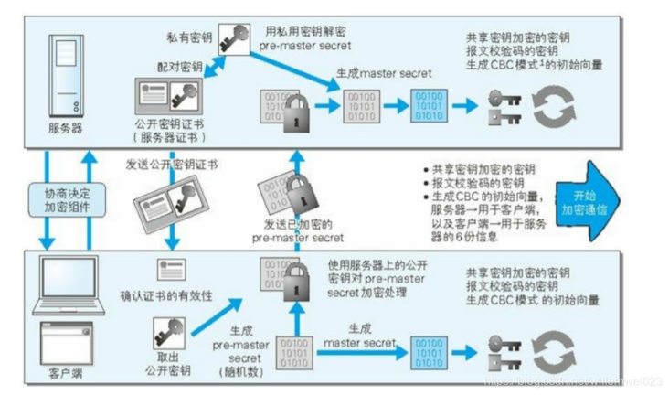
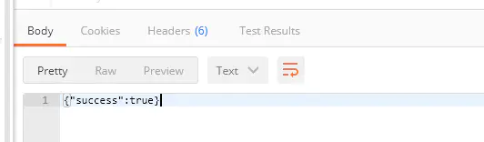
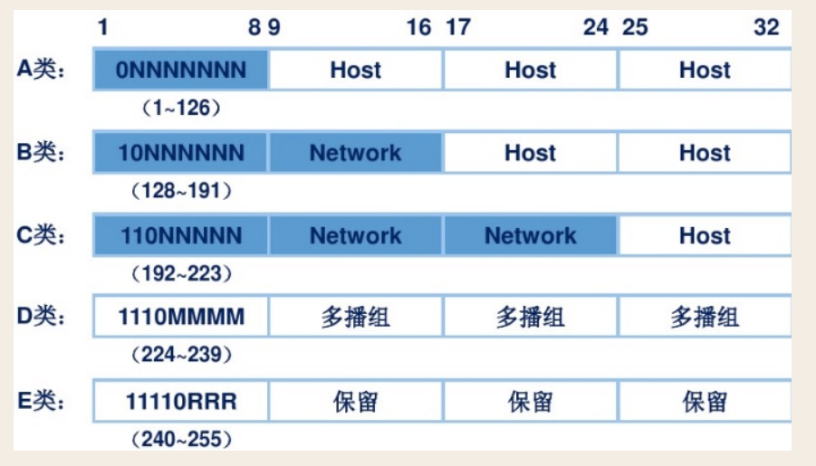
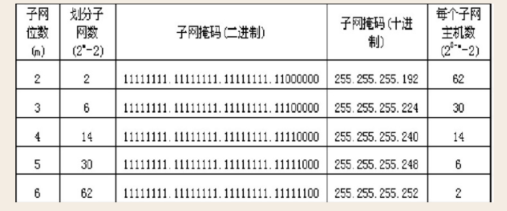

# 	图解HTTP

[toc]

## temp, 第一遍大概的看了一些

TCP/IP： 应用层、传输层、网络层、数据链路层

http请求	分割，标记序号和端口号	MAC地址

IP地址的两个重要的条件： IP地址和MAC地址（Media Access Control Access）

ip地址是节点被分配的地址，mac地址是网卡所属的固定地址

ARP协议凭借 MAC地址进行通信，根据通信方的 ip地址就可以反查出对应的 mac地址

tcp提供可靠的字节流服务，为了准确的将数据送到目标，tcp协议采用了三次握手策略： 标有syn的数据包发给你了， 我收到你发给我的数据包了（syn/ack的数据包），明白（发送ack的数据包）

DNS（domain name system）服务是和http协议一样位于应用层的协议，它提供域名到ip地址之间的解析服务： 我想访问某网页，把它的IP告诉我吧， 它是xx， 我向xx发送请求了

http协议的职责是生成针对目标web服务器的http请求报文

URI  和 URL(uniform resource locator)

请求报文的构成：方法、uri、协议版本、请求首部字段、内容实体

响应报文的构成：协议版本 状态码 原因短语 响应首部字段 主体

http是一种不保存状态的协议，但是有了Cookie就可以管理状态了

HTTP方法： get：我想访问你的某个资源啊   post：我要把这条信息告诉你	put：我要把这份文件传给你	head：把那个相关的信息告诉我	delete：快把那份文件删掉吧	options：你支持哪些方法哇	connect：让我通过一下吧

必须进行多次通信好累啊，所有连接默认都是持久连接

管线化可以看成是异步吗

cookie技术通过在请求和响应报文中写入cookie信息来控制客户端的状态，cookie会根据从服务端发送的响应报文中的一个叫做set-cookie的首端字段信息，通知客户端保存cookie，下次客户端再往该服务器发送请求时会自动在报文中加入cookie		生成cookie，记住是向谁发送的	啊，原来是刚才那家伙哇

http报文大致可以分为报文首部和报文主题两块

编码以提升传输速率：  紧紧的压缩

多部分对象集合包含的对象如下： multipart/form-data    multipart/byteranges

range:  把那剩余的部分给我 206

内容协商（content negotiation）返回最合适的内容

状态码告知从服务器端返回结果：2xx，进展很顺利	4xx，5xx似乎不行啊

1正在处理	2正常处理完毕	3重定向	4服务器无法处理请求	5服务器处理请求出错

204 没资源返回	206我只要一部分	301资源的uri已经更新，你也更新一下吧	302资源临时定位到其它位置了，暂时你换个uri访问吧	303uri已经更新，你要按新的来访问吗	304资源已找到，但是不符合要求	307我和302差不多

400 我无法理解这个请求，是不是错了	401我需要认证的	403不允许访问那个资源啊	404服务器上没有该资源啊	500貌似内部资源出故障了	503抱歉，我正在忙呢

状态码和状态经常不一致，有时候后端已经出错了，但是也返回了 200 ok 的状态码

用单台虚拟主机实现多个域名，若是部署在同一个服务器上，它们的ip地址会相同，由于相同的ip地址，所以在发送HTTP请求时必须在host首部内完整指定主机名或域名的uri

通信数据转发程序：代理、网关、隧道

报文首部：在客户端和服务器处理时起至关重要作用的信息几乎都在这里	报文主体：所需要的用户和资源的信息都在这里

HTTP首部字段传递重要信息，首部字段是由首部字段名和字段值组成，中间用： 分隔，首部字段分为以下四种：通用首部字段、请求首部字段、响应首部字段、实体首部字段

端到端首部，逐跳首部

Cache-Control操作缓存的工作机制：如果有缓存请给我、我喜欢你不要对此做缓存

Cache-Control: private：这份缓存只可以提供给那个家伙使用喔

Cache-Control: no-cache：我不要缓存过的，请给我从源服务器那里拿来资源	你可以缓存，但每次使用前先向我确认一下

Cache-Control: max-age=604800：要是缓存没超过一周，就把他给我吧	一周内不必向我确认，你直接支配该缓存就好了

Connection: 控制不在转发给代理的首部字段，管理持久连接：把这个删除后再转发喔	这下我和你的关系结束了

Accept：该字段可通知服务器，用户代理能够处理的媒体类型以及媒体类型的优先级


http + 加密 + 认证 + 完整性 = https


- websocket


## 1. 了解Web及网络基础

### 框架

TCP/IP协议簇分为四层：应用层（FTP（file transition protocol）、DNS（domain name system））、传输层（TCP（transition control protocol）、UDP（user data protocol））、网络层（Internet protocol）、链路层

- 应用层：决定向用户提供用户服务时的通信活动
- 传输层：提供网络连接中两台计算机之间的数据传输
- 网络层：处理网络上流通的数据包，规划路径
- 链路层：处理连接网络的硬件部分


<div align='center'>TCP/IP通信传输流</div>

### 负责传输的IP协议

TCP/IP协议簇的IP指的就是网络协议，在名称中就占据了一半的位置，可见其重要性。

IP协议是 Internet Protocol，它包括 IP 地址和 MAC(media access control address) [IP 地址和 MAC地址的区别](https://blog.csdn.net/guoweimelon/article/details/50858597)


IP协议的作用是把各种数据包传送给对方，而要保证确实传送到对方那里，则需要满足各类条件，其中最重要的两个条件是 IP 地址和 MAC 地址，IP地址指明了节点被分配的地址，MAC地址指明了网卡所属的固定地址

#### 利用 ARP 协议凭借 MAC 地址进行通信

IP 间的通信依赖 MAC 地址，在网络上，通信的双方在同一局域网（LAN）的情况是很少的，通常要经过多次中转才能连接对方。而在进行中转时，会利用下一站中转设备的MAC地址来搜索下一个中转目标。ARP协议通过ip地址反查出mac地址

### 确保可靠性的 TCP 协议

TCP协议位于传输层，提供可靠的字节流服务

字节流服务：为了方便将大块数据分割以报文段（segment）为单位的数据包进行管理。TCP协议为了更容易传送大数据才把数据分割，而TCP协议能够确认数据最终是否传送给了对方

#### 确保数据能够到达目标

为了确保无误的将数据送达目标处，TCP协议采用了三次握手（three-way handshaking），四次挥手策略

[三次握手，四次挥手](https://www.zhihu.com/question/271701044/answer/2194334244)

### 其它

DNS（Domain Name System）服务是和HTTP协议一样位于应用层的协议，它提供域名到IP地址之间的解析服务


<div align='center'>各种协议与HTTP协议之间的关系</div>

URL(uniform resource locator) 统一资源定位符

URI（uniform resource identifier）统一资源标识符

url 就是使用定位的方式实现  uri

## 2. 简单的HTTP协议

针对HTTP协议的结构进行讲解，主要是 HTTP/1.1 版本

### 基础概念

HTTP 协议用于客户端和服务端之间的通信，在应用 HTTP 协议的时候，必定是一端担任客户端，一端担任服务端。HTTP 通过请求和响应达成通信，请求必定是由客户端发出，然后服务端才进行响应。请求报文是由请求方法、请求 URI、协议版本、可选的请求首部字段和内容实体构成的：

```http
POST /form/entry HTTP/1.1
Host: hacker.jp
Connection: keep-alive
Content-Type: application/x-www-form-urlencoded
Content-Length: 16
name=test&age=20
```

接收到请求的服务器，会将请求内容的处理结果以响应的形式返回，响应通常是由协议版本，状态码，状态码原因短语，响应首部字段，实体主体组成：

```http
HTTP/1.1 200 OK
Date: Tue, 10 Jul 2012 06:50:15 GMT
Content-Length: 555
Content-Type: text/html

<html>
...
```

HTTP 是不保持状态的协议，HTTP 协议自身不对请求和响应之间的通信状态进行保存。使用 HTTP 协议，每当有新的请求发送时，就会有对应的新的响应产生。协议本身并不保留之前一切的请求或响应报文的信息，这是为了更快的处理大量事物，并确保协议的可伸缩性，而特意把 HTTP 协议设计的如此简单的。但是有些时候期望能够保持状态，就慢慢发展了 Cookie、Session、WebSocket 等技术

#### 请求 URI

HTTP 协议利用请求 URI 定位资源，请求 URI 的方式主要由三种：

- 完整的 URI 请求

```http
GET http://test.com/index.htm HTTP/1.1
```

- 在首部字段写明域名或者 IP 地址

```http
GET /index.htm HTTP/1.1
Host: test.com
```

- 不是访问特定资源，只是对服务器本身发起请求，用 * 代替 URI

```http
OPTIONS * HTTP/1.1
Host: test.com
```

#### 持久连接节省通信量

在 HTTP 协议的初始版本中，每进行一次 HTTP 通信就要断开一次 TCP 连接。以当年的通信情况来说，因为都是些小容量的文本传输，所以即使这样传输也没有什么问题。可随着 HTTP 的普及，文档中包含大量图片的情况多了起来。比如使用浏览器浏览一个包含多张图片的 HTML 页面时，在发送请求 HTML 页面的同时，也会请求页面中包含的图片等资源。因此，每次请求都会造成无谓的 TCP 连接建立和断开，增加通信的开销

为了解决上述问题， HTTP/1.1 和 一部分的 HTTP/1.0 提出了持久连接（HTTP Persistent Connections，也称为 HTTP keep-alive 或 HTTP connection reuse）方法。持久连接的特点是只要任意一端没有明确的提出断开连接，则保持 TCP 连接状态。持久连接的好处是减少了 TCP 连接的重复建立和断开所造成的额外开销，减轻了服务器端的负载。另外，减少了开销的那部分时间， Web 页面的速度也相对提高了。在 HTTP/1.1 中，所有的连接都是默认的持久连接

持久连接使得多数请求以管线化（pipelining）方法发送成为可能。从前发送请求后需等待响应，收到响应后才能发送下一个请求。管线化技术出现后，不用等待就可以直接发送下一个请求，时间能更加节省一点

#### 使用 Cookie 的状态管理

HTTP 是无状态协议，不对之前发生过的请求和响应的状态进行管理。也就是说，无法根据之前的状态进行本次的请求处理。但是假设要求登录认证的 Web 页面本身无法进行状态的管理（不记录已登录的状态），那么每次跳转新页面就要再次重新登录，或者要在请求报文中附加参数来管理登录状态。这时候就需要有状态管理的功能，于是引入了 Cookie 技术。Cookie 技术通过在请求和响应报文中写入 Cookie 信息来控制客户端的状态

Cookie 会根据从服务器端发送的响应报文内的一个叫做 Set-Cookie 的首部字段，通知客户端保存 Cookie。当下次客户端再往该服务发送请求时，客户端会自动在请求报文中加入 Cookie 值后发送出去。服务器发现客户端发送过来 Cookie 后，回去检查究竟是从哪个客户端发送来的连接请求，然后对比服务器上的记录，最后得到之前的状态信息

没有Cookie信息的状态：

```http
GET /reader HTTP/1.1
Host: test.com
```

响应报文，服务端生成 Cookie：

```http
HTTP/1.1 200 OK
Date: Thu, 12 Jul 2012 07:12:20 GMT
Server: Apache
Set-Cookie: sid=111; path=/; expires=Wed, 10-Oct-12 07:12:20 GMT>
Content-Type: text/plain
charset: UTF-8
```

请求报文，自动发送保存着的 Cookie 信息

```http
GET /image HTTP/1.1
Host: test.com
Cookie: sid=111
```


### HTTP 方法

HTTP 方法主要有：GET POST PUT HEAD DELETE OPTIONS

#### GET：获取资源

GET 方法用来请求访问已被 URI 识别的资源。指定的资源经服务器解析后返回响应内容。如果请求的资源是文本，那就保持原样返回，如果是像 CGI（Common Gateway Interface，通用网关接口）那样的程序，则返回经过执行后的输出结果

```http
GET /index.htm HTTP/1.1
Host: test.com
```

#### POST: 传输实体主体

POST 方法用来传输实体主体。虽然 GET 方法也可以传输实体的主体，但一般都是使用 POST 方法。

```http
POST /submit HTTP/1.1
Host: test.com
Content-Length: 666
```

#### PUT: 传输文件

PUT 方法用来传输文件。就像 FTP 协议的文件上传一样，要求在请求报文的主体包含文件内容，然后保存到请求 URI 中指定的位置一样。但是由于 HTTP/1.1 的 PUT 方法自身不带验证机制，任何人都可以上传文件，存在安全性问题，因此一般 Web 网站也不使用该方法。若配合 Web 应用程序的验证机制，或者采用 REST 架构设计的同类 Web 网站可能就会开放使用 PUT 方法

```http
PUT /example.htm HTTP/1.1
Host: test.com
Content-Type: text/html
Content-Length: 666
```

#### HEAD:获得报文首部

HEAD 方法和 GET 方法一样，只是不返回报文主体部分。用于确认 URI 的有效性及资源的更新时间等

```http
HEAD /index.htm HTTP/1.1
Host: test.com
```

#### DELETE: 删除文件

DELETE 方法用来删除文件，是与 PUT 方法相反的方法，通过 URI 请求来删除指定资源。但是 DELETE 方法和 PUT 方法一样不带验证机制，所以一般的 Web 网站也不使用 DELETE 方法。当配合 Web 应用程序的验证机制或遵守 REST 标准的时候还是有可能开放的

```http
DELETE /example.htm HTTP/1.1
Host: test.com
```

#### OPTIONS: 询问支持的方法

OPTIONS 方法用来查询针对请求 URI 指定资源的支持的方法

```http
OPTIONS * HTTP/1.1
Host: test.com
```

#### TRACE: 追踪路径

TRACE 方法是让 Web 服务器端将之前的请求通信返回给客户端的方法。发送请求时，在 Max-Forwards 首部字段填入数值，每经过一个服务端就将该数字减 1，当数值刚好减到 0 的时候，就停止继续传输，最后接收到请求的服务器端则返回状态码 200 OK 的响应。

客户端通过 TRACE 方法可以查询送出去的请求是怎么被加工修改的。这是因为请求想要想要连接到目标服务器可能会通过代理中转，TRACE 方法就是用来确认连接中发生的一系列操作的。但是 TRACE 一般都不用，再加上它容易引发 XST（Cross-Site Tracing, 跨站追踪）的攻击，通常就更不会用了

```http
TRACE / HTTP/1.1
Host: test.com
Max-Forwards: 2
```

#### CONNECT: 要求用隧道协议连接代理

CONNECT 方法要求在与代理服务器通信时建立隧道，实现用隧道协议进行 TCP 通信。主要使用 SSL（Secure Socket Layers，安全套接字）和 TLS（Transport Layer Security，传输层安全）协议把通信内容加密后利用隧道进行传输。

```http
CONNECT test.com:8080 HTTP/1.1
Host: test.com
```


## 3. HTTP 报文内的 HTTP 信息                                                                                                                                                                                                                                                                                                                                                                                                                                                                                                                                                                                                                                                                                                                                     

HTTP 通信过程包括从客户端发往服务器端的请求及从服务器端发往客户端的响应。本章主要介绍请求和响应是怎么运作的

### 报文及其结构

用于 HTTP 协议交互的信息称为 HTTP 报文，请求端称为请求报文，服务端称为响应报文。HTTP 报文本身是由多行（用 CR + LF 作换行符）数据构成的字符串文本。HTTP 报文大致可分为报文首部和报文主体两块。两者由最初出现的空行（CR + LF）来划分。


<div align='center'>HTTP 报文结构</div>


.jpg)

<div align='center'> 请求报文（上）和响应报文（下）的结构</div>

- 请求行：包含用于请求的方法，请求 URI 和 HTTP 版本
- 状态行：包含表明响应结果的 HTTP 版本，状态码和原因短语
- 首部字段：包含表示请求和响应的各种条件和属性的各类首部，一般由四种首部：请求首部，响应首部，通用首部，实体首部

### 编码提升传输速率

HTTP 在传输数据时可以按照数据原貌直接传输，但也可以在传输过程中通过编码提升传输速率。通过在传输时编码，能有效处理大量的访问请求。但是，编码操作需要计算机来完成，所以会浪费一些 CPU 等资源

#### 报文主体和实体主体的差异：

- 报文：HTTP 通信中的基本单位，由 8 位字节流（octet sequence）组成，通过 HTTP 通信传输
- 实体：作为通信或响应的有效载荷数据被传输，其内容由实体首部和实体主体组成

报文主体就是用于传输请求或响应的实体主体，通常报文主体就是实体主体。只有当传输过程中发生编码，实体主体的内容发生变化，才导致它和报文主体发生变化

#### 压缩传输的内容编码

向待发送的邮件增加附件的时候，为了使邮件容量变小，会用 zip 压缩文件后再添加附件发送。 HTTP 协议中有一种被称为内容编码的功能也能进行类似的操作。内容编码指明应用在实体内容上的编码格式，并保持信息原样压缩。内容编码后的实体由客户端接收并负责解码

常用的内容编码有以下几种：

- gzip（GNU zip）
- compress（UNIX 系统的标准压缩）
- deflate（zlib）
- identity（不进行编码）

#### 分割发送的分块传输编码

在 HTTP 通信过程中，请求的编码实体资源尚未全部传输完成之前，浏览器无法显示请求页面。在传输大容量数据时，通过把数据分割成多块，能够让浏览器逐步显示页面。这种把实体主体分块的功能称为分块传输编码（Chunked Transfer Coding）

分块传输编码会将实体主体分成多个部分。每一块都会用十六进制来标记块的大小，而实体主体的最后一块会用“0（CR+LF）”来标记。使用分块传输编码的实体主体会由接收的客户端负责解码，恢复编码前的实体主体

#### 发送多种数据的多部分对象集合

MIME（Multipurpose Internet Mail Extension, 多用途因特网邮件扩展）允许邮件处理文本、图片、视频等多个不同类型的数据。在 MIME 扩展中会使用一种称为多部分对象集合（Multipart）的方法，来容纳多份不同类型的数据。相应的，HTTP 协议也采纳了多部分对象集合（Multipart）的方法，它的对象如下：

- multipart/form-data  在 Web 表单文件上传时使用
- multipart/byteranges 状态码 206 响应报文包含多个范围的时候使用

如果 HTTP 要使用 Multipart，需要在首部字段里面先加上 Content-Type。使用 boundary 字符串来划分多部分对象集合指明的各类实体。多部分对象集合的每个部分类型中，都可以包含首部字段。另外，可以在某个部分中嵌套使用多部分对象集合

#### 获取部分内容的范围请求

以前用户没有高速的带宽，如果下载过程中出现网络中断的情况，就需要重头开始。为了解决上述问题，需要一种可恢复机制。所谓恢复指能从之前下载中断处恢复下载。要实现该功能需要指定下载的实体范围。对一份10000字节大小的资源，如果使用范围请求，可以只请求 5001~10000 字节内的资源。执行范围请求时，会用到首部字段 Range 来指定资源的 byte 范围

```http
GET /index.png HTTP/1.1
Range: bytes=5001-10000
Range: bytes=5001-
```

针对范围请求，响应会返回状态码 206  partial content 的响应报文。另外对于多种范围的范围请求，响应会在首部字段Content-Type 标明 multipart/byteranges 后返回响应报文

#### 内容协商返回最合适的内容

同一个Web网站有可能存在着多份相同内容的页面。比如英语版和中文版的 Web 页面，它们内容上虽相同，但是使用的语言却不同。当浏览器的默认语言是英语或则中文的时候，访问相同的 URI 的 Web 页面则会显示对应的英文或者中文的 Web 页面，这样的机制称为内容协商机制

内容协商机制是指客户端和服务端就响应的资源进行交涉，然后提供给客户端最为合适的资源。内容协商会以语言、字符集、编码方法等为基准判断响应的资源

判断基准的首部字段如下：

- Accept
- Accept-Charset
- Accept-Encoding
- Accept-Language
- Content-Language

内容协商技术有以下三种类型：

- 服务器驱动协商：以请求的首部字段作为参考，在服务器端自动处理
- 客户端驱动协商：用户从浏览器显示的可选项列表中手动选择
- 透明协商：是服务器驱动和客户端驱动的结合体


## 4. 返回结果的 HTTP 状态码

HTTP 状态码负责表示客户端 HTTP 请求的返回结果、标记服务器端的处理是否正常、通知出现的错误等工作。借助状态码，用户可以知道服务器端是正常处理了请求还是出现错误。仅记录在 RFC2616 上的 HTTP 状态码就达到 40 种，算上其它的，可达到 60 种，但是实际上经常使用的只有 14种

### 2XX 成功

2XX 的响应结果表明请求被正常处理了

- 200 OK：表示从客户端发来的请求在服务器端被正常处理了
- 204 No Content：请求处理成功，但在返回的响应报文种不含实体的主体部分
- 206 Partial Content：表示客户端进行了范围请求，而服务器成功执行了这部分的 GET 请求，其中 Conent-Range 指定范围

### 3XX 重定向

3XX 响应结果表明浏览器需要执行某些特殊的处理以正确执行请求

- 301 Moved Permanently：永久性重定向，该状态码表明请求的资源已被分配了新的 URI
- 302 Found：临时性重定向。表示请求的资源已被分配了新的 URI，希望用户（本次）能够使用新的 URI 访问
- 303 See Other：另一个URI。由于请求对应的资源存在着另一个 URI，应使用 GET 方法定向获取请求的资源。303 和 302 一样，但是 303 明确表示客户端应当使用 GET 方法请求资源
- 304 Not Modified：资源已找到，但不符合请求。客户端发送附带条件的请求时，服务端也允许访问资源，但是因为发生请求未满足条件的情况，直接返回 304，不包含任何响应的主体部分。304 虽然划分到 3XX 类比，但是和重定向没有任何关系
- 307 Temporary Redirect：临时重定向。和 302 有相同的含义，差不多相同的作用

### 4XX 客户端错误

4XX 的响应结果表明客户端是发生错误的原因所在

- 400 Bad Request：表示请求报文种存在语法错误，需修改请求的内容后再次发送，浏览器回像 200 OK 一样对待该状态码
- 401 Unauthorized：表示发送的请求需要有通过 HTTP 认证（BASIC、DIGEST 认证）的认证信息
- 403 Forbidden：表明对请求资源的访问被服务器拒绝了，服务器端没有必要给出拒绝的详细理由
- 404 Not Found：服务器上没有请求的资源，也可以表示拒绝但是不想说明原因

### 5XX 服务前错误

5XX 的响应结果表明服务器本身发生错误

- 500 Internal Server Error：表明服务器端在执行请求时发生了错误，服务器存在一些 bug 或者一些故障
- 503 Service Unavailable：表明服务器暂时处于超负载或正在停机维护，现在无法处理请求。可以在响应中写入 Retry-After 表明什么时候可以恢复

### 状态码和状态不一致

不少返回的状态码响应都是错误的，但是用户可能察觉不到这点。比如 Web 应用程序内部已经发生错误了，但是还是返回了 200 OK，这种情况很多，自己写后台的时候尽量返回正确的响应吧，写前端的时候也多判断一层吧。


## 5. 与 HTTP 协作的 Web 服务器

一台 Web 服务器可搭建多个独立域名的 Web 网站，也可作为通信路径上的中转服务器提升传输效率

### 5.1 用单台虚拟主机实现多个域名

虚拟主机技术可以用一台服务器为多位客户服务，为每位客户的不同域名运行不同的网站

在互联网上，域名通过 DNS 服务映射到 IP 地址（域名解析）之后访问目标网站，实际上当请求发送到服务器的时候已经是通过 IP 地址的形式访问了

在相同 IP 地址的情况下，由于虚拟主机可以寄存多个不同主机名和域名的 Web 网站，因此在发送 HTTP 请求的时候，必须在 HOST 首部内完整指定主机名或域名的 URI

### 5.2 通信数据转发程序：代理、网关、隧道

HTTP 通信时，除了客户端和服务器以外，还有一些用于通信数据转发的应用程序：代理、网关、隧道

- 代理：是一种有转发功能的应用程序，它接收由客户端发送的请求并转发给服务器，同时也接收来自服务器的响应并返回给客户端
- 网关：网关是转发其他服务器通信数据的服务器，接收来自从客户端发送的请求时，它就像自己是拥有资源的服务器一样对请求进行处理。
- 隧道：隧道是在相隔甚远的客户端和服务器两者之间进行中转，并保持双方通信连接的应用连接

#### 5.2.1 代理

代理服务器的基本行为是接收客户端发送的请求后转发给服务器。代理不改变请求 URI，会直接发送给持有资源的服务器。持有资源的服务器称为源服务器，从源服务器返回的响应经过代理服务器后在传给客户端。每次通过代理服务器转发请求或响应时，都会追加写入 Via 首部信息

在 HTTP 通信过程中，可级联多台代理服务器。请求和响应的转发会经过数台类似锁链一样连接起来的代理服务器。转发时，需要用 Via 首部字段以标记出经过的主机信息

使用代理服务器的理由有：利用缓存技术减少网络带宽的流量，组织内部针对特定的网站的访问控制，获取访问日志等目的

- 缓存代理：代理转发响应时，缓存代理（Caching Proxy）会预先将资源的副本保存在代理服务器上，当代理再次接收到对相同资源的请求时，就可以不从源服务器那里获取资源，直接返回缓存资源
- 透明代理：转发请求或响应时，不对报文做任何加工的代理类型称为透明代理，反之称为非透明代理

#### 5.2.2 网关

网关的工作机制和代理非常像，而网关能允许通信线路上的服务器提供非 HTTP 协议服务。利用网关能提高通信的安全性，因为可以在客户端与网关之间的通信线路上加密以确保连接的安全。比如，网关可以连接数据库，通过  SQL 语句查询数据，利用在 Web 购物网站上进行信用卡结算时，网关可以和信用卡结算系统联动

#### 5.2.3 隧道

隧道可按要求建立一条与其他服务器的通信线路，届时使用 SSL 等加密手段进行通信。隧道的目的是确保客户端能与服务器进行安全通信。通过隧道的传输，可以和远距离的服务器安全通信。隧道本身是透明的，客户端不用在意隧道的存在

### 5.3 保持资源的缓存

缓存是指代理服务器或客户端本地磁盘内保持的资源副本，利用缓存可减少对源服务器的访问，因此也就节省了通信流量和通信时间

#### 5.3.1 缓存的有效期限

即便缓存服务器内有缓存，也不能保证每次都会返回对同资源的请求，因为这关系到被缓存资源的有效性问题。即使存在缓存，也会因为客户端的要求、缓存的有效期等因素，向源服务器确认资源的有效性。若判断缓存失效，缓存服务器将会再次从源服务器上获取更新的资源

#### 5.3.2 客户端的缓存

缓存不仅可以存在于缓存服务器内，还可以存在于客户端浏览器中，以 Internet Explorer 程序为例，把客户端缓存称为临时网络文件（Temporary Internet File）

浏览器缓存如果有效，就不必再向服务器请求相同的资源了，直接从本地磁盘内读取

## 6.  HTTP 首部

HTTP 协议的请求和响应报文中必定包含 HTTP 首部，只是我们平时在使用 Web 的过程中感受不到它，这章将 HTTP 首部的结构，以及首部中各字段的用法

### 6.1  HTTP 报文首部


<div align='center'>HTTP 报文首部</div>

在请求中，HTTP 报文由方法、URI、HTTP 版本、HTTP 首部字段等部分组成

在响应中，HTTP 报文由 HTTP 版本、状态码（数字和原因短语）、HTTP 首部字段 3 部分构成

在报文众多的字段中，HTTP 首部字段包含的信息最为丰富。首部字段同时存在于请求和响应中，并涵盖 HTTP 报文相关的内容信息

###  6.2 HTTP 首部字段

#### 6.2.1 HTTP 首部字段传递重要信息

在客户端与服务端以 HTTP 协议进行通信的过程中，无论是请求还是响应都会使用首部字段，它能起到传递额外重要信息的作用。使用首部字段是为了给浏览器和服务器提供报文主体大小、所使用的语言、认证信息等内容

#### 6.2.2 HTTP 首部字段结构

HTTP 首部字段是由首部字段名和字段值构成的，中间用冒号“：”分隔

当 HTTP 报文首部中出现了两个或两个以上具有相同首部字段时会怎样？没有具体规范，以实际情况为准，的那我们要避免这种情况的发生

#### 6.2.3 4 种 HTTP 首部字段类型

- 通用首部字段：请求报文和响应报文两方都会使用的首部
- 请求首部字段：从客户端向服务端发送请求报文时使用的首部。补充了请求的附加内容、客户端信息、响应内容相关优先级等信息
- 响应首部字段：从服务器端向客户端返回响应报文时使用的首部。补充了响应的附加内容，也会要求客户端附加额外的内容信息
- 实体首部字段：针对请求报文和响应报文的实体部分使用的首部。补充了资源内容更新时间等与实体相关的信息

#### 6.2.4 HTTP/1.1 首部字段一览

HTTP/1.1 规范定义了如下 47 种首部字段

<div align='left'>表 6-1： 通用首部字段</div>

| 首部字段名        | 说明                     |
| ----------------- | ------------------------ |
| Cache-Control     | 控制缓存的行为           |
| Connection        | 逐跳首部、连接的管理     |
| Date              | 创建报文的日期时间       |
| Pragma            | 报文指令                 |
| Trailer           | 报文末端的首部一览       |
| Transfer-Encoding | 指定报文主体传输编码方式 |
| Upgrade           | 升级为其他协议           |
| Via               | 代理服务器的相关信息     |
| Warning           | 错误通知                 |

<div align='left'>表 6-2：请求首部字段</div>

| 首部字段名          | 说明                                            |
| ------------------- | ----------------------------------------------- |
| Accept              | 用户代理可处理的媒体类型                        |
| Accept-Charset      | 优先的字符集                                    |
| Accept-Encoding     | 优先的内容编码                                  |
| Accept-Language     | 优先额自然语言                                  |
| Authoriaztion       | Web 认证信息                                    |
| Expect              | 期待服务器的特定行为                            |
| From                | 用户的电子邮箱地址                              |
| Host                | 请求资源所在的服务器                            |
| If-Match            | 比较实体标记（ETag）                            |
| If-Modified-Since   | 比较资源的更新时间                              |
| If-None-Match       | 比较实体标记（与 If-Match 相反）                |
| If-Range            | 资源未更新时发送实体 Byte 的范围请求            |
| If-Unmodified-Since | 比较资源的跟新时间（与 If-Modified-Since 相反） |
| Max-Forwards        | 最大传输逐跳数                                  |
| Proxy-Authorization | 代理服务器要求客户端的认证信息                  |
| Range               | 实体的字节范围请求                              |
| Referer             | 对请求中 URI 的原始获取方法                     |
| TE                  | 传输编码的优先级                                |
| User-Agent          | HTTP 客户端程序的信息                           |

<div align='left'>表 6-3：响应首部字段</div>

| 首部字段名         | 说明                         |
| ------------------ | ---------------------------- |
| Accept-Ranges      | 是否接受字节范围请求         |
| Age                | 推算资源创建经过时间         |
| ETag               | 资源的匹配信息               |
| Location           | 令客户端重定向至指定 URI     |
| Proxy-Authenticate | 代理服务器对客户端的认证信息 |
| Retry-After        | 对再次发起请求的时机要求     |
| Server             | HTTP 服务器的安装信息        |
| Vary               | 代理服务器缓存的管理信息     |
| WWW-Authenticate   | 服务端对客户端的认证信息     |

<div align='left'>表6-4：实体首部字段</div>

| 首部字段名       | 说明                   |
| ---------------- | ---------------------- |
| Allow            | 资源可支持的 HTTP 方法 |
| Content-Encoding | 实体主体适用的编码方式 |
| Content-Language | 实体主体的自然语言     |
| Content-Length   | 实体主体的大小（字节） |
| Content-Location | 替代对应资源的 URI     |
| Content-MD5      | 实体主体的报文摘要     |
| Content-Range    | 实体主体的位置范围     |
| Content-Type     | 实体主体的媒体类型     |
| Expires          | 实体主体过期的日期     |
| Last-Modified    | 资源的最后修改日期     |

HTTP 首部字段将定义成缓存代理和非缓存代理，分成两种类型

端到端首部（End-to-end Header）：此类别的首部会转发给请求/响应对应的最终接收目标，且必须保存在由缓存生成的响应中，另外规定它必须被转发

逐跳首部（Hop-by-hop Header）：此类别的首部只对单次转发有效，会因通过缓存或代理而不再转发，在 HTTP/1.1中，如果要使用 Hop-by-hop  首部，需提供 Connection 首部字段

逐跳字段只有以下 8 个，除此之外都是端到端首部：

- Conenction
- Keep-Alive
- Proxy-Authention
- Proxy-Authenticate
- Trailer
- TE
- Transfer-Encoding
- Upgrade

### 6.3  HTTP/1.1 通用首部字段

通用首部字段指请求和响应双方都会使用到的首部

#### 6.3.1 Cache-Control

通过 cache-control 首部字段的指令，就能操作缓存的工作机制

指令参数是可选的，多个指令之间通过“，”分隔

```http
HTTP/1.1 200 OK
Cache-Control: private, max-age=0, no-cache
```

<div align='left'>表6-5：缓存请求指令</div>

| 指令             | 参数   | 说明                         |
| ---------------- | ------ | ---------------------------- |
| no-cache         | 无     | 强制向源服务器再次验证       |
| no-store         | 无     | 不缓存请求或响应的任何内容   |
| max-age=[秒]     | 必须   | 响应的最大Age值              |
| (max-stale=[秒]) | 可省略 | 接收已过期的响应             |
| min-fresh=[秒]   | 必须   | 期望在指定时间内的响应仍有效 |
| no-transform     | 无     | 代理不可更改媒体类型         |
| only-if-cached   | 无     | 从缓存获取资源               |
| cache-extension  | -      | 新指令标记（token）          |

<div align='left'>表6-6：缓存响应指令</div>

| 指令             | 参数   | 说明                                   |
| ---------------- | ------ | -------------------------------------- |
| public           | 无     | 可向任意方提供响应的缓存               |
| private          | 可省略 | 仅向特定用户返回响应                   |
| no-cache         | 可省略 | 缓存前必须向确认其有效性               |
| no-store         | 无     | 不缓存请求或响应的任何内容             |
| no-transform     | 无     | 代理不可更改媒体类型                   |
| must-revalidate  | 无     | 可缓存但必须再向源服务器进行确认       |
| proxy-revalidate | 无     | 需要中间缓存服务器对缓存有效性再次确认 |
| max-age=[秒]     | 必须   | 响应的最大 Age 值                      |
| s-maxage=[秒]    | 必须   | 公共缓存服务器响应的最大 Age 值        |
| cache-extension  | -      | 新指令标记（token）                    |

public 指令表示任何用户都可以使用该缓存

private 指令表示特定用户可以使用该缓存

no-cache 指令从客户端的角度来说就是不要缓存，从源服务器重新获取，从服务器的角度就是缓存服务器可以缓存，但是需要向源服务器确认，使用 no-cache 指令的目的是为了防止从缓存中返回过期的资源

no-store 指令是暗示请求或响应中包含机密信息，该指令规定缓存不能在本地存储请求或响应的任一部分

```tex
Cache-Control: s-maxage=604800
```

s-maxage 指令的功能和 max-age 的功能差不多，但是 s-maxage 指令只适用于供多位用户使用的公共换从服务器，对于向同一用户重复返回响应的服务器来说，这个指令没有任何意义。另外，当使用 s-maxage 指令以后，则直接忽略对 Expires 首部字段和 max-age 指令的处理

```tex
Cache-Control: max-age=60480
```

当客户端发送的请求里面包含 max-age  指令时候，如果判定缓存服务器的时间数值比指定时间小，那么客户端就接收缓存的资源，当 max-age 的值为 0 时候，那么缓存服务器通常需要将请求转发给源服务器

当服务器返回的响应中包含 max-age 指令时候，缓存服务器将不对资源的有效性再作确认，而max-age 的数值代表资源保存为缓存的最长时间

```tex
Cache-Control: min-fresh=60
```

min-fresh 指令要求缓存服务器返回至少还未过指定时间的缓存资源，当指定 min-fresh 为 60 秒后，在这 60 秒以内如果有超过有限期限的资源都无法作为响应返回

```tex
Cache-Control: max-style=3600
```

使用 max-stale 可指示缓存资源，即使过期也照常接收，如果未指定参数，无论经过多久也接受，如果指定参数，即使资源过期也照常接收

```tex
Cache-Control: only-if-cached
```

only-if-cached 指令表示客户端仅在缓存服务器本地缓存目标资源的情况下才会要求其返回

must-revalidate 指令使用后，代理会向源服务器再次验证即将返回的缓存是否任然有效，若代理无法连通源服务器获取到有效资源的话，返回一条 504 的状态码，使用该指令的时候会忽略 max-stale 指令

proxy-revalidate 指令要求所有缓存服务器在接收到客户端带有该指令的请求返回响应前，必须再次验证缓存的有效性

no-transform 指令表示无论是在请求还是响应中，缓存都不能改变实体主体的媒体类型

#### 6.3.2 Connection

Connection 首部字段具有如下两个作用：

- 控制不再转发给代理的首部字段
- 管理持久连接

```tex
Connection: 不在转发的首部字段名
```

在客户端发送请求和服务器返回响应内，使用 Connection 首部字段，可控制不在转发给代理的首部字段

```Tex
Connection: close
```

HTTP/1.1 版本默认连接都是持久连接，为此，客户端会在持久连接上连续发送请求，当服务器想明确断开连接，则指定 Connection 首部字段的值为 close

```http
GET / HTTP/1.1
Connection: Keep-Alive
```

```http
HTTP/1.1 200 OK
Keep-Alive: timeout=10, max=500
Connection: Keep-Alive
```

HTTP/1.1 之前的版本默认连接都是非持久连接，为此，如果想要在旧版本的 HTTP 协议上维持持续连接，则需要指定 Connection  首部字段的值是 Keep-Alive

#### 6.3.3 Date

Date 首部字段表明 HTTP 报文创建的时间和日期，日期时间的格式有三种

#### 6.3.4 Pragma

```tex
Pragma: no-cache
```

历史遗留字段，为了向后兼容而定义，该字段只用于请求，会要求所有中间服务器不返回缓存的资源

如果所有中间服务器都能以 HTTP/1.1 为基准，那么直接采用 Cache-Control: no-cache 指定缓存的处理方式是最佳的，但是整体掌握所有服务器使用的 HTTP 版本是不现实的，所以我们一般使用两个字段

```tex
Cache-Control: no-cache
Pragme: no-cache
```

#### 6.3.5 Trailer

首部字段 Trailer 会事先说明在报文主体后记录了哪些首部字段，该首部字段可应用在 HTTP/1.1 版本分块传输编码时

```http
HTTP/1.1 200 OK
Content-Type: text/html
Trailer: Expires
temp: ...(报文主体)···
Expires： Tue···
```

#### 6.3.6 Transfer-Encoding

```tex
Transfer-Encoding: chunked
```

首部字段 Transfer-Encoding 规定了传输报文主体时采用的编码方式， HTTP/1.1 的传输编码方式仅对分块传输编码有效

#### 6.3.7 Upgrade

首部字段 Upgrade 用于检测 HTTP 协议及其他协议是否可使用更高的版本进行通信，其参数值可以用来指定一个完全不同的协议

```http
GET /index.htm HTTP/1.1
Upgrade: TLS/1.0
Connection: Upgrade
```

```http
HTTP/1.1 101 Switching Protocols
Upgrade: TLS/1.0 HTTP/1.1
Connection: Upgrade
```

一般使用 Upgrade 也会使用 Connection，表示 Upgrade 仅作用于它与相邻的服务器

#### 6.3.8 Via

使用首部字段 Via 是为了追踪客户端与服务器之间的请求和响应报文的传输路径。报文在经过代理或网关时，会先在首部字段 Via 中附加该服务器的信息，然后再转发。Via 首部是为了追踪传输路径，所以经常会和 TRACE 方法一起使用，比如代理服务器接收到由 TRACE 方法发送过来的请求（其中 Max-Forwards: 0）时，代理服务器就不再转发请求了

#### 6.3.9 Warning

HTTP/1.1 的 Warning 首部是从 HTTP/1.0 的响应首部（Retry-After ）演变过来的，该首部通常会告知用户一些与缓存相关的问题的警告

```tex
Warning: 113 gw.hacker.jp:8080 "Heuristic expiration" Tue, 03 Jul 2012 05:09:44 GMT
```

Warning 首部格式如下，日期可以省略：

```tex
Warning: [警告码][警告主机:端口号]"[警告内容]"([日期时间])
```

HTTP/1.1 定义了 7 种警告，警告具有扩展性

<div align='left'>表6-7：HTTP/1.1 7 种警告

| 警告码 | 警告内容                         | 说明                                   |
| ------ | -------------------------------- | -------------------------------------- |
| 110    | Response is stale                | 代理返回已过期的资源                   |
| 111    | Revailidation failed             | 代理再次验证资源有效性时失败           |
| 112    | Disconnection operation          | 代理与互联网之间的连接被故意切断       |
| 113    | Heuristic expiration             | 响应使用期超过 24 小时                 |
| 199    | Miscellaneous warning            | 任意的警告内容                         |
| 214    | Transformation applied           | 代理对内容编码或媒体类型执行了某些操作 |
| 299    | Miscellaneous persistent warning | 任意的警告内容                         |

### 6.4 HTTP/1.1  请求首部字段

请求首部字段是从客户端往服务器发送请求报文中所使用的字段，用于补充请求的附加信息、客户端信息、对响应内容相关的优先级等内容

#### 6.4.1 Accept

```tex
Accept: text/plain; q=0.3, text/html
```

Accept 首部字段可以通知服务器，用户代理能够处理的媒体类型及媒体类型的优先级。可使用 type/subtype 这种形式，一次指定多种媒体类型

- 文本文件：text/html, text/plain, text/css··· application/xhtml+xml, application/xml···
- 图片文件：image/jpeg, image/gif, image/png ···
- 视频文件：video/mpeg, video/quicktime ···
- 应用程序使用的二进制文件：application/octet-stream, application/zip···

若想要给显示的媒体类型增加优先级，则使用 q= 来额外表示权重，类型用分号（；）分隔。权重的范围是0~1，如果不指定，默认是 1

#### 6.4.2 Accept-Charset

```tex
Accept-Charset: iso-8859-5, unicode-1-1; q=0.8
```

Accept-Charset 首部字段可用于通知服务器用户代理支持的字符集及字符集的优先级

#### 6.4.3 Accept-Encoding

```tex
Accept-Encoding: gzip, deflate
```

Accept-Encoding 首部字段用来告知服务器用户代理支持的用户编码及用户编码的优先级顺序，可一次性指定多种编码

- gzip：由文件压缩程序 gzip(GNU zip) 生成的编码格式（RFC1952）
- compress：由 UNIX 文件压缩程序 compress 生成的编码格式
- deflate：组合使用 zlib 格式及由 deflate 压缩算法生成的编码格式
- identity：不执行压缩或不会变化的默认编码格式

#### 6.4.4 Accept-Language

```tex
Accept-Language: zh-cn, zh; q=0.7, en-us,en; q=0.3
```

Accept-Language 首部字段用来告知服务器用户代理能够处理的自然语言集及其优先级

#### 6.4.5 Authorization

```http
GET /index.htm HTTP/1.1
Authorization: Basic ···
```

首部字段 Authorization 用来告知服务器，用户代理的认证信息（证书值）

#### 6.4.6 Expect

```tex
Expect: 100-continue
```

Expect 首部字段用来告知服务器，期望出现的某种特定行为

#### 6.4.7 From

From 首部字段告知服务器用户代理的用户使用的电子邮件地址

#### 6.4.8 Host

```tex
Host: www.hacker.jp
```

虚拟主机运行在同一 IP 上，因此使用首部字段 Host 加以区分

#### 6.4.9 If-Match

```tex
If-Match: 123456
```

形如 If-xxx 这种形式的请求首部字段，都可以称为条件请求。服务器在接收到条件请求的时候，只有判断条件为真时，才会执行请求

If-Match 首部字段会告知服务器匹配资源所用的实体标记（ETag）值，服务器会比对 If-Match 的首部字段值和资源的 ETag 值，仅当两者一致的时候才执行请求

#### 6.4.10 If-Modified-Since

```http
GET /index.htm HTTP/1.1
If-Modiefied-Since: Thu, 15 Apr 2004 00:00:00 GMT
```

如果在 If-Modeified-Since 指定的日期之后资源发生了更新，服务器才会接收请求

#### 6.4.11  If-None-Match

```http
PUT /index.htm HTTP/1.1
If-None-Match: *
```

只有在 If-None-Match 的字段值与 ETag 值不一致时，可处理该请求。与 If-Match 首部字段的作用相反

#### 6.4.12 If-Range

If-Range 字段值若是跟 ETag 值或更新的日期时间匹配一致，那么就作为范围请求处理

#### 6.4.13  If-Unmodified-Since

首部字段 If-Unmodified-Since 与 If-Modified-Since 作用相反，它的作用是告知服务器，指定的请求资源只有在字段值指定的时间之后未发生更新的情况下，才能处理请求

#### 6.4.14 Max-Forwards

通过 TRACE 方法或 OPTIONS 方法，发送包含首部字段 Max-Forwards 的请求时，该字段以十进制整数形式指定可经过的服务器的最大数目

#### 6.4.15 Proxy-Authorization

接收到从代理服务器发来的认证质询时，客户端会使用这个首部字段指定认证信息

#### 6.4.16 Range

对于只需要获取部分资源的请求，包含首部字段 Range 即可告知服务器资源的指定范围

#### 6.4.17 Referer

告知源服务器请求的的原始资源的URI

#### 6.4.18  TE

TE 告知服务器客户端能够处理响应的传输编码以及相对优先级

#### 6.4.19  User-Agent

首部字段 User-Agent 会将创建请求的浏览器和用户代理名称等信息传达给服务器。

### 6.5  响应首部字段 

响应首部字段是由服务器端向客户端返回响应报文中所使用的字段，用于补充响应的附加信息、服务器信息，以及对客户端的附加要求等

#### 6.5.1 Accept-Ranges

```tex
Accept-Ranges: bytes
```

首部字段 Accept-Ranges 是用来告知客户端服务器是否能处理范围请求，以指定获取服务器端某个部分的资源。可指定的字段值有两种，可处理的范围请求是其值为 bytes，反之为 none。当不能处理范围请求时，Accept-Ranges: none

#### 6.5.2 Age

首部字段 Age 能告知客户端，源服务器在多久前创建了响应，单位是秒。若创建该响应的是缓存服务器， Age 值是指缓存后的值再次发起认证到认证结束的时间

#### 6.5.3 ETag

首部字段 ETag 能告知客户端实体标记。它是一种可将资源以字符串形式做唯一性标识的方式。服务器会为每份资源分配对应的 ETag 值。另外，当资源更新时，ETag 值也需要更新。生成 ETag 值时，并没有统一的算法准则，仅仅由服务器来分配

资源的 URI 并没有变，但是资源更新后，ETag 值会随之改变。资源被缓存时，就会被分配唯一性标识。比如中英文的资源的 URI 是相同的，所以仅凭 URI 指定缓存的资源是相当困难的。若在下载过程中出现中断、再连接的情况，都会依照 ETag 值来指定资源

ETag 值有强弱之分。强 ETag 值无论实体有多么细微的变化都会改变其值。弱 ETag 值只用于提示资源是否相同。只有资源发生了根本性改变，产生差异时才会改变 ETag值

#### 6.5.4 Location

使用首部字段 Location 可以将响应接收方引导至某个与请求 URI 位置不同的资源。基本上，该字段会配合 3xx：Redirection 的响应，提供重定向的 URI。几乎所有浏览器在接收到包含首部字段 Location 的响应后，都会强制性地尝试对已提示的重定向资源的访问

#### 6.5.5 Proxy-Authenticate

首部字段 Proxy-Authenticate 会把由代理服务器所要求的认证信息发送给客户端。它与客户端和服务器之间的 HTTP 的访问认证的行为相似，不同之处在于其认证行为是在客户端与代理之间进行的

#### 6.5.6 Retry-After

首部字段 Retry-After 告知客户端应该在多久之后再次发送请求。主要配合状态码 503 Service Unavailable 响应，或 3xx Redirect 响应一起使用

#### 6.5.7 Server

首部字段 Server 告知客户端当前服务器上安装的 HTTP 服务器应用程序的信息

#### 6.5.8 Vary

首部字段 Vary 可对缓存进行控制。源服务器会向代理服务器传达关于本地缓存使用方法的命令。从代理服务器接收到源服务器返回 Vary 指定项的响应之后，若要再次进行缓存，仅对请求中包含相同 Vary 指定首部字段的请求返回缓存。

#### 6.5.9 WWW-Authenticate

首部字段 WWW-Authenticate 用于 HTTP 访问认证。它会告诉客户端适用于访问请求 URI 所指定资源的认证方案（Basic 或是 Digest）和带参数提示的质询（challenge）

### 6.6 实体首部字段

实体首部字段是包含在请求报文和响应报文中的实体部分所使用的首部，用于补充内容的更新时间等与实体相关的信息

#### 6.6.1 Allow

首部字段 Allow 用于通知客户端能够支持 Request-URI 指定资源的所有 HTTP 方法。当服务器接收到不支持的 HTTP 方法时，会以状态码 405 Method Not Allowed 作为响应返回，与此同时，还会把所有能支持的 HTTP 方法写入首部字段  Allow 返回

#### 6.6.2 Content-Encoding

```tex
Content-Encoding: gzip
```

首部字段 Content-Encoding 会告知客户端服务器对实体的主体部分选用的编码方式。内容编码是指在不丢失实体信息的前提下所进行的压缩

主要采用四种方式进行压缩：gzip, compress, deflate, identity，参考 6.4.3

#### 6.6.3 Content-Language

实体使用的自然语言

#### 6.6.4 Content-Length

表明实体主体部分的大小（单位是 byte），对实体内容使用内容编码进行传输时，不能再使用 Content-Length 首部字段

#### 6.6.5 Content-Location

首部字段 Conent-Location 给出与报文主体部分相对应的 URI

#### 6.6.6 Content-MD5

客户端会对接收的报文主体执行相同的 MD5 算法，然后与首部字段 Content-MD5 的值进行比较

首部字段 Content-MD5 是一串由 MD5 算法生成的值，其目的在于检查报文主体在传输过程中是否保持完整，以及确认传输是否到达

对报文主体执行 MD5 算法获得 128 位二进制数，在通过 Base64 编码后将结构写入 Content-MD5 字段值。由于 HTTP 首部无法记录二进制值，所以要通过 Base 64 编码处理。

#### 6.6.7 Conent-Range

针对范围请求时，返回响应时使用首部字段 Conent-Range，能告知客户端作为响应返回的实体的哪个部分符合范围请求

#### 6.6.8 Content-Type

```tex
Content-Type: text/html, charset=UTF-8
```

首部字段 Content-Type 说明了实体主体内对象的媒体类型。和首部字段 Accept 一样，字段值用 type/subtype 形式赋值

#### 6.6.9 Expires

首部字段 Expires 会将资源失效的日期告知客户端

#### 6.6.10 Last-Modified

指明资源最终修改时间

### 6.7 为 Cookie 服务的首部字段

管理客户端与服务端之间的 Cookie 虽然没有被编入标准化，但在 web 网站方面得到了广泛的应用

Cookie 的工作机制就是用户识别和状态管理。Web 网站为了管理用户的状态，会通过 Web 浏览器，把一些数据临时写入用户的计算机内。接着当用户访问该 Web 网站时，可通过通信的方式取回之前存放的 Cookie

为Cookie服务的由两个字段

- Set-Cookie：开始状态管理所使用的 Cookie 信息，响应首部字段
- Cookie：服务器接收到的 Cookie 信息，请求首部字段

#### 6.7.1 Set-Cookie

当服务端准备开始管理客户端的状态信息时，会事先告知各种信息

<div align='left'>Set-Cookie 字段的属性</div>

| 属性               | 说明                                              |
| ------------------ | ------------------------------------------------- |
| NAME=VALUE（必需） | 赋予Cookie的名称和值                              |
| expires=DATE       | Cookie 的有效期（若不明确指定就默认到浏览器关闭） |
| path=PATH          | 将服务器上的文件目录作为 Cookie 的适用对象        |
| domain=域名        | 作为 Cookie 适用对象的域名                        |
| Secure             | 仅在 HTTPS 安全通信时才会发送 Cookie              |
| HttpOnly           | 加以限制，使 Cookie 不能被 JS 脚本访问            |

#### 6.7.2 Cookie

```tex
Cookie: status=enable
```

首部字段 Cookie 会告知服务器，当客户端想要获得 HTTP 状态管理支持时，就会在请求中包含从服务器接收到的 Cookie

### 6.8 其他首部字段

HTTP 首部字段是可以自行扩展的，会出现各种非标准字段

#### 6.8.1 X-Frame-Options

```tex
X-Frame-Options: DENY
```

该字段属于 HTTP 响应首部，用于控制网站内容在其他 Web 网站的 Frame 标签内的显示问题。其主要目的是为了防止点击劫持（clickjacking）攻击

它有两个可指定的字段值

- DENY：拒绝
- SAMEORIGIN：仅同源域名下的页面匹配时许可

#### 6.8.2 X-XSS-Protection

```tex
X-XSS-Protection: 1
```

首部字段 X-XSS-Protection 属于 HTTP响应首部，它是针对跨站脚本攻击（XSS）的一种对策，用户控制浏览器 XSS 防护机制的开关

可选字段值有两个：

- 0：将 XSS 过滤设置为无效状态
- 1：将 XSS 过滤设置为有效状态

#### 6.8.3 DNT

```tex
DNT: 1
```

首部字段 DNT 属于请求首部，其中 DNT 是 Do Not Track 的简称，意为拒绝个人信息被收集，是表示拒绝被精准广告追踪的一种方法

字段值有两个：

- 0：同意被追踪
- 1：拒绝被追踪

## 7.确保 Web 安全的 HTTPS

在 HTTP 协议中可能存在信息窃听或身份伪装等安全问题。使用 HTTPS 通信机制可以有效的防止这些问题

### 7.1 HTTP 缺点

HTTP的缺点有：

- 通信使用明文（不加密），内容可能被窃听
- 不验证通信方的身份，因此有可能遭遇伪装
- 无法验证报文的完整性，所以有可能遭遇篡改

这些缺点不仅在 HTTP 上面出现，其他未加密的协议也会有这类问题

#### 7.1.1 通信使用明文可能被窃听

由于 HTTP 本身不具备加密的功能，所以因也无法做到对通信整体的加密

1. TCP/IP 是可能被窃听的网络

如果要问为什么通信时不加密是一个缺点，这是因为，按 TCP/IP 协议簇的工作机制，通信内容再所有的通信线路上都有可能被窥视。即使已经加密处理的通信，也会被窥视到通信内容，只是说通信经过加密，还是有可能让人无法破解报文信息的含义。互联网上的任何角落都存在通信内容被窃听的风险

窃听相同段上的通信并非难事。只需要收集在互联网上流动的数据包（帧）就行了，对于收集来的数据包的解析工作，可交给那些抓包工具即可

2. 加密处理防止被窃听

在目前如何防止窃听保护信息的集中对策中，最为普及的就是加密技术。加密技术的对象可以有这么几个

- 通信的加密：HTTP 协议中没有加密机制，但可以通过和 SSL (secure socket layer, 安全套接层) 或 TLS(Transport Layer Security，安全传输层协议) 组合使用，加密 HTTP 的通信内容。服务器与客户端之间建立起安全的通信线路之后开始通信
- 内容的加密：由于 HTTP 协议中没有加密协议，那么就对 HTTP 协议传输的内容进行加密。为了做到有效的内容加密，前提是客户端和服务器同时具备加密和解密的机制。但是这个内容仍然有被篡改的风险

#### 7.1.2 不验证通信方的身份可能遭遇伪装

HTTP 协议中的请求和响应不会对通信方进行确认。也就是说存在 "服务器是否就是发送请求中 URI 真正指定的主机，返回的响应是否真的返回到实际提出请求的客户端" 的问题

1. 任何人都可以发起请求

在 HTTP 协议通信时，由于不存在确认通信方的处理步骤，任何人都可以发起请求。另外，服务器子只要接收到请求，不管对方是谁都会返回一个响应（仅限于 IP 地址和端口号没有被限制访问的前提下），所以会存在以下隐患

- 可能是已伪装的服务器
- 可能是已伪装的客户端
- 无法确定正在通信的对方是否具体访问权限
- 无法判定请求来自何方，出自谁手
- 即使是无意义的请求也会照单全收。无法阻止海量请求下的 DoS 攻击（Denial fo Service，拒绝服务攻击）

2. 查明对手的证书

虽然使用 HTTP 协议无法确定通信方，但如果使用 SSL 则可以。 SSL 不仅提供加密处理，而且还使用了一种被称为证书的手段，可用于确定通信方。证书由值得信任的第三方机构颁发，用以证明服务器和客户端是实际存在的。客户端在开始通信之前先确认服务器的证书。

#### 7.1.3 无法证明报文完整性，可能以遭篡改

所谓完整性是指信息的准确度。若无法证明其完整性，通常也就意味着无法判断信息是否准确

- 接到的内容可能有误：没有任何办法确认，发出的请求/响应和接收到的请求/响应是前后相同的，像这样，请求或响应在传输途中，遭攻击者拦截并篡改内容的攻击行为称为中间人攻击（Man-in-the-Middle attack, MITM）
- 如何防止篡改：常用的是 MD5 和 SHA-1 等散列值校验的方法，以及用来确认文件的数字签名，但是并不可靠，因为既然攻击者能篡改内容，验证值也是可以篡改的。为了防止这些弊端，有必要使用 HTTPS

### 7.2 HTTP + 加密 + 认证  + 完整性保护 = HTTPS

#### 7.2.1 HTTP 加上加密处理和认证以及完整性保护后即是 HTTPS

经常会在 Web 的登录页面和购物结算界面等使用 HTTPS 通信。使用 HTTPS 通信时，不再用 http://，而是改用 https://

#### 7.2.2 HTTPS 是身披 SSL 外壳的 HTTP

HTTPS 并非是一种新的协议，只是 HTTP 通信接口部分用 SSL 和 TLS 协议代替而已。

通常，HTTP 直接和 TCP 通信。当使用 SSL 时候，则演变成先和 SSL 通信，再由 SSL 和 TCP 通信了。所谓 HTTPS，其实就是身披 SSL 协议这层外壳的 HTTP。SSL 是当今世界上应用最为广泛的网络安全技术

#### 7.2.3 相互交换密匙加密技术

SSL 采用一种叫做公开密匙加密（Public-key cryptographic）的加密处理方式。近代的加密方法中加密算法是公开的，但是密匙是保密的。通过这种方式得以保持加密方法的安全性

- 共享密钥加密的困境：加密和解密同用一个密匙的方式称为共享密匙加密（Common key cryto system），也成为对称密匙加密。以共享密匙方式加密时必须将密匙也发给对方。但是发送密匙就有被窃听的风险，但是不发送，对方就不能解密。再说，如果密匙能够安全送达，那数据也能安全送达了
- 使用两把密匙的公开密匙加密：公开密匙加密使用一对非对称的密匙，一把叫私有密匙，一把叫公开密匙。使用公开密匙加密方式，发送密文的一方使用对方的公开密匙进行机密处理，对方收到被加密的信息后，再使用自己的私有密匙进行解密。攻击者根据密文和公开密钥恢复到信息原为是异常困难的
- HTTPS 采用混合加密机制：若密匙能够实现安全交换，那么有可能会考虑仅使用公开密匙加密来通信。公开密匙加密处理起来比共享密匙加密方式更为复杂，因此若在通信时使用公开密匙加密方式，效率就很低。首先使用公开密匙加密方式安全的交换稍后共享密匙加密中要使用的密匙，然后确保交换的密匙是安全的前提下，使用共享密匙加密方式进行通信

#### 7.2.4 证明公开密匙正确性的证书

遗憾的是，公开密匙加密方式还有一些问题。那就是无法证明公开密匙本身就是货真价实的公开密匙。如何证明收到的公开密匙就是原本预想的那台服务器发行的公开密匙，可以使用由数字证书认证机构和其他相关机构颁布的公开密匙证书

#### 7.2.5 HTTPS 的安全通信机制

这个网址讲的不错：[HTTPS安全通信机制及SSL握手过程](https://wendeng.github.io/2018/12/28/%E7%BD%91%E7%BB%9C%E5%8D%8F%E8%AE%AE/HTTPS%E5%AE%89%E5%85%A8%E9%80%9A%E4%BF%A1%E6%9C%BA%E5%88%B6%E5%8F%8ASSL%E6%8F%A1%E6%89%8B%E8%BF%87%E7%A8%8B/)

SSL是一个介于HTTP协议与TCP之间的一个可选层，为数据通讯提供安全支持。SSL协议可分为两层：

- SSL记录协议（SSL Record Protocol）：它建立在可靠的传输协议（如TCP）之上，为高层协议提供数据封装、压缩、加密等基本功能的支持。
- SSL握手协议（SSL Handshake Protocol）：它建立在SSL记录协议之上，用于在实际的数据传输开始前，通讯双方进行身份认证、协商加密算法、交换加密密钥等。

SSL协议握手以及https的通信过程如下：

- （1）客户端请求建立SSL链接，并向服务端发送一个报文，内容包括TSL协议版本、用于生成对话密钥的随机数1、支持的加密方法、支持的压缩方法，此时是明文传输。
- （2）服务端回复客户端一个报文，内容包括确认使用的加密通信协议版本、用于生成对话密钥的随机数2、确认加密方法、服务器证书（包含非对称加密的公钥）。
- （3）客户端验证证书，如果证书不是可信机构颁布，或证书域名与实际域名不符，或者证书已经过期，就会向访问者显示一个警告，是否继续通信。
- （4）客户端确认证书没有问题，就会取出证书中的服务器公钥，然后生成新的随机数3并通过服务端下发的公钥及加密方法进行加密，发送给服务器。
- （5）服务端收到客户端的回复，利用已知的加解密方式进行解密，同时利用上述3个随机数通过一定的算法生成HTTP链接数据传输的对称加密key – session key。

此后的HTTP链接数据传输即通过对称加密方式进行加密传输。



- SSL 速度慢吗：HTTPS 存在一些问题，那就是当使用 SSL 时，它的处理速度会变慢。由于 HTTPS 还需要做服务器、客户端双方加密及解密处理，因此会消耗 CPU 和内存等资源。和 HTTP 通信相比，SSL 通信部分消耗网络资源，而 SSL 通信部分，由因为要对通信进行处理，所以时间上又延迟了

与纯文本相比，加密通信会消耗更多的 CPU 和内存资源，如果每次通信都加密，那么会消耗相当多的资源，特别是每当那些访问量较多的 Web 网站进行加密处理时，它们所承担的负载不容小觑。因此只有敏感信息才会使用 HTTPS 通信。除此之外，想要节约购买证书的开销也是原因之一。

## 8. 确认访问用户身份的认证

某些Web 页面只想让特定的人浏览，或者干脆仅本人可见。为达到这个目标，必不可少的就是认证功能。

### 8.1 何为认证

计算机本身无法判断坐在显示器前的使用者的身份。为了弄清是在访问服务器，就需要对方的客户端自报家门，核对的信息通常指一下这些：

- 密码：本人才会知道的字符串信息
- 动态令牌：仅限本人持有设备内显示的一次性密码
- 数字证书：仅限本人（终端）持有的信息
- 生物认证：指纹和虹膜等本人的生理信息

HTTP 使用的认证方式：

- BASIC 认证（基本认证）
- DIGEST 认证（摘要认证）
- SSL 客户端认证
- FormBase 认证（基于表单认证）

### 8.2 BASIC 认证

BASIC 认证是从 HTTP/1.0 就定义的认证方式，认证步骤如下：

1. 客户端发送请求
2. 服务端返回状态码 401 Authorization Required 告知客户端需要进行认证
3. 用户 ID 和用户密码以 Base64 方式编码后发送
4. 认证成功返回 200，认证失败返回 401

BASIC 认证虽然采用 Base64 编码方式，但这不是加密处理。不需要任何附加信息就可对其解码。如果被人窃听，被盗可能性极高

### 8.3  DIGEST 认证

为了弥补 BASIC 认证存在的弱点，从 HTTP/1.1 就有了 DIGEST 认证。DIGEST 认证同样使用质询/响应的方式（challenger/response），但不会像 BASIC 认证那样直接发送明文密码

所谓质询响应方式是指，一开始一方会先发送认证要求给另一方，接着使用从另一方那接收到的质询码计算生成响应码，最后将响应码返回给对方进行认证的方式。因为发送给对方的只是响应摘要及由质询码产生的结果，所以比起 BASIC 认证，密码泄露的可能性就降低了

DIGEST 认证步骤：

1. 客户端发送请求
2. 服务端发送临时的质询码（随机数，nonce）以及告知需要认证的状态码 401
3. 客户端发送摘要以及由质询码计算出的响应码（response）
4. 认证成功返回 200， 失败返回 401

DIGEST 认证提供防止密码被窃听的保护机制，但不存在防止用户伪装的保护机制。DIGEST 认证和 BASIC 认证一样，使用上不那么便捷灵敏。适用范围有限

#### 8.4 SSL 客户端认证

从使用用户 ID 和密码的认证方面来讲，只要二者的内容正确，即可认证是本人。但如果用户 ID 和密码被盗，就很有可能被第三方盗用。利用 SSL 客户端认证的方式可以避免该情况的发生

SSL 客户端认证是由 HTTPS 的客户端证书完成认证的方式。为达到 SSL 客户端认证的目的，需要事先将客户端证书分发给客户端，且客户端必须安装证书

SSL 客户端认证的步骤：

1. 接收到需要认证资源的请求，服务器会发送 Certificate Request 报文，要求客户端提供客户端证书
2. 用户选择将发送的客户端证书后，客户端会把客户端证书信息以 Client Certificate 报文方式发送给服务器
3. 服务器验证客户端证书，验证通过后方可领取证书内客户端的公开密匙，然后开始 HTTPS 加密通信

在多数情况下，SSL 客户端认证不会仅依靠证书完成认证，一般会基于表单认证组合成一种双因素认证（Two-factor authentication）。认证过程中不仅需要密码这个因素，还需要申请认证者提供其它持有信息

#### 8.5 基于表单认证

基于表单认证方法并不是在 HTTP 协议中定义的。客户端会向服务器上的 Web 应用程序发送登录信息（Credential），按登录信息的验证结果验证

#### 8.5.1 认证多为表单验证

由于使用上的便利性及安全性问题，HTTP 协议标准提供的 BASIC 认证和 DIGEST 认证几乎不怎么使用。另外，SSL客户端认证由于费用问题，也尚未普及

#### 8.5.2 Session 管理及 Cookie 应用

基于表单验证标准规范尚未有定论，一般会使用 Cookie 来管理 Session（会话）

基于表单认证本身是通过服务器端的 Web 应用，将客户端发送过来的用户 ID 和密码与之前登录过的信息做匹配来做验证

但是 HTTP 本身是无状态协议，之前已经认证成功的用户状态无法通过协议层面保存下来，即无法实现状态管理。于是我们会使用 Cookie 来管理 Session，以弥补HTTP 协议中不存在的状态管理

1. 客户端通过 HTTPS 发送已登录信息（用户 ID，密码）
2. 服务器发送包含 Session ID 的 Cookie（Set-Cookie：···）
3. 客户端发送包含 Session ID 的Cookie，通过验证 Session ID 来判定对方是否是真实用户

## 9. 基于 HTTP的功能追加协议

虽然 HTTP 协议既简单有简捷，但随着时代的发展，其功能使用上捉襟见肘的疲态已经凸显

### 9.1 基于 HTTP 的协议

在建立 HTTP 协议规范时候，制定者主要是想把 HTTP 当作传输 HTML 文档的协议。随着时代的发展，Web 的用途更具有多样性，比如演化成在线购物网站，SNS（社交网络服务）、企业管理工具等。而这些网站所追求的功能可通过 Web 应用和脚本程序实现。即使这些功能已经满足需求，在性能上却未必是最优，这是因为 HTTP 协议上的限制以及自身性能有限

HTTP 功能上的不足可通过创建一套全新的协议来弥补。可是目前基于 HTTP 的 Web 浏览器的使用环境已遍布全球，因此无法完全抛弃 HTTP。有一些新的协议的规则是基于 HTTP 的

### 9.2 消除 HTTP 瓶颈的 SPDY

Google 在 2010 发布了 SPDY（取自 SPeeDY），其开发目标旨在解决 HTTP 的性能瓶颈，缩短 Web 页面的加载时间

#### 9.2.1 HTTP 的瓶颈

在 Facebook 和 Twitter 等 SNS 网站上，几乎能够实时观察到海量用户公开发布的内容。当几百、几千万的用户发布内容时，Web 网站为了保存这些新增内容，在很短的时间内就会发生大量的内容更新。为了尽可能的实时的显示这些内容，服务器上一有内容更新，就需要直接把那些内容反馈到客户端界面上，虽然看起来挺简单的，但 HTTP 无法妥善的处理这项任务

使用  HTTP 协议探知内容是否更新，就必须频繁的向服务器进行确认，容易产生徒劳的通信，以下 HTTP 标准会成为瓶颈：

- 一条连接只可以发送一个请求
- 请求只能从客户端开始，客户端不可以接收除响应外的指令
- 请求/响应未经压缩就发送，首部信息越多延迟就越大
- 发送冗长的首部。每次互相发送相同的首部造成的浪费较多
- 可任意选择数据压缩格式。非强制压缩发送

1. Ajax 的解决办法：Ajax 是一种有效利用 JavaScript 和 DOM 的操作，以达到局部 Web 页面替换加载的异步通信手段。由于它只更新一部分页面，响应中传输的数据量也会更少。但是利用 Ajax 实时的从服务器获取内容，有可能导致大量请求产生。另外，Ajax 仍未解决 HTTP 协议本身存在的问题
2. Comet 的解决办法：一旦服务器有内容更新了，Comet 不会让请求等待，而是直接给客户端返回响应。这是一种通过延迟应答，模拟服务端向客户端推送的功能。虽然内容上可以做到实时更新，但为了保留响应，一次连接的连续时间也变长了。期间，为了连接会消耗更多的资源。另外，Comet 也未解决 HTTP 协议本身存在的问题
3. SPDY 的目标：为了进行根本性的改善，需要有一些协议层面上的改动。

#### 9.2.2 SPDY 的设计与功能

SPDY 没有完全改写 HTTP 协议，而是在 TCP/IP 的应用层与传输层之间通过新家会话层的形似运作，同时考虑到安全性问题，SPDY 规定通信中使用 SSL。SPDY 以会话层的形式加入，控制对数据的流动，但还是采用 HTTP 建立通信连接。因此，可照常使用 HTTP 的方法、Cookie 以及 HTTP 报文等

使用 SPDY 后，HTTP 协议额外获得以下功能：

- 多路复用功能：单一的 TCP 连接处理多个 HTTP 请求
- 赋予请求优先级：SPDY 不仅可以无限制的并发请求，还可以给请求逐个分配优先级顺序
- 压缩 HTTP 首部
- 推送功能
- 服务器提示功能

#### 9.2.3 SPDY 消除 Web 瓶颈

Web 浏览器和 Web 服务器都要为对应 SPDY 做出一定程度上的改动，把该技术导入实际的 Web 网站的效果不佳。因为 SPDY基本上只是将单个域名（IP 地址）的通信多路复用，所以当一个 Web 网站上使用的多个域名下的资源的时候，效果就有限制。SPDY 的确是一种可以消除 HTTP 瓶颈的技术，但是很多 Web 网站的问题并非仅仅是由 HTTP 瓶颈导致的

### 9.3  使用浏览器进行全双工通信的 WebSocket

利用 Ajax 和 Comet 技术进行通信可以提升 Web 的浏览速度。但问题在于通信若使用 HTTP 协议，就无法彻底解决瓶颈问题。WebSocket 网络技术就是为解决这些问题而实现的一套新协议及 API

#### 9.3.1 WebScoket 的设计与功能

WebSocket 技术主要是为了解决 Ajax 和 Comet 里 XMLHttpRequest 附带的缺陷所引起的问题

#### 9.3.2 WebSocket 协议

一旦 Web 服务器与客户端之间建立起 WebSocket 协议的通信连接，之后所有的通信都依靠这个专用协议进行。通信过程中可互相发送 JSON、XML、HTML 或图片等任意格式的数据。由于是建立在 HTTP 基础上的协议，因此连接的发起方仍是客户端。

WebSocket 协议的主要特点：推送功能，减少通信量

- 握手·请求

为了实现 WebSocket  通信，需要用到 HTTP 的 Upgrade 首部字段，告知服务器通信协议发生改变，以达到握手的目的

```http
GET /chat HTTP/1.1
Host: Server.com
Upgrade: websocket
Connection: Upgrade
Sec-WebSocket-Key: ,,,
Sec-WebSocket-Protocol: chat, superchat
```

Sec-WebSocket-Key 字段内记录着握手过程中必不可少的键值，Sec-WebSocket-Protocol 记录着使用的子协议

- 握手·响应

对于之前的请求，返回状态码 101 Switching Protocols 的响应

```http
HTTP/1.1 101 Switching Protocols
Upgrade: websocket
Connection: Upgrade
Sec-Websocket-Accept: ,,,
Sec-Websocket-Protocol: chat
```

Sec-Websocket-Accept 的字段值是由  Sec-Websocket-Key 的字段值生成的，成功握手确立 WebSocket 连接之后，通信不再使用 HTTP 的数据帧，而采用 WebSocket 独立的数据帧

- WebSocket API

以下是 JavaScript 调用 WebSocket API，每 50ms 发送一次数据的实例

```js
var socket = new WebSocket('ws://test.com:12010/updates')
socket.open = () => {
  setInterval(() => {
    if(socket.bufferedAmount == 0) {
      socket.send(getUpgradeData())
    }
  })
}
```

#### 期盼已久的 HTTP/2.0

HTTP/2.0 围绕着 7 项技术进行讨论（2012年）

#### 9.5  Web 服务器管理文件的 WebDAV

WebDAV（Web-based Distributed Authoring and Versioning，基于万维网的分布式创作和版本控制）是一个可对 Web 服务器上的内容直接进行文件复制、编辑等操作的分布式文件系统。

## 10. 构建 Web 内容的技术

在 Web 刚出现时，我们只能浏览那些页面样式简单的内容，如今，Web 使用各种各样的技术，来呈现更加丰富多彩的内容

### 10.1 HTML

#### 10.1.1 Web 页面几乎全由 HTML 构建

HTML（HyperText Markup Language，超文本标记语言）是为了发送 Web 上的超文本（HyperText）而开发的标记语言。超文本是一种文档系统，可将文档中任意位置的信息与其他信息（文本或图片等）建立关联，即超链接文本

#### 10.1.2 HTML 的版本

2014年推出了 HTML5 标准

#### 10.1.3 设计应用 CSS

CSS（Cascading Style Sheets，层叠样式表）可以指定如何展现 HTML 内的各种元素，属于样式表标准之一。即使是相同的 HTML 文档，通过改变应用的 CSS，用浏览器看到的页面外观也会随之改变

### 10.2 动态 HTML

#### 10.2.1 让 Web 页面动起来的动态 HTML

所谓动态 HTML，是指使用客户端脚本语言将静态的 HTML 内容完成动态的技术的总称。动态 HTML 技术是通过调用客户端脚本语言 JavaScript，实现对 HTML 的 Web 页面的动态改造。利用 DOM 可指定欲发生动态变化的 HTML 元素

#### 10.2.2 更易控制 HTML 的 DOM

DOM 是用以操作 HTML 文档和 XML 文档的 API，使用 DOM 可以将 HTML 内的元素当作对象操作。

### 10.3 Web 应用

#### 10.3.1 通过 Web 提供功能的 Web 应用

Web 应用是指通过 Web 功能提供的应用程序。原本应用 HTTP 协议的 Web 机制就是对客户端发来的请求，返回事先准备好的内容。可是随着 Web 越来越普及，仅在这样的作法已不足以应对所有的需求，更需要引入由程序创建 HTML 内容的做法

#### 10.3.2  与 Web 服务器及程序协作的 CGI

CGI（Common Gateway Interface，通用网关接口）是指 Web 服务器在接收到客户端发送过来的请求后转发给程序的一组机制。

#### 10.3.3 因 Java 而普及的 Servlet

Servlet 是一种能在服务器上创建动态内容的程序。

之前提及的 CGI，由于每次接到请求，程序都要跟着启动一次，因此一旦访问量过大，服务器承担相当大的负载。而 Servlet 运行在与 Web 服务器相同的进程中，因此受到的负载较小（Servlet 常驻内存）。

### 10.4 数据发布的格式及语言

#### 10.4.1 可扩展标记语言

XML（eXtensible Markup Language，可扩展标记语言）是一种可按应用目标进行扩展的通用标记语言。

#### 10.4.2 发布更新信息的 RSS/Atom

RSS(简易信息聚合) 和 Atom 都是发布新闻或博客日志等更新信息文档的格式的总称，两者都用到了 XML

#### 10.4.3 JavaScript 衍生的轻量级易用 JSON

JSON（JavaScript Object Notation）是一种以 JavaScript（ECMAScript）的对象表示法为基础的轻量级数据标记语言。能够处理的数据类型由 7 种：true/false/null/对象/数组/数字/字符串

## 11. Web 的攻击技术

互联网上的攻击大都将 Web 站点作为目标。本章讲解具体有哪些攻击 Web 站点的手段，以及攻击会造成什么样的影响

### 11.1 针对 Web 的攻击技术

简单的 HTTP 协议并不存在安全性问题，因此协议本身几乎不会成为攻击的对象。应用 HTTP 协议的服务器和客户端，以及运行在服务器上的 Web 应用资源才是攻击目标

#### 11.1.1 HTTP 不具备必要的安全功能

几乎现今的所有 Web 网站都会使用会话（session）管理、加密处理等安全性方面的功能，而 HTTP 协议内并不具备这些功能。因此开发者需要自行设计并开发认证及会话管理功能来满足 Web 应用的安全。而自行设计就意味着会出现各种形形色色的实现。结果安全等级并不完备，可仍在运作的 Web 应用背后却隐藏这各种容易被攻击者滥用的安全漏洞的 Bug

#### 11.1.2 在客户端即可篡改请求

在 Web 应用中，从浏览器那接收到的 HTTP 请求的全部内容，都可以在客户端自由地变更、篡改。所以 Web 应用可能会接受到与预期数据不相同的内容

在 HTTP 请求报文内加载攻击代码，就能发起对 Web 应用的攻击。通过 URL 查询字段或表单、HTTP 首部、Cookie 等途径把攻击代码传入，若这时 Web 应用存在安全漏洞，那内部信息就会遭到窃取，或被攻击者拿到管理权限

#### 11.1.3 针对 Web 应用的攻击模式

对 Web应用的攻击模式有以下两种：主动攻击、被动攻击

- 以服务器为目标的主动攻击

主动攻击是指攻击者通过直接访问 Web 应用，把攻击代码传入的攻击模式。由于该模式是直接针对服务器上的资源进行攻击，因此攻击者需要能够访问到那里的资源。代表性的攻击是：SQL 注入攻击和 OS 命令注入攻击

- 以服务器为目标的被动攻击

被动攻击是指利用圈套策略执行攻击代码的攻击模式。

### 11.2 因输出值转义不完全引发的安全漏洞

实施 Web 应用的安全对策可大致分为以下两部分：

- 客户端验证
- 服务端验证：输入值验证，输出值转义

多数情况下采用 JavaScript 在客户端验证数据，可是客户端允许用户篡改数据或关闭 JavaScript，所以不适合将 JavaScript 验证作为安全的防范对策。保留客户端只是为了尽早辨别输入错误，起到提高 UI 体验的作用

服务端的输入值验证按 Web 应用内的处理则有可能被误认为是具有攻击性意义的代码。从数据库或文件系统、HTML、邮件等输出 Web 应用处理的数据之际，针对苏好处做值转义处理是一项至关重要的安全策略。当输出值转义不完全时，会因触发攻击者传入的攻击代码，而给输出对象带来损害

#### 11.2.1 跨站脚本攻击

跨站脚本攻击（Cross-Site Scripting，XSS）是指通过存在安全漏洞的 Web 网站注册用户的浏览器内运行非法的 HTML 标签或 JavaScript 进行的一种攻击。XSS 攻击可能造成以下影响：

- 利用虚假输入表单骗取用户个人信息
- 利用脚本窃取用户的 Cookie 值，被害者在不知情的情况下，帮助攻击者发送恶意请求
- 显示伪造的文章或图片

#### 11.2.2 SQL 注入攻击

SQL注入（SQL Injection）是指针对 Web 应用使用的数据库，通过运行非法的 SQL 而产生的攻击。该安全隐患有可能引发极大的威胁，有时会直接导致个人信息和机密信息的泄露，有可能会造成以下影响：

- 非法查看或篡改数据库内的数据
- 规避认证
- 执行和数据库服务器业务关联的程序等

#### 11.2.3 OS 命令注入攻击

OS 命令注入攻击（OS Command Injection）是指通过 Web 应用，执行非法的操作系统命令达到攻击的目的。

#### 11.2.4 HTTP 首部注入攻击

HTTP 首部注入攻击是指攻击者通过在响应首部字段内插入换行，添加任意响应首部或主题的一种攻击，可能造成以下影响：

- 设置任何 Cookie 信息
- 重定向至任意 URL
- 显示任意的主体（HTTP 响应截断攻击）

#### 11.2.5 邮件首部注入攻击

邮件首部注入攻击是指 Web 应用中的邮件发送功能，攻击者通过向邮件首部 To 或 Subject 内任意添加非法内容发起的攻击。

#### 11.2.6 目录遍历攻击

目录遍历攻击是指对本无意公开的文件目录，通过非法截断其目录路径，达成访问目的的一种攻击。

#### 11.2.7 远程文件包含漏洞

远程文件包含漏洞是指当部分脚本内容需要从其他文件读入时，攻击者利用指定外部服务器的 URL 充当依赖文件，让脚本读取之后，就可以运行任意脚本的一种攻击。

### 11.3 因设置或设计上的缺陷引发的安全漏洞

因设置或设计上的缺陷引发的安全漏洞是指，错误设置 Web 服务器，或是由设计上的一些问题引发的安全漏洞

#### 11.3.1 强制浏览

强势浏览安全漏洞是指，从安置在 Web 服务器的公开目录下的文件中，浏览那些原本非资源公开的文件，可能造成以下影响：

- 泄露顾客的个人信息等重要情报
- 泄露原本需要具有访问权限的用户才可查阅的信息内容
- 泄露未外连到外界的文件

#### 11.3.2 不正确的错误消息处理

不正确的错误消息处理是指 Web 应用的错误消息内包含对攻击者有用的信息

#### 11.3.3 开放重定向

开放重定向是一种对指定的任意 URL 作重定向跳转的功能

### 11.4 因会话管理疏忽引发的安全漏洞

会话管理是用来管理用户状态的必备功能，但是如果在会话管理上有所疏忽，就会导致用户的认证状态被窃取等后果

#### 11.4.1 会话劫持

绘画接触是指攻击者通过某种手段拿到了用户的会话 ID，并非法使用此会话 ID 伪装成用户，达到攻击的目的

#### 11.4.2 会话固定攻击

对以窃取目标会话 ID 为主动攻击手段的会话劫持而言，会话固定攻击会强制用户使用攻击者指定的会话 ID

#### 11.4.3 跨站点请求伪造

跨站点请求伪造（Cross-Site Request Forgeries，CSRF）攻击是指攻击者通过设置好的陷阱，强制对已完成认证的用户进行非预期的个人信息或预设信息等某些状态更新，属于被动攻击

### 11.5 其它安全漏洞

- 密码破解
- 点击劫持
- Dos 攻击
- 后门程序

# 其它

## Content-Type

[MDN](https://developer.mozilla.org/zh-CN/docs/Web/HTTP/Headers/Content-Type)

Content-Type 实体头部用于指示资源的 MIME 类型(media type，指示文件类型的字符串)

在响应中，Content-Type 标头告诉客户端实际返回的内容的内容类型；在请求中（如 POST 或 PUT），客户端告诉服务端实际发送的数据类型

句法：

```json
Content-Type: text/html; charset=utf-8
Content-Type: multipart/form-data; boundary=something
```

### Content-Type 在 HTML 表单中

在通过 HTML form 提交生成的 POST 请求中，请求头的 Content-Type 由 form 元素上的 enctype 属性指定

```html
<form action='/' method='POST' enctype='multipart/form-data'>
    <input type='text' name='decription' value='some text'>
    <button type='submit'>
        Submit
    </button>
</form>
```

请求头看起来像这样（在这里省略了一些 headers）：

```tex
POST /foo HTTP/1.1
Content-Length: 68137
Content-Type: multipart/form-data; boundary=---------------------------974767299852498929531610575

---------------------------974767299852498929531610575
Content-Disposition: form-data; name="description"

some text
---------------------------974767299852498929531610575
Content-Disposition: form-data; name="myFile"; filename="foo.txt"
Content-Type: text/plain

(content of the uploaded file foo.txt)
---------------------------974767299852498929531610575
```

MDN 的内容有点少啊，又看了一下简书的内容， [Content-Type](https://www.jianshu.com/p/de5845b4c095)

### 常见的 Content-Type

- HTML文档标记 ：text/html
- 普通ASCII 文档标记： text/html
- JPEG 图片标记：image/jpeg
- gif 图片编辑：image/gif
- js文档标记： application/javascript
- xml文件标记： application/xml

#### application/x-www-form-urlencoded

HTTP会将请求参数用 key1 = val1 & key2 = val2 的方式进行组织，并放到请求实体里面，如果是中文或特殊字符则会自动进行URL转码，一般用于表单提交，不支持文件

- 请求


- http 请求报头


#### multipart/form-data

与 application/x-www-form-urlencoded 不同，这是一个多部分多媒体类型，首先生成了一个 boundary 用于分割不同字段，在请求实体里每个参数以 --------boundary 开始，然后是附加信息和参数名，然后是空行，最后是参数内容。多个参数将会有多个 boundary 块，如果参数是文件会有特别的文件域。最后以 ------boundary- 为结束标志，multipart/form-data 支持文件上传的格式，一般需要上传文件的表单则用该类型

- 请求参数


- http 请求报文


#### application/json

json是一种轻量级的数据格式，以键值对的方式组织的数据，使用这个类型，需要参数本身就是json格式的数据，参数会被直接放到请求实体里，不进行任何处理，服务端/客户端会按json格式解析数据（约定好的情况下）

- 请求参数


- http 请求报文


#### application/xml 和 text/xml

与application/json类似，这里用的是xml格式的数据，text/xml的话，将忽略xml数据里的编码格式

### Content-Type的使用

### request 的 Content-Type

一般我们在开发过程中需要注意客户端发送请求（Request）的 Content-Type 设置，特别是使用 ajax 的时候，如果设置得很不准确，很有可能会导致请求失败。比如在 spring 中，如果接口使用了 @RequestBody，spring 强大的自动解析功能，会将请求实体的内容自动转换为 Bean，但前提是请求的 Content-Type 必须设置为 application/json，否则会返回 415 错误

- 415 unsupported media type，即不支持的媒体类型

建议：

1. 如果是一个 restful 接口（json格式），一般将 Content-Type 设置为 application/json; charset=utf-8
2. 如果是文件上传，一般是设置为 multipart/form-data
3. 如果是普通的表单提交，一般是设置为 application/x-www-form-urlencoded

### response 的 Content-Type

服务端响应（response）的 Content-Type 最好也保持准确，虽然一般 web 开发中，前端解析响应的数据不会根据 Content-Type，并且服务端一般能自动设置准备的 Content-Type，但是如果乱设置的情况下可能会有些问题，比如导出文件，比如导出文件，打开图片等，如果在 spring 项目里使用 @ResponseBody，spring 会将响应的 Content-Type 设置为 application/json； charset=utf-8；可能会导致文件无法导出

response 的 Content-Type 设置建议：

1. 一般情况下不需要显示设置

2. 如果是文件导出，Content-Type 设置为 mulitpart/form-data，并且添加一个 Content-Disposition  设置为 attachment;fileName =文件.后缀

   注：Content-Disposition 是 Content-Type 的扩展，它告诉浏览器弹窗下载框

例子：

未正确设置 response 的 Content-Type 的情况，客户端会将 json 数据当成普通文本  Content-Type: text/html;charset=utf-8



正确设置 response 的Content-Type 的情况，客户端将 json 数据自动解析 Content-Type: application/json; charset=utf-8


## 子网划分、子网掩码

[网络基础知识_子网划分](https://www.cnblogs.com/wj-1314/p/8302473.html)

### 基础


#### 网络发展过程

计算机与通信的融合过程就是计算机网络的发展过程，利用通信线路把位于不同的点上的多个计算机系统相互连接起来便形成了计算机网络，在网络中，通过功能完善的网络软件的管理，可以共享某些软件、硬件和数据资源。计算机网络的发展经历了三个阶段：具有通信功能的单机系统，具有通信功能的多级系统和计算机网络

#### LAN

局域网（LAN）的发展：LAN 有三种基本的拓扑结果：总线型，环形，星型，市场提供三种使用的传输介质：双绞线，电缆和光纤

### ip地址的定义和分类

#### 定义

ip地址是唯一标识网络上的计算机，ip 由一个 32 位的0，1字符串组成，额也可以点分十进制表示，网络中每个路由或者主机都会拥有一个独一无二的 ip 地址用来区分用户，根据 tcp/ip 协议，连接在 Internet 上的每个设备都必须有一个 ip 地址


<div align='center'>ip 地址表示</div>

#### 分类

32bit的ip地址被分为两个部分：网络号（NetWork ID，NID），主机号（Host ID， HID）

IPv4定义了5类IP地址：A, B, C, D, E 类



<div align='center'>地址分类</div>


<div align='center'>地址分类范围</div>

#### 特殊的 ip 地址

1. 网络地址：用于表示网络本身，具有正常的网络号部分，而主机号部分全部为0的ip地址称之为网络地址，如172.16.45.0就是一个B类网络地址
2. 广播地址：用于向网络中的所有的设备进行广播。具有正常的网络号部分，而主机号部分全为1(即255)的ip地址称之为广播地址，如172.16.45.255就是一个B类的网络地址
3. 有限广播地址：指的是32位全位1(即255.255.255.255)的ip地址，用于本网广播
4. 回送地址：网络地址不能以十进制的127作为开头，在地址中数字127保留给系统作为诊断用，称为欢送地址，如127.0.0.1用于回路测试
5. 私有地址：只能在局域网内使用，不能在internet上使用的ip地址称为私有ip地址，私有ip地址有：
   1. 10.0.0.0～10.255.255.255，表示一个A类地址
   2. 172.16.0.0~172.31.255.255,表示16个B类地址
   3. 192.168.0.0～192.168.255.255，表示256个C类地址
6. 0.0.0.0:指已经不是真正意义上的ip地址，它表示的是所有不清楚主机和目的网络，这里的不清楚指的是在本机路由表里没有特定条目指明如何到达

#### 子网掩码

子网掩码是一个 32 位的 2 进制数，其对应网络地址的所有位置都是 1，对应与主机地址的所有位置都是 0。将子网掩码和 IP 地址按位进行逻辑与运算，得到 IP 地址的网络地址，剩下的部分就是主机地址，从而区分出任意 IP 地址中的网络地址和主机地址


<div align='center'>子网掩码</div>

#### ip 判断

子网掩码告知路由器，IP 地址的前多少位是网络地址，后多少位是主机地址，使路由器正确判断任意IP地址是否是本网段的，从而正确的进行路由，例子：

- 主机1： ip 221.21.160.5      子网掩码：255.255.255.192
- 主机2： ip 222.21.160.73    子网掩码：255.255.255.192

现在主机1 向 主机 2 发送数据，首先要判断两个主机是否在同一网段，逻辑与运算后，显然前三位的值都是  221.21.160，C 类地址判断前三位是否相同，即可确定2个IP地址是否在同一网段内，但本例中的222.21.160.6与222.21.160.73不在同一网段，因为这两个C类IP地址已经做了子网划分就不能只判断前三位是否相同就确认这两个IP是否在同一网段。其中222.21.160.6在222.21.160.1-222.21.160.62 段，222.21.160.73在222.21.160.65-222.21.160.126 段，所以不在同一网段[2] ，如果要通信需要通过路由器转发。

## 子网划分

#### 子网划分的概念

子网划分的定义：Internet 组织机构定义了五种 IP 地址，由 A, B, C 三类地址，每个 A 类网络可能由 1600 百多万台主机，它们处于同一广播域，而在同一广播域中由这么多节点是不可能的，网络会因为广播通信而饱和，结果造成大部分地址没有分配出去。可以基于每类的IP网络进一步的分成更小的网络。每个子网由路由器界定并分配一个新的子网网络地址，子网地址是借用基于每类的网络地址的主机部分创建的。划分子网后，通过使用掩码，把子网隐藏起来，使得从外部来看网络没有任何变化。

当我们对一个网络进行子网划分时，基本上就是将它分成小的[网络](https://baike.baidu.com/item/网络)。比如，当一组IP地址指定给一个公司时，公司可能将该网络“分割成”小的网络，每个部门一个。这样，技术部门和管理部门都可以有属于它们的小网络。通过划分子网，我们可以按照我们的需要将网络分割成小网络。这样也有助于降低流量和隐藏网络的复杂性。

子网划分是通过借用 ip 地址的若干位主机位来充当子网地址，从而将原来的网络分为若干个彼此隔离的子网实现的


<div align='center'>子网划分</div>

注意：

- arp 协议通过 ip 地址获取目标主机的mac地址这一过程是使用的广播的方式，这个广播地址就是通过子网地址于子网掩码计算而来的，只有计算出的这一子网内的主机才能收到这个 arp 广播包
- 子网划分和 vlan 都可以做到隔离广播域，只是子网划分是三层隔离，vlan 是二层隔离

#### c 类子网划分



<div align='center'>c 类网络子网划分</div>

 划分子网时，随着子网地址借用主机位数的增多，子网的数目随之增加，而每个子网中的可用主机数逐渐减少。以C类网络为例，原有8位主机位，2的8次方即256个[主机地址](https://baike.baidu.com/item/主机地址)，默认[子网掩码](https://baike.baidu.com/item/子网掩码)255.255.255.0。借用1位[主机](https://baike.baidu.com/item/主机)位，产生2个子网，每个子网有126个主机地址；借用2位主机位，产生4个子网，每个子网有62个主机地址……每个网中，第一个IP地址（即主机部分全部为0的IP）和最后一个IP（即主机部分全部为1的IP）不能分配给主机使用，所以每个子网的可用IP地址数为总IP地址数量减2；根据子网ID借用的主机位数，我们可以计算出划分的子网数、[掩码](https://baike.baidu.com/item/掩码)、每个子网主机数，列表如下：

​     ① 划分子网数 ② 子网位数 ③子网掩码（二进制） ④ 子网掩码（十进制） ⑤ 每个子网主机数

​     ① 1～2 ② 1 ③ 11111111.11111111.11111111.10000000 ④ 255.255.255.128 ⑤ 126

　　  ① 3～4 ② 2 ③ 11111111.11111111.11111111.11000000 ④ 255.255.255.192 ⑤ 62

　　  ① 5～8 ② 3 ③ 11111111.11111111.11111111.11100000 ④ 255.255.255.224 ⑤ 30

　　  ① 9～16 ② 4 ③ 11111111.11111111.11111111.11110000 ④ 255.255.255.240 ⑤ 14

　　  ① 17～32 ② 5 ③ 11111111.11111111.11111111.11111000 ④ 255.255.255.248 ⑤ 6

　　  ① 33～64 ② 6 ③ 11111111.11111111.11111111.11111100 ④ 255.255.255.252 ⑤ 2

​     如上表所示的C类网络中，若子网占用7位主机位时，主机位只剩一位，无论设为0还是1，都意味着主机位是全0或全1。由于主机位全0表示本网络，全1留作[广播地址](https://baike.baidu.com/item/广播地址)，这时子网实际没有可用[主机地址](https://baike.baidu.com/item/主机地址)，所以主机位至少应保留2位。

#### 子网划分步骤

1. 确定要划分的子网数以及每个子网的主机数
2. 求出子网数目对应的二进制的位数 N 及主机数目对应的二进制数的位数 M
3. 对该ip地址的原子网掩码，将其主机地址部分的前N位置1(其余全部置0)或后M位置0(其余全置1)即得出该ip地址划分子网后的子网掩码

eg：给 C 类网络 211.168.10.0 划分 5 个子网

2**2-2<5<2**3-2所以需要3位网络号，主机号为8-3=5

子网掩码为255.255.255.224

每个子网可容纳2**5-2=30台主机

#### 为什么要子网划分

Internet组织机构定义了五种IP地址，用于主机的有A、B、C三类地址。其中A类网络有126个，每个A类网络可能有16，777，214台主机，它们处于同一广播域。而在同一广播域中有这么多结点是不可能的，网络会因为广播通信而饱和，结果造成16，777，214个地址大部分没有分配出去，形成了浪费。而另一方面，随着互连网应用的不断扩大，IP地址资源越来越少。为了实现更小的广播域并更好地利用主机地址中的每一位，可以把基于类的IP网络进一步分成更小的网络，每个子网由路由器界定并分配一个新的子网网络地址,子网地址是借用基于类的网络地址的主机部分创建的。划分子网后，通过使用掩码，把子网隐藏起来，使得从外部看网络没有变化，这就是子网掩码。

很简单的说  就是，一个公司不可能使用254个公网地址，A公司想用6个地址，B公司也想用6个地址，如果把这两个公司的地址都放在一个大网段里面，这两个公司的地址就能够直接互通

#### 子网划分的优点

- 减少网络流量
- 提高网络性能
- 简化管理
- 易于扩大地理范围 

#### 子网划分注意事项

1. 在子网划分时不仅需要考虑目前需要，还应该了解将来需要多说子网和主机。子网掩码使用较多的主机位，可以得到更多子网，节约了ip地址资源，若将来需要更多的子网时，不用再重新分配ip地址，但每个子网的主机数量有限；反之，子网掩码使用较少的主机位，每个子网的主机数允许有更大的增长，但可用子网数有限
2. 一般来说，一个网络中的节点数太多，网络会因为广播通信而饱和，所以网络中的主机数量的增长是有限的，也就是说，在条件允许的情况下，应将更多的主机位用于子网位