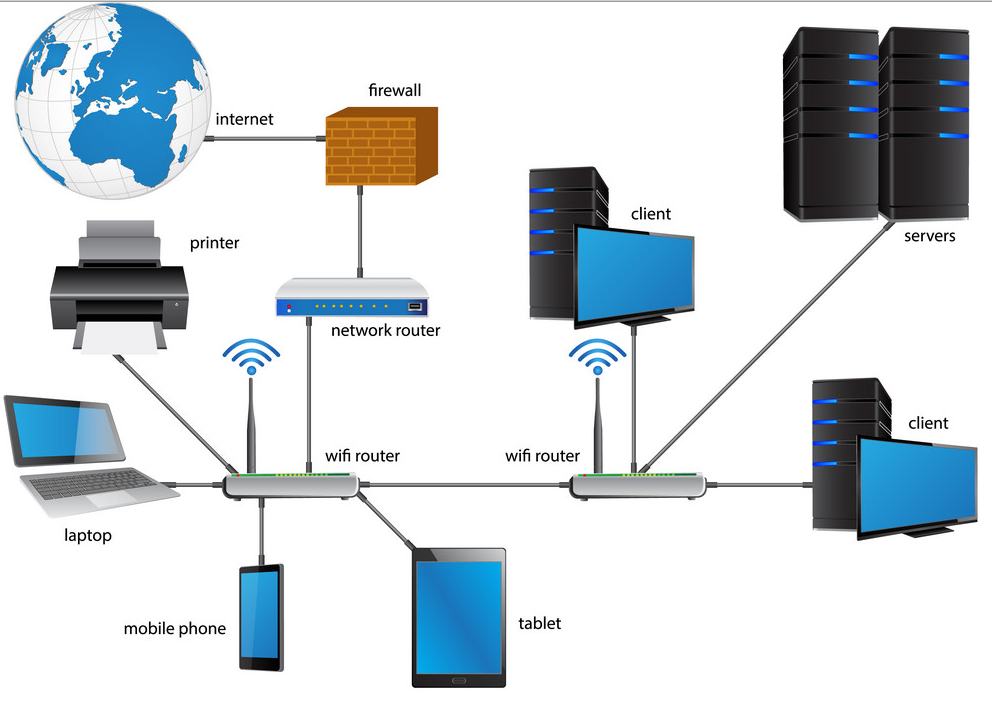

# 开发的简单总结

[toc]

## 1. 基础工具

- 科学上网工具：[Astar](https://www.astarvpn.com/index.html)（不限时限量，全局，20$ 半年）、Chrome
- 代码编辑工具：VS Ccode（推荐 [Anthony Fu](https://github.com/antfu?tab=repositories) 的配置 [vscode-setting](https://github.com/antfu/vscode-settings)）、IntelliJ IDEA、Sublime Text
- markdown 笔记：typora、Marktext、Notion、博客（vuepress：  [地信遥感数据汇](https://gisrsdata.com/)、gitbook： [笔记本类型的博客](https://ting-xin.github.io/notebook/)、Hexo）、Slidev
- 项目管理工具：git（ps: [learngitbranching](https://learngitbranching.js.org/)）、github、Linux 基本命令（ps：[Linux Tools Quick Tutorial](https://linuxtools-rst.readthedocs.io/zh_CN/latest/base/index.html)）
- 小工具：everything、Snipaste、Geek、DeepL、浏览器插件（listen1、Grammarly）等
- 其它：leetcode、牛客、一些博主（阮一峰、Anthony Fu、面向信仰编程、被删的前端乐园）、up主（鱼皮、猿油站、程序员山月）、公众号和群等

## 2. 基础知识

### 2.1数据结构和算法

#### 2.1.1 简要介绍

[数据结构大纲](../dataStructure/大纲.md)

#### 2.1.2 例子

空间索引数据结构，下图引用自 [Mo Sarwat](https://twitter.com/MoSarwat/status/1516547385203191808)：

空间索引

空间索引对于快速高效地处理地理空间数据至关重要，上图是四种空间索引：

1. Uniform grids，最简单也最好理解的空间索引
2. Quad-Tree 四叉树，越密的地方索引越多了
3. KD-Tree，不再是规则的四个网格
4. R-Tree，空间上没有浪费了，越密的索引也越多了

但是现在 PostGreSQL 用的是 GIST(Generalized Search Trees) 索引，它能够支持在一个索引结构中，存储平面、三维、多维的数据，并且不仅适合空间数据，也适合其它数据类型

#### 2.1.3 推荐资源

- 《大话数据结构》
- 《剑指 offer》
- [OI Wiki](https://oi-wiki.org/)
- [leetcode](https://leetcode.cn/)

### 2.2 计算机网络

#### 2.2.1 简要介绍

广域网和局域网

局域网网络示意图

网络、外网和内网

OSI 模型

OSI 模型每一层对应的协议

#### 2.2.2 例子

1. 从输入 URL 到网络展示

从输入 URL 到网络展示

中国国家防火墙

VPN 工作流程

#### 2.2.3 推荐资源

- 《图解 HTTP》
- 《图解 TCP/IP》
- 《计算机网络：自顶向下方法》

### 2.3 操作系统

#### 2.3.1 简要介绍

操作系统

基本的硬件设备

典型系统的硬件组成

操作系统提供了几种抽象模型

- 文件：对 I/O 设备的抽象
- 虚拟内存：对程序存储器的抽象
- 进程：对一个正在运行程序的抽象
- 虚拟机：对整个操作系统的抽象

这些抽象和我们的日常开发息息相关。搞清楚了操作系统是如何抽象的，才能培养我们的抽象性思维和开发思路。很多问题都和操作系统相关，操作系统是解决这些问题的基础。如果你不学习操作系统，可能会想着从框架层面来解决，那是你了解的还不够深入，当你学习了操作系统后，能够培养你的全局性思维。计算机的底层相当于就是楼的根基，计算机应用相当于就是楼的外形，而操作系统就相当于是告诉你大楼的构造原理，这三部分都需要较为了解之后才能构建一个稳定的房子。

#### 2.3.2 例子

例子引用自 [CSAPP](https://hansimov.gitbook.io/csapp/ch01-a-tour-of-computer-systems/1.4) ，该例子是操作系统怎么运行一个 hello.c 程序

1. 输入命令：当我们在键盘上输人字符串 “./hello” 后，shell 程序将字符逐一读入寄存器，再把它存放到内存中

从键盘上读取 hello 命令

2. 加载可执行代码：利用直接存储器存取技术（DMA）数据可以不通过处理器而直接从磁盘到达主存

从磁盘加载可执行文件到内存

3. 处理机器码：一旦目标文件 hello 中的代码和数据被加载到主存，处理器就开始执行 hello 程序的 main 程序中的机器语言指令。这些指令将 “hello, world\n” 字符串中的字节从主存复制到寄存器文件，再从寄存器文件中复制到显示设备，最终显示在屏幕上。

将字符串从存储器写到显示器

#### 2.3.3 推荐资源

- 《深入理解计算机系统》
- [Linux Tools Quick Tutorial](https://linuxtools-rst.readthedocs.io/zh_CN/latest/base/index.html)
- [总结操作系统核心知识点](https://www.cnblogs.com/cxuanBlog/p/13297199.html)

## 3. 数据存储

### 3.1 文件存储

#### 3.1.1 简要介绍

- “**In Linux, everything is a File**”.

Linux 文件系统

在 Linux 中，基本上有三种类型的文件：

1. 普通/常规文件
2. 特殊文件
3. 目录

- 这种哲学有什么好处？

键盘的输入存储为文件

该思想就是一个面向对象的思想。我们有一个键盘，它是一种输入设备。键盘传递的数据存储在 /dev/input/event* 文件中并重定向到标准输入。每当我们打印时，我们都会将数据传递给标准输出，监视器将使用它来打印数据。当有一天我们键盘变了，如果输入没有存储为文件，是不是应该要有一个判断键盘的过程。

- 通过 inode 实现 Linux 文件系统

**inode**（索引节点）是[Unix 风格文件系统](https://en.wikipedia.org/wiki/Unix_filesystem)中的一种[数据结构](https://en.wikipedia.org/wiki/Data_structure)，用于描述[文件系统](https://en.wikipedia.org/wiki/File_system)对象，例如[文件](https://en.wikipedia.org/wiki/Computer_file)或[目录](https://en.wikipedia.org/wiki/Directory_(computing))。

inode包含文件的元信息，具体来说有以下内容：

> 　　* 文件的字节数
>
> 　　* 文件拥有者的User ID
>
> 　　* 文件的Group ID
>
> 　　* 文件的读、写、执行权限
>
> 　　* 文件的时间戳，共有三个：ctime指inode上一次变动的时间，mtime指文件内容上一次变动的时间，atime指文件上一次打开的时间。
>
> 　　* 链接数，即有多少文件名指向这个inode
>
> 　　* 文件数据block的位置

VFS 实现机制

本地文件系统本质上就是实现对磁盘空间的管理，实现磁盘线性空间与目录层级结构的转换

#### 3.1.2 例子

1. 分布式文件系统

**分布式文件系统最大的特点是服务端通过计算机集群实现，可以实现横向扩展**，存储端的存储容量和性能可以通过横向扩展的方式实现近似线性的提升。

Google File System 系统架构

#### 3.1.3 推荐资源

- 《鸟哥的linux私房菜》
- [The Google File System](https://static.googleusercontent.com/media/research.google.com/en//archive/gfs-sosp2003.pdf)
- [INTRODUCTION TO THE LINUX VIRTUAL FILESYSTEM (VFS) -- PART I: A HIGH-LEVEL TOUR](https://www.starlab.io/blog/introduction-to-the-linux-virtual-filesystem-vfs-part-i-a-high-level-tour)

### 3.2 数据库

#### 3.2.1 简要介绍

文件就可以存储数据，为什么要有数据库，因为文件存储有以下缺点：

- **文件需要特殊的应用程序才能读写** —— SQL是对随机数据访问和分析的抽象。如果没有这种抽象，你将需要自己编写所有的访问和分析数据的代码

- **数据异构性的部分原因是因为文件的存储方式****——**文件格式成百上千，数据组织方式更是难以捉摸，数据的转换、管理、检索难度太大，但是数据库已经提供了一套完善的事务机制

- **大型数据集可能被切分**——处理大型数据集，如果使用文件存储，它们可能被分成多个文件；但在数据库中，它们可以存储在单个大的二维表中

- **并发操作可能导致损坏数据** —— 虽然你可以编写额外的代码以确保对同一文件的多次写入不会损坏数据，但当你解决了问题并同时解决了相关性能问题时，你已经编写了数据库系统的较好部分。那为什么不直接使用标准数据库呢？

- **复杂的问题需要复杂的应用程序来回答** —— 复杂而有趣的空间分析问题（空间连接、聚合等）可以在数据库中使用一行SQL代码来表达，但是在对文件进行编程时，需要数百行专门的代码来解决

数据规范化

常见的数据库

1、SQL Server

2、Oracle

3、Sybase

4、InforMix

5、DB2

6、MySQL

7、NoSQL

8、[SQLite](https://so.csdn.net/so/search?q=SQLite&spm=1001.2101.3001.7020)

9、[PostgreSQL](https://so.csdn.net/so/search?q=PostgreSQL&spm=1001.2101.3001.7020)    PostGIS

10、[MongoDB](https://so.csdn.net/so/search?q=MongoDB&spm=1001.2101.3001.7020)

11、Redis

#### 3.1.2 例子

postgis：

空间数据存储体系架构的发展

## 4. 语言及其框架

前后端划分

### 4.1 前端

#### 4.1.1 语言和框架

vite 对 webpack

|                语言                |     框架或库     |             UI              |
| :--------------------------------: | :--------------: | :-------------------------: |
|       JavaScript（ES5、ES6）       |      JQuery      |          bootstrap          |
| Vue2、Vue3（ES5、ES6、TypeScript） |  Vue-cli、Vite   |   Elment-UI、Element-Plus   |
|   React（ES5、ES6、TypeScript）    | create-react-app |         Ant-Design          |
|  Angular（ES5、ES6、TypeScript）   |                  | Material Design for Angular |

相比选择哪种框架，学习哪种框架，更重要的是前端开发下面的这些共用的概念：

- 编译
- 单页应用

- 组件

- 数据流

- 状态管理

- 模板化

- 数据绑定

- 后端API调用

- 路径处理

- 测试

#### 4.1.2 前端知识体系

[Frontend Developer](https://roadmap.sh/frontend)

### 4.2 后端

#### 4.2.1 语言和框架

|  语言   |           框架            |         用例         |
| :-----: | :-----------------------: | :------------------: |
| Node.js |  ExpressJS、Koa、nextjs   | Netfix、Paypal、Uber |
|  Java   | Spring Root、Spring Cloud |       Trivago        |
|   Go    |            Gin            |  kubernets，docker   |
| Python  |       Django、Flask       |      Instagram       |
|  Ruby   |       Ruby on Rails       |   GitHub、Shopify    |
|   C#    |         Asp .NET          |      Microsoft       |

为什要使用后端框架：

- 节省时间
- 可扩展性
- 健壮性
- 安全
- 集成

除此之外，大多数框架都是开源的！

#### 4.2.2 后端知识体系

[back developer](https://roadmap.sh/backend)

### 4.3 联调

尝试一个demo

## 5. 学习路线

广度到深度

#### 5.1 广度

#### 5.2 深度

1. JS 原型链：

原型基本关系

JS 构造关系

JS 原型链

2. node.js 的异步机制：

node.js 的异步机制

