# GDAL

[toc]

GDAL源码剖析与开发共9章分3个部分：

1. 第一部分为前五章，GDAL简介，ORG库，GDAL库以及GDAL的数据格式和配置项
2. 第二部分是6到8章，GDAL的高级使用说明，包括GDAL格式扩展，GDAL算法和CPL库
3. 第三部分是第9章，介绍GDAL工具的使用

## GDAL简介


### 什么是GDAL？


GDAL提供了一系列算法接口，比如矢量栅格化，栅格矢量化，图像校正以及DEM相关的算法接口

GDAL源码目录结构

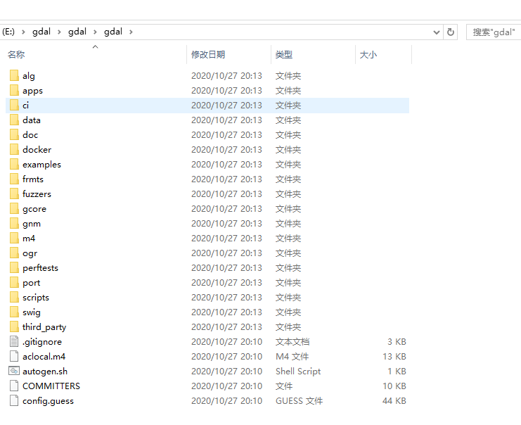

- alg：提供算法的源代码，算法有：DEM生成登高线，图像纠正算法，栅格矢量化，矢量栅格化，格网计算，分类图小碎斑块去除
- apps：存放的是GDAL库中提供的一些命令行工具集的源代码，eg：gdalinfo
- data：配置文件，eg：各种投影文件
- doc：帮助文档
- frmts：gdal针对不同图像格式解析的源代码
- gcore：gdal的灵魂，抽象类的数据集，波段，图像读写接口都在这里面
- ogr：emmm，负责读写矢量的
- port：gdal库的底层的支持库，基本操作的实现，eg：字符串的操作，文件处理，网页请求，数据库连接，哈希表，字符加密文件压缩等
- swig：封装库的工具

### 编译gdal

#### C++


1. nmake -f makefile.vc

有坑，gdal3版本以上的编译的时候需要proj库的支持


又重新下载了2.4.1版本的

编译结果：


2. 生成gdal_vs2017.vcxproj这个文件

执行：generate_vcxproj.bat 15.0 64 gdal_vs2017（虽然我是2019的环境，但是好像没有影响）

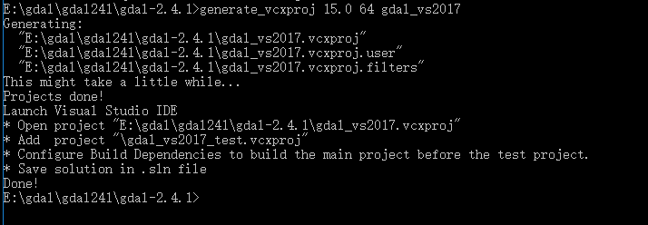

3. 有这个文件之后就可以编译了

打开该文件，生成解决方案（可能会要求重定解决方案目标）即可

#### Python

python编译就很简单，有环境就行，但是我记得好像有坑，对，就是版本不符合的情况，需要环境对应的版本，所以不能使用conda和pip的方式安装，需要自己下载对应的版本


## OGR空间参考

### 空间参考简介

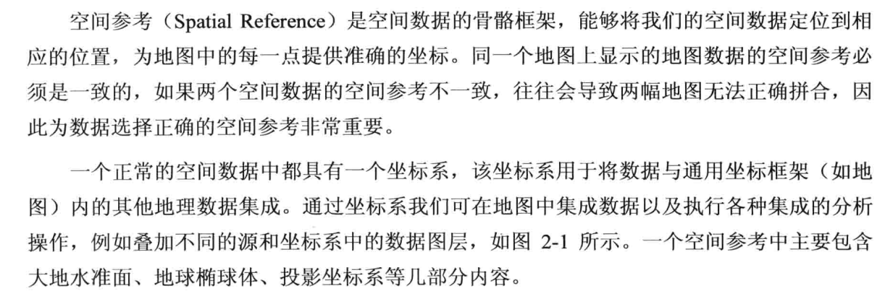

- 大地水准面：由静止海水面向大陆延伸所形成的不规则的封闭曲面

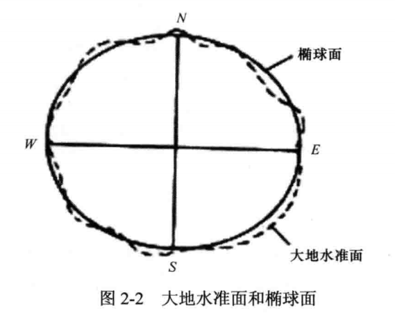

- 地球椭球体：人们选用的一个同大地水准面相近的可以用数学方法来表达的椭球体（规则曲面）
- 基准面：特定区域内与地球表面极为吻合的椭球体

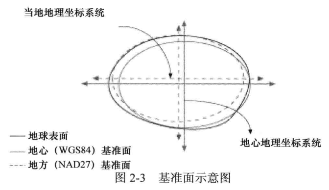

#### 地图投影

把地球表面的任意点利用一定的数学法则，转换到地图平面上的理论和方法

- 地理坐标系（GCS)

用于确定地物在地球上位置的坐标系，一般是基于某一个基准面使用三维球面来定义位置。GCS应该包括：角度测量单位、本初子午线、基准面。

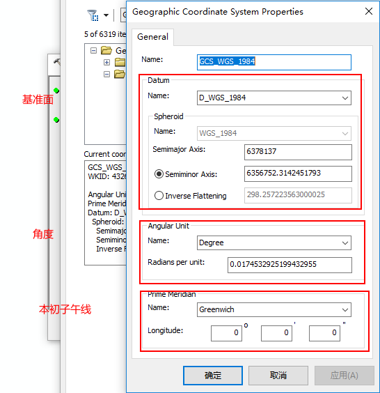

- 投影坐标系（JCS）

投影坐标系是基于地理坐标系的，使用x，y值来描述地球上某个点的位置


#### OGR实现空间参考

空间参考主要有以下十种表示方法（gdal默认格式为WKT）：


在OGR中，类OGRSpatialReference封装了投影和基准面的定义。

导入坐标系：

- ImportFromWkt(<wkt>)
- ImportFromEPSG(<epsg>)
- ImportFromProj4(<proj4>)
- ImportFromESRI(<proj_lines>)
- ImportFromPCI(<proj>, <units>, <parms>)
- ImportFromUSGS(<proj_code>, <zone>)
- ImportFromXML(<xml>)

导出坐标系：

- ExportToWkt()
- ExportToPrettyWkt()
- ExportToProj4()
- ExportToPCI()
- ExportToUSGS()
- ExportToXML()

OGR空间参考的转换是基于PROJ4库来实现的。OGR中进行坐标转换的类是OGRCoordinateTransformation，转换的时候先创建一个对象，然后调用Transform方法来进行坐标转换。

对一个几何形状进行投影变换（Linux环境下）：

```python
sourceSR = osr.SpatialReference()
sourceSR.ImportFromEPSG(32612) #UTM 12N WGS84
targetSR = osr.SpatialReference()
targetSR.ImportFromEPSG(4326) #Geo WGS84
coordTrans = osr.CoordinateTransformation(sourceSR, targetSR)
geom.Transform(coordTrans)
```

这个过程很可能会失败，因为它可能使用了PROJ.4库不支持的投影或者转换的几何对象中有一个以上没有定义的数字。

## OGR库说明

OGR主要由以下七个部分组成：


1. Geometry：类Geometry (包括OGRGeometry等类)封装了OpenGIS的矢量数据模型，并提供了一些几何操作，WKB(Well Knows Binary)和WKT(Well Known Text)格式之间的相互转换，以及空间参考系统(投影)。

2. Spatial Reference：类OGRSpatialReference封装了投影和基准面的定义。

3. Feature：类OGRFeature封装了一个完整feature的定义，一个完整的feature包括一个geometry和geometry的一系列属性。

4. Feature Definition：类OGRFeatureDefn里面封装了feature的属性，类型、名称及其默认的空间参考系统等。一个OGRFeatureDefn对象通常与一个层(layer)对应。

5. Layer：类OGRLayer是一个抽象基类，表示数据源类OGRDataSource里面的一层要素(feature)。

6. Data Source：类OGRDataSource是一个抽象基类，表示含有OGRLayer对象的一个文件或一个数据库。

7. Drivers：类OGRSFDriver对应于每一个所支持的矢量文件格式。类OGRSFDriver由类OGRSFDriverRegistrar来注册和管理。

### Geometry（几何对象）

Geometry包括了各种各样的矢量图形


``` python
# 创建一个点
point = ogr.Geometry(ogr.wkbPoint)
point.AddPoint(1198054.34, 648493.09)
# 创建一条线
line = ogr.Geometry(ogr.wkbLineString)
line.AddPoint(1116651.439379124, 637392.6969887456)
line.AddPoint(1188804.0108498496, 652655.7409537067)
line.AddPoint(1226730.3625203592, 634155.0816022386)
line.AddPoint(1281307.30760719, 636467.6640211721)
# 创建一个面
# 先创建一个ring
ring = ogr.Geometry(ogr.wkbLinearRing)
ring.AddPoint(1179091.1646903288, 712782.8838459781)
ring.AddPoint(1161053.0218226474, 667456.2684348812)
# 把ring添加进面
poly = ogr.Geometry(ogr.wkbPolygon)
poly.AddGeometry(ring)
print("point:\n",point,"\nline:\n",line,"\npolygon:\n",poly)
```


```python
# 从不同格式中创建点
# WKT
wkt = "POINT (1120351.5712494177 741921.4223245403)"
point1 = ogr.CreateGeometryFromWkt(wkt)
# WKB
wkb = b64decode("AIAAAAFBMkfmVwo9cUEjylouFHrhAAAAAAAAAAA=")
point2 = ogr.CreateGeometryFromWkb(wkb)
# GeoJSON
geojson = """{"type":"Point","coordinates":[108420.33,753808.59]}"""
point3 = ogr.CreateGeometryFromJson(geojson)
# GML
gml = """<gml:Point xmlns:gml="http://www.opengis.net/gml"><gml:coordinates>108420.33,753808.59</gml:coordinates></gml:Point>"""
point4 = ogr.CreateGeometryFromGML(gml)
# 打印数据
print("point1:\t",point1,"\tpoint2:\t",point2,"\npoint3:\t",point3,"\tpoint4\t",point4)
```


Geometry还提供了常用的空间分析方法，如求并、交、缓冲区等（基于GEOS库），但是也有很多空间分析方法也没有实现，如叠加

### Spatial Reference(空间参考)

OGR的空间参考系统数据模型继承了OpenGIS的WKT格式，还有一个基于PROJ.4库实现的OGRCoordinateTransformation类用以在不同的坐标系中进行转换


### Feature/Feature Definition（要素/要素定义）

OGRFeature包含了一个OGRGeometry对象，此外还有要素属性、要素ID和要素的类别信息

对于属性表来说，属性的类型、名称是通过OGRFeatureDefn类来定义的，通常一个图层（Layer）对应一个属性表（OGRFeatureDefn），同样类型的要素及其属性表的定义是相同的。

### Layer（图层）

OGRLayer类用来表示一个数据源中一个图层的所有要素，它包含了从数据源中读取要素的方法，OGRLayer可以认为是从数据源中读写要素数据的途径。

OGRLayer包含顺序和随机的读写数据的方法，时间顺序读取所有的要素（GetNextFeature），空间过滤器按照地理范围来找需要的要素（SetSpatialFileter，只能对一个指定图层），更复杂的Fileter可以执行SQL查询语句

``` python3
layerSites.SetSpatialFilterRect(460000, 4590000, 490000, 4600000)
#SQL过滤
result = dsSites.ExecuteSQL("select * from sites where cover = 'grass' order by id desc")
resultFeat = result.GetNextFeature()
while resultFeat :
   printf(resultFeat.GetField('id'))
   resultFeat = result.GetNextFeature()
dsSites.ReleaseResultSet(result)	#将查询结果释放
```

OGRLayer 类和 OGRFeatureDefn类是独立的，但是一个OGRLayer类总是对应一个OGRFeatureDefn类，为什么不将它们合并为一个类呢？

1. 定义的OGRFeature和OGRFeatureDefn是不需要依赖任何OGRLayer 的，所以他们可以在内存中独立存在而不需要依赖数据源中的某个图层
2. SF CORBA模型没有图层的概念

### Data Source（数据源）

一个DataSource是一系列OGRLayer的组合，通常表示为一个文件。OGRDataSource是一个抽象基类，从该类派生的每个子类都是一种文件格式驱动的实现，我们不能直接实例化该类，而是实例化OGRSFDriver类。

### Drivers（格式驱动）

每一个OGRSFDriver对象都是一个OGR支持的一种文件格式的实现，OGRSFDriver对象使用OGRSFDriverRegistrar类来进行注册的。

## GDAL库说明

### GDAL数据集总体概况

GDAL使用抽象数据模型来解析它所支持的数据格式，抽象数据模型包括以下几部分：数据集（Dataset），坐标系统（Coordinate System），仿射地理坐标转换（Affine GeoTransform），地面控制点（GCPs），元数据（Metadata），子数据集域（Subdatasets Domains），图像结构域（Image_Structure Domain）、RPC域（RPC Domain）、XML域（XML Domian），栅格波段（Raster Band），颜色表（Color Table）和快视图（Overviews）

数据集（Dataset）是有栅格波段和一些相关信息共同组成，在一个数据集中所有波段具有相同的大小，相关信息包括数据的地理坐标、投影信息和一些元数据信息等

坐标系统使用WKT格式来表示，GDAL数据集中有两种方式来表示栅格序列号坐标和地理坐标之间的关系，第一种是利用仿射变换来表示，另外一种是利用GCP（地面控制点）点对来表示，数据集中一般会包含一个仿射地理坐标转换参数或GCP点。GDAL数据模型中不会存储用GCP点对进行图像纠正的转换方程，这个转换方程有应用程序处理

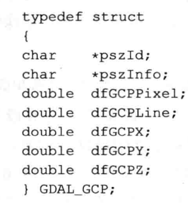

元数据是对数据的辅助说明，与影像在磁盘中的存储方式没有特定关系。

子数据集域是包含有很多个子数据集的字符串列表，提供指向多个影像的指针

图像结构域，与图像的格式及存储机制紧密关联，定义的项目主要有以下几个：compression：数据集或者波段的压缩方式，nbits：当前数据集中一个或多个波段实际占用的比特数，等

RPC域（RPC Domain）：与仿射变换一个作用，都是用来表示图像行列号与空间参考位置间的变换，但是它保存的是有理函数模型的系数

栅格波段（Raster Band），在GDAL中栅格波段使用GDALRasterBand类表示，它表示一个栅格波段、通道或者图层。栅格波段包含以下属性：行列数（可以是金字塔的行列数），数据类型，块大小（通过块读取数据是最高效的方式），元数据，以及一些可选的属性

快视图（Overviews），每个快视图都是一个独立的GDALRasterBand，是通过原始图像进行降采样得到的，用于图像的快速显示。

### GDAL常用类说明

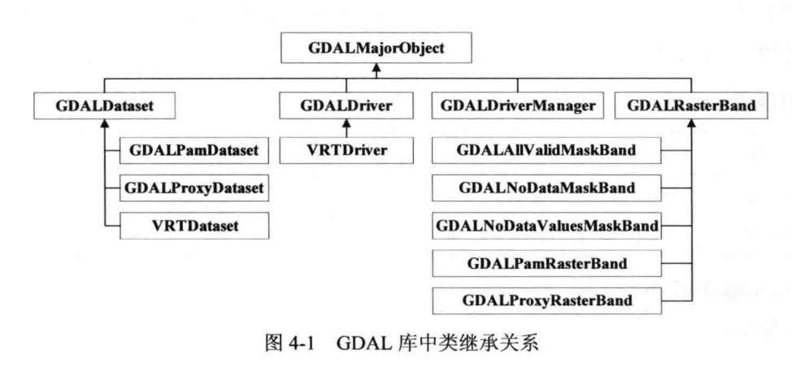

GDALDataset是相关栅格波段的集合；GDALDriver是格式化的驱动，这个类的每个实例都支持一种格式，并且管理该格式的相关信息；GDALDriverManager是管理文件格式驱动的注册信息的类；GDALRasterBand是处理一个单波段的栅格数据

### GDAL元数据说明

元数据中存储的是对图像数据的描述信息，比如JPG图像中的EXIF信息，HDF数据中的一些描述信息，关于元数据信息可以通过gdalinfo工具进行查看

``` python
gdalinfo HYP_50M_SR_W.tif
```

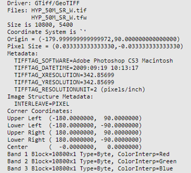

我们得到的信息有：

•图像驱动是“ GTiff / GeoTIFF”

•图像尺寸为10800x5400

•图像四个角的坐标

•没有坐标系

### RasterIO使用说明

使用GDAL读写图像是最基本的操作了，RasterIO类就是最常用的函数了，RasterIO分为GDALRasterBand类的和GDALDataset类的，两者大多数情况是一致的

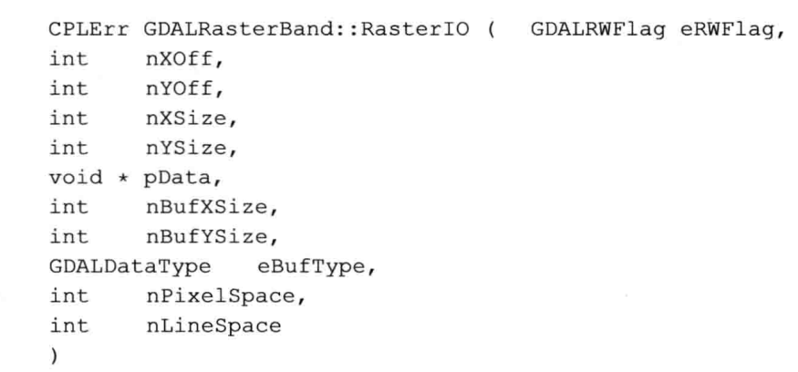

### 图像金字塔

图像金字塔是以多分辨率来解释图像的一种结构，一幅图像的金字塔是一系列以金字塔形状排列的分辨率逐步降低的图像集合。目前遥感图像的金字塔格式主要有两种：rrd格式，ovr格式。

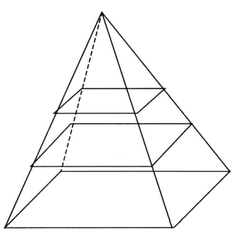

### 颜色表

颜色表是GDALRasterBand中的一个属性，颜色表的本质是给每一种灰度值设置一个颜色，用以让一个灰度图像变成彩色图像，最常用的就是分类图了，网络地图的矢量切片地图也用颜色表，可以在保持图像色彩不变的情况下大大减少数据量，一般我们认为图像的一个瓦片是一个三波段的PNG图像，实际上它只是一个单波段的带有颜色表的图像。

### 图像统计信息

图像统计信息包括直方图信息，最大最小值，均值和标准差，在计算统计值的时候，对于大图像的计算量是很大的，所以在第一次计算的时候就把计算的结果信息保存，GDAL使用了一个.aux.xml的辅助文件来将这些信息存储

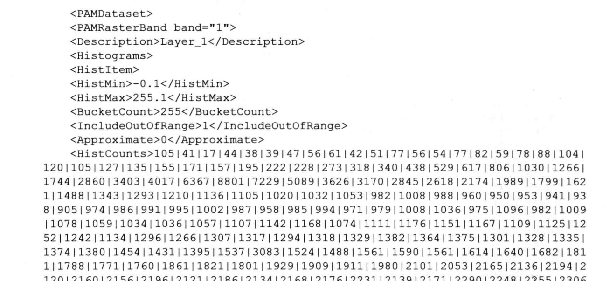

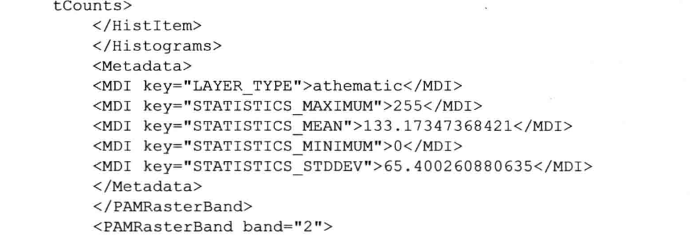

## GDAL数据格式及配置项说明

GDAL库中提供了大多数的图像数据和矢量数据的支持，但是对于某些数据而言，在读写（尤其是创建和更新数据时）时候要按照一定的规则来进行处理，这一章接下来的都是对格式的介绍了，没变要细看

## GDAL格式扩展说明

如果算法库是基于GDAL进行编写的，那么要支持一种新的格式，就需要将所有的算法重新编写，这样势必产生大量的重复性工作，但是GDAL提供了格式扩展说明，即使我们处理一些目前GDAL不支持的数据格式，比如自定义的图像个格式，也可以通过GDAL进行格式扩展，使之能够读写自定义的格式，这样就不必修改上层的算法，更新以下GDAL库即可。

### 栅格格式扩展

一般来说，GDAL对新格式的扩展需要对GDALDataset类和GDALRasterBand类的继承来实现，然后为一个新格式创建一个GDALDriver的实例，然后通过GDALDriverManager类将新格式的驱动进行注册，实现一个新格式的驱动主要包含以下九部分的内容：

1. 从Dataset继承
2. 从RasterBand继承
3. 栅格驱动（Driver）
4. 添加驱动到GDAL中
5. 添加地理参考信息
6. 金字塔（快视图）
7. 创建文件
8. RawDataset和RawRasterBand类
9. 元数据和其它外部扩展

改代码演示了如何创建一个读取日本地理测量学会定义的DEM数据格式的驱动，[网址](https://github.com/OSGeo/gdal/blob/master/gdal/frmts/jdem/jdemdataset.cpp)

1. Dataset继承：通过重载GDALDataset中的一些虚函数来为驱动重新实现这些特殊功能，但是Open()函数不是基类的虚函数，所以需要一个独立的函数来实现该功能。
2. 先尝试驱动是否支持该类型，如果可以则将所有波段与当前的GDALDataset对象绑定

好复杂，不想看了，自己感觉也用不上

### 矢量格式扩展

对OGR库扩展的一般流程就是从OGRSFDriver类，OGRDataSource类和OGRLayer类继承三个子类，然后从OGRSFDriver类继承的子类使用OGRSFDriverRegistrar进行注册。

以一个简单的文本存储的点文件格式为例，对OGR库的扩展进行一些说明，主要包括三个方面：实现OGRSFDriver类，从数据源中读取数据，读取图层

#### 实现OGRSFDriver类

实例化函数

```c++
void RegisterOGRSPF () {
    OGRSFDriverRegistrar::GetRegistrar()->RegisterDriver(new OGRSPFDriver());
}
```

驱动类一般实现对该格式的读取（Open）、创建（CreateDataSource）和删除（DeleteDataSource)，驱动类定义如下：

```c++
class OGRSPFDriver : public OGRSFDriver{
    public:~OGRSPFDeiver();
    const char* GetName();
    OGRDataSource* GetName();
    OGRDataSource* Open(const char*, int);
    OGRErr DeleteDataSource(const char* pszName);
    int TestCapability(const char*);
}
```

构造函数使用默认即可：

```c++
OGRSPFDriver::~OGRSPFDriver(){
    
}
```

GETName返回一个字符串：

```c++
OGRSPFDriver::~OGRSPFDriver::GetName(){
    return "SPF";
}
```

Open函数：

```c++
OGRDataSource* OGRSPFDriver::Open(const char* pszFileName, int bUpdate){
    OGRSPFDataSource* poDS = new OGRSPFDataSource();
    if(!poDS->Open(pszFileName, bUpdate)){
		delete poDS;
        return NULL;
    }
    else
        return poDS;
}
```

TestCapability()来判断驱动、数据源和图层中的某些功能是否可用，驱动的操作只有创建和删除两种，都返回false即可

```c++
int OGRSPFDriver::TestCapaility(const char* pszCap){
    return FALSE;
}
```

#### 从数据源读取数据

实现只读的数据驱动，数据源的主要功能就是管理图层，对于SPF格式来说，一个数据源就只有一个图层，所以需要在Open函数中图层的名称进行设置，然后对当前的数据格式进行重写

、、、（又没读下去，我真是废物）


## GDAL算法的使用说明

GDAL算法进行说明，实现一些常用的图像处理功能

### GDAL算法处理基础

大图像处理策略：随着影像的分辨率越来越高，数据愈来愈大，处理大图像最常用的策略是分块，每次只处理一块数据，直到处理完所有的块，常用的分块有：按行分块、按正方形分块和其它矩形分块

按行分块就是一次性处理一行数据，常用于图像邻域无关的算法，比如图像融合、数据拉伸等；如果正方形分块，在处理的时候最右边和最下边的分块可能就是不规则的正方形分块。分块的时候有一个总的原则，分块要尽可能大，这样才能减少图像的I/O次数。

如果处理时间长，所以可以加上一个进度条

### GDALWarp说明

GDAL中的Warp类的功能有：图像重采样，图像镶嵌，图像裁切（规则裁切或则AOI裁切），图像校正（RPC、GCP校正），波段合并等

GDALWarp中主要由GDALWarpOperation和GDALWarpOptions两大部分组成，其中前者是用来进行变换操作，后者是构造进行变换操作的选项

图像重投影和后面的投影校正，本质上就是对图像的坐标进行转换，然后进行重采样得到新的图像，它们的步骤基本上是一样的，唯一的区别是坐标转换的函数不同而已

### GDAL坐标转换

GDAL中，所有的坐标转换函数都是有统一的形式的，每一种坐标转换都由三个函数组成，分别是create，destroy，transform

### GDAL地形分析

DEM地形分析中，坡度，坡向，地表粗糙指数，地形方位指数，粗糙度五个算法的实质就是3*3空间卷积算法

### 格网插值

利用离散的数据点创建一个栅格图像的过程，目前的插值算法由三种：反距离权重插值，移动均值插值，最邻近插值

### 小碎斑去除

### 矢量栅格化

### 栅格矢量化

## CPL库介绍

CPL（Common Portability Library）里面封装了大量通用函数，主要有常用的数据结构，文件读写，数据库操作，网络数据读取，多线程等