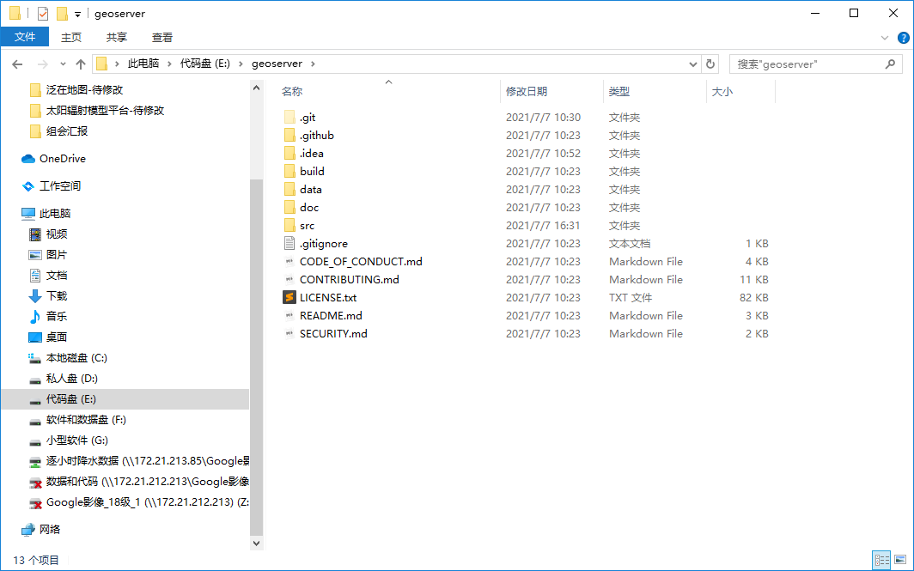

# Geoserver

GIS的意义在于从一堆空间数据中提取、分析、理解并展示出有意义的数据。[B站](https://www.bilibili.com/video/BV14k4y1R749)

GIS行业从业者要兼顾两头和中间，两头是指数据生产和可视化效果，要把目光放在数据（不只是单纯的地理数据，还有一些业务数据）的高效存储，如何在其上构建高效的应用，最终满足业务需求。技术上不能一味的将压力向前端GIS（桌面GIS和WebGIS）传导，而应该构建一体式的解决方案，在数据流转的整个流程上优化。[知乎](https://zhuanlan.zhihu.com/p/87894011)

[github](https://github.com/geoserver/geoserver) [home](http://geoserver.org/)

## GeoServer源码解析和扩展

[博客](https://www.cnblogs.com/sillyemperor/archive/2011/01/05/1926093.html)

- doc包含用户和开发人员向导的源文件
- src是Java源码
- data包含多种GeoServer的数据目录

