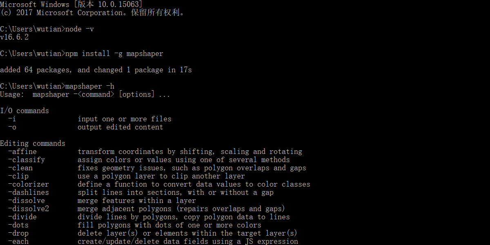
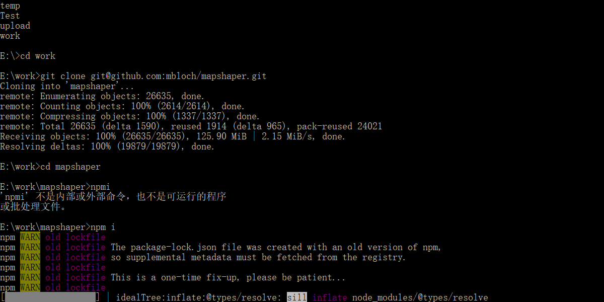
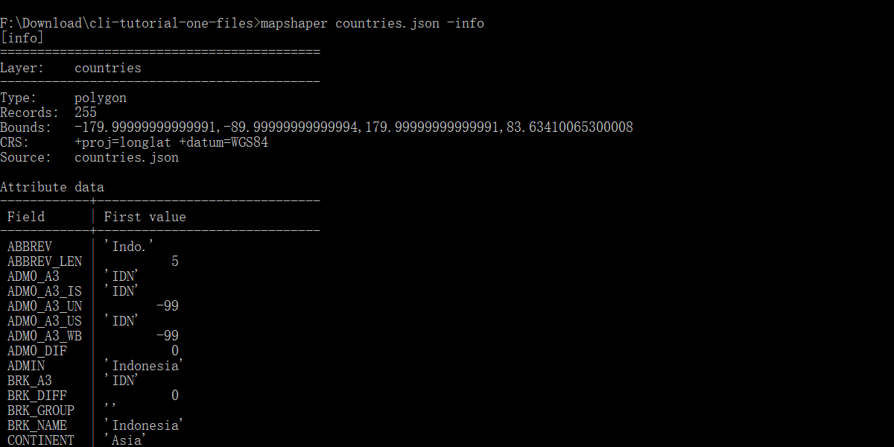
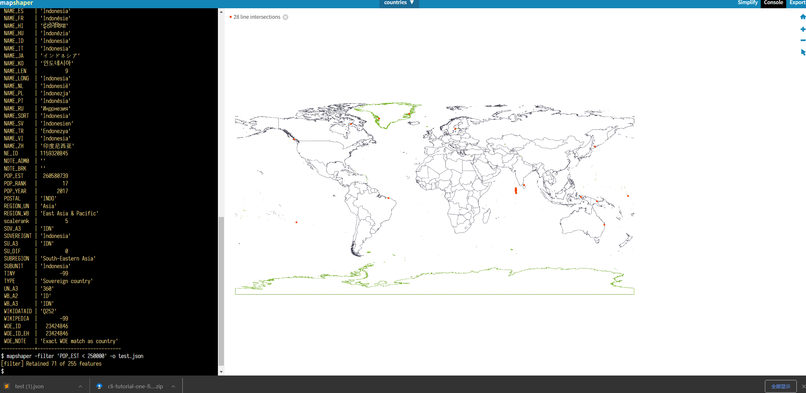

# mapshaper

## 资源

主要是外文资源，GitHub 的资源也不错，其中有个外国 GIS 大佬的[博客](https://moriartynaps.org/)十分nice，大佬喜欢 mapping 和 good tunes，审美简直一绝啊！[地址](https://moriartynaps.org/)。国内我搜到的主要就两个，是一个对 mapshaper 导出的 json 文件进行压缩，一个是简单的介绍，果然学习得看国外的资源:cry:

学习顺序： 简单介绍 $\Longrightarrow$ 大佬博客 $\Longrightarrow$ Github 命令行介绍 $\Longrightarrow$ 源码阅读及集成

[github](https://github.com/mbloch/mapshaper)

[大佬博客](https://moriartynaps.org/command-carto-part-one/)

[mapshaper 简单介绍](https://blog.csdn.net/shaxiaozilove/category_9268291.html)

## mapshaper 简单介绍

### 简介

mapshaper 使用 JavaScript 开发的软件，可用于编辑 shapefile、geojson、topjson 等格式的数据。它的命令行支持必要的地图制作任务，如简化图像、编辑属性信息、裁剪、擦除、合并、过滤等。值得一说的是，官方提供了 [Web UI](https://mapshaper.org/)，所有的处理都在浏览器中完成，即使使用公共网站，数据也会保密，支持大于 1 GB 的文件，甚至可以分配 8 GB 以上的内存支持更多的工作



<div align='center'>从 npm 中安装</div>



<div align='center'>从 GitHub 安装开发代码</div>

mapshaper 的命令分为三类：I/O 命令、编辑、信息类命令

- I/O 命令：常见的数据转换，`mapshaper shapefiles/*.shp -o output/ format=geojson` 将shapefiles文件夹下所有的shape文件转化成geojson文件
- 编辑信息：常见的编辑，`mapshaper usa_counties.shp -clip land-area.shp -o` 用land-aera裁剪usa-counties
- 信息类：输出文件的相关信息，`-info` 打印关于数据层的信息

### 命令行汇总

在命令行中输出  `mapshaper -h` 就能看到所有的命令，[博客翻译](https://blog.csdn.net/shaxiaozilove/article/details/56015843)，但是不全，作者17年写的了

```shell
I/O commands
  -i               input one or more files
  -o               output edited content

Editing commands
  -affine          transform coordinates by shifting, scaling and rotating
  -classify        assign colors or values using one of several methods
  -clean           fixes geometry issues, such as polygon overlaps and gaps
  -clip            use a polygon layer to clip another layer
  -colorizer       define a function to convert data values to color classes
  -dashlines       split lines into sections, with or without a gap
  -dissolve        merge features within a layer
  -dissolve2       merge adjacent polygons (repairs overlaps and gaps)
  -divide          divide lines by polygons, copy polygon data to lines
  -dots            fill polygons with dots of one or more colors
  -drop            delete layer(s) or elements within the target layer(s)
  -each            create/update/delete data fields using a JS expression
  -erase           use a polygon layer to erase another layer
  -explode         divide multi-part features into single-part features
  -filter          delete features using a JS expression
  -filter-fields   retain a subset of data fields
  -filter-islands  remove small detached polygon rings (islands)
  -filter-slivers  remove small polygon rings
  -graticule       create a graticule layer
  -grid            create a grid of square or hexagonal polygons
  -include         import JS data and functions for use in JS expressions
  -inlay           inscribe a polygon layer inside another polygon layer
  -innerlines      convert polygons to polylines along shared edges
  -join            join data records from a file or layer to a layer
  -lines           convert a polygon or point layer to a polyline layer
  -merge-layers    merge multiple layers into as few layers as possible
  -mosaic          convert a polygon layer with overlaps into a flat mosaic
  -point-grid      create a rectangular grid of points
  -points          create a point layer from a different layer type
  -polygons        convert polylines to polygons
  -proj            project your data (using Proj.4)
  -rectangle       create a rectangle from a bbox or target layer extent
  -rectangles      create a rectangle around each feature in a layer
  -rename-fields   rename data fields
  -rename-layers   assign new names to layers
  -simplify        simplify the geometry of polygon and polyline features
  -snap            snap together nearby vertices
  -sort            sort features using a JS expression
  -split           split a layer into single-feature or multi-feature layers
  -split-on-grid   split features into separate layers using a grid
  -style           set SVG style properties using JS or literal values
  -symbols         symbolize points as arrows, circles, stars, polygons, etc.
  -target          set active layer (or layers)
  -union           create a flat mosaic from two or more polygon layers
  -uniq            delete features with the same id as a previous feature

Experimental commands (may give unexpected results)
  -cluster         group polygons into compact clusters
  -data-fill       fill in missing values in a polygon layer
  -fuzzy-join      join points to polygons, with data fill and fuzzy match
  -require         require a Node module for use in -each expressions
  -run             create commands on-the-fly and run them
  -shape           create a polyline or polygon from coordinates
  -subdivide       recursively split a layer using a JS expression

Control flow commands
  -if              run the following commands if a condition is met
  -elif            test an alternate condition; used after -if
  -else            run commands if all preceding -if/-elif conditions are false
  -endif           mark the end of an -if sequence

Informational commands
  -calc            calculate statistics about the features in a layer
  -colors          print list of color scheme names
  -encodings       print list of supported text encodings (for .dbf import)
  -help, -h        print help; takes optional command name
  -info            print information about data layers
  -inspect         print information about a feature
  -print           print a message to stdout
  -projections     print list of supported projections
  -quiet           inhibit console messages
  -verbose         print verbose processing messages
  -version, -v     print mapshaper version
```

### I/O 命令

[原文](https://blog.csdn.net/shaxiaozilove/article/details/54933787) 在这，我读完后的大概总结如下：

- `-i` 可以忽略，允许输入一个多多个 shapefile、json（包括geojson、topojson）、dbf 或限定文本格式的文件
- 不推荐 `merge-files` ，推荐 `combine-files` ，前者是合并，后者是共享拓扑的方式导入多个文件到分离的图层
- `precision` 设置精度
- `encoding=` 编码方式，如果不指定encoding参数，mapshaper会尝试检测 .dbf文件的编码方式，dbf的编码可以利用 .cpg 文件设置
- `pretty` 保证文件的可读性

### 编辑命令

同上，粗略的浏览了一遍，如果要二次开发会具体整理一下的

1. clip：`mapshaper usa_counties.shp -clip land-area.shp -o`

2. dissolve（网上有详细教程）：以指定的属性合并一组要素，若没有指定属性字段，则合并所有要素。对于多边形图层，-dissolve 在合并相邻多边形时会删除公共边界；对于点图层，-dissolve 合并后得到一组点的质心；-dissolve 不支持线图层。

   `mapshaper census_tracts.shp -points -dissolve weight=POPULATION`

3. -dissolve2：与dissolve类似，但可以用来合并相邻或重叠的多边形（考虑拓扑关系），若多边形不相交且数据量很大，使用dissolve

4. -each：将JS表达式应用于图层中的每个要素，用来创建、更新和删除数据项

```shell
# 创建STATE_FIPS和AREA两个字段
mapshaper counties.shp -each 'STATE_FIPS=COUNTY_FIPS.substr(0, 2), AREA=this.area'

# 删除STATE_NAME和GEOID两个字段
mapshaper states.shp -each 'delete STATE_NAME, delete GEOID'

# 字段重命名
mapshaper states.shp -each 'STATE_NAME=NAME, delete NAME'

# 打印NAME属性
mapshaper states.shp -each 'console.log(NAME)'

# 为每个要素指定一个新的数据项
mapshaper states.shp -each 'this.properties = {FID: this.id}'
```

5. -earse：移除落在多边形范围内的要素或部分要素，`mapshaper usa_counties.shp -erase lakes.shp -o`
6. -filter：使用boolean类型的JS表达式移除不满足条件的要素，

```shell
#示例: 从usa_counties.shp中选择 STATE字段中包含 ME、VT、NH、MA、CT、RT的要素，并输出为ne_counties.shp
mapshaper usa_counties.shp -filter '"ME,VT,NH,MA,CT,RI".indexOf(STATE) > -1' -o ne_counties.shp
```

7. -join：将源图层或文件的属性数据连接到目标图层，如果为连接字段关键字(keys=)指定有值，mapshaper通过匹配关键字的值进行记录连接，如果没有指定值，mapshaper执行点到多边形或多边形到点的空间连接（居然支持连接操作，很:cow:啊）
8. -lines：提取多边形的边界（包含拓扑关系）
9. -merge-layers：将几个图层的多个要素融合到一个图层中，仅适用于具有相同几何类型和属性表的图层

```shell
#示例：将分离的多个州图层文件融合到太平洋州图层中， -i combine-files用来说明图层文件在默认情况下是单独处理的
mapshaper -i OR.shp WA.shp CA.shp AK.shp combine-files \
    -merge-layers \
    -o pacific_states.shp
```

10. -split：分类输出， 依据属性表中的值对目标图层中的要素进行分类并输出到不同的图层中，如果没有指定属性字段，每个要素都被拆分到独立的图层中

### 信息类命令

同上

1. -calc：利用JS表达式计算并展现数据表的基本描述性统计结果，包括 count、sum、average 等等
2. -info：打印数据集信息
3. -inspect：列出属性表中一条要素的信息
4. -projections：投影信息

感谢博主！

## Command Cartoo - The Terminal

命令行界面（Command Line Interfaces, CLI），就像 80 年代的打字游戏一样，只能识别特定的命令，对于游戏来说这是一种痛苦，但是对于 GIS 来说是一个天赐良机。它可能不能解决所有的 GIS 问题，但是你可以通过命令行制图来解决许多的麻烦

### 为什么选择 CLI

- 重复性：GIS 的工作中的每个操作基本上都是永久的更改原始文件，例如投影、裁剪、叠加、数据连接等操作，并且是一个操作紧跟一个操作的进行。如果你需要在早期的版本上更改东西，你会耗费大量的精力。CLI 的最大的优点就是每个操作都可以被记录下来并且重复的，你可以根据需求对早期的工作进行调整
- 文档：与重复性相对应的就是可以为自己的 GIS 处理创建一个完美的文档，这样即使过去了很久，你也可以根据文档看出你以前做了什么事
- 批处理：如果你想要操作大量的文件，你可以很容易的为每个文件运行同样的 GIS 操作
- 混搭其他操作：除了 GIS 操作，我们也可以用其它的 CLI 命令。比如通过 fetch api 从网站上拿到数据，对 csv 等文本格式进行操作，CLI 脚本也可以采用多种语言来写
- 更酷：帅就完事了

### 实践一下

1. [Download this file. (4.9 MB)](https://moriartynaps.org/assets/files/cli-tutorial-one-files.zip)，一份世界地图 shapefile 文件
2. 改变文件格式 `mapshaper countries.shp -o countries.json format=topojson`，mapshaper 能够在以下的格式中相互转换：shapefile、geojson、topojson、json、dbf、csv、tsv、svg
3. 改变文件投影： `mapshaper countries.json -proj robin -o countries-projected.json`，通过 `mapshaper -projections`，并不支持西安80坐标系和北京2000 坐标系，支持的投影略少
4. 过滤：我想要过滤文件，首先对文件有个大概的了解：



<div align='center'>文件信息</div>

根据人口来过滤：`mapshaper countries.json -filter 'POP_EST < 250000' -o countries-lowpop.json` 但是本机上运行提示我找不到指定文件，不知道为啥，，，



<div align='center'>过滤操作</div>

根据字符串来过滤：`mapshaper countries.json -filter '"South America".indexOf(CONTINENT) > -1' -o south-america.json`，就选择南美这个国家的了

5. 上文说过 mapshaper 自己支持的投影有点少，可以根据自己的 proj4 字符串重新定义投影，常见的投影可以通过  [epsg.io](epsg.io) 获得

```shell
mapshaper south-america.json -proj +proj=poly +lat_0=0 +lon_0=-54 +x_0=5000000 +y_0=10000000 +ellps=aust_SA +towgs84=-57,1,-41,0,0,0,0 +units=m +no_defs -o south-america-projected.json
```

6. 连接 csv data：`mapshaper countries.json -join native-red-pandas.csv keys=NAME,COUNTRY -o countries-with-pandas.json` keys 告诉 mapshaper我们用哪个字段来连接，前一个字段是 GIS 文件的连接字段，后一个是 csv 的字段

### 命令链条

每条命令结果上都有些重复，所以更好的解决办法用一个命令的链条的形式运行很多个命令：

```shell
mapshaper countries.json ^
	-join native-red-pandas.csv keys=NAME,COUNTRY ^
	-filter '"yes".indexOf(PANDAS) > -1' ^
	-clean ^
	-proj +init=EPSG:32645 ^
	-o countries-with-pandas.json
```

这里 clean 的作用是正在处理的数据中可能存在轻微的拓扑错误，clean 用于整理杂散点和未对齐的边界

## Command Cartoon 2 - Make

