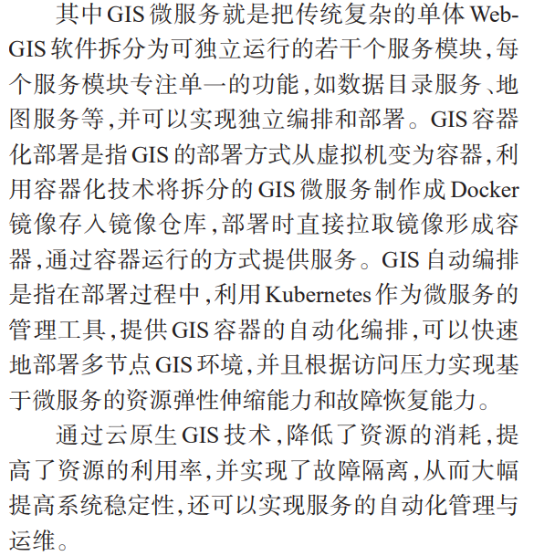
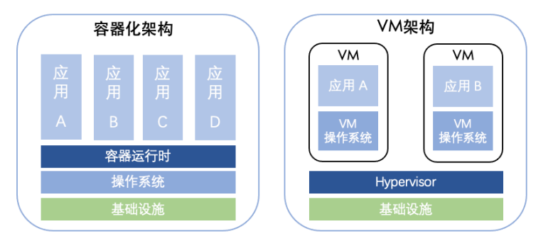
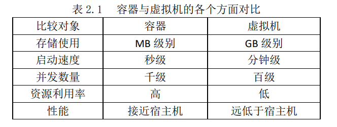
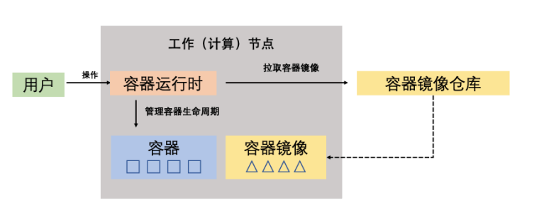
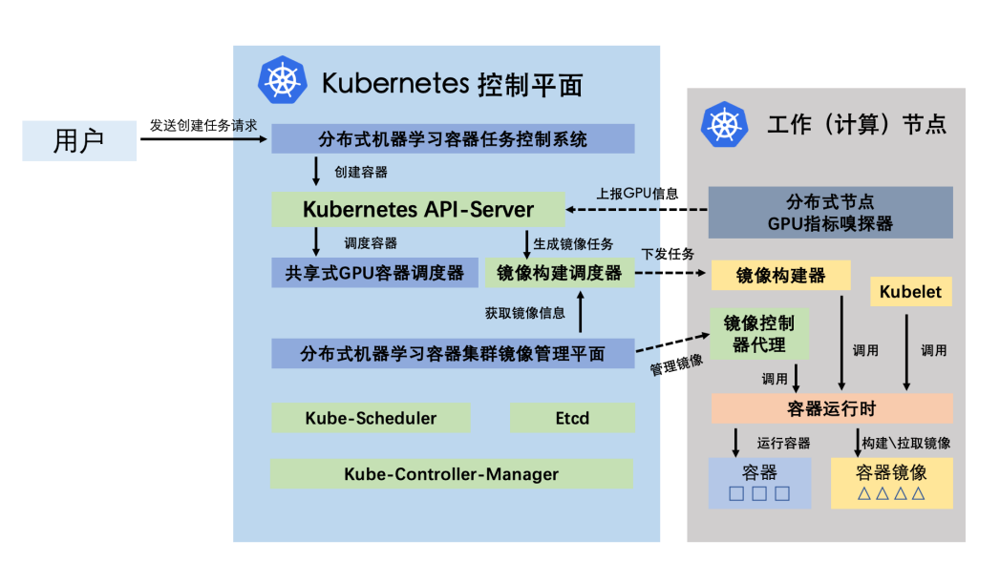
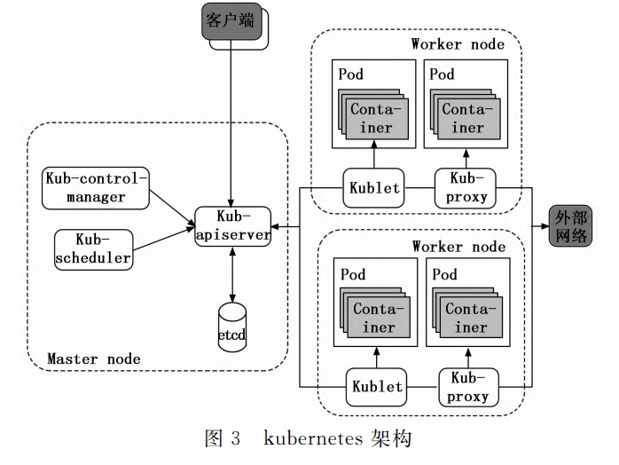
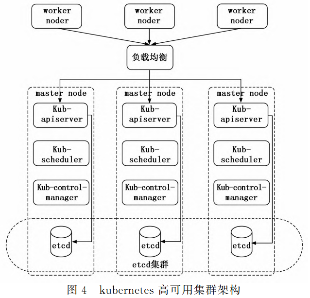
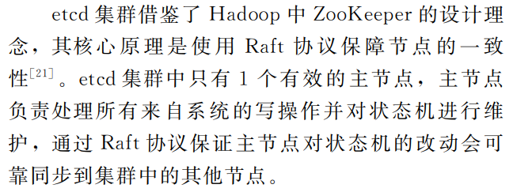
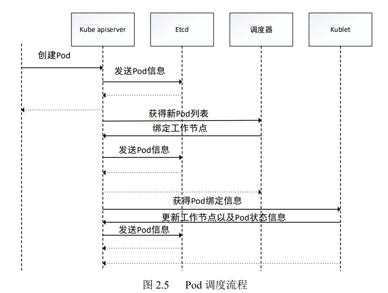

# 云原生 GIS

Geo-distributed efficient deployment of containers with Kubernetes

## 1. GIS基础软件技术体系发展及展望 宋关福

如今 GIS 基础软件已经形成了五大技术体系：

- 大数据 GIS 技术体系：增加了对空间大数据的存储管理、分析处理以及可视化的能力，丰富了空间数据的内涵（大数据不用分布式干的起来？）
- 人工智能 GIS 技术体系：GIS 通过结合人工智能相关算法，增强了 GIS 模型的分析预测能力
- 新一代三维 GIS 技术体系：实现二三维 GIS 一体化和多源异构数据的融合
- 分布式 GIS 技术体系：突破了数据类型和容量的限制，数量级提升了 GIS 软件的性能，让高可用高可信 GIS 应用成为可能
- 跨平台 GIS 技术体系：使得 GIS 软件可运行于不同类型的 CPU 架构和操作系统（这也能算一个体系？）

中国 GIS 技术发展的阶段

随着地理空间数据的数据量爆炸式增长，GIS 软件技术即应用面临数据密集、计算密集、并发密集和时空密集四大挑战，传统 GIS 软件已很难应对这些挑战，迫切需要通过分布式技术来突破超大规模时空数据和服务管理，以满足各类用户对超大规模时空数据和服务管理。

分布式 GIS 技术体系结构

## 2. *基于 Kubernetes 的机器学习云平台设计与实现 李俊江

这位大佬太牛逼了，论文很强，可惜我几乎看不懂=_=，，， [GitHub地址](https://github.com/Mr-Linus)

模型运行环境复杂多变，依赖众多，配置维护与管理困难，且单台计算机的计算能力和存储容量已不能满足分布式模型应用的需求，因此一个云原生的GIS平台是有必要的，该平台提供了分布式模型应用的环境配置、性能检测、容器管理、资源调度、部署运行

Kubernetes 区别于基于虚拟机的服务架构将所有功能存放在单一进程中，该架构通过容器化将每个功能放进独立的服务中，并且通过跨节点分发服务扩展支持

- 一个分布式容器调度系统，肯定需要一个评价任务量的东西，，Kubernetes 的调度器
- 镜像管理系统，怎么管理多个镜像
- 镜像构建系统，手工编写镜像过于繁琐，单一节点实现容器镜像的批量构建存在性能瓶颈且不易维护
- 容器任务控制系统，批处理任务和交互式任务的特性

容器化架构和虚拟机架构对比

容器架构

基于 Kubernetes  实现平台，使用 Kubernetes 的部分资源对象并研发基于 Kubernetes 的各项系统组件，通过 Service 特性实现网络端口映射，让用户通过端口映射远程操作，此外，借助 API-Server，快速创建用户所需的运行环境容器，并以 namespace 方式实现用户之间的资源隔离

有些模型不仅像批处理任务一样会长期运行，也会像交互式任务一样会不断的调整模型，此类任务需要设计特定的控制系统管理其生命周期，平台不仅需要借助 Kubernetes 支持现有的功能和成熟的技术，而且需要根据用户需求和模型在 Kubernetes 现有基础上做深度的定制和适配，总体设计目标应该有：

- 平台能够将模型的镜像和用户自行构建的模型镜像快速部署于集群中
- 对外提供操作接口，让用户根据自身需求自行构建所需模型的容器镜像
- 平台能够管理模型的生命周期，用户只需简单配置参数即可完成模型的创建和运行
- 简化用户操作流程，降低使用门槛

平台架构

## 3. 容器云环境下可视化编排技术 梁进科

管理容器的的已经有做的比较好的开源应用了: [portainer](https://github.com/portainer/portainer)

大型应用系统使用微服务架构可以明确分工，简化开发、构建过程，但增加系统部署难度，采用容器编排部署微服务系统可简化部署难度。通过实现容器编排的可视化的方法，又可以简化繁琐的部署运维工作。微服务可以简化模型服务的创建过程，可视化部署可以面向不具有容器编排引擎只是的普通开发者

## 4. 基于 Kubernetes 的卫星遥感数据容器云平台 刘宏娟

卫星遥感数据处理及应用需要强大的算力支持，目前的数据处理平台以单体服务器和虚拟化平台为主。卫星遥感图像数据的显著特点是多元异构，除了基本的卫星影像之外还包含了时间、空间、频谱等复杂的地质属性信息，卫星遥感数据类型日渐丰富，数据总量呈现海量增长趋势，对硬件资源动态分配、弹性扩展、快速部署等方面均提出了更高的要求。因此利用云原生，，，

以容器为基本单位代替虚拟机部署应用服务，充分发挥容器轻便快捷、弹性扩展、便于维护的特点，尝试构建符合地理行业特点的容器云平台

应用前景：

- 微服务：降低耦合
- 弹性伸缩：资源按需配置
- 高效运维：版本回退

面临问题：

- 速率瓶颈：容器提升了物理主机的资源利用率，但是代价则是更多的数据交互与网络开销
- 应用容器化：不是所有的应用服务都适合容器化，比如IO密集型的数据库，把应用服务嵌入容器部署需要改造代码，比如 ArcGIS
- 隔离安全：容器应用可能影响操作系统

## 5. 面向 IIoT 的 Kubernetes 技术研究 朱琳

大佬同门

IIoT: Industrial Internet of Things  工业物联网

存在的问题：

1. Kubernetes 默认调度算法（DRS）针对计算密集型采用 CPU、内存这两类资源进行调度，然而 IIoT 应用可能对于网络带宽、存储空间有特殊需求
2. 上述调度算法没有考虑综合考虑工作节点和整体系统的资源使用状态
3. 需要考虑 IIoT 应用对 Pod 时延的特殊需求
4. 体量小的集群在面临超载的情况不能很好的处理，需要快速、高效的预测集群的负载

研究内容：

1. 多资源调度策略：对各个 Pod 设置响应的标签，过滤出低通信时延的 Pod
2. 基于 EMA 的集群负载压力预测

在调度策略的研究中，已经对 Pod 本身的资源需求进行了研究，但是原来的策略仅将作业分为三类：数据密集型作业、实时作业和其它作业。然而实际的应用场景中，仅将 Pod 类型分为三类是远远不够的

[Container CloudSim](https://github.com/decheng-zhang/cloudsim-container) 云计算仿真框架

## 6. 基于 Kubernetes 的海量网络数据存储方法研究 闫娟雅

随络海量网络数据的增长，而对海量网络数据的有效存储，是保障数据可利用的前提，基于 Kubernetes 的海量网络数据的存储方法比传统的集中式网络数据存储效率更高。该方法针对网络中的数据大多存在一定的相关性，为节省数据存储中占用的内容，需要对数据进行动态合并处理，减少数据存储过程中的输入输出次数

## 7. 容器云技术在数据中心中的应用 邵翠

使用 Kubernetes 构建容器云平台，替代传统虚拟化技术，应用于高校数据中心，可以提高资源利用率和业务部署效率，实现资源的高效利用及应用的快速部署与迁移，提高运维效率

## 8. 基于微服务的机器人容器云平台系统设计与实现 方晨 

利用云平台收集数据，将计算外包给更强大和资源更丰富的设备，已成为业界标准，同时引入 SOA 面向服务的体系架构或微服务

与我做的不太相关

## 9. 基于 Kubernetes 的批流融合数据处理支撑环境研究与实现  张智

批流融合数据处理涉及的批式大数据处理、流式大数据处理以及批流混合处理等内容都对运行支持的环境提出了更高更复杂的需求。而传统的数据支撑环境主要是基于物理服务器和云服务器来实现对数据处理引擎工具的整合和使用，其在部署的敏捷性、资源利用的高效性和服务状态的实时性等方面有较大的资源开销。批流融合的数据处理要求更家驹