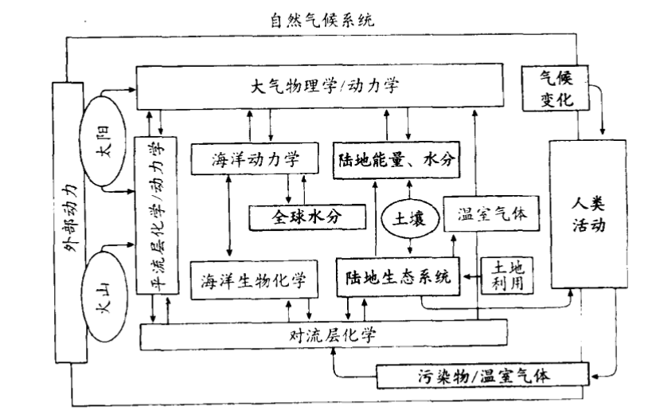
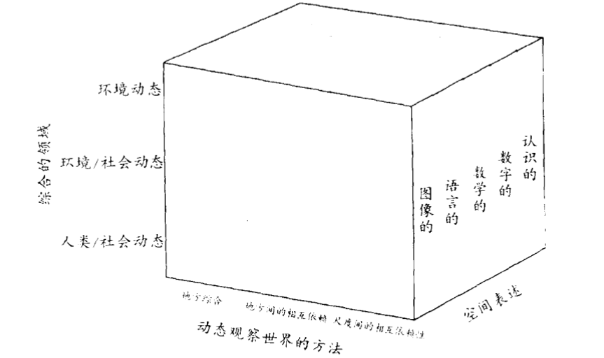
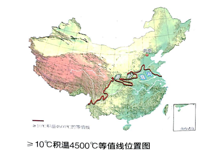
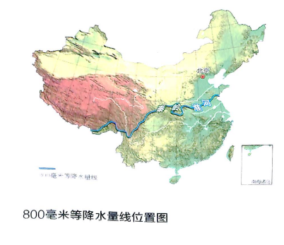
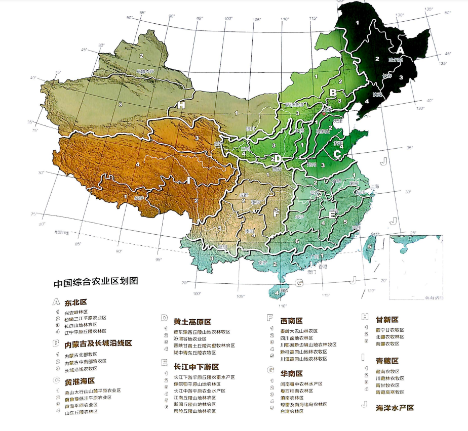
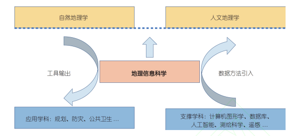

# 人文地理学——第一次作业

[toc]

## 1.阅读

### 1.1.  地理学思想史阅读

#### 1.1.1 述评

- 詹姆斯把地理学发展分为三个主要时期：即古典时期（诞生~1859）、近代时期（19世纪下半叶~20世纪50年代）与现代时期（20世纪60年代以来）
- “要使地理研究为年轻一代所吸引，一个强有力的方法就在于清楚的表明它对于解决重要问题时能做出什么样的贡献。抽象的概念需要结合实际的应用；不掌握这一点，就会使地理哦工作陷入无足轻重的境地”

### 1.1.2 序言、第一章——一门被称为地理的学科

- 人们发现并描述了许多不同的世界，但是人的观察能力和对所观察到的事物的概括能力是有很大的限度的
- 地球表层的所有事物和事件，在复杂的联合与相互的连接中存在着，组成一个巨大的人类-环境系统
- 地理思想史是人们试图获得他们在地球上居住和散步方面更为合理更为有用的知识的记录
- 它是哪里的：经纬度
- 它是什么样的：螺旋上升的地理认知
- 它意味着什么：宇宙的秩序？
- 地理学的研究：数学传统和文学传统，地理大发现与传统的斗争，知识的分立门户，地理学还留下了一些知识方面，特别是社会科学，各种过程的发生从来不是真正相互孤立的，地理学应该研究综合性的问题
- 多种多样的新世界：多种多样的工作方法与范式
- 至少有 5 类问题可以进行研究的：
  1. 与地球空间有关的一般问题，但这些问题如果没有以一种概念结构作指导，来把有关的事物与大量无关的复杂事物区别开来，就不能获得有效的回答
  2. 与事态的先后顺序有关的问题，即从过去情况通过地理变迁知道目前情况的发生学问题，这些是用历史地理的方法研究的
  3. 与探讨经验的概括或一般法则的形成有关的理论问题，甚至还探讨基本理论以及引向逻辑推论的方法
  4. 应用地理概念和技能去研究实际的经济、社会或政治问题的有关一些补救性问题
  5. 与新的研究法实验、新的观察和分析技术或新的制图学有关的方法论问题

### 1.1.3 第十八章——创新与系统

- 数据模式的优越性并不意味着应该轻视用语言来阐述的模式

- 创新的新应该新在哪里，技术的进步带来了更多的资料，地理学者根据这些资料提出来哪些问题？地理研究有了新的方向？地理学是一个创新和传统的复合体
- 传统的回顾：地学传统、人地关系传统、区域研究传统、空间传统
- 系统：新地理学必须和空间系统联系起来，地理学者必须探索许多互不相同却相互依赖的变量
- 普通系统论：普通系统论致力于说明为许多种不同系统所共有的特性
- 空间系统：任何一个系统，凡其中一个或一个以上函数上的重要变量是属于空间方面的，这就是一个空间系统

### 1.2. 地理科学的战略方向阅读

由美国国家科学院研究机构组织的一项研究成果向世人展示了21世纪初期为应对地球面临的重要挑战，地理科学家能做出越来越重要贡献的具有前途的研究方向，集中讨论了与地理学相关的生态环境、发展、空间重组等11个议题

#### 1.2.1 如何理解和应对环境变化

- 我们如何改变地球表面的自然环境

- 我们如何更好地保持生物多样性与保护濒危的生态系统

- 气候和其他环境变化将如何影响人与环境耦合系统的脆弱性

#### 1.2.2 如何促进可持续发展

- 100亿人在地球上如何生存和分布

- 我们如何在未来10年和更长时间内可持续地养活每一个人

- 人口居住地是如何影响人类健康的

#### 1.2.3 如何认识和应对经济社会快速的空间重组

- 人口流动、物资交流及思想传播如何改造世界

- 经济全球化如何影响不平等

- 地缘政治变化如何影响和平与稳定

#### 1.2.4 如何促使技术革新更好地改善社会和环境

- 我们如何更好地观察、分析和可视化这个不断变化的世界

- 公民制图和绘制公民地图的社会影响是什么

### 1.3 当代 地理学要义第一篇阅读

#### 1.3.1 地理学史

- 这一章追溯了地理学的起源及其在不同时间与地点同自然科学、社会科学与人文科学传统相互作用的方式
- 地理学是一个十分古老、格外复杂、饱受争议的科目

#### 1.3.2 地理学与自然科学系统

- 这一章从考察自然科学与地理学的某些相似性和差异性的骄傲都，探究二者的原理和方法之间的关系
- 自然科学赖以立足的所谓科学方法本身其实只不过是一种模式，随着知识与理解力的增进，那些科学方法程序的平衡已经改变，而且还可能变成一种特别的研究成果
- 一旦揭示了某些规律性，就需要通过提出其背后机制的理论对其进行解释
- 为了评估机制相匹敌的理论的优劣，必须有一套理论与实践的程序

#### 1.3.3 地理学与社会科学传统

- 越来越多的把自己视为社会科学家的地理学家向社会科学提出挑战，并接近更多样化的理论和方法领域
- 许多地理毕业生进入规划行业，但是多数人停留在数据收集者和展示者的水平
- 城市区域是内在的空间面貌或规划所必依的社会地理结构
- 地理学家关心科学的严密性，采用定量方法分析空间格局，并开发了空间组织模式

#### 1.3.4 地理学与人文科学传统

- 人文科学包含对人的创造性、知识、信仰、思想和经验的研究
- 基于人本主义的地理学工作的例子包括历史与文化的研究以及对文学、视觉艺术和其他文化形式的研究与实践
- 在人本主义传统下工作的地理学家提出来有关空间的生产、表征的政治政策以及知识形象化与身份的关键性问题

### 1.4  重新发现地理学

- 地理学家致力于从环境变化到社会冲突等许多有价值问题的研究和教学，这些活动的价值来自本学科着重研究地球表面特征和组织的发展；研究具有独特自然与社会特征的具体地去自然与人文现象之间的互动方式；研究那些地方对各种自然与人文现象之间的互动方式；研究那些地方对各种自然与人文事件和过程的影响
- 地理学中的关键问题：经济健康、环境退化、民族矛盾、医疗卫生、全球气候变化、教育

自然气候系统

- 地理学的视角
  1. 通过地方、空间和尺度的透镜观察世界的地理学方法
  2. 地理学的综合领域：环境-社会动态把人类活动与自然环境、环境动态与自然系统、人类社会动态与经济、社会和政治系统联系起来
  3. 应用图像的、语言的、数学的、数字的和认知的

动态观察世界的方法

- 地理学技术：观测、野外观察/勘察、遥感、采样与观测的选择、展示与分析、地图学、地理信息系统、地理可视化、空间统计学

### 1.5 当代地理学

- 哲学原理部分覆盖了大量哲学及理论观点,包括实证主义、人文主义、女性主义、马克思主义、实在论、现代性理论、后结构主义、后殖民主义、结构化理论、行动者–网络理论等
- 作者或通过简单的例子阐述各自的观点,或通过逻辑来论证其观点,这些学科大人物为各自独特的认知方式提供了充分的论证,“强调各种认知方式之间的矛盾和冲突

### 1.6 中国国家地理

- 秦岭不知分南北：秦岭不是岭；淮河找不到自己的家：淮河是一条丢失了下游的河流；那秦岭淮河为何会成为分界线呢？对此最好的解释是秦岭淮河正好处于自然带的边缘地，从南到北的变化累积在此到达了临界状态，因此突变就此产生。把一些自然地理的等值线图画出来，会发现淮河所处的位置非常神奇，许多事关大自然神奇变化的临界点汇聚于此。

- 丝绸之路居然是由德国学者李希普芬提出，我一直以为就是中国自古就有的名词
- 楼兰的发现揭开了西域探险史
- 中国农业区划：东七西二一海洋

- 一个著名地理学家说过：地理学者的主要贡献在于划出有用的自然区域和地区。中国自然区划应有助于广义的农业生产和建设。其实广州既可以是亚热带，也可以是热带，这全是人为的。正如一位地理学家所说：选择什么样的标准来决定区域，这个问题在自然界找不到答案。做什么样的选择，必须由地理学家按照他对其重要性的主观判断而定

## 2. 思考问题

### 2.1 西方地理学思想经历了那些历史性的变化：概念、内容

答：詹姆斯把地理学发展分为三个主要时期：即古典时期（诞生~1859）、近代时期（19世纪下半叶~20世纪50年代）与现代时期（20世纪60年代以来），其中我认为重要的历史性变化有：

1. 古希腊发展了天体位置对人的活动有重要影响：希腊人发展了天文科学，比如收集了大量有关恒星和行星的资料了、创立演绎法的柏拉图、创立归纳法的亚里士多德
2. 十六世纪~十九世纪确立“学术自由”的原则：对抗宗教的势力，各个学者做出了巨大的努力：比如达芬奇和哥白尼
3. 实现科学的崛起
4. 信息革命带给地理学新的动力

### 2.2 地理学的传统是什么

1. 空间传统
2. 地区研究传统
3. 人地传统
4. 地球科学传统

### 2.3 重新发现地理学的价值在哪里

答：地理学是一门内容非常广泛的学科，牵涉到自然科学、社会经济和人文科学的许多方面。 地理学的研究、方法论、地理技术、地理信息系统、地理表述方法等多方面都在被越来越多的研究人员接受和使用，它的价值在于处理广泛的科学问题和社会需求，对于处于交叉学科的学者，地理学的思想和方法更有发挥的空间。 此外，地理学家因其技能与宽广的基础与多学科背景想结合和备受重视。地理学家应该也需要带来从环境方面与从空间方面解决问题的专长。

地理学家致力于从环境变化到社会冲突等许多有价值问题的研究和教学，这些活动的价值来自本学科着重研究地球表面特征和组织的发展；研究具有独特自然与社会特征的具体地去自然与人文现象之间的互动方式；研究那些地方对各种自然与人文现象之间的互动方式；研究那些地方对各种自然与人文事件和过程的影响

地理学中的关键问题：经济健康、环境退化、民族矛盾、医疗卫生、全球气候变化、教育

### 2.4 如何理解正在变化的星球

答：斯坦福大学的生态学家哈尔·穆尼认为我们生活在“地理学家的时代”——地理科学长期关注的不断变化着的地球表面的重要特征和空间结构，以及人类与环境之间的交互关系，正逐渐成为科学和社会的核心内容。近几十年来，随着人类对自然系统影响的程度和节奏的加大，地球表层处于持续的快速变化之中，这为地理科学战略方向的研究提供了一个逻辑起点。该书对地理科学研究的性质及其在当代的重要性进行了评述，同时，选取了十一个具有特别意义的重大科学问题进行了说明。

1.  如何理解和应对环境变化

- 我们如何改变地球表面的自然环境

- 我们如何更好地保持生物多样性与保护濒危的生态系统

- 气候和其他环境变化将如何影响人与环境耦合系统的脆弱性

2. 如何促进可持续发展

- 100亿人在地球上如何生存和分布

- 我们如何在未来10年和更长时间内可持续地养活每一个人

- 人口居住地是如何影响人类健康的

3.  如何认识和应对经济社会快速的空间重组

- 人口流动、物资交流及思想传播如何改造世界

- 经济全球化如何影响不平等

- 地缘政治变化如何影响和平与稳定

4.  如何促使技术革新更好地改善社会和环境

- 我们如何更好地观察、分析和可视化这个不断变化的世界

- 公民制图和绘制公民地图的社会影响是什么

### 2.5 中国地理学家的贡献主要集中在哪些方面

答：中国地理学家的贡献主要表现在科研方向的突破、对国家建设的贡献、研究手段的革新、对科学和教育的贡献、对社会的贡献等方面：

1. 全国地理机构的布局

- 新中国成立以后，地理学领域有许多明确的、国家急需解决的重大科技问题，这些重大任务为地理学的发展、尤其是填补地理研究的空白领域，提供了广阔的空间。中国地理学空白领域的创建和学科体系的完善，大多是在各种国家任务的推动下、在国家强有力的经费支持和组织保障下发展起来的。

2. 开拓新的方向，为地理学体制化奠定基础

- 中国地理学家不但注重地理研究机构的地域布局、推动新兴研究领域，而且从中国的国情出发，促进学科的合理布局。因此除了支持建立研究机构外，还努力推动地理学研究中的一些重要方向，为其后的体制化建设奠定了基础。

3. 自然区划的研究

- 中国是幅员辽阔的国家，产生了无数关于自然区划的研究。比如黑河—腾冲线、秦岭淮河一线、中国主要的的农业区划等等

4. 研究手段的革新

- 中国的遥感事业就一直蒸蒸日上，空间分析方法在各种预报、预测和发展研究领域中得到了广泛应用，成立了特别多的遥感和地理信息系统公司

## 3. 结合自己的专业（GIS），阐述对地理学思想的认识

<h1 align='center'>地理信息科学应作为新时代地理学的出风口</h1>

​	“要使地理研究为年轻一代所吸引，一个强有力的方法就在于清楚的表明它对于解决重要问题时能做出什么样的贡献。抽象的概念需要结合实际的应用；不掌握这一点，就会使地理工作陷入无足轻重的境地” —— 地理学思想史

​	地理信息科学(Geographical Information Science, GIScience)是信息地理学的重要分支之一，在技术和工具层面, 地理信息系统(Geographical Information System, GIS)是地理信息科学研究成果的具体实现, 它在信息技术支持下, 对地理空间数据进行采集、管理、 分析、表达. 地理信息系统遵循数据、信息、知识、 智慧的递进层次体系, 构建了地理空间模拟、预测、 优化等一系列方法。这些方法有助于研究揭示地理现 象和要素的分布形态、相互作用、动态演化和驱动机 理, 从而服务于空间决策支持。但是在地理学严重空心化的大环境下，地理学处于一个很尴尬的地位，地理信息科学在新时代的地理学中处于什么样的地位？地理信息科学到底是地理学的核心还是外缘？信息时代的地理学又该何去何从？

<h2>尴尬的GIS</h2>

​	从Goodchild（1992）提出了地理信息科学的概念，到现在已经有人称地理信息技术（GIS）是20世纪最伟大的地理技术发明。在地理学的历史上，没有任何其他技术发明能够像GIS这样产生如此深远的社会影响。GIS（及其他信息技术）对地理学的影响非常大。随着时间的推移，GIS技术还将以新的创新方式和发展模式继续发展，带来新的应用模式。这将使得GIS走进千家万户，在社会产生巨大影响。GIS是地理学与信息技术（IT）的交叉学科。它既是地理学不可分割的一部分，也是IT技术的重要分支。GIS的两大基础是地理学和信息技术。地理学为GIS提供地理信息的挖掘应用，从表面上看地理学对GIS的发展作用很小，GIS推动地理学发展。信息技术促进GIS的发展，信息技术的每一个进步都影响着GIS技术的变革。然而事实真是如此吗？

​	刚学GIS的时候，看到有人说GIS是个朝阳产业，但是它永远都到不了正午。这自然是一句调侃，但也无不包含着GISer的心酸，因为GIS的定义，很多在学校和行业里学习摸爬了很多年的人也未必说得上来，进而它的作用自然也就变得模糊了起来。GIS在发达国家亦不算是一门成熟的学科，更不用提在国内，很多学校甚至将测绘、地质等很多内容也放在GIS专业的课程设置之中，过于宽泛的学习反而丢失了对深度探索的可能。

​	GIS 的应用可以说已经融入到了各行各业，我们也在和各种部门，比如国土局、水利局、林业局、环保局等等各种部门在合作。然而尴尬的是看一看这些各种单位历年事业单位招聘却发现，国土局更愿意招学土地的，水利局更愿意招学水利的，林业局更愿意招学林业的，环保局更愿意招学环保的。唯一点名要gis的事业单位是国家测绘与地理信息局。而一般的社会公司需求最多的是 GIS 开发人员，引用百度百科的一句话，目前GIS软件开发工程师是稀缺人才。目前国内GIS大公司比如百度、腾讯、高德，国际大公司比如谷歌和ESRI。但是这些公司的所谓GIS也是仅仅停留在地图与导航阶段，外加一些“附近”服务。也许“ESRI的地理信息系统”为美国政府决策起了一些作用，但是在中国尚未听说过。近两年数字城市、智慧城市、物联网非常火，其中少不了GIS的身影。

<h2>正确的理解地理学和地理信息</h2>

​	其实大多数人对地理这门学科的认知是有局限的，认为地理只是研究山川湖泊地形地貌，甚至分不清地质学和地理学的区别，认为地理学家整日需要风吹日晒地研究石头的成分。当然更多的人是一听说你学地理，就找个偏门的国家问问你首都是哪个城市。这种认知局限也限制了地理学潜在的可能性。其实，地图、区划等是地理学的基础，所有的信息都依靠这些基础建立联系，这种联系得以建立的原则就是——每一个事物都影响其他的事物，但是对距离近的事物影响更大。位置影响自然环境和人文环境，进而影响人类的活动。所以地理这门学科本身，虽然听上去是一个学科，但其内容却涉及社会学（城市化、人口、住房、种族）、政治（国际关系）、环境科学（水资源利用与保护、野生动物保护）甚至是医疗和法律。地理学以位置为基础，将与我们生活息息相关的所有部分串联起来，找到其中的关联，再用这种关联去解决问题。因此，地理信息并不只是某座山的海拔或是某条河的冰期，而是所有带有位置标签的信息。

​	拿美国管理得比较出色的普查数据（Census Data）作为例子，普查会将美国划分为小的普查区（Census Tracks）或者街区群（Block Groups），这里的普查区和街区群就是地理标签，对于每个地理标签，数据库中会详细记录该标签下的实际信息，比如收入的中位数等。

​	所以，做一个合格的GISer的基础，不是扎实的编程功底，也不是丰富的统计知识，而是对于地理信息的深刻理解和对空间的思考能力。习惯性地将信息和数据中所包含的地理标签带进思考过程之中，并利用地理上的关联来解决问题，是一个GISer与软件工程师、统计师、历史学家或是社会学家最大的区别。GIS的重点不在开发，也不是统计，更不是简单的制图和可视化，这些只是达成GIS的工具，而是空间思维、空间数据和空间分析才是GIS真正的核心。个人觉得GIS最大的价值在于将地理学的价值运用于商业、生产与流通、日常生活、政策实践等行业中，让社会与个人更好地认知地理信息所带来的决策与理解价值，由此进一步激发传统地理学发展动力。

<h2>地理学的“经世致用”</h2>

​	目前, 地理信息科学已经和自然地理学、人文地理学一起, 成为地理学三大二级学科之一。在学科体系中, 地理信息科学具有独特的、不可或缺的地位, 主要体现在以下三个方面：1. 它为部门地理学研究提供数据整合和分析的方法和工具, 从而强调地理学作为观测性学科的性质；2. 为了达成上述目标, 需要研究地理学基础概念和规律的形式化, 通过体现“空间思维(spatial thinking)”, 强化地理学作为一个统一学科的理论基础; 3. 借助于信息系统的开发, 将地理学研究成果输出到其他领域, 产生知识溢出, 体现了地理学“经世致用”的特点。

图1. 地理信息科学在地理学中的学科地位

​	回顾地理学四大传统, 即空间分析传统、区域研究传统、人地关系传统和地球科学传统，地理信息科学研究更多传承了空间分析传统, 即关注地理现象的空间配置和相互作用的分布模式, 模式背后的一般性规律, 以及规律的空间可泛化性。地理信息科学是多学科交叉的产物, 它扮演了地理学与其他学科之间联系桥梁的角色。这种角色主要体现在数据和方法两个层面上。在数据上, 地理信息科学研究不同地理空间数据的生产、传输、表达机理, 构建数据质量和不确定性评估模型, 解决地理学研究中数据使用的问题. 因此, 它和测绘科学等学科存在着密切的联系, 后者通过研究地理空间数据的精确获取技术, 解决地理信息科学 的数据源问题。其中遥感、全球卫星导航系统等技术 的迅猛发展, 极大丰富了地理信息科学分析和研究的数据类型(如全球土地覆被数据、城市和建筑三维数据、个体粒度的轨迹数据等)。目前, 地理研究已经进入到大数据时代. 大数据不仅包含了人类大量地理知 识的长期累积, 同时也是新的技术手段支持下大范围地理现象和要素的存储和表达。. 在方法上, 地理信息科学也得益于信息科学与技术的快速发展. 后者已经改变了, 并且必将更为深刻地改变几乎所有学科的面貌。例如, 人工智能已经可以帮助科学家自动发现科学规律, 提取科学知识。纵观历史, 从单机到互联网, 再到移动互联网, 地理信息应用的形态在不断演化。如今, 信息科学与技术的发展等为地理信 息系统带来了新的机遇, 同时为地理信息科学提供了新的研究议题. 高性能计算提供了强大的分析模拟能力, 人工智能则提升了对复杂时空模式的理解能力。

<h2>结论</h2>

​	正如地理学思想史在80年代所说，要使地理研究为年轻一代所吸引，一个强有力的方法就在于清楚的表明它对于解决重要问题时能做出什么样的贡献。抽象的概念需要结合实际的应用；不掌握这一点，就会使地理工作陷入无足轻重的境地！然而这句话放到现在依然不过时，地理学从曾经到显学到现在“尴尬”的地位，GIS也一直是一个升不起的朝阳，这些事实不经让人唏嘘。但是面向未来，面向这个信息时代，地理信息科学作为地理学和信息技术结合最为紧密的方向，应该肩负起地理学复兴的重任，一方面要注重信息技术在向地理学迁移过程中的“本地化”, 另一方面, 也要促进地理信息科学成果向其他学科的溢出, 提升其普适性和影响力，真正的从经世致用的角度为社会，为国家服务。