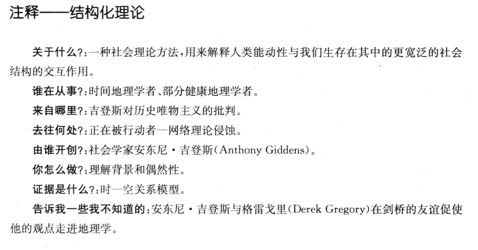
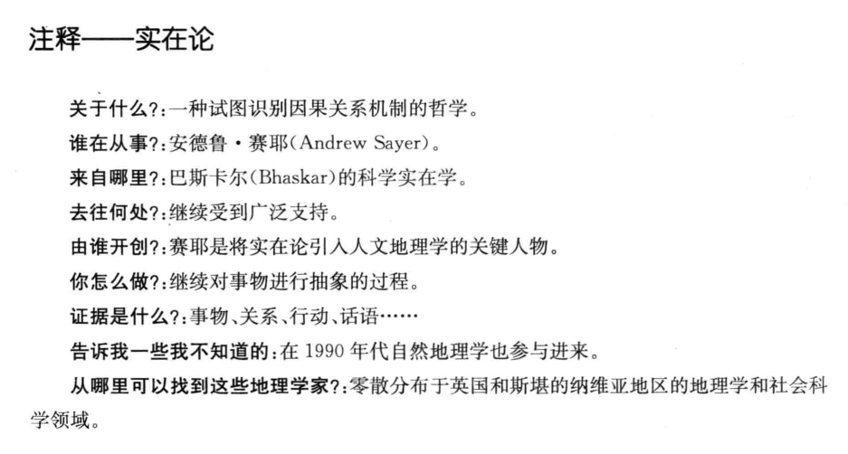
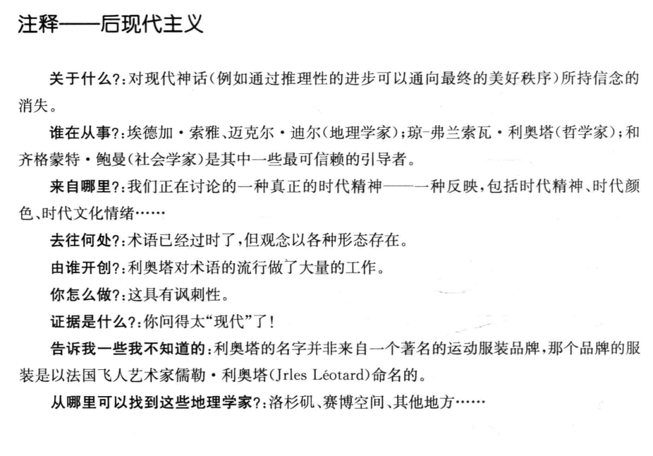
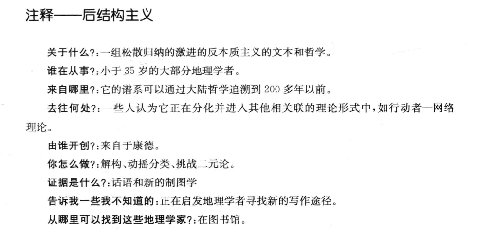
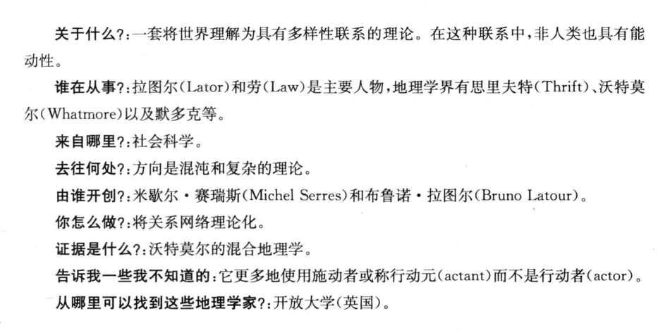
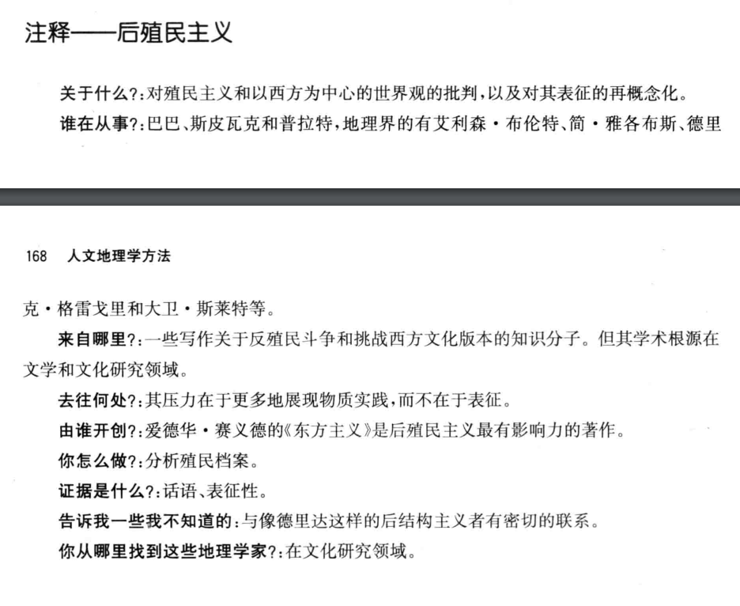

# 人文地理学第二次作业_读书报告

[toc]

## 1. 100 Years of Human Geography in the Annals

### 1.1 Abstract

- 人文地理学文章经历的阶段：环保方针、文化地理、“空间”科学，所有三种方法都采用区域的角度
- 20世纪70年代主要采用人道主义和马克思主义，区域和定量方法比较强劲
- 20世纪80年代，后结构主义出现
- 在过去二十年里，女权主义和反种族主义开始成为主体，以及经济和政治理论的加强

### 1.2 Content

- 1999年，人们选择了“人、地方、地域”三个概念来概括事物
- 从环境保护到区域，到空间系统，到人与人之间的相互作用，这是一个迂回前进的过程
- 二十世纪地理学的标志是“从世纪活动到强调认知需求，例如除了理解‘什么’ 和 ‘哪里’ 之外，还要研究‘为什么’和‘怎么样’。”
- 地理学家对经济、政治、社会和文化的过程的理解越来越复杂，这有助于解释世界上许多不同地区的人与地方之间的关系

## 2. 地理学的例外论

- 方法应该是在变化和进化中茁壮成长，但是地理学的方法有点墨守成规
- 包括人类在内的自然现象在空间的分布方式是地理学的主要关注点（区域地理学、系统地理学？），一个地区包含了一种特殊的但在某些方面却是统一的各类现象的组合，这些都是研究两类或两类以上选定现象之间的空间关系，但是目前对区域地理学和系统地理学的相对作用和重要性缺乏明确性，最主要的区别可能是系统地理学视图制定应用于区域地理学的区域和规律
- 历史和地理本质上都是对一个地方的记录，历史是记录时间上的现象，地理是记录空间上的现象，它们都是描述性的
- 从技术上讲，地理学的形态特征表现在其特有的工具——地图和制图的相关性上。
  1. 地图不是简单的一个描述
  2. 借助艺术符号制作的图画有意表现我们感兴趣的点，忽略不重要的差异
  3. 地图不仅描绘了空间上的各种特征，表达了它们之间的联系
- 制图相关性涉及比较地理学和类型学
- 地理规律可以分为三类
  1. 大多数的自然地理定律
  2. 经济地理定律
  3. 综合性系统性的定律
- 地理学应该更加强调系统性

## 3. 作为空间科学的地理学

- 空间科学包括天文学和地理学，我们现在可以加上地球物理学，这三组之间没有明显或绝对的界线，因为在许多的情况下，研究是重叠的，但在每个案例中，观点基本上是不同的
- 地理系统是所有有机体的总和，我们用自然系统的名称来命名它们
- 地理学的两位创始人都背弃了这位哲学家的地理著作，他们的思维都受经验主义知识观的支配，不信任自然哲学的演绎思维
- 新一代的地理学家从他们所受训练的领域中带来了这些概念，产生了地理二元论的双重形式。自然地理是一门构建和应用科学规律的自然科学，人文地理远离了物理基础
- 当地理学家用其他科学转移来的科学观念来考虑他们的主题时，都会忽略这个概念，只有当地理学家根据其自身的内在特征来考虑他们的课题时，它才会得到积极的回应
- 地理学的内在特征是人类努力认识和理解现象的产物，因为它们存在于人类师姐的区域相互关系中
- 地理没有一个特定类别的对象或现象作为它的具体研究对象，而是研究许多不同种类的事物作为区域的整体；地理学既不能呗归类为自然科学，也不能被简单的归类为社会科学

## 4. 人文地理学期刊分析

- 人文地理学是依托地理学基础发展起来与经济、社会发展有紧密联系的学科，是研究人类活动空间组织以及人类与环境关系的科学，主要研究各种认为现象的地理分布、扩散和变化，以及人类社会活动的地域结构的形成和发展规律
- 该 44 种人文地理学期刊的可以分为四个较为明显的聚类：
  1. 综合性期刊、文化地理学期刊和政治地理学期刊
  2. 经济地理学期刊和工业地理学期刊
  3. 环境地理学期刊
  4. 地理信息系统期刊

## 5. 人文地理学方法（第一部分）

### 第七章 结构化理论：能动性、结构与日常生活

- 走的人多了，也便成了路

- 结构化是为分析个人能动性与社会的构成提供了感性概念
- 吉登斯所发展的结构化理论,本质上认为社会既非脱离人类活动而独立存在,也不只是人类活动的产物。相反﹐结构化理论指出了社会生活内在的空间性。对于吉登斯来说,对秩序这一当时社会学核心问题的研究,并不是要发现社会生活的基本模式,而是关注社会系统如何在时间与空间中联系在一起，他认为宏观与微观、个人与社会、行动与结构、主观与客观双方都是相互包含的的
- 吉登斯将“结构”理解为不断卷入到社会关系的再生产过程之中的规则和资源，并且结构具有二重性，即社会结构不仅对人的行动具有制约作用，而且也是行动得以进行的前提和中介，它使行动成为可能。行动者的行动既维持着结构，也改变着结构。行动与结构之间中这种相互依赖、互为辩证的关系反映在处于时空之中的社会实践中
- 马克思曾说过：“人们自己创造自己的历史，但是他们并不是随心所欲的创造，并不是他们自己选定的条件下创造，而是再直接碰到的、既定的、从过去继承下来的条件创造”。吉登斯的结构化理论正是对马克思这句名言的深刻反思，并且做出了思考和发挥。但是吉登斯夸大了实践主体的能动性，否认了物质生产实践在社会构成中的重要地位和作用，因此吉登斯的实践观存在根本的缺陷
- 人是能动性，路是结构，人和路构成了社会实践，路的可能存在是人行动的前提，人也因此可以走出更为捷径的路

### 第八章 实在论作为认识世界的基础

- 文章本天成，妙手偶得之
- 实在论要求用一种“实在的”眼光来看待这个世界。实在论哲学最基本的理念是,世界无论是什么样子,很大程度上都不依赖特定的观察者对它的看法,它不是简单地来自于人类的思维。人们过去习惯于认为地球是的,但是当他们开始意识到它是圆的时候,我们不会认为地球在这一过程中也发生着变化。地球的形状不受我们对它的看法的影响。同时,我们关于世界的思想往往以很多种不同的看题的方式被建构起来——感知图式,概念和理论。我们不能超越这些来直接且如实地看待个世界,因为我们需要诸如图式一类的东西来观察、来思考。所以,这个世界的存在很大程度上不依赖于我们对于这个世界的知识的掌握程度,但是我们对于世界的描述显然也依靠了们可用的知识。我们往往通过可用的话语来解释世界,但是,就像各种关于地球形状的论述-样，这些话语在理解地球形状的程度上存在很大差异。
- 长城啊，真他妈的长；不到长城非好汉

### 第九章  后现代地理学和现代性的毁灭

- 无厘头（九品芝麻官，把歪的水管骂直了）
- 后现代主义（Postmodernism）是一场发生于欧美60年代，并于70与80年代流行于西方的艺术、社会文化与哲学思潮。其要旨在于放弃现代性的基本前提及其规范内容。在后现代主义艺术中，这种放弃表现在拒绝现代主义艺术作为一个分化了文化领域的自主价值，并且拒绝现代主义的形式限定原则与党派原则。其本质是一种知性上的反理性主义、道德上的犬儒主义和感性上的快乐主义。 后现代主义是一个处于不断变动的难以把握的概念，渗透到当代社会的方方面面。后现代主义对人文地理学发展产生了深刻的影响，对科学技术与理性的反动导致非理性主义的泛滥
- 崇尚天马行空的想象力，但是科学应该是真实的

### 第十章 后结构主义者的理论

- 盲人摸象

  摸到大象腿的盲人说：“大象就像一根大柱子！”

  摸到大象鼻子的忙说：“不对， 不对，大象又粗又长，就像一条巨大的蟒蛇。”

  摸到大象耳朵的人急急地打断，忙着说：“ 你们说的都不对，大象又光又滑，就像一把扇子。”

  摸到大象身体的人也说：“大象明明又厚又大， 就像一堵墙嘛。”

  最后，抓到象尾巴的人慢条斯理地说：“你们都错了！依我看，大象又细又长，活像一根绳子。”

- 后结构主义是 20 世纪一系列关于语言和表征的思潮，并且极大地影响了人文学科，尤其在文学批评领域，后结构领域的核心就是 “意义链”

- 后结构主义是对于简明主义的怀疑，为何要对证实、表达和真理设定特定的假设条件，其本质是什么。在阅读抽象的哲学文本时，当我们强行的插入了我们称之为具体的实例时，我们会感到一种解脱，这时候我们以为我们终于明白了，但是实际上，我们却是离理解更远了，就好比盲人摸象

- 人类对历史上的“象”又真正了解多少呢，化石的新发现会不会又促发一种新的理解

### 第十一章 行动者——网络理论、网络和关系方法在人文地理学中的应用

- 一个人拿一把枪杀了人，那么是“枪杀人”，还是“人杀人”呢？
- 行动者——网络理论起源于研究科学和技术的社会学，它旨在揭示和最终诸多人类、非人类、具体、抽象行动者之间的联系和关系，而正是这些行动者使得特定的行为、事件和过程能够顺利进行。
- 行动者——网络理论把行动者和能动性区分开来，行动者描述为行动元，它利用关系网络中行动元的无数联系来解释世界
-  地理学家将行动者——网络理论引入他们的研究中，使它成为今天的相关性思想中最为复杂的理论之一，它突破地理学中的二元思维具有重要意义。地理学者对行动者——网络理论主要围绕社会解释与网络解释、传统批判的合法性、人与非人对称的真实性与有效性等方面展开
- 当一个人手上有一把枪，并用它来杀人时，人变成“凶手”，枪变成了“凶器”，受害者从人变成“尸体”，这便是角色的转译（translation），有被动也有主动。“杀人”行为，既不只是枪手意图的结果，也不只是枪开火的结果，而是两者联结成的行动网络的作用结果，人和枪都是行动者。

### 第十二章 后殖民主义：空间、文本性和权力

- 美国的空气更加新鲜
- 后殖民主义是1970至1980年代产生的一种思潮和学术理论，主要目的是反思殖民主义，特别强调文化、知识领域内对殖民主义、新殖民主义、西方中心主义等现象的反思与批判。后殖民主义者认为，因为殖民主义等历史原因，现代文化被西方文化所垄断。非西方文化想要被世界接纳、现代化，就必须采用西方的语言、文化、思想，因此依然深受殖民主义的压迫。后殖民主义强调殖民不仅仅包含经济剥削和政治服从，还包含对被殖民人口施以文化的力量，这种力量被殖民势力用来贬低非西方文化传统，同时赞颂西方文化观点独特的优越性。
- 那么怎么精确地描述不熟悉的文化和社会？特别要强调的是,后殖民主义不能被简单地理解为是对现代人文文化普遍愿景的简单的全盘否定。就大部分而言,如赛义德和斯皮瓦克等学者批判了西方传统没有能够用恰当,和谐的交流方式去发展真正的多元普遍主义(pluralist universalism),这些交流的方式中会包括一种理念,即去借鉴理解世界的其他方式,包容其他的认知手段。
- 认为说了对方就能明白，这是一种傲慢。从纬度的角度上来说，美国的月亮的确更大更圆

