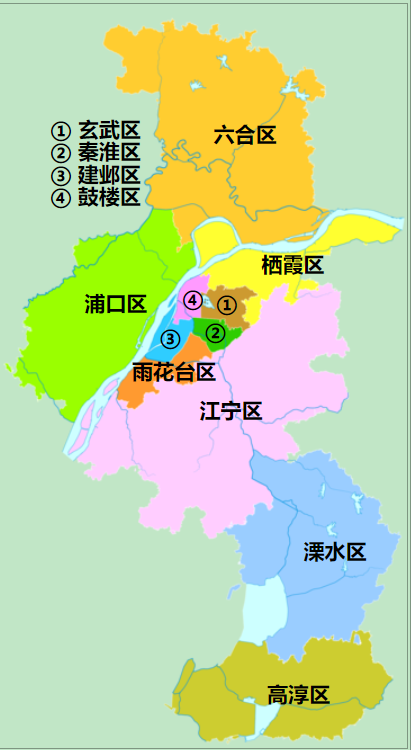
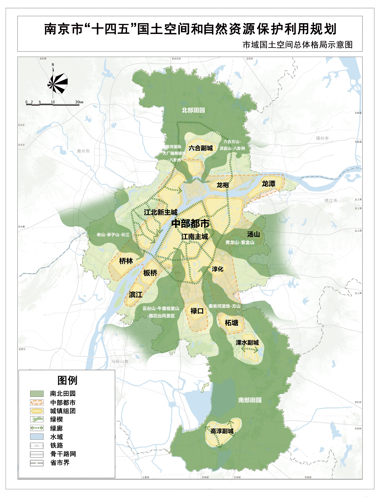
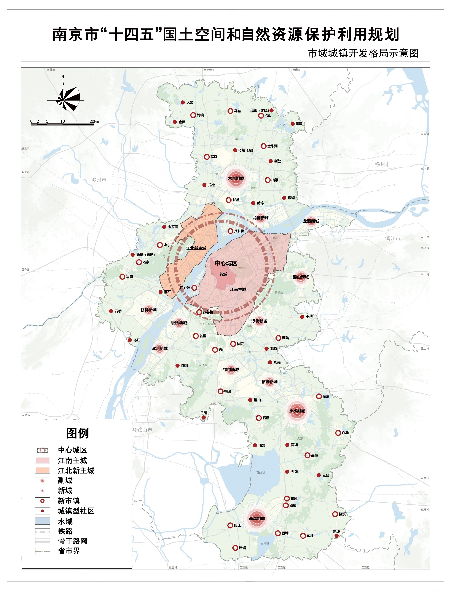
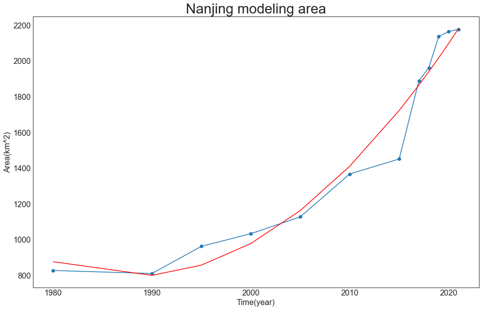

# 南京市城乡关系演变过程及形成机制研究

## 摘要

## 第1章 研究背景与研究意义

### 1.1 研究背景

城乡关系是经济社会发展中的重要关系，在中国这样一个传统农业文明大国建设社会主义现代化国家，如何处理城乡关系是国家发展进程中的重大战略问题（王大伟等，2021）。本文在查阅大量文献（王大伟等，2021；张海鹏，2019；高帆，2020；温铁军，2020）的基础上将建国后中国城乡关系演变总结为下图三个个阶段：城乡分治阶段（城乡二元体制的形成与巩固，计划与稳定是该阶段主旋律）；快速城镇化阶段（城乡二元体制的调整，并逐渐转向城乡一体化发展，经济快速发展是该阶段主旋律）；城乡融合阶段（不在一味强调经济发展，强调全面小康、生态文明、乡村振兴等主题，共同富裕是该阶段主旋律）。

图 1.1  中国城乡关系演变

#### 1.1.1 城乡分治阶段

建国初始，毛主席于1956年提出“城乡必须兼顾，必须使城市工作和乡村工作，使工业和农业，紧密联系起来”，但是随着国际环境形势变得愈加严峻，建立独立完整的工业体系、确保国家安全成为关系国家和民族命运的必然选择，因此中国采取了重工业优先发展战略。从1958年起，严格的人口流动限制、农产品统购统销和人民公社等制度体系逐步建立完善，中国在经济、政治和社会管理等方面形成了城乡分治局面。城乡分割主要体现在两方面（王大伟等，2021）：

经济方面。形成了农业支持工业、农村支持城市的局面。一是价格管制使农业剩余转移到城市。工农产品的价格管制和农村粮食的统购统销，使工农产品形成了价格剪刀差，价格剪刀差使农业在改革前向工业贡献了6000亿—8000亿元人民币。二是非农部门和农业部门劳动生产率差距持续保持在较高位置。20世纪70年代，非农部门劳动生产率是农业部门的7倍以上。三是城乡居民收入和消费都被压到较低的水平。

社会管理方面。一是限制城乡间人口流动。1958年实施《中华人民共和国户口登记条例》，正式建立起城乡二元的户籍管理制度，农村向城镇的人口迁移被严格控制，城镇化水平低位徘徊，1949—1978年，城镇化率仅增长7个百分点。二是建立城乡有别的福利制度。在城市，政府为城镇居民提供全面的福利保障；在农村，农民只能从集体得到少量现金和实物救助。三是基层组织上，在农村逐步建立了人民公社制度，实行“政社合一”的组织管理制度。

#### 1.1.2 快速城镇化阶段

1978年，中共十一届三中全会拉开了改革开放的大幕，中国的城镇化与改革开放相辅相成，同时经济全球化称为中国城镇化的重要动力。1980年，中国所有的农村都开始强制实行以家庭联产承包责任制为主要形式的的体制转变，农民的生产力得到了解放，农村开始富裕起来；同时期，在看到农村改革的带来的巨大动力，1985年开始着手对城市经济改革，政府认可了私营企业对中国经济的贡献和所处地位，并鼓励非公有制经济成分进一步发展以带动中国经济，引入市场经济中的许多观念，发展为社会主义市场经济。这一时期，从农村经营制度改革开始，之后逐步放开价格管制，放松人口流动限制，废除人民公社，农村生产力得到迅速释放。此后三十余年，中国经历了人类历史上最为波澜壮阔的快速城镇化进程，城镇化的快速推进吸纳了大量农村劳动力转移就业，提高了城乡生产要素配置的效率，促进了国民经济持续快速发展，推动了社会结构和经济制度的深刻转型，可以说，城镇化是中国崛起的一个缩影（肖金成，2018）。

经济方面。刚开始家庭联产承包责任制解放了农村生产力，较快的提高了农民的收入，同时大量劳动力得以从农业中解放出来，向非农产业转移，1985年前后也是城乡收入差距最小的时候，同时期的国有企业改革并不太顺利，造成了大量下岗工人。但是随着对外开放的进程，经济全球化成为中国城镇化的重要动力，城市工业发展对劳动力需求的迅速增长，农村剩余劳动力流入城市，为城市发展创造了巨大人口红利，农用地转为非农用地使城市获得农用地转用的土地增值红利，这都进一步拉大了城乡差距。

社会管理方面。城镇化进程反过来也倒逼改革，户籍制度和土地制度改革是40年来中国城镇化“一明一暗”两条逻辑主线：户籍制度改革是中国城镇化的“明线”，中国的城镇化几乎持续推动着中国户籍制度的松动，是一个不断“破”的过程；城镇化的背后是土地制度改革这条“暗线”，是一个持续“立”的过程（肖金成，2018）。同时农民福利水平逐步提升，从以前的流入城镇的农业转移人口无法享有城镇居民享有的就业、医疗、社会保障等的基本公共服务到取消农业税、建立农村最低生活保障制度和新型农村社会养老保险试点，城乡基本公共服务均等化迈出重要一步。

#### 1.1.3 城乡融合阶段

党的十八大以来，不再一味的强调快速城镇化，而是开始强调城乡融合，加快建立健全城乡融合发展体制机制和政策体系。我个人以为城乡融合的本质是共同富裕，全面小康、生态文明、乡村振兴等政策的提出与实施意味着国家资源开始大力向小城镇和农村倾斜，是先富（城市）带动后富（城镇、农村）的体现，政策的背景和60年代城乡分治阶段有异曲同工之妙，但目的不一，城乡分治的目的是发展重工业，保护国家军事与政治安全，而城乡融合的目的是促进国内乡村-城市社会经济要素内循环，保障国家经济与社会稳定。具体是因为在经济政治逆全球化，房价泡沫居高不下，疫情时代等大背景下，中国面临着百年未有之大变局，我们需要从对外开放转向“对内开发”，从以前对外开放接纳金融资本与技术转向对内开发建设农村与小城镇，促进共同富裕与构建内循环，保证在任何的挑战之下社会与经济也不会宕机。2008年前后的家电下乡以内需替代外销拯救了家电产业的生产力过剩，也确实给农民带来了好处，现在的城乡融合也是以对内开发替代对外开放以面对即将到来的“烟花”，鸡蛋至少没放在一个篮子里了。

经济方面。全面建成小康社会，保障乡村基本设施，村村通水、通电、通网，基本解决医疗、教育问题。目前城市的收入呈明显的两极化分布，而乡村收入水平是不断攀升的，随着电商物流、商业养殖、互联网的发展，乡村正日益纳入整个大市场，城乡人口和要素流动更加顺畅，城乡居民收入比大幅下降，由2012年的2.88下降到2019年的2.64，中国在历史上首次整体消除了绝对贫困。

社会管理方面。城镇化倒逼户籍制度改革。从“当地有效城镇户口制度”，即“蓝印户口”，到居住证制度，最后到提出建立城乡统一的户口登记制度，取消农业户口与非农业户口性质区分，统一登记为居民户口。从刚开始的城乡二元的户籍管理制度到放开“农转非”，再到大多数农业户口的人都已经不愿意“农转非”了，最后到居民户口，这一条漫长而曲则的路也是各种社会公共资源（养老保险、医保、公共服务等）配置机制的缓慢变革。同时土地制度日益宽松，城乡统一的建设用地市场逐步建立。农村承包土地、宅基地、集体经营性建设用地改革均取得重大进展，促进了城乡统一的建设用地市场建设。农村承包地所有权、承包权、经营权“三权分置”制度建立，稳定了家庭联产承包责任制，放开了农村土地经营权，促进了土地流转。农村宅基地所有权、资格权、使用权“三权分置”的改革探索不断深入，在保障农民合法居住权的基础上，赋予了农民更多财产权（王大伟等，2021）。

### 1.2 研究意义

研究城乡关系就是研究我们的历史与现在，更是研究我们的未来。每一代人有每一代人的挑战，更有每一代人的义务与责任，而城乡关系就是我们这一代人目前最核心的挑战，是人民日益增长的美好生活需要和不平衡不充分的发展之间的矛盾中最核心最尖锐的矛盾，妥善处理城乡关系，才能持续推动经济社会高质量发展，才能有底气的去面临这百年未有之大变局。

基于此研究背景与研究意义，本文选取南京市作为研究区，探讨南京市城乡关系的演变过程，并研究其背后的形成机制。

## 第2章 南京市城市概况

南京市位于江苏省西南部、长江下游，现辖11个市辖区，共有87个街道、13个镇，2022年常住人口942.34万人，市域面积6587.02平方千米。

图 2.1  南京市行政区划图

#### 2.1 市域国土空间总体格局

规划形成逐步形成“南北田园、中部都市、拥江发展、城乡融合”的国土空间总体格局（南京市人民政府，2021）：

1．南北田园。落实主体功能区规划要求，南片东屏湖—无想山以南，除高淳副城以外的区域，北片六合绕越高速以北的区域作为城市集中连片的生态空间，加强山水空间和耕地保护，适度复合生态农业和休闲游憩功能，建设南京魅力田园乡村地区。

2．中部都市。以新街口为中心，半径40千米范围的都市区域，人口高度密集，经济产业功能发达，蓝绿空间与城市有机契合，具有高品质人居环境的高度城市化地区。

3．拥江发展。落实长江大保护要求，以长江为轴，以交通为纽带，沿江布局多级城镇组团和城市中心，形成一江两岸、联动发展的格局。

4．城乡融合。以快速轨道、快速道路为引领，以绿色开敞空间相间隔，串珠状布局城镇组团，形成功能互补、服务一体、高度融合的城乡空间网络。

图 2.2  南京市域生态安全空间结构示意图

#### 2.2 城镇开发格局

围绕增强城市核心功能，以功能提升为出发点，以结构性优化调整为核心，提高土地集约利用水平和空间紧凑程度，规划形成“1个中心城区、3个副城、9个新城、29个新市镇和若干个新社区”的市域城镇体系，实施“都心升级、副城集聚、新城支撑”的城镇发展策略，优化人口、土地等资源要素布局，科学配置交通和公共服务设施，促进市域城镇开发格局整体优化（南京市人民政府，2021）：

1．突出都心升级，拥江发展，建设高能级中心城区。构建“一主一新”中心城区新格局，“一主”是江南主城，“一新”是江北新主城。江南主城重点提升综合服务功能和空间品质，打造世界文化名城核心区、知识创新策源地和品质宜居城区。江北新主城依托自贸区建设“两城一中心”战略新兴产业高地，打造为江北国家新区的核心区、南京辐射带动苏皖区域的重要功能承载区。

2．推动副城集聚，建设融入长三角、辐射都市圈的综合节点城市。溧水、六合、高淳三个副城注重培育新功能，建设产城融合的节点城市，成为南京高质量发展的增长极。践行新理念，建设功能完备的未来城市，配置高等级公共服务设施。营造新风貌，一城一特色，彰显山水田园城市品质，增强副城吸引力。

3．强化新城支撑作用，建设专业分工职住平衡的郊区新城。坚持专业分工、职住平衡、质量提高，建设禄口、柘塘、龙潭、龙袍、桥林、滨江、板桥、汤山、淳化新城。引导全市重大功能性项目、重大基础设施优先向新城布局，发挥新城集聚人口、带动新型城镇化的重要作用。

4．完善新市镇服务功能，促进差异化发展。中心城区周边的新市镇依托邻近城区的区位优势，积极承接中心城区的功能转移，大力发展科技创新、文化休闲产业和配套居住功能，规划较高等级的文化、教育、医疗等设施。江北新主城和副城、新城周边的新市镇发挥各自优势，强化综合服务和特色产业功能，完善公共服务与交通设施配置。远郊镇控制镇区发展规模，完善生活居住和公共服务设施配套，满足周边农村居民的基本公共服务和就业需求。旅游资源丰富的镇街适度增加旅游服务配套功能。

5．城镇型社区以完善公共服务功能为重点。充分考虑已拆并街镇链接城镇与乡村的重要作用，规划建设25个城镇型社区。

 图 2.2  南京市城乡空间布局规划图

## 第3章 南京市城乡关系演变过程

### 3.1 建设用地演变过程

建设用地使用了两个数据集：国家青藏高原科学数据中心的中国土地利用数据（1980-2015）和以Sentinel-2卫星的遥感图作为数据源，并结合人工智能土地分类模型制作而成中国土地利用分类数据（2017-2021）。第一份数据集包括1980年，1990年、1995年、2000年、2005年、2010年，2015年七期，数据生产制作是以各期Landsat TM/ETM遥感影像为主要数据源，通过人工目视解译生成，其中空间分辨率1公里。第二份数据集时间范围是**2017年-2021年**，空间分辨率是10米。通过南京市行政区进行裁剪，栅格属性提取建筑面积得到下面的结果：

国家青藏高原科学数据中心的中国土地利用数据集有三类建筑用地数据：第一类是城镇用地，指大、中、小城市及县镇以上建成区用地；第二类是农村居民点，指独立于城镇以外的农村居民点；第三类是其它建设用地，指指厂矿、大型工业区、油田、盐场、采石场等用地以及交通道路、机场及特殊用地。根据Sentinel-2卫星生产的数据只有建成面积这一种类型的数据。所有建设面积统计表如下：

折线图

1. 1980 年南京市只有一个竖直椭圆形的主城区，并且就其建设面积并不大，除了主城区，其它区域建筑面积并没有显著的聚集情况，这种情况一直持续到了1990年，该阶段并不高

## 第4章 南京市城乡关系形成机制研究

## 参考文献

[1]王大伟,孔翠芳,徐勤贤.中国百年城乡关系：从农村包围城市到城乡融合发展——正确处理城乡关系是中国共产党的重要制胜法宝[J].区域经济评论,2021(03):5-12.DOI:10.14017/j.cnki.2095-5766.2021.0041.
[2]张海鹏.中国城乡关系演变70年:从分割到融合[J].中国农村经济,2019(03):2-18.
[3]高帆.疫后中国城乡关系演变的新命题与新趋向[J].探索与争鸣,2020(10):111-121+159.
[4]温铁军,张俊娜.疫情下的全球化危机及中国应对[J].探索与争鸣,2020(04):86-99+288.
[5]肖金成,刘保奎.改革开放40年中国城镇化回顾与展望[J].宏观经济研究,2018(12):18-29+132.DOI:10.16304/j.cnki.11-3952/f.2018.12.003.
[6] 南京市人民政府,《南京市“十四五”国土空间和自然资源保护利用规划》.2021(11):012947031/2021-123234
[7] 中国科学院资源环境科学数据中心(http://www.resdc.cn/). (2019). **中国土地利用数据（1980-2015）**. 国家青藏高原科学数据中心,
[8] Karra, Kontgis, et al. “Global land use/land cover with Sentinel-2 and deep learning.” IGARSS 2021-2021 IEEE International Geoscience and Remote Sensing Symposium. IEEE, 2021.

