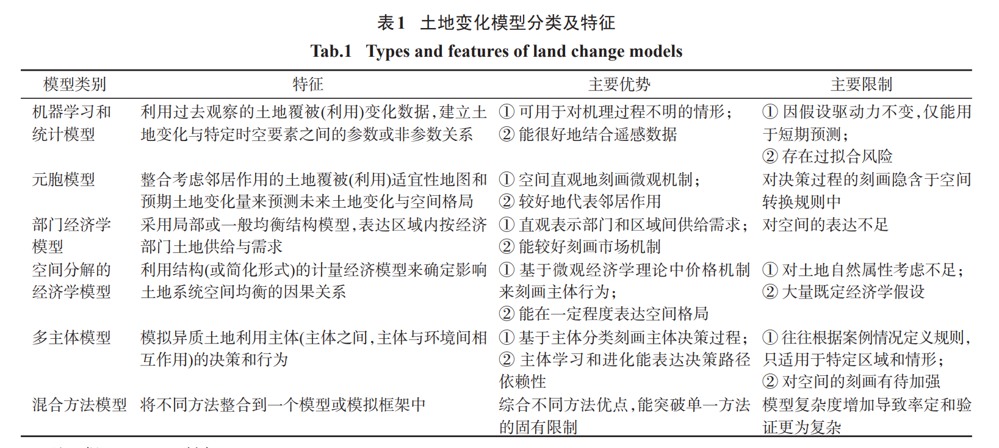

# 地理模型的理解

[Models used in Geography: significance, needs, features, other details](https://www.yourarticlelibrary.com/geography/models-used-in-geography-significance-needs-features-and-other-details/24591)

## 背景

二战后，地理学的定义、地理学思想和地理学方法论都发生了很大的变化，近几十年来，地理学家门越来越多地集中在地理概化、模型、理论和一般规律的形成等主题上，这种地理概括也称为模型构建

不同的地理学家对模型一词有不同的定义

- Skilling(1964) 认为模型是一个理论、一个定律、一个假设或一个结构化的想法，最重要的是，从地理的角度来看，它还可以包括通过空间或时间的关系对现实世界（物理或文化景观）进行推理，它可以是一个角色、一个关系或一个方程式
- Ackoff 看来，模型可以被视为使用逻辑、集合论和数学工具对理论或定律形式化呈现
- Haines-Young 和 Petch 认为：任何产生预测的设备或机制都是模型，因此建模与实验和观察一样，只是一种使理论能够得到检验和批判性检验的活动

普遍认为模型是对现实（地理景观、人与自然关系）的理想化和简化表示

## 意义

地理学是一门研究人与自然关系的学科，然而地球是相当复杂，不易理解的，地球的表面具有巨大的物质和文化多样性。在地理学中，我们考察地质地貌、气候、土壤、植被和矿产等自然资源的空间分布以及人类对它们的利用，从而导致文化景观的发展。此外，地理现象在空间和时间的维度上动态变化，地理学是一门动态的学科

地理学的主题就是人与环境的复杂关系，可以通过假设、模型和理论进行科学的检验和研究。所有模型的基本目的都是简化复杂的情况，从而检验理论

## 需要

地理学家热衷于对地理学中的规律和理论进行归纳总结，就好比物理生生物学科一样。模型是理解地球表明（包括全人类和所有圈层）的重要手段，我们通常只有高度的去概括，通常处于一下的原因，地理学家会在地理学中进行建模：

1. 对未观察到的或不可观察的现象进行量化。模型有助于估计、预测、模拟、插值和数据生成，比如未来的人口增长和密度、土地利用、种植密度、人口迁移模式、工业化、城市化和贫民窟的增长都可以在这些模型的帮助下进行预测。这些在天气预报、气候变化、海平面变化、环境污染、水土流失、森林枯竭和地貌演变方面很有用
2. 描述、分析和简化地理系统。借助模型，可以很容易地理解和预测工业分区理论、农业用地分区、迁移模式和地貌发展阶段
3. 地理数据是巨大的，随着时间的推移，这些数据越来越难以理解，建模用以通过区分模式和相关性对获得的大量数据结构进行结构化、探索、组织和分析（概念建模？）
4. 用于替代无法直接观察到的系统（黑盒模型？），并用于实验和估计特定的组件变化后可能产生的影响和后果，以及生成未来的演化场景和最终状态
5. 有助于提高对因果机制、系统微观和宏观属性与环境之间的关系的理解
6. 提供一个框架，在这个框架内，理论陈述可以被正式表示
7. 提供一种交流的方式
8. 有助于建立理论、一般规律和特殊规律

## 特点

1. 地球表面的地理现实和人与环境的关系相当复杂。模型是世界或其中一部分的选择性切片
2.  模型更加突出了某些特征，而模糊和扭曲了另一些特征
3. 包含泛化建议。如上所述，可以借助模型对现实世界进行预测
4. 是现实世界的类比，模型与现实不同
5. 模型诱使我们提出假设并帮助我们进行概括和理论构建
6. 模型以更加熟悉、简化、可观察、可访问、易于制定或可控的形式显示现实世界的某些特征，从中可以得出结论
7. 模型提供了一个可以定义、收集和安排信息的框架
8. 模型有助于从可用数据中挤出最大量的信息
9. 模型有助于解释特定现象是如何产生的
10. 模型还可以帮助我们将一些现象与更熟悉的现象进行比较
11. 模型使一组现象被可视化和理解，否则由于其规模或复杂性而无法理解
12. 模型是构建理论的基石

## 类型

### 比例模型

比例模型在较小的现实比例上对地理现象进行抽象，它可以是动态的也可以静态的。自然地理学家，尤其是地貌学家经常使用比例模型。事实上，地貌学家已经使用比例模型进行了基础研究，以研究在自然条件下难以观察到的过程，例如河流作用、冰川运动、风蚀、海洋过程和地下水的侵蚀。

### 地图

地图是地理学家最熟悉的模型，它们是一种特殊的比例模型，它们随着比例的越来越小而变得越来越抽象，通常是表示某一时刻的区域。大比例地图虽然可以准确的显示建筑物、道路的尺寸和其他特征，但势必会丢失大部分景观细节。但是地图可以通过等高线、山体阴影和阴影线来指示地形；可以通过符号来显示特定的特征或分布···

地球可以用地球仪来表示，但是地球仪在地理学研究中几乎没有用处

### 随机模拟模型

模拟是指通过适当类似的情况或设备来模仿某些过程的行为，随机是指随机确定或遵循某种随机概率分布的事物，因此可以对其行为进行统计分析。模拟模型通过大量的重复，对模拟结果进行统计分析，得出结论

比如 [d8算法](https://www.osgeo.cn/post/306c2) 、马尔可夫链模型，随机模拟模型也被成功地用于人类地理学领域，研究各种现象的空间扩散，包括人口疾病的传播，如疟疾、天花、热病和艾滋病。

### 数学模型

数学模型通过将操作过程与结果情况联系起来的数学方程来表示特定过程的方程，这个结论不会随着时间而改变。数学模型可以根据与其预测相关的概率程度进一步分为确定性和随机性。

数学模型通过将操作过程与结果情况联系起来的数学方程来表示特定过程的方程。然而，有必要对相关的物理过程有充分的了解，因此，这种类型的模型构建主要是物理学家的工作。例如，JF Nye 构建了冰川流动的动态数学模型。他尽可能地简化了基本假设，使方程足够简单以便求解。因此，假设冰川床具有均匀尺寸和特定粗糙度的矩形横截面（U 形山谷）。冰在其对压力的反应中被认为是完全可塑性的。然后，给定一定的应力，可以通过微分方程计算冰的响应。这些可以预测给定条件值的特定流动模式和冰剖面。地貌学家可以通过测量现场的流动模式和冰川尺寸来发挥他的作用。这些与计算值的接近程度是衡量数学模型成功与否的指标。如果观察到的流型与预测的流型非常吻合，那么可以有信心地使用该模型来提供冰川部分的流量值，这些值在野外不易测量，但对于研究冰川的影响非常重要。

### 模拟模型

模拟模型使用更广为人知的情况或过程来研究鲜为人知的情况或过程，它的价值取决于研究人员识别两种情况共有元素的的能力。（感觉就是类比了，，，）

### 理论模型

理论模型可以分为两类。第一类概念模型提供了特定问题的理论观点，允许从理论中进行的推论于实际情况相匹配。第二类理论模型于“理论”相关，它用于表示学科的整体框架

## 批判性观点

1. 同意地理学建模，但是不同意模型的准备方式，并认为大多数模型准备得并不好
2. 建模者可能专注于错误的事情，有时模型可能会忽略简化的基本标准。他们进行的分析可能会产生比原始数据更复杂的模型
3. 有一群地理学家认为建模是一项有价值的事情，但是不应把建模应用于所有事情，特别是在人文地理学、区域地理学、文化地理学和历史地理学中。在这些主题中，建模策略通过过分的强调某些主题而扭曲了主题
4. 地理学并不是一门纯粹的物理科学，它有很强的人类成分，模型可能无法解释情感，因此模型不能被视为正确解释地理现实的可靠工具
5. 建模需要大量可靠的数据，这种可靠的数据在发展中国家很少能获得，且发展中国家的数据可能存在许多缺陷。任何建立在脆弱和不可靠数据基础上的模型、理论或规律，都会扭曲地理现实
6. 大部分模型都是在欧美发达国家开发出来的，这些模型是在这些国家收集的数据的基础上构建的理论和模型，当然可能被被提升为普遍真理，但是如果把这些模型应用于发展中国家，其结果和预测可能是灾难性的

## 水文模型

[水文模型类型简介](https://zhuanlan.zhihu.com/p/20716650)

通常意义上的水文模型分为系统理论模型、概念性模型和数学物理模型

- 系统理论模型：又称“黑箱模型”，该类型模型依据系统的输入输出资料，用某种方法推求系统的响应函数。这种模型的内部运行机制不是直接描述流域水文物理过程，而是通过经验分析对于一定的输入数据产生响应的输出结果。代表模型有：总径流线性响应模型（TLR）、线性扰动模型（LPM）以及神经网络（ANN）模型等
- 概念模型：是以水文现象的物理概念和一些经验公式为基础构造的，它把流域的物理基础（如下垫面）进行概化（线性水库、土层划分、蓄水容量曲线等），在结合水文经验公式（下渗曲线、汇流单位线、蒸散发公式等）来近似地模拟流域水文过程，如**新安江模型**、Stanford 模型、TanK 模型等模型
- 数学物理模型：依据物理学的质量、动量和能量守恒定律以及流域产汇流特性构造水动力学方程组，来模拟降水径流在时空上的变化、能够考虑水文循环的动力学机制和相邻单元的空间关系，模拟参数可以直接测量或推算。如**swat模型**，DBSIM 模型、SHE模型

## 土地变化模型

[土地变化模型方法综述](https://kns.cnki.net/kcms/detail/detail.aspx?dbcode=CJFQ&dbname=CJFDLAST2018&filename=DLKJ201801016&v=MTM2NTkxRnJDVVI3aWZaT1Z1RkN2bFU3ekxJU0hBWkxHNEg5bk1ybzlFWW9SOGVYMUx1eFlTN0RoMVQzcVRyV00=)

构建模型模拟土地变化能够促进理解人地相互作用机制，模拟结果可为土地资源优化于资源环境政策制定提供依据。不同研究者基于不同学科理论、应用多种方法构建土地变化模型，模型从早期关注自然覆被类型变化发展到对人类决策行为的刻画，从统计方法发展到更突出空间分布的元胞自动机方法，以及更聚焦土地变化过程的经济学方法和多主体方法。未来土地变化模型发展方向为：在多尺度进行多方法耦合，对土地变化过程进行更为清晰的刻画，将土地变化模型于其它地球系统模型耦合等方面，进一步促进模型准确度

- 机器学习和统计模型：核心在于建立土地系统变化驱动力与输出（土地利用/覆被变化）之间的关系。具体来说就是通过两类地图：不同时间的土地覆被地图和解释变量地图（道路距离图），来建立统计关系。常见的方法 [土地覆盖分类的机器学习算法](https://cn.azedupress.com/640033-machine-learning-algorithms-for-land-VUTCGB-article)，**随机森林算法**
- 元胞自动机：最大特点是采用离散的空间单元进行模拟，通过规定每个空间单元的同步性土地转变为条件，来刻画土地变化过程，是一类基于系统演化微观规则并适合复杂系统模拟的工具。例子：**交通流元胞自动机实现**
- 经济学方法模型：通常有一个解释微观经济行为（如效用或利益最大化）的结构模型内核。经济学模型的基础是价格机制，均衡的概念用来保证个体选择的聚合结果互相一致，均衡可能是静态或动态。