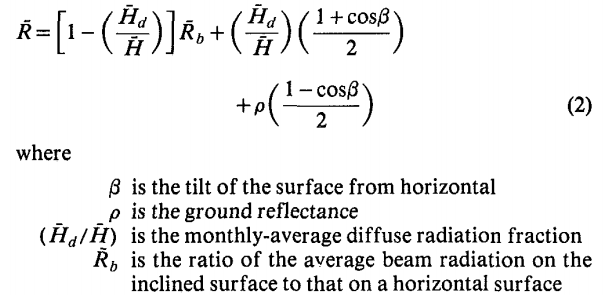

# 太阳能模型筛选系统

## 前端

### 问题

1. 模型的文字描述怎么映射到地图上（是否有必要将文字转为图形）

- eg：江苏省南部、华北平原、全球适用

2. 怎么根据绘制图形得到模型的图形

- 包含或则相交吗
- 可以用网格编码的形式吗

3. 分类

- 时间（年月日）
- 空间尺度，经纬度，海拔
- 水平、倾斜，朝向
- 辐射分类（直射，散射，反射）
- 适用领域，建筑，农业
- 基于卫星，基于已知的气候测量值
- 经验方法，半经验方法，物理方法

1. 经验方法：建立函数关系。经验方法在某些地方可能效果很好，但是将其覆盖范围扩展到更广泛区域的能力是有限的。

2. 半经验方法：通常将晴朗天空条件的物理模型与多云条件的经验方案结合在一起。

3. 物理方法：考虑了太阳辐射从大气层到地球表面的传输过程。

## 太阳辐射计算器

计算方法：Klien S A, Theilacker J C

​	

计算倾斜表面的每月平均太阳辐射

## PVGIS

### 太阳辐射概论

在垂直于射线的平面上到达大气层顶部的太阳辐射，即所谓的太阳常数，其平均值为1361-1362 W / m 2，该值随地球在其椭圆轨道上的位置而有所不同。

当太阳辐射穿过大气层时，会经历不同的吸收，扩散或散射过程，从而导致地球表面接收到的太阳辐射水平较低。这些是由于大气成分（例如臭氧或CO 2）以及悬浮的固体和液体颗粒（如气溶胶或水蒸气）造成的。但是，衰减的主要来源是云层。不仅宽带值不同，而且吸收和衰减的这些过程也对太阳辐射的波长产生不同的影响，因此，太阳辐射在地平面的光谱分布与地外光谱不同。

在地面上接收到的太阳辐射（称为全局辐射）是三个分量的总和。第一个称为射束或直接辐射，是到达地面但没有被大气衰减的太阳辐射的一部分，可以将其建模为直接来自太阳圆盘。第二部分或扩散部分是太阳辐射，它在被大气反射或散射之后到达地面，并被认为是从整个穹顶到达的。并非总是考虑到的第三部分是来自地面或附近障碍物的反射辐射。仅当太阳圆盘没有被云阻挡时，光束分量才可用，而漫射分量始终可用，这是每当云片阻挡太阳圆盘时唯一可用的辐射。

在晴朗的天空条件下（无云）以及干净干燥的大气中，太阳辐射是一个非常重要的参数，因为它提供了有关任何位置可用的最大辐射的信息。通常将此值建模，并用作其他模型的输入数据，这些模型用于估算正常大气条件下的太阳辐射。

通过PVGIS网站的页面，我们讨论了太阳辐射并以一种通用的方式使用它，但是我们还使用了其他应解释的术语。应该阐明诸如辐照度和辐照度的概念。辐照度是太阳能在单位面积和单位时间内落入地面的过程。因此，以W / m 2表示。辐照是一段时间内每单位面积接收的太阳能量，因此，能量以Wh / m 2表示。PVGIS提供的数据包含辐照度和辐照值。

1. 太阳辐射衰减的主要因素是云层

2. 无云、干净干燥的大气条件下的测量得到的太阳辐射是一个重要的参数，通常作为其它模型的输入数据

3. 辐照度（$W/m^2$、$J*s^{-1}/m^{2}$）、辐照量（$Wh/m^2$ )

### 估算太阳辐射强度

采用的半经验方法：

1. 

毫无疑问，测量太阳辐射的最佳方法是在地面上使用高质量的传感器。但是有用的是，这些测量应满足许多条件：

- 仅应使用高质量的测量传感器。
- 应至少每小时进行一次测量。
- 传感器应定期校准。
- 传感器应定期清洁。
- 数据应可长期使用，最好是10年或更长时间。

满足所有这些条件的地基辐射测量的数量相对较少，并且测站之间的距离通常很远。

由于这些原因，使用卫星数据来估计到达地球表面的太阳辐射变得越来越普遍。通常，这些方法使用对地静止气象卫星的数据。使用此类数据的优点是：

- 然后，可以在卫星图像覆盖的整个区域中获得太阳辐射数据，例如，METEOSAT卫星覆盖了非洲，欧洲和亚洲大部分地区，直至大约60°N，图像分辨率为几公里。
- 通常可以使用长达30年或更长时间的长时间序列。

使用卫星数据的缺点是必须使用许多相当复杂的数学算法来计算地面水平的太阳辐射，这些算法不仅使用卫星数据，而且还使用大气水蒸气，气溶胶（粉尘，颗粒）和臭氧的数据。某些情况可能导致计算失去准确性，例如：

- 可能被误认为云的雪
- 在卫星图像中很难检测到的沙尘暴

对地静止卫星还具有不覆盖极地地区的局限性。尽管如此，基于卫星的太阳辐射数据的准确性现在通常非常好。因此，PVGIS中使用的大多数太阳辐射都基于卫星算法。

太阳辐射估计值的另一个来源来自气候再分析数据。使用数值天气预报模型计算再分析数据，重新运行过去的模型并使用已知的气象测量值进行更正。这些模型的输出是大量的气象数据，通常包括地面的太阳辐照度。其中一些数据集具有全球覆盖范围，包括卫星方法没有数据的极地地区。这些数据集的缺点是，它们大多具有较低的空间分辨率（每30 km或更高一次一个值），并且在覆盖范围内，太阳辐射值的准确性通常不如基于卫星的太阳辐射数据好两种类型的数据集。

在发布PVGIS 5时，我们使用了两个基于重新分析的太阳辐射数据集：

- ECMWF ERA-5，由[欧洲中型天气预报中心（ECMWF）生产](http://www.ecmwf.int/)。该数据集的全球覆盖范围约为30 km，包括全球和直接太阳辐照度。在撰写本文时，仅发布了2010-2016年的时间段，而在2018年还有更长的时间段。
- COSMO-REA是一个区域性再分析产品，覆盖欧洲和北非[ [*Bollmeyer等人，2015*](https://ec.europa.eu/jrc/en/PVGIS/docs/methods#References) ]。空间分辨率约为6公里（在PVGIS中我们使用3弧分），并且以1995-2015年期间的小时时间分辨率获得数据，尽管在PVGIS中目前仅使用2005-2015年的间隔。

COSMO-REA在地理范围上仅限于欧洲和北非部分地区。相反，ERA-5具有全球覆盖范围。但是，对于PVGIS 5版本，我们将以相同的程度提供这两个数据库，仅覆盖欧洲。

有关基于重新分析的新太阳辐射数据的更多信息，请参见[此处](https://ec.europa.eu/jrc/en/pvgis/docs/reanalysis)。

### 卫星太阳辐射的计算

1. 使用卫星图像估算云对太阳辐射的影响
2. 使用大气中的辐射传递理论以及大气中有多少气溶胶（灰尘，颗粒等）的数据，计算晴朗天空条件下（即无云）的太阳辐射
3. 根据云的反照率和晴空辐照度计算总辐射

使用卫星数据的缺点是必须使用许多相当复杂的数学算法来计算地面水平的太阳辐射，这些算法不仅使用卫星数据，而且还使用大气水蒸气，气溶胶（粉尘，颗粒）和臭氧的数据。某些情况可能导致计算失去准确性，例如：

- 可能被误认为云的雪
- 在卫星图像中很难检测到的沙尘暴

在许多科学论文中已经描述了用于计算来自卫星的太阳辐射的方法（[*Mueller等，2009； Mueller等，2012； Gracia Amillo等，2014*](https://ec.europa.eu/jrc/en/PVGIS/docs/methods#References)）。在这里，我们仅简要介绍这些方法。本说明用于计算欧亚大陆和非洲的太阳辐射（PVGIS-CMSAF和PVGIS-SARAH数据库）。来自NSRDB数据集的数据已使用不同的方法进行了计算（[*Habte et al。，2017*](https://ec.europa.eu/jrc/en/PVGIS/docs/methods#References)）。

计算的第一步是使用卫星图像估算云对太阳辐射的影响。云层倾向于反射入射的阳光，因此较少的辐射到达地面。

通过每月一个月的每天相同时间查看相同的卫星图像像素，可以计算出云的反射率。然后，该方法假定该月中最暗的像素是与晴朗的天空（无云）相对应的像素。对于所有其他日子，然后相对于晴朗的日子来计算云层反射率。这是一天中所有小时的工作。这样，可以计算出*有效的云反照率*。下图显示了原始卫星图像和根据该图像计算出的有效云反射率的示例。请注意，在第一个图像中陆地表面是如何可见的，但是在第二个图像中仅留下了云层。

来自印度洋METEOSAT-7的原始卫星图像

© PVGIS©欧洲共同体，2001-2017

根据2015年1月1日09:00 UTC拍摄的卫星图像计算出的有效云反射率。

© PVGIS©欧洲共同体，2001-2017

第二步，该方法使用大气中的辐射传递理论以及大气中有多少气溶胶（灰尘，颗粒等）的数据，计算晴朗天空条件下（即无云）的太阳辐射。浓度较高的水蒸气和臭氧，它们都倾向于吸收特定波长的辐射。然后根据云的反照率和晴空辐照度计算总辐射。下图显示了使用上图所示的云反照率计算的总体水平辐照度。

根据METEOSAT-7图像计算的2015年8月1日09:00的全球水平辐照度（W / m2）

© PVGIS©欧洲共同体，2001-2017

该方法通常效果很好，但在某些情况下可能会失败。例如，如果地面上有雪，则该方法可能会将其视为云，然后计算出太低的辐照度。而且，用于计算的气溶胶信息包括多年平均值，因此该方法无法很好地捕获气溶胶的短期变化，例如由于沙尘暴或火山喷发而引起的变化。

对于当前版本的PVGIS，用于太阳辐射估算的卫星数据来自覆盖欧洲，非洲和亚洲大部分地区的METEOSAT卫星。根据卫星的类型，每15分钟或30分钟捕获一次图像。对于PVGIS，我们每小时使用一幅图像。卫星图像的分辨率各不相同，在卫星图像（最低点）以下最高，而向图像边缘移动时则降低。在最低点，分辨率约为4公里。

在[CM SAF](http://www.cmsaf.eu/)合作中已开发出PVGIS中用于基于卫星的太阳辐射数据的算法。PVGIS中使用的太阳辐射数据也可以通过Web用户界面直接从CM SAF获得。

最近，我们与[国家可再生能源实验室](http://www.nrel.gov/)合作，将[NSRDB](http://nsrdb.nrel.gov/)数据纳入PVGIS。这将覆盖范围扩展到北美和中美洲。

### 验证基于卫星的太阳辐射数据

必须对照在地面上的测量值来检查从卫星图像产生的太阳辐射数据，以了解基于卫星的太阳辐射数据有多大的不确定性。这称为数据验证。

通过与地面站测量结果进行比较，许多科学论文已经给出了PVGIS中使用的卫星太阳辐射数据的验证结果（[*Mueller等，2009； Mueller等，2012； Huld等，2012； Gracia Amillo等。 。，2014*](https://ec.europa.eu/jrc/en/PVGIS/docs/methods#References)）。在这里，我们仅介绍验证的基本结果。地面站的大多数测量值来自“[基线表面辐射网络”](http://bsrn.awi.de/)（BSRN），该[网络](http://bsrn.awi.de/)为世界各地的站提供了高质量的太阳辐射测量值。

|                        |              |         |                            |        |       |
| :--------------------: | :----------: | :-----: | :------------------------: | :----: | ----- |
|          位置          |     纬度     |  经度   | 卫星与电台之间的百分比差异 |  参考  |       |
|      地理信息系统      | 地理信息系统 |         |                            |        |       |
|   Lindenberg（德国）   |   52.22牛    | 14.12E  |            -3.4            |  -3.2  | [1,3] |
|       卡博（NL）       |    51.97N    |  4.93E  |            +0.4            |  -0.4  | [1,3] |
|     卡庞特拉（FR）     |    44.05N    |  5.03E  |            +2.1            |  +5.5  | [1,3] |
|     Payerne（CH）      |    46.81N    |  6.94E  |            -3.0            |  +0.6  | [1,3] |
|     贝尔斯克（PL）     |   51.70牛    |  20.8E  |            -5.5            | 不适用 | [1]   |
|    坎伯伯恩（英国）    |   50.22牛    | 5.32瓦  |            +3.0            |  -1.9  | [4,3] |
|      托拉韦（EE）      |    58.27N    | 26.47E  |            +5.1            |  -4.1  | [4,3] |
|    斯德·博克（IL）     |    30.87N    | 34.77E  |            -3.3            |  +3.4  | [4,3] |
|    阿尔梅里亚（ES）    |    37.50N    |  2.2瓦  |            -0.9            | 不适用 | [4]   |
|      日内瓦（CH）      |    46.12N    |  6.01E  |            +2.6            | 不适用 | [4]   |
|      南特（法国）      |   47.25牛    | 1.55瓦  |            +3.8            | 不适用 | [4]   |
|   沃克斯昂维林（FR）   |    45.78N    |  4.93E  |            +3.9            | 不适用 | [4]   |
|     基希涅夫（MO）     |    47.00N    | 28.82E  |            +0.4            |  +1.4  | [4,3] |
|     利耶帕亚（LV）     |   56.48牛    | 21.02E  |            +2.5            | 不适用 | [4]   |
|    Sonnblick（AT）     |    47.05N    | 12.95E  |           -14.0            | 不适用 | [4]   |
|    塞萨洛尼基（GR）    |   40.63牛    | 22.97E  |            +5.9            |  +3.6  | [4,3] |
|  维也纳·荷·瓦特（AT）  |   48.25牛    | 16.35E  |            -1.5            | 不适用 | [4]   |
|     伊斯普拉（IT）     |    45.81N    |  8.64E  |            +8.4            |  +9.0  | [4]   |
|       米兰（IT）       |   45.48牛    |  9.26E  |            -0.5            | 不适用 | [4]   |
|       罗马（IT）       |    41.86N    | 12.62E  |            +4.1            | 不适用 | [4]   |
|    Sarreguren（ES）    |   42.82牛    | 1.60瓦  |            +1.6            | 不适用 | [4]   |
|    拉科鲁尼亚（ES）    |    43.37N    | 8.42瓦  |           +11.0            | 不适用 | [4]   |
|      莱里达（ES）      |    41.62N    | 0.60瓦  |            +2.4            | 不适用 | [4]   |
|      马德里（ES）      |   40.45牛    | 3.72瓦  |            -0.3            | 不适用 | [4]   |
|    塔曼拉塞特（DZ）    |   22.78牛    |  5.51E  |            -6.0            |  +2.6  | [4,3] |
|       德阿（ZA）       |   30.67秒    | 23.99E  |            +2.2            |  +0.6  | [4,3] |
|      太阳村（SA）      |    24.91N    | 46.41E  |            +3.2            |  -0.2  | [4,3] |
| 弗洛里亚诺波利斯（BR） |   27.53秒    | 48.52瓦 |           不适用           |  +0.3  | [3]   |
|  科科斯岛（澳大利亚）  |   12.19秒    | 96.84E  |           不适用           |  +0.6  | [3]   |
|       香河（CN）       |   39.75牛    | 116.96E |           不适用           |  +0.8  | [3]   |

### 斜面上太阳辐射的计算

上述基于卫星的计算会产生水平面上的整体和束辐照度值，宽带和光谱解析辐照度值。

然而，模块和PV系统通常相对于水平面或在跟踪系统上以倾斜角度安装，以使接收到的平面内辐照度最大化。因此，卫星检索的辐照度值不能代表模块表面可用的太阳辐射，因此有必要估算平面内辐照度。

科学参考书目中有几种模型，这些模型使用整体和漫反射和/或光束辐照度分量的水平面上的辐照度值作为输入数据，以估计倾斜表面上的光束和漫射分量的值。这些总和就是倾斜表面上的平面内全局辐照度。光束辐照度直接来自太阳圆盘，因此，只要知道天空中的太阳位置以及倾斜表面的倾斜度和方向，就可以轻松地从水平面的值计算出倾斜表面的值。相反，对倾斜表面上的散射分量的估计不是那么简单，因为它已被大气成分散射，因此可以描述为来自整个天空穹顶。

定义弥散分量的方式是各种估算模型之间的主要区别。可以在[*Gracia Amillo和Huld，2013年*](https://ec.europa.eu/jrc/en/PVGIS/docs/methods#References)找到这些模型的比较。模型可以分为两大类，各向同性和各向异性。第一组认为漫射辐射在天穹上是均匀分布的（各向同性），类似于在阴天情况下观察到的情况。在此假设下，倾斜表面上的漫射辐照度是水平面上的值，其缩放系数仅取决于表面的倾斜度，并说明了从该平面的表面可见的天空穹顶部分。

但是，漫射辐射几乎不可能是各向同性的。改变云层，但即使在无云的情况下，也很容易区分亮度不同的区域。除了各向同性的背景外，太阳周围的明亮区域也很容易注意到。并且，根据云量的不同，天顶或地平线周围可能会有明亮的区域。在各向异性模型之间，如何估计和考虑这些区域是不同的。根据在各向同性背景旁边使用了多少个区域，可以将它们分为两组。他们是否考虑了绕地带和/或视界带。

PVGIS中实现的估计模型是*[Muneer T.（1990）](https://ec.europa.eu/jrc/en/PVGIS/docs/methods#References)*开发的模型，可以将其分为两个组成部分的各向异性。它的表现与其他更复杂的模型（例如由Perez或Reindl开发的三个组件的各向异性模型）相似。实际上，在ESRA（2000）进行的研究中，Muneer模型证明了最佳性能。它可以区分晴朗和阴暗的天空条件，以及阳光直射和阴影的表面。

### 地形阴影的影响

意大利阿尔卑斯山某个位置的地平线高度图（以度为单位）。

© PVGIS©欧洲共同体，2001-2017

如果您靠近丘陵或山脉，有时太阳会落在丘陵后面，太阳辐射会减少到来自天空或云层的辐射。PVGIS使用有关地形高程的信息，分辨率为3弧秒（约90m）。这意味着对于每90m，我们都有一个地面标高值。根据这些数据，我们计算了每个地理位置周围的地平线高度。这些数据然后用于计算太阳被丘陵或山脉遮挡的时间。当发生这种情况时，仅使用辐射的扩散部分即可计算出太阳辐射。PVGIS中完成的计算都可以利用此信息。

下图显示了意大利阿尔卑斯山（Macugnaga）某个位置周围的地平线高度的示例。地平线高，除了向东，这是从那个地方向下谷的方向。

分辨率约为90m，PVGIS中的计算无法考虑附近物体（例如房屋或树木）的阴影影响。但是，PVGIS可以让用户上载要使用的地平线高度而不是内置地平线信息的数据文件。

### 光伏发电量的计算

当然，对于光伏系统的能量输出而言，最重要的因素是到达光伏模块的太阳辐射量。但是还有其他一些重要的因素。本章介绍了影响PV输出的不同影响以及如何在PVGIS中对其进行计算。

在实验室或工厂中测量光伏模块的功率时，这是在称为标准测试条件（STC）的标准化条件下完成的。这些标准条件由国际标准IEC-60904-1确定。这些条件是：

- 模块整个表面的光强度（辐照度）应为1000W /m²。这个值是关于
- 当模块正对着阳光时，在晴天的中午时分，尽管在实际条件下，辐照度有时可能更高。
- 模块温度应为25°C。
- 光的光谱应等于IEC 60904-3中给出的全局光谱。该光谱与您在晴天看到的光谱相对应，其中太阳比地平线高约40°，并且模块相对于面向太阳的水平面倾斜约40°。

在STC处测得的功率称为标称功率或峰值功率。

### Angstrom公式实现

### 克里金插值

网址：[克里金插值](https://www.cnblogs.com/China-YangGISboy/p/6382698.html)

确定性插值方法：IDW(反距离加权法)   样条函数插值法，直接基于周围的测量值生成表面的平滑度的数学公式

地统计方法：克里金法，基于包含自相关（测量点之间的统计关系）的统计模型，因此，地统计方法不仅具有产生预测表面的功能，而且能够对预测的准确性提供某种度量

克里金法假定采样点之间的距离或者方向可以反映表面的变化，克里金法可以将数学函数或指定数量的点或者半径内的所有点进行拟合以确定每个位置的输出值，克里金法是一个多步过程：数据的探索性统计分析、变异函数建模和创建表面

在反距离权重法中，权重仅取决于预测位置的距离，但是，使用克里金方法时，权重不仅取决于测量点之间的距离、预测位置，还取决于基于测量点的整体空间排列，要在权重中使用空间排列，必须量化空间自相关

要使用克里金插值法进行预测，有两个任务是必需的：

- 找到空间自相关的关系
- 进行预测

要实现这两个任务，克里金法需要经历一个两步过程：

1. 创建[变异函数](https://baike.baidu.com/item/%E5%8F%98%E5%BC%82%E5%87%BD%E6%95%B0/3737509)和协方差函数以估算取决于自相关模型（拟合模型）的统计相关性（空间自相关的）值
2. 预测未知值

