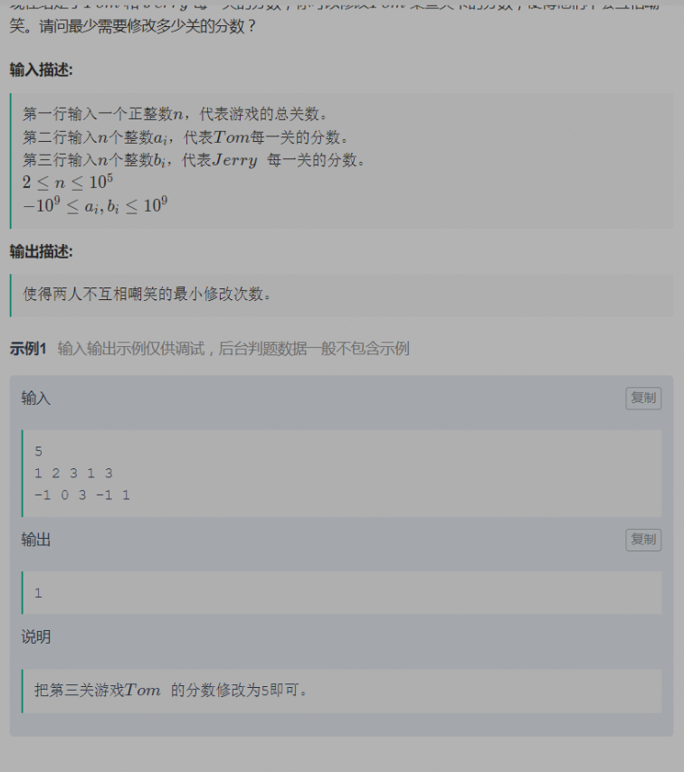
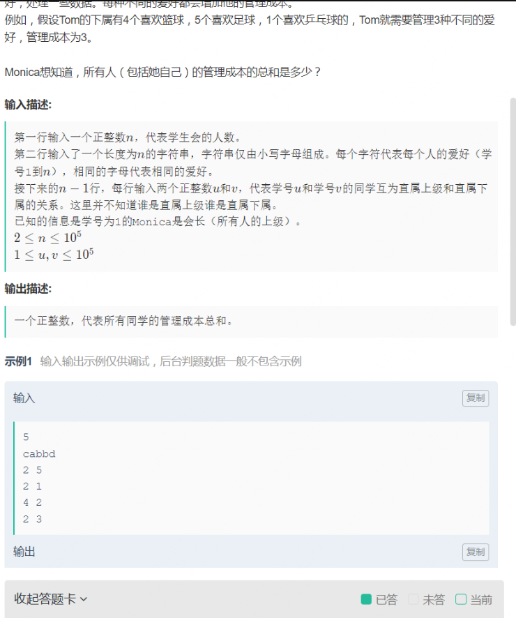

# 个人面经

## 1. 实习

总结：都凉了，但是的确老师也不让实习，只是面着玩去的

### 1.1 阿里-钉钉

#### 一面、电话面（面试，笔试）    3.9 

面试问题（1 小时）

1. 做了哪些项目，项目用到了哪些东西
2. Ajax 为什么不用更新页面了（这个回答的有点懵）
3. Vue拿到数据之后怎么渲染数据的（最近太忙，Vue还没来得及仔细看，这块崩了，还一直问，然后问的一些东西我都答非所问的，也没记住问题，惨败！）
4. CSS 选择器权重（这个背了，看我vue回答的太差的，送我分的）
5. const let var（同上）
6. 写的代码 es6 怎么在浏览器中运行
7. apply，call，bind
8. js 有哪些自己觉得算是理解的点（我giao，这真是送命题啊，我说了之后把我问死的意思吗）
9. Cookie 有哪些属性
10. 为什么有些网站不消除 Cookie就一直能登录（我就回答了一句，不消除发送的时候自动把Cookie也包进去了，感觉回答的很简单，，，）
11. 实现历史回退前进（我回答了快照）
12. TS VS JS （只回答了强弱类型，然后胡扯了一下）
13. 为啥决定走前端了
14. 前端占你学习比重有多大，可以多了解一点底层的东西（当时就觉得凉凉了）
15. 现在觉得前端有哪些不好的问题，最想做啥（好的我准备了，不好的地方还真没想到）

笔试（4 选 3，1小时）

1. 操作DOM（这个自己就很少写，直接pass）
2. 递归将一个对象数组排序（这个有一点问题，网页的编译器判断 Array.isArray 这个函数不能用，然后我就不知道怎么判断这个变量是不是一个数组了）
3. 比较版本号（正则用的有点不熟练啊，其它没啥问题）
4. 节流函数

#### 二面、电话面    3.26

都是面试，全程大概将近一小时，主要以项目为主，前端的一些原理为辅助（又在原理上崩了，giao）

1. 讲项目（然后我就讲了自己做的项目，nodejs + vue + mongo + websocket )
2. 具体问了表的设计，项目解决了什么问题，用了什么技术
3. 项目难点，亮点，我说的是 I/O 压力过大，服务器的文件描述符很快用光，会吃不消，并且容易 monog 中一条记录会超级大，超过了 16 mb 的限制，然后childprocess 调子进程会有的一些bug，资源管理的设计还不错等等
4. 问了实验室的一些事
5. 提出项目中的一些场景让我怎么解决，比如问了怎么实现将删除的文件或文件夹复原，也就是实现一个回收站的功能，我回答的是用栈的思想，再创建一个类似回收站的临时文件夹，巴拉巴拉的讲了一堆，但是面试官觉得用版本号可以更好的解决，栈只是一个线性的结构
6. vue2 的响应式用了 defineProperty，vue 3 用了 props，为什么（这个回答的很差，，，）
6. v-if 与 v-for 为什么不推荐同时使用
6. v-for 为什么要加 key
7. vue 路由跳转的时候怎么更新渲染的（这个也回答的很差）
8. 用过 React 的 hook 吗（，，，）
9. css 掌握程度（，，，）
10. 用的的组件库里面觉得最好的组件是啥（这个我觉得组件不都是常规的吗，说了一个 react-color-palette，至于什么原因就说的很主观，没说技术上的）
11. 问我还有什么要展示的吗（当时没想好，答得不好，想想应该说说算法和自己对新技术的探索 :cry:） 
12. 能实习吗，有没有面其它公司，等等一些常规的问题

### 1.2 七牛云

#### 一面、电话面    5.10

1. 你的专业和软件工程有什么区别（，，，）
2. 虚拟内存和物理内存的区别（第一个问题就把我给整懵了）
3. 了解 CDN（内容分发网络） 吗（服务器网络，尽可能快的交付内容）
4. 块元素怎么行内排列
5. vue 和 react 的区别，优势
6. 平时的编程环境是啥样的，会用哪些东西
7. header 用那些请求头（当时无语了，没回答好，应该通用、请求、响应这种分类来答的）
8. Cookie 等缓存方面的知识
9. 你为什么选择前端等等问题
10. url 的参数转一个对象，但是优化的时候要我用 reduce 方法（这个方法没有写过，就不知道怎么写了，然后这个编译器不仅没有提示，连反括号都没有，极其难用）

```js
function urlToObj(input) {
  let tempStr = input ? input.split('?')[1] : '';
  let tempParams = tempStr ? tempStr[1].split('&') : [];
  let obj = {}, key, value, temp;
  // 写法 1：for 循环
  for(let i = 0; i < tempParams.length; ++i) {
    temp = tempParams[i].split('=');
    key = temp ? temp [0] : '';
    value = temp ? temp [1] : '';
    if(key.length) {
      if(obj.hasOwnProperty(key)) {
        if(!Array.isArray(obj[key])) {
          obj[key] = [obj[key]];
        }
        obj[key].push(value);
      } else {
        obj[key] = value;
      }
    }
  }
  // 写法 2： map 函数
  tempParams.map(item => {
    temp = item.split('=');
     key = temp ? temp [0] : '';
    value = temp ? temp [1] : '';
    if(key.length) {
      if(obj.hasOwnProperty(key)) {
        if(!Array.isArray(obj[key])) {
          obj[key] = [obj[key]];
        }
        obj[key].push(value);
      } else {
        obj[key] = value;
      }
    }
  })
  // 写法 3： reduce 函数
  tempParams.reduce((prev, item) => {
    key = item.split('=')[0];
    value = item.split('=')[1];
    if(key.length) {
      if(prev.hasOwnProperty(key)) {
        if(!Array.isArray(prev[key])) {
          prev[key] = [prev[key]];
        }
        prev[key].push(value)
      } else {
        prev[key] = value;
      }
    }
  }, obj)
  
  return obj;
}
```

### 1.3 美团

美团实习笔试没过，编程是 ACM 模式，但是自己不会 JS 怎么读输入输出，直接两道编程题 g 了，就很无语，但是我面的比较晚，本来就没 hc 了，好像也没啥可惜的

## 2. 提前批


### 2.1 蔚来（oc）

#### 笔试 7.3

**总结**：设计模式、canvas 下去好好看一下

12 ？ 道单项选择题，基本上都是设计模式和数据结构的，设计模式没仔细看，g

8 道多项选择题，很多不确定，题都比较偏

3 道编程题

1. HTML中的尖括号匹配  通过率 51%，大概知道问题出在哪了，但是当时时间不够了

```javascript
function temp(str) {
  if(!str || str === '') {
    return false
  }
  let data = str.match(/<.*?>/g);    // 返回所有的尖括号
  if(data.length % 2 != 0)  {   // 如果括号不是成对匹配，直接 pass
    return false
    return;
  }
  for(let i = 0; i < data.length; i++) {
    if((i+1)%2) {
      if(data[i] <= 2) {
        return false;
      }
    } else {
      if(!/<\/.+?>/g.test(data[i])) {
        return false;
      }
    }
  }
  let dataTemp = str.match(/>.*?</g);
  for(let i = 0; i < dataTemp.length; i++) {
      if(/\//g.test(data[i])) {
          return false;
      }
  }
  return true;
}
temp("<te><</te><st></st>")

```

2. 全排列字符串，并返回所有的回文字串，取巧了，排列的时候直接求个数，然后回文子字符串的时候根据公式来的

```js
function temp(str) {
  if(!str || str === '') {
    return 0;
  }
  let count = 0;
  let arr = new Array(26).fill(0);
  for(let i = 0; i < str.length; i++) {
    arr[str[i].charCodeAt() - 'a'.charCodeAt()]++;
  }
  for(let i = 0; i < arr.length; i++) {
    if(arr[i]) {
      count += (1 + arr[i]) * arr[i] / 2;
    }
  }
  return count;
}
```

3. canvas 绘制矩形并拖动，这个贼无语，完全没用过 canvas，，， —— 尝试写了一下，很简单，根据不是 canvas，是根据 div 插入的，很简单的一段代码，现在写十分钟不到就写完了，下一次面试的时候不要怕这种了，大部分代码人家都写了，你怕个 der 啊

```html
<!DOCTYPE html>
<html>
    <head>
        <meta charset=utf-8>
        <style type="text/css">
            * {
                margin: 0;
                padding: 0;
            }
            #paintArea {
                position: absolute;
                width: 500px;
                height: 500px;
                background-color: #34495e;
                overflow: hidden;
            }
            .box {
                position: absolute;
                border-radius: 3px;
                background-color: #f1c40f;
                opacity: 0.7;
                cursor: move;
            }
            .rectangle{
                position: absolute;
                border-radius: 3px;
                overflow:hidden;
                background-color: #f1c40f;
                opacity: 0.7;
            }
        </style>
    </head>
    <body>
    	<section id="paintArea"></section>

        <script type="text/javascript">
            const paintarea = {
                el: null,
                startX: 0,
                startY: 0,
                gapX: 0,
                gapY: 0,
                dragging: false,
                init(el = null) {
                    if(!el) return
                    this.el = el
                    this.initEvents()
                },
                initEvents() {
                    const _this = this
                    // TODO: 请给下列三个监听事件添加监听对象

                    this.el.addEventListener('mousedown', _mousedownHandler)
                    this.el.addEventListener('mousemove', _mousemoveHandler)
                    this.el.addEventListener('mouseup', _mouseupHandler)

                    function _mousedownHandler(event) {
                        _this.mousedownHandler(event)
                    }

                    function _mousemoveHandler(event) {
                        _this.mousemoveHandler(event)
                    }

                    function _mouseupHandler(event) {
                        _this.mouseuphandler(event)
                    }
                },
                mousedownHandler(event) {
                    event = event || window.event
                    event.preventDefault()
                    event.stopPropagation()
                    this.startX = event.pageX
                    this.startY = event.pageY
                    if(event.target.className.match(/box/)) {
                        this.dragging = true
                        if(this.el.querySelector('#moving')) {
                            this.el.querySelector('#moving').removeAttribute('id')
                        }
                        event.target.id = 'moving'
                        this.gapX = this.startX - event.target.offsetLeft
                        this.gapY = this.startY - event.target.offsetTop
                    } else {
                        const box = document.createElement('div')
                        box.id = 'active'
                        box.className = 'rectangle'
                        // TODO: 完善box的初始坐标赋值，并将该box节点插入绘制模块
                        box.style.left = this.startX + 'px';
                        box.style.top = this.startY + 'px';
                        this.el.appendChild(box);
                    }
                },
                mousemoveHandler(event) {
                    event = event || window.event
                    event.preventDefault()
                    event.stopPropagation()
                    const active = this.el.querySelector('#active')
                    const moving = this.el.querySelector('#moving')
                    if(active) {
                        // TODO: 完善绘制时，被绘制盒子的宽度与高度的计算
                        active.style.width = Math.abs(event.pageX - this.startX) + 'px';
                        active.style.height = Math.abs(event.pageY - this.startY) + 'px';
                    }
                    if(moving && this.dragging) {
                        // TODO: 完善拖拽时，被拖拽盒子的位置坐标的计算
                        moving.style.left = Math.abs(event.pageX - this.gapX) + 'px';
                        moving.style.top = Math.abs(event.pageY - this.gapY) + 'px';
                    }
                },
                mouseuphandler(event) {
                    event = event || window.event
                    event.preventDefault()
                    event.stopPropagation()
                    this.dragging = false
                    const active = this.el.querySelector('#active')
                    if(active) {
                        active.removeAttribute('id')
                        active.className = 'box'
                        if(active.offsetWidth < 5 || active.offsetHeight < 5) {
                            this.el.removeChild(active)
                        }
                    }
                }
            }
            // TODO: 请获取id=paintArea的节点
            const paint = document.getElementById('paintArea');
            paintarea.init(paint);
        </script>
    </body>
</html>
```

#### 一面、二面 7.23

一个连环面，技术面应该是结束了，不是很难，但是前一天晚上失眠了，然后状态很差，发挥的不是很好，看结果了

**一面**

先是一道笔试题，3 选 1，3 道题都不难，忘记具体是撒了，三道题都不难，但是给出了两种解法


### 2.2 北方信息控制研究院

#### 简单技术面 + HR 面  7.8

一个国企，去了公司线下面试的，技术面十分钟多一点，全问的项目和技能，项目都是自己，技能也没问细节，然后直接走人力面拿到了 offer，当作提升信心用吧。

### 2.3  兴业数金

面试的电话没接到，之后也没管了

#### 笔试 7.12 

单选 + 多选 + 一道编程题

单选和多选都是基础题，但是有些题好像不是常见的基础，就是那种可能是安卓之类的，这种题就是乱选的，编程题求最长子串，用一个map解决，比较简单，很快就笔试完了，顺带做了两个测评

```typescript
// 返回最长子串
export function maxLengthBetweenEqualCharacters(s: string): number {
    // write code here
  const map: Map<string, number> = new Map();
  let max: number =  -1;
  for (let i = 0; i < s.length; i++) {
    if (map.has(s[i])) {
      max = Math.max(max, i - map.get(s[i]) - 1);
    } else {
      map.set(s[i], i);
    }
  }
  return max;
}
```

### 2.4 科大讯飞

#### 笔试 7.23

当天状态不对，就记得题挺难的，没有一个ac了的，选择题也难，应该 g 了

### 2.5 用友

#### 笔试 7.25

单选和多选都不难（设计模式考的有点多），三道编程题 ac 率是（60，20，20），第二道题应该可以 ac 的，但是把闰年 2 月是 29 天搞错了，，，

1. 根据单词逆序字符串，但是对输出有要求，这道题上浪费了太多时间

```js
let data = '["t","h","e"," ","s","k","y"," ","i","s"," ","b","l","u","e"]'.split(',');
let temp = '', tempDigit;
const tempRes = [];
let res = [];
for(let i of data) {
  tempDigit = getDigit(i);
  if(tempDigit != ' ') {
    temp += tempDigit;
  } else {
    tempRes.push(temp);
    temp = '';
  }
}
tempRes.push(temp);
tempRes.reverse();
for(let i of tempRes) {
  for(let j of i.split('')) {
      res.push('\"' + j + '\"')
  }
  res.push('\" \"');
}
if(res.length > 0 ) {
  res.pop();
}
console.log('[' + res.join(',') + ']');

function getDigit(str) {
  if(str.includes('[')) {
    return str[2];
  } else {
    return str[1];
  }
}


function getDigit(str) {
  if(str.includes('[')) {
    return str[2];
  } else {
    return str[1];
  }
}

```

2. 输入年月日，判断是该年第几天，星期几（星期几需要一个公式）

```js
/**
 * 代码中的类名、方法名、参数名已经指定，请勿修改，直接返回方法规定的值即可
 *
 *
 * @param str string字符串
 * @return string字符串
 */
getDayforWeek('2018-1-01')
function getDayforWeek(str) {
  // write code here
  let year, month, day;
  [year, month, day] = str.split('-');
  let days = getDays(+year, +month, +day);
  let week = getWeek(+(year.slice(0, -2)), +(year.slice(-2, )), +month, +day);
  console.log(days + '(' + week + ')');
}

function getDays(year, month, day) {
  const monthDay = [31, 28, 31, 30, 31, 30, 31, 31, 30, 31, 30, 31] // 不是闰年的每月的天数
  let res = 0;
  for (let i = 0; i < month - 1; i++) {
    res += monthDay[i];
  }
  res += day;
  if(isRunYear(year) && month > 2) {
    res += 1;
  }
  return res;
}

function isRunYear(year) {
  if ((year >= 0 && year % 400 === 0) || (year % 4 === 0 && year % 100 != 0)) {
    return true;
  } else {
    return false;
  }
}
function getWeek(century, year, month, day) {
  let temp = year + Math.floor(year / 4) + Math.floor(century / 4) - 2 * century + Math.floor((26 * (month + 1)) / 10) + day - 1
  while (temp < 0) {
    temp += 7;
  }
  let res;
  switch (temp % 7) {
    case 0:
      res = 'Sunday';
      break;
    case 1:
      res = 'Monday';
      break;
    case 2:
      res = 'Tuesday';
      break;
    case 3:
      res = 'Wednesday';
      break;
    case 4:
      res = 'Thursday';
      break;
    case 5:
      res = 'Friday';
      break;
    case 6:
      res = 'Saturday';
      break;
    default:
      break;
  }
  return res;
}

module.exports = {
  getDayforWeek: getDayforWeek,
}
```

3. k 个苹果，n 层楼，应该不为 1 的时候就一直二分，k 为 1 的时候就从下往上试，但是肯定想简单了

```js
/**
 * 代码中的类名、方法名、参数名已经指定，请勿修改，直接返回方法规定的值即可
 *
 *
 * @param k int整型 拥有多少苹果
 * @param n int整型 拥有几层楼
 * @return int整型
 */
function superAppleDrop(k, n) {
  // write code here
  if(k === 1) {
    return n;
  }
  if(k > 1) {
    return superAppleDrop(k - 1, Math.floor(n /2));
  }
}
module.exports = {
  superAppleDrop: superAppleDrop,
}
```

## 3. 正式批

太多了，不想写了，只想早点把论文搞了回家躺平

### 3.1 联想

#### 笔试（8.3）

搞忘了，应该不是太难，但是第二个编程题没思路

1. 搬砖时间

```js
let t = +read_line()
let data, a, b, res
for (let i = 0; i < t; i++) {
  data = read_line().split(' ')
  a = temp(data[0], data[1], data[2])
  b = temp(data[3], data[4], data[5])
  if (a < b) {
    console.log('A')
  } else if (a > b) {
    console.log('B')
  } else {
    console.log('A&B')
  }
}

function temp(i, j, k) {
  return Math.ceil(+k / +i) * +j
}
```

2. 栅格染色

```js
// 这题当时没有思路
let n = +read_line()
let str = read_line().split('')
let res = 0
for (let i = 1; i < str.length; i++) {
  if (str[i] != str[i - 1]) {
    res++
  }
}
console.log(Math.floor(res / 2))
```


### 3.2 大疆

#### 笔试（8.7）

大疆和米哈游戏的笔试无缝衔接了，麻了，敲下来手麻了

题的类型挺多的，还有两个 webGL 的简答题，有点小无语，，，但是还好的是题比较简单

1 道编程题，解析 url

```js
// 解析 url， ac 了 50%，搞忘 indexOf 可能返回 0 了，判断条件用的 > 0，应该是因为这个原因没有全部通过
// 还有两个 webGL 的简答题，有点小无语，，，
let data = 'https://www.dji.com/cn/mavic-3?from[]=nav&site=brandsite&from[]=homepage&height=200#faq'
// data = read_line()
let protocol = '',
  hostname = '',
  port = '',
  pathname = '/',
  hash = '',
  searchArr
handleData(data)
console.log('protocol=' + protocol)
console.log('hostname=' + hostname)
console.log('port=' + port)
console.log('pathname=' + pathname)
console.log('hash=' + hash)
if (searchArr && searchArr.length > 0) {
  searchArr.map((a) => {
    let temp = a.split('=')
    console.log('search:' + temp[0] + '=' + temp[1])
  })
}

function handleData(data) {
  let temp1 = data.split('//')
  protocol = temp1[0]
  if (!temp1[1]) return
  let temp2 = temp1[1].split('?')
  let index
  if (!temp2[0]) return
  if (temp2[0].indexOf('/') > 0) {
    index = temp2[0].indexOf('/')
  } else {
    index = temp2[0].length
  }
  let tempHost = temp2[0].slice(0, index)
  pathname = temp2[0].slice(index)
  if (tempHost.indexOf(':') > 0) {
    // 有端口的情况
    ;[hostname, port] = tempHost.split(':')
  } else {
    hostname = tempHost
  }
  if (!temp2[1]) return
  if (temp2[1].indexOf('#') > 0) {
    let temp3 = temp2[1].split('#')
    searchArr = temp3[0].split('&')
    hash = '#' + temp3[1]
  } else {
    searchArr = temp2[1].split('&')
  }
  searchArr.sort((a, b) => a.charCodeAt() - b.charCodeAt())
}
```

### 3.3 米哈游

#### 笔试（8.7）

题比较简单，3 道编程题，最后 1 个编程题要写挺多代码的，还有一个随机骰子的页面的题，这居然是简答题，明明应该用本地 IDE 写的，但是硬就是要简答，，，

1. 寻找数组中的所有子字符串

```typescript
// ac 了，排序后暴力解决的，应该有更优雅的解决办法
function stringMatching(words: string[]): string[] {
  // write code here
  const res: string[] = [];
  if (!words || words.length === 0) {
    return res;
  }
  words.sort((a, b) => a.length - b.length);
  for (let i = 0; i < words.length; i++) {
    for (let j = i + 1; j < words.length; j++) {
      if (words[j].indexOf(words[i]) >= 0) {
        res.push(words[i]);
        break;
      }
    }
  }
  return res;
}
stringMatching(["mass", "as", "hero", "superhero"]);
```

2. 最小数字

```typescript
// ac 了，输入一个数字，返回这个数字能组成的最小的数字
function smallestNumber(num: number): number {
  // write code here
  // 直接对 num 的字符串排序，如果第一位是 0，找到不是0的那个交换一下即可
  const str: string[] = (num + '').split('').sort((a, b) => (+a) - (+b));
  if (str[0] === '0') {
    let i = 0;
    while (i < str.length && str[i] === '0') {
      i++;
    }
    str[0] = str[i];
    str[i] = '0'
  }
  return +str.join('');
}
smallestNumber(4120);
```

3. 字符串转换

```typescript
// leetcode 原题，我写复杂了
// 这题 ac 了，一个字符串转换成另一个字符串，先构建图，然后深度遍历这个图即可，思路不难 ，但是代码量挺多的
class TempNode {
  value: string;
  arr: TempNode[];
  constructor(value: string) {
    this.value = value;
    this.arr = [];
  }
  push(node?: TempNode | undefined) {
    if (!node) return;
    this.arr.push(node);
  }
}

ladderLength("hit", "cog", ["hot", "dot", "dog", "lot", "log", "cog"])
function ladderLength(beginWord: string, endWord: string, wordList: string[]): number {
  // write code here
  // 首先判断 endWord 是不是在 wordlist 中，没有就直接返回 0，否则就构建一张图，然后找这两点的最短路径
  let tempFlag = true;
  const map: Map<string, TempNode> = new Map(), root = new TempNode(beginWord), flagArr: boolean[] = new Array(wordList.length).fill(true);
  const res: number[] = [1000];
  for (let i = 0; i < wordList.length; i++) {
    if (wordList[i] === endWord) {  // 判断 endWord 是不是在 wordlist 中
      tempFlag = false;
    }
    map.set(wordList[i], new TempNode(wordList[i]));
    if (flagArr[i] && flag(beginWord, wordList[i])) {
      if (wordList[i] === endWord) return 1;
      root.push(map.get(wordList[i]));
      flagArr[i] = false;
    }
  }
  if (tempFlag) {
    return 0;
  }
  // 递归构建图
  recall(wordList, flagArr, root, map);
  // 递归查找这个值
  search(root, endWord, 1, res);
  return res[0] === 1000 ? 0 : res[0];
}

// 判断两个字符串是不是就差一个字符
function flag(str1: string, str2: string): boolean {
  let index = 0;
  for (let i = 0; i < str1.length; i++) {
    if (str1[i] != str2[i]) {
      index++;
      if (index > 1) {
        return false;
      }
    }
  }
  return true;
}

// 构建图
function recall(wordList: string[], flagArr: boolean[], root: TempNode, map: Map<string, TempNode>) {
  for (let j = 0; j < wordList.length; j++) {
    if (flagArr[j] && flag(root.value, wordList[j])) {   // 边查找 endWord, 边构建图
      root.push(map.get(wordList[j]));
      flagArr[j] = false;
    }
  }
  for (let i of root.arr) {
    recall(wordList, flagArr, i, map);
  }
}

// 查找值
function search(root: TempNode, endWord: string, depth: number, res: number[]) {
  if (root.value === endWord) {
    res[0] = Math.min(res[0], depth);
    return;
  }
  for (let i of root.arr) {
    search(i, endWord, depth + 1, res);
  }
}
```

### 3.4 zoom

想去 zoom，但是最近没时间准备了，论文一直被老师 gank，很有延毕的风险了，giao

#### 笔试（8.10）

g 了，一周多没复习任何关于面试的东西了，最近也不打算去互联网卷了，回家躺平。选择题搞忘是什么了，其实好多东西都需要看底层一点，比如 new 一个函数里面有一个属性的值是箭头函数会怎么样，IPv6 是怎么样 等等，这些大概知道，但是都很不确定，选择的时候都很无语

两道编程题都挺难的，第一个 ac 18左右，反正很低，考完知道怎么做了，第二个要用图和并查集，做了大半个小时发现还是错的，心态炸了

1. 修改分数



```js
// 先求两个分数的差，总的数目减去频率最多的数目即可
// let n = +readline();
// let tom = readline().split(' ').map(i => +i);
// let tom1 = [...tom];
// let jerry = readline().split(' ').map(i => +i);
let n = 5
let tom = '1 2 3 1 3'.split(' ').map((i) => +i)
let tom1 = [...tom]
let jerry = '-1 0 3 -1 1'.split(' ').map((i) => +i)
let res1 = 0,
  temp
for (let i = 1; i < n; i++) {
  temp = tom[i - 1] + jerry[i] - jerry[i - 1]
  if (temp != tom[i]) {
    tom[i] = temp
    res1++
  }
}
let res2 = 0
for (let i = n - 1; i > 0; i--) {
  temp = tom1[i] - jerry[i] + jerry[i - 1]
  if (temp != tom1[i - 1]) {
    tom[i - 1] = temp
    res2++
  }
}
console.log(res1 < res2 ? res1 : res2)
```

2. 学生会管理，有个上下级的关系不确定，然后我构建图的时候吃了大亏，没想到并查集，想到了但是很久没写过了，估计也是 G



```js
// 错误代码

// let n = +readline();
// let str = readline().split('');
// let arr = [];
// for(let i = 0; i < n; i++) {
//   arr.push(readline().split(' ').map(a => +a));
// }

let n = 5
let str = 'cabbd'.split('')
let arr = [
  [2, 5],
  [2, 1],
  [4, 2],
  [2, 3],
]
let set = new Set(...arr)
// 图的节点
class Node {
  index
  value
  handle
  next
  constructor(index, value, next) {
    this.index = index
    this.value = value
    this.handle = 0
    this.next = []
  }
}

let map = [] // 每个学生对应的节点
for (let i = 0; i < n; i++) {
  map[i] = new Node(i + 1, str[i])
}
build(1)
calculate(map[0])
let res = map.reduce((i, j) => i + j.handle, 0)
console.log(res)

function build(src) {
  for (let i = 0; i < arr.length; i++) {
    // 不知道谁是上下级
    if (arr[i][0] === src || arr[i][1] === src) {
      let temp = arr[i][0] === src ? arr[i][1] : arr[i][0]
      map[src - 1].next.push(map[temp])
    }
  }
  if (map[src - 1].next.length) {
    for (let i of map[src - 1].next) {
      build(i.index)
    }
  }
}
function calculate(node) {
  let set = new Set(),
    temp
  for (let i of node.next) {
    temp = calculate(i)
    for (let j of calculate) {
      set.add(j)
    }
  }
  node.handle = set.size
  return set
}
```


### 3.5 美团

#### 笔试（8.13）

有一道与编程无关的写作题和一些行测题，无语，最 giao 的是第二个编程题写了很久，准备测试的时候发现考试交卷了，晚了一分钟，心态再次炸裂

选择题还挺难的，有好多都是后端的知识

1. 订单超时的个数

```js
// ac 了 50，但是原因看牛客说是因为 read_line 函数读取的字符串长度有限制
let n, t;
[n, t] = '6 5'.split(' ').map((a) => +a)
let time = '100 101 102 103 104 105'
  .split(' ')
  .map((a) => +a)
  .sort((a, b) => a - b)

minTime();

function minTime() {
  let res = 0, index = 0;
  for(let i = 0; i < n && index < n; i++, index++) {
    while(i < n && index < n && (i + 1) * t > time[index]) {   // 一个订单超时的情况
      res++;
      index++;
    }
  }
  console.log(res);
}
```

2. 逆向约瑟夫环

```js
// 逆向约瑟夫环，吐了，0 ac，刚开始就用的数组，写着写着发现很麻烦，后面转成了双向循环链表，但是刚写完还没测试，时间超出了 1 min，没有测试了
let n = 4
let arr = '1 2 3 4'.split(' ')

class Node {
  prev
  next
  vlaue
  constructor(vlaue, prev, next) {
    this.vlaue = vlaue
    this.prev = null
    this.next = null
  }
}
const node = new Node(0) // 构建双向循环链表
let tail = node
arr.forEach((i) => {
  let data = new Node(+i)
  data.prev = tail
  tail.next = data
  tail = data
})
tail.next = node.next

const res = new Array(n).fill(0)

func(n)
console.log(res.join(' '))

// 1 2 3 => 2 3 1  1 2 3 4 => 4 2 1 3
// 第一个变成了第三个，确定一个位置，然后从底部抽两个上顶部，直到最后的只剩下两个

function func(a) {
  if (a === 0) {
    return
  }
  let source = node // 找到初始值
  let temp = 0,
    target = 0
  while (temp < 3) {
    // 找到 res 中第三个是 0 的位置
    if (res[target] === 0) {
      temp++
      target = (target + 1) % n
    }
    target = (target + 1) % n
  }
  res[target] = source.next.vlaue // arr 的第一个数赋给 res 的第三个数
  source.next = source.next.next
  source.next.prev = source
  if (node.next && node.next.next) {
    for (let i = 0; i < 2; i++) {
      // 将链表尾两个节点移到头部
      let tempNode = tail
      tail = tail.prev
      tempNode.next = node.next
      node.next = tempNode
      tempNode.prev = node
      tempNode.next.prev = tempNode
    }
  }
  func(a - 1)
}
```

### 3.6  网易雷火

#### 笔试（8.14）

还有一些填空题，题都比较常规，编程题比较简单

1. 最长回文子串

```typescript
// 最长回文子串，ac 了，但是是暴力解法，刚开始判断回文的函数有问题，测试的时候出错了，后面改了
getLongestPalindrome("abc");
// 暴力解法
function getLongestPalindrome(str: string): string {
  // write code here
  for (let len = str.length - 1; len >= 0; len--) {
    for (let i = 0; i <= str.length - 1 && i + len <= str.length; i++) {
      if (isPalindrome(str, i, i + len)) {
        return str.slice(i, i + len + 1);
      }
    }
  }
  return '';
}
function isPalindrome(str: string, i: number, j: number): boolean{
  while (i <= j) {
    if (str[i] != str[j]) {
      return false;
    }
    i++;
    j--;
  }
  return true;
}
```

2. 返回后序遍历

```typescript
// 根据前序遍历和中序遍历的字符串构建后序遍历的字符串，ac 了，差点就打算先构建这棵树了
function getPostOrderOfTree(preStr: string, midStr: string): string {
  // write code here
  // 要不要先把这个树构建出来呢？不需要，每次都返回后序遍历的结果字符串即可
  if (!preStr || !midStr || preStr.length === 0 || midStr.length === 0) {
    return '';
  }
  let i = midStr.indexOf(preStr[0]);    // 找到根节点
  return getPostOrderOfTree(preStr.slice(1, i + 1), midStr.slice(0, i)) +
    getPostOrderOfTree(preStr.slice(i + 1, preStr.length), midStr.slice(i + 1, midStr.length))
    + preStr[0];
}
console.log(getPostOrderOfTree("ACDEFHGB", "DECAHFBG"));
```

### 3.7 科大讯飞

过了很久开始记录，一二面之后应该泡池子了

#### 一面（8.15）

问的比较简单，具体搞忘了

#### 二面（8.25）

应该是第一次经历压力面，感觉不太好，但是至少面了

### 3.8 成都网安（oc）

#### 一面（9.11）

#### 二面（9.13）

经典的国企面，感觉比较简单

### 3.9  百度

#### 笔试（9.13）

二三编程题测试都没问题，但是提交就提示 0 ，离谱，做了一小时就交了，不想管了

1. 百度子串

```typescript

const yuanyin = new Set(['a', 'e', 'i', 'o', 'u']);
function judge(str: string): boolean {
  let set = new Set(str.split(''));
  if (set.size < 5) {
    return false;
  }
  return str.length === 5 && !yuanyin.has(str[0]) && !yuanyin.has(str[3]) && yuanyin.has(str[1]) && yuanyin.has(str[2]) && yuanyin.has(str[4])
}
function count(str: string) {
  let res = 0;
  for (let i = 0; i < str.length - 4; i++) {
    if (judge(str.slice(i, i + 5))) {
      res++;
    }
  }
  console.log(res);
}

count('baiduoxiaojiabankanjiaran')
```

2. 字符串取反

```typescript

/*
  3
  101
  1111
  1011

  10111
  00111
  10001   2/5 在哪都可以
*/
judge([1, 0, 1, 1])
function judge(str: number[]){
  if (str.length < 2) {
    console.log('Yes');
  }
  if (str.length === 2 && str[0] != str[1]) {
    console.log('No');
  }
  // 1 可以通过 0 往后一直移，然后数聚集的1的个数，如果是奇数则不可以，否则可以
  let start = 0;
  while (start < str.length - 1) {
    while (start + 1 < str.length && str[start] === str[start + 1]) {
      str[start] = 0;
      str[start + 1] = 0;
        start += 2;
    }
    if (start < str.length - 1) {
      start++;
      str[start] = 1;
    }
  }
  if (str[str.length - 1] === 0) {
    console.log('YES');
  } else {
    console.log('NO');
  }
}
```

3. 小红的踏前斩

```typescript
count([1, 1, 2, 3, 2, 3]);
function count(arr: number[]) {
  let i = 0, res = 0;
  while (i < arr.length) {
    while (arr[i] <= 0) {
      i++;
    }
    if (judge(i, arr)) {
      arr[i] -= 1;
      arr[i + 1] -= 2;
      arr[i + 2] -= 3;
      res += 5;
    } else if(arr[i] > 0) {
      arr[i]--;
      res++;
    }
  }
  console.log(res);
}
function judge(i: number, arr: number[]): boolean {
  if (i > arr.length - 2) {
    return false;
  }
  if (arr[i] >= 1 && arr[i + 1] >= 2 && arr[i + 2] >= 3) {
    return true;
  } else {
    return false;
  }
}
```


### 3.10 字节

#### 一面(9.14)

全是八股，很久没看了，g
