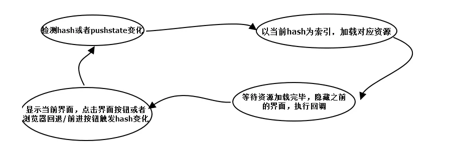
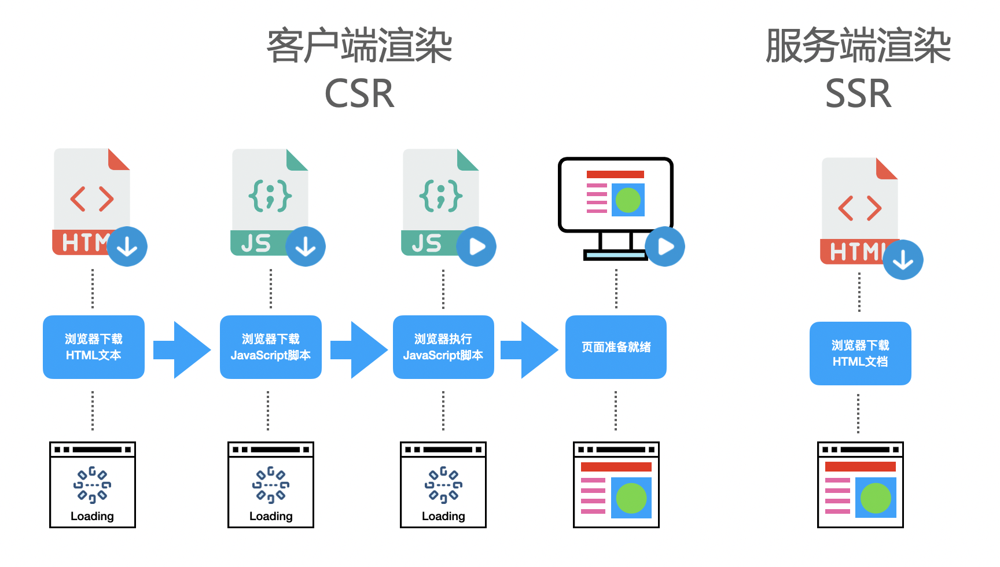
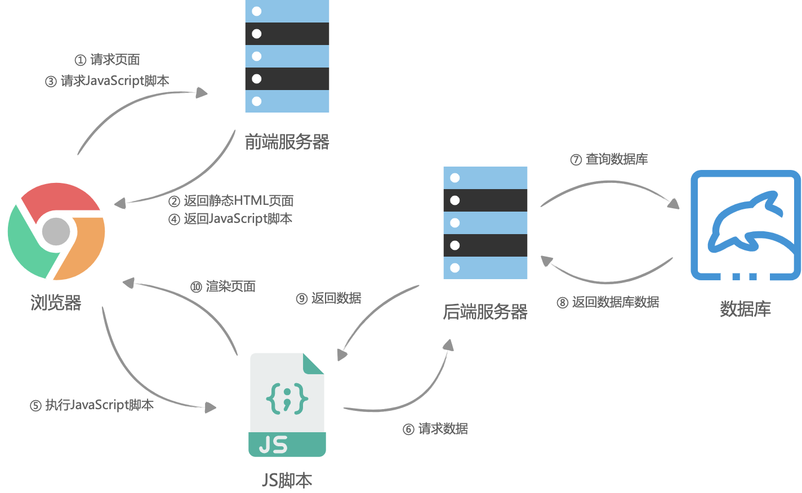

# 面试——原理

[toc]

## HTML

### HTML 自定义元素

[HTML 自定义元素教程](http://www.ruanyifeng.com/blog/2017/06/custom-elements.html)

组件是 web 开发的方向，HTML 规范有一个令人感到兴奋的功能，自己可以自定义 HTML 元素，浏览器对待自定义元素，就像对待标准元素一样，只是没有默认的样式和行为。事实上，浏览器提供了一个 HTMLUnknownElement 对象，所有的自定义元素都是该对象的实例，有了自定义元素，就可以写出语义性非常好的 HTML 代码。HTML 5 规定了自定义元素是合法的，W3C 就为自定义元素制定了一个单独的 Custom Elements 标准，与其它三个标准：HTML Imports，HTML Template，Shadow DOM  统称为 Web Components 规范。Custom Elements 规定自定义元素的名字必须包含一个破折号，这样 HTML 解析器就可以分辨哪些是标准元素，哪些是自定义元素。一旦使用了破折号，自定义元素就不是 HTMLUnknownElement 的实例了。而且 Custom Elements 标准规定自定义元素可以使用 ES 6 的 class 语法，这样可以很容易的写出继承类

vue 组件和自定义元素很像，它们之间的主要不同是 Vue 组件的数据模型是作为框架的一部分而设计的，而框架为了构建复杂的应用提供了很多必要的附加功能，比如响应式模板和状态管理

### 行内元素、块状元素、行内块状元素

HTML 内行内元素、块状元素、行内块状元素的区别：`display: inline;  display: block; display: inline-block`。一个行内元素只占据它对应标签的边框所包含的空间、块级元素占据父元素的整个空间、行内块状元素综合了行内元素和块状元素的特点，但是各有取舍

行内元素的特点：

- 设置宽和高无效
- margin 和 padding 设置左右有效，上下无效
- 不会自动换行

块状元素的特点：

- 能够识别宽高
- margin 和 padding 的上下左右都有效
- 可以自动换行
- 默认排列方式是从上到下

行内块状元素的特点：

- 不自动换行
- 能设置宽高
- 默认排列方式为从左到右

### 禁止用户缩放

<meta name="viewport" content="width=device-width,initial-scale=1,maximum-scale=1,minimum-scale=1,user-scalable=no">

将meta属性里面的 user-scalable 设置为 no

### script 标签，async，defer

[script标签上使用 defer和 async的区别（前端面试）](https://www.codeleading.com/article/31916216600/)

script 是引入js 代码的，而 async、defer 可以优化加载第三方脚本

```js
<script async src="script.js">
<script defer src="script.js">
```

因此 script标签的使用分为三种情况：

1. 没有 async 和 defer 属性，浏览器会立即加载并执行相应的脚本，不等待后续加载的文档元素，读到就开始加载和执行，此举会阻塞后续文档的加载
2. 使用了async 属性，表示后续文档的加载和渲染与 js 脚本的加载和执行是并行进行的，即异步执行
3. 使用了 defer 属性，表示加载后续文档的过程和 js 脚本的加载是并行进行的，此时的 js 脚本仅加载不执行，js 脚本的执行需要等到文档的所有元素解析完成之后


区别：

从图中我们可以明确一下几点：
1.defer和async在网络加载过程是一致的，都是异步执行的；(放在页面顶部,也不会阻塞页面的加
载,与页面加载同时进行)
2.两者的区别,脚本加载完成之后, async是立刻执行, defer会等一等 (等前面的defer脚本执行,等dom的加载)
所以, js脚本加上 async或 defer,放在头部可以减少网页的下载加载时间,如果不考虑兼容性,可以用于优化页面加载的性能

### 事件冒泡，事件捕获，事件流，事件代理，阻止冒泡

[你真的理解 事件冒泡 和 事件捕获 吗？](https://juejin.cn/post/6844903834075021326)

事件冒泡和事件捕获分别由微软和网景公司提出的，这两个概念都是为了解决页面各种事件流（事件发生顺序的）的问题

事件冒泡：从事件源朝父级一直到根元素（html），当某个元素的某类型事件被触发时，那么它的父元素同类型的事件也会被触发，一直触发到根源上，从具体元素到不确定元素

事件捕获：从根元素（html）到事件源，当某个元素的某类型被触发时，先触发根元素的同类型事件，朝子一级触发，一直触发到事件源，从不确定的元素到具体的元素

事件流：就是事件的流向，先捕获，再到事件源，然后在冒泡，一共分三个阶段：捕获阶段，目标阶段，冒泡阶段

在实际的开发中，利用事件流的特性，我们可以使用一种叫做事件代理的方法，使用事件代理的好处不仅在于将多个事件处理函数减为一个，而且对于不用的元素可以有不同的处理方法

阻止事件冒泡：

1. 给子级加  event.stopPropagation()
2. 在事件处理函数中返回 false

但是这两种方式是有区别的。`return false` 不仅阻止了事件往上冒泡，而且阻止了事件本身(默认事件)。`event.stopPropagation()`则只阻止事件往上冒泡，不阻止事件本身。

阻止默认行为

有一些html元素默认的行为，比如说a标签，点击后有跳转动作；form表单中的submit类型的input有一个默认提交跳转事件；reset类型的input有重置表单行为。

如果你想阻止这些浏览器默认行为：event.preventDefault() 或者 return false

### BOM

[面试官：说说你对BOM的理解，常见的BOM对象你了解哪些？](https://vue3js.cn/interview/JavaScript/BOM.html#%E4%B8%80%E3%80%81%E6%98%AF%E4%BB%80%E4%B9%88)

BOM(Browser Object Model)，浏览器对象模型，提供了独立于内容与浏览器窗口进行交互的对象。其作用就是跟浏览器做一些交互兄效果，比如如何进行页面的前进、后退、刷新，浏览器的窗口发生变化，滚动条的滚动等

常见的 BOM 对象有：

- window：它表示浏览器的一个实例，在浏览器中，`window`对象有双重角色，即是浏览器窗口的一个接口，又是全局对象
- location：url地址
- history：`history`对象主要用来操作浏览器`URL`的历史记录，可以通过参数向前，向后

### 懒加载、预加载

[前端面试题 - 懒加载实现原理](https://zhuanlan.zhihu.com/p/354172134)

加载图片资源的优化方式经常使用的就是 懒加载 和 预加载的方式

懒加载就是延时加载，也称为按需加载，具体表现为，当我们访问页面时，先将 img 图片的路径替换成一张占位图的路径，这样就只需请求一次，而当图片进入可视区域时候，才把图片路径替换成真正的图片的路径，从而显示图片，达到懒加载的效果

技术原理是：先将img的src属性隐藏，而将其真正的地址存放在img标签自定义的属性中(*eg：data-src*)，当图片进入可视区域时，将真正的路径从*data-src*中取出替换回来，从而显示图片

预加载就是提前加载，用户需要图片的时候从缓存中获取

具体表现为，显然 img 显示其它图片，当真实图片缓存完成后，再显示真正的图片，最常用的方式是 new Image() 设置src属性来实现预加载，再使用onload回调预载完成事件。也可以使用 css 的 background 属性将图片加载了却不显示（但是不推荐，会影响页面的加载速度）

## css

### 样式单位

css 中自适应的单位有哪些

1. vw（相对于**视口宽度**的单位）
2. vh
3. vm（相对于视口宽度或者高度，取决于哪个小）
4. em（相对于**父元素字体大小**的单位）
5. rem（相对于**根元素字体大小**的单位）

### 伪类，伪元素

[前端面试题-伪类和伪元素](https://segmentfault.com/a/1190000013737796)

css 引入伪类和伪元素的概念是为了格式化文档树以外的信息，也就是说，伪类和伪元素是用来修饰不在文档树种的部分，比如，一句话种的第一个字母

伪类用于当已有元素处于的某个状态时，为其添加对应的样式，这个状态是根据用户行为而动态变化的。当用户悬停在指定的元素时，我们可以通过 :hover 来描述这个元素的状态。虽然它和普通的 CSS 类相似，可以为已有的元素添加样式，但是它只有处于 DOM 树无法描述的状态下才能为元素添加样式，所以将其称为伪类。

伪元素用于创建一些不在文档中的元素，并为其添加样式。，比如我们可以用 ：before 来在一个元素前增加一些文本，并为这些文本添加样式，用户也可以看到这些文本，但是这些文本实际上不在文档树中

### 浮动与清除浮动

[前端面试题-clearfix（清除浮动](https://segmentfault.com/a/1190000013664630)

浮动的概念

浮动的框可以向左或向右移动，直到它的外边缘碰到包含框或另一个浮动框的边框为止，由于浮动框不在文档的普通流种，所以文档的普通流种的块框表现得就像浮动框不存在一样

浮动的影响：浮动会导致父元素高度塌陷：如果父元素没有设置高度，子元素在父元素种浮动，结果必然是父元素的高度为 0，导致父元素高度塌陷的问题

浮动的清除

- 在浮动元素后添加一个空标签<div class="clear"></div>，并且在CSS中设置 `clear{clear:both;}`，即可清理浮动，添加一个空标签，父元素可以自动获取到高度，有点是简单，代码少且兼容，缺点是增加页面的标签，造成结构混乱，现在该方法已经过时
- :after 伪元素，给浮动元素的容器添加一个`clearfix`的class，然后给这个class添加一个`:after`伪元素实现元素之后添加一个看不见的块元素（Block element）清理浮动 `clearfix:after{ content: "\20"; display: block; height: 0; clear: both}`

### 定位

position 有哪些值及其作用

position有4个值，分别是`static`，`relative`, `absolute`, `fixed`. 一般元素的默认值是`static`。

- relative 是相对定位，相对该元素本来应该在的位置偏移，偏移后可能和其它正常元素重叠
- absolute 是绝对定位，相对于 static 定位以外（即relative，absolute和fixed）的第一个父元素进行定位，设置成absolute之后，元素将会脱离文档布局，即该元素在页面中并不占有位置，而是显示在正常元素的上层或者下层
- `fixed`是相对浏览器视窗定位，页面滚动时，`fixed`定位的元素相对浏览器视窗的位置始终不变。设置成fixed之后，元素将会脱离文档布局，即该元素在页面中并不占有位置，而是显示在正常元素的上层或者下层。

文档流：块元素都是从上到下，行内元素都是从左到右，这些元素在文档中排列时候都会占用位置，称为文档流，一般设置了`position: absolute`， `position: fixed`, `float: left`, `float: right`的元素为脱离文档流

### 选择器，选择器优先级

[面试官：说下CSS选择器优先级](https://juejin.cn/post/6844904159305531406)

样式类型：行内样式，内联样式，外部样式；选择器类型：id 选择器、class 选择器、属性选择器、*、伪类选择器、后代选择器、子类选择器、兄弟选择器

权重计算规则：

第一优先级：`!important`会覆盖页面内任何位置的元素样式

1.内联样式，如`style="color: green"`，权值为`1000`

2.ID选择器，如`#app`，权值为`0100`

3.类、伪类、属性选择器，如`.foo, :first-child, div[class="foo"]`，权值为`0010`

4.标签、伪元素选择器，如`div::first-line`，权值为`0001`

5.通配符、子类选择器、兄弟选择器，如`*, >, +`，权值为`0000`

6.继承的样式没有权值

比较规则

1.`1000 > 0100`，从左向右逐个比较，前一级相等才能往后比较

2.无论是行内样式、内部样式还是外部样式，都是按照以上提到的权重方式进行比较，面试的时候遇到优先级比较，答案往往是：`行内>id>class>元素(标签)`，我们以为给了能令面试官满意的答案，其实不然，比如对同一个元素操作，在权重相等的情况下，后面的样式会覆盖前面的，这样我们给出来的答案就不成立了

3.权重相同的情况下，位于后面的样式会覆盖前面的样式

4.通配符、子选择器、兄弟选择器，虽然权重为`0000`，但是优先于继承的样式

### 基本盒子模型

[CSS基本盒子模型介绍](https://developer.mozilla.org/zh-CN/docs/Web/CSS/CSS_Box_Model/Introduction_to_the_CSS_box_model)

当对一个文档进行布局（lay out）的时候，浏览器的渲染引擎会根据标准之一的 **CSS 基础框盒模型**（**CSS basic box model**），将所有元素表示为一个个矩形的盒子（box）。CSS 决定这些盒子的大小、位置以及属性（例如颜色、背景、边框尺寸…）。每个盒子由四个部分组成，其效用由它们各自的边界（Edge）所定义。每个盒子由四个边界：内容边界 Content edge，内边距边界 Padding edge，边框边界 Border edge，外边框边界 Margin edge

### 传统布局

[CSS 居中：完整指南](https://css-tricks.com/centering-css-complete-guide/)

布局的传统解决方案，基于盒子模型，依赖 display 属性 + position 属性 + float 属性，它对于那些传统布局非常不方便，比如居中就不容易实现

水平居中

- 如果元素是一个 inline 或者 inline-block，在父元素中使用  `text-align: center`
- 如果元素是块元素，可以使用 `margin: 0 auto`
- 如果多个元素 `.inline-block-center { text-align: center; }  .inline-block-center div { display: inline-block; text-align: left }`

垂直居中

- 如果是一个 inline 或者 inline-block，使用 padding-top 和 padding-bottom 将上下填充相同，或则将文本的 line-height 等于高度
- 如果是一个块级元素
  - 如果知道高度 `.parent {position: relative}   .child {position: absolute; top: 50%; height: 100px; margin-top: -50px}`
  - 如果未知高度 `parent {position: relative} .child {position: absolute; top: 50%; transform: translateY(-50%)}`
  - 可以做成一个表格

同时水平和垂直居中

- 固定宽度和高度的元素：`.parent {position: relative} .child {width: 300px; height: 100px; position: absolute; top: 50%; left: 50%; margin: -70px 0 0 -170px}`
- 未知宽度：`.parent{position: relative} .child { position: relative; top: 50%; left: 50%; transform: translate(-50%, -50%)}`

css transform 属性允许你旋转，缩放，倾斜或平移给定元素，这是通过修改 css 视觉格式化模型的坐标空间来实现的

### flex 布局

[Flex 布局教程：语法篇](https://www.ruanyifeng.com/blog/2015/07/flex-grammar.html)

2009 年，提出的 Flex 布局，可以简便、完整、响应式地实现各种页面的布局。Flex 是 Flexible Box 的缩写，意为"弹性布局"，用来为盒状模型提供最大的灵活性。任何一个容器都可以指定为 Flex 布局： `display: flex`。采用 flex 布局的元素，称为 flex container，简称容器，它的所有子元素自动成为容器成员，称为欸flex item，简称 项目

容器默认存在两根轴，水平的主轴（main axis）和 垂直的交叉轴（cross axis），主轴开始位置叫 main start，结束位置叫 main end，交叉轴开始的位置叫 cross start，结束的位置叫 cross end。项目默认沿主轴排列，单个项目占据的主轴空间叫做 main size，占据的交叉轴空间叫做 cross size

容器的属性有：

- flex-direction，决定主轴的方向：row | row-reverse | column | column-reverse
- flex-wrap，决定换行：nowrap | wrap | wrap-reverse
- flex-flow，是 flex-direction 属性和  flex-wrap 属性的简写方式，`flex-flow: <flex-direction> | | <flex-wrap>`
- justify-content 属性定义了项目在主轴上的对齐方式：`flex-start | flex-end | center | space-between | space-around`
- align-items，定义项目在交叉轴上如何对齐：`flex-start | flext-end | center | baseline | stretch`
- align-content，定义了多根轴线的对齐方式：`flex-start | flex-end | center | space-between | space-around | stretch`

### grid 布局

[CSS Grid 网格布局教程](https://www.ruanyifeng.com/blog/2019/03/grid-layout-tutorial.html)

网格布局（grid）是最强大的css布局方案，它将网页划分成一个个网格，可以任意组合不同的网格，做出各种各样的布局。以前，只能通过复杂的 css 框架达到的效果，现在浏览器内置了。Grid 布局与 Flex 布局有一定的相似性，都可以指定容器内部多个项目的位置。但是，它们也存在重大区别。Flex 布局是轴线布局，只能指定项目针对轴线的位置，可以看成是一维的布局。grid 布局则是将容器划分成行和列，产生单元格，然后指定“项目所在”的单元格，可以看作是二维布局。

容器里面的水平区域称为 行（row），垂直区域称为 列（column），行和列的交叉区域，称为单元格（cell），划分网格的线，称为网格线（grid line），grid 布局的属性分为两类，一类定义在容器上面，称为容器属性；另一类定义在项目上，称为项目属性

容器属性：

- `display：grid` 指定一个容器采用网格布局，默认情况下容器元素都是块级元素，但也可以通过 `display: inline-grid` 设置成行内元素
- 容器指定网格布局后，接着就要划分行和列。grid-template-columns 属性定义每一列的列宽，grid-template-rows 定义每一行的行高，有时候，重复写很麻烦，可以用 repeat 函数
- auto-fill，单元格大小确定，容器大小不确定，auto-fill 表示自动填充
- fr：为了方便表示比例关系，网格布局提供了 fr 关键字，如果两列的宽度分别是 1 fr 和 2 fr，就表示后者是前者的两倍
- `justify-items`属性设置单元格内容的水平位置（左中右），`align-items`属性设置单元格内容的垂直位置（上中下）
- `justify-content`属性是整个内容区域在容器里面的水平位置（左中右），`align-content`属性是整个内容区域的垂直位置（上中下）。

### 5 种 css 经典布局

[只要一行代码，实现五种 CSS 经典布局](https://www.ruanyifeng.com/blog/2020/08/five-css-layouts-in-one-line.html)

常用页面的布局其实就那么几个

1. 空间居中布局：不管容器大小，项目总是占据中心点

```css
.container { dispaly: grid; place-items: center}
```

2. 并列式布局：多个项目并列

```css
.container { display: flex; flex-warp: wrap; justify-content: center} .item:{flex: 0 1 150px; margin: 5px}
```

3. 两栏式布局：边栏始终存在，主栏根据设备宽度，变宽或者变窄

```css
.container{display: grid; grid-template-columns: minmax(150x, 25%) 1fr;}
```

4. 三明治布局：页面在垂直方向，分成三部分（页眉、内容区、页脚）

```css
.container{ display: grid; grid-template-rows: auto 1fr auto}
```

5. 圣杯布局：它将页面分成五个部分，除了页眉和页脚，内容区分成左边栏、主栏、右边栏

```css
.container{ display: grid; grid-template-rows: auto 1fr auto / auto 1fr auto}
```

### bfc

[面试官：谈谈你对BFC的理解](https://vue3js.cn/interview/css/BFC.html#%E4%B8%80%E3%80%81%E6%98%AF%E4%BB%80%E4%B9%88)

元素之间相互影响，可能导致意外的情况发生，这就涉及到了 BFC，`BFC`（Block Formatting Context），即块级格式化上下文，它是页面中的一块渲染区域，并且有一套属于自己的渲染规则：

- 内部的盒子会在垂直方向上一个接一个的放置
- 对于同一个BFC的俩个相邻的盒子的margin会发生重叠，与方向无关。
- 每个元素的左外边距与包含块的左边界相接触（从左到右），即使浮动元素也是如此
- BFC的区域不会与float的元素区域重叠
- 计算BFC的高度时，浮动子元素也参与计算
- BFC就是页面上的一个隔离的独立容器，容器里面的子元素不会影响到外面的元素，反之亦然

`BFC`目的是形成一个相对于外界完全独立的空间，让内部的子元素不会影响到外部的元素

## JavaScript

### 基本类型

- 数值（number）：整数和小数（比如`1`和`3.14`）。
- 字符串（string）：文本（比如`Hello World`）。
- 布尔值（boolean）：表示真伪的两个特殊值，即`true`（真）和`false`（假）。
- `undefined`：表示“未定义”或不存在，即由于目前没有定义，所以此处暂时没有任何值。
- `null`：表示空值，即此处的值为空。
- 对象（object）：各种值组成的集合。

对象是最复杂的数据类型，又可以分成三个子类型：

- 侠义的对象（object）
- 数组（array）
- 函数（function）

typeof null 的类型是 object，undefined == null 是 true，null 转为数字是 0，undefined 转为数字是 NaN

### typeof 和 instanceof

typeof 操作符返回一个字符串，便是未经计算的操作数的类型，typeof null 为 object 是一个 bug，如果我们想要判断一个变量是否存在，可以使用 `typeof a != 'undefined'`

instanceof 运算符用于检测构造函数的 prototype 属性是否出现在某个实例对象的原型链上 `object instanceof constructor`


### this

[JavaScript 的 this 原理](https://www.ruanyifeng.com/blog/2018/06/javascript-this.html)

this 是 JavaScript 语言的一个关键字，由于函数可以在不同的运行环境中执行，所以需要一种机制，能够在函数体内获得当前的运行环境（context），所以，this 就出现了，它的设计目的就是在函数体的内部，指代函数当前运行环境。当函数运行时 this 在函数内部自动生成一个对象，只能在函数体内部使用。函数的不同使用场景，this 有不同的值。总的来说，this 就是函数运行时所在的环境对象，有四种情况：

1. 纯粹的函数调用：这是函数的最通常用法，属于全局性调用，因此 this 就代表全局对象
2. 作为对象的方法调用：函数还可以作为某个对象的方法调用，这时候 this 就是指这个上级对象
3. 作为构造函数使用：对构造函数使用 new 运算符，就能够生成实例，并且 this 变量会绑定在实例对象上
4. apply、call、bind 调用：查看 this 的具体指向

### call，apply，bind

[深入浅出，妙用 apply、call、bind](https://www.cnblogs.com/coco1s/p/4833199.html)

在 JavaScript 中，call 和 apply 都是为了改变某个函数运行时的上下文（context）而存在的，换句话说，就是为了改变函数内部 this 的指向。JavaScript 的一大特点是，函数存在定义时上下文和运行时上下文以及上下文是可以改变的这样的概念

call 和 apply 都是为了动态改变 this 而存在的，当一个 object 没有某个方法，但是其它的有，我们就可以借助 call 或 apply 用其他对象的方法来操作

apply、call 的区别

- call 需要把参数按顺序传递进去，而 apply 则是把参数放在数组里

bind() 方法与 apply 和 call 很相似，也是可以改变函数体内 this 的指向，MDN 的解释是，bind 方法会创建一个函数，称为绑定函数，当调用这个绑定函数时，绑定函数会以创建它时传入 bind 方法的第一个参数作为 this，传入 bind 方法的第二个以及以后的参数加上绑定运行时本身的参数按照顺序作为原函数的参数来调用原函数，bind 可以更加优雅的解决 _this 的问题。在 JavaScript 中，多次 bind 是无效的，bind 的实现，相当于使用函数在内部包了一个 call/apply

- apply、call、bind 三者都用来改变函数的 this 的指向的
- apply、call、bind 三者第一个参数都是 this 要指向的对象，也就是向指定的上下文
- apply、call、bind 三者都可以利用后续参数传参
- bind 是返回对应函数，apply、call 是立即调用

### 原型与原型链

[Javascript继承机制的设计思想](https://www.ruanyifeng.com/blog/2011/06/designing_ideas_of_inheritance_mechanism_in_javascript.html)


<div align='center'>原型链关系图</div>

在 es 6 还没有出来的时候，JavaScript 没有子类和父类的概念，也没有类和实例的区分，全靠一种很奇特的原型链（prototype chain）模式，来实现继承

JavaScript 是一种基于对象的语言，是需要封装的，设计 js 语言的时候，作者觉得不需要类，会太复杂了，所以只是弄了一个构造函数的模式。所谓构造函数，其实就是一个普通的函数，但是内部使用了 this 变量，对构造函数使用 new 运算符，就能够生成实例，并且  this 变量会绑定在实例对象上。每个实例对象都会自动含有一个 constructor 属性，指向它们的构造函数。

构造函数的方法很好用，但是存在一个浪费内存的问题，所以 JavaScript 规定，每个构造函数都有一个 prototype 属性，指向另一个对象，这个对象的所有属性和方法都会被构造函数的实例继承，现在称之为 Prototype 模式

prototype 模式的验证模式：

- isPrototypeof()：这个方法用来判断某个 prototype 对象和某个实例之间的关系
- hasOwnProperty()：每个实例对象都有一个 hasOwnProperty() 方法，用来判断某一个属性到底是本地属性，还是继承的自 prototype 对象的属性
- in：in 运算符可以用来判断，某个实例是否含有某个属性

对象之间的继承的五种方法：

1. 构造函数绑定：使用 call 或 apply 方法，将父对象的构造函数绑定在子对象上，即在子对象构造函数中加一行：

```js
function Cat(name, color) {
  Animal.apply(this, arguments)
  this.name = name
  this.color = color
}
```

2. prototype 模式：如果目标的 prototype 对象，指向 Animal 的实例，那么所有目标的实例，都能继承 Animal 了。任何一个 prototype 对象都有一个 constructor 属性，指向它的构造函数，更重要的是每个实例也有一个 constructor 属性，默认调用 prototype 对象的 constructor 属性

```js
Cat.prototype = new Animal();
Cat.prototype.constructor = Cat;
```

3. 直接继承 prototype：这是对第二种方法的改进，由于 Animal 属性中，不变的属性都可以直接写入 Animal.prototype，所以我们也可以让 Cat 跳过 Animal，直接继承 Animal.prototype。与前一种方法相比，效率更高了（不用执行了建立 Animal 的实例了），缺点是现在 Cat.prototype 和 Animal.prototype 现在指向了同一对象，任何对 Cat.prototyp 的修改，都会反映在 Animal.prototype

```js
Cat.prototype = Animal.prototype
Cat.prototype.constructor = Cat
```

4. 利用空对象作为中介：由于直接继承 prototype 存在上述缺点，所以第四种方法利用一个空对象作为中介

```js
let F = function() {}
F.prototype = Animal.prototype
Cat.prototype = new F()
Cat.prototype.constructor = Cat
```

我们可以将上面的方法，封装成一个函数，便于使用

```js
function extend(Child, Parent) {
  let F = function() {}
  F.prototype = Parent.prototype
  Child.prototype = new F()
  Child.prototype.constructor = Child
  Child.uber = Parent.prototype	// uber，向上一层，纯属备用
}
```

5. 拷贝继承：把父对象的所有属性和方法，拷贝进子对象，也能够实现继承

```js
function extend2(Child, Parent) {
  let p = Parent.prototype
  let c = Child.prototype
  for(let i in p) {
    c[i] = p[i]
  }
  c.uber = p
}
```

非构造函数的继承，如果两个对象都是普通对象，不是构造函数，怎么继承

1. object()方法：把子对象的 prototype 属性，指向父对象，从而使得子对象与父对象连在一起

```js
function object(o) {
  function F() {}
  F.prototype = o
  return new F()
}
```

2. 浅拷贝：处理使用 “prototype链”以外，还有另外一种思路：把父对象的属性，全部拷贝给子对象，也能实现继承。但是这样会有一个问题，如果父对象的属性等于数组或另一个函数，那么实际上，子对象获得的只是一个内存地址

```js
function extendCopy(p) {
  let c = {}
  for(let i in p) {
    c[i] = p[i]
  }
  c.uber = p
  return c
}
```

3. 深拷贝：就是能够实现真正意义上的数组和对象的拷贝，实现只要递归调用浅拷贝就行

```js
function deepCopy(p, c) {
  let c = c || {}
  for(let i in p) {
    if(typeof p[i] === 'object') {
      c[i] = (p[i].constructor === Array) ? [] : {}
      deepCopy(p[i], c[i])
    } else {
      c[i] = p[i]
    }
  }
  return c
}
```

### 作用域和闭包

闭包（closure）是 JavaScript 语言的一个难点，也是他的特色，很多高级应用都要依靠闭包来实现，函数和对其周围状态（lexical environment，词法环境）的引用捆绑在一起构成闭包（closure）。也就是说，闭包可以让你从内部函数访问外部函数作用域。在 JavaScript 中，每当函数被创建，就会在函数生成时生成闭包。

阮一峰老师的说法就是，闭包就是能够读取其他函数内部变量的函数，由于在 JavaScript 语言中，只有函数内部的子函数才能读取局部变量，因此可以把闭包简单理解成“定义在一个函数内部的函数”，所以在本质上，闭包就是将函数内部和函数外部连接起来的一座桥梁

闭包可以用在很多地方，它的最大的用处有两个：一个是读取函数内部的变量，一个是让这些变量的值始终保持在内存中（把闭包赋值给一个全局变量，就导致父函数也始终在内存中，不会在调用结束后，被垃圾回收机制回收）

使用闭包的注意点：

- 由于闭包会使得函数中的变量都被保存在内存中，内存消耗很大，所以不能滥用闭包，否则会造成网页的性能问题，在 IE 中可能导致内存泄露。解决办法是，在退出函数之前，将不适用的局部变量全部删除
- 闭包会在父函数外部，改变父函数内部变量的值。所以，如果你把父函数当作对象（object）来使用把闭包当作它的公用方法，把内部变量当作它的私有属性，这是一定要小心，不要随便改变父函数内部变量的值

### 内存泄漏

[js面试之闭包和内存泄漏](https://juejin.cn/post/7034132255551258655)

内存泄露是指不再使用的内存，没有及时释放。垃圾回收器定期扫描对象，并计算引用了每个对象的其它对象的数量。如果一个对象的引用数量为 0（没有其它对象引用过该对象），或该对象的唯一引用是循环的，那么该对象的内存即可回收

造成泄露额操作：

- 意外的全局变量：全局变量引用，变量未申明。当全局变量使用不当，没有及时回收（手动赋值为 null ），或者错误将某个变量挂载到了全局变量，也就发生了内存泄露了
- 被遗忘的计时器或回掉函数：
  - DOM 元素的生命周期是取决于：是否挂载在 DOM 树上，当从 DOM 树上移除时，也就可以被销毁回收了，但如果某个 DOM 元素，在 js 中也持有它的引用时，那么它的生命周期就由 js 和 DOM 树两者一起决定了，需要两个地方都要清楚
  - setTimeout ，setInterval 也会有同样的问题，当有不需要的 interval 或者 timeout 时，最好调用 clearInterval 或者 clearTimeout 来清除

### 垃圾回收

垃圾回收的机制：找出不再使用的变量，然后释放掉其占用的内存，但是这个过程不是实时的，因为其开销比较大，所以垃圾回收器会按照固定的时间间隔周期性的执行

JS权威指南解释说：由于字符串、对象和对象没有固定大小，所有当他们的大小已知时，才能对他们进行动态的存储分配。JavaScript 程序每次创建字符串、数组或对象时，解释器都必须分配内存来存储哪个实体，只要像这样动态地分配了内存的，最终都要释放掉这些内存以便他们能够再用，否则JavaScript的解释器（执行JavaScript源码的）将会消耗掉系统中所有可用的内存，造成系统崩溃

### 全面了解浏览器

[JS核心知识点梳理——异步，单线程，运行机制](https://segmentfault.com/a/1190000019297903)

浏览器有许多进程：

- Browser 进程：浏览器的主进程（负责协调、主控），只有一个
- 第三方插件：每种类型的插件对应一个进程
- GPU 进程：最多一个，用于 3D 绘制
- 浏览器渲染进程（浏览器内核）：Renderer 进程，内部是多线程的

在浏览器渲染进程中有许多线程：

- 渲染引擎线程：顾名思义，该线程负责页面的渲染
- JS 引擎线程：负责JS的解析和执行（主线程）
- 定时触发器线程：处理定时任务，比如 setTimeout，setInterval
- 事件触发线程：处理 DOM 事件
- 异步 http 请求线程：处理 http 请求

### 单线程与事件循环

[单线程模型](https://wangdoc.com/javascript/async/general.html)

单线程模型指的是 JavaScript 只在一个线程上执行，也就是说，JavaScript同时只能执行一个任务，其它任务都必须在后面排队等待。值得注意的是，JavaScript 脚本只在一个线程上运行，不代表 JavaScript 引擎有多个线程，单个脚本只能在一个线程上执行（称为主线程）但是其它线程都在后台配合。

JavaScript之所以采用单线程，而不是多线程，跟历史有关系。JavaScript 从诞生起就是单线程，原因是不想让浏览器变得太复杂，因为多线程有些时候需要共享资源，且有可能修改彼此的运行结果，还得上锁的机制。所以，为了避免复杂性，JavaScript 一开始就是单线程，这已经成为了这门语言的核心特征（Web Worker 标准可以利用多核CPU的计算能力，但是子线程完全受主线程控制且不得操作 DOM，并没有改变单线程的的本质）

事件循环是一种循环检查的机制

单线程模式的好处是实现起来简单，执行环境相对单纯；坏处是只要有一个任务耗时很长，后面的任务就必须排队等着（同步），常见的就是浏览器无响应。JavaScript 语言本身并不慢，慢的是读写外部数据，比如等待 Ajax 请求返回的结果。如果排队是因为计算量大，CPU忙不过来就算了，但是很多时候CPU是闲着的，主要是因为 IO 操作。因此，JavaScript 语言的设计者意识到，这时 CPU 完全可以不管 IO 操作，挂着处于等待的任务，先运行排在后面的任务。等到 IO 操作返回了结果，再回过头，把挂起的任务继续执行下去，这种机制就是 JavaScript 内部采用的“事件循环”机制（Event Loop）

### 同步和异步

程序里所有的任务，都可以分为两类：同步任务（synchronous）和异步任务（asynchronous）

同步任务是那些没有被引擎挂起、在主线程上排队执行的任务，只有前一个任务执行完毕，才能执行后一个任务。异步任务是那些被引擎放在一边，不进入主线程，而进入任务队列的任务。只有引擎认为某个异步任务可以执行了（比如从服务器得到了结果），该任务（采用回调函数的形式）才会进入主线程执行。排在异步任务后面的代码，不用等待异步任务就会马上执行，也就是说异步任务不具有“堵塞”效应

### 任务队列和事件循环

JavaScript 运行中，除了一个正在运行的主线程，引擎还提供一个任务队列（task queue），里面是各种需要当前程序处理的异步任务。（实际上，根据异步任务的类型，存在多个任务队列，未来方便了解，这里假设只存在一个队列）

首先，主线程会去执行所有的同步任务，等到所有同步任务全部执行完，就回去看任务队列里面的异步任务。如果满足条件，那么异步任务就重新进入主线程开始执行，这是它就变成同步任务了。等到执行完，下一个异步任务再进入主线程开始执行，一旦任务队列队列清空，程序就介绍执行了

异步任务的写法通常是回调函数。一旦异步重新进入主线程，就会执行对应的回调函数。如果一个异步任务没有回调函数，就不会进入任务队列，也就是不会重新进入主线程，因为没有用回调函数指定下一步的操作

JavaScript 引擎怎么知道异步任务有没有结果，能不能进入主线程呢？答案就是引擎在不停的检查，一遍又一遍，只要同步任务执行完了，引擎就会去检查那些挂起来的异步任务是不是可以进入主线程。这种循环检查的机制就是事件循环（Event Loop）

### 宏任务（macrotask）、微任务（microtask）

[宏任务，微任务、练习](https://segmentfault.com/a/1190000019297903)

宏任务又称为 task，可以理解是每次执行栈执行的代码就是一个 task，task1 -> 渲染 -> task1，比如主代码块，setTime

微任务：可以理解是在当前 task 执行结束后立即执行的任务，所以 microtask 有归属性，只在对应的 task 执行完之后立即执行：task1 -> microtask1 -> 渲染 -> task2 -> micorotask2，比如 Promise，process.nextTick

### 回调函数

回调函数是异步操作最基本的方法，就是将函数作为参数传入另外一个函数，回调函数的优点是简单，容易理解和实现，缺点是不利于代码的阅读和维护，各个部分之间高度耦合

### 异步 Promise

[前端面试必备——异步（Promise）](https://segmentfault.com/a/1190000022075104)

Promise 对象是 CommonJS 工作组提出的一种规范，目的是为异步编程提供统一接口，简单的说，它的思想就是，每个异步任务返回一个 Promise 对象，该对象有一个 then 方法，允许指定回调函数，这样写的优点是，回调函数变成了链式写法，程序的流程可以看的很清楚。它还有一个好处是如果一个任务已经完成，再添加回调函数，该回调函数会立即执行。

基础特性：

1. Promise 对象初始状态值为 pending
2. 立即执行 Promise 里面的代码，在代码中通过 resolve，reject改变 promise 状态为 fulfilled 和 rejected
3. 状态一旦改变就不能再改变
4. then 方法中的回调函数会在状态改变后执行，成功的调成功的回调，失败就调失败的回调，调用的值会传递到回调函数的参数中

### 异步 Async

[前端面试必备——异步（async）](https://segmentfault.com/a/1190000022097995)

生成器（Generator）是一种返回迭代器的函数，通过function 关键字后的星号（*）来表示，函数中会用到新的关键字 yield，生成器的调用和普通函数相同，只是返回的是一个迭代器（Iterator）。Generator 函数是 ES6 提供的一种异步编程解决方案，语法行为与传统函数完全不同。Generator 函数是一个状态机，封装了多个内部状态。yield 相当于隔断点执行 Generator 函数会返回一个遍历器对象，通过调用 next 方法使状态不断改变。

```js
function *read() {
  let age = yield readFile('./name.txt', 'utf8')
  let ageData = yield readFile('./${age}', 'utf8')
  return ageData
}
let it = read()
let {value, done} = it.next()
value.then(data => let {value, done} = it.next(data))
```

generator 是解决异步的另外一个方案，但是需要手动调用 next 方法，有一个 co 函数，代码就几行，但是能帮我们自动调用 next 方法

```js
co(it){
    return new Promise((resolve,reject)=>{
        function next(val){
            {value,done}=it.next(val)  //手动next程序到第一个yield的地方
            if(done){ //都已经成功了还有什么好说的，直接返回结果就行了
                resolve(value)
            }else{
                return Promise.resolve(value).then(next,rejext)  //核心，看懂co的思想就会了
            }
        }
        next(undefined)
    })
}
co(read()).then(data => console.log(data))		// 调用变得超级简单
```

async、await 实际上就是 generator + co 函数的语法糖，就是 generator + 自动执行器，执行顺序是：第一个 await 前的都是同步代码，第一个 await 后面的代码可以看成在 promise.then 里面的，相当于是一个微任务，所以程序在主栈里面执行 async 函数，会先执行 await 前面的宏任务，然后遇到 await ，await 后面的会放在微任务队列里面，返回主栈去执行主栈里面的其它宏任务

比较官方的说法：async 函数返回一个 Promise 对象，当函数执行的时候，一旦遇到 await 就会先返回，等到触发的异步操作完成，再执行函数体内后面的语句。可以理解为，是让出了线程，跳出了 async 函数体。

### 防抖节流

[函数防抖(debounce)与函数节流(throttle)](https://www.kingmui.cn/2018/06/20/%E5%87%BD%E6%95%B0%E9%98%B2%E6%8A%96(debounce)%E4%B8%8E%E5%87%BD%E6%95%B0%E8%8A%82%E6%B5%81(throttle)/)

在前端开发中，有一部分的用户行为会频繁的触发事件执行，而对于 DOM 操作、资源加载等耗费性能的处理，很可能导致界面卡顿，甚至浏览器的崩溃。函数节流（throttle）和函数防抖（debounce）就是为此而生的。浏览器的 resize、scroll、keypress、mousemove 等事件的触发会不断的调用绑定在事件上的回调函数，极大浪费资源

函数防抖：当事件触发之后，必须等待一个时间（N）之后，回调回函才会执行，假如在等待的时间内，事件又触发了，则重新设置等待时间，直到在时间（N）内事件不被触发，则在最后一次触发事件后，执行事件。作用是在短时间内多次触发同一函数，只执行最后一次

```js
function debounce(fn, delay) {
  var timer = null
  return function() {
    let context = this		// 保存函数调用时的上下文和参数，传递给 fn
    let args = arguments
    if(timer) clearTimeout(timer)		// 函数被调用，清楚定时器
    timer = setTimeout(function () {		// 当返回的额函数最后一次调用，等到 delay 毫秒就可以执行
      fn.apply(context, args)
    }, delay)
  }
}
```

函数节流（throttle）：节流函数允许一个函数在规定的时间内只执行一次，它和防抖最大的区别是，节流函数不管事件触发有多频繁，都会保证规定时间内执行一次

```js
function throttle(func, delay) {
  var timer = null
  return function() {
    var context = this;
    var args = arguments;
    if(!timer) {
      timer = setTimeout(function() {
        func.apply(context, args)
        timer = null
      }, delay)
    }
  }
}
```

### 正则

[RegExp对象](https://javascript.ruanyifeng.com/stdlib/regexp.html)

正则表达式（regular expression）是一种表达文本模式（即字符串结构）的方法，有点像字符串的模板，常常用来按照“给定模式”匹配文本。比如，正则表达式给出一个 Email 地址的模式，然后用它来确定一个字符串是否为 Email 地址

- 修饰符 g 全局，m 多行，i 忽略大小写
- 实例方法：test 是否包含、exec  返回匹配结果，是一个数组，如果正则表达式包含圆括号，则返回的数组会包括多个成员，第一个成员是整个匹配成果的记过，后面的成员就是圆括号对应的匹配成果的组、match 类似与 exec、search、replace、split、
- 点字符（.）匹配除回车意外的的所有字符
- 位置字符 ^ 开始，$ 结束
- 选择符 |  或者
- 字符类  []  脱字符 ^
- 预定义模式 \d \D \w \W
- 重复类 {}  量词符
- 贪婪模式 + 一个或多个，* 零个或多个， ？ 可以将贪婪模式改为非贪婪模式

常见的正则表达式匹配

- 账号是否合法：`^[a-zA-Z][a-zA-Z0-9_]{4,15}$`
- Email地址：`^\w+([-+.]\w+)*@\w+([-.]\w+)*\.\w+([-.]\w+)*$`
- url: `^[http|https]://([\w-]+\.)+[\w-]+(/[\w-./?%&=]*)?$`

## 前端的一些概念

#### 模块化编程

[JavaScript 模块化编程](https://www.ruanyifeng.com/blog/2012/10/javascript_module.html)

随着网站逐渐变成“互联网应用程序”，嵌入网页的 JavaScript 代码越来越大，需要一个团队分工协作、进度管理、单元测试等...开发者不得不使用软件工程的方法来管理网页的逻辑

1. 原始写法：只要把不同的函数以及记录状态的变量简单的放在一起，就算是一个模块，但是这种做法的缺点很明显：“污染”了全局变量，无法保证不与其它模块发生变量名冲突，而且模块成员之间看不出直接关系
2. 对象写法：为了解决上述缺点，可以把模块写成一个对象，所有模块成员都放在这个对象里面，但是这也的写法会暴露所有模块成员，内部状态可以被外部改写
3. 立即执行函数法，使用立即执行函数，可以达到不暴露成员的目的
4. nodejs 使用 CommonJS 的 require 语法
5. AMD（asynchronous module definition，异步模块定义），它采用异步方式记载模块，模块加载不影响后面语句的运行。所有依赖这个模块的语句，都定义在一个回调函数中，等到加载完成后，回调函数才运行

### DOM 渲染是什么，为什么比较慢

[为什么DOM渲染慢](https://juejin.cn/post/6844904009606791175#heading-1)

DOM：Document Object Model，文档对象模型

所谓 DOM 渲染，就是浏览器将 HTML 字符串渲染成视图的过程：


1. 首先，浏览器的 HTML 解析器，会对 HTML 字符串进行解析，并将它转换成 DOM 树，同时 CSS 解析器也会解析 HTML 使用到的 CSS 样式，生成一系列 CSS 规则
2. 然后浏览器的渲染进程将 DOM 树和 CSS 规则进行整合，并生成一个可用于视图渲染的 DOM 渲染树
3. 渲染进程开始对渲染树进行布局，生成布局树
4. 渲染树对布局树进行绘制，生成绘制记录，然后对布局树进行分层，分别栅格化每一层，并得到合成帧，渲染进程将合成帧发送到 GPU 进程最后显示到页面中

为什么说 DOM 渲染比较慢呢，比如 HTML 解析器解析 HTML 的的例子，在 HTML 解析器中，有两个程序交替进行：分词程序和解析程序，分词程序负责将 HTML 字符串划分成合法的 DOM 标签字符串，然后将它们交给用于处理的解析器，解析器将它们添加到正在构建的 DOM 树中，当分词器解析所有字符串时候，就是构建完 DOM 树的时候。这个过程太复杂了，所以 DOM 呈现如此缓慢了。

在 web 页面中添加和删除 DOM 将大大降低视图呈现和交互的效率

### 虚拟 DOM 是什么，为什么要使用虚拟 DOM

[为什么要使用虚拟 DOM](https://juejin.cn/post/6844904009606791175#heading-2)

什么是虚拟 DOM？

Virtual dom，即虚拟 DOM 节点，它通过 JS 的 Object 对象模拟 DOM 中的节点，通过特定的 render 方法可以将其渲染成真实的 DOM 节点。如果存在多个相同的元素可能比浪费性能，所以React和Vue引用key值进行区分。

为什么我们要使用虚拟 DOM?

- 保证性能下限

框架的虚拟 DOM 需要适配任何上层 API 可能产生的操作，它的一些 DOM 操作的实现必须是普适的，所以它的性能并不是最优的；但是比起粗暴的 DOM 操作性能要好很多，因此框架的虚拟DOM可以保证在你不许有手动优化的情况下，依然可以提供还不错的性能，即保证性能下限，比较 innerHTML vs. Virtual DOM 的重绘性能消耗：

- innerHTML：render html string O + 重新创建所有 DOM 元素（DOM size）
- Virtual DOM：render Virtual DOM + diff O + 必要的 DOM 更新

inner HTML计算中，界面的大小改动，都会产生 js 计算和 DOM 操作，但是在 Virtual DOM 中，只有 js 计算和界面大小相关，DOM 操作是和数据的变动量相关的。和 DOM 操作比起来，js 计算是极其便宜的，这就是为什么要有 virtual DOM：他保证了不管你的数据变化多少，每次重绘的性能都可以接受，保证了性能的下限

- 不需要手动优化，依然可以得到一个过得去的性能

尤大大亲自在知乎里说过，在应用的每一个地方，都可以写出比任何框架更快的的手动优化，但是这个这个并没有多大的意义，因为在构建一个实际的应用的时候，不可能为每一个地方都去做手动优化。处于可维护性的考虑，这显然不可能的。所以我们使用框架，使用 virtual DOM + diff 算法的方式，在我们不需要手动优化的情况下，依然可以得到过得去的性能

- 跨平台

虚拟 DOM 本质上是一个 JavaScript 对象，而 DOM 与平台强相关，相比之下虚拟 DOM 可以进行更方便的跨平台操作

### Dom-Diff 算法

[虚拟DOM 及 DOM-Diff](https://juejin.cn/post/6844904102082641927)

Dom-Diff 则是通过 js 层面的计算，返回一个 patch 对象，即补丁对象，再通过特定的操作解析 patch 对象，完成页面的重新渲染。Diff 算法规则：同层比较。Diff 算法有很多种情况，常见的情况有：

1. 当节点类型相同时，判断属性是否相同，否则产生一个属性的补丁包

```json
{type: 'ATTRS', attrs: {class: 'list-group'}}
```

2. 新的 dom 节点不存在

```json
{type: 'REMOVE', index: xxx}
```

3. 节点类型不相同，直接采用替换模式

```json
{type: 'REPLACE', newNode: newNode}
```

4. 文本的变化

```json
{type: 'TEXT', text: 1}
```

比较两棵虚拟 DOM 树的核心 diff 方法接受 oldTree 旧 DOM 树，newTree 新 DOM 树两个参数，根据两个虚拟对象创建出补丁，描述改变的内容，将这个补丁用来更新 DOM。该方法的核心在于 walk 递归树，该方法将比较后的差异节点放到补丁包中

整个 DOM-Diff 过程：

1. 用 JS 对象模拟 DOM（虚拟 DOM）
2. 把此虚拟 DOM 转换成真实 DOM 并插入页面中（render）
3. 如果有事件发生修改了虚拟 DOM，比较两棵虚拟 DOM 树的差异，得到差异对象（diff）
4. 把差异对象应用到真正的 DOM 树上（patch）

### SPA（单页应用）的理解

[说说你对SPA（单页应用）的理解](https://github.com/febobo/web-interview/issues/3)

什么是 SPA ？

SPA（single-page application)，翻译过来就是单页应用 SPA 是一种网络应用程序或网站的模型，它通过动态重写当前页面来与用户交互，这种方法避免了页面之间转换打断用户体验。在单页应用中，所有的必要的代码（html、JavaScript和css）都通过单个页面的加载而检索，或者根据需要（通常是为了响应用户操作）动态加载适当的资源并添加到页面。页面在任何时间点都不会重新加载，也不会讲控制转移到其它页面。常见的JS框架 react、vue、angular 都是 SPA


SPA 和 MPA 的区别

多页应用MPA（MultiPage-page application），每个页面都是一个主页面，都是独立的。当我们在访问另一个页面的时候，都需要加载 html、css、js 文件，公共文件则按需加载

|                  | SPA                         | MPA                                  |
| ---------------- | --------------------------- | ------------------------------------ |
| 组成             | 一个主页面和多个页面片段    | 多个主页面                           |
| 刷新方式         | 局部刷新                    | 整页刷新                             |
| url 模式         | 哈希模式                    | 历史模式                             |
| SEO 搜索引擎优化 | 难实现，可使用 SSR 方式改善 | 容易实现                             |
| 数据传递         | 容易                        | 通过url、cookie、localStorage 等传递 |
| 页面切换         | 速度快，用户体验良好        | 切换加载资源，速度慢                 |
| 维护成本         | 相对容易                    | 相对复杂                             |

SPA 的优缺点

优点：

- 具有桌面应用的即时性、网站的可移植性和可访问性
- 用户体验好、快，内容的改变不需要重新加载整个页面
- 良好的前后端分离，分工更明确

缺点：

- 不利于搜索引擎的抓取
- 首次渲染速度相对较慢

实现一个 SPA

原理

1. 监听地址栏 hash 变化驱动界面变化
2. 用 pushsate 记录浏览器的历史，驱动界面发送变化



如何给 SPA 做 SEO

基于 Vue 的 SPA 如何实现 SEO 的三种方式：

- SSR 服务端渲染：讲组件或页面通过服务器生成 html，在返回浏览器
- 静态化：1. 通过程序将动态页面抓取并保存为静态页面  2.通过web服务器内部模块按一定规则将外部的 url 请求转化为内部的文件地址
- 使用 Phantom.js 针对爬虫

### 服务端渲染，SSR 原理

[彻底理解服务端渲染，SSR原理](https://github.com/yacan8/blog/issues/30)

**什么是服务端渲染？**

页面的渲染其实就是浏览器将 HTML 文本转化为页面帧的过程。而如今我们大部分 Web 应用都是使用 JavaScript 框架（Vue、React、Angular）进行页面渲染的，也就是说，在执行 JavaScript 脚本的时候，HTML 页面已经开始解构并且构建 DOM 树了，JavaScript 脚本只是动态的改变 DOM 树的结构，使得页面称为希望成为的样子，这种渲染方式叫动态渲染，也可以叫客户端的渲染（CSR，Client Side Render）

服务端渲染（SSR，Server Side Render)就是在浏览器请求页面 URL 的时候，服务端将我们需要的 HTML 文本组装好，并返回给浏览器，这个 HTML 文本被浏览器解析之后，不需要经过 JavaScript 脚本的执行，即可直接构建出希望的 DOM 树并展示到页面中



**服务端渲染的由来？**

web1.0

在没有 AJAX 的时候，也就是 web1.0 时代，几乎所有的应用都是服务端渲染（非现在的服务端渲染），哪个时候的页面渲染大概是这样的（thymeleaf？ php、asp、jsp），浏览器请求页面 URL，然后服务端接收到请求之后，到数据库查询数据，将数据丢到后端的组件模板中，并渲染成 HTML 片段，接着服务器再组装这些 HTML，最后返回给浏览器，这个时候浏览器已经拿到一个完整的被服务器动态组装出来的 HTML 文本，然后将 HTML 渲染到页面中，过程没有任何 JavaScript  代码的参与


**客户端渲染**

在 Web1.0 时代，服务端渲染看起来是一个当时最好的渲染方式，但是随着业务的日益复杂和 AJAX 的出现，也暴露一些问题：

- 每次更新也买你的一个小的模块，都需要重新请求一次页面，重新查一次数据库，重新组装一次 HTML
- 前端 JavaScript 代码和后端（jsp、php、jsp）代码混杂在一起，使得日益复杂的 Web 应用难以维护

那个时候根本就没有前端工程师这个概念，前端 js 的话一般都由后端同学 JQuery 一把梭，但是前端页面渐渐复杂之后，后端发现 js 好麻烦，虽然简单，但是坑太多了，于是让公司招一些专门写 js 的人，也就是前端，这时候前后端鄙视链形成，后端觉得 js 太简单，无非就是写写页面特效（js），切切图（CSS），算不上真正的程序员

随之 nodejs 的出现，前端看到了翻身的契机，为了摆脱后端的指指点点，前端开启了一场前后端分离的运动，希望可以脱离后端独立发展。前后端分离，表面上看上去是代码分离，实际上是为了前后端人员分离，也就是前后端分家。前后端分离之后，页面开始被当成了独立的应用程序（SPA，Single Page Application），前端团队接管了所有页面渲染的事，后端团队只负责提供所有数据查询和处理的 API。

大体流程：首先浏览器请求 URL，前端服务器直接返回一个空的静态 HTML 文件，这个文件中加载了很多渲染页面需要的 JavaScript 脚本和 CSS 样式表，浏览器拿到 HTML 文件后开始加载脚本和样式表，并且执行脚本，这个时候脚本请求后端服务提供的 API，获取数据，获取完成后将数据通过 JavaScript 脚本动态的将数据渲染到页面中，完成页面显示



**服务端渲染2.0**

随着单页应用（SPA）的发展，程序员渐渐发现 SEO（Search Engine Optimazition，搜索引擎优化）出了问题，而且随着应用的复杂化，JavaScript 脚本也不断的臃肿起来，使得首屏渲染相比于 Web1.0 时候的服务端渲染也慢了不少

于是前端团队选择了使用 nodejs 在服务器进行页面的渲染，进而再次出现了服务器端渲染。大体流程和客户端渲染有些相似，首先是浏览器请求 URL，前端服务器接收到 URL 请求之后，根据不同的 URL，前端服务器向后端服务器请求数据，请求完成后，前端服务器会组装一个携带了具体数据的 HTML 文本，并且返回给浏览器。浏览器得到 HTML 之后开始渲染渲染页面，同时，浏览器加载并执行 JavaScript 脚本，给页面上的元素绑定事件，让页面变得可交互，当用户与浏览器界面进行交互，执行 JavaScript 脚本向后端请求数据并且渲染（我的理解即使首屏渲染是服务端，之后的和客户端渲染差不多）

**服务端渲染的利弊**

优点

- 有利于 SEO：也就是利于爬虫来爬取你的页面，然后别人使用搜索引擎搜索相关的内容时，你的网页排行能靠的更前
- 白屏时间更短：相对于客户端渲染，服务端渲染在浏览器请求 URL 之后已经得到了一个带有数据的 HTML 文本，浏览器只需要解析 HTML，直接构建 DOM 树就可以。而客户端渲染，需要先得到一个空的 HTML 页面，这个时候页面已经进入白屏，之后需要经过加载并执行 JavaScript、请求后端服务器获取数据、JavaScript 渲染页面几个过程才可以看到最后页面

缺点

- 代码复杂度增加：为了实现服务端渲染，应用代码中需要兼容服务器和客户端两种运行情况，而一部分依赖的外部扩展库却只能在客户端运行，需要对其进行特殊处理才能在服务器渲染应用程序中进行
- 需要更多的服务器负载均衡。由于服务器增加了渲染 HTML 的需求，使得原本只需要输出静态资源文件的 nodejs 服务器，新增了数据获取的 IO 和渲染 HTML的 CPU 占用，如果流量突然暴增，有可能导致服务器 down 机，因此需要使用响应的缓存策略和准备相应的服务器负载
- 涉及构建设置和部署的更多要求

所以在使用服务端渲染 SSR 之前，需要开发者考虑投入产出比，比如大部分应用系统都不需要 SEO，而且首屏时间并没有很慢，就不需要 SSR 了

**同构**

客户端和服务器渲染运行的环境是不一样的。所谓同构，就是让一份代码，既可以在服务端执行，也可以在客户端执行，并且执行的效果是一样的，都是完成了这个 html 的组装，正确的显示页面

为了实现同构，我们需要满足什么条件呢？首先，我们思考一个应用中一个页面的组成，加入我们使用的是 Vue.js，当我们打开一个页面时，首先是打开这个页面的 URL，这个 URL，可以通过应用的路由匹配，找到具体的应用，不同的页面有不同的视图，那么视图是什么，从应用的角度来看，视图 = 模板 + 数据。所以对于同构应用来说，我们必须实现客户端与服务端的路由、模型组件、数据模型的共享


## Vue

### Vue 和 React 的区别

[个人理解 Vue 和 React](https://lq782655835.github.io/blogs/vue/diff-vue-vs-react.html)

**相同**

Vue 和 React 相同点非常多：

- 都使用 Virtural DOM
- 都使用组件化思想，流程基本一致
- 都是响应式，推崇单向数据流
- 都有成熟的社区，都支持服务端渲染

Vue 和 React 实现原理和流程基本一致，都是使用 Virtual DOM + Diff 算法。不管是 Vue 的 template 模板 + api 的写法 还是 React 的 Class 或 Function 的写法，底层最终都是为了生成 render 函数，render 函数执行返回 VNode（虚拟 DOM 的数据结构，本质上是一棵树）。当每一次 UI 更新时，总会根据 render 重新生成最新的 VNode，然后和缓存起来的老的 VNode 进行对比，在使用 Diff 算法（框架核心）去真正更新真实 DOM

Vue和React通用流程：vue template/react jsx -> render函数 -> 生成VNode -> 当有变化时，新老VNode diff -> diff算法对比，并真正去更新真实DOM。

**不同**

1. 核心思想不同

- Vue 早期定位是尽可能加功能的降低前端开发的门槛，所以 Vue 推崇灵活易用（渐进式开发体验），数据可变，双向数据绑定（依赖收集）
- React 早期口号是 Rething Best Practices，想要做的是用更好的方式去颠覆前端开发方式。所以 React推崇函数式编程（纯组件），数据不可变以及单向数据流。函数式编程的最大好处是其稳定性（无副作用）和可测试性（输入相同，输出相同），所以大家都说 React 适合大型应用

核心思想不同导致写法差异，vue推崇 template + option API，所以不可避免有比较多的概念和 api，比如 slot，watch，computed等概念。React 本质上只有一个 Virtual DOM + Diff 算法，所以 API 非常少，知道 setState 就能开始开发了

2. 组件实现不同

- Vue 源码实现是把 options 挂载到 Vue 核心类上，然后再 new Vue（{options}) 拿到实例（Vue 组件的 script 导出的是一个挂满 options 的纯对象而已）。所以需要文档去说明api。另外 Vue 插件都是基于 Vue 原型类基础之上的，确保第三方库的 Vue 和当前应用的 Vue 对象是同一个
- React 内部实现比较简单，直接定义 render 函数以生成 VNode，而 React 内部使用了四大组件类包装 VNode，不同类型的 VNode 使用相应的组件类处理，职责划分清洗。React 类组件都是继承自 React.Component 类，其 this 指向用户自定义的类，对用户来说也是透明的

3. 响应式原理不同

vue

- vue依赖收集，自动优化，数据可变
- vue 递归监听 data 的所有属性，直接修改
- 当数据改变时，自动找到引用组件重新渲染

react

- react 基于状态机，手动优化，数据不可变，需要 setState 驱动新的 State 替换老的 State
- 当数据改变时，以组件为根目录，默认全部重新渲染

4. diff 算法不同

两者流程思维上是类似的，都是基于两个假设（使得算法复杂度降为O(n)）：

1. 不同的组件产生不同的 DOM 结构。当type不相同时，对应DOM操作就是直接销毁老的DOM，创建新的DOM。
2. 同一层次的一组子节点，可以通过唯一的 key 区分。

但两者源码实现上有区别：

Vue基于snabbdom库，它有较好的速度以及模块机制。Vue Diff使用双向链表，边对比，边更新DOM。

React主要使用diff队列保存需要更新哪些DOM，得到patch树，再统一操作批量更新DOM。

5. 事件机制不同

vue

- Vue 原生事件使用标准 Web 事件
- Vue 组件自定义事件机制，是父子组件通信基础

react

- React原生事件被包装，所有事件都冒泡到顶层document监听，然后在这里合成事件下发。基于这套，可以跨端使用事件机制，而不是和Web DOM强绑定
- React 组件上无事件，父子组件通信使用 props

### v-if 和 v-for 为什么不推荐同时使用

v-for 的优先级比  v-if 高，如果 v-if 嵌套在 v-for 里面，每次 v-for 都会执行 v-if，找出不必要的计算，影响性能，尤其是当只需要渲染很少的一部分的时候，必要情况下可以换成 computed

### v-for 为什么要用 key

[vue 的 v-for 为什么要加 key](https://juejin.cn/post/6844904183989026830)

因为可以就地复用：判断两个节点是否是同一个节点，标准就是 key 相同且 tag 相同

v-for 一般用在列表的渲染，渲染的时候会默认遵守就地复用策略，就地复用策略，当在进行列表渲染的时候，vue 会直接对已有的标签进行复用，不会整个的所有标签全部删除和创建，只会重新渲染数据，然后再创建新的元素直到数据渲染完为止。其中 key 属性可以用来提升 v-for 渲染 DOM 的效率，key 属性是唯一不变的值，可以避免数据混乱的情况出现，加了 key 之后，vue 可以识别每组节点，如果节点之间内容不变，只是顺序发生变化，那么就没有必要进行增加删除操作 了，而是直接进行顺序的更改即可，大大提升效率

### Vue 路由原理

[Vue路由原理](https://jonny-wei.github.io/blog/vue/interview/vue-router.html)

前端路由的核心在于改变视图的同时不会向后端发出请求

vue-router 默认 hash 模式：使用 URL 的 hash 来模拟一个完整的 ，于是当 URL 改变时，页面不会重新加载。hash(#) 虽然在 url 中，但不会被包括在 http 请求中，对后端完全没有影响，因此改变 hash 不会重新加载页面

## React


## 网络知识

### localstorage、sessionStorage、indexDB 和 cookie 的区别？

[详说Cookie，LocalStorage与SessionStorage](https://jerryzou.com/posts/cookie-and-web-storage/)

- cookie 是存储在浏览器中的一小串数据，是 HTTP 协议的一部分，通常是由 Web 服务器使用响应字段 Set-Cookie 设置的。然后浏览器使用请求字段 Cookie 将它们自动添加到几乎每个对相同域的请求中。大小受限只有 4 kb，需要指定作用域，不可以跨域使用。比较常用的应用场景就是判断当前用户是否登录了，但是如今似乎使用 localStorage 更多了
- sessionStorage 是本地会话级别的一个存储，在页面打开的时候创建，当用户关闭浏览器窗口后，数据会被删除。sessionStorage 与 localStorage 的接口类似，但保存数据的声明周期与 localStorage 不同，，它只是可以将一部分数据在当前会话保存下来。5 M 左右，在不同的浏览器窗口是不共享的，即使是同一个页面，localStorage 和 cookie 在所有同源窗口是共享的
- localStorage 是一个持久化的本地存储，是 HTML 5 本地存储的 API，使用键值对的方式进行存储，存取的数据只能是字符串，存储的数据没有时间限制，除非强制删除，否则数据永远不过期。5 M 左右。localStorage 的好处是存储空间大一点，长时间保存，不好的地方是永久有效，除非手动清除。所有如果数据有时效性的需求，就需要自己来处理，一般可以和数据一起存一个 expires 时间戳
- IndexDB 是一个浏览器内置的数据库，异步操作，存储空间大，一般不小于 250 m

安全性考虑：不是什么数据都适合放在Cookie、LocalStorage 和 sessionStorage 中的，使用它们的时候，需要时刻注意是否有 XSS 注入的风险。因为只要打开控制台，就可以随意修改它们的值，所以也不要存储敏感数据

### Cookie 和 Session 的区别？

[你真的了解 Cookie 和 Session 吗](https://www.cnblogs.com/ityouknow/p/10856177.html)

Session 是在无状态的 HTTP 协议下，服务端记录用户状态用于表示具体用户的机制。Session 代表着服务器和客户端一次会话的过程，Session 对象存储特定用户会话所需的属性及配置信息。它是在服务端保存的用来跟踪用户的状态的数据结构，可以保存在文件、数据库和文件中，Cookie 是保存用户信息的一种机制，用来记录用户的一些信息，也是实现 Session 的一种方式

不同

- 作用范围不同，Cookie 保存在客户端，Session 保存在服务器端
- 存取方式不同，Cookie 只能保存 ASCII，Session 可以存任意数据类型，一般情况下我们可以保存一些常用变量信息，比如 userId
- 有效期，Cookie 可设置为长时间保持，比如经常使用的默认登录功能，Session 一般失效时间较短，客户端关闭或者 Session 超时都会失效
- 安全性不同，Cookie 存储在客户端，比较容易遭到不法获取
- 存储大小不同

关联


用户第一次请求服务器的时候，服务器根据用户提交的相关信息，创建创建对应的 Session ，请求返回时将此 Session 的唯一标识信息 SessionID 返回给浏览器，浏览器接收到服务器返回的 SessionID 信息后，会将此信息存入到 Cookie 中，同时 Cookie 记录此 SessionID 属于哪个域名。

当用户第二次访问服务器的时候，请求会自动判断此域名下是否存在 Cookie 信息，如果存在自动将 Cookie 信息也发送给服务端，服务端会从 Cookie 中获取 SessionID，再根据 SessionID 查找对应的 Session 信息，如果没有找到说明用户没有登录或者登录失效，如果找到 Session 证明用户已经登录可执行后面操作。

根据以上流程可知，SessionID 是连接 Cookie 和 Session 的一道桥梁，大部分系统也是根据此原理来验证用户登录状态

如果浏览器中禁止了 Cookie，如何保障整个机制的正常运转?

- 每次请求中都携带一个 SessionID 的参数，也可以 Post 的方式提交，也可以在请求的地址后面拼接
- Token机制，Token 的意思是“令牌”，是服务端生成的一串字符串，作为客户端进行请求的一个标识。

### ajax

[ajax及常见面试题](https://zhuanlan.zhihu.com/p/108686888)

概念

`AJAX` 即 `Asynchronous Javascript And XML`（异步JavaScript和XML），是一种异步请求数据的web开发技术，对于改善用户的体验和页面性能很有帮助。简单地说，在不需要重新刷新页面的情况下，Ajax 通过异步请求加载后台数据，并在网页上呈现出来。Ajax的目的是提高用户体验，较少网络数据的传输量。同时，由于AJAX请求获取的是数据而不是HTML文档，因此它也节省了网络带宽，让互联网用户的网络冲浪体验变得更加顺畅。

原理

Ajax相当于在用户和服务器之间加了一个中间层,使用户操作与服务器响应异步化。并不是所有的用户请求都提交给服务器，像一些数据验证和数据处理等都交给Ajax引擎自己来做，只有确定需要从服务器读取新数据时再由Ajax引擎代为向服务器提交请求。

Ajax的原理简单来说通过XmlHttpRequest对象来向服务器发送异步请求，从服务器获得数据，然后用JavaScript来操作DOM而更新页面。这其中最关键的一步就是从服务器获得请求数据。要清楚这个过程和原理，我们必须对 XMLHttpRequest有所了解。

过程

1. 创建 `XMLHttpRequest` 对象(记得考虑兼容性)
2. 向服务器发送请求
3. 服务器响应处理（同步 顺序写下来、异步 回调，xhr.onreadystatechange）

### 跨域

[前端面试总结之：js跨域问题](https://juejin.cn/post/6844903809118896135)

Access-Control-Allow-Origin 就是典型的跨域报错，跨域就是违反同源策略（协议、域名、端口必须相同）的一类请求场景。假如没有同源政策，我在一个网页上登录了，里面会存放相应cookie，再访问另外的网址，cookie 就可能泄露。

跨域的解决方案有：

1. 通过 jsonp 跨域
2. CORS
3. nginx 跨域
4. nodejs 中间件代理跨域
5. websocket 协议跨域
6. postMessage 跨域
7. document.domain + iframe 跨域（两个页面都通过js强制设置document.domain为基础主域，就实现了同域）
8. location.hash + iframe 跨域
9. window.name + iframe 跨域

### jsonp

通常为了减轻 web 服务器的负载，我们把 js、css、html 等静态资源分离到一台独立域名的服务器上，在HTML页面中通过相应的标签从不同的域名下加载静态资源，而被浏览器允许，基于此原理，我们可以通过动态创建 script，再请求一个带参网址实现跨域通信。jsonp 正是利用这个特性来实现的。jsonp 是服务器与客户端跨源通信的常用方法。最大特点是简单易用，老式浏览器全部支持，服务器改造非常小，但是它只能实现 get 一种请求，不安全，容易受到 xss 攻击

```js
function addScriptTag(src) {
  var script = document.createElement('script')
  script.setAttribute("type", "text/javascript")
  script.src = src
  document.body.appendChild(script)
}
```

### CORS

[跨域资源共享 CORS 详解](https://www.ruanyifeng.com/blog/2016/04/cors.html)

CORS 是一个 W3C 标准，全称是 跨域资源共享（Cross-origin resource sharing），它允许浏览器想跨源服务器，发出 XMLHttpRequest 请求，从而克服了 AJAX 只能同源使用的限制。CORS 需要浏览器和服务器同时支持，目前所有浏览器支持该功能，IE 浏览器不能低于 IE 10，整个 CORS 通信过程，都是浏览器自动完成，不需要用户参与。对于开发者来说，CORS 通信与同源的 AJAX 通信没有差别，代码完全一样。浏览器一旦发现 AJAX 请求跨源，就会自动添加一些附加的头信息，有时还会多出一次附加的请求，但是用户不会有感觉

浏览器将 CORS 请求分为两类：简单请求和非简单请求

简单请求

简单请求：请求方法是 HEAD、GET、POST 中的一种，HTTP 的头信息不超过 几个值，其中 Content-Type 只限于 application/x-www-form-urlencoded、multipart/form-data、text/plain

凡是不满足上面条件额，就是非简单请求，浏览器对于这两种请求的处理是不一样的

简单请求：对于简单请求，浏览器直接发送 CORS 请求，但是头信息中会增加一个 Origin 字段来说明这次请求来自哪个源，服务器根据这个值来决定是否同意这次请求。如果 Origin 指定的源不在许可范围内，服务器会返回一个正常的 HTTP 回应，浏览器发现这个回应的头信息中没有包含 Access-Control-Allow-Origin 字段，就知道出错了，从而抛出一个错误。如果 Origin 指定的域名在许可范围内，服务器返回的相应就会多出几个头信息段

- Access-Control-Allow-Origin: 它的值要么是请求时 Origin 字段的值，要么是 *
- Access-Control-Allow-Credentials：布尔值，代表是否允许发送 Cookie
- Access-Control-Expose-Headers：可选字段，表明可以暴露的字段

CORS 请求默认不发送 Cookie 和 HTTP 认证信息，需要设置一些东西

非简单请求

非简单请求的 CORS 请求，会在正式通信前，增加一次 HTTP 查询请求，一般使用 OPTIONS，称为 “预检”请求（preflight），服务器会先询问浏览器，当前网页所在的域名是否在服务器的许可名单之中，以及可以使用哪些 HTTP 方法和头信息字段，只有得到肯定答复，浏览器才会发出正式的 XMLHttpRequest 请求。一旦服务器通过了“预检请求”，以后每次浏览器正常的 CORS 请求，就都跟简单请求一样了

### Nginx 代理跨域

跨域原理：同源策略是浏览器的安全策略，不是 HTTP 协议的一部分，服务器段调用 HTTP 接口只是使用 HTTP 协议，不会执行 JS 脚本，不需要同源策略，也就不存在跨域问题，实现的思路是通过 niginx 配置一个代理服务器（域名与 domain 1 相同，端口不通）作跳板，反向代理 domain2 接口，并且可以顺便修改 cookie 中 domain 信息，方便当前域 cookie 写入，实现跨域登录

```nginx
#proxy服务器
server {
    listen       81;
    server_name  www.domain1.com;

    location / {
        proxy_pass   http://www.domain2.com:8080;  #反向代理
        proxy_cookie_domain www.domain2.com www.domain1.com; #修改cookie里域名
        index  index.html index.htm;

        # 当用webpack-dev-server等中间件代理接口访问nignx时，此时无浏览器参与，故没有同源限制，下面的跨域配置可不启用
        add_header Access-Control-Allow-Origin http://www.domain1.com;  #当前端只跨域不带cookie时，可为*
        add_header Access-Control-Allow-Credentials true;
    }
}
```

### WebSocket

WebSocket protocol是HTML5一种新的协议。它实现了浏览器与服务器全双工通信，同时允许跨域通讯，是server push技术的一种很好的实现。WebSocket是一种通信协议，使用`ws://`（非加密）和`wss://`（加密）作为协议前缀。该协议不实行同源政策，只要服务器支持，就可以通过它进行跨源通信。WebSocket 有一个字段是`Origin`，表示该请求的请求源（origin），即发自哪个域名。正是因为有了`Origin`这个字段，所以WebSocket才没有实行同源政策。因为服务器可以根据这个字段，判断是否许可本次通信。如果该域名在白名单内，服务器就会做出如下回应。

```http
HTTP/1.1 101 Switching Protocols
Upgrade: websocket
Connection: Upgrade
Sec-WebSocket-Accept: HSmrc0sMlYUkAGmm5OPpG2HaGWk=
Sec-WebSocket-Protocol: chat
```

### 滑动窗口协议

[一篇带你读懂TCP之“滑动窗口”协议](https://juejin.cn/post/6844903809995505671)

滑动窗口协议：在 TCP 协议中，发送方和接受方通过各自维护自己的缓冲区，通过商定包的重传机制等一系列操作来解决不可靠的问题，比如丢包，重复包，出错，乱序，在保证次序的情况下提供吞吐量

### 输入域名到出现网页发生了什么

[面试官：浏览器输入URL后发生了什么](https://juejin.cn/post/6871947938701475847)

1. 合成 url

用户输入url，浏览器会根据用户输入的信息判断是搜索内容还是准确的 url，如果是搜索内容，就将 搜索内容 + 默认搜素引擎合成新的 url，如果是用户输入的是url且符合规则，浏览器就会根据 URL 协议，在这段内容上加上协议合成合法的 URL

2. DNS 域名解析

我们一般输入是域名，但是协议需要的是 ip，因此需要 DNS 服务器进行域名查找ip，这是一个递归查找的过程，先从浏览器缓存中查找->再到本地的 hosts 文件查找 -> 找本地DNS解析器查找->本地的DNS服务器查找->转发到其它DNS服务器查找

3. 建立 TCP 连接（三次握手）

首先判断是不是 https 协议，如果是，处理要复杂一点，如果不是就直接三次握手，建立 TCP 连接

- 第一次握手：建立连接。客户端发送连接请求报文段，将 syn 位置设置为 1，Sequence Number 为 x（随机的），然后客户端进入 SYN_SEND 状态，等待服务器的确认
- 第二次握手：服务器收到 SYN 报文段。服务器收到客户端的 SYN 报文段，需要对这个 SYN 报文段进行确认，设置 Acknowledge Number 为 x + 1，同时服务器发送 SYN 相应信息，将 SYN 位置设置为 1，Sequence Number 为 y，服务器段将上述所有信息放到一个报文段（SYN + ACK），然后发送响应的信息，服务器进入 SYN_RECV 状态
- 第三次握手：客户端收到服务器的 SYN + ACK报文段。然后将 Acknowledge Number 设置为 y + 1，向服务器发送 ACK 报文段，这个报文段发送完毕之后，客户端和服务器都进入 ESTABLISHED 状态，完成三次握手

如果是 HTTPS，HTTPS其实是HTTP + SSL / TLS 两部分组成，也就是在HTTP上又加了一层处理加密信息的模块。服务端和客户端的信息传输都会通过TLS进行加密，所以传输的数据都是加密后的数据。 ，就会多一个 SSL 握手的过程：

- 客户端请求建立 SSL 连接，并向服务器发送一个报文，内容包括 TSL 协议版本，用于生成对话密匙的随机数 1、支持的加密方法、支持的压缩方法 此时是明文传输
- 服务器响应客户端，内容包括确认使用的加密通信协议版本、用于生成对话密匙的随机数 2、确认加密方法、服务器证书
- 客户端验证证书，如果证书不是可信机构版本，或者证书过期，会显示警告，确认是否继续通信
- 客户端确认证书没问题，就会取出证书中的服务器公匙，然后生成新的随机数 3 并通过服务器发送的公匙及加密方法进行加密，发送给服务器
- 服务器端收到客户端的回复，利用一直的加解密方式进行解密，同时利用上面的 3 个随机数通过一定算法生成 HTTP 对称加密的钥匙，之后都可以安全的对称加密通信了

4. 建立连接之后，浏览器就可以利用 HTTP/HTTPS 协议向服务器发送请求了，服务器接受请求，就解析请求并响应响应结果，但是可能直接就从缓存中读取结果了，这个过程涉及到一些缓存的机制
5. 关闭 TCP 连接，四次挥手

- 第一次挥手：主机1（客户端或者服务器）设置 Sequence Number 和 AcknowledgeMent Number，向另外个主机2发送一个 FIN 报文段，此时主机1 进入 FIN_WAIT_1 的状态
- 第二次挥手：主机2接收到主机1发送的 FIN 报文段，向主机 1 返回 ACK 报文段，AcknowledgeMental Number 为 Sequence Number + 1，主机1 进入 FIN_WAIT_2 状态，也就是主机2 告诉主机 1 我同意关闭连接了
- 第三次挥手：主机 2 向主机 1 发送 FIN 报文段，请求关闭连接，同时主机 2 进入 LAST_ACK 状态
- 第四次挥手：主机 1 收到主机 2 发送的 FIN 报文段，向主机 2 发送 ACK 报文段，然后主机 1 进入 TIME_WAIT 状态。主机 2 收到 主机 1 的 ACK 报文段之后，就关闭连接。此时主机 1 等待 2 MSL 后依然没有收到恢复，主机1 就也可以关闭了

6. 浏览器渲染，判断是不是 HTML文件，是的话就开始解析渲染（参考前面的）

### 缓存逻辑

[一张图弄懂HTTP缓存及常见面试题](https://juejin.cn/post/6944333740755648520)


浏览器的缓存机制（HTTP 如何控制缓存的）

浏览器第一次向服务器发请求资源，服务器响应报文的状态是200，响应头会带上**Cache-Control、Etag**字段 。 浏览器收到响应后会把资源存到本地。

当浏览器再次发送请求获取该资源时，浏览器会先检查该资源是否过期（通过**Cache-Control:max-age = 时间**）。如果在时间内，就直接使用该资源。

如果时间过期，则发送请求询问该资源是否可以用。 请求头包含 **If-None-Match**，也就是之前响应报文中的 **Etag**。

服务器收到请求后通过  **If-None-Match**里的Etag和新计算的Etag做对比，**如果匹配，则直接返回一个状态码 304 ，不包含任何响应体报文**，告诉浏览器该资源可以用。 **如果不匹配，则返回一个状态码为200再带上 Cache-Control、Etag和原始资源的新报文**

如果不存在Etag，则用 Last-Modified 和 if-Modified-Since 做类似的判断

Last-Modified、If-Modified-Since

Last-Modified 则是 是由服务器发送给客户端的HTTP请求头标签，If-Modified-Since 则是由客户端发送给服务器的HTTP请求头标签

etag

Etag相当于给资源生成了一个独一无二的标识，当资源被修改了，Etag就会改变。 作用和 Last-Modified 类似。

### get 和 post

[面试官：说一下 GET 和 POST 的区别](https://github.com/febobo/web-interview/issues/145)

`GET`和`POST`，两者是`HTTP`协议中发送请求的方法，`GET`方法请求一个指定资源的表示形式，使用GET的请求应该只被用于获取数据，`POST`方法用于将实体提交到指定的资源，通常导致在服务器上的状态变化或副作用，本质上都是`TCP`链接，并无差别，但是由于`HTTP`的规定和浏览器/服务器的限制，导致他们在应用过程中会体现出一些区别

从`w3schools`得到的标准答案的区别如下：

- GET在浏览器回退时是无害的，而POST会再次提交请求。
- GET产生的URL地址可以被Bookmark，而POST不可以。
- GET请求会被浏览器主动cache，而POST不会，除非手动设置。
- GET请求只能进行url编码，而POST支持多种编码方式。
- GET请求参数会被完整保留在浏览器历史记录里，而POST中的参数不会被保留。
- GET请求在URL中传送的参数是有长度限制的，而POST没有。
- 对参数的数据类型，GET只接受ASCII字符，而POST没有限制。
- GET比POST更不安全，因为参数直接暴露在URL上，所以不能用来传递敏感信息。
- GET参数通过URL传递，POST放在Request body中

### tcp 和 udp

TCP 是**面向连接**的、**可靠**的流协议。流就是指不间断的数据结构，当应用程序采用 TCP 发送消息时，虽然可以保证发送的顺序，但还是犹如没有任何间隔的数据流发送给接收端。

TCP 为提供可靠性传输，实行“**顺序控制**”或“**重发控制**”机制。此外还具备“**流控制（流量控制）**”、“**拥塞控制**”、提高网络利用率等众多功能。

TCP有以下特点：

- TCP充分地实现了数据传输时各种控制功能，可以进行丢包时的重发控制，还可以对次序乱掉的分包进行顺序控制。而这些在 UDP 中都没有。
- 此外，TCP 作为一种面向有连接的协议，只有在确认通信对端存在时才会发送数据，从而可以控制通信流量的浪费。
- 根据 TCP 的这些机制，在 IP 这种无连接的网络上也能够实现高可靠性的通信（ **主要通过检验和、序列号、确认应答、重发控制、连接管理以及窗口控制**等机制实现）。

UDP 是**面向报文**的，所谓面向报文，是指面向报文的传输方式是应用层交给UDP多长的报文，UDP就照样发送，即一次发送一个报文。因此，应用程序必须选择合适大小的报文。若报文太长，则IP层需要分片，降低效率。若太短，会是IP太小。

UDP 是**不具有可靠性**的数据报协议，细微的处理它会交给上层的应用去完成。在 UDP 的情况下，虽然可以确保发送消息的大小，却不能保证消息一定会到达。因此，应用有时会根据自己的需要进行重发处理。

UDP有以下特点：

- UDP 不提供复杂的控制机制，利用 IP 提供面向无连接的通信服务。
- 传输途中出现丢包，UDP 也不负责重发。
- 当包的到达顺序出现乱序时，UDP没有纠正的功能。
- 并且它是将应用程序发来的数据在收到的那一刻，立即按照原样发送到网络上的一种机制。即使是出现网络拥堵的情况，UDP 也无法进行流量控制等避免网络拥塞行为。
- 如果需要以上的细节控制，不得不交由采用 UDP 的应用程序去处理。

TCP 和 UDP 的优缺点无法简单地、绝对地去做比较：TCP 用于在传输层有必要实现可靠传输的情况； 而在一方面，UDP 主要用于那些对高速传输和实时性有较高要求的通信或广播通信。TCP 和 UDP 应该根据应用的目的按需使用。

### http 状态码

HTTP状态码(status)由三个十进制数字组成，第一个十进制数字定义了状态码的类型，后两个数字没有分类的作用。HTTP状态码共分为5种类型：

- `1xx`（临时响应）：表示临时响应并需要请求者继续执行操作的状态码。
- `2xx`（成功）：表示成功处理了请求的状态码。
- `3xx`（重定向）：表示要完成请求，需要进一步操作。通常，这些状态代码用来重定向。
- `4xx`（请求错误）：这些状态码表示请求可能出错，妨碍了服务器的处理。
- `5xx`（服务器错误）：这些状态码表示服务器在尝试处理请求时发生内部错误。这些错误可能是服务器本身的错误，而不是请求出错。

常见状态码：

- `200` 表示从客户端发来的请求在服务器端被正常处理了。
- `204` 表示请求处理成功，但没有资源返回。
- `301` 表示永久性重定向。该状态码表示请求的资源已被分配了新的URI，以后应使用资源现在所指的URI。
- `302` 表示临时性重定向。
- `304` 表示客户端发送附带条件的请求时（指采用`GET`方法的请求报文中包含if-matched,if-modified-since,if-none-match,if-range,if-unmodified-since任一个首部）服务器端允许请求访问资源，但因发生请求未满足条件的情况后，直接返回304Modified（服务器端资源未改变，可直接使用客户端未过期的缓存）
- `400` 表示请求报文中存在语法错误。当错误发生时，需修改请求的内容后再次发送请求。
- `401` 表示未授权（Unauthorized)，当前请求需要用户验证
- `403` 表示对请求资源的访问被服务器拒绝了
- `404` 表示服务器上无法找到请求的资源。除此之外，也可以在服务器端拒绝请求且不想说明理由时使用。
- `500` 表示服务器端在执行请求时发生了错误。也有可能是Web应用存在的bug或某些临时的故障。
- `503` 表示服务器暂时处于超负载或正在进行停机维护，现在无法处理请求。

### xss 和 csrf


## 运维

### git


### Linux


### Docker


[Docker 入门教程](https://www.ruanyifeng.com/blog/2018/02/docker-tutorial.html)

软件系统最大的麻烦事之一，就是环境配置。虚拟机（virtual 


